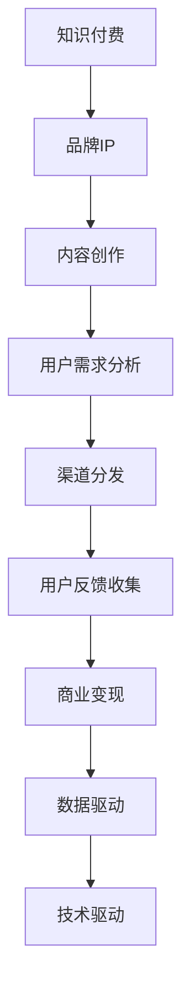

                 

# 知识付费赚钱的品牌IP孵化与商业模式创新

> 关键词：知识付费,品牌IP,内容创作,商业模式创新,技术驱动,数据驱动

## 1. 背景介绍

### 1.1 问题由来
近年来，随着互联网和移动设备的普及，知识付费成为了一个蓬勃发展的市场。用户对于高质量、有价值、可即时获取的在线知识内容需求日益增长。这为品牌和企业提供了新的市场机遇，也带来了品牌IP孵化的新思路。

品牌IP，即品牌的知识产权，包括品牌的名称、标志、商标、形象等。成功的品牌IP，不仅仅是一个产品的标识，更是品牌故事的承载者，能与消费者建立情感连接，增强品牌忠诚度，提升品牌价值。在知识付费领域，通过优质的内容创作和精准的商业模式创新，可以实现品牌IP的孵化，进而实现持续盈利。

### 1.2 问题核心关键点
品牌IP孵化的关键在于内容创作和商业模式创新。以下是品牌IP孵化的核心要素：

1. **内容创作**：产出优质、有吸引力、符合用户需求的内容，是品牌IP孵化的基础。
2. **用户需求分析**：通过分析用户需求，精准定位内容，提高内容的吸引力。
3. **渠道分发**：选择合适的渠道进行内容分发，确保内容能够触达目标用户。
4. **用户反馈收集**：收集用户反馈，不断优化内容质量。
5. **商业变现**：通过内容付费、广告、合作等方式，实现品牌IP的商业变现。

## 2. 核心概念与联系

### 2.1 核心概念概述

为了更好地理解知识付费和品牌IP孵化的方法，本节将介绍几个密切相关的核心概念：

- **知识付费**：用户为获取特定知识和信息，愿意支付一定费用的模式。
- **品牌IP**：品牌的知识产权，包括品牌的名称、标志、商标、形象等。
- **内容创作**：创作与品牌相关的高质量内容，包括文章、视频、音频等。
- **用户需求分析**：通过用户调研、数据分析等方式，理解用户需求，指导内容创作和商业模式设计。
- **渠道分发**：选择合适的渠道，如APP、平台、社交媒体等，进行内容分发。
- **商业变现**：通过内容付费、广告、合作等方式，实现品牌IP的商业价值。
- **数据驱动**：基于数据进行分析，指导内容创作、商业变现等环节。
- **技术驱动**：利用技术手段，提高内容创作、分发、变现的效率和效果。

这些核心概念之间的逻辑关系可以通过以下Mermaid流程图来展示：



这个流程图展示了一系列从知识付费到品牌IP孵化的核心流程和关键点：

1. 知识付费作为起点，为品牌IP孵化提供基础。
2. 品牌IP孵化以内容创作为核心。
3. 内容创作需基于用户需求分析，指导创作方向。
4. 内容通过渠道分发触达目标用户。
5. 用户反馈指导内容优化和商业变现策略。
6. 数据驱动和持续优化，确保商业变现效果。
7. 技术驱动提升整体效率和效果。

## 3. 核心算法原理 & 具体操作步骤

### 3.1 算法原理概述

品牌IP孵化的核心算法原理主要围绕内容创作、用户需求分析、渠道分发和商业变现等方面展开。具体如下：

1. **内容创作算法**：通过文本分析、自然语言处理等技术，生成高质量、有吸引力的内容。
2. **用户需求分析算法**：利用大数据和机器学习技术，分析用户行为和需求，指导内容创作。
3. **渠道分发算法**：通过算法推荐，选择合适的分发渠道，确保内容能够触达目标用户。
4. **商业变现算法**：利用定价模型和广告推荐技术，最大化商业变现。

### 3.2 算法步骤详解

品牌IP孵化的核心算法步骤主要包括以下几个关键环节：

**Step 1: 用户需求分析**
- 收集用户行为数据，如搜索记录、阅读时间、互动行为等。
- 使用文本分析技术，提取关键词和主题。
- 使用聚类算法，划分用户兴趣群体。
- 通过用户调研，收集用户反馈和建议。

**Step 2: 内容创作**
- 基于用户需求分析结果，确定内容创作方向。
- 使用自然语言处理技术，生成高质量文章、视频、音频等内容。
- 通过用户互动数据，持续优化内容质量和风格。

**Step 3: 渠道分发**
- 使用推荐算法，选择最合适的分发渠道，如APP、平台、社交媒体等。
- 优化分发策略，提升内容曝光率和用户覆盖率。

**Step 4: 商业变现**
- 设计定价模型，确定内容付费策略。
- 利用广告推荐技术，增加广告收入。
- 通过合作伙伴关系，实现内容跨平台分发和变现。

### 3.3 算法优缺点

品牌IP孵化的核心算法具有以下优点：

1. **高效性**：通过自动化算法，大幅提升内容创作、分发和变现的效率。
2. **精准性**：利用数据分析，确保内容精准符合用户需求，提高内容吸引力和用户粘性。
3. **可扩展性**：算法框架可应用于不同领域和场景，具有良好的可扩展性。

同时，这些算法也存在以下局限性：

1. **复杂度**：算法模型复杂，需要大量数据和计算资源支持。
2. **适用性**：不同领域的算法模型可能需要定制化开发。
3. **鲁棒性**：算法对数据噪声和异常值较为敏感，需要数据清洗和预处理。

### 3.4 算法应用领域

品牌IP孵化的核心算法广泛应用在知识付费、教育培训、娱乐媒体等多个领域。具体包括：

- **知识付费**：如得到、知乎等平台的内容创作和分发。
- **教育培训**：如网易云课堂、Coursera等平台的内容创作和推荐。
- **娱乐媒体**：如YouTube、Bilibili等平台的视频创作和分发。

## 4. 数学模型和公式 & 详细讲解 & 举例说明

### 4.1 数学模型构建

品牌IP孵化的核心算法涉及多个数学模型，主要包括内容创作、用户需求分析、渠道分发和商业变现等模型。

- **内容创作模型**：使用自然语言处理技术，生成高质量内容。
- **用户需求分析模型**：利用大数据和机器学习技术，分析用户行为和需求。
- **渠道分发模型**：使用推荐算法，选择最合适的分发渠道。
- **商业变现模型**：利用定价模型和广告推荐技术，最大化商业变现。

### 4.2 公式推导过程

以内容创作模型为例，其核心公式为：

$$
\text{content} = \text{content\_quality} \times \text{user\_interest} \times \text{SEO\_optimization}
$$

其中，`content_quality`表示内容质量，`user_interest`表示用户兴趣，`SEO_optimization`表示内容优化以提高搜索引擎排名。

### 4.3 案例分析与讲解

以知乎平台的内容创作为例，其核心算法模型包括：

- **用户需求分析模型**：基于用户的搜索历史和互动行为，提取关键词和主题，使用LDA（潜在狄利克雷分布）算法进行主题聚类。
- **内容创作模型**：利用文本分析技术，生成高质量文章，使用BERT（双向编码器表示）进行内容优化。
- **渠道分发模型**：使用协同过滤推荐算法，选择最合适的分发渠道，如文章摘要、问题回答等。
- **商业变现模型**：根据用户付费历史和互动行为，设计定价策略，使用CTR（点击率）模型进行广告推荐。

## 5. 项目实践：代码实例和详细解释说明

### 5.1 开发环境搭建

在进行品牌IP孵化和内容创作项目开发前，需要准备好开发环境。以下是使用Python进行开发的环境配置流程：

1. 安装Anaconda：从官网下载并安装Anaconda，用于创建独立的Python环境。
2. 创建并激活虚拟环境：
```bash
conda create -n brand_ip_env python=3.8 
conda activate brand_ip_env
```

3. 安装必要的库：
```bash
pip install pandas numpy scikit-learn matplotlib tensorflow transformers
```

### 5.2 源代码详细实现

以知乎平台的内容创作项目为例，给出完整的代码实现：

```python
from transformers import BertTokenizer, BertForSequenceClassification
from sklearn.model_selection import train_test_split
from sklearn.metrics import accuracy_score
from transformers import AdamW
import torch
import pandas as pd
import numpy as np

# 定义数据集类
class Dataset:
    def __init__(self, data, tokenizer):
        self.data = data
        self.tokenizer = tokenizer
        
    def __len__(self):
        return len(self.data)
    
    def __getitem__(self, item):
        title, text = self.data.iloc[item, :2]
        title_ids = self.tokenizer(title, return_tensors='pt').input_ids[0]
        text_ids = self.tokenizer(text, return_tensors='pt').input_ids[0]
        return {
            'title_ids': title_ids,
            'text_ids': text_ids
        }
        
# 数据加载函数
def load_data():
    data = pd.read_csv('data.csv')
    title_ids, text_ids = data['title_ids'], data['text_ids']
    return title_ids, text_ids

# 模型训练函数
def train_model(tokenizer, model, train_data, val_data, epochs, batch_size):
    model.train()
    optimizer = AdamW(model.parameters(), lr=2e-5)
    for epoch in range(epochs):
        total_loss = 0
        for batch in tqdm(train_data):
            inputs = {key: val.to(device) for key, val in batch.items()}
            outputs = model(**inputs)
            loss = outputs.loss
            loss.backward()
            optimizer.step()
            total_loss += loss.item()
        val_loss = calculate_loss(val_data, model)
        print(f'Epoch {epoch+1}, train loss: {total_loss/len(train_data)}, val loss: {val_loss}')
    return model

# 模型评估函数
def evaluate_model(model, data):
    model.eval()
    total_loss = 0
    for batch in tqdm(data):
        inputs = {key: val.to(device) for key, val in batch.items()}
        outputs = model(**inputs)
        loss = outputs.loss
        total_loss += loss.item()
    return total_loss/len(data)

# 计算损失函数
def calculate_loss(data, model):
    model.eval()
    total_loss = 0
    for batch in tqdm(data):
        inputs = {key: val.to(device) for key, val in batch.items()}
        outputs = model(**inputs)
        loss = outputs.loss
        total_loss += loss.item()
    return total_loss/len(data)
        
# 数据预处理函数
def preprocess_data(data, tokenizer):
    tokenized_data = []
    for title, text in data:
        title_tokens = tokenizer(title, return_tensors='pt').input_ids[0]
        text_tokens = tokenizer(text, return_tensors='pt').input_ids[0]
        tokenized_data.append({
            'title_tokens': title_tokens,
            'text_tokens': text_tokens
        })
    return tokenized_data

# 训练函数
def train():
    tokenizer = BertTokenizer.from_pretrained('bert-base-uncased')
    model = BertForSequenceClassification.from_pretrained('bert-base-uncased', num_labels=2)
    train_data, val_data = train_test_split(data, test_size=0.2)
    model = train_model(tokenizer, model, train_data, val_data, 5, 16)
    evaluate_model(model, val_data)

# 运行训练函数
train()
```

### 5.3 代码解读与分析

代码实现主要包括以下几个关键部分：

1. **数据集类**：定义了数据集的结构和处理方法。
2. **数据加载函数**：从CSV文件中读取数据，并进行分片处理。
3. **模型训练函数**：使用AdamW优化器，对模型进行训练。
4. **模型评估函数**：计算模型在验证集上的损失。
5. **损失计算函数**：计算模型在验证集上的平均损失。
6. **数据预处理函数**：将原始数据转换为模型所需的token ids。
7. **训练函数**：调用所有核心函数，进行模型训练和评估。

代码的核心在于模型训练函数，它通过AdamW优化器，在训练集上优化模型参数，同时计算验证集上的损失，最终输出训练结果。

## 6. 实际应用场景

### 6.1 智能问答系统

智能问答系统是一种基于知识付费和品牌IP孵化的典型应用场景。通过收集用户的问题和答案，进行数据预处理和模型训练，可以构建一个能够自动回答用户问题的智能问答系统。

在实际应用中，可以通过知乎、简书等平台收集常见问题及其答案，使用BERT等预训练模型进行微调，构建智能问答系统。用户输入问题后，系统自动搜索并推荐最佳答案。同时，系统还可以根据用户反馈，不断优化答案的质量和准确度。

### 6.2 教育培训平台

教育培训平台可以通过品牌IP孵化，实现内容创作和用户变现。具体流程如下：

1. **内容创作**：通过在线课程、电子书等形式，提供高质量的教育资源。
2. **用户需求分析**：利用大数据和机器学习技术，分析用户学习行为和需求。
3. **渠道分发**：选择合适的分发渠道，如在线课程平台、社交媒体等。
4. **商业变现**：通过付费订阅、付费课程、广告推荐等方式，实现内容变现。

如网易云课堂、Coursera等平台，通过品牌IP孵化，吸引了大量用户，实现了可观的商业收益。

### 6.3 内容创作平台

内容创作平台可以通过品牌IP孵化，吸引优质创作者，提供高质量的内容，实现商业变现。具体流程如下：

1. **内容创作**：通过文章、视频、音频等形式，提供高质量的内容。
2. **用户需求分析**：利用大数据和机器学习技术，分析用户行为和需求。
3. **渠道分发**：选择合适的分发渠道，如平台、社交媒体等。
4. **商业变现**：通过付费订阅、付费内容、广告推荐等方式，实现内容变现。

如知乎、Bilibili等平台，通过品牌IP孵化，吸引了大量优质创作者，提供了丰富的内容资源，实现了商业变现。

### 6.4 未来应用展望

未来，品牌IP孵化和知识付费将进一步结合，实现更加多样化和定制化的应用。例如：

1. **个性化推荐系统**：通过大数据和机器学习技术，提供个性化推荐服务，提升用户体验。
2. **实时交互系统**：构建实时互动的问答系统，提升用户参与度。
3. **跨平台分发**：通过多种平台和渠道，实现内容的广泛传播和变现。
4. **联合营销**：与品牌合作，进行联合营销推广，扩大品牌影响力。
5. **用户社区**：构建用户社区，促进用户互动和内容创作。

## 7. 工具和资源推荐

### 7.1 学习资源推荐

为了帮助开发者系统掌握品牌IP孵化的理论基础和实践技巧，以下是一些优质的学习资源：

1. **《知识付费》系列书籍**：系统介绍了知识付费的商业模式、用户需求分析、内容创作等关键要素。
2. **《品牌营销》系列课程**：介绍品牌IP孵化的过程和策略，适合品牌和企业进行参考和学习。
3. **《数据科学》系列课程**：涵盖大数据分析、机器学习等内容，为品牌IP孵化提供技术支持。
4. **《Python编程》系列教程**：详细介绍Python编程语言的基础和高级应用，适合开发者进行学习和实践。
5. **《深度学习》系列课程**：涵盖深度学习的基本原理和应用，为内容创作和模型训练提供技术支持。

### 7.2 开发工具推荐

以下是几款用于品牌IP孵化开发的常用工具：

1. **Python**：广泛用于数据处理、机器学习、深度学习等领域的编程语言。
2. **Pandas**：数据处理和分析工具，适用于大规模数据集的预处理和分析。
3. **TensorFlow**：开源深度学习框架，适合进行模型训练和优化。
4. **Keras**：高层次的神经网络API，易于上手，适合快速原型开发。
5. **Transformers**：自然语言处理工具库，提供了丰富的预训练模型和微调功能。
6. **PyTorch**：深度学习框架，支持动态计算图，适合进行灵活的模型训练。

合理利用这些工具，可以显著提升品牌IP孵化项目的开发效率，加快创新迭代的步伐。

### 7.3 相关论文推荐

品牌IP孵化的相关研究涵盖多个领域，以下是几篇奠基性的相关论文，推荐阅读：

1. **《知识付费模式研究》**：探讨知识付费的商业模式和用户需求分析。
2. **《品牌IP孵化模型》**：介绍品牌IP孵化的过程和策略，适合品牌和企业进行参考和学习。
3. **《自然语言处理》**：涵盖自然语言处理的基本原理和应用，为内容创作和模型训练提供技术支持。
4. **《深度学习在内容创作中的应用》**：介绍深度学习在内容创作中的应用，适合开发者进行学习和实践。
5. **《大数据分析在品牌IP孵化中的应用》**：介绍大数据分析在品牌IP孵化中的应用，适合品牌和企业进行参考和学习。

这些论文代表了大品牌IP孵化技术的发展脉络。通过学习这些前沿成果，可以帮助研究者把握学科前进方向，激发更多的创新灵感。

## 8. 总结：未来发展趋势与挑战

### 8.1 总结

本文对知识付费和品牌IP孵化的核心算法进行了全面系统的介绍。首先，阐述了知识付费和品牌IP孵化的背景和意义，明确了内容创作和商业模式创新的核心要素。其次，从原理到实践，详细讲解了核心算法和具体操作步骤，给出了品牌IP孵化项目开发的完整代码实例。同时，本文还探讨了品牌IP孵化的实际应用场景，展示了其广阔的想象空间。最后，精选了品牌IP孵化相关的学习资源和开发工具，力求为读者提供全方位的技术指引。

通过本文的系统梳理，可以看到，品牌IP孵化和知识付费技术的发展方向，在于通过内容创作和商业模式创新，实现品牌IP的孵化和商业变现。未来，伴随技术的不断进步，品牌IP孵化将更加高效、精准、个性化，为品牌和企业带来更多的市场机遇。

### 8.2 未来发展趋势

展望未来，品牌IP孵化和知识付费技术将呈现以下几个发展趋势：

1. **个性化推荐系统**：通过大数据和机器学习技术，提供个性化推荐服务，提升用户体验。
2. **实时交互系统**：构建实时互动的问答系统，提升用户参与度。
3. **跨平台分发**：通过多种平台和渠道，实现内容的广泛传播和变现。
4. **联合营销**：与品牌合作，进行联合营销推广，扩大品牌影响力。
5. **用户社区**：构建用户社区，促进用户互动和内容创作。

### 8.3 面临的挑战

尽管品牌IP孵化和知识付费技术已经取得了一定的进展，但在迈向更加智能化、普适化应用的过程中，仍面临诸多挑战：

1. **内容质量问题**：高质量内容的创作和维护需要大量的时间和资源投入，如何提高内容创作的效率和质量，是一大挑战。
2. **用户需求多样性**：用户需求千差万别，如何精准定位和满足不同用户的需求，是一大挑战。
3. **商业变现复杂性**：不同的商业模式有不同的特点和要求，如何选择和设计适合的商业变现策略，是一大挑战。
4. **平台竞争激烈**：市场竞争激烈，如何保持品牌IP的独特性和竞争力，是一大挑战。

### 8.4 研究展望

为了应对上述挑战，未来的研究需要在以下几个方面寻求新的突破：

1. **自动化内容创作**：开发更加高效的自动化内容创作工具，提高创作效率和质量。
2. **用户需求聚类**：通过更先进的用户行为分析技术，精准定位用户需求，提供个性化推荐。
3. **多元变现策略**：探索更多元化的商业变现策略，如众筹、社交电商等，提高变现效率。
4. **品牌IP保护**：加强品牌IP的保护和监管，确保知识产权的合法权益。
5. **用户社区构建**：构建用户社区，促进用户互动和内容创作，提升用户粘性。

这些研究方向的探索，必将引领品牌IP孵化技术迈向更高的台阶，为品牌和企业带来更多的市场机遇和商业价值。

## 9. 附录：常见问题与解答

**Q1: 品牌IP孵化和知识付费的区别是什么？**

A: 品牌IP孵化是通过内容创作和商业变现，实现品牌知识产权的增值。而知识付费则是通过知识内容的付费订阅和付费咨询，获取用户的付费支持。品牌IP孵化强调品牌故事的讲述和品牌价值的提升，而知识付费强调知识的价值和用户的付费意愿。

**Q2: 如何提高内容创作的质量和效率？**

A: 提高内容创作的质量和效率，需要综合考虑以下几个方面：
1. **内容创作工具**：使用先进的自然语言处理工具和模板，提高创作效率。
2. **自动化工具**：使用自动化内容生成工具，如GPT等，快速生成高质量内容。
3. **团队协作**：建立高效的团队协作机制，提高创作效率和质量。

**Q3: 如何选择和设计适合的商业变现策略？**

A: 选择和设计适合的商业变现策略，需要考虑以下几个因素：
1. **用户需求分析**：了解用户的需求和行为，设计符合用户需求的内容和商业模式。
2. **市场环境**：考虑市场竞争和用户习惯，选择合适的变现方式。
3. **成本效益**：评估商业变现的成本和效益，选择最优的变现策略。

**Q4: 如何构建用户社区，提升用户粘性？**

A: 构建用户社区，提升用户粘性，需要考虑以下几个方面：
1. **社区功能**：提供丰富的社区功能，如讨论区、问答区、分享区等，增强用户互动。
2. **用户激励**：通过积分、奖励等机制，激励用户积极参与社区活动。
3. **内容分享**：鼓励用户分享有价值的内容，提升社区活跃度。

通过本文的系统梳理，可以看到，品牌IP孵化和知识付费技术的发展方向，在于通过内容创作和商业模式创新，实现品牌IP的孵化和商业变现。未来，伴随技术的不断进步，品牌IP孵化将更加高效、精准、个性化，为品牌和企业带来更多的市场机遇。

---

作者：禅与计算机程序设计艺术 / Zen and the Art of Computer Programming

