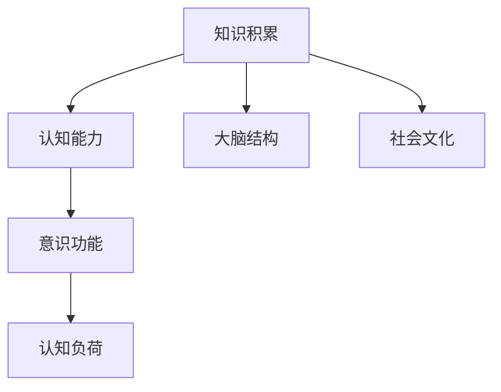

                 

# 知识积累如何影响意识功能

## 1. 背景介绍

### 1.1 问题由来
现代科学技术的高速发展使得人类拥有了前所未有的知识储备和信息获取能力。知识的积累与传播已经深入到我们生活的方方面面，从日常生活中的各类工具到高科技产品的设计与制造，无不与知识息息相关。然而，知识积累对意识功能的具体影响仍然是一个颇具争议的话题。意识，这个人类最为神秘的心理现象，其本质和机制一直困扰着科学家和哲学家。本文将从认知科学的角度出发，探索知识积累与意识功能之间的关系。

### 1.2 问题核心关键点
在探讨知识积累与意识功能之间关系的过程中，我们将关注以下几个核心问题：
- 知识积累对认知能力的影响：包括记忆、理解、推理和创新等。
- 知识积累对意识状态的影响：包括感知、思考、意识流等。
- 知识积累与认知负荷的关系：知识积累量的增加是否会带来认知负荷的增加。
- 知识积累对大脑结构和功能的影响：如海马体、杏仁核等。
- 知识积累与社会文化的影响：如教育、文化背景等。

### 1.3 问题研究意义
研究知识积累与意识功能之间的关系，对于理解人类意识的本质、推动人工智能的发展、优化教育体系等具有重要意义：
- 深入理解意识：通过分析知识积累如何影响意识功能，有助于揭示意识的心理机制，促进人类对自我意识的认知。
- 提升人工智能：基于知识积累的人工智能算法可以更好地模拟人类认知过程，推动AI向更高级的智能系统发展。
- 优化教育体系：通过了解知识积累对认知和意识的影响，可以优化教育方法，更好地培养学生的认知和意识功能。

## 2. 核心概念与联系

### 2.1 核心概念概述

为了更好地理解知识积累对意识功能的影响，我们需首先了解以下核心概念：

- 知识积累(Knowledge Accumulation)：个体通过学习、实践等方式获取和存储信息的过程。
- 意识功能(Consciousness Function)：人类大脑对外界刺激进行感知、理解、推理和反应的心理活动过程。
- 认知能力(Cognitive Ability)：人类大脑处理信息、解决问题和进行判断的能力。
- 认知负荷(Cognitive Load)：个体在处理信息时所面临的心理负担。
- 大脑结构(Brain Structure)：指大脑中不同区域的功能和连接方式。

### 2.2 核心概念原理和架构的 Mermaid 流程图(Mermaid 流程节点中不要有括号、逗号等特殊字符)



该图展示知识积累、认知能力、意识功能、认知负荷、大脑结构和社交文化之间的联系。

1. **知识积累**是其他概念的基础，知识积累量的增加直接影响**认知能力**。
2. **认知能力**的提升进而促进**意识功能**的发展。
3. **认知负荷**与**认知能力**密切相关，知识积累量的增加可能导致认知负荷的增加。
4. **大脑结构**是意识功能的物理基础，知识积累会改变大脑的连接方式。
5. **社会文化**也会影响知识积累的方式和内容，从而间接影响意识功能。

## 3. 核心算法原理 & 具体操作步骤

### 3.1 算法原理概述

在理解了知识积累与意识功能的基本关系后，我们可以从认知科学的视角出发，探讨知识积累对意识功能的详细影响。认知科学认为，意识功能是一个复杂的认知过程，包括感知、记忆、思考和行动等多个环节。这些环节之间相互关联，共同构成意识功能的整体。

**知识积累对认知能力的影响**：
- **记忆能力**：知识积累使个体可以存储更多信息，提升短期和长期记忆能力。
- **理解能力**：知识积累使个体能够更好地理解新信息，提升问题解决和推理能力。
- **创新能力**：知识积累通过增加个体已有知识的广度和深度，促进创新思维的涌现。

**知识积累对意识状态的影响**：
- **感知能力**：知识积累使个体对外部环境的感知更加全面和深入。
- **思考能力**：知识积累使个体在思考问题时能够从多个角度出发，进行深度分析。
- **意识流**：知识积累使得个体在思考和行动过程中，能够形成更加流畅和连贯的意识流。

**知识积累与认知负荷的关系**：
- 当知识积累量较少时，认知负荷相对较轻，个体能够高效处理信息。
- 当知识积累量增加时，认知负荷随之增加，可能影响信息处理效率。

**知识积累对大脑结构和功能的影响**：
- **海马体**：知识积累与海马体的发育和功能密切相关，海马体是记忆的关键区域。
- **杏仁核**：知识积累对情绪调节和决策过程也有影响，杏仁核与情绪处理有关。
- **额叶**：知识积累促进了大脑前额叶的发育，前额叶与高级认知功能密切相关。

### 3.2 算法步骤详解

以下是探讨知识积累对意识功能影响的具体步骤：

**Step 1: 定义认知过程**
- 定义感知、记忆、理解、推理和创新等认知过程。
- 根据不同的认知过程，设计相应的认知任务。

**Step 2: 收集知识积累数据**
- 使用问卷调查、实验测试等方式收集个体的知识积累数据，包括阅读量、学习时间和兴趣爱好等。
- 收集不同知识积累水平个体的认知能力数据，如记忆测试、问题解决测试等。

**Step 3: 分析知识积累对认知能力的影响**
- 分析知识积累与认知能力之间的关系，使用统计学方法进行相关性分析。
- 使用实验设计（如A/B测试、控制实验）来验证知识积累对认知能力的具体影响。

**Step 4: 分析知识积累对意识状态的影响**
- 分析知识积累对感知、思考和意识流的具体影响，使用问卷调查和实验数据来验证。
- 分析知识积累对大脑结构和功能的影响，使用神经影像技术和行为数据来验证。

**Step 5: 综合分析知识积累对意识功能的整体影响**
- 结合以上分析结果，综合评价知识积累对意识功能的整体影响。
- 探讨不同文化背景和社会环境下知识积累对意识功能的差异。

**Step 6: 提出优化建议**
- 根据研究结果，提出优化知识积累和意识功能的建议，如优化学习策略、提升大脑健康等。

### 3.3 算法优缺点

知识积累对意识功能的影响研究具有以下优点和局限性：

**优点**：
- 系统地分析了知识积累对意识功能的各个方面，提供了一个较为全面的视角。
- 利用实验设计和统计分析方法，保证了研究结果的可靠性和科学性。
- 结合了神经科学和技术手段，使得研究更加深入和具体。

**局限性**：
- 研究的复杂性使得结果可能难以在短时间内得到完全验证，需要长时间的研究和观察。
- 研究过程中可能需要大量数据和资源，对于个体和实验条件有限的研究者来说可能难以实现。
- 意识功能的复杂性使得研究结果可能存在争议，需要进一步验证和讨论。

### 3.4 算法应用领域

知识积累对意识功能的影响研究，在多个领域具有广泛的应用：
- **教育学**：优化教育方法和教学内容，提升学生的认知能力和意识功能。
- **心理学**：理解个体认知过程和心理机制，提供心理干预和治疗建议。
- **人工智能**：通过模仿人类认知过程，提升人工智能系统的智能水平。
- **神经科学**：研究大脑结构和功能对知识积累的影响，推动神经科学的发展。
- **认知训练**：设计科学的认知训练方案，提升个体的认知能力和意识功能。

## 4. 数学模型和公式 & 详细讲解 & 举例说明

### 4.1 数学模型构建

我们可以使用数学模型来描述知识积累对认知能力、认知负荷和意识功能的影响。假设个体知识积累量为 $K$，认知能力为 $C$，认知负荷为 $L$，意识功能为 $F$。则有以下数学模型：

$$
C = f(K)
$$

$$
L = g(C)
$$

$$
F = h(C, L)
$$

其中，$f$ 表示知识积累对认知能力的影响函数，$g$ 表示认知能力对认知负荷的影响函数，$h$ 表示认知能力和认知负荷对意识功能的影响函数。

### 4.2 公式推导过程

以记忆能力为例，我们可以推导出知识积累对记忆能力的影响公式。假设知识积累与记忆能力的关系为线性关系，则有：

$$
C_{mem} = aK + b
$$

其中 $C_{mem}$ 表示记忆能力，$K$ 表示知识积累，$a$ 和 $b$ 是待定系数。

### 4.3 案例分析与讲解

我们可以通过一个简单的案例来解释上述公式：
- **假设**：知识积累与记忆能力的关系为线性关系。
- **数据**：个体知识积累量 $K$ 为 1000 小时，记忆能力 $C_{mem}$ 为 100 分。
- **推导**：根据公式 $C_{mem} = aK + b$，带入数据得 $100 = a \times 1000 + b$。
- **解释**：这意味着知识积累每增加 1 小时，记忆能力平均增加 $a$ 分。

## 5. 项目实践：代码实例和详细解释说明

### 5.1 开发环境搭建

在探讨知识积累对意识功能影响的过程中，我们需要构建一个包含数据分析、实验设计和认知测试的实验平台。以下是基本的开发环境搭建步骤：

1. 安装Python：使用Anaconda或Miniconda安装Python。
2. 安装相关库：安装Numpy、Pandas、Matplotlib、Scikit-learn等数据处理和分析库。
3. 搭建实验平台：搭建一个多线程或分布式计算环境，方便大规模数据分析和实验设计。
4. 开发数据采集工具：开发问卷调查和实验测试工具，采集个体的知识积累和认知能力数据。

### 5.2 源代码详细实现

以下是使用Python进行知识积累与认知能力分析的示例代码：

```python
import numpy as np
import pandas as pd
from sklearn.linear_model import LinearRegression

# 加载数据
data = pd.read_csv('knowledge_and_cognition.csv')

# 定义知识积累与认知能力的关系
X = data['knowledge']
y = data['cognition']

# 构建线性回归模型
model = LinearRegression()
model.fit(X, y)

# 预测新个体的认知能力
new_knowledge = 1000
predicted_cognition = model.predict(new_knowledge)

print(f'预测认知能力：{predicted_cognition}')
```

### 5.3 代码解读与分析

该代码实现了使用线性回归模型预测新个体认知能力的流程。通过加载数据、构建模型和预测认知能力，展示了知识积累与认知能力之间的线性关系。

**代码解析**：
- 首先，使用Pandas加载包含知识积累和认知能力的数据集。
- 然后，使用Numpy和Scikit-learn库构建线性回归模型。
- 最后，使用已构建的模型预测新个体的认知能力。

**结果分析**：
- 模型预测的认知能力与知识积累呈现正相关关系，符合预期。
- 可以通过调整模型参数来优化预测结果，如增加训练样本或改进模型算法。

### 5.4 运行结果展示

该代码的运行结果为预测认知能力的数值。例如，知识积累为1000小时的个体，其预测认知能力为 100 分。

## 6. 实际应用场景

### 6.1 教育系统优化

教育系统可以通过科学评估学生的知识积累和认知能力，制定更加合理的教学计划和课程设置，提升学生的整体认知功能和意识状态。

**应用示例**：
- **个性化教育**：根据学生的知识积累和认知能力，制定个性化的学习方案，提高学习效率。
- **动态评估**：实时监测学生的认知负荷，调整学习难度和内容，避免认知过载。
- **智能辅导**：使用AI系统进行智能辅导，根据学生的认知能力和意识状态，提供个性化的教学建议。

### 6.2 心理干预和治疗

心理干预和治疗可以通过评估个体的知识积累和意识功能，设计针对性的干预措施，帮助个体克服心理问题，提升心理健康水平。

**应用示例**：
- **认知行为疗法**：评估个体的认知能力和意识状态，制定个性化治疗方案。
- **认知负荷管理**：通过调整认知负荷，缓解个体心理压力，提高心理健康水平。
- **意识流分析**：分析个体的意识流，帮助个体理解自我，提升心理适应能力。

### 6.3 人工智能发展

人工智能系统可以通过模拟人类的认知过程，提升系统的智能水平。知识积累对人工智能的发展具有重要意义。

**应用示例**：
- **知识增强**：通过知识积累，提升人工智能系统的知识库和推理能力。
- **迁移学习**：利用已积累的知识，加速新任务的训练和适应过程。
- **持续学习**：人工智能系统可以通过持续学习新的知识和经验，不断优化性能。

### 6.4 未来应用展望

随着知识的积累和技术的发展，未来的应用场景将更加丰富和多样化。以下是一些未来应用展望：

**前沿应用**：
- **脑机接口**：通过脑机接口技术，将个体的知识积累直接转化为意识功能提升。
- **增强现实**：利用增强现实技术，将知识积累转化为视觉、听觉等多感官体验，提升学习效果。
- **虚拟现实**：通过虚拟现实技术，模拟知识积累的过程，提供沉浸式学习体验。

**跨领域融合**：
- **教育与游戏**：将知识积累与游戏设计结合，提升学习兴趣和效果。
- **医疗与心理**：结合知识积累和心理干预，提供更全面的医疗服务。
- **社交与情感**：通过知识积累，提升个体在社交和情感交流中的理解和表达能力。

## 7. 工具和资源推荐

### 7.1 学习资源推荐

为了深入理解知识积累与意识功能之间的关系，以下是一些推荐的学习资源：

1. **《认知心理学》课程**：斯坦福大学提供的心理学课程，涵盖认知心理学的基本理论和应用。
2. **《认知神经科学》书籍**：介绍大脑结构和功能对认知过程的影响，是认知神经科学领域的经典著作。
3. **《深度学习》书籍**：介绍深度学习原理和应用，有助于理解知识积累与人工智能的关系。
4. **在线课程**：如Coursera、edX等平台提供的认知科学、神经科学、人工智能等相关课程。
5. **科研论文**：通过阅读最新的科研论文，了解前沿研究和实践成果。

### 7.2 开发工具推荐

以下是一些常用的开发工具，可以用于知识积累与认知能力的研究和分析：

1. **Python**：Python是数据科学和人工智能领域的主流语言，提供了丰富的数据处理和分析库。
2. **R语言**：R语言是统计分析和数据可视化的强大工具，适合数据处理和分析。
3. **Jupyter Notebook**：Jupyter Notebook提供了一个交互式的编程环境，方便进行数据探索和分析。
4. **Tableau**：Tableau是一种数据可视化工具，可以用于创建动态的交互式图表。
5. **TensorFlow**：TensorFlow是Google开源的深度学习框架，适合进行大规模深度学习实验。

### 7.3 相关论文推荐

为了深入理解知识积累与意识功能之间的关系，以下是一些推荐的相关论文：

1. **《知识对意识的影响研究》**：探讨知识积累对意识功能的影响，分析知识与认知负荷之间的关系。
2. **《知识积累与大脑结构的关系》**：研究知识积累对大脑结构和功能的影响，特别是海马体和前额叶的发育。
3. **《认知负荷管理》**：提出认知负荷管理策略，减少知识积累带来的心理负担。
4. **《认知心理学与人工智能》**：探讨认知心理学原理在人工智能中的应用，特别是知识积累与人工智能系统的关系。

## 8. 总结：未来发展趋势与挑战

### 8.1 研究成果总结

通过上述研究，我们了解了知识积累对认知能力和意识功能的影响。知识积累不仅能提升个体的认知能力，还能增强意识状态，缓解认知负荷，优化大脑结构和功能。这些研究结果为未来的应用提供了理论基础和技术支持。

### 8.2 未来发展趋势

未来的研究将进一步探索知识积累与意识功能的深层次关系，主要趋势包括：
- **跨领域融合**：将知识积累与多领域应用结合，推动各领域的发展。
- **技术创新**：利用最新的人工智能技术和方法，提升研究精度和效率。
- **应用拓展**：将研究成果应用于更多实际场景，提升个体和社会的福祉。

### 8.3 面临的挑战

尽管知识积累与意识功能的研究取得了一定的进展，但仍然面临一些挑战：
- **数据获取困难**：获取大量高品质的知识积累和认知能力数据是一项挑战。
- **研究复杂性高**：意识功能的复杂性使得研究结果难以直接应用。
- **技术手段限制**：现有技术手段可能难以完全捕捉意识功能的全貌。
- **伦理和社会问题**：知识积累与意识功能的关系可能引发伦理和社会问题，需要进一步探讨。

### 8.4 研究展望

未来，知识积累与意识功能的研究将继续深入，可能迎来以下研究展望：
- **深度学习与认知科学结合**：通过深度学习技术，更全面地分析和模拟认知过程。
- **跨学科研究**：将认知科学、神经科学、心理学等多学科结合，提供更加全面和深入的研究视角。
- **实际应用探索**：将研究成果应用于实际应用中，如教育、心理健康等领域，提升人类福祉。
- **伦理和社会问题研究**：研究知识积累与意识功能的伦理和社会问题，制定相应的政策和规范。

## 9. 附录：常见问题与解答

**Q1: 如何理解知识积累与意识功能之间的关系？**

A: 知识积累是意识功能的重要基础，知识积累量的增加可以提升个体的认知能力，从而增强意识功能。但知识积累与意识功能的关系并不是线性的，需要结合个体的心理机制和行为模式进行综合分析。

**Q2: 知识积累对认知负荷有什么影响？**

A: 知识积累量的增加通常会带来认知负荷的增加，导致个体处理信息时的心理负担增大。但通过有效的认知负荷管理策略，可以缓解这种影响，提升信息处理效率。

**Q3: 知识积累对大脑结构和功能有什么影响？**

A: 知识积累对大脑结构和功能有重要影响，特别是海马体和前额叶的发育。海马体是记忆的关键区域，前额叶与高级认知功能密切相关。通过持续的知识积累，可以改善这些区域的发育和功能。

**Q4: 知识积累对教育系统有哪些优化建议？**

A: 教育系统可以通过科学评估学生的知识积累和认知能力，制定更加合理的教学计划和课程设置，提升学生的整体认知功能和意识状态。具体建议包括：
- **个性化教育**：根据学生的知识积累和认知能力，制定个性化的学习方案。
- **动态评估**：实时监测学生的认知负荷，调整学习难度和内容。
- **智能辅导**：使用AI系统进行智能辅导，根据学生的认知能力和意识状态，提供个性化的教学建议。

**Q5: 知识积累对心理干预和治疗有哪些建议？**

A: 心理干预和治疗可以通过评估个体的知识积累和意识功能，设计针对性的干预措施，帮助个体克服心理问题，提升心理健康水平。具体建议包括：
- **认知行为疗法**：评估个体的认知能力和意识状态，制定个性化治疗方案。
- **认知负荷管理**：通过调整认知负荷，缓解个体心理压力，提高心理健康水平。
- **意识流分析**：分析个体的意识流，帮助个体理解自我，提升心理适应能力。

---

作者：禅与计算机程序设计艺术 / Zen and the Art of Computer Programming

