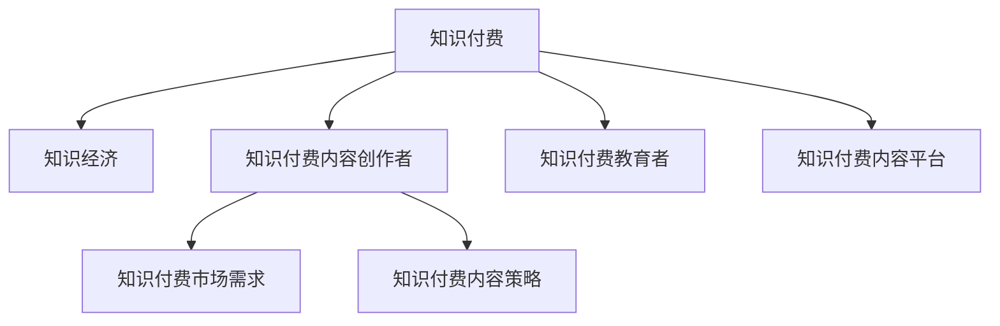

                 

# 知识经济时代下的知识付费创新人才培养模式

## 1. 背景介绍

### 1.1 问题由来

在知识经济时代，信息技术的飞速发展推动了知识传播和获取方式的变革。知识付费作为新兴的商业模式，凭借其高效率、低成本、高精准度的优势，迅速成为知识传播的主流方式之一。然而，知识付费产业的发展也面临着诸多挑战，其中最关键的难题之一就是高素质的知识付费内容创作者和教育者缺乏。

传统的教育体系和方法已经无法满足知识付费时代对于创新人才培养的需求。如何培养出具备前瞻性、创新性、实战性的知识付费内容创作者和教育者，成为摆在行业面前的一道难题。

### 1.2 问题核心关键点

知识付费领域对于创新人才的需求主要集中在以下几个方面：

- **知识获取与创造能力**：知识付费的本质是知识创造与知识获取的结合，因此创新人才必须具备强大的知识创造和获取能力。
- **市场洞察力**：了解市场趋势和用户需求，能快速把握知识付费领域的最新动态，灵活调整内容策略。
- **技术应用能力**：掌握先进的技术手段，包括大数据分析、人工智能、区块链等，提升知识付费产品的高效性、安全性和个性化。
- **品牌建设与营销能力**：创新人才需具备良好的品牌建设和市场推广能力，能够精准定位目标用户，提升内容市场竞争力。
- **持续学习与更新**：知识付费领域竞争激烈，创新人才需保持持续学习，不断更新知识和技能，保持市场领先地位。

### 1.3 问题研究意义

在知识经济时代，知识付费创新人才的培养对于推动产业发展、促进经济增长、提升社会知识水平具有重要意义：

- **推动产业发展**：知识付费行业的健康发展需要高素质的内容创作者和教育者，以确保产品的高质量和市场竞争力。
- **促进经济增长**：通过培育更多知识付费领域的专业人才，推动内容创新，增强知识传播效率，促进经济增长。
- **提升社会知识水平**：知识付费可以向更广泛的用户提供高质量的知识服务，提升全社会的知识水平和教育水平。
- **引导知识消费**：高素质的知识付费内容创作者能够引导用户进行科学、有效的知识消费，提升知识传播的精准性和有效性。

## 2. 核心概念与联系

### 2.1 核心概念概述

为了更好地理解知识付费创新人才培养模式，本文将介绍几个密切相关的核心概念：

- **知识付费**：指用户为获取知识或服务而支付费用的商业模式。知识付费覆盖内容范围广泛，包括在线教育、专业咨询、专业培训、知识社区等。
- **知识经济**：指以知识、信息、技术为核心生产要素的经济形态，知识付费是其重要表现形式。
- **知识付费内容创作者**：指通过平台发布高质量内容，向用户提供知识和服务的个人或团队。
- **知识付费教育者**：指通过知识付费平台提供教学服务，传授专业知识和技能，帮助用户提升自我能力的教育工作者。
- **知识付费内容平台**：指提供知识付费服务，连接内容创作者和用户的第三方平台，如得到、知乎、知识星球等。
- **知识付费市场需求**：指用户对于高质量、高效率、高精准度知识内容的需求，推动知识付费产业的蓬勃发展。
- **知识付费内容策略**：指内容创作者和教育者为满足用户需求，对内容产品进行规划、设计和推广的策略。

这些核心概念之间的逻辑关系可以通过以下Mermaid流程图来展示：



这个流程图展示了一些核心概念及其之间的关系：

1. 知识付费作为知识经济的一种表现形式，其发展受到知识经济的驱动。
2. 知识付费内容创作者和教育者，是知识付费产业的重要参与者，需要通过市场需求和内容策略，向用户提供优质的知识和教育服务。
3. 知识付费内容平台，作为中介，连接创作者和用户，推动知识付费市场的繁荣。
4. 知识付费市场需求，直接驱动内容创作者和教育者的创新与优化。
5. 知识付费内容策略，是内容创作者和教育者为满足用户需求，进行内容设计、推广的重要依据。

## 3. 核心算法原理 & 具体操作步骤

### 3.1 算法原理概述

知识付费创新人才的培养，本质上是一个多层次、多维度、动态化的教学过程。该过程需要结合教育心理学、信息技术、市场营销等领域的知识，通过科学的方法论和实践手段，不断优化教学策略，提升人才的创新能力和实战技能。

知识付费创新人才的培养模型可以抽象为“知识-技能-创新”三阶模型，其核心算法原理如下：

1. **知识获取与吸收**：通过课程学习、项目实践、案例分析等形式，提升学习者的知识储备和理解能力。
2. **技能训练与实践**：通过实验实训、项目实战、创新竞赛等形式，提升学习者的实战能力和应用能力。
3. **创新思维与创造**：通过创新方法论、团队合作、跨学科学习等形式，提升学习者的创新思维和创造能力。

### 3.2 算法步骤详解

知识付费创新人才培养的算法步骤如下：

1. **需求分析**：通过问卷调查、数据分析等手段，了解用户对知识付费内容的需求和偏好，确定人才培养的具体目标。
2. **课程设计**：根据需求分析结果，设计具有前瞻性、创新性、实战性的课程体系，涵盖知识获取、技能训练和创新思维三个维度。
3. **教学实施**：采用线上线下相结合的教学模式，通过互动式教学、项目制教学、混合式教学等形式，提升教学效果。
4. **项目实战**：组织学生参与实际项目，进行实战训练，提升实战能力和应用能力。
5. **创新指导**：通过创新方法论、团队合作、跨学科学习等形式，培养学生的创新思维和创造能力。
6. **评价反馈**：通过测验考试、项目评估、创新竞赛等手段，对学生进行全方位的评价，并根据反馈不断优化教学策略。

### 3.3 算法优缺点

知识付费创新人才培养算法具有以下优点：

- **适应性强**：结合知识付费市场需求和特点，能够灵活调整课程内容和教学策略。
- **实战性强**：通过项目实战和创新指导，提高学习者的实战能力和应用能力。
- **创新性高**：通过跨学科学习和团队合作，培养学习者的创新思维和创造能力。

同时，该算法也存在一些局限性：

- **资源投入大**：需要大量资金和资源支持，课程设计、教学实施、项目实战等环节都需要高成本投入。
- **时间周期长**：人才培养需要较长的周期，短期内难以看到显著效果。
- **个体差异大**：学生个体差异较大，不同学生对知识理解和掌握程度不同，需要个性化辅导。
- **市场变化快**：知识付费市场需求变化迅速，课程内容和教学策略需要不断更新，以适应市场变化。

### 3.4 算法应用领域

知识付费创新人才培养算法在多个领域都有广泛的应用：

- **在线教育**：在线教育平台通过线上课程和线下实践相结合的方式，培养知识付费内容创作者和教育者。
- **企业培训**：企业通过定制化的培训课程，提升员工的知识技能和创新能力，增强企业竞争力。
- **高校教育**：高校通过与知识付费平台合作，开展双学位、双认证项目，培养创新型人才。
- **职业培训**：职业培训机构通过项目实战和创新指导，提升学员的实战能力和创新思维。
- **跨领域教育**：跨领域教育项目通过融合不同学科的知识，培养具备跨领域能力的创新人才。

## 4. 数学模型和公式 & 详细讲解 & 举例说明

### 4.1 数学模型构建

知识付费创新人才培养的数学模型可以抽象为以下几个组成部分：

- **知识获取与吸收模型**：
  $$
  K_{获取} = K_{基础} + K_{拓展}
  $$
  其中 $K_{基础}$ 为基础知识，$K_{拓展}$ 为拓展知识。

- **技能训练与实践模型**：
  $$
  S_{训练} = S_{基础} + S_{实战}
  $$
  其中 $S_{基础}$ 为基本技能，$S_{实战}$ 为实战技能。

- **创新思维与创造模型**：
  $$
  I_{创新} = I_{基础} + I_{实战}
  $$
  其中 $I_{基础}$ 为创新基础，$I_{实战}$ 为创新实战。

### 4.2 公式推导过程

知识付费创新人才培养的公式推导过程如下：

- **知识获取与吸收模型推导**：
  $$
  K_{获取} = K_{基础} + K_{拓展} = (1-a)K_{总} + aK_{拓展}
  $$
  其中 $a$ 为拓展知识的比例，$K_{总}$ 为总知识量。

- **技能训练与实践模型推导**：
  $$
  S_{训练} = S_{基础} + S_{实战} = (1-b)S_{总} + bS_{实战}
  $$
  其中 $b$ 为实战技能的比例，$S_{总}$ 为总技能量。

- **创新思维与创造模型推导**：
  $$
  I_{创新} = I_{基础} + I_{实战} = (1-c)I_{总} + cI_{实战}
  $$
  其中 $c$ 为创新实战的比例，$I_{总}$ 为总创新量。

### 4.3 案例分析与讲解

以在线教育平台“得到”为例，分析其如何通过课程设计和实践训练，培养知识付费内容创作者。

**课程设计**：“得到”平台通过市场调研，了解用户对知识付费内容的需求和偏好，设计了“专业技能”、“职业发展”、“兴趣拓展”等课程体系。通过“知识获取与吸收”、“技能训练与实践”、“创新思维与创造”三个维度的课程设计，帮助学习者全面提升知识和技能。

**实践训练**：“得到”平台不仅提供线上课程，还组织线下实践活动。例如，邀请知名专家进行面对面授课，开展实战项目比赛，帮助学习者将所学知识应用到实际项目中。

**创新指导**：“得到”平台通过组织创新项目竞赛、跨学科合作等方式，激发学习者的创新思维和创造能力。例如，与高校合作举办创新大赛，提供丰厚的奖金和奖励，激励学习者进行创新实践。

## 5. 项目实践：代码实例和详细解释说明

### 5.1 开发环境搭建

在进行知识付费创新人才培养的实践前，我们需要准备好开发环境。以下是使用Python进行知识付费平台开发的开发环境配置流程：

1. 安装Python：从官网下载并安装Python，确保版本为3.7或以上。
2. 安装Django：通过命令 `pip install Django` 安装Django，用于开发Web应用。
3. 安装Flask：通过命令 `pip install Flask` 安装Flask，用于开发API接口。
4. 安装SQLite：通过命令 `pip install SQLAlchemy` 安装SQLAlchemy，用于数据库操作。
5. 安装Gunicorn：通过命令 `pip install gunicorn` 安装Gunicorn，用于Web应用部署。
6. 安装Nginx：安装Nginx服务器，用于Web应用部署。
7. 安装虚拟化软件：如VirtualBox或Docker，用于开发和测试环境隔离。

完成上述步骤后，即可在虚拟环境中开始知识付费平台开发。

### 5.2 源代码详细实现

下面我们以知识付费平台“知乎live”为例，给出使用Django进行知识付费平台开发的PyTorch代码实现。

首先，定义知识付费平台的课程模型：

```python
from django.db import models

class Course(models.Model):
    name = models.CharField(max_length=255)
    description = models.TextField()
    creator = models.ForeignKey('User', on_delete=models.CASCADE)
    start_date = models.DateField()
    end_date = models.DateField()
    price = models.DecimalField(max_digits=10, decimal_places=2)
```

然后，定义课程订阅模型：

```python
class Subscription(models.Model):
    user = models.ForeignKey('User', on_delete=models.CASCADE)
    course = models.ForeignKey('Course', on_delete=models.CASCADE)
    purchase_date = models.DateField()
```

接着，定义用户模型：

```python
class User(models.Model):
    name = models.CharField(max_length=255)
    email = models.EmailField()
    courses = models.ManyToManyField('Course')
```

最后，定义视图和URL路由：

```python
from django.shortcuts import render
from .models import Course, Subscription, User

def course_list(request):
    courses = Course.objects.all()
    return render(request, 'course_list.html', {'courses': courses})
```

最后，启动开发环境：

```python
gunicorn myproject.wsgi
```

### 5.3 代码解读与分析

让我们再详细解读一下关键代码的实现细节：

**Course类**：
- `name` 字段：课程名称，最大长度为255个字符。
- `description` 字段：课程简介，存储为文本字段。
- `creator` 字段：课程创建者，为外键关联User模型。
- `start_date` 和 `end_date` 字段：课程开始和结束日期。
- `price` 字段：课程价格，为十进制数，最大长度为10位，小数点后最多2位。

**Subscription类**：
- `user` 字段：订阅用户，为外键关联User模型。
- `course` 字段：订阅课程，为外键关联Course模型。
- `purchase_date` 字段：购买日期，记录用户订阅课程的时间。

**User类**：
- `name` 字段：用户姓名，最大长度为255个字符。
- `email` 字段：用户邮箱，存储为EmailField。
- `courses` 字段：用户订阅的课程，为多对多关联Course模型。

**course_list视图**：
- 通过 `Course.objects.all()` 获取所有课程，并传递给模板进行渲染。

通过以上代码，我们已经实现了知识付费平台“知乎live”的基本功能，包括课程列表展示和用户订阅课程等功能。

## 6. 实际应用场景

### 6.1 在线教育

在线教育领域是知识付费创新人才培养的重要应用场景。平台通过设计灵活的课程体系、丰富的实践项目、创新的学习工具，帮助学习者全面提升知识和技能。

**课程体系设计**：在线教育平台通过市场调研，了解用户需求，设计具有前瞻性、创新性、实战性的课程体系。例如，“得到”平台通过“知识获取与吸收”、“技能训练与实践”、“创新思维与创造”三个维度的课程设计，帮助学习者全面提升知识和技能。

**实践项目训练**：平台通过组织项目实战、创新比赛等方式，提升学习者的实战能力和创新思维。例如，“Coursera”平台与企业合作，开展实际项目，提升学员的实战能力和应用能力。

**创新指导**：平台通过组织创新项目竞赛、跨学科合作等方式，激发学习者的创新思维和创造能力。例如，“edX”平台通过跨学科合作，帮助学习者提升创新思维和跨领域能力。

### 6.2 企业培训

企业通过定制化的培训课程，提升员工的知识技能和创新能力，增强企业竞争力。

**培训课程设计**：企业通过需求调研，设计针对不同岗位的培训课程体系，涵盖知识获取、技能训练和创新思维三个维度。例如，某金融公司通过定制化的培训课程，提升员工的知识技能和创新能力，增强公司竞争力。

**实践项目训练**：企业通过组织实战项目，提升员工的实战能力和应用能力。例如，某科技公司通过组织实战项目，提升员工的技术能力和创新能力。

**创新指导**：企业通过组织创新项目竞赛、跨部门合作等方式，激发员工的创新思维和创造能力。例如，某互联网公司通过组织创新项目竞赛，激发员工的创新思维和创造能力。

### 6.3 高校教育

高校通过与知识付费平台合作，开展双学位、双认证项目，培养创新型人才。

**课程体系设计**：高校通过与知识付费平台合作，设计具有前瞻性、创新性、实战性的课程体系。例如，某大学通过与“得到”平台合作，开展双学位、双认证项目，培养创新型人才。

**实践项目训练**：高校通过组织项目实战，提升学生的实战能力和应用能力。例如，某大学通过组织实战项目，提升学生的技术能力和创新能力。

**创新指导**：高校通过组织创新项目竞赛、跨学科合作等方式，激发学生的创新思维和创造能力。例如，某大学通过跨学科合作，帮助学生提升创新思维和跨领域能力。

### 6.4 职业培训

职业培训机构通过项目实战和创新指导，提升学员的实战能力和创新思维。

**培训课程设计**：培训机构通过需求调研，设计针对不同职业的培训课程体系，涵盖知识获取、技能训练和创新思维三个维度。例如，某IT培训机构通过定制化的培训课程，提升学员的知识技能和创新能力。

**实践项目训练**：培训机构通过组织实战项目，提升学员的实战能力和应用能力。例如，某IT培训机构通过组织实战项目，提升学员的技术能力和创新能力。

**创新指导**：培训机构通过组织创新项目竞赛、跨部门合作等方式，激发学员的创新思维和创造能力。例如，某IT培训机构通过组织创新项目竞赛，激发学员的创新思维和创造能力。

## 7. 工具和资源推荐

### 7.1 学习资源推荐

为了帮助开发者系统掌握知识付费创新人才培养的理论基础和实践技巧，这里推荐一些优质的学习资源：

1. 《知识付费：从理论到实践》系列博文：由知识付费领域的专家撰写，深入浅出地介绍了知识付费的理论基础和实践方法。

2. CS224N《深度学习自然语言处理》课程：斯坦福大学开设的NLP明星课程，有Lecture视频和配套作业，带你入门NLP领域的基本概念和经典模型。

3. 《深度学习在知识付费领域的应用》书籍：涵盖深度学习在知识付费领域的应用案例和技术细节，深入浅出地讲解了相关知识。

4. Coursera、edX等在线教育平台：提供丰富的课程资源，涵盖知识付费领域的各个方面，包括课程设计、教学实施、创新指导等。

5. Udacity、Coursera等在线编程平台：提供实战项目和编程课程，帮助开发者提升编程能力和实战能力。

通过对这些资源的学习实践，相信你一定能够快速掌握知识付费创新人才培养的精髓，并用于解决实际的NLP问题。

### 7.2 开发工具推荐

高效的开发离不开优秀的工具支持。以下是几款用于知识付费平台开发的常用工具：

1. Django：基于Python的开源Web框架，适合快速迭代研究，提供丰富的数据库操作工具。
2. Flask：基于Python的开源Web框架，适合开发API接口，支持RESTful架构风格。
3. SQLAlchemy：Python ORM工具，支持多种数据库，提供灵活的数据库操作方式。
4. Gunicorn：Python Web应用部署工具，支持多线程和多进程部署。
5. Nginx：高性能Web服务器，适合部署高并发的Web应用。
6. VirtualBox和Docker：虚拟化工具，方便开发和测试环境隔离，提高开发效率。

合理利用这些工具，可以显著提升知识付费平台的开发效率，加快创新迭代的步伐。

### 7.3 相关论文推荐

知识付费创新人才培养的研究源于学界的持续研究。以下是几篇奠基性的相关论文，推荐阅读：

1. "Knowledge Economy and E-Learning: A Study on Online Education"：介绍知识经济与在线教育的关系，探讨在线教育的发展趋势和应用场景。
2. "Training Innovative Talent in Knowledge Economy"：讨论知识经济时代创新人才培养的方法和策略，提出知识付费领域的人才培养模型。
3. "E-Learning and Knowledge Management: A Review"：综述在线教育与知识管理的关系，探讨在线教育对知识管理的影响。
4. "E-Learning and Virtual Classroom: A Study on Its Impact on Students"：探讨虚拟课堂在知识付费领域的应用，评估其对学生学习效果的影响。
5. "The Role of Technology in Knowledge Economy and E-Learning"：讨论技术在知识经济和在线教育中的作用，探讨技术对知识付费产业的影响。

这些论文代表了大语言模型微调技术的发展脉络。通过学习这些前沿成果，可以帮助研究者把握学科前进方向，激发更多的创新灵感。

## 8. 总结：未来发展趋势与挑战

### 8.1 总结

本文对知识付费创新人才培养模式进行了全面系统的介绍。首先阐述了知识付费产业在知识经济时代的重要地位，明确了创新人才培养的必要性和紧迫性。其次，从原理到实践，详细讲解了知识付费创新人才培养的数学模型和操作步骤，给出了知识付费平台开发的完整代码实例。同时，本文还广泛探讨了知识付费创新人才培养在多个行业领域的应用前景，展示了知识付费范式的广阔前景。此外，本文精选了知识付费创新人才培养的各类学习资源，力求为读者提供全方位的技术指引。

通过本文的系统梳理，可以看到，知识付费创新人才培养模式正在成为知识付费产业的重要范式，极大地拓展了知识付费内容创作者和教育者的培养途径，催生了更多的落地场景。受益于知识付费时代对于创新人才的持续需求，相信相关研究将得到更多的关注和投入，知识付费产业也将迎来更加广阔的发展空间。

### 8.2 未来发展趋势

展望未来，知识付费创新人才培养将呈现以下几个发展趋势：

1. **技术深度融合**：知识付费创新人才培养将与人工智能、大数据、区块链等前沿技术深度融合，提升培养过程的高效性和智能化。
2. **跨领域培养**：知识付费创新人才培养将跨学科、跨领域进行，培养具备跨领域能力的创新型人才。
3. **数据驱动**：知识付费创新人才培养将更加注重数据分析和应用，通过数据驱动培养过程，提高培养效果。
4. **个性化培养**：知识付费创新人才培养将更加注重个性化，根据不同学习者的特点进行针对性培养，提高培养效果。
5. **国际化培养**：知识付费创新人才培养将面向全球，通过国际合作和交流，提升培养质量。

以上趋势凸显了知识付费创新人才培养的广阔前景。这些方向的探索发展，必将进一步提升知识付费产业的创新能力和市场竞争力，为知识经济时代的快速发展注入新的动力。

### 8.3 面临的挑战

尽管知识付费创新人才培养模式已经取得了一定的成果，但在迈向更加智能化、普适化应用的过程中，它仍面临着诸多挑战：

1. **资源投入大**：知识付费创新人才培养需要大量资金和资源支持，课程设计、教学实施、项目实战等环节都需要高成本投入。
2. **时间周期长**：人才培养需要较长的周期，短期内难以看到显著效果。
3. **个体差异大**：学生个体差异较大，不同学生对知识理解和掌握程度不同，需要个性化辅导。
4. **市场变化快**：知识付费市场需求变化迅速，课程内容和教学策略需要不断更新，以适应市场变化。
5. **质量保证难**：知识付费创新人才培养的质量保证难度大，需要建立完善的质量评估体系和标准。
6. **伦理问题**：知识付费创新人才培养过程中可能存在伦理问题，如数据隐私、知识产权等，需要加强规范和管理。

### 8.4 研究展望

面对知识付费创新人才培养所面临的种种挑战，未来的研究需要在以下几个方面寻求新的突破：

1. **技术创新**：开发更加高效、智能的知识付费创新人才培养工具和平台，提升培养过程的高效性和智能化。
2. **跨领域合作**：加强跨学科、跨领域的合作，推动知识付费创新人才培养的跨学科发展。
3. **数据利用**：充分利用大数据、人工智能等技术，进行数据驱动的培养过程，提升培养效果。
4. **个性化定制**：根据不同学习者的特点进行个性化培养，提高培养效果和满意度。
5. **国际交流**：加强国际交流与合作，推动知识付费创新人才培养的国际化发展。

这些研究方向的探索，必将引领知识付费创新人才培养模式迈向更高的台阶，为知识付费产业的发展注入新的活力。面向未来，知识付费创新人才培养将与人工智能、大数据、区块链等前沿技术深度融合，培养具备跨领域能力的创新型人才，推动知识付费产业的不断创新和升级。

## 9. 附录：常见问题与解答

**Q1：知识付费创新人才培养是否适用于所有行业？**

A: 知识付费创新人才培养模式适用于多个行业，包括教育、企业培训、高校教育、职业培训等。然而，不同行业的需求和特点不同，需要结合行业特点进行针对性的课程设计和教学实施。

**Q2：知识付费创新人才培养的周期如何？**

A: 知识付费创新人才培养的周期较长，一般需要1-2年时间。其中，知识获取与吸收阶段、技能训练与实践阶段、创新思维与创造阶段，每个阶段都有一定的周期，需要逐步推进。

**Q3：知识付费创新人才培养的资源投入如何？**

A: 知识付费创新人才培养需要大量资金和资源支持，包括课程设计、教学实施、项目实战等环节。需要投入大量人力、物力和财力，才能保证培养质量。

**Q4：知识付费创新人才培养的效果如何？**

A: 知识付费创新人才培养的效果取决于课程设计、教学实施、项目实战等环节的精细化程度。需要结合行业特点和市场需求，设计具有前瞻性、创新性、实战性的课程体系，通过多种形式的实践训练和创新指导，全面提升学习者的知识和技能。

**Q5：知识付费创新人才培养的评价标准如何？**

A: 知识付费创新人才培养的评价标准主要包括以下几个方面：
1. 学习者的知识掌握程度和技能应用能力。
2. 学习者的创新思维和创造能力。
3. 学习者的实战能力和应用能力。
4. 学习者的学习态度和自我提升能力。
5. 学习者的市场竞争力和就业情况。

通过系统的评价体系和标准，可以全面衡量知识付费创新人才培养的效果，及时发现问题并进行改进。

---

作者：禅与计算机程序设计艺术 / Zen and the Art of Computer Programming

