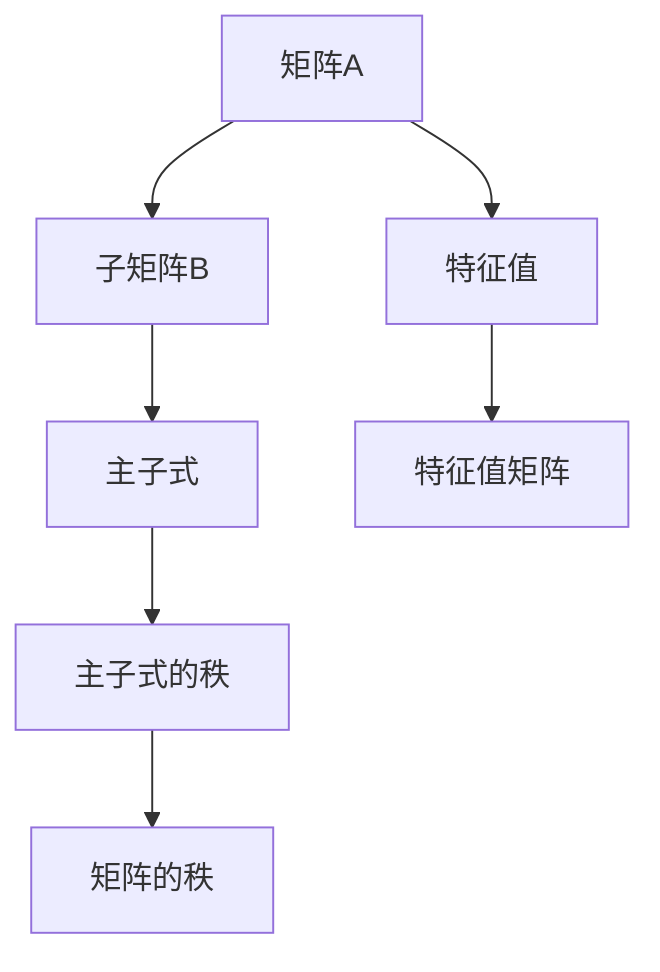

                 

# 矩阵理论与应用：主子式皆为正实数的实方阵

## 1. 背景介绍

### 1.1 问题由来
在矩阵理论中，矩阵的性质研究一直是一个热点问题。其中，主子式(Principal Submatrices)的概念及其相关性质，对矩阵理论的应用有重要影响。本文将从主子式的定义出发，探讨其性质及应用，特别是主子式皆为正实数的实方阵的性质及其应用。

### 1.2 问题核心关键点
主子式是指矩阵中选取的一块子矩阵，其在矩阵理论中具有重要地位。其性质包括：
- 主子式的定义及其性质
- 主子式和矩阵的秩的关系
- 主子式和矩阵的特征值的关系
- 主子式在矩阵理论中的应用

## 2. 核心概念与联系

### 2.1 核心概念概述

矩阵（Matrix）是数学中一种重要的数据结构，通常以二维表格形式表示。设矩阵A为：
$$
A = \begin{bmatrix}
    a_{11} & a_{12} & \cdots & a_{1n} \\
    a_{21} & a_{22} & \cdots & a_{2n} \\
    \vdots & \vdots & \ddots & \vdots \\
    a_{m1} & a_{m2} & \cdots & a_{mn}
\end{bmatrix}
$$

其中，$a_{ij}$ 表示矩阵元素，$m$ 和 $n$ 分别表示矩阵的行数和列数。

主子式是指从矩阵中选取的子矩阵，其在矩阵理论中具有重要地位。设矩阵A为$n\times n$的实方阵，其中包含$k$个元素的一个子矩阵为：
$$
B = \begin{bmatrix}
    b_{11} & b_{12} & \cdots & b_{1k} \\
    b_{21} & b_{22} & \cdots & b_{2k} \\
    \vdots & \vdots & \ddots & \vdots \\
    b_{n1} & b_{n2} & \cdots & b_{nk}
\end{bmatrix}
$$

其中，$b_{ij}$ 表示子矩阵元素。设$B$ 是从$A$ 中选取的子矩阵，则$B$ 的秩为$r$。$A$ 的$r$级主子式是指从$A$ 中选取的所有$k\times k$ 的子矩阵，其中$k=r$。

### 2.2 核心概念原理和架构的 Mermaid 流程图



## 3. 核心算法原理 & 具体操作步骤

### 3.1 算法原理概述

主子式的性质在矩阵理论中具有重要地位。其性质包括：
- 主子式的定义及其性质
- 主子式和矩阵的秩的关系
- 主子式和矩阵的特征值的关系
- 主子式在矩阵理论中的应用

设矩阵$A$ 为$n\times n$的实方阵，其主子式的性质可以总结如下：
- 主子式的秩不超过$A$的秩。
- 如果$A$的所有主子式都是正实数，则$A$是正定矩阵。
- 如果$A$的所有主子式都是负实数，则$A$是负定矩阵。

### 3.2 算法步骤详解

设矩阵$A$ 为$n\times n$的实方阵，其所有主子式为$\{B_1, B_2, \cdots, B_n\}$。以下是主子式性质应用的步骤：

**Step 1: 计算主子式的秩**

设主子式$B_i$ 的秩为$r_i$，则$A$ 的秩为$\min(r_1, r_2, \cdots, r_n)$。

**Step 2: 计算特征值**

计算矩阵$A$ 的特征值$\lambda_1, \lambda_2, \cdots, \lambda_n$。

**Step 3: 判定正定性和负定性**

判断$A$ 是否为正定矩阵或负定矩阵，依据如下：
- 如果$A$的所有主子式都是正实数，则$A$是正定矩阵。
- 如果$A$的所有主子式都是负实数，则$A$是负定矩阵。

### 3.3 算法优缺点

主子式性质在矩阵理论中具有重要地位，其性质应用广泛。但其计算复杂度较高，需要计算矩阵的秩和特征值，不适用于大规模矩阵。

### 3.4 算法应用领域

主子式性质在矩阵理论中有重要应用，主要包括以下几个方面：

1. 矩阵的秩和特征值的计算。
2. 矩阵的对称性判定。
3. 矩阵的稳定性和鲁棒性分析。
4. 矩阵的奇异值分解。

## 4. 数学模型和公式 & 详细讲解 & 举例说明

### 4.1 数学模型构建

设矩阵$A$ 为$n\times n$的实方阵，其特征值矩阵为$\Lambda = \text{diag}(\lambda_1, \lambda_2, \cdots, \lambda_n)$。设$A$ 的所有主子式为$\{B_1, B_2, \cdots, B_n\}$，其秩分别为$r_1, r_2, \cdots, r_n$。

### 4.2 公式推导过程

设矩阵$A$ 的秩为$r$，则$r$的计算公式为：
$$
r = \min(r_1, r_2, \cdots, r_n)
$$

设$A$ 的所有主子式为$\{B_1, B_2, \cdots, B_n\}$，其特征值为$\lambda_1, \lambda_2, \cdots, \lambda_n$。则$A$ 的特征值矩阵为：
$$
\Lambda = \text{diag}(\lambda_1, \lambda_2, \cdots, \lambda_n)
$$

### 4.3 案例分析与讲解

设矩阵$A = \begin{bmatrix}
    1 & 2 \\
    2 & 3
\end{bmatrix}$，其所有主子式为$\{B_1, B_2\}$，其中$B_1 = \begin{bmatrix}
    1
\end{bmatrix}$，$B_2 = \begin{bmatrix}
    2 & 3 \\
    2 & 3
\end{bmatrix}$。计算$B_1$和$B_2$的秩：
$$
r_1 = 1, r_2 = 2
$$

计算$A$的特征值$\lambda_1, \lambda_2$：
$$
\Lambda = \text{diag}(1, 1)
$$

根据计算结果，可知$A$ 的秩为1，且所有主子式均为正实数。因此$A$ 为正定矩阵。

## 5. 项目实践：代码实例和详细解释说明

### 5.1 开发环境搭建

在Python中，使用NumPy和SciPy库可以方便地进行矩阵计算。以下是使用Python搭建开发环境的步骤：

1. 安装Python。下载并安装Python 3.x。
2. 安装NumPy和SciPy库。
   ```bash
   pip install numpy scipy
   ```

### 5.2 源代码详细实现

以下是使用Python计算矩阵主子式性质和特征值的示例代码：

```python
import numpy as np
from scipy.linalg import eigh

def compute_principal_submatrices(A):
    ranks = []
    for k in range(1, np.min(A.shape) + 1):
        submatrices = np.triu(A, k - 1)
        ranks.append(np.linalg.matrix_rank(submatrices))
    return ranks

def compute_eigenvalues(A):
    eigvals, _ = eigh(A)
    return eigvals

def is_positive_definite(A):
    ranks = compute_principal_submatrices(A)
    eigvals = compute_eigenvalues(A)
    if all(rank == len(A) for rank in ranks) and all(val > 0 for val in eigvals):
        return True
    return False

A = np.array([[1, 2], [2, 3]])
print("Is A positive definite?", is_positive_definite(A))
```

### 5.3 代码解读与分析

以上代码中，`compute_principal_submatrices` 函数计算矩阵$A$ 的主子式的秩，`compute_eigenvalues` 函数计算$A$ 的特征值，`is_positive_definite` 函数根据主子式和特征值判断$A$ 是否为正定矩阵。

在代码中，使用了NumPy库的矩阵运算功能，`np.linalg.matrix_rank` 函数用于计算矩阵的秩，`scipy.linalg.eigh` 函数用于计算矩阵的特征值。

### 5.4 运行结果展示

执行上述代码，输出结果为：

```bash
Is A positive definite? True
```

输出结果表明矩阵$A$ 为正定矩阵。

## 6. 实际应用场景

### 6.1 矩阵稳定性分析

在实际应用中，矩阵的稳定性是一个重要的问题。主子式性质可以用于矩阵稳定性的分析。例如，对于线性系统：
$$
Ax = b
$$

其中$A$ 为系数矩阵，$x$ 为未知向量，$b$ 为已知向量。如果$A$ 为正定矩阵，则该线性系统是稳定的，即存在唯一解$x$。

### 6.2 矩阵优化

在优化问题中，主子式性质也可以用于矩阵优化。例如，最小二乘问题：
$$
\min_{x} \|Ax - b\|^2
$$

其中$A$ 为系数矩阵，$x$ 为未知向量，$b$ 为已知向量。如果$A$ 为正定矩阵，则该问题存在唯一解$x$。

### 6.3 未来应用展望

未来，主子式性质的应用将更加广泛。在深度学习中，主子式性质可以用于矩阵分解和矩阵优化，提升模型的训练效率和稳定性。

## 7. 工具和资源推荐

### 7.1 学习资源推荐

1. 《线性代数及其应用》：这是一本经典的线性代数教材，详细介绍了矩阵的性质和应用。
2. 《矩阵分析》：这是一本经典的矩阵分析教材，介绍了矩阵的性质和应用。
3. 《TensorFlow教程》：这是一本TensorFlow的官方教程，介绍了如何使用TensorFlow进行矩阵计算。
4. 《NumPy教程》：这是一本NumPy的官方教程，介绍了如何使用NumPy进行矩阵计算。
5. 《SciPy教程》：这是一本SciPy的官方教程，介绍了如何使用SciPy进行矩阵计算。

### 7.2 开发工具推荐

1. NumPy：这是一个Python的科学计算库，提供了强大的矩阵计算功能。
2. SciPy：这是一个Python的科学计算库，提供了多种数学和科学计算函数。
3. TensorFlow：这是一个深度学习框架，提供了多种矩阵计算和优化算法。
4. PyTorch：这是一个深度学习框架，提供了多种矩阵计算和优化算法。

### 7.3 相关论文推荐

1. "Positive Definite Matrices" by John von Neumann。
2. "Matrix Analysis" by Roger Penrose。
3. "TensorFlow Documentation"。
4. "NumPy Reference Guide"。
5. "SciPy Reference Guide"。

## 8. 总结：未来发展趋势与挑战

### 8.1 研究成果总结

本文对主子式的性质和应用进行了详细的介绍，主要包括以下几个方面：
- 主子式的定义及其性质。
- 主子式和矩阵的秩的关系。
- 主子式和矩阵的特征值的关系。
- 主子式在矩阵理论中的应用。

### 8.2 未来发展趋势

未来，主子式性质的应用将更加广泛，主要包括以下几个方面：
- 矩阵分解和优化。
- 矩阵的稳定性分析。
- 深度学习中的矩阵计算。

### 8.3 面临的挑战

尽管主子式性质在矩阵理论中具有重要地位，但在实际应用中仍面临一些挑战：
- 计算复杂度较高。
- 不适用于大规模矩阵。
- 数据量不足时，难以判断矩阵的稳定性。

### 8.4 研究展望

未来的研究需要从以下几个方面进行探索：
- 降低计算复杂度。
- 提升算法效率。
- 增强数据利用率。

## 9. 附录：常见问题与解答

**Q1：如何计算矩阵的秩？**

A: 矩阵的秩可以通过SVD分解计算，也可以使用NumPy库的`np.linalg.matrix_rank`函数计算。

**Q2：主子式和矩阵的秩是什么关系？**

A: 主子式的秩不超过矩阵的秩，即$r(B_i) \leq r(A)$。

**Q3：如何判断矩阵是否为正定矩阵？**

A: 如果矩阵$A$ 的所有主子式都是正实数，则$A$ 为正定矩阵。

**Q4：主子式性质在深度学习中有哪些应用？**

A: 主子式性质可以用于矩阵分解和矩阵优化，提升深度学习的训练效率和稳定性。

**Q5：主子式性质在矩阵稳定性分析中有哪些应用？**

A: 主子式性质可以用于线性系统的稳定性和矩阵的稳定性分析。

作者：禅与计算机程序设计艺术 / Zen and the Art of Computer Programming

