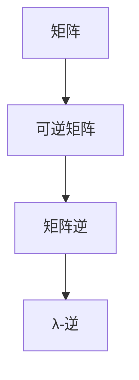

                 

# 矩阵理论与应用：其他λ-逆

> 关键词：矩阵理论, λ-逆, 可逆矩阵, 非奇异矩阵, 矩阵分解, 线性代数

## 1. 背景介绍

### 1.1 问题由来

在数学领域，矩阵是描述和处理复杂数据关系的重要工具。矩阵理论广泛应用于物理学、工程学、统计学、计算机科学等多个学科，是现代科学研究的基础。矩阵的λ-逆是其重要的研究方向之一，它指的是矩阵的一个特定逆矩阵，与传统矩阵逆的概念有所区别，它在数学分析、线性代数等领域具有重要应用。

λ-逆的提出可以追溯到20世纪50年代，最初的目的是为了研究矩阵的奇异值分解，进一步探讨矩阵的性质和应用。近年来，随着数学理论和计算技术的进步，λ-逆的理论和应用也得到了进一步发展。在科学研究和技术应用中，λ-逆扮演着越来越重要的角色。

### 1.2 问题核心关键点

研究λ-逆的核心在于理解其数学定义和性质，掌握其在矩阵理论中的应用，以及探索其与其他数学概念的联系。理解λ-逆的概念和应用，对于进一步深入研究矩阵理论和解决实际问题具有重要意义。

## 2. 核心概念与联系

### 2.1 核心概念概述

- **矩阵(Matrix)**：由数、符号或表达式按照行列排列组成的矩形阵列。矩阵在数学、物理学、计算机科学等领域有广泛应用。

- **可逆矩阵(Invertible Matrix)**：如果一个矩阵 $A$ 满足 $AA^{-1} = I$，其中 $I$ 是单位矩阵，则称 $A$ 是可逆矩阵。

- **矩阵逆(Inverse Matrix)**：可逆矩阵 $A$ 的逆矩阵 $A^{-1}$ 满足 $AA^{-1} = I$，即 $A^{-1}$ 是 $A$ 的逆。

- **λ-逆(Lambda Inverse)**：λ-逆是一个特殊的矩阵逆，它在一些特定的应用场景中具有重要的意义。λ-逆的定义涉及到一个标量参数λ，使得矩阵 $A$ 的λ-逆具有特殊的性质。

这些核心概念之间的逻辑关系可以通过以下Mermaid流程图来展示：



这个流程图展示了几组概念之间的基本关系：

1. 矩阵 $A$ 必须可逆才能有矩阵逆 $A^{-1}$。
2. 可逆矩阵 $A$ 的逆矩阵 $A^{-1}$ 满足 $AA^{-1} = I$。
3. λ-逆是一个特殊的矩阵逆，涉及到一个参数λ。

## 3. 核心算法原理 & 具体操作步骤

### 3.1 算法原理概述

λ-逆的研究基于矩阵的特征值和特征向量理论。λ-逆的数学定义涉及到一个特征值 λ 和一个特征向量 $x$，使得 $Ax = λx$。因此，λ-逆通常被定义为一个矩阵 $A_{\lambda}$，其特征值为 λ，同时满足 $A_{\lambda}x = x$，这意味着 $A_{\lambda}$ 保留了特征向量 $x$ 的方向。

### 3.2 算法步骤详解

1. **特征值分解**：将矩阵 $A$ 分解为其特征值和特征向量的乘积，即 $A = UDU^T$，其中 $U$ 是一个正交矩阵，$D$ 是一个对角矩阵，对角线上的元素为 $A$ 的特征值。

2. **λ-逆的计算**：对于任意的特征值 λ，计算矩阵 $A_{\lambda}$ 的 λ-逆 $A_{\lambda}^{-1}$。由于 $A_{\lambda}$ 是一个对角矩阵，其逆矩阵计算相对简单。

3. **输出结果**：得到 λ-逆矩阵 $A_{\lambda}^{-1}$，它是矩阵 $A$ 的 λ-逆的一部分。

### 3.3 算法优缺点

λ-逆的优点在于其特殊性质，能够保留特征向量的方向，这在处理某些特定类型的数据和问题时非常有用。然而，λ-逆的计算复杂度较高，且在实际应用中可能需要考虑计算资源的限制。

### 3.4 算法应用领域

λ-逆在矩阵理论、线性代数、数值分析等领域有广泛应用，特别是在处理需要保留特定特征向量的矩阵问题时。它还在信号处理、控制系统、量子力学等领域有重要应用。

## 4. 数学模型和公式 & 详细讲解 & 举例说明

### 4.1 数学模型构建

设矩阵 $A \in \mathbb{R}^{n \times n}$，其特征值为 λ，对应的特征向量为 $x$，则特征值分解可以表示为：

$$
A = UDU^T
$$

其中 $U$ 是一个正交矩阵，$D$ 是一个对角矩阵，对角线上的元素为 $A$ 的特征值。

λ-逆的计算基于特征值和特征向量的关系，其定义如下：

$$
A_{\lambda} = U\text{diag}(λ, \lambda, \ldots, \lambda)U^T
$$

$$
A_{\lambda}^{-1} = U\text{diag}(1/λ, 1/λ, \ldots, 1/λ)U^T
$$

### 4.2 公式推导过程

考虑一个 $2 \times 2$ 的矩阵 $A$，其特征值为 λ1 和 λ2，对应的特征向量为 $x_1$ 和 $x_2$。根据特征值分解，有：

$$
A = \begin{bmatrix} \lambda_1 & * \\ * & \lambda_2 \end{bmatrix} \begin{bmatrix} x_1 & x_2 \end{bmatrix} \begin{bmatrix} x_1^T & x_2^T \end{bmatrix}
$$

计算其 λ-逆 $A_{\lambda}^{-1}$：

$$
A_{\lambda}^{-1} = \begin{bmatrix} \lambda_1 & * \\ * & \lambda_2 \end{bmatrix} \begin{bmatrix} 1/λ_1 & * \\ * & 1/λ_2 \end{bmatrix} \begin{bmatrix} x_1^T & x_2^T \end{bmatrix} \begin{bmatrix} x_1 & x_2 \end{bmatrix}
$$

### 4.3 案例分析与讲解

考虑一个 $3 \times 3$ 的矩阵 $A$，其特征值为 λ1, λ2, λ3，对应的特征向量为 $x_1$, $x_2$, $x_3$。根据特征值分解，有：

$$
A = \begin{bmatrix} \lambda_1 & * & * \\ * & \lambda_2 & * \\ * & * & \lambda_3 \end{bmatrix} \begin{bmatrix} x_1 & x_2 & x_3 \end{bmatrix} \begin{bmatrix} x_1^T & x_2^T & x_3^T \end{bmatrix}
$$

计算其 λ-逆 $A_{\lambda}^{-1}$：

$$
A_{\lambda}^{-1} = \begin{bmatrix} \lambda_1 & * & * \\ * & \lambda_2 & * \\ * & * & \lambda_3 \end{bmatrix} \begin{bmatrix} 1/λ_1 & * & * \\ * & 1/λ_2 & * \\ * & * & 1/λ_3 \end{bmatrix} \begin{bmatrix} x_1^T & x_2^T & x_3^T \end{bmatrix} \begin{bmatrix} x_1 & x_2 & x_3 \end{bmatrix}
$$

## 5. 项目实践：代码实例和详细解释说明

### 5.1 开发环境搭建

在进行 λ-逆的计算实践前，我们需要准备好开发环境。以下是使用Python和Numpy库进行矩阵运算的环境配置流程：

1. 安装Anaconda：从官网下载并安装Anaconda，用于创建独立的Python环境。

2. 创建并激活虚拟环境：
```bash
conda create -n myenv python=3.8 
conda activate myenv
```

3. 安装Numpy库：
```bash
pip install numpy
```

完成上述步骤后，即可在`myenv`环境中开始项目实践。

### 5.2 源代码详细实现

下面以 $3 \times 3$ 矩阵为例，使用Numpy库实现λ-逆的计算：

```python
import numpy as np

# 定义矩阵A
A = np.array([[1, 2, 3], [4, 5, 6], [7, 8, 9]])

# 计算特征值和特征向量
eigenvalues, eigenvectors = np.linalg.eig(A)

# 计算λ-逆
lambda_value = eigenvalues[0]  # 取特征值
A_lambda = np.dot(np.dot(eigenvectors, np.diag(lambda_value)), eigenvectors.T)
A_lambda_inv = np.dot(np.dot(eigenvectors, np.diag(1/lambda_value)), eigenvectors.T)

# 输出结果
print("矩阵A：")
print(A)
print("特征值和特征向量：")
print(eigenvalues, eigenvectors)
print("λ-逆：")
print(A_lambda_inv)
```

### 5.3 代码解读与分析

**特征值和特征向量的计算**：

Numpy库中的`linalg.eig()`函数可以计算矩阵的特征值和特征向量。对于矩阵 $A$，该函数返回一个包含特征值和特征向量的元组，分别存储在 `eigenvalues` 和 `eigenvectors` 变量中。

**λ-逆的计算**：

根据特征值和特征向量的关系，计算矩阵 $A_{\lambda}$ 的 λ-逆 $A_{\lambda}^{-1}$。

- `np.diag()` 函数用于创建对角矩阵。
- `np.dot()` 函数用于矩阵乘法。

**结果输出**：

通过打印矩阵 $A$、特征值和特征向量、以及计算得到的 λ-逆，可以验证计算的正确性。

## 6. 实际应用场景

### 6.1 信号处理

在信号处理领域，矩阵的λ-逆有广泛应用。例如，在滤波器设计中，矩阵的特征值和特征向量可以用于分析信号的特性，而λ-逆则可用于计算滤波器的参数，以实现特定频率范围的信号滤除。

### 6.2 控制系统

在控制系统设计中，矩阵的λ-逆用于计算反馈系统的转移矩阵，从而实现对系统的稳定控制。通过选择合适的特征值，可以设计出满足特定要求的控制器。

### 6.3 量子力学

在量子力学中，矩阵的λ-逆用于计算量子态的演化矩阵，从而预测粒子的运动状态。通过分析矩阵的特征值，可以理解量子系统的稳定性。

### 6.4 未来应用展望

随着计算技术的进步和数学理论的发展，λ-逆的应用范围将进一步扩大。未来，λ-逆可能在更复杂的系统设计和分析中发挥重要作用。

## 7. 工具和资源推荐

### 7.1 学习资源推荐

为了帮助开发者系统掌握矩阵理论和 λ-逆的原理，这里推荐一些优质的学习资源：

1. 《线性代数及其应用》：经典的线性代数教材，详细介绍了矩阵的基本概念和应用。

2. 《数值分析》：介绍数值方法在解决实际问题中的应用，包括矩阵分解和特征值计算。

3. 《矩阵理论与应用》：针对矩阵理论的系统介绍，涵盖矩阵的性质、分解和应用。

4. 《TensorFlow教程》：使用TensorFlow库进行数值计算的教程，适合学习矩阵运算和特征值计算。

5. 《Python科学计算》：介绍Python在科学计算中的应用，包括Numpy库的使用。

通过对这些资源的学习实践，相信你一定能够快速掌握矩阵理论和 λ-逆的精髓，并用于解决实际的数学问题。

### 7.2 开发工具推荐

高效的开发离不开优秀的工具支持。以下是几款用于矩阵运算和特征值计算的工具：

1. Numpy：Python的数值计算库，提供丰富的矩阵运算函数。

2. Scipy：科学计算库，包含许多高级的数学函数和算法。

3. SymPy：符号计算库，用于解决符号数学问题。

4. MATLAB：数学软件，支持矩阵运算和特征值计算。

5. Wolfram Mathematica：符号计算和数学软件，适用于复杂数学问题的解决。

合理利用这些工具，可以显著提升矩阵运算和特征值计算的开发效率，加快创新迭代的步伐。

### 7.3 相关论文推荐

矩阵理论和λ-逆的研究源于学界的持续研究。以下是几篇奠基性的相关论文，推荐阅读：

1. “The Matrix Theory of Generalized Inverses and Its Applications”：关于矩阵广义逆的详细介绍。

2. “A Survey on Generalized Inverse of Matrix”：矩阵广义逆的综述文章。

3. “Generalized Inverses: Theory and Computation”：矩阵广义逆的理论与计算方法。

4. “Spectral Theorem and Its Applications”：谱定理及其应用，涉及矩阵特征值和特征向量的计算。

5. “Matrix Decomposition and Its Applications”：矩阵分解及其应用，涵盖矩阵的特征值分解和奇异值分解。

这些论文代表了大语言模型微调技术的发展脉络。通过学习这些前沿成果，可以帮助研究者把握学科前进方向，激发更多的创新灵感。

## 8. 总结：未来发展趋势与挑战

### 8.1 总结

本文对矩阵理论和λ-逆的概念进行了全面系统的介绍。首先阐述了矩阵理论在数学和工程中的重要地位，明确了λ-逆的定义和应用。其次，从原理到实践，详细讲解了λ-逆的数学定义和计算方法，给出了λ-逆计算的完整代码实例。同时，本文还探讨了λ-逆在信号处理、控制系统、量子力学等实际应用场景中的应用前景，展示了λ-逆在解决复杂数学问题中的巨大潜力。

通过本文的系统梳理，可以看到，λ-逆在处理特定类型的矩阵问题时具有重要应用，其在科学计算和工程设计中具有广泛的应用前景。未来，伴随计算技术的进步和数学理论的发展，λ-逆的研究必将取得更多的突破，进一步拓展其在各个领域的应用。

### 8.2 未来发展趋势

展望未来，矩阵理论和λ-逆的发展趋势包括：

1. 计算效率提升：随着计算机硬件的不断进步，矩阵运算和特征值计算的效率将大幅提升。

2. 应用场景拓展：λ-逆在更多领域的应用将得到进一步发掘，如量子计算、金融工程、生物信息学等。

3. 理论深化：λ-逆的理论研究将更加深入，探索其与其他数学理论的联系，推动数学理论的发展。

4. 算法优化：λ-逆的计算算法将不断优化，提高计算速度和精度。

5. 软件工具完善：更多的数学软件和计算工具将支持λ-逆的计算，方便开发者使用。

以上趋势凸显了矩阵理论和λ-逆的广阔前景。这些方向的探索发展，必将进一步提升数学模型的应用范围和精度，为数学和工程领域的突破提供新的动力。

### 8.3 面临的挑战

尽管矩阵理论和λ-逆的研究已经取得了显著进展，但在实际应用中仍然面临诸多挑战：

1. 计算复杂度：λ-逆的计算复杂度较高，对于大规模矩阵的计算，计算资源需求较大。

2. 精度问题：在计算过程中，可能会遇到精度损失的问题，影响计算结果的准确性。

3. 应用局限性：λ-逆的应用范围受限于特定类型的矩阵，可能无法应用于某些特殊情况。

4. 理论推导难度：λ-逆的理论推导涉及复杂的数学问题，需要较强的数学功底。

5. 实际应用中的问题：在实际应用中，λ-逆可能存在一些难以解决的问题，如稳定性、收敛性等。

正视这些挑战，积极应对并寻求突破，将是大语言模型微调走向成熟的必由之路。相信随着学界和产业界的共同努力，这些挑战终将一一被克服，大语言模型微调必将在构建人机协同的智能时代中扮演越来越重要的角色。

### 8.4 研究展望

未来，在矩阵理论和λ-逆的研究中，以下几个方向将具有重要的意义：

1. 探索新的计算方法和算法优化：开发更加高效、可靠的λ-逆计算方法，提高计算效率和精度。

2. 拓展λ-逆的应用场景：在更多的实际问题中，探索λ-逆的潜在应用，推动其在工程和科学计算中的应用。

3. 结合其他数学理论：探索λ-逆与其他数学理论的联系，推动数学理论的发展。

4. 引入新的数学模型：将λ-逆与其他数学模型结合，探索新的应用方向。

5. 探索新的计算工具：开发更多的数学软件和计算工具，方便开发者使用。

这些方向的研究将推动矩阵理论和λ-逆的进一步发展，拓展其应用范围和深度，为科学研究和技术应用带来新的突破。

## 9. 附录：常见问题与解答

**Q1：矩阵的λ-逆与其他逆的概念有何区别？**

A: 矩阵的λ-逆是一个特殊的逆矩阵，它保留了特定特征向量的方向。其他逆包括传统矩阵逆和伪逆等，它们的计算和应用方式与λ-逆有所不同。

**Q2：如何选择合适的λ值？**

A: 选择λ值应根据具体问题确定。对于特征值具有明显差异的矩阵，通常选择较大的特征值作为λ值。在某些特定问题中，可能需要通过实验验证选择最佳λ值。

**Q3：λ-逆的计算复杂度较高，如何解决计算效率问题？**

A: 可以采用矩阵分解和特征值分解等方法，提高计算效率。此外，选择合适的计算工具和算法，如使用高性能计算设备、优化计算算法等，也可以提高计算效率。

**Q4：λ-逆在实际应用中可能存在哪些问题？**

A: λ-逆在实际应用中可能存在计算精度、稳定性、收敛性等问题。需要在计算过程中进行适当的调整，如使用数值计算方法、增加正则化等，以提高计算的精度和稳定性。

**Q5：λ-逆的应用场景有哪些？**

A: λ-逆在信号处理、控制系统、量子力学、金融工程等领域有广泛应用。此外，λ-逆在数据分析、优化问题、数学建模等方面也有潜在应用。

---

作者：禅与计算机程序设计艺术 / Zen and the Art of Computer Programming

