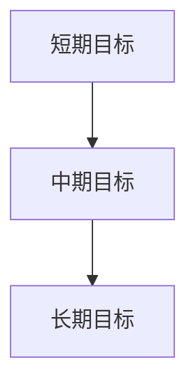

                 

# 短期目标管理的意识策略

在快节奏的现代生活中，时间管理成为我们成功的重要因素。人们为了实现长期目标，常常忽略短期目标的重要性，但短期目标其实构成了达成长期目标的基石。本文将从背景介绍、核心概念与联系、核心算法原理、数学模型与公式、项目实践、实际应用场景、工具与资源推荐、未来发展趋势与挑战以及附录：常见问题与解答等多个方面，深入探讨短期目标管理的意识策略，以期帮助读者更好地规划自己的时间和资源，实现职业和生活的双赢。

## 1. 背景介绍

在职业发展和个人成长的过程中，目标设定是必不可少的。有效的目标管理不仅能提升我们的工作效率，还能帮助我们获得满足感和成就感。然而，很多人往往对短期目标缺乏足够的重视，导致在实现长期目标的过程中，容易产生倦怠和迷茫。因此，了解并应用短期目标管理的意识策略，对于实现个人和团队的可持续发展具有重要意义。

## 2. 核心概念与联系

### 2.1 核心概念概述

在短期目标管理中，有几个关键概念：

- **短期目标**：指在较短时间内（通常是1个月至1年）需要完成的任务或达成的情况。
- **中期目标**：指在1年至5年之间需要完成的任务或达成的目标。
- **长期目标**：指5年以上的宏伟目标或远大梦想。

这些目标之间的关系是通过时间和努力累积逐步推进的。通过短期目标的逐步实现，可以不断积累经验、提升技能，最终达成中期和长期目标。

### 2.2 核心概念原理和架构的 Mermaid 流程图



## 3. 核心算法原理 & 具体操作步骤

### 3.1 算法原理概述

短期目标管理的核心原理是利用SMART原则（Specific, Measurable, Achievable, Relevant, Time-bound）来设定和跟踪目标。SMART原则帮助我们在设定短期目标时，明确目标的具体性、可衡量性、可实现性、相关性和时限性，从而提高目标实现的概率。

### 3.2 算法步骤详解

1. **定义目标**：明确短期目标的具体内容，确保目标的具体性和可实现性。例如，“提高编程技能，学习一门新的编程语言”就是一个具体且可实现的目标。
2. **分解目标**：将短期目标分解为可操作的小任务。例如，“每周学习5小时”或“每天编写100行代码”。
3. **设定时间**：为每个小任务设定明确的完成时间。例如，“在一个月内完成X项目”。
4. **监控进度**：定期检查小任务的完成情况，调整策略和方法。
5. **调整目标**：根据实际情况和反馈，调整短期目标的内容和策略。

### 3.3 算法优缺点

**优点**：
- 有助于提高目标实现的概率，使长期目标更加可控。
- 通过小任务逐步实现目标，减少心理压力，增加成就感。
- 便于量化和评估，使目标更加具体和可操作。

**缺点**：
- 需要较强的自律和执行力，否则容易偏离目标。
- 短期目标设定不当，可能影响整体规划。

### 3.4 算法应用领域

短期目标管理的应用领域非常广泛，包括但不限于：

- 个人时间管理：通过设定和跟踪短期目标，提高个人效率和时间利用率。
- 项目管理：在团队项目中设定短期目标，提升团队协作和项目进度。
- 学业规划：为学生制定短期学习目标，提高学习效率和成绩。
- 职业发展：为员工设定短期职业发展目标，促进个人成长和职业晋升。

## 4. 数学模型和公式 & 详细讲解 & 举例说明

### 4.1 数学模型构建

设短期目标为 $T$，分解为 $N$ 个可操作的任务 $T_1, T_2, ..., T_N$，每个任务的时间限制为 $t_i$，完成情况为 $c_i$（其中 $0 \leq c_i \leq 1$），则短期目标的完成度可以表示为：

$$ C = \sum_{i=1}^N c_i $$

其中 $C$ 的取值范围在 $[0,1]$ 之间，表示短期目标的完成程度。

### 4.2 公式推导过程

为保证 $C$ 的值在合理范围内，需要设定一系列的约束条件：

1. 任务完成率约束：每个任务的完成率 $c_i$ 必须在 $[0,1]$ 之间，即 $0 \leq c_i \leq 1$。
2. 时间限制约束：每个任务的时间限制 $t_i$ 必须大于等于其完成率 $c_i$ 对应的时间，即 $t_i \geq c_i \times T$。

### 4.3 案例分析与讲解

假设一个软件开发团队设定了一个短期目标，即在一个月内完成一个新功能的开发。团队将目标分解为五个小任务：需求分析、设计、编码、测试和部署。每个任务的时间限制分别为3天、5天、7天、2天和1天。为了确保目标的实现，团队需要在每个任务完成后进行评估，并根据实际情况调整进度。

## 5. 项目实践：代码实例和详细解释说明

### 5.1 开发环境搭建

在实践短期目标管理时，可以使用电子表格软件如Microsoft Excel或Google Sheets，也可以使用专业的项目管理工具如Trello、JIRA等。

### 5.2 源代码详细实现

以下是一个简单的Python代码示例，用于跟踪和管理短期目标：

```python
class GoalManager:
    def __init__(self, name, target):
        self.name = name
        self.target = target
        self.tasks = []
    
    def add_task(self, task_name, time_limit, completion_rate):
        task = {'task_name': task_name, 'time_limit': time_limit, 'completion_rate': completion_rate}
        self.tasks.append(task)
    
    def update_task(self, task_index, completion_rate):
        self.tasks[task_index]['completion_rate'] = completion_rate
    
    def evaluate(self):
        total_completion = sum(task['completion_rate'] for task in self.tasks)
        return total_completion
```

### 5.3 代码解读与分析

在上述代码中，我们定义了一个 `GoalManager` 类，用于管理短期目标。通过 `add_task` 方法，可以添加新任务，并设定其时间限制和完成率。通过 `update_task` 方法，可以更新任务的完成率。最后，通过 `evaluate` 方法，可以计算短期目标的完成度。

### 5.4 运行结果展示

假设一个短期目标设定为“提高编程技能，学习一门新的编程语言”，分解为“每天学习1小时”、“每周复习1次”、“完成在线课程的练习题”三个任务。通过 `GoalManager` 类进行跟踪和管理，可以实时了解每个任务的完成情况，从而调整学习策略。

```python
# 创建目标管理器
gm = GoalManager("学习编程语言", "掌握Python编程技能")

# 添加任务
gm.add_task("每天学习1小时", 1, 0.5)
gm.add_task("每周复习1次", 1, 0.5)
gm.add_task("完成在线课程的练习题", 3, 0.0)

# 更新任务完成率
gm.update_task(0, 1.0)
gm.update_task(1, 0.7)
gm.update_task(2, 0.3)

# 评估目标完成度
total_completion = gm.evaluate()
print(f"短期目标完成度为: {total_completion}")
```

## 6. 实际应用场景

### 6.1 个人时间管理

个人时间管理是短期目标管理的重要应用场景。通过设定和跟踪短期目标，可以更高效地利用时间，提升个人生产力和生活质量。例如，每天早上设定当天的短期目标，如“回复邮件”、“完成1小时阅读”、“锻炼30分钟”等，并记录完成情况，可以有效提升时间利用率。

### 6.2 项目管理

在团队项目中，短期目标管理同样至关重要。项目经理可以通过设定短期目标，将复杂任务分解为可操作的小任务，提高团队协作和项目进度。例如，设定每周完成一定的开发进度，每天进行代码审查等。

### 6.3 学业规划

学生可以利用短期目标管理，制定学习计划，提高学习效率。例如，设定每周学习一门新课程，每天完成一定量的习题，每周进行一次知识复习等。

### 6.4 职业发展

职场人士可以通过设定短期职业目标，不断提升自己的能力和竞争力。例如，设定每周学习一项新技能，每月参加一次专业培训，每年完成一个重要项目等。

## 7. 工具和资源推荐

### 7.1 学习资源推荐

为了帮助读者更好地理解短期目标管理，以下是一些优质的学习资源：

1. 《高效能人士的七个习惯》：史蒂芬·柯维的经典著作，介绍了目标管理的重要性及其具体策略。
2. 《Getting Things Done》：大卫·艾伦的著作，详细介绍了任务管理的具体方法和工具。
3. 《目标设定与达成：用SMART原则实现自我超越》：刘永涛的著作，深入讲解了SMART原则及其应用。
4. Coursera的“时间管理与个人效率”课程，由密歇根大学提供，适合初学者学习。
5. Udemy的“时间管理与目标设定”课程，由Lisa Jorgensen提供，提供实用的时间管理技巧和工具。

### 7.2 开发工具推荐

以下是一些实用的短期目标管理工具：

1. Trello：直观的项目管理工具，可以创建任务卡片，设定截止日期，方便跟踪和调整任务进度。
2. JIRA：企业级项目管理工具，支持复杂的任务分配、进度跟踪和报告生成。
3. Todoist：简单易用的任务管理工具，支持多设备同步，方便随时随地更新任务状态。
4. Microsoft To Do：微软推出的任务管理工具，与Outlook等Microsoft产品无缝集成。
5. Google Tasks：谷歌提供的轻量级任务管理工具，支持快速添加和分类任务。

### 7.3 相关论文推荐

以下是一些关于短期目标管理的经典论文：

1. "The Effectiveness of SMART Goals on EMSA Family Medicine Residents' Use of Evidence-Based Practice"：研究了SMART原则在家庭医学实习生中的应用效果。
2. "Effective Learning Strategies of College Students in Programming Courses: From Memory-Based to Comprehension-Based"：研究了短期目标管理在编程课程中的应用，如何提高学生的学习效果。
3. "A Study of Strategic Planning and Organizational Performance: An Analytical Approach"：探讨了短期目标管理在组织管理中的应用，如何提高组织绩效。

## 8. 总结：未来发展趋势与挑战

### 8.1 研究成果总结

短期目标管理的意识策略在提高个人和团队的效率和绩效方面具有重要意义。通过明确设定短期目标，并分解为可操作的小任务，可以有效提升时间利用率和工作效果。

### 8.2 未来发展趋势

未来，短期目标管理将向以下方向发展：

1. 数字化转型：通过智能任务管理软件和AI技术，自动生成和优化短期目标，减少人工干预。
2. 个性化定制：根据用户的历史数据和行为习惯，自动生成个性化的时间管理方案，提高用户体验。
3. 多渠道整合：整合多种工具和平台，实现跨设备、跨应用的目标管理，提高协同效率。

### 8.3 面临的挑战

尽管短期目标管理具有诸多优势，但也面临以下挑战：

1. 自律性要求高：需要较强的自律和执行力，否则容易偏离目标。
2. 工具选择困难：市场上有众多工具，选择适合自己的工具需要时间和经验。
3. 数据隐私问题：在数字化管理过程中，如何保护用户隐私和数据安全。

### 8.4 研究展望

未来研究可以从以下几个方向进行：

1. 引入心理学和行为学原理：通过研究人类行为和心理特征，设计更加符合用户需求的目标管理工具。
2. 开发智能算法：利用机器学习和大数据技术，自动生成和优化短期目标。
3. 建立多模态管理框架：整合多种数据和信息源，构建更加全面的目标管理平台。

## 9. 附录：常见问题与解答

**Q1: 如何设定合理的短期目标？**

A: 设定短期目标时，应遵循SMART原则，具体、可衡量、可实现、相关和有时间限制。同时，目标应具有挑战性，但又不应过于困难，以免引起挫败感。

**Q2: 如何应对短期目标管理中的干扰？**

A: 应对干扰的方法包括：
1. 设定固定的时间段，专门用于处理短期目标。
2. 减少干扰源，如关闭手机通知、使用专注模式等。
3. 使用时间管理工具，如番茄工作法，帮助集中注意力。

**Q3: 短期目标管理是否适用于所有人？**

A: 短期目标管理适用于各种类型的工作和生活场景，包括个人时间管理、项目管理、学业规划、职业发展等。但不同人对工具的适应性和需求可能不同，需要根据自己的情况选择合适的方法。

**Q4: 短期目标管理是否会降低长远的动力？**

A: 短期内，过度追求短期目标的完成，可能会导致长远的动力下降。但通过合理设定短期目标，不断积累成就感，有助于提升长远的动力。关键在于设定平衡，确保短期目标与长期目标的一致性。

**Q5: 如何评估短期目标管理的有效性？**

A: 评估短期目标管理的有效性，可以从以下几个方面进行：
1. 目标完成度：统计短期目标的完成情况，评估目标的实际效果。
2. 时间利用率：通过记录和分析时间利用情况，评估时间管理的有效性。
3. 工作满意度：通过自我评估和反馈，评估短期目标管理的满意度。

通过回答这些问题，我们希望能为读者提供更加清晰、全面的短期目标管理策略，助力其在个人和团队管理中取得更好的成果。

---

作者：禅与计算机程序设计艺术 / Zen and the Art of Computer Programming

