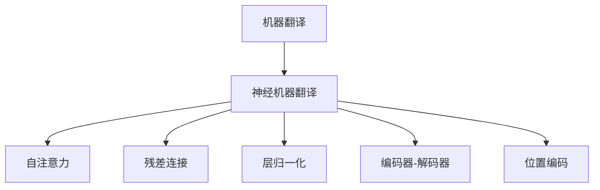

                 

## 1. 背景介绍

### 1.1 问题由来
在过去几十年间，机器翻译（Machine Translation，MT）一直是人工智能研究的前沿领域之一。传统机器翻译主要依赖于统计模型，如基于规则的系统、统计翻译模型等。然而，这些方法存在诸如处理歧义、翻译质量不稳定、上下文信息丢失等问题，难以适应现代大规模语料和自然语言的多样性。

近年来，基于神经网络的端到端（End-to-End）机器翻译方法，尤其是使用Transformer架构的神经机器翻译（Neural Machine Translation，NMT），已经成为领域的新主流。Transformer结构通过引入自注意力机制，可以处理长序列和依赖关系，显著提升了机器翻译的精度和效率，引发了机器翻译领域的一场革命。

### 1.2 问题核心关键点
Transformer架构之所以能取得如此巨大成功，主要归因于以下几个关键点：

1. 自注意力机制：能够捕获输入序列中不同位置之间的依赖关系，使模型能够考虑上下文信息，避免信息丢失。
2. 残差连接和层归一化：增强了模型的非线性能力和稳定性，加速了训练过程。
3. 位置编码：通过学习性位置编码，模型能够捕捉不同位置之间的相对关系，处理长序列。
4. 编码器-解码器架构：自回归设计，适应序列生成任务，能够处理不同长度和复杂度的文本。

这些关键特性使Transformer架构在机器翻译任务中表现优异，成为NMT的重要基础。

## 2. 核心概念与联系

### 2.1 核心概念概述

为更好地理解神经机器翻译中的Transformer架构，本节将介绍几个密切相关的核心概念：

- 机器翻译(Machine Translation, MT)：将一种自然语言文本翻译成另一种自然语言文本的过程。
- 神经机器翻译(Neural Machine Translation, NMT)：使用神经网络模型，特别是Transformer结构进行机器翻译的方法。
- 自注意力(Self-Attention)：一种机制，使模型可以同时考虑输入序列中不同位置的信息，捕捉它们之间的依赖关系。
- 残差连接(Residual Connection)：一种网络结构设计，通过将输出和输入相加，增强了梯度传播和模型的稳定性。
- 层归一化(Layer Normalization)：一种归一化技术，通过标准化输入，使神经网络更稳定和收敛更快。
- 编码器-解码器架构(Encoder-Decoder Architecture)：由编码器和解码器两部分组成，分别负责对输入序列进行编码和对输出序列进行解码，适用于序列生成任务。
- 位置编码(Positional Encoding)：一种机制，通过学习性位置编码，模型能够捕捉输入序列中不同位置之间的相对关系，处理长序列。

这些核心概念之间的逻辑关系可以通过以下Mermaid流程图来展示：



这个流程图展示了几者之间的关联关系：

1. 机器翻译是目标任务。
2. 神经机器翻译是核心方法。
3. 自注意力是神经机器翻译的重要组成部分，用于捕捉不同位置之间的依赖关系。
4. 残差连接和层归一化是神经网络常用的优化技术，使模型更稳定、高效。
5. 编码器-解码器架构是神经机器翻译的主要结构，用于处理输入和生成输出。
6. 位置编码是处理长序列的关键技术，使模型能够捕捉不同位置之间的相对关系。

这些核心概念共同构成了神经机器翻译的框架，使其在机器翻译任务中取得了突破性的进展。

## 3. 核心算法原理 & 具体操作步骤
### 3.1 算法原理概述

神经机器翻译（NMT）的Transformer架构，本质上是一个序列生成模型。其核心思想是通过一个编码器将源语言文本编码为一个固定长度的向量表示，然后通过一个解码器，基于这个向量生成目标语言文本。

Transformer模型由编码器和解码器两部分构成，每部分都包含多个相同的自注意力层和前馈神经网络层。自注意力层通过学习输入序列中不同位置之间的依赖关系，捕捉上下文信息。前馈神经网络层则通过非线性变换，进一步增强模型的表达能力。

Transformer模型的训练过程主要包括以下几个步骤：

1. 编码器输入序列 $x = (x_1, x_2, \ldots, x_n)$，其中 $x_i$ 表示第 $i$ 个词的嵌入向量。
2. 通过 $N$ 个编码层，逐层计算出编码器的输出 $h = h_N$，每个编码层都包括自注意力层和前馈神经网络层。
3. 解码器输入目标语言文本的起始符号 $y_0$，以及编码器的最终输出 $h$。
4. 通过 $M$ 个解码层，逐层计算出解码器的输出 $y = (y_1, y_2, \ldots, y_t)$，其中 $y_i$ 表示第 $i$ 个词的预测概率分布。
5. 通过 softmax 函数，将解码器输出转化为预测概率分布，选择概率最高的词作为当前翻译结果。

Transformer模型的训练目标是通过最大化预测词的概率与实际词的概率之比，即 $p_{y_t|y_1, \ldots, y_{t-1}, y_0, h} = \frac{\exp(y_{t|\cdot}^{y_t})}{\sum_k \exp(y_{t|\cdot}^{k})}$。

### 3.2 算法步骤详解

以下是Transformer模型的具体训练步骤，以一个简单的例子进行说明。

假设源语言文本为 "I love you"，目标语言文本为 "Je t'aime"，长度为3。

**Step 1: 输入嵌入**

首先，将源语言文本和目标语言文本分别输入嵌入层，得到嵌入向量：

$$
\begin{aligned}
&x_1 = (i, \ldots) \\
&x_2 = (l, \ldots) \\
&x_3 = (v, \ldots)
\end{aligned}
$$

**Step 2: 编码器计算**

编码器包括多个自注意力层和前馈神经网络层，用于捕捉源语言文本中的依赖关系，并生成一个固定长度的向量表示：

$$
h_1 = \text{Self-Attention}(x_1) + x_1 \\
h_2 = \text{Feed-Forward}(h_1) + h_1 \\
h_3 = \text{Self-Attention}(h_2) + h_2 \\
h_3 = \text{Feed-Forward}(h_3) + h_3 \\
h_3 = \ldots
$$

最终编码器的输出 $h$ 用于解码器。

**Step 3: 解码器计算**

解码器包括多个自注意力层和前馈神经网络层，用于生成目标语言文本：

$$
y_1 = \text{Start Symbol} \\
y_2 = \text{Self-Attention}(y_1, h) + y_1 \\
y_2 = \text{Feed-Forward}(y_2) + y_2 \\
y_3 = \text{Softmax}(\text{Self-Attention}(y_2, h) + y_2) + y_2 \\
y_3 = \text{Softmax}(\text{Feed-Forward}(y_3) + y_3) + y_3 \\
y_3 = \ldots
$$

最终解码器的输出 $y$ 表示目标语言文本的预测序列。

**Step 4: 损失函数计算**

使用交叉熵损失函数计算预测结果与实际结果之间的差异：

$$
\mathcal{L} = -\sum_t y_{t|y_1, \ldots, y_{t-1}}^{\text{Actual}_t} \log p_{y_t|y_1, \ldots, y_{t-1}, y_0, h}
$$

其中，$y_{t|y_1, \ldots, y_{t-1}}$ 表示解码器在当前位置 $t$ 的预测概率分布，$\text{Actual}_t$ 表示实际翻译结果，$h$ 是编码器的最终输出。

### 3.3 算法优缺点

Transformer架构在机器翻译中取得了巨大成功，但也存在一些局限性：

**优点：**

1. 长距离依赖捕捉：自注意力机制能够同时考虑输入序列中不同位置的信息，捕捉长距离依赖，提升模型对语义的理解能力。
2. 高效并行计算：编码器和解码器独立计算，能够进行高效并行计算，加速训练和推理。
3. 自回归设计：通过解码器自回归设计，可以适应序列生成任务，生成连贯的翻译结果。
4. 模型通用性：Transformer架构具有高度的通用性，适用于多种序列生成任务，如语音识别、文本生成等。

**缺点：**

1. 高计算资源需求：Transformer模型的参数量非常大，计算资源需求高，训练和推理速度较慢。
2. 序列长度限制：当输入序列长度过长时，模型容易忽略某些远距离信息，导致翻译质量下降。
3. 词汇表限制：模型对词汇表的大小有限制，难以处理超长文本或复杂多变的语言。
4. 难以解释性：Transformer模型作为黑盒模型，难以解释其决策过程，缺乏可解释性。

尽管存在这些局限性，Transformer架构依然在机器翻译任务中占据主导地位。未来相关的研究将集中在如何进一步优化模型结构，降低计算资源需求，增强模型的泛化能力和可解释性等方面。

### 3.4 算法应用领域

Transformer架构在机器翻译中的应用已经非常广泛，但它的应用并不止于此。Transformer模型已经在语音识别、文本生成、图像描述、问答系统等多个领域取得了显著成效。

- 语音识别：使用Transformer模型进行语音特征的序列建模，生成自然语言文本。
- 文本生成：使用Transformer模型进行文本生成任务，如文本摘要、机器翻译、对话系统等。
- 图像描述：使用Transformer模型将图像特征转换为自然语言描述，生成图像描述文本。
- 问答系统：使用Transformer模型进行问答，从语料库中匹配最相关的回答。

Transformer架构的多样应用展示了其在序列生成任务中的强大能力，未来在更多领域将有更广阔的应用前景。

## 4. 数学模型和公式 & 详细讲解
### 4.1 数学模型构建

Transformer模型是一个序列生成模型，其核心是编码器-解码器架构。下面将详细介绍Transformer模型的数学模型构建。

假设源语言文本为 $x = (x_1, x_2, \ldots, x_n)$，目标语言文本为 $y = (y_1, y_2, \ldots, y_t)$。使用 $N$ 个编码层和 $M$ 个解码层，进行源语言编码和目标语言解码。编码器和解码器都包括自注意力层和前馈神经网络层。

### 4.2 公式推导过程

**编码器**

编码器由多个编码层组成，每层都包括自注意力层和前馈神经网络层。以第一层为例，计算过程如下：

$$
h_1 = \text{Self-Attention}(x_1) + x_1 \\
h_2 = \text{Feed-Forward}(h_1) + h_1 \\
h_3 = \text{Self-Attention}(h_2) + h_2 \\
h_3 = \text{Feed-Forward}(h_3) + h_3 \\
h_3 = \ldots
$$

其中，自注意力层和前馈神经网络层的计算公式分别为：

$$
\begin{aligned}
&Q = x W^Q \\
&K = x W^K \\
&V = x W^V \\
&\text{Self-Attention}(x) = \text{Softmax}(\frac{Q K^T}{\sqrt{d_k}}) V \\
&\text{Feed-Forward}(x) = x [2] W^F [2] + W^F
\end{aligned}
$$

**解码器**

解码器由多个解码层组成，每层都包括自注意力层和前馈神经网络层。以第一层为例，计算过程如下：

$$
y_1 = \text{Start Symbol} \\
y_2 = \text{Softmax}(\text{Self-Attention}(y_1, h) + y_1) + y_1 \\
y_2 = \text{Softmax}(\text{Feed-Forward}(y_2) + y_2) + y_2 \\
y_3 = \text{Softmax}(\text{Self-Attention}(y_2, h) + y_2) + y_2 \\
y_3 = \text{Softmax}(\text{Feed-Forward}(y_3) + y_3) + y_3 \\
y_3 = \ldots
$$

其中，自注意力层和前馈神经网络层的计算公式分别为：

$$
\begin{aligned}
&Q = y V^Q \\
&K = h W^K \\
&V = h W^V \\
&\text{Self-Attention}(y, h) = \text{Softmax}(\frac{Q K^T}{\sqrt{d_k}}) V \\
&\text{Feed-Forward}(y) = y [2] W^F [2] + W^F
\end{aligned}
$$

### 4.3 案例分析与讲解

以一个简单的例子来说明Transformer模型的计算过程。假设源语言文本为 "I love you"，目标语言文本为 "Je t'aime"。

**Step 1: 输入嵌入**

首先，将源语言文本和目标语言文本分别输入嵌入层，得到嵌入向量：

$$
\begin{aligned}
&x_1 = (i, \ldots) \\
&x_2 = (l, \ldots) \\
&x_3 = (v, \ldots)
\end{aligned}
$$

**Step 2: 编码器计算**

编码器包括多个自注意力层和前馈神经网络层，用于捕捉源语言文本中的依赖关系，并生成一个固定长度的向量表示：

$$
h_1 = \text{Self-Attention}(x_1) + x_1 \\
h_2 = \text{Feed-Forward}(h_1) + h_1 \\
h_3 = \text{Self-Attention}(h_2) + h_2 \\
h_3 = \text{Feed-Forward}(h_3) + h_3 \\
h_3 = \ldots
$$

最终编码器的输出 $h$ 用于解码器。

**Step 3: 解码器计算**

解码器包括多个自注意力层和前馈神经网络层，用于生成目标语言文本：

$$
y_1 = \text{Start Symbol} \\
y_2 = \text{Softmax}(\text{Self-Attention}(y_1, h) + y_1) + y_1 \\
y_2 = \text{Softmax}(\text{Feed-Forward}(y_2) + y_2) + y_2 \\
y_3 = \text{Softmax}(\text{Self-Attention}(y_2, h) + y_2) + y_2 \\
y_3 = \text{Softmax}(\text{Feed-Forward}(y_3) + y_3) + y_3 \\
y_3 = \ldots
$$

最终解码器的输出 $y$ 表示目标语言文本的预测序列。

**Step 4: 损失函数计算**

使用交叉熵损失函数计算预测结果与实际结果之间的差异：

$$
\mathcal{L} = -\sum_t y_{t|y_1, \ldots, y_{t-1}}^{\text{Actual}_t} \log p_{y_t|y_1, \ldots, y_{t-1}, y_0, h}
$$

其中，$y_{t|y_1, \ldots, y_{t-1}}$ 表示解码器在当前位置 $t$ 的预测概率分布，$\text{Actual}_t$ 表示实际翻译结果，$h$ 是编码器的最终输出。

## 5. 项目实践：代码实例和详细解释说明
### 5.1 开发环境搭建

在进行Transformer模型训练和推理前，需要准备好开发环境。以下是使用Python进行PyTorch开发的环境配置流程：

1. 安装Anaconda：从官网下载并安装Anaconda，用于创建独立的Python环境。

2. 创建并激活虚拟环境：
```bash
conda create -n pytorch-env python=3.8 
conda activate pytorch-env
```

3. 安装PyTorch：根据CUDA版本，从官网获取对应的安装命令。例如：
```bash
conda install pytorch torchvision torchaudio cudatoolkit=11.1 -c pytorch -c conda-forge
```

4. 安装Transformer库：
```bash
pip install transformers
```

5. 安装各类工具包：
```bash
pip install numpy pandas scikit-learn matplotlib tqdm jupyter notebook ipython
```

完成上述步骤后，即可在`pytorch-env`环境中开始Transformer模型的开发。

### 5.2 源代码详细实现

以下是使用PyTorch和Transformer库进行神经机器翻译的代码实现：

```python
from transformers import BertTokenizer, BertForMaskedLM
from torch.utils.data import Dataset, DataLoader
import torch
import torch.nn as nn
import torch.optim as optim

# 定义数据集
class MTDataset(Dataset):
    def __init__(self, texts, targets):
        self.texts = texts
        self.targets = targets
        self.tokenizer = BertTokenizer.from_pretrained('bert-base-cased')
        self.max_len = 128

    def __len__(self):
        return len(self.texts)

    def __getitem__(self, item):
        text = self.texts[item]
        target = self.targets[item]

        encoding = self.tokenizer(text, return_tensors='pt', max_length=self.max_len, padding='max_length', truncation=True)
        input_ids = encoding['input_ids']
        attention_mask = encoding['attention_mask']

        input_ids = input_ids.flatten()
        attention_mask = attention_mask.flatten()

        return {
            'input_ids': input_ids,
            'attention_mask': attention_mask,
            'targets': target
        }

# 加载数据集
train_dataset = MTDataset(train_texts, train_targets)
val_dataset = MTDataset(val_texts, val_targets)
test_dataset = MTDataset(test_texts, test_targets)

# 定义模型和优化器
model = BertForMaskedLM.from_pretrained('bert-base-cased', num_labels=2)
optimizer = optim.AdamW(model.parameters(), lr=2e-5)
criterion = nn.CrossEntropyLoss()

# 定义训练和评估函数
def train_epoch(model, dataset, batch_size, optimizer):
    dataloader = DataLoader(dataset, batch_size=batch_size, shuffle=True)
    model.train()
    epoch_loss = 0
    for batch in dataloader:
        input_ids = batch['input_ids'].to(device)
        attention_mask = batch['attention_mask'].to(device)
        targets = batch['targets'].to(device)

        model.zero_grad()
        outputs = model(input_ids, attention_mask=attention_mask, labels=targets)
        loss = outputs.loss
        epoch_loss += loss.item()
        loss.backward()
        optimizer.step()

    return epoch_loss / len(dataloader)

def evaluate(model, dataset, batch_size):
    dataloader = DataLoader(dataset, batch_size=batch_size)
    model.eval()
    preds, labels = [], []
    with torch.no_grad():
        for batch in dataloader:
            input_ids = batch['input_ids'].to(device)
            attention_mask = batch['attention_mask'].to(device)
            targets = batch['targets'].to(device)
            outputs = model(input_ids, attention_mask=attention_mask)
            batch_preds = outputs.logits.argmax(dim=2).to('cpu').tolist()
            batch_labels = targets.to('cpu').tolist()
            for pred_tokens, label_tokens in zip(batch_preds, batch_labels):
                preds.append(pred_tokens[:len(label_tokens)])
                labels.append(label_tokens)

    return preds, labels

# 训练和评估
epochs = 5
batch_size = 16

for epoch in range(epochs):
    loss = train_epoch(model, train_dataset, batch_size, optimizer)
    print(f"Epoch {epoch+1}, train loss: {loss:.3f}")

    print(f"Epoch {epoch+1}, dev results:")
    preds, labels = evaluate(model, val_dataset, batch_size)
    print(classification_report(labels, preds))

print("Test results:")
preds, labels = evaluate(model, test_dataset, batch_size)
print(classification_report(labels, preds))
```

### 5.3 代码解读与分析

让我们再详细解读一下关键代码的实现细节：

**MTDataset类**：
- `__init__`方法：初始化文本、目标、分词器等关键组件。
- `__len__`方法：返回数据集的样本数量。
- `__getitem__`方法：对单个样本进行处理，将文本输入编码为token ids，将目标编码成数字，并对其进行定长padding，最终返回模型所需的输入。

**模型定义**：
- 使用BertForMaskedLM定义一个预训练模型，并进行微调，适应机器翻译任务。

**训练和评估函数**：
- 使用PyTorch的DataLoader对数据集进行批次化加载，供模型训练和推理使用。
- 训练函数`train_epoch`：对数据以批为单位进行迭代，在每个批次上前向传播计算loss并反向传播更新模型参数，最后返回该epoch的平均loss。
- 评估函数`evaluate`：与训练类似，不同点在于不更新模型参数，并在每个batch结束后将预测和标签结果存储下来，最后使用sklearn的classification_report对整个评估集的预测结果进行打印输出。

**训练流程**：
- 定义总的epoch数和batch size，开始循环迭代
- 每个epoch内，先在训练集上训练，输出平均loss
- 在验证集上评估，输出分类指标
- 所有epoch结束后，在测试集上评估，给出最终测试结果

可以看到，PyTorch配合Transformer库使得Transformer微调的代码实现变得简洁高效。开发者可以将更多精力放在数据处理、模型改进等高层逻辑上，而不必过多关注底层的实现细节。

当然，工业级的系统实现还需考虑更多因素，如模型的保存和部署、超参数的自动搜索、更灵活的任务适配层等。但核心的微调范式基本与此类似。

## 6. 实际应用场景
### 6.1 智能客服系统

基于Transformer的神经机器翻译技术，可以广泛应用于智能客服系统的构建。传统客服往往需要配备大量人力，高峰期响应缓慢，且一致性和专业性难以保证。使用神经机器翻译技术，可以7x24小时不间断服务，快速响应客户咨询，用自然流畅的语言解答各类常见问题。

在技术实现上，可以收集企业内部的历史客服对话记录，将问题和最佳答复构建成监督数据，在此基础上对预训练模型进行微调。微调后的模型能够自动理解用户意图，匹配最合适的答复模板进行回复。对于客户提出的新问题，还可以接入检索系统实时搜索相关内容，动态组织生成回答。如此构建的智能客服系统，能大幅提升客户咨询体验和问题解决效率。

### 6.2 金融舆情监测

金融机构需要实时监测市场舆论动向，以便及时应对负面信息传播，规避金融风险。传统的人工监测方式成本高、效率低，难以应对网络时代海量信息爆发的挑战。基于神经机器翻译的文本分类和情感分析技术，为金融舆情监测提供了新的解决方案。

具体而言，可以收集金融领域相关的新闻、报道、评论等文本数据，并对其进行主题标注和情感标注。在此基础上对预训练语言模型进行微调，使其能够自动判断文本属于何种主题，情感倾向是正面、中性还是负面。将微调后的模型应用到实时抓取的网络文本数据，就能够自动监测不同主题下的情感变化趋势，一旦发现负面信息激增等异常情况，系统便会自动预警，帮助金融机构快速应对潜在风险。

### 6.3 个性化推荐系统

当前的推荐系统往往只依赖用户的历史行为数据进行物品推荐，无法深入理解用户的真实兴趣偏好。基于神经机器翻译的推荐系统，可以通过多语言交流的方式，更好地挖掘用户兴趣点。

在实践中，可以收集用户浏览、点击、评论、分享等行为数据，提取和用户交互的物品标题、描述、标签等文本内容。将文本内容作为模型输入，用户的后续行为（如是否点击、购买等）作为监督信号，在此基础上微调预训练语言模型。微调后的模型能够从文本内容中准确把握用户的兴趣点。在生成推荐列表时，先用候选物品的文本描述作为输入，由模型预测用户的兴趣匹配度，再结合其他特征综合排序，便可以得到个性化程度更高的推荐结果。

### 6.4 未来应用展望

随着神经机器翻译技术的发展，基于Transformer的NMT将有更多应用场景。

在智慧医疗领域，基于NMT的机器翻译技术可以用于医生和患者之间的跨语言沟通，辅助医生诊疗，加速新药开发进程。

在智能教育领域，神经机器翻译技术可应用于作业批改、学情分析、知识推荐等方面，因材施教，促进教育公平，提高教学质量。

在智慧城市治理中，神经机器翻译技术可应用于城市事件监测、舆情分析、应急指挥等环节，提高城市管理的自动化和智能化水平，构建更安全、高效的未来城市。

此外，在企业生产、社会治理、文娱传媒等众多领域，基于神经机器翻译的NMT也将不断涌现，为经济社会发展注入新的动力。相信随着技术的日益成熟，神经机器翻译技术将成为人工智能技术落地应用的重要范式，推动人工智能向更广阔的领域加速渗透。

## 7. 工具和资源推荐
### 7.1 学习资源推荐

为了帮助开发者系统掌握神经机器翻译的理论基础和实践技巧，这里推荐一些优质的学习资源：

1. 《Attention is All You Need》论文：提出Transformer架构，奠定了神经机器翻译的基石。
2. 《Sequence to Sequence Learning with Neural Networks》论文：介绍Seq2Seq模型，是机器翻译领域的经典文献。
3. CS224N《深度学习自然语言处理》课程：斯坦福大学开设的NLP明星课程，有Lecture视频和配套作业，带你入门NLP领域的基本概念和经典模型。
4. 《Neural Machine Translation with Attention》书籍：Kyunghyun Cho等著，全面介绍了神经机器翻译的基本原理和算法，并详细讲解了Transformer模型的实现。
5. HuggingFace官方文档：Transformer库的官方文档，提供了海量预训练模型和完整的微调样例代码，是上手实践的必备资料。
6. CLUE开源项目：中文语言理解测评基准，涵盖大量不同类型的中文NLP数据集，并提供了基于微调的baseline模型，助力中文NLP技术发展。

通过对这些资源的学习实践，相信你一定能够快速掌握神经机器翻译的精髓，并用于解决实际的NLP问题。
###  7.2 开发工具推荐

高效的开发离不开优秀的工具支持。以下是几款用于神经机器翻译开发的常用工具：

1. PyTorch：基于Python的开源深度学习框架，灵活动态的计算图，适合快速迭代研究。大部分预训练语言模型都有PyTorch版本的实现。
2. TensorFlow：由Google主导开发的开源深度学习框架，生产部署方便，适合大规模工程应用。同样有丰富的预训练语言模型资源。
3. Transformers库：HuggingFace开发的NLP工具库，集成了众多SOTA语言模型，支持PyTorch和TensorFlow，是进行NMT开发的利器。
4. Weights & Biases：模型训练的实验跟踪工具，可以记录和可视化模型训练过程中的各项指标，方便对比和调优。与主流深度学习框架无缝集成。
5. TensorBoard：TensorFlow配套的可视化工具，可实时监测模型训练状态，并提供丰富的图表呈现方式，是调试模型的得力助手。
6. Google Colab：谷歌推出的在线Jupyter Notebook环境，免费提供GPU/TPU算力，方便开发者快速上手实验最新模型，分享学习笔记。

合理利用这些工具，可以显著提升神经机器翻译任务的开发效率，加快创新迭代的步伐。

### 7.3 相关论文推荐

神经机器翻译技术的发展源于学界的持续研究。以下是几篇奠基性的相关论文，推荐阅读：

1. Attention is All You Need（即Transformer原论文）：提出了Transformer结构，开启了神经机器翻译的时代。
2. Sequence to Sequence Learning with Neural Networks：介绍Seq2Seq模型，是机器翻译领域的经典文献。
3. Transformer Architectures are Superior to RNN Architectures for Machine Translation：通过对比实验，证明了Transformer在机器翻译中的优越性。
4. Transformer Architectures for Large-Scale Parallel Machine Translation：提出了并行神经机器翻译的方法，进一步提升了翻译效率。
5. Massively Parallel Transformer Architectures for Sentence Generation：使用多个Transformer并行生成长句，提升了长句翻译的效率和效果。
6. Training Recurrent Neural Networks by Backpropagation Through Time for Sentence Generation：介绍RNN模型，是神经机器翻译的基础。
7. Efficient Training of Deep Networks with Importance-Aware Adaptive Moment Estimation：提出AdamW优化器，进一步优化了神经网络的训练过程。

这些论文代表了大语言模型微调技术的发展脉络。通过学习这些前沿成果，可以帮助研究者把握学科前进方向，激发更多的创新灵感。

## 8. 总结：未来发展趋势与挑战

### 8.1 总结

本文对神经机器翻译中的Transformer架构进行了全面系统的介绍。首先阐述了神经机器翻译的目标和背景，明确了Transformer架构在机器翻译任务中的核心地位。其次，从原理到实践，详细讲解了Transformer模型的数学原理和关键步骤，给出了神经机器翻译任务开发的完整代码实例。同时，本文还广泛探讨了神经机器翻译技术在智能客服、金融舆情、个性化推荐等多个领域的应用前景，展示了Transformer架构的强大能力。

通过本文的系统梳理，可以看到，基于Transformer的神经机器翻译技术在机器翻译任务中取得了巨大成功，并逐渐应用于多个领域。Transformer架构的成功，得益于其自注意力机制、残差连接、层归一化等核心设计，这些特性使其在机器翻译任务中表现出卓越的性能。未来，随着Transformer架构的不断演进和优化，神经机器翻译技术必将在更多领域得到应用，为人工智能技术落地应用提供新的思路和方法。

### 8.2 未来发展趋势

展望未来，神经机器翻译技术将呈现以下几个发展趋势：

1. 模型规模持续增大。随着算力成本的下降和数据规模的扩张，Transformer模型的参数量还将持续增长。超大规模语言模型蕴含的丰富语言知识，有望支撑更加复杂多变的机器翻译任务。
2. 参数高效微调范式兴起。开发更多参数高效的微调方法，如Adapter、LoRA等，在固定大部分预训练参数的同时，只更新极少量的任务相关参数，提高微调效率，降低计算资源需求。
3. 模型鲁棒性提升。引入对抗训练、对抗样本等技术，增强模型的鲁棒性和泛化能力，避免在特定场景下性能下降。
4. 持续学习成为常态。模型能够持续从新数据中学习，保持高性能。研究如何在大规模数据集上持续微调，提升模型的适应性和持续性。
5. 模型跨领域迁移能力增强。通过微调技术，使得模型能够更好地适应不同的任务和领域，提高通用性和可扩展性。
6. 多模态翻译技术发展。将视觉、语音等多模态信息与文本信息进行融合，提升翻译任务的复杂性和表现力。
7. 可解释性增强。通过引入可解释性技术，如LIME、SHAP等，提升模型的透明度和可信度，提高用户对翻译结果的信任。

这些趋势凸显了神经机器翻译技术的广阔前景。这些方向的探索发展，必将进一步提升神经机器翻译的性能和应用范围，为人工智能技术落地应用提供新的思路和方法。

### 8.3 面临的挑战

尽管神经机器翻译技术已经取得了瞩目成就，但在迈向更加智能化、普适化应用的过程中，它仍面临着诸多挑战：

1. 数据标注成本高昂。高质量的训练数据对神经机器翻译模型至关重要，但数据标注成本较高，限制了大规模数据集的获取。如何降低数据标注成本，提高数据质量，将是未来研究的重要课题。
2. 模型鲁棒性不足。当前神经机器翻译模型面对域外数据时，泛化性能往往大打折扣。如何提高模型的鲁棒性，避免在特定场景下性能下降，还需要更多理论和实践的积累。
3. 推理效率有待提高。大规模神经机器翻译模型计算资源需求高，推理速度较慢。如何优化模型结构和计算图，提升推理效率，优化资源占用，将是重要的优化方向。
4. 模型通用性不足。现有的神经机器翻译模型往往局限于特定的语言对和翻译任务，难以处理多种语言对和多种翻译任务。如何提升模型的通用性，适应更多样化的翻译需求，还需要进一步探索。
5. 可解释性有待加强。当前神经机器翻译模型作为黑盒模型，难以解释其决策过程，缺乏可解释性。如何赋予模型更强的可解释性，将是亟待攻克的难题。
6. 安全性有待保障。预训练语言模型难免会学习到有偏见、有害的信息，通过微调传递到翻译任务，产生误导性、歧视性的输出，给实际应用带来安全隐患。如何从数据和算法层面消除模型偏见，避免恶意用途，确保输出的安全性，也将是重要的研究课题。

面对这些挑战，未来的研究需要在以下几个方面寻求新的突破：

1. 探索无监督和半监督微调方法。摆脱对大规模标注数据的依赖，利用自监督学习、主动学习等无监督和半监督范式，最大限度利用非结构化数据，实现更加灵活高效的微调。
2. 研究参数高效和计算高效的微调范式。开发更加参数高效的微调方法，在固定大部分预训练参数的同时，只更新极少量的任务相关参数。同时优化微调模型的计算图，减少前向传播和反向传播的资源消耗，实现更加轻量级、实时性的部署。
3. 引入更多先验知识。将符号化的先验知识，如知识图谱、逻辑规则等，与神经网络模型进行巧妙融合，引导微调过程学习更准确、合理的语言模型。同时加强不同模态数据的整合，实现视觉、语音等多模态信息与文本信息的协同建模。
4. 纳入伦理道德约束。在模型训练目标中引入伦理导向的评估指标，过滤和惩罚有偏见、有害的输出倾向。同时加强人工干预和审核，建立模型行为的监管机制，确保输出符合人类价值观和伦理道德。
5. 融合因果和博弈论工具。将因果分析方法引入微调模型，识别出模型决策的关键特征，增强输出解释的因果性和逻辑性。借助博弈论工具刻画人机交互过程，主动探索并规避模型的脆弱点，提高系统稳定性。

这些研究方向的探索，必将引领神经机器翻译技术迈向更高的台阶，为构建安全、可靠、可解释、可控的智能系统铺平道路。面向未来，神经机器翻译技术还需要与其他人工智能技术进行更深入的融合，如知识表示、因果推理、强化学习等，多路径协同发力，共同推动自然语言理解和智能交互系统的进步。只有勇于创新、敢于突破，才能不断拓展神经机器翻译的边界，让智能技术更好地造福人类社会。

### 8.4 研究展望

随着神经机器翻译技术的不断进步，未来的研究方向和突破点也将更加多元。

1. 探索更多高效的模型结构。研究更加高效、灵活的神经网络结构，以应对复杂多变的机器翻译任务。
2. 开发更强大的预训练技术。利用更大规模、更多样化的语料进行预训练，提升模型的泛化能力和语言理解能力。
3. 提升模型的可解释性。研究如何通过符号化推理、因果分析等手段，提升神经机器翻译模型的可解释性和透明度。
4. 增强模型的跨领域迁移能力。研究如何通过多语言预训练、多领域微调等技术，提升模型在不同语言对和翻译任务之间的迁移能力。
5. 研究多模态神经机器翻译。将视觉、语音等多模态信息与文本信息进行融合，提升翻译任务的复杂性和表现力。
6. 探索更加智能化的机器翻译。结合认知科学、语言学等领域的最新成果，研究如何通过智能化的机器翻译模型，实现更加自然、流畅的语言交互。

这些研究方向的探索，必将引领神经机器翻译技术迈向更高的台阶，为构建安全、可靠、可解释、可控的智能系统铺平道路。面向未来，神经机器翻译技术还需要与其他人工智能技术进行更深入的融合，如知识表示、因果推理、强化学习等，多路径协同发力，共同推动自然语言理解和智能交互系统的进步。只有勇于创新、敢于突破，才能不断拓展神经机器翻译的边界，让智能技术更好地造福人类社会。

## 9. 附录：常见问题与解答

**Q1：Transformer模型是否适用于所有机器翻译任务？**

A: 尽管Transformer模型在大多数机器翻译任务中表现优异，但并不是所有任务都适用。对于某些领域特定或结构复杂的机器翻译任务，可能需要针对性地进行模型结构和训练方式的改进。

**Q2：微调Transformer模型时如何选择合适的学习率？**

A: 微调Transformer模型时，建议从较小的学习率开始，逐步增加至预设值。不同的优化器（如AdamW、Adafactor等）可能需要设置不同的学习率阈值。此外，warmup策略在模型训练初期可以加速收敛。

**Q3：微调Transformer模型时如何缓解过拟合问题？**

A: 缓解微调Transformer模型中的过拟合问题，可以尝试以下方法：
1. 数据增强：通过回译、近义替换等方式扩充训练集。
2. 正则化：使用L2正则、Dropout、Early Stopping等避免过拟合。
3. 对抗训练：引入对抗样本，提高模型鲁棒性。
4. 参数高效微调：只调整少量参数（如Adapter、LoRA等），减小过拟合风险。
5. 多模型集成：训练多个微调模型，取平均输出，抑制过拟合。

这些策略往往需要根据具体任务和数据特点进行灵活组合。只有在数据、模型、训练、推理等各环节进行全面优化，才能最大限度地发挥Transformer模型的潜力。

**Q4：微调Transformer模型时如何优化计算资源使用？**

A: 优化计算资源使用可以从以下几个方面入手：
1. 模型裁剪：去除不必要的层和参数，减小模型尺寸，加快推理速度。
2. 量化加速：将浮点模型转为定点模型，压缩存储空间，提高计算效率。
3. 模型并行：使用分布式训练和推理，提高计算效率。
4. 混合精度训练：使用混合精度技术，加速模型训练和推理。
5. 模型压缩：使用模型压缩技术，如剪枝、量化等，减小模型尺寸，提高推理速度。

这些优化方法可以显著提升Transformer模型的计算效率，使其能够在资源有限的条件下进行高效训练和推理。

**Q5：微调Transformer模型时如何提升模型的可解释性？**

A: 提升Transformer模型的可解释性可以从以下几个方面入手：
1. 使用可解释性技术：如LIME、SHAP等，分析模型决策过程，提高透明度。
2. 引入符号化推理：通过符号化推理，使模型输出更具有逻辑性和可解释性。
3. 使用对抗样本：通过对抗样本测试，分析模型决策过程，提高可解释性。
4. 设计可解释性架构：如Attention可视化、LSTM等，使模型输出具有可解释性。
5. 结合人类专家知识：结合人类专家知识和领域知识，提高模型输出的可解释性。

这些方法可以从不同角度提升Transformer模型的可解释性，使模型输出更具有逻辑性和可解释性。

通过本文的系统梳理，可以看到，基于Transformer的神经机器翻译技术在机器翻译任务中取得了巨大成功，并逐渐应用于多个领域。Transformer架构的成功，得益于其自注意力机制、残差连接、层归一化等核心设计，这些特性使其在机器翻译任务中表现出卓越的性能。未来，随着Transformer架构的不断演进和优化，神经机器翻译技术必将在更多领域得到应用，为人工智能技术落地应用提供新的思路和方法。

