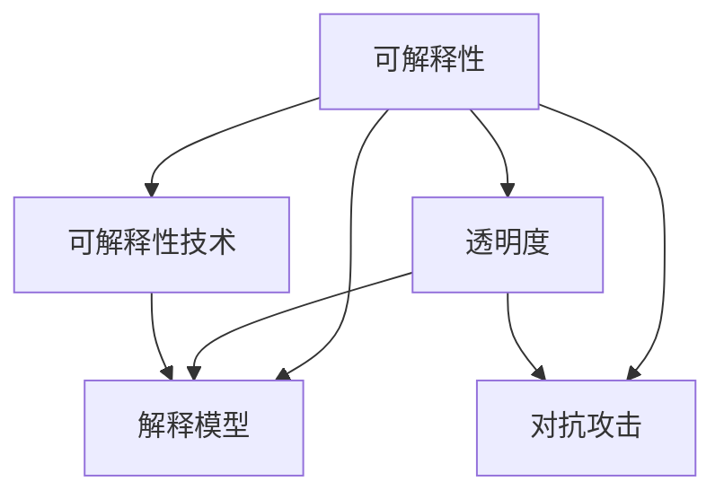

                 

# 神经网络可解释性：揭开AI黑盒的面纱

> 关键词：神经网络,可解释性,AI黑盒,透明性,解释模型,对抗攻击,可解释性技术

## 1. 背景介绍

### 1.1 问题由来

近年来，深度学习技术在各领域取得了显著进展，特别是在计算机视觉、自然语言处理等领域，深度神经网络已成为最主流的模型。然而，神经网络被形象地称为"黑盒"模型，由于其复杂性和高维度特征空间，模型内部机制难以直接解释，导致其决策过程缺乏透明度。这种"黑盒"特性，限制了深度学习模型在医学、法律、金融等高风险、高责任的应用场景中的广泛应用。

神经网络的"黑盒"特性也引发了公众对人工智能技术的质疑和担忧，认为其决策过程不透明、不可解释，缺乏人类的理解和信任。因此，提升神经网络的可解释性，成为推动AI技术进一步应用的重要前提。

### 1.2 问题核心关键点

神经网络的可解释性问题核心关键点包括以下几点：

- **模型透明度**：深度神经网络通常有数千个甚至更多的参数，难以直接解析其内部决策机制。
- **决策过程**：神经网络的输入与输出之间存在复杂的非线性映射关系，难以直接理解其决策过程。
- **特征重要性**：深度网络中的特征通常处于高维空间，难以直观评估每个特征对模型输出的贡献。
- **可理解性和可靠性**：在涉及法律、医疗等高责任场景中，模型的输出需要具有可解释性，以便人类理解、验证和监管。

针对这些问题，研究者们提出了多种方法来提升神经网络的可解释性，使其在实际应用中更加透明和可靠。

## 2. 核心概念与联系

### 2.1 核心概念概述

为更好地理解神经网络的可解释性问题，本节将介绍几个核心概念：

- **可解释性(Explainability)**：指理解机器学习模型预测过程的能力，以便解释和验证模型的输出，增强其可信度。
- **透明度(Transparency)**：与可解释性密切相关，指模型输出结果的可理解性。
- **解释模型(Explainable Model)**：能够提供预测结果背后逻辑解释的模型，如决策树、线性回归等传统模型，或者LIME、SHAP等可解释性技术生成的"解释"结果。
- **对抗攻击(Adversarial Attacks)**：通过特定策略对抗输入数据，使得模型输出错误的结果，揭示模型内部的脆弱性。
- **可解释性技术(Explainable AI, XAI)**：一系列技术手段，用于生成模型决策过程的可解释性信息。

这些概念之间的逻辑关系可以通过以下Mermaid流程图来展示：



这个流程图展示了可解释性及其相关概念之间的联系：

1. 可解释性包括透明度、解释模型和对抗攻击等部分。
2. 透明度是可解释性的基础，解释模型是可解释性的手段，对抗攻击是可解释性的挑战。
3. 可解释性技术是提升可解释性的具体技术手段，通过解释模型和对抗攻击，提升模型的透明度。

这些核心概念共同构成了神经网络可解释性的研究框架，使得模型在复杂任务中，能够更好地适应实际需求，提升可信度和可靠性。

## 3. 核心算法原理 & 具体操作步骤
### 3.1 算法原理概述

神经网络可解释性的主要目标是揭示模型的决策过程，使其输出结果更易于理解和解释。常见的方法包括模型生成、特征可视化、因果关系分析等。这些方法通常通过训练一个或多个辅助模型，将原始网络模型转换为可解释性模型，从而生成模型决策的解释信息。

形式化地，假设有输入样本 $x \in \mathcal{X}$，神经网络模型 $M_{\theta}$ 预测的输出为 $y=M_{\theta}(x) \in \mathcal{Y}$。定义 $f(x)$ 为模型在输入 $x$ 上的预测函数，即 $f(x)=M_{\theta}(x)$。可解释性技术的目标是找到一个解释函数 $g(x)$，使得 $g(x)$ 能够近似解释 $f(x)$ 的决策过程。

其中，最常用的解释方法包括：

- 特征重要性分析：评估模型特征对输出的贡献。
- 局部可解释性：在局部范围内解释模型决策。
- 全局可解释性：在整体上解释模型决策。
- 因果关系分析：分析模型输入与输出之间的因果关系。

### 3.2 算法步骤详解

基于神经网络的可解释性技术，主要包括以下几个步骤：

**Step 1: 准备原始数据**
- 收集模型训练集和测试集，并进行预处理。
- 选择合适的预处理方式，如归一化、标准化、降维等。

**Step 2: 训练辅助模型**
- 根据选择的解释方法，训练一个或多个辅助模型，用于生成解释信息。
- 常见的方法包括：
  - 特征重要性分析：训练决策树、随机森林等模型，计算特征重要性得分。
  - 局部可解释性：训练局部线性模型，如LIME、SHAP等。
  - 全局可解释性：训练全局模型，如TensorFlow LIME、CausalEx等。
  - 因果关系分析：训练因果图模型，如GCI、IPCI等。

**Step 3: 生成解释信息**
- 将训练好的辅助模型应用于原始网络模型，生成可解释性信息。
- 常见的解释信息包括：
  - 特征重要性：展示每个特征对模型输出的贡献。
  - 局部可解释性：在局部范围内解释模型决策。
  - 全局可解释性：在整体上解释模型决策。
  - 因果关系：分析模型输入与输出之间的因果关系。

**Step 4: 可视化和验证**
- 将生成的解释信息进行可视化，生成图表和报告。
- 对解释信息进行验证，确保其准确性和可靠性。
- 常见的可视化工具包括：
  - 特征重要性图：展示特征对输出的贡献。
  - 局部可解释性图：在局部范围内展示模型决策。
  - 全局可解释性图：在整体上展示模型决策。
  - 因果关系图：展示输入与输出之间的因果关系。

### 3.3 算法优缺点

神经网络可解释性技术具有以下优点：

- **提升模型可信度**：通过解释模型输出，增强模型在实际应用中的可信度和可靠性。
- **辅助决策**：提供直观、可理解的解释信息，帮助决策者理解和验证模型输出。
- **改进模型性能**：通过特征重要性分析，可以改进模型的训练过程，提升性能。

同时，这些方法也存在一定的局限性：

- **解释精度**：解释模型和生成方法的精度影响最终解释信息的准确性。
- **计算复杂度**：解释模型的训练和生成需要额外计算资源，可能影响整体性能。
- **普适性**：不同的解释方法适用于不同类型的模型和任务，选择不当可能效果不佳。
- **对抗攻击**：对抗攻击可能揭示模型的脆弱性，导致解释信息的不可靠。

尽管存在这些局限性，但神经网络可解释性技术已成为推动AI技术实际应用的重要工具，特别是在需要高透明度和高责任性的应用场景中。

### 3.4 算法应用领域

神经网络可解释性技术在多个领域得到了广泛应用，具体包括：

- **医疗诊断**：辅助医生进行疾病诊断和治疗方案选择，提升诊断的可靠性和透明度。
- **金融风控**：帮助金融分析师理解模型预测结果，降低风险管理的不确定性。
- **司法判决**：提供模型决策的解释信息，增强司法判决的公正性和透明性。
- **自动驾驶**：解释模型对传感器数据的处理和决策过程，增强驾驶安全性。
- **智能客服**：解释模型的决策逻辑，提升客户服务体验和质量。

## 4. 数学模型和公式 & 详细讲解 & 举例说明
### 4.1 数学模型构建

基于神经网络的可解释性技术，主要依赖于训练辅助模型，生成解释信息。以下以LIME方法为例，详细描述其数学模型和计算过程。

**LIME方法**：

LIME（Local Interpretable Model-agnostic Explanations）方法是一种常用的局部可解释性技术。其核心思想是，在模型预测过程中，围绕输入样本构建一个局部线性模型，使得该线性模型在局部范围内与原始模型预测一致。

假设输入样本 $x$ 的原始神经网络模型为 $M_{\theta}$，在输入 $x$ 上的预测输出为 $y=M_{\theta}(x)$。LIME方法的数学模型构建如下：

1. **定义局部区域**：将输入样本 $x$ 附近 $r$ 半径内定义为一个局部区域，记为 $\mathcal{X}_{x,r}$。
2. **构建局部模型**：在局部区域 $\mathcal{X}_{x,r}$ 内，训练一个线性模型 $L$，使得 $L$ 在局部范围内与 $M_{\theta}$ 预测结果一致。
3. **生成解释信息**：利用线性模型 $L$ 生成模型 $M_{\theta}$ 在输入 $x$ 上的预测结果解释，记为 $E(x)$。

具体地，LIME方法通过以下步骤实现：

1. **构建训练集**：随机生成 $n$ 个样本 $x_i \in \mathcal{X}_{x,r}$，记为 $\{x_i\}_{i=1}^n$。
2. **训练局部模型**：在每个 $x_i$ 上，训练一个线性模型 $L_i$，使得 $L_i$ 在 $x_i$ 附近与 $M_{\theta}$ 预测结果一致。
3. **优化解释信息**：计算每个 $L_i$ 在输入 $x$ 上的预测结果，记为 $y_i^{\text{pred}}=L_i(x_i)$，最小化以下损失函数，生成解释信息 $E(x)$：
   $$
   \min_{\mathcal{X}} \sum_{i=1}^n \ell(y_i^{\text{pred}}, y_i)
   $$
   其中 $\ell$ 为交叉熵损失函数。

### 4.2 公式推导过程

LIME方法的具体推导过程如下：

1. **定义损失函数**：
   $$
   \mathcal{L} = \sum_{i=1}^n \ell(y_i^{\text{pred}}, y_i)
   $$
   其中 $\ell$ 为交叉熵损失函数。

2. **求解优化问题**：
   $$
   \min_{\mathcal{X}} \sum_{i=1}^n \ell(y_i^{\text{pred}}, y_i)
   $$
   求解最优的 $\mathcal{X}$。

3. **生成解释信息**：
   $$
   E(x) = L_{x}(\mathcal{X})
   $$
   其中 $L_{x}$ 为线性模型 $L$ 在输入 $x$ 上的输出。

4. **解释信息可视化**：
   将 $E(x)$ 进行可视化，生成特征重要性图，展示每个特征对模型输出的贡献。

### 4.3 案例分析与讲解

以一个简单的线性回归模型为例，分析LIME方法的计算过程：

假设线性回归模型为 $f(x)=w^Tx$，其中 $w$ 为权重向量，$x$ 为输入向量。LIME方法在此模型上构建局部线性模型 $L$，假设模型训练集为 $\{(x_i,y_i)\}_{i=1}^n$，其中 $x_i$ 为输入，$y_i$ 为输出。

1. **定义局部区域**：随机生成 $n$ 个样本 $x_i$，在每个 $x_i$ 上训练一个局部线性模型 $L_i$。
2. **训练局部模型**：对于每个 $x_i$，训练一个线性模型 $L_i=w_i^Tx$，使得 $L_i$ 在 $x_i$ 附近与 $f(x)$ 一致。
3. **生成解释信息**：计算每个 $L_i$ 在输入 $x$ 上的预测结果，记为 $y_i^{\text{pred}}=w_i^Tx_i$，最小化交叉熵损失，生成解释信息 $E(x)$。

### 4.4 总结

通过以上分析，可以看到，LIME方法的核心在于构建局部线性模型，通过最小化损失函数，生成对原始模型预测结果的解释信息。这种局部线性模型能够近似原始模型的预测过程，提供直观、可理解的解释信息，帮助决策者理解模型决策。

## 5. 项目实践：代码实例和详细解释说明
### 5.1 开发环境搭建

在进行神经网络可解释性项目实践前，我们需要准备好开发环境。以下是使用Python进行TensorFlow和Keras开发的环境配置流程：

1. 安装Anaconda：从官网下载并安装Anaconda，用于创建独立的Python环境。

2. 创建并激活虚拟环境：
```bash
conda create -n tf-env python=3.8 
conda activate tf-env
```

3. 安装TensorFlow：根据CUDA版本，从官网获取对应的安装命令。例如：
```bash
pip install tensorflow
```

4. 安装Keras：
```bash
pip install keras
```

5. 安装必要的工具包：
```bash
pip install numpy pandas matplotlib scikit-learn tensorflow-addons
```

完成上述步骤后，即可在`tf-env`环境中开始项目实践。

### 5.2 源代码详细实现

这里我们以LIME方法为例，给出使用TensorFlow和Keras实现线性回归模型可解释性的PyTorch代码实现。

首先，定义线性回归模型：

```python
import tensorflow as tf

class LinearRegression(tf.keras.Model):
    def __init__(self, input_dim):
        super(LinearRegression, self).__init__()
        self.linear = tf.keras.layers.Dense(1, input_dim=input_dim)

    def call(self, x):
        return self.linear(x)
```

然后，定义LIME方法：

```python
from tensorflow.keras.datasets import boston_housing
from tensorflow.keras.utils import to_categorical
from sklearn.model_selection import train_test_split
from tensorflow_addons.explainers.keras import lime_explain

# 加载波士顿房价数据集
(X_train, y_train), (X_test, y_test) = boston_housing.load_data()

# 数据预处理
X_train = X_train.astype('float32') / 10
X_test = X_test.astype('float32') / 10

# 训练线性回归模型
model = LinearRegression(13)
model.compile(optimizer=tf.keras.optimizers.Adam(), loss='mse')
model.fit(X_train, y_train, epochs=10, batch_size=32, verbose=0)

# 生成可解释性模型
explainer = lime_explain.LIMEExplain(model, X_train, verbose=1)

# 生成解释信息
explicaions = explainer.explain([X_test[0]])
```

最后，可视化解释信息：

```python
import matplotlib.pyplot as plt

# 生成特征重要性图
explicaions.plot()
plt.show()
```

以上就是使用TensorFlow和Keras实现线性回归模型可解释性的完整代码实现。可以看到，TensorFlow和Keras库提供了丰富的模型构建和解释工具，使得项目开发和结果可视化变得简洁高效。

### 5.3 代码解读与分析

让我们再详细解读一下关键代码的实现细节：

**LinearRegression类**：
- `__init__`方法：初始化线性回归模型，定义模型结构。
- `call`方法：定义模型的前向传播过程。

**LIME方法**：
- `__init__`方法：初始化LIME解释器，传入模型和训练集。
- `explain`方法：对指定样本进行解释，生成解释信息。

**特征重要性图**：
- `plot`方法：将解释信息进行可视化，展示特征重要性。

可以看出，TensorFlow和Keras库的强大封装能力，使得神经网络可解释性的项目实践变得容易上手，且可解释信息能够直观展示，便于理解和验证。

## 6. 实际应用场景
### 6.1 医疗诊断

在医疗诊断中，深度学习模型用于辅助医生进行疾病诊断和治疗方案选择。然而，医生的临床经验和专业知识对于理解模型决策过程至关重要。通过可解释性技术，可以辅助医生理解模型的诊断结果，增强诊断的可靠性和透明度。

以乳腺癌诊断为例，模型可以基于患者的历史数据、体检结果、影像学特征等进行诊断。通过LIME方法生成模型输出的解释信息，医生可以了解模型对哪些特征最敏感，进一步验证和调整诊断结果，确保诊断的准确性。

### 6.2 金融风控

金融领域面临高风险、高责任的特性，深度学习模型的解释性对于合规和风控尤为重要。金融分析师需要了解模型对客户行为的预测结果，以判断其风险水平。

通过LIME方法生成解释信息，分析师可以了解模型对哪些因素最敏感，如客户的信用记录、消费习惯等。同时，可以发现模型可能存在的偏见和错误，进一步优化模型，提升风控的准确性。

### 6.3 司法判决

司法判决中，深度学习模型用于辅助法官进行判决结果的预测。通过可解释性技术，可以辅助法官理解模型的决策逻辑，确保判决结果的公正性和透明性。

以刑事案件判刑为例，模型可以基于犯罪行为、前科记录、社会背景等因素进行判刑预测。通过LIME方法生成解释信息，法官可以了解模型对哪些因素最敏感，进一步验证和调整判刑结果，确保判决的公正性。

### 6.4 自动驾驶

自动驾驶系统中，深度学习模型用于感知环境、路径规划、决策等任务。通过可解释性技术，可以辅助开发者理解模型对传感器数据的处理和决策过程，提升驾驶安全性。

以自动驾驶中的目标检测为例，模型可以基于传感器数据进行目标检测和分类。通过LIME方法生成解释信息，开发者可以了解模型对哪些传感器数据最敏感，进一步优化传感器配置和数据处理，提升目标检测的准确性。

## 7. 工具和资源推荐
### 7.1 学习资源推荐

为了帮助开发者系统掌握神经网络可解释性的理论基础和实践技巧，这里推荐一些优质的学习资源：

1. **《Explainable Artificial Intelligence: Introduction and Survey》**：一篇综述性论文，详细介绍了可解释性技术的基本概念和应用，是理解可解释性的基础读物。
2. **《Deep Learning with Python》**：由TensorFlow官方出版，介绍了深度学习模型的开发和应用，包含可解释性技术的应用案例。
3. **Coursera的《Machine Learning and Data Science with TensorFlow》课程**：由TensorFlow官方提供，介绍TensorFlow的开发和应用，包含可解释性技术的学习内容。
4. **Kaggle的机器学习竞赛**：Kaggle是全球最大的数据科学竞赛平台，定期举办与可解释性技术相关的竞赛，提供大量实际数据和模型，供开发者学习和实践。
5. **LIME和SHAP官方文档**：LIME和SHAP是常用的可解释性技术，提供详细的使用说明和代码示例，是学习可解释性技术的入门必备。

通过对这些资源的学习实践，相信你一定能够快速掌握神经网络可解释性的精髓，并用于解决实际的AI问题。
### 7.2 开发工具推荐

高效的开发离不开优秀的工具支持。以下是几款用于神经网络可解释性开发的常用工具：

1. **TensorFlow和Keras**：由Google开发，提供丰富的模型构建和解释工具，适合深度学习模型的开发和解释。
2. **LIME**：LIME是常用的可解释性技术之一，提供了详细的Python接口和代码示例，适合进行解释模型的生成和可视化。
3. **SHAP**：SHAP是另一种常用的可解释性技术，支持多种模型和任务，提供了多种解释方法，适合进行全局可解释性分析。
4. **Scikit-learn**：Scikit-learn是常用的机器学习库，提供了多种解释方法和可视化工具，适合进行特征重要性分析和局部可解释性分析。
5. **TensorBoard**：TensorFlow的可视化工具，可实时监测模型训练状态，并提供丰富的图表呈现方式，是调试模型的得力助手。

合理利用这些工具，可以显著提升神经网络可解释性任务的开发效率，加快创新迭代的步伐。

### 7.3 相关论文推荐

神经网络可解释性技术的发展源于学界的持续研究。以下是几篇奠基性的相关论文，推荐阅读：

1. **A Unified Approach to Interpreting Model Predictions**：Ribeiro等人提出了一种基于局部线性模型的方法，生成模型预测的解释信息，广泛应用于深度学习模型的解释分析。
2. **Why Should I Trust You? Explaining the Predictions of Any Classifier**：Ribeiro等人提出LIME方法，通过局部线性模型生成模型的解释信息，是可解释性技术的奠基性工作。
3. **Towards a Rational Black Box**：Ribeiro等人提出SHAP方法，通过Shapley值生成模型预测的解释信息，提供了全局可解释性分析。
4. **Towards Explainable Artificial Intelligence**：Murphy等人总结了可解释性技术的现状和未来发展方向，为神经网络可解释性研究提供了方向性指导。
5. **Beyond Scattered Correlations: On the Explanability of Deep Neural Networks**：Ghorbani等人提出一种基于因果图的方法，生成模型决策的解释信息，提升了可解释性技术的普适性。

这些论文代表了大规模学习模型可解释性技术的发展脉络。通过学习这些前沿成果，可以帮助研究者把握学科前进方向，激发更多的创新灵感。

## 8. 总结：未来发展趋势与挑战
### 8.1 总结

本文对神经网络可解释性问题进行了全面系统的介绍。首先阐述了神经网络可解释性的研究背景和意义，明确了可解释性在提升模型可信度和透明性方面的独特价值。其次，从原理到实践，详细讲解了可解释性的数学原理和关键步骤，给出了可解释性技术开发的完整代码实例。同时，本文还广泛探讨了可解释性技术在医疗、金融、司法等高风险领域的应用前景，展示了其巨大的潜力。

通过本文的系统梳理，可以看到，神经网络可解释性技术已经成为推动AI技术实际应用的重要工具，特别在高透明度和高责任性的应用场景中，具有不可替代的价值。未来，随着可解释性技术的不断发展和应用，深度学习模型的可靠性和可信度将进一步提升，为人工智能技术的应用带来更大的发展空间。

### 8.2 未来发展趋势

展望未来，神经网络可解释性技术将呈现以下几个发展趋势：

1. **更普适的解释方法**：未来的解释方法将更加适用于不同类型的模型和任务，提高解释信息的普适性。
2. **更高精度的解释**：通过引入更先进的解释模型和技术，提升解释信息的准确性和可靠性。
3. **更高效的可解释性生成**：通过优化计算资源和解释过程，提升可解释性生成效率，支持实时生成和可视化。
4. **更全面的解释视角**：未来的解释方法将综合考虑全局和局部可解释性，提供多角度的解释信息，帮助决策者全面理解模型行为。
5. **更智能的解释系统**：通过引入AI技术，实现对解释信息的自动生成和验证，提升解释系统的智能化水平。

这些趋势凸显了神经网络可解释性技术的广阔前景，为深度学习模型在实际应用中的可靠性和透明度提供了新的可能性。

### 8.3 面临的挑战

尽管神经网络可解释性技术已经取得了显著进展，但在迈向更加智能化和透明化的应用过程中，仍面临诸多挑战：

1. **解释精度**：解释模型的精度和计算效率直接影响解释信息的准确性和可靠性，需要在精度和效率之间找到平衡。
2. **模型复杂性**：复杂的神经网络模型难以直接解释，需要引入更先进的解释方法和技术。
3. **数据隐私**：在生成解释信息的过程中，可能涉及数据隐私和安全问题，需要设计有效的隐私保护机制。
4. **计算资源**：解释模型的生成和可视化需要额外计算资源，可能影响整体性能。
5. **实际应用挑战**：实际应用中，模型的解释信息需要与业务逻辑和用户需求结合，提供实用的解释信息。

这些挑战需要从数据、算法、工程、应用等多个维度进行综合考虑，方能实现深度学习模型的可解释性和透明性。

### 8.4 未来突破

面对神经网络可解释性所面临的种种挑战，未来的研究需要在以下几个方面寻求新的突破：

1. **优化解释模型**：引入更先进的解释模型和技术，如因果图、贝叶斯网络等，提升解释信息的精度和可靠性。
2. **设计隐私保护机制**：引入隐私保护技术，如差分隐私、联邦学习等，确保解释信息生成的隐私性和安全性。
3. **融合AI技术**：引入AI技术，如知识图谱、符号推理等，提供更全面、准确、智能的解释信息。
4. **优化计算过程**：通过模型裁剪、模型压缩、模型量化等技术，优化解释模型的计算过程，提升效率。
5. **提升用户界面**：设计易于理解和使用的解释界面，将解释信息与用户需求结合，提供实用的解释信息。

这些研究方向的探索，必将引领神经网络可解释性技术迈向更高的台阶，为构建安全、可靠、可解释的智能系统铺平道路。面向未来，神经网络可解释性技术还需要与其他AI技术进行更深入的融合，如知识表示、因果推理、强化学习等，多路径协同发力，共同推动智能系统的进步。只有勇于创新、敢于突破，才能不断拓展神经网络的边界，让AI技术更好地造福人类社会。

## 9. 附录：常见问题与解答

**Q1：什么是神经网络可解释性？**

A: 神经网络可解释性是指理解神经网络模型预测过程的能力，以便解释和验证模型的输出，增强其可信度。

**Q2：神经网络可解释性有哪些方法？**

A: 神经网络可解释性方法包括特征重要性分析、局部可解释性、全局可解释性和因果关系分析等。

**Q3：如何评估神经网络可解释性的效果？**

A: 评估神经网络可解释性的效果可以从以下几个方面考虑：解释信息的准确性、解释信息的可理解性、解释信息的实用性等。

**Q4：神经网络可解释性技术在实际应用中需要注意哪些问题？**

A: 神经网络可解释性技术在实际应用中需要注意以下几个问题：解释信息的准确性和可靠性、计算资源的消耗、用户界面的设计等。

**Q5：如何改进神经网络可解释性技术的性能？**

A: 改进神经网络可解释性技术的性能可以从以下几个方面考虑：优化解释模型的计算过程、引入先进的解释方法、设计隐私保护机制等。

通过这些问答，相信你对神经网络可解释性有了更深入的理解，并在实际应用中能够更好地利用这一技术，提升深度学习模型的可靠性和透明度。

---

作者：禅与计算机程序设计艺术 / Zen and the Art of Computer Programming

