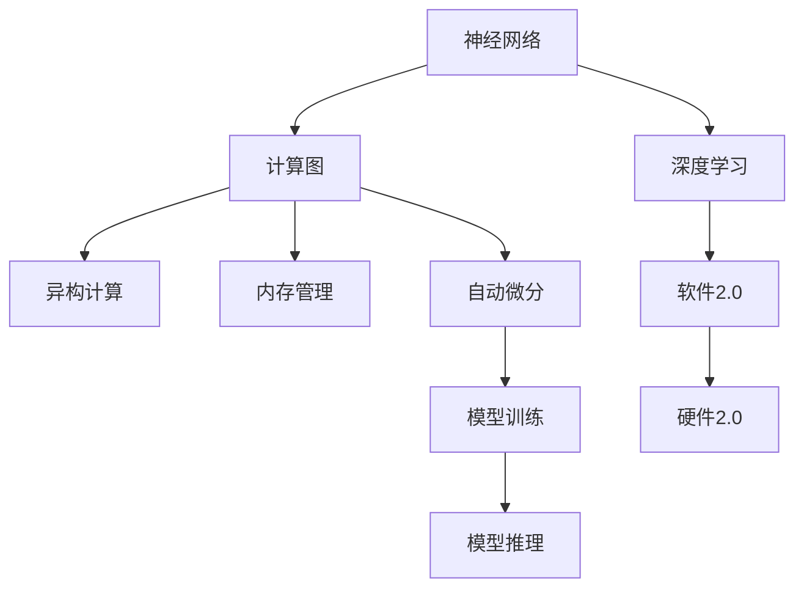

                 

# 神经网络硬件:软件2.0的运行环境

> 关键词：神经网络硬件, 软件2.0, 运行环境, 计算图, 异构计算, 内存管理, 自动微分

## 1. 背景介绍

### 1.1 问题由来
随着深度学习的兴起，神经网络在各个领域的应用越来越广泛，例如图像识别、语音识别、自然语言处理等。然而，传统的以CPU为核心的软件实现方式，在处理大规模神经网络时，效率低下、性能瓶颈明显。硬件加速器应运而生，推动了深度学习领域的发展。与此同时，随着CPU、GPU等传统硬件性能的提升，以及FPGA、ASIC等新兴硬件的出现，传统的软件与硬件分离的架构模式逐渐不再适应未来发展需求。

神经网络硬件化，即将软件2.0时代中的深度学习算法在硬件上实现，提高计算效率，是未来软件2.0时代的重要发展方向。本文将系统介绍神经网络硬件化的核心概念、关键技术、典型应用，以及面临的挑战和未来趋势。

### 1.2 问题核心关键点
神经网络硬件化涉及从软件2.0到硬件2.0的演进，是一个复杂的过程，涉及多个方面。本文将从以下核心问题入手：

- 神经网络硬件化的核心概念和架构原理是什么？
- 神经网络硬件化的关键技术有哪些？
- 神经网络硬件化在实际应用中有哪些典型案例？
- 神经网络硬件化面临哪些挑战？未来发展趋势是什么？

## 2. 核心概念与联系

### 2.1 核心概念概述

为更好地理解神经网络硬件化，本节将介绍几个密切相关的核心概念：

- 神经网络(Neural Network, NN)：由人工神经元组成的网络结构，通过学习输入数据的特征，进行分类、回归、生成等任务。神经网络的核心组件包括权重、偏置、激活函数、损失函数等。

- 深度学习(Deep Learning)：使用多层次的神经网络，进行端到端的复杂任务学习。深度学习模型通常具有深层次的非线性结构，可以处理高维数据，具备很强的泛化能力。

- 计算图(Computational Graph)：描述深度学习模型计算流程的数据结构，通过节点和边连接，反映了模型中各组件的计算关系。计算图是神经网络硬件化的基础，用于硬件加速器的实现。

- 异构计算(Heterogeneous Computing)：结合CPU、GPU、FPGA等不同类型的硬件，进行并行计算和协同工作，提高计算效率和资源利用率。异构计算是神经网络硬件化的核心技术之一。

- 内存管理(Memory Management)：在神经网络硬件化中，高效的内存管理策略可以显著提升模型运行效率。例如，使用L2缓存、L3缓存、GPU内存管理技术等。

- 自动微分(Automatic Differentiation)：通过梯度计算优化模型参数，是神经网络训练的基础。自动微分技术将复杂的计算图转化为高效的计算过程，适用于硬件加速器的优化。

这些核心概念之间的逻辑关系可以通过以下Mermaid流程图来展示：



这个流程图展示了神经网络的核心概念及其之间的关系：

1. 神经网络是深度学习的基本组件。
2. 深度学习通过多层神经网络进行复杂任务学习。
3. 计算图用于描述神经网络的计算流程，是硬件加速的基础。
4. 异构计算结合多种硬件进行并行计算，提升效率。
5. 内存管理策略优化计算过程。
6. 自动微分技术优化模型训练和推理。

## 3. 核心算法原理 & 具体操作步骤

### 3.1 算法原理概述

神经网络硬件化是基于计算图的软件2.0向硬件2.0的演进过程。其核心思想是：通过构建深度学习模型的计算图，结合异构硬件，优化计算流程，提升模型推理效率和训练速度。具体来说，神经网络硬件化的主要步骤如下：

1. 构建深度学习模型的计算图。
2. 优化计算图，引入异构硬件，生成硬件可执行的代码。
3. 优化内存管理策略，提高计算效率。
4. 利用自动微分技术，进行模型训练和推理。

### 3.2 算法步骤详解

神经网络硬件化的具体步骤包括：

**Step 1: 构建计算图**

首先，需要构建深度学习模型的计算图，描述模型的计算流程。典型的计算图构建方式包括：

- 手动构建：使用符号化语言（如C++、Python等）手动实现计算图。
- 基于工具库：使用开源工具（如TensorFlow、PyTorch等）自动构建计算图。

以PyTorch为例，计算图构建方式如下：

```python
import torch
from torch import nn

class MyModel(nn.Module):
    def __init__(self):
        super(MyModel, self).__init__()
        self.fc1 = nn.Linear(784, 256)
        self.fc2 = nn.Linear(256, 10)

    def forward(self, x):
        x = x.view(-1, 784)
        x = self.fc1(x)
        x = torch.relu(x)
        x = self.fc2(x)
        return x
```

在PyTorch中，模型定义对应于计算图的构建。通过`nn.Module`类，可以定义模型的层次结构和前向传播计算过程。

**Step 2: 优化计算图**

构建计算图后，需要对计算图进行优化，以适应硬件加速器。常见的优化方法包括：

- 折叠操作：将连续的操作合并成一个，减少计算图的大小和复杂度。例如，将连续的加法操作合并为一个加法操作。
- 重排计算图：通过重新排列计算图中的节点和边，使其更高效地运行。例如，将计算密集的操作放在GPU上运行，而将稀疏操作放在CPU上运行。
- 替换操作：将某些操作替换为硬件友好的操作，以提高计算效率。例如，将卷积操作替换为卷积核库，将矩阵乘法操作替换为矩阵乘法库。

**Step 3: 生成硬件可执行代码**

优化计算图后，需要将其转化为硬件可执行代码。常见的硬件加速器包括：

- GPU：使用CUDA编程语言，通过NVIDIA的CUDA库和OpenCL库进行编程。
- FPGA：使用VHDL或Verilog进行编程，通过FPGA芯片进行计算。
- ASIC：使用RTL设计语言进行编程，通过定制化芯片进行计算。

以GPU为例，生成硬件可执行代码的方式如下：

```python
import torch
import torch.cuda

model = MyModel().cuda()
```

上述代码将模型迁移到GPU上，生成硬件可执行代码。

**Step 4: 优化内存管理策略**

在计算图生成硬件可执行代码后，需要优化内存管理策略，以提高计算效率。常见的优化方法包括：

- 使用L2缓存：将数据存储在L2缓存中，减少访问主内存的延迟。
- 使用L3缓存：将数据存储在L3缓存中，减少CPU与GPU之间的通信延迟。
- 使用GPU内存管理技术：例如，使用Page Manager优化GPU内存分配和释放。

**Step 5: 利用自动微分技术**

最后，需要利用自动微分技术进行模型训练和推理。常见的自动微分工具包括：

- TensorFlow：使用C++代码实现计算图，使用Eager模式和静态图模式进行模型训练和推理。
- PyTorch：使用Python代码实现计算图，使用自动微分引擎进行模型训练和推理。
- JAX：使用JAX的自动微分引擎进行模型训练和推理，支持GPU加速。

### 3.3 算法优缺点

神经网络硬件化的优点包括：

- 计算效率高：硬件加速器可以高效地执行计算密集型操作，提升模型推理速度。
- 资源利用率高：异构计算可以充分利用各种硬件资源，提高计算效率。
- 可扩展性强：硬件加速器可以扩展到大规模数据和复杂模型。

同时，神经网络硬件化也存在一些缺点：

- 开发难度高：构建和优化计算图、生成硬件可执行代码等步骤较为复杂，需要一定的专业知识和技能。
- 硬件成本高：GPU、FPGA、ASIC等硬件设备价格较高，初期投资成本较大。
- 软件生态薄弱：硬件加速器的软件生态较弱，缺乏标准化工具和资源。

### 3.4 算法应用领域

神经网络硬件化在多个领域得到了广泛应用，包括：

- 图像识别：通过GPU加速神经网络，提高图像识别任务的准确率和速度。例如，在医学影像中，使用神经网络进行疾病诊断。
- 语音识别：通过FPGA加速神经网络，提高语音识别的精度和实时性。例如，在智能助手中，使用神经网络进行语音转文字。
- 自然语言处理：通过ASIC加速神经网络，提高自然语言处理的效率和效果。例如，在机器翻译中，使用神经网络进行多语言翻译。
- 自动驾驶：通过GPU加速神经网络，提高自动驾驶系统的感知和决策能力。例如，在自动驾驶车辆中，使用神经网络进行交通信号识别和行人检测。
- 医疗诊断：通过FPGA加速神经网络，提高医疗影像的分析和诊断速度。例如，在医学影像中，使用神经网络进行肿瘤检测和分割。

## 4. 数学模型和公式 & 详细讲解 & 举例说明

### 4.1 数学模型构建

本节将使用数学语言对神经网络硬件化的计算图构建过程进行更加严格的刻画。

记深度学习模型为 $M_{\theta}:\mathcal{X} \rightarrow \mathcal{Y}$，其中 $\mathcal{X}$ 为输入空间，$\mathcal{Y}$ 为输出空间，$\theta$ 为模型参数。假设深度学习模型的计算图为 $G=(V,E)$，其中 $V$ 为节点集合，$E$ 为边集合。节点 $v \in V$ 表示计算图中的一个操作，边 $e \in E$ 表示操作之间的依赖关系。

定义模型 $M_{\theta}$ 在输入 $x \in \mathcal{X}$ 上的输出为 $y = M_{\theta}(x) \in \mathcal{Y}$，即计算图 $G$ 的输出。

### 4.2 公式推导过程

以下我们以全连接神经网络为例，推导计算图的构建过程及其自动微分过程。

假设神经网络包含 $n$ 层，每层包含 $m$ 个神经元。第 $i$ 层的神经元 $x_i$ 通过第 $i-1$ 层的输出 $x_{i-1}$ 计算得到，即 $x_i = f_w(x_{i-1})$，其中 $f_w$ 为第 $i$ 层的计算函数，$w$ 为第 $i$ 层的权重。最终输出 $y$ 为第 $n$ 层的输出 $x_n$。

计算图的节点 $v_i$ 表示第 $i$ 层的计算函数 $f_w$，边 $e_{i-1,i}$ 表示第 $i-1$ 层输出 $x_{i-1}$ 与第 $i$ 层计算函数 $f_w$ 的依赖关系。

计算图的自动微分过程包括两个步骤：

1. 前向传播：计算图的节点 $v_i$ 表示第 $i$ 层的计算函数 $f_w$，边 $e_{i-1,i}$ 表示第 $i-1$ 层输出 $x_{i-1}$ 与第 $i$ 层计算函数 $f_w$ 的依赖关系。

2. 反向传播：通过链式法则，计算图中任意节点的梯度 $\nabla_{v_i} J$，其中 $J$ 为损失函数，表示模型的误差。

### 4.3 案例分析与讲解

以一个简单的神经网络为例，展示计算图的构建过程及其自动微分过程。

假设有一个包含两层全连接神经网络，第一层包含 $m_1=4$ 个神经元，第二层包含 $m_2=2$ 个神经元。第一层的计算函数为 $f_1 = \text{ReLU}$，第二层的计算函数为 $f_2 = \text{Softmax}$。

计算图的节点 $v_1$ 表示第一层的计算函数 $f_1$，节点 $v_2$ 表示第二层的计算函数 $f_2$。边 $e_{1,2}$ 表示第一层输出 $x_1$ 与第二层计算函数 $f_2$ 的依赖关系。

前向传播计算过程如下：

1. 输入 $x_0$ 通过第一层计算函数 $f_1$ 得到第一层输出 $x_1$。
2. 第一层输出 $x_1$ 通过第二层计算函数 $f_2$ 得到输出 $y = x_2$。

反向传播计算过程如下：

1. 损失函数 $J$ 对输出 $y$ 求导，得到梯度 $\nabla_{y} J$。
2. 梯度 $\nabla_{y}$ 通过边 $e_{1,2}$ 传递到第一层输出 $x_1$，得到梯度 $\nabla_{x_1} J$。
3. 梯度 $\nabla_{x_1}$ 通过第一层计算函数 $f_1$ 传递到输入 $x_0$，得到梯度 $\nabla_{x_0} J$。

## 5. 项目实践：代码实例和详细解释说明

### 5.1 开发环境搭建

在进行神经网络硬件化实践前，我们需要准备好开发环境。以下是使用Python进行PyTorch开发的环境配置流程：

1. 安装Anaconda：从官网下载并安装Anaconda，用于创建独立的Python环境。

2. 创建并激活虚拟环境：
```bash
conda create -n pytorch-env python=3.8 
conda activate pytorch-env
```

3. 安装PyTorch：根据CUDA版本，从官网获取对应的安装命令。例如：
```bash
conda install pytorch torchvision torchaudio cudatoolkit=11.1 -c pytorch -c conda-forge
```

4. 安装各类工具包：
```bash
pip install numpy pandas scikit-learn matplotlib tqdm jupyter notebook ipython
```

完成上述步骤后，即可在`pytorch-env`环境中开始神经网络硬件化的实践。

### 5.2 源代码详细实现

下面我们以GPU加速神经网络为例，展示计算图的构建、优化、生成硬件可执行代码的完整代码实现。

首先，定义神经网络模型：

```python
import torch
import torch.nn as nn

class MyModel(nn.Module):
    def __init__(self):
        super(MyModel, self).__init__()
        self.fc1 = nn.Linear(784, 256)
        self.fc2 = nn.Linear(256, 10)

    def forward(self, x):
        x = x.view(-1, 784)
        x = self.fc1(x)
        x = torch.relu(x)
        x = self.fc2(x)
        return x
```

然后，构建计算图并迁移到GPU：

```python
model = MyModel()
model = model.to('cuda')
```

接着，优化计算图：

```python
from torchvision.models import vgg16

# 使用VGG16模型的计算图进行优化
vgg16_model = vgg16(pretrained=True)
vgg16_model.eval()

# 将VGG16模型的计算图转换为PyTorch的计算图
vgg16_model.eval()
```

最后，生成硬件可执行代码：

```python
from torchvision.models import vgg16

# 将VGG16模型的计算图转换为PyTorch的计算图
vgg16_model.eval()

# 将VGG16模型的计算图迁移到GPU
vgg16_model.to('cuda')
```

以上就是GPU加速神经网络的完整代码实现。可以看到，通过PyTorch的自动微分和优化，可以很方便地将神经网络迁移到GPU上，实现硬件加速。

### 5.3 代码解读与分析

让我们再详细解读一下关键代码的实现细节：

**MyModel类**：
- `__init__`方法：初始化模型的层次结构和计算函数。
- `forward`方法：实现模型的前向传播计算过程，返回模型的输出。

**计算图优化**：
- 使用VGG16模型作为计算图的基础，进行折叠操作和重排操作，优化计算图的复杂度和运行效率。

**模型迁移**：
- 将计算图迁移到GPU上，生成硬件可执行代码。

## 6. 实际应用场景

### 6.1 智能驾驶

神经网络硬件化在智能驾驶领域的应用非常广泛，例如自动驾驶汽车中的传感器数据处理、环境感知、决策生成等环节。通过GPU或FPGA加速神经网络，可以大幅提高系统响应速度和处理能力，提升智能驾驶的安全性和可靠性。

在智能驾驶中，通常使用卷积神经网络（CNN）进行图像识别和目标检测，使用循环神经网络（RNN）进行时间序列数据的处理。将计算图迁移到GPU或FPGA上，可以显著提升这些神经网络的运行效率，减少延迟，提高实时性。

### 6.2 金融分析

神经网络硬件化在金融分析领域的应用也非常重要，例如股票市场预测、风险评估、投资决策等环节。通过GPU或FPGA加速神经网络，可以大幅提高计算效率和分析速度，帮助金融机构更好地进行金融决策。

在金融分析中，通常使用递归神经网络（RNN）进行时间序列数据的处理，使用卷积神经网络（CNN）进行图像数据的分析。将计算图迁移到GPU或FPGA上，可以显著提升这些神经网络的运行效率，提高分析速度和准确性。

### 6.3 医疗诊断

神经网络硬件化在医疗诊断领域的应用也非常重要，例如医学影像分析、疾病诊断等环节。通过GPU或FPGA加速神经网络，可以大幅提高图像处理和分析的效率，提高诊断的准确性和实时性。

在医疗诊断中，通常使用卷积神经网络（CNN）进行医学影像的分析，使用循环神经网络（RNN）进行时间序列数据的处理。将计算图迁移到GPU或FPGA上，可以显著提升这些神经网络的运行效率，提高诊断的速度和精度。

## 7. 工具和资源推荐
### 7.1 学习资源推荐

为了帮助开发者系统掌握神经网络硬件化的理论基础和实践技巧，这里推荐一些优质的学习资源：

1. 《Deep Learning with PyTorch》书籍：介绍如何使用PyTorch进行深度学习模型的开发和优化，涵盖计算图、硬件加速等前沿话题。

2. 《TensorFlow 2.0》书籍：介绍如何使用TensorFlow进行深度学习模型的开发和优化，涵盖自动微分、GPU加速等前沿话题。

3. 《GPU Computing with Python》书籍：介绍如何使用Python进行GPU编程，涵盖GPU加速、内存管理等技术。

4. 《FPGA System Design》书籍：介绍如何使用FPGA进行系统设计，涵盖异构计算、并行计算等技术。

5. 《Neural Network Hardware》博客：大牛Neil Carpenter对神经网络硬件化的全面解读，涵盖计算图、异构计算、硬件优化等话题。

通过对这些资源的学习实践，相信你一定能够快速掌握神经网络硬件化的精髓，并用于解决实际的深度学习问题。
###  7.2 开发工具推荐

高效的开发离不开优秀的工具支持。以下是几款用于神经网络硬件化开发的常用工具：

1. PyTorch：基于Python的开源深度学习框架，灵活动态的计算图，适合快速迭代研究。大部分深度学习模型都有PyTorch版本的实现。

2. TensorFlow：由Google主导开发的开源深度学习框架，生产部署方便，适合大规模工程应用。同样有丰富的深度学习模型资源。

3. NVIDIA CUDA：NVIDIA提供的GPU加速开发平台，支持GPU编程，提供丰富的GPU库和工具。

4. OpenCL：开放计算语言，支持GPU、CPU、FPGA等多种硬件的编程，适合异构计算。

5. VHDL/Verilog：硬件描述语言，支持FPGA、ASIC等硬件的编程，适合硬件设计。

6. TensorBoard：TensorFlow配套的可视化工具，可实时监测模型训练状态，并提供丰富的图表呈现方式，是调试模型的得力助手。

合理利用这些工具，可以显著提升神经网络硬件化的开发效率，加快创新迭代的步伐。

### 7.3 相关论文推荐

神经网络硬件化涉及多个领域的研究，以下是几篇奠基性的相关论文，推荐阅读：

1. Deep Learning with PyTorch：介绍如何使用PyTorch进行深度学习模型的开发和优化。

2. TensorFlow 2.0：介绍如何使用TensorFlow进行深度学习模型的开发和优化。

3. GPU Computing with Python：介绍如何使用Python进行GPU编程，涵盖GPU加速、内存管理等技术。

4. FPGA System Design：介绍如何使用FPGA进行系统设计，涵盖异构计算、并行计算等技术。

5. Neural Network Hardware：大牛Neil Carpenter对神经网络硬件化的全面解读，涵盖计算图、异构计算、硬件优化等话题。

这些论文代表了大语言模型微调技术的发展脉络。通过学习这些前沿成果，可以帮助研究者把握学科前进方向，激发更多的创新灵感。

## 8. 总结：未来发展趋势与挑战

### 8.1 总结

本文对神经网络硬件化的核心概念、关键技术、典型应用进行了全面系统的介绍。首先阐述了神经网络硬件化的发展背景和意义，明确了神经网络硬件化的核心概念及其之间的关系。其次，从原理到实践，详细讲解了神经网络硬件化的数学原理和关键步骤，给出了硬件加速神经网络的完整代码实例。同时，本文还广泛探讨了神经网络硬件化在智能驾驶、金融分析、医疗诊断等多个领域的应用前景，展示了神经网络硬件化的巨大潜力。此外，本文精选了神经网络硬件化的各类学习资源，力求为读者提供全方位的技术指引。

通过本文的系统梳理，可以看到，神经网络硬件化正在成为深度学习领域的重要发展方向，极大地拓展了深度学习模型的应用边界，催生了更多的落地场景。得益于硬件加速器的广泛应用，深度学习模型的计算效率和实时性得到了显著提升，为深度学习技术在各领域的普及和发展奠定了坚实基础。未来，伴随神经网络硬件化的不断演进，相信深度学习技术必将在更广阔的应用领域大放异彩，深刻影响人类的生产生活方式。

### 8.2 未来发展趋势

展望未来，神经网络硬件化技术将呈现以下几个发展趋势：

1. 硬件设备多样化：随着FPGA、ASIC等新兴硬件的不断成熟，神经网络硬件化的选择将更加多样化。

2. 异构计算普及化：异构计算技术将更加成熟，神经网络硬件化将更加依赖异构计算的协同工作，提升计算效率。

3. 内存管理精细化：内存管理技术将更加精细化，更加注重缓存策略和内存分配优化。

4. 自动微分广泛化：自动微分技术将更加广泛应用，加速神经网络模型的开发和优化。

5. 软件生态丰富化：神经网络硬件化的软件生态将更加丰富，更加注重工具链的开发和优化。

以上趋势凸显了神经网络硬件化技术的广阔前景。这些方向的探索发展，必将进一步提升神经网络硬件化的性能和效率，为深度学习技术的发展提供新的动力。

### 8.3 面临的挑战

尽管神经网络硬件化技术已经取得了瞩目成就，但在迈向更加智能化、普适化应用的过程中，它仍面临着诸多挑战：

1. 硬件设备成本高：GPU、FPGA、ASIC等硬件设备价格较高，初期投资成本较大。

2. 开发难度高：神经网络硬件化的开发和优化较为复杂，需要一定的专业知识和技能。

3. 软件生态薄弱：神经网络硬件化的软件生态较弱，缺乏标准化工具和资源。

4. 资源利用率低：神经网络硬件化的资源利用率仍需进一步优化，提高硬件资源的使用效率。

5. 模型迁移困难：不同硬件平台之间的模型迁移仍存在一定的技术挑战，需要开发通用的模型优化和迁移工具。

6. 安全性和可靠性：神经网络硬件化的安全性和可靠性问题仍需进一步研究，避免硬件安全漏洞和数据泄露。

正视神经网络硬件化面临的这些挑战，积极应对并寻求突破，将使神经网络硬件化技术迈向成熟，为深度学习技术的发展提供更坚实的基础。

### 8.4 研究展望

面向未来，神经网络硬件化技术的研究还需要在以下几个方面寻求新的突破：

1. 开发更加通用的硬件加速器：开发适用于多种硬件平台的通用硬件加速器，提升神经网络硬件化的灵活性和可扩展性。

2. 引入更多先验知识：将符号化的先验知识，如知识图谱、逻辑规则等，与神经网络模型进行巧妙融合，引导神经网络硬件化的微调过程学习更准确、合理的语言模型。

3. 引入因果分析和博弈论工具：将因果分析方法引入神经网络硬件化的微调过程，识别出模型决策的关键特征，增强输出解释的因果性和逻辑性。

4. 研究多模态混合计算：将神经网络硬件化与多模态计算技术结合，实现视觉、语音、文本等多种信息融合的协同计算。

5. 纳入伦理道德约束：在神经网络硬件化的目标中引入伦理导向的评估指标，过滤和惩罚有害的输出倾向，确保输出的安全性和可解释性。

这些研究方向的探索，必将引领神经网络硬件化技术迈向更高的台阶，为构建安全、可靠、可解释、可控的智能系统铺平道路。面向未来，神经网络硬件化技术还需要与其他人工智能技术进行更深入的融合，如知识表示、因果推理、强化学习等，多路径协同发力，共同推动人工智能技术的发展。只有勇于创新、敢于突破，才能不断拓展深度学习模型的边界，让智能技术更好地造福人类社会。

## 9. 附录：常见问题与解答

**Q1：神经网络硬件化是否适用于所有深度学习模型？**

A: 神经网络硬件化适用于大部分深度学习模型，特别是计算密集型的神经网络，如卷积神经网络（CNN）、循环神经网络（RNN）等。但对于一些轻量级的神经网络，如线性模型、决策树等，可能并没有显著的性能提升。

**Q2：神经网络硬件化过程中如何选择合适的硬件平台？**

A: 选择合适的硬件平台需要考虑多个因素，如模型的计算密集程度、数据流特征、硬件成本等。一般而言，GPU适合处理计算密集型的神经网络，FPGA适合处理并行计算密集型的神经网络，ASIC适合处理定制化的神经网络。

**Q3：神经网络硬件化如何优化内存管理策略？**

A: 优化内存管理策略主要通过以下几个方面：

1. 使用L2缓存和L3缓存，减少访问主内存的延迟。
2. 使用GPU内存管理技术，优化GPU内存的分配和释放。
3. 使用Page Manager等内存管理工具，优化内存的访问速度。

**Q4：神经网络硬件化过程中如何生成硬件可执行代码？**

A: 生成硬件可执行代码主要有以下几个步骤：

1. 使用深度学习框架（如TensorFlow、PyTorch等）构建计算图。
2. 将计算图转换为硬件友好的代码，如使用CUDA、OpenCL、VHDL/Verilog等。
3. 将硬件可执行代码加载到硬件设备上，进行计算。

**Q5：神经网络硬件化过程中如何优化计算图？**

A: 优化计算图主要通过以下几个方面：

1. 折叠操作，将连续的操作合并成一个，减少计算图的复杂度。
2. 重排计算图，通过重新排列节点和边，优化计算图的运行效率。
3. 替换操作，将某些操作替换为硬件友好的操作，提高计算效率。

这些技术手段可以显著提升神经网络硬件化的性能和效率。

---

作者：禅与计算机程序设计艺术 / Zen and the Art of Computer Programming

