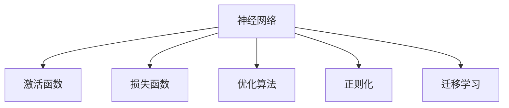

                 

## 1. 背景介绍

### 1.1 问题由来

人类文明进入工业革命以来，科技不断革新，信息传播日益便捷。然而，过去几十年的信息积累，远超以往数千年的知识总和。如何在海量信息中提取和整合知识，是人类面临的巨大挑战。传统的手工标注和专家指导方式，难以满足日益增长的数据需求。

人工智能技术的诞生，特别是深度学习的发展，为信息处理带来了革命性的变革。特别是神经网络模型，凭借其强大的自适应能力和非线性建模能力，在图像识别、语音识别、自然语言处理等多个领域取得了令人瞩目的成果。

### 1.2 问题核心关键点

神经网络通过构建复杂的网络结构，模拟生物神经元之间的连接方式，将大规模数据进行分布式处理，并从中抽取特征。其核心优势在于：

- **强大的自适应能力**：通过学习大量数据，神经网络可以自动发现数据的潜在规律，进行特征提取和分类。
- **强大的非线性建模能力**：能够处理高维数据，捕捉复杂模式，适应非线性问题。
- **高效的分布式计算**：利用并行计算优势，加速训练和推理速度。
- **可解释性**：通过可视化工具，理解模型内部的决策过程，提升可解释性。

但同时，神经网络也面临着诸多挑战，如模型复杂度高、训练耗时长、过度拟合、可解释性不足等。如何克服这些挑战，充分发挥神经网络的优势，成为当前AI研究的热点。

## 2. 核心概念与联系

### 2.1 核心概念概述

为更好地理解神经网络技术，本节将介绍几个关键概念及其之间的关系：

- **神经网络(Neural Networks, NN)**：由多个神经元（或称为节点）构成的网络结构，通过模拟生物神经元之间的连接方式，实现数据处理和分类。
- **激活函数(Activation Functions)**：用于引入非线性特性，常用的如ReLU、Sigmoid等。
- **损失函数(Loss Functions)**：衡量模型输出与真实标签之间的差异，常用的如均方误差、交叉熵等。
- **优化算法(Optimization Algorithms)**：通过反向传播算法，最小化损失函数，常用的如SGD、Adam等。
- **正则化(Regularization)**：防止过拟合，常用的如L2正则、Dropout等。
- **迁移学习(Transfer Learning)**：利用在特定任务上训练的模型，对新任务进行微调，加速训练和提升性能。

这些核心概念之间的逻辑关系可以通过以下Mermaid流程图来展示：



这个流程图展示了神经网络技术的主要组件及其之间的关系：

1. 神经网络通过激活函数引入非线性特性，增强模型表达能力。
2. 损失函数衡量模型输出与真实标签的差异，指导优化算法最小化误差。
3. 正则化技术防止过拟合，保证模型泛化性能。
4. 迁移学习通过微调已有模型，加速新任务的训练，提升模型性能。

这些组件共同构成了神经网络技术的核心，使得神经网络在多个领域取得了重大突破。

## 3. 核心算法原理 & 具体操作步骤

### 3.1 算法原理概述

神经网络的核心在于通过多层次的非线性变换，对输入数据进行逐层抽象，最终输出分类结果。其工作原理可以概括为以下几个步骤：

1. **前向传播(Forward Propagation)**：将输入数据逐层传递，通过激活函数计算得到输出结果。
2. **损失计算(Loss Calculation)**：将输出结果与真实标签进行对比，计算损失值。
3. **反向传播(Backward Propagation)**：利用链式法则计算损失函数对各层参数的梯度。
4. **参数更新(Parameter Update)**：根据梯度方向，使用优化算法更新模型参数，最小化损失函数。

### 3.2 算法步骤详解

以一个简单的多层感知器(Multilayer Perceptron, MLP)为例，详细介绍神经网络的训练过程：

**Step 1: 准备数据集**
- 准备训练集 $D=\{(x_i,y_i)\}_{i=1}^N$，其中 $x_i$ 为输入特征， $y_i$ 为标签。
- 将数据集分成训练集、验证集和测试集，通常训练集占80%，验证集和测试集各占10%。

**Step 2: 初始化模型参数**
- 随机初始化模型各层的权重和偏置参数。

**Step 3: 前向传播**
- 将训练集输入模型，计算各层的输出结果。具体计算公式如下：
  $$
  h_1 = g(w_1x_1 + b_1)
  h_2 = g(w_2h_1 + b_2)
  \cdots
  h_L = g(w_Lh_{L-1} + b_L)
  $$
  其中 $g$ 为激活函数， $w$ 和 $b$ 为权重和偏置参数， $h$ 为各层输出。

**Step 4: 损失计算**
- 将模型输出与真实标签进行对比，计算损失函数值。假设输出层为 $L$ 层，则损失函数可以表示为：
  $$
  \mathcal{L} = -\frac{1}{N}\sum_{i=1}^N [y_i\log\sigma(h_L) + (1-y_i)\log(1-\sigma(h_L))]
  $$
  其中 $\sigma$ 为sigmoid函数。

**Step 5: 反向传播**
- 利用链式法则，计算损失函数对各层参数的梯度。假设 $w$ 和 $b$ 的梯度分别为 $\nabla_w$ 和 $\nabla_b$，则反向传播公式为：
  $$
  \nabla_w^{L-1} = \frac{\partial \mathcal{L}}{\partial w_{L-1}} \odot \sigma'(h_{L-1})
  \nabla_b^{L-1} = \frac{\partial \mathcal{L}}{\partial b_{L-1}}
  $$
  其中 $\odot$ 表示逐元素相乘， $\sigma'$ 为 $\sigma$ 的导数。

**Step 6: 参数更新**
- 根据反向传播得到的梯度，使用优化算法（如SGD、Adam等）更新模型参数，具体公式为：
  $$
  \theta \leftarrow \theta - \eta \nabla \mathcal{L}(\theta)
  $$
  其中 $\theta$ 为模型参数， $\eta$ 为学习率。

**Step 7: 验证集评估**
- 在验证集上评估模型性能，根据验证集准确率决定是否停止训练。

**Step 8: 测试集评估**
- 在测试集上评估模型性能，对比训练前后的精度提升。

### 3.3 算法优缺点

神经网络算法具有以下优点：
- **强大的表达能力**：能够处理高维数据，捕捉复杂模式。
- **自适应能力**：通过学习大量数据，自动发现数据规律。
- **并行计算**：利用GPU等高性能设备加速计算。
- **可扩展性**：可以通过增加网络层数和节点数量，提升模型性能。

但同时也存在一些缺点：
- **过拟合风险**：模型复杂度高，容易出现过度拟合。
- **训练时间长**：大规模数据集训练耗时长。
- **可解释性不足**：模型决策过程缺乏直观解释。
- **计算资源消耗大**：需要大量GPU内存和计算资源。

### 3.4 算法应用领域

神经网络技术已经广泛应用于多个领域，包括：

- **计算机视觉**：图像分类、目标检测、图像生成等任务。
- **自然语言处理**：文本分类、语言翻译、机器摘要等任务。
- **语音识别**：语音转文本、语音合成等任务。
- **推荐系统**：个性化推荐、广告点击预测等任务。
- **游戏AI**：智能游戏玩家、博弈策略优化等任务。
- **金融领域**：风险评估、股票预测等任务。

以上仅是神经网络技术的部分应用领域，随着技术的不断进步，未来必将有更多领域受益于神经网络的强大计算能力。

## 4. 数学模型和公式 & 详细讲解 & 举例说明

### 4.1 数学模型构建

神经网络的核心数学模型可以表示为：

$$
h_l = g(w_lh_{l-1} + b_l)
$$

其中 $h_l$ 为第 $l$ 层的输出， $w_l$ 为第 $l$ 层的权重， $b_l$ 为第 $l$ 层的偏置， $g$ 为激活函数。

假设输出层为 $L$ 层，则损失函数可以表示为：

$$
\mathcal{L} = -\frac{1}{N}\sum_{i=1}^N [y_i\log\sigma(h_L) + (1-y_i)\log(1-\sigma(h_L))]
$$

其中 $\sigma$ 为sigmoid函数， $y_i$ 为真实标签。

### 4.2 公式推导过程

以二分类任务为例，推导损失函数的梯度计算过程：

1. **前向传播**
  $$
  h_1 = g(w_1x_1 + b_1)
  h_2 = g(w_2h_1 + b_2)
  \cdots
  h_L = g(w_Lh_{L-1} + b_L)
  $$

2. **损失计算**
  $$
  \mathcal{L} = -\frac{1}{N}\sum_{i=1}^N [y_i\log\sigma(h_L) + (1-y_i)\log(1-\sigma(h_L))]
  $$

3. **反向传播**
  $$
  \nabla_w^{L-1} = \frac{\partial \mathcal{L}}{\partial w_{L-1}} \odot \sigma'(h_{L-1})
  \nabla_b^{L-1} = \frac{\partial \mathcal{L}}{\partial b_{L-1}}
  $$

4. **参数更新**
  $$
  \theta \leftarrow \theta - \eta \nabla \mathcal{L}(\theta)
  $$

其中 $\sigma'$ 为 $\sigma$ 的导数， $\odot$ 表示逐元素相乘。

### 4.3 案例分析与讲解

以手写数字识别为例，分析神经网络模型的训练过程：

**Step 1: 准备数据集**
- 准备训练集和测试集，每个样本包含手写数字图像和对应的标签。

**Step 2: 初始化模型参数**
- 随机初始化卷积层、池化层、全连接层的权重和偏置。

**Step 3: 前向传播**
- 将输入图像通过卷积层、池化层进行特征提取，最终输入全连接层进行分类。

**Step 4: 损失计算**
- 将模型输出与真实标签进行对比，计算损失函数值。

**Step 5: 反向传播**
- 利用链式法则计算损失函数对各层参数的梯度。

**Step 6: 参数更新**
- 根据反向传播得到的梯度，使用Adam优化算法更新模型参数。

**Step 7: 验证集评估**
- 在验证集上评估模型性能，根据验证集准确率决定是否停止训练。

**Step 8: 测试集评估**
- 在测试集上评估模型性能，对比训练前后的精度提升。

## 5. 项目实践：代码实例和详细解释说明

### 5.1 开发环境搭建

在进行神经网络项目实践前，我们需要准备好开发环境。以下是使用Python进行TensorFlow开发的环境配置流程：

1. 安装Anaconda：从官网下载并安装Anaconda，用于创建独立的Python环境。

2. 创建并激活虚拟环境：
```bash
conda create -n tensorflow-env python=3.8 
conda activate tensorflow-env
```

3. 安装TensorFlow：根据CUDA版本，从官网获取对应的安装命令。例如：
```bash
pip install tensorflow-gpu
```

4. 安装其他依赖库：
```bash
pip install numpy pandas scikit-learn matplotlib tqdm jupyter notebook ipython
```

完成上述步骤后，即可在`tensorflow-env`环境中开始项目实践。

### 5.2 源代码详细实现

这里我们以图像分类任务为例，给出使用TensorFlow进行卷积神经网络（Convolutional Neural Network, CNN）模型的代码实现。

首先，定义数据处理函数：

```python
import tensorflow as tf
from tensorflow.keras import datasets, layers, models
import matplotlib.pyplot as plt
import numpy as np

(train_images, train_labels), (test_images, test_labels) = datasets.cifar10.load_data()

class DataLoader(tf.keras.utils.data.Dataset):
    def __init__(self, images, labels, batch_size):
        self.images = images
        self.labels = labels
        self.batch_size = batch_size

    def __len__(self):
        return len(self.images) // self.batch_size

    def __getitem__(self, idx):
        batch_images = self.images[idx * self.batch_size:(idx+1) * self.batch_size]
        batch_labels = self.labels[idx * self.batch_size:(idx+1) * self.batch_size]
        return batch_images, batch_labels
```

然后，定义模型：

```python
model = models.Sequential([
    layers.Conv2D(32, (3,3), activation='relu', input_shape=(32, 32, 3)),
    layers.MaxPooling2D((2,2)),
    layers.Conv2D(64, (3,3), activation='relu'),
    layers.MaxPooling2D((2,2)),
    layers.Conv2D(64, (3,3), activation='relu'),
    layers.Flatten(),
    layers.Dense(64, activation='relu'),
    layers.Dense(10)
])
```

接着，定义损失函数和优化器：

```python
model.compile(optimizer='adam', loss=tf.keras.losses.SparseCategoricalCrossentropy(from_logits=True), metrics=['accuracy'])
```

最后，启动训练流程并在测试集上评估：

```python
batch_size = 64
epochs = 10

train_data = DataLoader(train_images, train_labels, batch_size)
test_data = DataLoader(test_images, test_labels, batch_size)

history = model.fit(train_data, epochs=epochs, validation_data=test_data)
```

以上就是使用TensorFlow进行卷积神经网络模型训练的完整代码实现。可以看到，TensorFlow提供了便捷的API和丰富的模型组件，使得模型设计和训练过程变得简单高效。

### 5.3 代码解读与分析

让我们再详细解读一下关键代码的实现细节：

**DataLoader类**：
- `__init__`方法：初始化数据和批大小。
- `__len__`方法：返回数据的批数量。
- `__getitem__`方法：获取批次数据。

**模型定义**：
- 使用Sequential模型定义卷积神经网络，包含卷积层、池化层、全连接层等组件。
- 每层都设置合适的超参数，如卷积核大小、激活函数等。
- 最后一层输出结果为10个分类的概率分布。

**损失函数和优化器**：
- 使用SparseCategoricalCrossentropy损失函数，适用于多分类任务。
- 使用Adam优化器，具备自适应学习率调整能力。

**训练流程**：
- 定义训练批大小和轮数。
- 创建训练和验证数据集，并按批次进行加载。
- 使用fit方法训练模型，同时记录训练过程中的性能指标。

通过以上代码的详细解读，我们能够更好地理解神经网络模型的构建和训练过程。TensorFlow作为主流深度学习框架，其丰富的组件和便捷的API设计，使得神经网络模型的开发变得更加容易和高效。

当然，工业级的系统实现还需考虑更多因素，如模型的保存和部署、超参数的自动搜索、更灵活的架构设计等。但核心的训练和推理过程，与上述代码实现类似。

## 6. 实际应用场景

### 6.1 智能推荐系统

智能推荐系统已经广泛应用于电商、新闻、社交平台等多个领域。通过学习用户的历史行为数据，推荐系统能够预测用户的兴趣和需求，推荐最适合的内容。

神经网络在推荐系统中的应用主要体现在以下几个方面：

- **用户画像建模**：通过学习用户历史行为数据，构建用户兴趣模型。
- **物品嵌入表示**：将物品描述信息映射为高维向量，用于计算相似度。
- **协同过滤**：通过用户和物品的相似度，推荐与用户历史行为相似的物品。

通过神经网络模型，推荐系统可以更好地理解用户的多样化需求，提供更加个性化和精准的推荐结果。

### 6.2 医疗影像诊断

医学影像诊断是神经网络在医疗领域的重要应用之一。通过学习大量医学影像数据，神经网络可以自动检测出病灶位置和类型，辅助医生进行诊断。

在医疗影像诊断中，主要应用以下几种神经网络模型：

- **卷积神经网络**：用于图像分割、病灶检测等任务。
- **循环神经网络**：用于处理时序数据，如心电图分析、脑电图分析等。
- **生成对抗网络**：用于生成医学影像，如生成假体、修复损伤等。

通过神经网络模型，医疗影像诊断可以大幅提升医生的诊断效率和准确性，减少误诊和漏诊的风险。

### 6.3 自动驾驶

自动驾驶技术是神经网络在交通领域的重要应用之一。通过学习大量的交通数据，神经网络可以自动感知和识别交通环境中的物体和信号，做出合理的决策和控制。

在自动驾驶中，主要应用以下几种神经网络模型：

- **卷积神经网络**：用于感知道路和交通环境。
- **循环神经网络**：用于处理动态的交通数据，如车辆轨迹预测。
- **强化学习**：用于训练自动驾驶车辆的决策模型，优化行驶策略。

通过神经网络模型，自动驾驶技术可以大幅提升行车安全和效率，减少交通事故的发生。

### 6.4 未来应用展望

未来，神经网络技术将在更多领域得到应用，带来更广泛的变革。以下是一些可能的未来应用场景：

- **智能家居**：通过学习用户的日常行为和偏好，智能家居系统可以提供个性化的服务和控制。
- **金融风控**：通过学习用户的交易行为和信用记录，金融风控系统可以识别潜在的风险和欺诈行为。
- **智慧城市**：通过学习城市运行数据，智慧城市系统可以优化交通、能源等资源配置，提升城市运行效率。
- **农业智能**：通过学习农田和作物数据，农业智能系统可以优化种植和施肥策略，提升农业生产效率。
- **智能制造**：通过学习生产数据，智能制造系统可以优化生产流程和设备维护，降低生产成本。

总之，神经网络技术将在各个领域带来深远的影响，推动社会进步和经济发展。

## 7. 工具和资源推荐

### 7.1 学习资源推荐

为了帮助开发者系统掌握神经网络技术，这里推荐一些优质的学习资源：

1. 《深度学习》（Ian Goodfellow等著）：深度学习领域的经典教材，全面介绍了深度学习的基本概念和核心算法。
2. 《神经网络与深度学习》（Michael Nielsen著）：深入浅出地介绍了神经网络的基本原理和实现方法。
3. 《Python深度学习》（Francois Chollet著）：使用Keras框架进行深度学习开发的经典教程。
4. 《Deep Learning Specialization》（Andrew Ng等授课）：由深度学习领域的权威教授讲授，包含多个深度学习领域的课程。
5. 《TensorFlow官方文档》：TensorFlow的官方文档，提供了丰富的模型组件和API使用指南。
6. 《PyTorch官方文档》：PyTorch的官方文档，提供了丰富的模型组件和API使用指南。

通过对这些资源的学习实践，相信你一定能够全面掌握神经网络技术的核心思想和应用方法。

### 7.2 开发工具推荐

高效的开发离不开优秀的工具支持。以下是几款用于神经网络开发的常用工具：

1. TensorFlow：由Google主导开发的深度学习框架，支持多种模型组件和API，生产部署方便。
2. PyTorch：Facebook开发的深度学习框架，灵活便捷，适合快速迭代研究。
3. Keras：谷歌开发的高级神经网络API，可以方便地搭建和使用各种模型。
4. Theano：深度学习框架，支持GPU加速和分布式计算。
5. MXNet：由Amazon开发的深度学习框架，支持多种编程语言和硬件平台。
6. Caffe：由加州大学伯克利分校开发的深度学习框架，适合图像处理和计算机视觉任务。

合理利用这些工具，可以显著提升神经网络模型的开发效率，加快创新迭代的步伐。

### 7.3 相关论文推荐

神经网络技术的发展源于学界的持续研究。以下是几篇奠基性的相关论文，推荐阅读：

1. Deep Blue: A New Method for Deep Learning（Le Cun等，1998）：提出了反向传播算法，奠定了深度学习算法的基础。
2. ImageNet Classification with Deep Convolutional Neural Networks（Krizhevsky等，2012）：提出了卷积神经网络，开启了图像识别的新纪元。
3. Inception Networks for Computer Vision（Szegedy等，2014）：提出了Inception网络，提升了卷积神经网络的表达能力和训练效率。
4. Rethinking the Inception Architecture for Computer Vision（Szegedy等，2015）：提出了更高效的Inception网络结构，提升了模型的精度和效率。
5. Very Deep Convolutional Networks for Large-Scale Image Recognition（Krizhevsky等，2012）：提出了深度卷积神经网络，显著提升了图像识别的准确率。
6. ResNet: Deep Residual Learning for Image Recognition（He等，2015）：提出了残差网络，解决了深度网络训练过程中的梯度消失问题。

这些论文代表了大神经网络技术的发展脉络。通过学习这些前沿成果，可以帮助研究者把握学科前进方向，激发更多的创新灵感。

## 8. 总结：未来发展趋势与挑战

### 8.1 总结

本文对神经网络技术的核心原理和应用实践进行了全面系统的介绍。首先阐述了神经网络技术的背景和意义，明确了其在信息处理和智能应用中的重要价值。其次，从原理到实践，详细讲解了神经网络模型的训练过程，给出了代码实例和详细解释。同时，本文还广泛探讨了神经网络技术在多个领域的应用前景，展示了其广阔的发展空间。此外，本文精选了神经网络技术的各类学习资源，力求为读者提供全方位的技术指引。

通过本文的系统梳理，可以看到，神经网络技术已经成为人工智能的核心组成部分，其强大的表达能力和非线性建模能力，使其在多个领域取得了重大突破。未来，伴随技术的不断进步，神经网络技术还将迎来更多的应用场景和发展机遇。

### 8.2 未来发展趋势

展望未来，神经网络技术将呈现以下几个发展趋势：

1. **自监督学习**：利用无标签数据进行预训练，减少对标注数据的依赖，提高模型的泛化能力。
2. **迁移学习**：通过将已训练好的模型迁移到新任务上，加速训练和提升性能。
3. **联邦学习**：通过分布式训练，提高模型的训练效率和隐私保护水平。
4. **边缘计算**：将神经网络模型部署在边缘设备上，提高数据处理的速度和效率。
5. **量子计算**：利用量子计算加速神经网络模型，解决传统计算难以处理的复杂问题。
6. **神经网络架构搜索**：通过自动搜索最优的神经网络架构，提高模型的训练效率和性能。

以上趋势凸显了神经网络技术的发展方向，为未来的人工智能研究和应用带来了新的机遇和挑战。

### 8.3 面临的挑战

尽管神经网络技术已经取得了显著成果，但在迈向更加智能化、普适化应用的过程中，仍面临诸多挑战：

1. **过拟合风险**：模型复杂度高，容易出现过度拟合。
2. **计算资源消耗大**：需要大量GPU内存和计算资源。
3. **可解释性不足**：模型决策过程缺乏直观解释。
4. **数据隐私和安全**：数据泄露和隐私保护问题亟待解决。
5. **跨领域迁移能力有限**：模型在不同领域的迁移能力有限，难以适应多种应用场景。
6. **模型公平性和可靠性**：模型输出可能存在偏见和误判，影响其公平性和可靠性。

正视这些挑战，积极应对并寻求突破，将使神经网络技术在各个领域得到更广泛的应用。

### 8.4 研究展望

未来，神经网络技术需要在以下几个方面寻求新的突破：

1. **模型压缩和量化**：通过模型压缩和量化技术，提高模型的实时性和效率。
2. **多任务学习**：通过多任务学习，提高模型的泛化能力和任务适配性。
3. **模型融合**：通过模型融合技术，整合不同模型的优势，提升模型的性能和鲁棒性。
4. **自适应学习**：通过自适应学习算法，提高模型对新数据的适应能力。
5. **迁移学习**：通过迁移学习技术，提高模型的跨领域迁移能力。
6. **模型可解释性**：通过可解释性技术，提升模型的透明度和可信度。

这些研究方向将引领神经网络技术的进一步发展和应用，为构建安全、可靠、可解释、可控的智能系统铺平道路。

## 9. 附录：常见问题与解答

**Q1：神经网络是否适用于所有任务？**

A: 神经网络在许多任务上已经取得了显著效果，但并不是所有任务都适合使用神经网络。对于低维数据和线性问题，使用简单的线性回归或逻辑回归等算法可能更为合适。对于一些需要低延迟和高实时性的任务，神经网络可能不具备优势。

**Q2：如何选择神经网络模型和超参数？**

A: 选择合适的神经网络模型和超参数需要考虑数据类型、任务需求和计算资源等多个因素。通常，可以从简单的模型开始，逐步增加复杂度，同时采用网格搜索或随机搜索等方法，寻找最优的超参数组合。

**Q3：如何处理过拟合问题？**

A: 过拟合是神经网络训练中的常见问题。可以通过增加数据量、正则化、dropout等方法缓解过拟合。同时，可以采用模型压缩和量化等技术，降低模型复杂度，提高泛化能力。

**Q4：神经网络在实际应用中需要注意哪些问题？**

A: 神经网络在实际应用中，需要注意以下问题：

1. 数据预处理：数据清洗、归一化等预处理步骤对模型性能有重要影响。
2. 模型训练：选择合适的优化算法和损失函数，调整学习率等超参数。
3. 模型部署：选择合适的模型压缩和量化技术，优化模型的实时性和效率。
4. 模型评估：选择合适的评估指标和测试集，评估模型的性能和可靠性。

合理处理这些问题，可以提高神经网络模型的实用性和应用效果。

**Q5：神经网络是否会导致数据泄露和隐私问题？**

A: 神经网络模型在训练过程中，需要大量标注数据，这些数据可能包含敏感信息。因此，保护数据隐私和安全是一个重要问题。可以采用差分隐私、联邦学习等技术，降低数据泄露风险。

**Q6：神经网络是否可以用于解释自然语言？**

A: 神经网络在自然语言处理任务中，可以通过上下文关联、语言模型等方法，解释自然语言的语义和语法结构。然而，由于神经网络模型的黑盒特性，其解释性仍然存在一定的局限性。

**Q7：神经网络是否可以应用于医学诊断？**

A: 神经网络在医学诊断领域已经取得了显著成果，如CT影像分析、病理图像分类等。通过学习大量医学数据，神经网络可以自动检测病灶和预测病情，辅助医生进行诊断。

**Q8：神经网络是否可以应用于金融预测？**

A: 神经网络在金融预测领域也有广泛应用，如股票价格预测、信用评分等。通过学习历史金融数据，神经网络可以预测未来的市场趋势和风险。

**Q9：神经网络是否可以应用于推荐系统？**

A: 神经网络在推荐系统中已经取得了显著效果，如协同过滤、物品嵌入表示等。通过学习用户和物品的特征，神经网络可以推荐最相关的商品或内容，提升用户体验。

通过这些问题的详细解答，我们能够更好地理解神经网络技术的应用场景和注意事项，为实际应用提供指导。

---

作者：禅与计算机程序设计艺术 / Zen and the Art of Computer Programming

