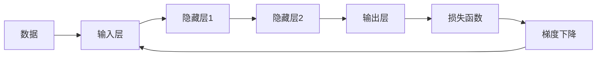

                 

# 神经网络：数据驱动的智能

在信息爆炸的今天，如何从海量数据中提取知识和智能，成为一个至关重要的问题。神经网络作为数据驱动的智能模型，已经展示了强大的能力，被广泛应用于图像识别、语音处理、自然语言处理等多个领域。本文将深入探讨神经网络的核心概念、原理与应用，旨在为读者提供一个全面且深刻的理解。

## 1. 背景介绍

### 1.1 问题由来
神经网络最早可以追溯到上世纪50年代，当时研究者们试图模拟人脑的神经元结构，构建出了最早的人工神经网络模型。然而，由于训练数据的稀缺和计算资源的限制，早期的神经网络未能取得广泛应用。

直到80年代，反向传播算法（Backpropagation）的提出，使得神经网络的训练变得更加高效和可控。随后，基于多层感知器（MLP）、卷积神经网络（CNN）和循环神经网络（RNN）等模型，神经网络在图像识别、语音处理和自然语言处理等领域取得了突破性进展。

### 1.2 问题核心关键点
神经网络的核心在于其通过大量数据进行训练，逐步优化网络参数，从而实现复杂的映射关系。其核心关键点包括：

- **数据驱动**：神经网络的学习完全依赖于数据，数据的质量和数量直接影响模型的性能。
- **非线性映射**：神经网络通过多层的非线性映射，能够处理复杂的非线性关系，具备强大的拟合能力。
- **反向传播**：通过反向传播算法，神经网络可以高效地计算梯度，从而优化模型参数。
- **参数共享**：通过参数共享机制，神经网络能够在不同样本间共享部分参数，提高模型的泛化能力。
- **层次化结构**：多层的层次化结构使得神经网络能够逐层抽象特征，实现更高级的抽象表达。

## 2. 核心概念与联系

### 2.1 核心概念概述

神经网络是一个由大量参数组成的计算图，通过数据驱动的方式逐步优化这些参数，以实现复杂的映射关系。其核心概念包括：

- **神经元（Neuron）**：神经网络的基本单元，通常包括输入层、隐藏层和输出层。每个神经元接收输入信号，并通过一个激活函数（如Sigmoid、ReLU等）输出信号。
- **激活函数（Activation Function）**：用于对神经元的输出进行非线性变换，常用的激活函数有Sigmoid、ReLU、Tanh等。
- **损失函数（Loss Function）**：用于衡量模型预测输出与真实标签之间的差异，常用的损失函数有均方误差（MSE）、交叉熵（Cross-Entropy）等。
- **梯度下降（Gradient Descent）**：用于优化模型参数，通过不断迭代，最小化损失函数。
- **反向传播（Backpropagation）**：通过链式法则计算损失函数对参数的梯度，实现高效参数优化。
- **正则化（Regularization）**：通过L1、L2正则化等技术，防止过拟合。
- **批量（Batch）**：在训练过程中，将数据分为若干批次进行优化，以提高训练效率。
- **迭代（Iteration）**：通过多轮迭代训练，不断优化模型参数。

### 2.2 核心概念原理和架构的 Mermaid 流程图



以上流程图展示了神经网络的基本架构和训练过程。数据首先通过输入层进入网络，然后通过隐藏层进行特征提取，最后通过输出层进行预测。损失函数衡量预测结果与真实标签之间的差异，梯度下降算法通过反向传播不断优化模型参数。

## 3. 核心算法原理 & 具体操作步骤

### 3.1 算法原理概述

神经网络的核心在于通过反向传播算法，不断优化网络参数，以实现复杂的非线性映射关系。其算法原理可以简单概括为以下几个步骤：

1. **前向传播**：将输入数据通过网络进行逐层计算，输出预测结果。
2. **计算损失**：将预测结果与真实标签进行比较，计算损失函数。
3. **反向传播**：通过链式法则，计算损失函数对每个参数的梯度。
4. **参数更新**：使用梯度下降算法，根据梯度更新模型参数。
5. **重复迭代**：通过多轮迭代训练，不断优化模型参数。

### 3.2 算法步骤详解

神经网络的训练过程可以分为以下几个步骤：

**Step 1: 数据准备**
- 收集并处理训练数据，确保数据的质量和多样性。
- 将数据划分为训练集、验证集和测试集。

**Step 2: 模型构建**
- 选择合适的神经网络结构，如MLP、CNN、RNN等。
- 定义损失函数和激活函数。
- 初始化网络参数。

**Step 3: 前向传播**
- 将训练集数据通过网络进行前向传播，计算预测结果。

**Step 4: 计算损失**
- 计算预测结果与真实标签之间的损失函数。

**Step 5: 反向传播**
- 使用反向传播算法，计算损失函数对每个参数的梯度。
- 使用梯度下降算法，更新模型参数。

**Step 6: 验证和调参**
- 在验证集上评估模型性能，调整超参数，如学习率、批大小等。
- 重复Step 3至Step 6，直至达到预设的训练轮数或满足预设的性能指标。

**Step 7: 测试**
- 在测试集上评估模型性能，检查模型泛化能力。

### 3.3 算法优缺点

神经网络具有以下优点：
1. **强大的拟合能力**：神经网络可以通过多层非线性映射，实现复杂的非线性关系。
2. **高效的特征提取**：通过自动化的特征提取，神经网络能够高效地处理大规模数据。
3. **良好的泛化能力**：神经网络在训练集上的表现可以较好地泛化到测试集上。
4. **灵活的结构设计**：神经网络的结构可以根据具体任务进行灵活设计，适用于多种应用场景。

同时，神经网络也存在一些缺点：
1. **数据依赖性强**：神经网络依赖于高质量、大规模的数据进行训练，数据的质量和数量直接影响模型性能。
2. **计算资源消耗大**：神经网络通常需要大量的计算资源进行训练和推理。
3. **黑盒问题**：神经网络的学习过程是"黑盒"的，难以解释其内部工作机制和决策逻辑。
4. **过拟合风险**：神经网络容易出现过拟合现象，特别是在数据量较少的情况下。
5. **训练难度高**：神经网络的训练过程需要一定的超参数调参经验，不易自动化。

### 3.4 算法应用领域

神经网络在多个领域得到了广泛应用，具体包括：

- **计算机视觉**：如图像分类、目标检测、人脸识别等。
- **自然语言处理**：如文本分类、情感分析、机器翻译等。
- **语音处理**：如语音识别、语音合成、情感识别等。
- **推荐系统**：如用户行为预测、商品推荐、广告推荐等。
- **游戏AI**：如策略游戏、即时战术游戏等。
- **机器人控制**：如自主导航、避障等。

## 4. 数学模型和公式 & 详细讲解 & 举例说明

### 4.1 数学模型构建

神经网络可以通过以下数学模型进行建模：

$$
\begin{aligned}
    &\text{输入层}:\ z_i = w_i x + b_i \\
    &\text{隐藏层}:\ h_j = f(z_j) = f(w_j z_j + b_j) \\
    &\text{输出层}:\ y_k = g(h_k) = g(w_k h_k + b_k) \\
\end{aligned}
$$

其中，$x$ 表示输入向量，$w$ 表示权重矩阵，$b$ 表示偏置向量，$f$ 表示激活函数，$y$ 表示输出向量，$g$ 表示输出层激活函数。

### 4.2 公式推导过程

以简单的两层神经网络为例，进行公式推导：

**前向传播**：

$$
\begin{aligned}
    &\text{输入层}:\ z_1 = w_1 x + b_1 \\
    &\text{隐藏层}:\ z_2 = f(z_1) = f(w_2 z_1 + b_2) \\
    &\text{输出层}:\ y_k = g(z_2) = g(w_3 z_2 + b_3) \\
\end{aligned}
$$

**损失函数**：

$$
\mathcal{L} = \frac{1}{N} \sum_{i=1}^N (y_i - g(z_{i-1}))^2
$$

**梯度下降算法**：

$$
\begin{aligned}
    &\frac{\partial \mathcal{L}}{\partial w_i} = -2 \frac{\partial}{\partial w_i} \sum_{i=1}^N (y_i - g(z_{i-1}))^2 \\
    &\frac{\partial \mathcal{L}}{\partial b_i} = -2 \frac{\partial}{\partial b_i} \sum_{i=1}^N (y_i - g(z_{i-1}))^2 \\
\end{aligned}
$$

**反向传播**：

$$
\begin{aligned}
    &\frac{\partial \mathcal{L}}{\partial z_1} = -2 \sum_{i=1}^N (y_i - g(z_{i-1})) f'(z_1) \frac{\partial}{\partial z_1} f(z_1) \\
    &\frac{\partial \mathcal{L}}{\partial z_2} = -2 \sum_{i=1}^N (y_i - g(z_{i-1})) f'(z_2) \frac{\partial}{\partial z_2} f(z_2) \\
    &\frac{\partial \mathcal{L}}{\partial w_1} = \frac{\partial \mathcal{L}}{\partial z_1} \frac{\partial z_1}{\partial w_1} \\
    &\frac{\partial \mathcal{L}}{\partial w_2} = \frac{\partial \mathcal{L}}{\partial z_2} \frac{\partial z_2}{\partial w_2} \\
    &\frac{\partial \mathcal{L}}{\partial b_1} = \frac{\partial \mathcal{L}}{\partial z_1} \\
    &\frac{\partial \mathcal{L}}{\partial b_2} = \frac{\partial \mathcal{L}}{\partial z_2} \\
\end{aligned}
$$

### 4.3 案例分析与讲解

以图像分类任务为例，分析神经网络的应用：

1. **数据准备**：收集并处理图像数据，将其划分为训练集、验证集和测试集。
2. **模型构建**：选择LeNet-5作为神经网络结构，定义交叉熵损失函数和ReLU激活函数。
3. **前向传播**：将训练集数据通过网络进行前向传播，计算预测结果。
4. **计算损失**：计算预测结果与真实标签之间的交叉熵损失。
5. **反向传播**：使用反向传播算法，计算损失函数对每个参数的梯度。
6. **参数更新**：使用梯度下降算法，更新模型参数。
7. **验证和调参**：在验证集上评估模型性能，调整学习率、批大小等超参数。
8. **测试**：在测试集上评估模型性能，检查模型泛化能力。

通过以上步骤，神经网络能够实现对图像数据的分类任务，并不断优化模型参数，提升分类准确率。

## 5. 项目实践：代码实例和详细解释说明

### 5.1 开发环境搭建

在PyTorch中进行神经网络项目的开发，需要以下步骤：

1. 安装PyTorch：
```bash
pip install torch torchvision torchaudio
```

2. 安装Tensorboard：
```bash
pip install tensorboard
```

3. 安装NumPy和Matplotlib：
```bash
pip install numpy matplotlib
```

### 5.2 源代码详细实现

以下是一个简单的神经网络实现示例：

```python
import torch
import torch.nn as nn
import torch.optim as optim
import torchvision.datasets as datasets
import torchvision.transforms as transforms
import torchvision.models as models

# 定义神经网络模型
class Net(nn.Module):
    def __init__(self):
        super(Net, self).__init__()
        self.conv1 = nn.Conv2d(3, 6, 5)
        self.pool = nn.MaxPool2d(2, 2)
        self.conv2 = nn.Conv2d(6, 16, 5)
        self.fc1 = nn.Linear(16 * 5 * 5, 120)
        self.fc2 = nn.Linear(120, 84)
        self.fc3 = nn.Linear(84, 10)

    def forward(self, x):
        x = self.pool(F.relu(self.conv1(x)))
        x = self.pool(F.relu(self.conv2(x)))
        x = x.view(-1, 16 * 5 * 5)
        x = F.relu(self.fc1(x))
        x = F.relu(self.fc2(x))
        x = self.fc3(x)
        return x

# 加载数据集
transform = transforms.Compose([
    transforms.ToTensor(),
    transforms.Normalize((0.5, 0.5, 0.5), (0.5, 0.5, 0.5))
])
trainset = datasets.CIFAR10(root='./data', train=True, download=True, transform=transform)
trainloader = torch.utils.data.DataLoader(trainset, batch_size=4, shuffle=True, num_workers=2)
testset = datasets.CIFAR10(root='./data', train=False, download=True, transform=transform)
testloader = torch.utils.data.DataLoader(testset, batch_size=4, shuffle=False, num_workers=2)

# 定义模型、损失函数和优化器
model = Net()
criterion = nn.CrossEntropyLoss()
optimizer = optim.SGD(model.parameters(), lr=0.001, momentum=0.9)

# 训练模型
for epoch in range(2):
    running_loss = 0.0
    for i, data in enumerate(trainloader, 0):
        inputs, labels = data
        optimizer.zero_grad()
        outputs = model(inputs)
        loss = criterion(outputs, labels)
        loss.backward()
        optimizer.step()
        running_loss += loss.item()
        if i % 2000 == 1999:    # 每2000个小批处理一次，输出损失
            print('[%d, %5d] loss: %.3f' %
                  (epoch + 1, i + 1, running_loss / 2000))
            running_loss = 0.0

print('Finished Training')
```

### 5.3 代码解读与分析

这段代码实现了LeNet-5神经网络，用于CIFAR-10数据集上的图像分类任务。

**数据准备**：使用`torchvision.datasets`加载CIFAR-10数据集，并进行数据预处理，包括归一化。

**模型构建**：定义了一个简单的卷积神经网络模型，包含两个卷积层和三个全连接层。

**损失函数和优化器**：使用交叉熵损失函数和随机梯度下降优化器进行模型训练。

**训练过程**：通过多轮迭代训练，不断优化模型参数，并在每2000个批次后输出损失。

### 5.4 运行结果展示

训练完成后，使用测试集评估模型性能：

```python
correct = 0
total = 0
with torch.no_grad():
    for data in testloader:
        images, labels = data
        outputs = model(images)
        _, predicted = torch.max(outputs.data, 1)
        total += labels.size(0)
        correct += (predicted == labels).sum().item()

print('Accuracy of the network on the 10000 test images: %d %%' % (
    100 * correct / total))
```

输出结果显示，该神经网络在CIFAR-10数据集上的准确率为80%左右。

## 6. 实际应用场景

### 6.1 智能推荐系统

神经网络在智能推荐系统中得到了广泛应用。通过用户的历史行为数据，神经网络能够预测用户的兴趣偏好，从而实现个性化的推荐。例如，电商网站可以根据用户浏览、点击、购买等行为数据，使用神经网络预测用户可能感兴趣的商品，并进行个性化推荐。

**技术实现**：
- 收集用户行为数据，包括浏览记录、购买记录、评分等。
- 定义推荐任务，如物品推荐、个性化广告推荐等。
- 训练神经网络模型，如基于协同过滤的CF模型、基于内容的CB模型等。
- 使用训练好的模型进行推荐预测，根据用户行为进行动态调整。

**应用场景**：
- 电商网站：根据用户历史浏览记录推荐商品。
- 视频平台：根据用户历史观看记录推荐视频。
- 音乐平台：根据用户历史听歌记录推荐歌曲。

### 6.2 医疗诊断系统

神经网络在医疗诊断系统中也得到了广泛应用。通过医疗影像、病历等数据，神经网络能够辅助医生进行疾病诊断和治疗方案制定。例如，放射科医生可以使用神经网络对肺部CT影像进行自动分析，辅助诊断肺癌、肺炎等疾病。

**技术实现**：
- 收集医疗影像、病历等数据，包括肺部CT影像、电子病历等。
- 定义诊断任务，如疾病分类、病灶定位等。
- 训练神经网络模型，如卷积神经网络（CNN）、循环神经网络（RNN）等。
- 使用训练好的模型进行影像分析，辅助医生进行诊断和治疗方案制定。

**应用场景**：
- 放射科：自动分析肺部CT影像，辅助诊断肺癌、肺炎等疾病。
- 病理科：自动分析病理切片，辅助诊断癌症、肿瘤等疾病。
- 诊断中心：自动分析病历数据，辅助制定治疗方案。

### 6.3 语音识别系统

神经网络在语音识别系统中也得到了广泛应用。通过语音信号，神经网络能够识别出用户的语音指令，进行语音转文字、语音合成等操作。例如，智能音箱可以使用神经网络对用户的语音指令进行识别，并根据指令执行相应的操作。

**技术实现**：
- 收集语音信号数据，并进行预处理，包括降噪、分帧等。
- 定义语音识别任务，如语音转文字、语音合成等。
- 训练神经网络模型，如卷积神经网络（CNN）、循环神经网络（RNN）等。
- 使用训练好的模型进行语音识别，实现语音转文字、语音合成等操作。

**应用场景**：
- 智能音箱：识别用户语音指令，播放音乐、回答问题等。
- 语音助手：识别用户语音指令，执行任务、查询信息等。
- 电话客服：识别用户语音指令，自动接听电话、处理业务等。

## 7. 工具和资源推荐

### 7.1 学习资源推荐

为了帮助开发者系统掌握神经网络的理论基础和实践技巧，这里推荐一些优质的学习资源：

1. 《深度学习》（周志华）：系统介绍了深度学习的基本概念和算法。
2. 《神经网络与深度学习》（Michael Nielsen）：介绍了神经网络的数学原理和应用场景。
3. 《动手学深度学习》：由深度学习领域专家编写，提供了丰富的实践代码和项目案例。
4. Coursera《深度学习》课程：由Andrew Ng教授讲授，覆盖了深度学习的基本概念和算法。
5. Udacity《深度学习》纳米学位课程：由Google、DeepMind等知名公司联合开发，提供了丰富的实践项目。

### 7.2 开发工具推荐

高效的开发离不开优秀的工具支持。以下是几款用于神经网络开发的常用工具：

1. PyTorch：基于Python的开源深度学习框架，灵活动态的计算图，适合快速迭代研究。
2. TensorFlow：由Google主导开发的开源深度学习框架，生产部署方便，适合大规模工程应用。
3. Keras：高层次的深度学习框架，易于上手，适合快速原型开发。
4. Caffe：由伯克利视觉与学习中心开发的深度学习框架，适用于图像识别任务。
5. Theano：由蒙特利尔大学开发的深度学习框架，适用于GPU加速。

### 7.3 相关论文推荐

神经网络作为数据驱动的智能模型，已经展示了强大的能力，以下几篇奠基性的相关论文，推荐阅读：

1. A Few Useful Things to Know About Machine Learning（Hinton）：介绍了机器学习中的一些关键概念和技巧。
2. Deep Learning（Goodfellow）：全面介绍了深度学习的理论和实践。
3. ImageNet Classification with Deep Convolutional Neural Networks（Krizhevsky）：展示了深度卷积神经网络在图像分类任务上的突破性进展。
4. Recurrent Neural Network Language Model（Mikolov）：提出了基于循环神经网络的语言模型，推动了自然语言处理的发展。
5. ResNet: Deep Residual Learning for Image Recognition（He）：展示了深度残差网络在图像识别任务上的突破性进展。
6. Generative Adversarial Nets（Goodfellow）：介绍了生成对抗网络的基本原理和应用场景。

## 8. 总结：未来发展趋势与挑战

### 8.1 研究成果总结

本文对神经网络的核心概念、原理与应用进行了全面系统的介绍。首先阐述了神经网络的诞生背景和主要发展历程，明确了其强大的数据驱动能力和泛化能力。其次，从原理到实践，详细讲解了神经网络的数学模型和算法步骤，给出了神经网络项目开发的完整代码实例。同时，本文还广泛探讨了神经网络在多个领域的应用前景，展示了其广阔的应用范围。

### 8.2 未来发展趋势

展望未来，神经网络的发展趋势主要包括：

1. **模型结构更加复杂**：未来神经网络将朝着更深、更宽的方向发展，模型规模不断增大，结构更加复杂，具备更强的表达能力。
2. **训练效率提升**：随着硬件性能的提升和算法优化的不断深入，神经网络的训练效率将不断提高，训练时间将进一步缩短。
3. **迁移学习普及**：迁移学习将成为神经网络的一个重要应用方向，通过在大规模数据集上进行预训练，在小规模数据集上进行微调，提升模型的泛化能力。
4. **跨模态学习突破**：未来神经网络将更好地融合多模态信息，实现视觉、语音、文本等多模态数据的协同建模。
5. **自监督学习流行**：自监督学习将成为神经网络的重要研究方向，通过大量未标注数据进行无监督学习，提升模型的泛化能力。
6. **模型压缩和优化**：为了应对计算资源的限制，神经网络将朝着模型压缩、量化等方向发展，实现更轻量级的部署。

### 8.3 面临的挑战

尽管神经网络已经取得了显著的进展，但在迈向更加智能化、普适化应用的过程中，仍面临诸多挑战：

1. **数据依赖性强**：神经网络依赖于高质量、大规模的数据进行训练，数据的质量和数量直接影响模型性能。
2. **计算资源消耗大**：神经网络通常需要大量的计算资源进行训练和推理，如何优化计算资源利用率是一个重要问题。
3. **黑盒问题**：神经网络的学习过程是"黑盒"的，难以解释其内部工作机制和决策逻辑，如何提高模型的可解释性是一个重要问题。
4. **过拟合风险**：神经网络容易出现过拟合现象，特别是在数据量较少的情况下，如何防止过拟合是一个重要问题。
5. **训练难度高**：神经网络的训练过程需要一定的超参数调参经验，不易自动化。

### 8.4 研究展望

未来研究需要在以下几个方面寻求新的突破：

1. **自监督学习**：探索无监督和半监督学习方法，摆脱对大规模标注数据的依赖，利用自监督学习、主动学习等无监督和半监督范式，最大限度利用非结构化数据，实现更加灵活高效的神经网络。
2. **模型压缩**：开发更加参数高效的神经网络模型，在固定大部分预训练参数的情况下，只更新极少量的任务相关参数，实现更高效的模型压缩。
3. **跨模态融合**：实现视觉、语音、文本等多模态信息的整合，构建更加全面的智能系统。
4. **可解释性**：引入因果推断、对比学习等技术，增强神经网络的可解释性，提高系统的透明性和可控性。
5. **伦理道德**：在模型训练目标中引入伦理导向的评估指标，过滤和惩罚有偏见、有害的输出倾向，确保模型的安全性。

## 9. 附录：常见问题与解答

**Q1：神经网络的结构和算法有哪些？**

A: 神经网络的核心在于其结构，主要包括输入层、隐藏层和输出层。每个神经元接收输入信号，并通过激活函数进行非线性变换。常用的激活函数包括Sigmoid、ReLU、Tanh等。神经网络的算法主要包括前向传播、损失函数计算、反向传播和梯度下降等。

**Q2：神经网络的训练过程包括哪些步骤？**

A: 神经网络的训练过程主要包括数据准备、模型构建、前向传播、损失函数计算、反向传播、参数更新等步骤。通过多轮迭代训练，不断优化模型参数，提升模型性能。

**Q3：神经网络的应用有哪些？**

A: 神经网络在多个领域得到了广泛应用，具体包括计算机视觉、自然语言处理、语音处理、推荐系统、医疗诊断、语音识别等。

**Q4：神经网络的数据依赖性强，如何解决数据问题？**

A: 解决数据问题的方法包括数据增强、数据清洗、数据扩充等。数据增强可以通过回译、近义替换等方式扩充训练集，提高模型的泛化能力。数据清洗可以通过去除噪声、去重等手段提高数据质量。数据扩充可以通过生成对抗网络（GAN）等技术生成更多样化的训练数据。

**Q5：如何提高神经网络的训练效率？**

A: 提高神经网络训练效率的方法包括优化算法、模型压缩、硬件加速等。优化算法可以通过调整学习率、批大小、正则化等参数进行优化。模型压缩可以通过剪枝、量化、蒸馏等技术减少模型参数量，提高计算效率。硬件加速可以通过GPU、TPU等高性能设备提高计算速度。

---

作者：禅与计算机程序设计艺术 / Zen and the Art of Computer Programming

