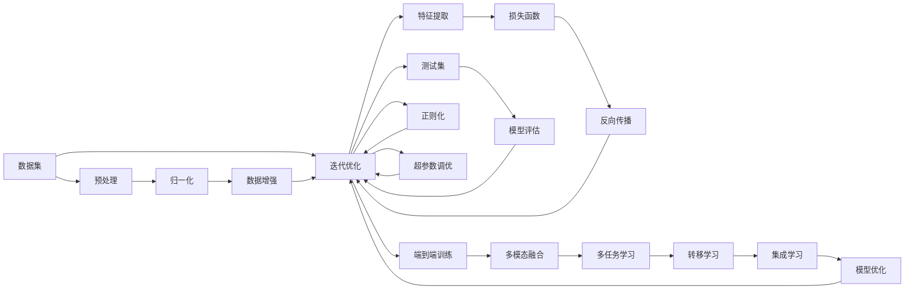

                 

# 神经网络：机器学习工具箱中的新宠

> 关键词：神经网络,机器学习,深度学习,模式识别,计算机视觉,自然语言处理

## 1. 背景介绍

### 1.1 问题由来

随着人工智能技术的迅猛发展，机器学习，尤其是深度学习，已经成为驱动技术创新和产业应用的重要引擎。在这个过程中，神经网络扮演了至关重要的角色，成为机器学习工具箱中的新宠。

神经网络源自生物神经元的工作原理，通过对大量数据进行学习，可以自动提取特征，进行模式识别和预测。其在图像识别、语音识别、自然语言处理等领域取得了突破性进展。

### 1.2 问题核心关键点

神经网络的核心在于其强大的特征提取能力和泛化能力。具体来说，神经网络具备以下几个关键特性：

- **非线性映射**：通过多层非线性变换，神经网络能够捕捉复杂数据结构，实现高度抽象的特征提取。
- **自主学习**：通过反向传播算法，神经网络能够自动调整参数，适应数据分布的变化，进行自我优化。
- **端到端训练**：神经网络能够直接从原始数据到输出结果进行端到端的训练，避免了传统方法中多级特征工程的不便。
- **多模态融合**：神经网络能够处理视觉、语音、文本等多种模态的信息，进行跨模态的特征学习和推理。

这些特性使得神经网络在机器学习领域焕发出强大的生命力，推动了人工智能技术的广泛应用。

### 1.3 问题研究意义

研究神经网络的核心算法和应用，对于推动人工智能技术的发展，提升机器学习模型的性能，加速产业应用落地，具有重要意义：

1. **提升模型精度**：神经网络通过非线性变换和自主学习，能够从数据中提取高层次的特征，提高模型对复杂问题的预测精度。
2. **增强泛化能力**：神经网络具备良好的泛化能力，能够在未见过的数据上，实现准确的预测。
3. **适应大规模数据**：神经网络能够高效处理大规模数据，利用分布式计算加速训练过程。
4. **促进跨学科融合**：神经网络的多模态处理能力，推动了跨学科技术的融合，如计算机视觉与自然语言处理的结合。
5. **推动技术创新**：神经网络为深度学习算法和模型设计提供了丰富的理论基础，催生了如GAN、注意力机制等前沿技术。

## 2. 核心概念与联系

### 2.1 核心概念概述

为了更好地理解神经网络的工作原理和应用场景，本节将介绍几个密切相关的核心概念：

- **神经网络(Neural Network)**：由大量神经元（节点）组成的计算模型，通过多层非线性变换，实现复杂数据结构的建模和预测。
- **深度学习(Deep Learning)**：以神经网络为基础，通过多层次的特征提取和抽象，实现高度复杂的模式识别和预测任务。
- **卷积神经网络(CNN)**：针对图像处理任务，通过卷积操作提取局部特征，实现高效的特征学习。
- **循环神经网络(RNN)**：针对序列数据处理任务，通过循环结构捕捉时间序列的信息，实现动态的特征提取。
- **自编码器(Autoencoder)**：通过编码器-解码器结构，实现数据的降维和重构，具有特征提取和无监督学习的能力。
- **生成对抗网络(GAN)**：通过生成器和判别器的对抗训练，实现高质量的图像、文本等生成任务。
- **迁移学习(Transfer Learning)**：通过预训练模型的知识迁移，加速模型在特定任务上的训练，提高性能。
- **端到端训练(End-to-End Training)**：直接从原始数据到输出结果进行训练，避免中间特征工程的步骤。
- **强化学习(Reinforcement Learning)**：通过奖励机制指导模型行为，在特定环境中学习最优策略。

这些核心概念之间相互联系，共同构成了神经网络及其应用的理论基础和实践框架。

### 2.2 核心概念原理和架构的 Mermaid 流程图

以下是神经网络核心概念和工作流程的 Mermaid 流程图：



这个流程图展示了神经网络从数据输入到模型输出的全过程，包括数据预处理、特征提取、模型训练、模型评估等多个环节。

## 3. 核心算法原理 & 具体操作步骤

### 3.1 算法原理概述

神经网络的核心算法是反向传播算法(Backpropagation)，通过梯度下降等优化算法，自动调整模型参数，实现对数据的逼近和预测。

神经网络的训练过程通常包括以下几个关键步骤：

- **前向传播**：将输入数据通过网络层逐层传递，计算输出结果。
- **损失函数计算**：计算模型输出与真实标签之间的误差，通常是均方误差、交叉熵等。
- **反向传播**：根据损失函数，计算每层神经元的梯度，通过链式法则反向传播。
- **参数更新**：使用梯度下降等优化算法，更新模型参数。

通过不断迭代上述步骤，神经网络能够逐渐逼近最优解，实现对数据的精确预测。

### 3.2 算法步骤详解

以一个简单的两层神经网络为例，详细说明其训练过程：

1. **数据准备**：
   - 数据集：准备训练数据集 $D=\{(x_i, y_i)\}_{i=1}^N$，其中 $x_i$ 为输入，$y_i$ 为标签。
   - 划分：将数据集划分为训练集、验证集和测试集，比例通常为 $60\%:20\%:20\%$。

2. **模型初始化**：
   - 初始化模型参数 $W$ 和 $b$，其中 $W$ 为权重矩阵，$b$ 为偏置向量。
   - 设置超参数，如学习率 $\eta$、批大小 $m$、迭代轮数 $K$。

3. **前向传播**：
   - 输入 $x$ 通过第一层神经元，计算输出 $h_1$。
   - $h_1$ 通过第二层神经元，计算最终输出 $y$。

4. **损失函数计算**：
   - 计算损失函数 $\mathcal{L}$，如均方误差 $L=\frac{1}{N}\sum_{i=1}^N(h_i-y_i)^2$。

5. **反向传播**：
   - 计算输出层的梯度 $\frac{\partial \mathcal{L}}{\partial y}$，通过链式法则计算每层神经元的梯度。
   - 更新权重和偏置参数 $W$ 和 $b$。

6. **参数更新**：
   - 使用梯度下降算法更新模型参数，如 $W \leftarrow W - \eta \nabla_W \mathcal{L}$，$b \leftarrow b - \eta \nabla_b \mathcal{L}$。

7. **模型评估**：
   - 在测试集上评估模型性能，如准确率、精确率、召回率等指标。
   - 根据评估结果调整超参数和模型结构。

### 3.3 算法优缺点

神经网络在机器学习领域具有以下优点：

- **强特征提取能力**：通过多层非线性变换，神经网络能够提取高层次的特征，适应复杂的模式识别任务。
- **自动学习**：神经网络能够自动调整参数，适应数据分布的变化，提高泛化能力。
- **端到端训练**：避免中间特征工程的步骤，简化了模型设计和训练流程。
- **灵活性强**：可以通过多种架构和层数设计，适应不同的应用场景。

同时，神经网络也存在一些局限性：

- **计算资源消耗大**：神经网络需要大量计算资源，训练过程时间长。
- **参数调优复杂**：模型参数众多，需要复杂的调参过程。
- **易过拟合**：在大规模数据集上表现较好，但在小样本或噪声数据上容易过拟合。
- **模型可解释性差**：神经网络的决策过程难以解释，缺乏透明性。
- **泛化能力不足**：在训练集上表现优秀，但在测试集上泛化性能较差。

针对这些缺点，研究人员提出了多种改进策略，如dropout、正则化、数据增强、模型裁剪等，以提升神经网络的性能和可靠性。

### 3.4 算法应用领域

神经网络已经在多个领域取得了显著应用，包括但不限于：

- **计算机视觉**：图像分类、目标检测、图像生成等任务。
- **自然语言处理**：文本分类、机器翻译、情感分析等任务。
- **语音识别**：语音识别、语音生成、语音转换等任务。
- **游戏AI**：游戏AI、机器人控制等任务。
- **医疗诊断**：疾病诊断、医疗影像分析等任务。
- **金融分析**：股票预测、信用评估等任务。

神经网络的多样性和灵活性，使其在诸多领域发挥着重要的作用。

## 4. 数学模型和公式 & 详细讲解 & 举例说明

### 4.1 数学模型构建

神经网络的数学模型通常由以下几个部分组成：

- **输入层**：接收原始数据 $x$。
- **隐藏层**：通过多个神经元，提取特征 $h$。
- **输出层**：计算最终输出 $y$。

假设神经网络有 $L$ 层，每层有 $n_i$ 个神经元，则其参数矩阵为 $W_i \in \mathbb{R}^{n_i \times n_{i-1}}$，偏置向量为 $b_i \in \mathbb{R}^{n_i}$。

### 4.2 公式推导过程

以一个简单的两层神经网络为例，推导其前向传播和反向传播的公式：

- **前向传播**：
  - 输入层：$h_0=x$。
  - 第一层神经元：$h_1=\sigma(W_1h_0+b_1)$，其中 $\sigma$ 为激活函数，如 sigmoid、ReLU 等。
  - 输出层：$y=\sigma(W_2h_1+b_2)$。

- **损失函数**：
  - 均方误差损失：$L=\frac{1}{N}\sum_{i=1}^N(h_i-y_i)^2$。
  - 交叉熵损失：$L=-\frac{1}{N}\sum_{i=1}^N(y_i \log \hat{y}_i+(1-y_i) \log (1-\hat{y}_i))$。

- **反向传播**：
  - 输出层梯度：$\frac{\partial \mathcal{L}}{\partial y}=\frac{1}{N}\frac{\partial \mathcal{L}}{\partial h_2}\frac{\partial h_2}{\partial y}$。
  - 隐藏层梯度：$\frac{\partial \mathcal{L}}{\partial h_1}=\frac{1}{N}\frac{\partial \mathcal{L}}{\partial y}\frac{\partial y}{\partial h_1}\frac{\partial h_1}{\partial h_0}$。

### 4.3 案例分析与讲解

以图像分类任务为例，详细说明神经网络模型的构建和训练过程：

1. **数据准备**：
   - 数据集：准备图像分类数据集，如 CIFAR-10、ImageNet 等。
   - 数据增强：通过随机裁剪、旋转、缩放等操作，扩充训练数据集。

2. **模型构建**：
   - 输入层：接收 32x32 的图像数据。
   - 卷积层：通过多个卷积核，提取局部特征。
   - 池化层：通过最大池化操作，减小特征维度。
   - 全连接层：通过多个全连接层，提取全局特征。
   - 输出层：通过 softmax 激活函数，输出类别概率分布。

3. **模型训练**：
   - 损失函数：使用交叉熵损失函数。
   - 优化器：使用 Adam 优化算法。
   - 超参数：设置学习率、批大小、迭代轮数等。

4. **模型评估**：
   - 准确率：计算模型在测试集上的准确率。
   - 混淆矩阵：计算模型在每个类别的预测结果和真实标签的混淆情况。

## 5. 项目实践：代码实例和详细解释说明

### 5.1 开发环境搭建

在进行神经网络项目实践前，我们需要准备好开发环境。以下是使用 Python 进行 TensorFlow 开发的环境配置流程：

1. 安装 Anaconda：从官网下载并安装 Anaconda，用于创建独立的 Python 环境。

2. 创建并激活虚拟环境：
```bash
conda create -n tf-env python=3.8 
conda activate tf-env
```

3. 安装 TensorFlow：根据 CUDA 版本，从官网获取对应的安装命令。例如：
```bash
conda install tensorflow -c tf -c conda-forge
```

4. 安装各类工具包：
```bash
pip install numpy pandas scikit-learn matplotlib tqdm jupyter notebook ipython
```

完成上述步骤后，即可在 `tf-env` 环境中开始神经网络开发实践。

### 5.2 源代码详细实现

下面我们以图像分类任务为例，给出使用 TensorFlow 实现卷积神经网络的代码实例。

首先，定义模型结构：

```python
import tensorflow as tf

# 定义卷积神经网络
class CNNModel(tf.keras.Model):
    def __init__(self):
        super(CNNModel, self).__init__()
        self.conv1 = tf.keras.layers.Conv2D(32, (3, 3), activation='relu')
        self.pool1 = tf.keras.layers.MaxPooling2D((2, 2))
        self.conv2 = tf.keras.layers.Conv2D(64, (3, 3), activation='relu')
        self.pool2 = tf.keras.layers.MaxPooling2D((2, 2))
        self.flatten = tf.keras.layers.Flatten()
        self.dense1 = tf.keras.layers.Dense(64, activation='relu')
        self.dense2 = tf.keras.layers.Dense(10, activation='softmax')

    def call(self, inputs):
        x = self.conv1(inputs)
        x = self.pool1(x)
        x = self.conv2(x)
        x = self.pool2(x)
        x = self.flatten(x)
        x = self.dense1(x)
        return self.dense2(x)
```

然后，定义训练和评估函数：

```python
import numpy as np
import matplotlib.pyplot as plt

# 加载 MNIST 数据集
mnist = tf.keras.datasets.mnist
(x_train, y_train), (x_test, y_test) = mnist.load_data()
x_train, x_test = x_train / 255.0, x_test / 255.0

# 创建模型实例
model = CNNModel()

# 定义优化器和损失函数
optimizer = tf.keras.optimizers.Adam(learning_rate=0.001)
loss_fn = tf.keras.losses.SparseCategoricalCrossentropy(from_logits=True)

# 定义评估指标
metrics = [tf.keras.metrics.SparseCategoricalAccuracy('accuracy')]

# 定义训练函数
def train_epoch(model, dataset, batch_size, optimizer):
    model.train()
    for batch in dataset.batch(batch_size):
        inputs, labels = batch
        with tf.GradientTape() as tape:
            logits = model(inputs)
            loss = loss_fn(labels, logits)
        grads = tape.gradient(loss, model.trainable_variables)
        optimizer.apply_gradients(zip(grads, model.trainable_variables))
        train_loss(loss)
        train_accuracy(labels, logits)

# 定义评估函数
def evaluate(model, dataset, batch_size):
    model.eval()
    metrics = [tf.keras.metrics.SparseCategoricalAccuracy('accuracy')]
    for batch in dataset.batch(batch_size):
        inputs, labels = batch
        logits = model(inputs)
        for metric in metrics:
            metric.update_state(labels, logits)
    test_loss = loss_fn(labels, logits)
    test_accuracy = metrics[0].result()

# 定义训练流程
epochs = 10
batch_size = 32

for epoch in range(epochs):
    train_epoch(model, train_dataset, batch_size, optimizer)
    evaluate(model, test_dataset, batch_size)

print('Test accuracy:', test_accuracy.numpy())
```

以上代码展示了如何使用 TensorFlow 实现一个简单的卷积神经网络，并在 MNIST 数据集上进行训练和评估。可以看到，TensorFlow 提供了丰富的 API 和工具，使得模型开发和训练过程简洁高效。

### 5.3 代码解读与分析

让我们再详细解读一下关键代码的实现细节：

**CNNModel类**：
- `__init__`方法：初始化模型的各层结构，包括卷积层、池化层、全连接层等。
- `call`方法：定义模型的前向传播过程，将输入数据传递到各层结构，最终输出预测结果。

**损失函数和优化器**：
- `loss_fn`：定义交叉熵损失函数，用于计算模型输出与真实标签之间的误差。
- `optimizer`：定义 Adam 优化器，用于更新模型参数。

**训练和评估函数**：
- `train_epoch`：定义训练函数，通过梯度下降算法更新模型参数，并在每个批次上计算损失和准确率。
- `evaluate`：定义评估函数，计算模型在测试集上的准确率。

**训练流程**：
- 定义总的epoch数和batch size，开始循环迭代
- 每个epoch内，先在训练集上训练，输出训练损失和准确率
- 在验证集上评估，输出测试损失和准确率
- 所有epoch结束后，在测试集上评估，给出最终测试准确率

可以看到，TensorFlow 的 API 设计简洁高效，使得神经网络的开发和训练过程变得简单。开发者可以更多地关注模型设计、数据预处理等高层逻辑，而不必过多关注底层实现细节。

当然，工业级的系统实现还需考虑更多因素，如模型的保存和部署、超参数的自动搜索、更灵活的任务适配层等。但核心的训练流程基本与此类似。

## 6. 实际应用场景

### 6.1 智能安防系统

神经网络在智能安防领域有着广泛的应用，尤其是在视频监控、人脸识别等场景中。通过神经网络，系统能够自动识别和分析视频中的异常行为，提供实时预警和处理。

在技术实现上，可以收集大量标注视频数据，包括正常行为和异常行为，作为训练数据集。在此基础上，对神经网络进行微调，使其能够自动识别视频中的异常行为，如入侵、火灾、爆炸等。对于实时视频流，系统能够快速检测异常情况，并触发报警。

### 6.2 医疗影像诊断

神经网络在医疗影像诊断中也取得了重要应用。传统医学影像诊断依赖于医生的经验和直觉，但医生容易疲劳，诊断结果受主观因素影响较大。通过神经网络，系统能够自动分析医学影像，提供精准的诊断结果。

在实践中，可以收集大量医学影像数据，标注正常和异常影像，作为训练数据集。在此基础上，对神经网络进行微调，使其能够自动分析医学影像，识别出病变区域和类型。对于新的医学影像，系统能够快速诊断，提供精准的诊断结果，辅助医生进行决策。

### 6.3 智能推荐系统

神经网络在智能推荐系统中也有着广泛的应用。通过神经网络，系统能够自动分析用户行为和兴趣，推荐个性化的商品或内容。

在实践中，可以收集用户的历史行为数据，如浏览记录、购买记录等，作为训练数据集。在此基础上，对神经网络进行微调，使其能够自动分析用户行为，推荐符合用户兴趣的商品或内容。对于新的用户行为，系统能够实时推荐，提高用户满意度和转化率。

### 6.4 未来应用展望

随着神经网络的不断发展，其应用场景将更加广泛，为各行各业带来变革性影响。

在智慧城市领域，神经网络能够处理海量数据，提供实时智能决策支持。通过神经网络，系统能够自动分析城市运行数据，提供交通控制、环境监测、应急响应等功能，提升城市管理的智能化水平。

在金融领域，神经网络能够处理海量交易数据，提供实时风险评估和投资建议。通过神经网络，系统能够自动分析市场数据，提供精准的投资策略，帮助投资者规避风险。

在医疗领域，神经网络能够处理海量医疗数据，提供精准的诊断和治疗方案。通过神经网络，系统能够自动分析医疗数据，提供个性化的治疗方案，提高医疗服务的质量和效率。

未来，随着神经网络的不断演进，其在更多领域的应用将得到进一步拓展，推动人工智能技术向更广泛的应用场景迈进。

## 7. 工具和资源推荐

### 7.1 学习资源推荐

为了帮助开发者系统掌握神经网络的理论基础和实践技巧，这里推荐一些优质的学习资源：

1. 《深度学习》课程：斯坦福大学开设的深度学习课程，提供丰富的视频和讲义，涵盖深度学习的基本概念和前沿技术。

2. 《神经网络与深度学习》书籍：Michael Nielsen 所著，全面介绍神经网络的工作原理和应用场景，适合初学者和进阶学习者。

3. 《TensorFlow官方文档》：TensorFlow 的官方文档，提供详细的 API 和使用指南，是TensorFlow开发的必备资料。

4. 《PyTorch官方文档》：PyTorch 的官方文档，提供详细的 API 和使用指南，是PyTorch开发的必备资料。

5. 《NLP与深度学习》课程：Coursera 开设的NLP课程，涵盖深度学习在自然语言处理中的应用，包括神经网络、Transformer 等模型。

通过对这些资源的学习实践，相信你一定能够快速掌握神经网络的理论基础和实践技巧，并用于解决实际的NLP问题。

### 7.2 开发工具推荐

高效的开发离不开优秀的工具支持。以下是几款用于神经网络开发的常用工具：

1. TensorFlow：由 Google 主导开发的深度学习框架，生产部署方便，适合大规模工程应用。

2. PyTorch：由 Facebook 主导开发的深度学习框架，灵活性高，适合研究和快速原型开发。

3. Keras：高层次的深度学习 API，使用简洁，适合初学者和快速原型开发。

4. Jupyter Notebook：交互式编程环境，方便代码调试和结果展示，适合学习和实践。

5. Weights & Biases：模型训练的实验跟踪工具，可以记录和可视化模型训练过程中的各项指标，方便对比和调优。

6. Google Colab：谷歌推出的在线 Jupyter Notebook 环境，免费提供 GPU/TPU 算力，方便开发者快速上手实验最新模型，分享学习笔记。

合理利用这些工具，可以显著提升神经网络的开发效率，加快创新迭代的步伐。

### 7.3 相关论文推荐

神经网络的研究已经取得诸多重要成果，以下是几篇奠基性的相关论文，推荐阅读：

1. AlexNet：ImageNet图像识别竞赛的冠军模型，开创了深度学习在图像识别领域的新纪元。

2. VGGNet：多层次卷积神经网络，提升深度学习模型的准确率。

3. ResNet：残差网络，解决了深度网络训练中的梯度消失问题，使深度学习模型能够更深更广。

4. LSTM：长短期记忆网络，解决了传统 RNN 在处理长序列数据时的梯度消失问题。

5. GAN：生成对抗网络，实现了高质量的图像、文本等生成任务。

6. Transformer：自注意力机制，实现了序列数据的高效建模和处理。

这些论文代表了大神经网络的研究进展，通过学习这些前沿成果，可以帮助研究者把握学科前进方向，激发更多的创新灵感。

## 8. 总结：未来发展趋势与挑战

### 8.1 研究成果总结

神经网络在机器学习领域取得了巨大成功，推动了人工智能技术的广泛应用。其主要研究成果包括：

- **深度学习模型**：如卷积神经网络、循环神经网络、自编码器等，广泛应用于图像、语音、文本等处理任务。
- **生成对抗网络**：如 GAN、VAE 等，实现了高质量的图像、文本等生成任务。
- **端到端训练**：通过直接从原始数据到输出结果进行训练，提高了模型性能和稳定性。
- **多任务学习和迁移学习**：通过迁移学习，加速模型在特定任务上的训练，提高了泛化能力。

### 8.2 未来发展趋势

神经网络在未来将呈现以下几个发展趋势：

1. **模型规模持续增大**：随着算力成本的下降和数据规模的扩张，神经网络模型将不断增大，具备更强的特征提取能力和泛化能力。
2. **计算资源优化**：通过分布式计算、模型压缩等技术，优化神经网络计算资源消耗，提升推理效率。
3. **多模态融合**：神经网络将具备更强的跨模态融合能力，处理视觉、语音、文本等多模态数据，提供更全面、更精准的模型输出。
4. **可解释性和透明性**：通过引入可解释性技术，提高神经网络的透明性和可解释性，增强模型的可信度。
5. **自动化调参**：通过自动调参技术，优化神经网络超参数，提高模型性能。

### 8.3 面临的挑战

尽管神经网络在机器学习领域取得了诸多成功，但其发展也面临诸多挑战：

1. **计算资源消耗大**：神经网络需要大量计算资源，训练和推理过程时间较长。
2. **参数调优复杂**：模型参数众多，需要复杂的调参过程。
3. **易过拟合**：在大规模数据集上表现较好，但在小样本或噪声数据上容易过拟合。
4. **可解释性差**：神经网络的决策过程难以解释，缺乏透明性。
5. **泛化能力不足**：在训练集上表现优秀，但在测试集上泛化性能较差。

### 8.4 研究展望

未来的神经网络研究需要在以下几个方面寻求新的突破：

1. **自动化调参**：开发自动调参技术，优化神经网络超参数，提高模型性能。
2. **模型压缩和优化**：通过模型压缩、稀疏化存储等技术，优化神经网络计算资源消耗，提升推理效率。
3. **可解释性增强**：引入可解释性技术，提高神经网络的透明性和可解释性，增强模型的可信度。
4. **多模态融合**：实现视觉、语音、文本等多模态数据的深度融合，提高模型泛化能力。
5. **跨领域迁移能力**：提高神经网络在不同领域之间的迁移能力，实现通用智能目标。

总之，神经网络在未来将不断演进，推动人工智能技术向更广泛的应用场景迈进，提升模型的性能和可靠性。只有勇于创新、敢于突破，才能不断拓展神经网络的边界，让人工智能技术更好地造福人类社会。

## 9. 附录：常见问题与解答

**Q1：神经网络与传统机器学习算法有何不同？**

A: 神经网络与传统机器学习算法在模型设计、特征提取和训练过程等方面存在显著差异：

- **模型设计**：神经网络通过多层非线性变换，自动提取特征，而传统算法需要手动设计特征工程。
- **特征提取**：神经网络能够自动学习特征，适应复杂的数据分布，而传统算法需要手动选择合适的特征。
- **训练过程**：神经网络通过反向传播算法自动调整参数，进行端到端训练，而传统算法需要多次迭代手动调整参数。

因此，神经网络在处理大规模、高维、非线性的数据时，具有明显的优势。

**Q2：神经网络在训练过程中如何避免过拟合？**

A: 过拟合是神经网络在训练过程中常见的问题，可以通过以下几种方法避免：

- **数据增强**：通过随机裁剪、旋转、缩放等操作，扩充训练数据集，增加模型泛化能力。
- **正则化**：通过 L2 正则、Dropout 等技术，减少模型复杂度，防止过拟合。
- **早停机制**：在验证集上监控模型性能，当性能不再提升时，停止训练，防止过拟合。
- **批量归一化**：通过归一化操作，加速模型收敛，防止过拟合。

通过这些方法，可以有效提高神经网络的泛化能力，避免过拟合。

**Q3：神经网络在实时应用中如何提高推理速度？**

A: 神经网络在实时应用中面临推理速度慢的问题，可以通过以下方法提升推理效率：

- **模型裁剪**：去除不必要的层和参数，减小模型尺寸，加快推理速度。
- **量化加速**：将浮点模型转为定点模型，压缩存储空间，提高计算效率。
- **分布式计算**：通过分布式计算框架，如 TensorFlow、PyTorch，加速模型推理过程。
- **模型压缩**：通过模型压缩技术，如剪枝、量化、蒸馏等，优化模型结构，提升推理速度。

通过这些方法，可以有效提高神经网络的实时推理能力，满足实时应用的需求。

**Q4：神经网络在实际应用中如何确保安全性？**

A: 神经网络在实际应用中需要确保安全性，防止恶意攻击和数据泄露。可以通过以下方法实现：

- **数据加密**：对敏感数据进行加密处理，防止数据泄露。
- **模型审计**：对模型进行定期审计，检查模型行为和输出，防止恶意攻击。
- **对抗训练**：通过对抗样本训练，增强模型鲁棒性，防止模型被恶意攻击。
- **模型隐私保护**：使用差分隐私等技术，保护模型训练和推理过程中的隐私信息。

通过这些方法，可以有效提高神经网络的安全性，防止数据泄露和恶意攻击。

**Q5：神经网络在模型训练和推理中如何处理大规模数据？**

A: 神经网络在处理大规模数据时，面临计算资源和存储空间的限制。可以通过以下方法实现：

- **分布式计算**：通过分布式计算框架，如 TensorFlow、PyTorch，加速模型训练和推理过程。
- **数据分块**：将大规模数据分成多个小批次，逐批次处理，降低内存占用。
- **数据压缩**：通过数据压缩技术，如 Zstd、LZ4 等，减小数据存储和传输的体积。
- **模型并行**：通过模型并行技术，如模型切片、模型并行等，优化模型结构和计算效率。

通过这些方法，可以有效处理大规模数据，提升神经网络的性能和效率。

---

作者：禅与计算机程序设计艺术 / Zen and the Art of Computer Programming

