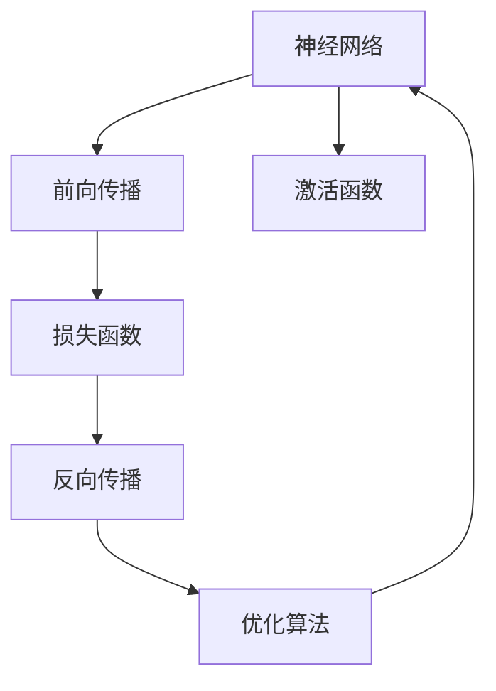

                 

# 神经网络：机器学习的新范式

> 关键词：神经网络,机器学习,深度学习,卷积神经网络(CNN),循环神经网络(RNN),深度信念网络(DBN),深度学习架构,反向传播算法,激活函数,优化算法

## 1. 背景介绍

### 1.1 问题由来
深度学习作为机器学习领域的重要分支，近年来在图像识别、自然语言处理、语音识别等领域取得了突破性进展。神经网络作为深度学习的重要工具，在构建复杂非线性模型、提取高级特征、实现端到端学习等方面发挥了关键作用。

本文将围绕神经网络这一核心概念，系统介绍其基本原理、关键算法、实际应用及其未来发展方向，力求帮助读者全面理解神经网络这一重要的机器学习范式。

### 1.2 问题核心关键点
神经网络作为深度学习的核心组成部分，其核心思想是通过多层非线性变换将原始输入数据映射到期望的输出。相较于传统的浅层模型，神经网络能够学习更加复杂、抽象的特征表示，适应性更强，泛化能力更好。

具体而言，神经网络由多个层次组成，每层包含一组神经元（或称节点），层与层之间通过权重连接，形成复杂的非线性映射网络。每个神经元的输出作为下一层的输入，层层堆叠，构成一个完整的神经网络模型。通过反向传播算法（Backpropagation）进行训练，神经网络能够在大量标注数据上自适应调整权重，最小化损失函数，最终实现对数据的精确预测。

## 2. 核心概念与联系

### 2.1 核心概念概述

为更好地理解神经网络，本节将介绍几个密切相关的核心概念：

- **神经网络**：由多层神经元构成的复杂非线性映射网络，用于自动提取数据中的特征表示。

- **前向传播**：神经网络的基本计算过程，输入数据通过多层线性变换和非线性激活函数，逐层传递生成输出。

- **反向传播**：通过计算损失函数对参数的梯度，反向更新网络参数，实现模型训练的过程。

- **损失函数**：用于衡量模型预测输出与真实标签之间的差异，常见的有均方误差（MSE）、交叉熵（CE）等。

- **激活函数**：对神经元输出进行非线性变换的函数，如Sigmoid、ReLU等，增强模型的非线性能力。

- **优化算法**：用于最小化损失函数、更新模型参数的算法，如SGD、Adam等，确保模型训练过程的收敛性。

- **深度学习**：神经网络是深度学习的重要组成部分，它通过多层次的非线性变换，实现对复杂数据的建模和处理。

这些核心概念之间的逻辑关系可以通过以下Mermaid流程图来展示：



这个流程图展示了几何概念之间的联系：

1. 神经网络通过前向传播计算预测输出。
2. 将预测输出与真实标签输入损失函数进行比较。
3. 通过反向传播算法更新模型参数，最小化损失函数。
4. 优化算法辅助反向传播，加速收敛。
5. 激活函数增强网络非线性能力。

这些概念共同构成了神经网络模型的核心架构和工作流程，使其能够在各种复杂数据场景下发挥强大的预测能力。

## 3. 核心算法原理 & 具体操作步骤
### 3.1 算法原理概述

神经网络的核心算法原理，是通过多层非线性变换，实现对数据的自动抽象和表示。具体而言，每个神经元将输入的加权和通过激活函数进行非线性映射，生成新的特征表示，作为下一层的输入。通过多层堆叠，神经网络能够学习到更高级的抽象特征，适应更加复杂的任务。

形式化地，假设神经网络由 $L$ 层组成，每层包含 $n_i$ 个神经元，输入层和输出层的神经元数分别为 $n_0$ 和 $n_L$。输入数据 $x \in \mathbb{R}^{n_0}$，则神经网络的输出为：

$$
y = M_L \cdots M_1 M_0(x)
$$

其中 $M_i$ 为第 $i$ 层的线性变换和激活函数，可以表示为：

$$
M_i = W_i^T z_{i-1} + b_i
$$

其中 $z_{i-1} \in \mathbb{R}^{n_{i-1}}$ 为前一层的输出，$W_i \in \mathbb{R}^{n_i \times n_{i-1}}$ 和 $b_i \in \mathbb{R}^{n_i}$ 分别为第 $i$ 层的权重矩阵和偏置向量。

### 3.2 算法步骤详解

神经网络的训练过程，通常包括以下几个关键步骤：

**Step 1: 数据预处理**
- 收集标注数据集 $D=\{(x_i, y_i)\}_{i=1}^N$，其中 $x_i \in \mathbb{R}^{n_0}$ 为输入，$y_i \in \mathbb{R}^{n_L}$ 为标签。
- 对数据进行归一化、归一化等预处理，确保模型训练的稳定性。

**Step 2: 初始化模型参数**
- 初始化每个神经元的权重矩阵 $W_i$ 和偏置向量 $b_i$，常用的方法包括随机初始化或固定初始化（如Glorot/Xavier初始化）。

**Step 3: 前向传播计算输出**
- 将输入数据 $x$ 输入网络，逐层进行线性变换和激活函数计算，生成最终输出 $y$。

**Step 4: 计算损失函数**
- 将预测输出 $y$ 与真实标签 $y^*$ 输入损失函数 $L(y, y^*)$ 计算误差。

**Step 5: 反向传播更新参数**
- 利用反向传播算法计算损失函数对各参数的梯度，通过优化算法更新权重矩阵和偏置向量。

**Step 6: 重复训练**
- 重复上述过程，直至损失函数收敛或达到预设迭代轮数。

### 3.3 算法优缺点

神经网络作为深度学习的重要工具，具有以下优点：
1. 强大的特征提取能力。多层非线性变换能够学习到数据中的高级特征表示，适应性更强。
2. 端到端的模型训练。神经网络能够自动学习从输入到输出的映射，避免了传统模型中手工程序的繁琐。
3. 可扩展性强。通过增加网络层数和神经元数，神经网络能够应对更加复杂的数据场景。
4. 鲁棒性较好。通过增加神经元数量，神经网络可以有效降低过拟合风险。

同时，神经网络也存在以下局限性：
1. 训练时间较长。随着网络层数和神经元数的增加，模型训练时间急剧上升，需要高性能硬件支持。
2. 数据依赖性强。神经网络需要大量的标注数据进行训练，对数据质量和数量要求较高。
3. 可解释性较差。神经网络通常被视作黑盒模型，难以解释其内部的工作机制和推理过程。
4. 模型复杂度高。神经网络需要大量的参数进行训练，容易出现梯度消失或爆炸问题。

尽管存在这些局限性，但神经网络在深度学习中的应用仍然极为广泛，为各类复杂数据建模提供了强有力的工具。

### 3.4 算法应用领域

神经网络作为深度学习的重要组成部分，已经广泛应用于多个领域，例如：

- **计算机视觉**：通过卷积神经网络（CNN）实现图像分类、目标检测、语义分割等任务。

- **自然语言处理**：利用循环神经网络（RNN）或Transformer等架构实现文本分类、机器翻译、语音识别等任务。

- **语音处理**：使用卷积神经网络（CNN）或长短期记忆网络（LSTM）进行语音识别、语音合成等任务。

- **游戏与推荐**：通过神经网络实现游戏AI、用户行为分析、推荐系统等任务。

- **医疗与金融**：使用深度学习模型进行图像诊断、风险评估、异常检测等任务。

除了上述这些经典任务外，神经网络也被创新性地应用到更多场景中，如动态图神经网络（GNN）、自适应神经网络（ANN）等，为深度学习技术带来了新的突破。

## 4. 数学模型和公式 & 详细讲解  
### 4.1 数学模型构建

本节将使用数学语言对神经网络模型进行更加严格的刻画。

假设神经网络由 $L$ 层组成，每层包含 $n_i$ 个神经元，输入层和输出层的神经元数分别为 $n_0$ 和 $n_L$。输入数据 $x \in \mathbb{R}^{n_0}$，则神经网络的输出为：

$$
y = M_L \cdots M_1 M_0(x)
$$

其中 $M_i = W_i^T z_{i-1} + b_i$，$z_{i-1} \in \mathbb{R}^{n_{i-1}}$ 为前一层的输出，$W_i \in \mathbb{R}^{n_i \times n_{i-1}}$ 和 $b_i \in \mathbb{R}^{n_i}$ 分别为第 $i$ 层的权重矩阵和偏置向量。

假设神经网络的损失函数为 $L(y, y^*)$，其中 $y^*$ 为真实标签，目标是最小化损失函数：

$$
\theta^* = \mathop{\arg\min}_{\theta} L(y, y^*)
$$

其中 $\theta$ 为网络参数，包括所有权重矩阵和偏置向量。

### 4.2 公式推导过程

以下我们以二分类任务为例，推导神经网络在二分类问题上的前向传播、损失函数及梯度计算公式。

**前向传播**：
设输入数据 $x \in \mathbb{R}^{n_0}$，通过网络逐层传递，最终生成输出 $y \in \mathbb{R}^{n_L}$。其中第 $i$ 层的输出 $z_i \in \mathbb{R}^{n_i}$ 可以表示为：

$$
z_i = M_i(z_{i-1}) = W_i^T z_{i-1} + b_i
$$

对于二分类任务，假设网络最后一层的输出 $z_L$ 通过Sigmoid激活函数得到概率 $p(y=1|x)$，则：

$$
p(y=1|x) = \sigma(z_L) = \frac{1}{1+\exp(-z_L)}
$$

其中 $\sigma$ 为Sigmoid函数，$z_L = W_L^T z_{L-1} + b_L$ 为最后一层的输出。

**损失函数**：
假设真实标签 $y^* \in \{0,1\}$，则二分类问题的损失函数为交叉熵损失：

$$
L(y, y^*) = -[y^* \log p(y=1|x) + (1-y^*) \log (1-p(y=1|x))]
$$

**梯度计算**：
利用反向传播算法计算损失函数对网络参数的梯度，具体公式为：

$$
\frac{\partial L}{\partial \theta} = \sum_{i=0}^{L-1} \frac{\partial L}{\partial z_{L}} \frac{\partial z_{L}}{\partial z_{L-1}} \cdots \frac{\partial z_i}{\partial z_{i-1}} \frac{\partial z_{i-1}}{\partial \theta}
$$

其中：

$$
\frac{\partial L}{\partial z_i} = \frac{\partial L}{\partial y} \frac{\partial y}{\partial z_i}
$$

$$
\frac{\partial y}{\partial z_i} = W_i^T \sigma(z_i)
$$

在实际计算中，可以利用链式法则和矩阵求导进行高效的反向传播计算。

## 5. 项目实践：代码实例和详细解释说明
### 5.1 开发环境搭建

在进行神经网络项目实践前，我们需要准备好开发环境。以下是使用Python进行TensorFlow或PyTorch开发的环境配置流程：

1. 安装Anaconda：从官网下载并安装Anaconda，用于创建独立的Python环境。

2. 创建并激活虚拟环境：
```bash
conda create -n tf-env python=3.8 
conda activate tf-env
```

3. 安装TensorFlow或PyTorch：根据CUDA版本，从官网获取对应的安装命令。例如：
```bash
conda install tensorflow -c tensorflow
```

4. 安装各类工具包：
```bash
pip install numpy pandas scikit-learn matplotlib tqdm jupyter notebook ipython
```

完成上述步骤后，即可在`tf-env`环境中开始神经网络开发实践。

### 5.2 源代码详细实现

这里我们以手写数字识别（MNIST）为例，给出使用TensorFlow或PyTorch实现卷积神经网络（CNN）的代码实现。

首先，定义CNN的结构：

```python
import tensorflow as tf
from tensorflow.keras import layers, models

model = models.Sequential([
    # 第一层卷积
    layers.Conv2D(32, (3, 3), activation='relu', input_shape=(28, 28, 1)),
    layers.MaxPooling2D((2, 2)),
    
    # 第二层卷积
    layers.Conv2D(64, (3, 3), activation='relu'),
    layers.MaxPooling2D((2, 2)),
    
    # 全连接层
    layers.Flatten(),
    layers.Dense(64, activation='relu'),
    
    # 输出层
    layers.Dense(10, activation='softmax')
])
```

然后，定义模型编译和训练过程：

```python
model.compile(optimizer='adam',
              loss='sparse_categorical_crossentropy',
              metrics=['accuracy'])

model.fit(train_images, train_labels, epochs=10,
          validation_data=(test_images, test_labels))
```

最后，评估模型性能：

```python
test_loss, test_acc = model.evaluate(test_images, test_labels)
print('Test accuracy:', test_acc)
```

以上就是使用TensorFlow或PyTorch实现CNN对手写数字识别的完整代码实现。可以看到，得益于深度学习框架的强大封装，我们只需关注模型结构的定义和训练过程的配置，而不必过多关注底层实现细节。

### 5.3 代码解读与分析

让我们再详细解读一下关键代码的实现细节：

**Sequential模型**：
- `Sequential`是Keras提供的线性堆叠模型，用于定义多个层次的神经网络。

**卷积层（Conv2D）**：
- `Conv2D`层定义卷积操作，`(3, 3)`表示卷积核大小，`32`表示卷积核数量，`relu`为激活函数。
- `input_shape`指定输入数据的维度，`(28, 28, 1)`表示28x28的灰度图像。

**池化层（MaxPooling2D）**：
- `MaxPooling2D`层定义最大池化操作，用于降维和特征提取。

**全连接层（Dense）**：
- `Flatten`层将前一层的输出扁平化，转化为1维向量。
- `Dense`层定义全连接神经元，`64`表示神经元数量，`relu`为激活函数。

**输出层**：
- 输出层为10个神经元，`softmax`为多分类输出的激活函数。

**编译模型**：
- 使用`adam`优化器进行参数更新。
- 损失函数为`sparse_categorical_crossentropy`，用于多分类问题。
- 评价指标为`accuracy`。

**训练模型**：
- 在训练集上进行训练，`epochs=10`表示10轮迭代。
- 使用`validation_data`参数在验证集上评估模型性能。

可以看到，神经网络的训练过程涉及模型结构定义、编译、训练、评估等多个环节。深度学习框架提供了便捷的接口，使得模型构建和训练过程简洁高效。

当然，工业级的系统实现还需考虑更多因素，如模型的保存和部署、超参数的自动搜索、更灵活的网络结构设计等。但核心的神经网络训练范式基本与此类似。

## 6. 实际应用场景
### 6.1 计算机视觉

神经网络在计算机视觉领域的应用极为广泛，如图像分类、目标检测、语义分割等。以图像分类为例，常见的应用包括手写数字识别、物体识别、人脸识别等。通过训练卷积神经网络（CNN），神经网络能够从图像像素中学习到丰富的特征表示，自动提取图像中的关键信息。

在实际应用中，神经网络通常采用预训练模型作为初始化参数，然后在特定任务上微调模型，提升性能。例如，在ImageNet数据集上进行预训练，然后在MNIST数据集上微调，可以显著提升手写数字识别的准确率。

### 6.2 自然语言处理

神经网络在自然语言处理（NLP）领域的应用也十分广泛，如文本分类、机器翻译、情感分析等。以文本分类为例，神经网络通过多层非线性变换，自动学习文本中的高级语义特征，实现对文本的分类和分析。

在实际应用中，神经网络可以采用不同的架构，如循环神经网络（RNN）、Transformer等。例如，在情感分析任务中，可以使用RNN模型捕捉文本中的时间顺序信息，或者使用Transformer模型学习文本中的序列依赖关系，提升分类性能。

### 6.3 语音处理

神经网络在语音处理领域的应用包括语音识别、语音合成等。以语音识别为例，通过训练卷积神经网络（CNN）或循环神经网络（RNN），神经网络可以从声音信号中学习到语音特征，实现对语音的自动识别。

在实际应用中，神经网络可以结合特征提取技术（如MFCC），进一步提高识别准确率。例如，在Google Voice Search中，使用神经网络模型对语音进行特征提取和识别，实现智能语音助手的功能。

### 6.4 未来应用展望

随着神经网络技术的不断进步，其在各领域的应用将更加广泛和深入。未来，神经网络可能会在更多场景下取代传统模型，成为自动化决策的核心工具。

在智慧医疗领域，神经网络可以用于医学图像诊断、病历分析、疾病预测等任务，辅助医生进行精准诊疗。

在智能教育领域，神经网络可以用于智能推荐、智能批改、智能问答等任务，提升教育公平和教学质量。

在智慧城市治理中，神经网络可以用于交通管理、安全监控、应急指挥等任务，提升城市管理的智能化水平。

此外，神经网络在智能交通、智能制造、智能家居等领域的应用也将不断拓展，为各行各业带来新的变革。

## 7. 工具和资源推荐
### 7.1 学习资源推荐

为了帮助开发者系统掌握神经网络的基本原理和实际应用，这里推荐一些优质的学习资源：

1. **《深度学习》教材**：Ian Goodfellow、Yoshua Bengio和Aaron Courville合著的经典教材，全面介绍了深度学习的理论和实践。

2. **CS231n课程**：斯坦福大学开设的计算机视觉课程，包含丰富的课程讲义、视频和作业，帮助理解深度学习在图像处理中的应用。

3. **CS224n课程**：斯坦福大学开设的自然语言处理课程，提供了NLP领域的深度学习框架和实践案例。

4. **《神经网络与深度学习》在线课程**：Andrew Ng在Coursera上开设的免费课程，通俗易懂地介绍了神经网络的原理和应用。

5. **PyTorch官方文档**：PyTorch官方提供的详细文档和教程，帮助开发者快速上手神经网络的开发。

6. **TensorFlow官方文档**：TensorFlow官方提供的详细文档和教程，支持多种深度学习模型的开发和训练。

通过对这些资源的学习实践，相信你一定能够全面理解神经网络的基本原理和实际应用。

### 7.2 开发工具推荐

高效的开发离不开优秀的工具支持。以下是几款用于神经网络开发的常用工具：

1. **PyTorch**：由Facebook开发的深度学习框架，支持动态计算图和静态计算图，灵活高效。

2. **TensorFlow**：由Google开发的深度学习框架，支持分布式训练和生产部署，应用广泛。

3. **Keras**：高层次的神经网络框架，支持多种深度学习模型，易于使用。

4. **MXNet**：由亚马逊开发的深度学习框架，支持多种编程语言和多种硬件，性能优越。

5. **Caffe**：由加州大学伯克利分校开发的深度学习框架，支持卷积神经网络（CNN）等模型的开发。

6. **PyTorch Lightning**：基于PyTorch的轻量级深度学习框架，支持快速构建和训练复杂的深度学习模型。

这些工具各有特点，开发者可以根据具体需求选择适合的框架和库，提升开发效率。

### 7.3 相关论文推荐

神经网络作为深度学习的重要组成部分，其发展得益于学界的持续研究。以下是几篇奠基性的相关论文，推荐阅读：

1. **AlexNet**：2012年ImageNet图像分类比赛冠军模型，开启了深度学习在计算机视觉领域的突破。

2. **ResNet**：2015年ImageNet图像分类比赛冠军模型，提出了残差网络结构，解决了深度网络退化的问题。

3. **Inception**：Google提出的卷积神经网络架构，通过并行计算提升模型性能。

4. **LSTM**：1997年提出的循环神经网络架构，用于处理序列数据，如文本和语音。

5. **Transformer**：Google提出的自注意力机制，用于解决序列数据处理中的计算复杂性问题。

6. **GPT-3**：OpenAI提出的生成型预训练变换器（GPT）架构，展示了神经网络在自然语言处理中的应用潜力。

这些论文代表了大规模深度学习模型的发展脉络，通过学习这些前沿成果，可以帮助研究者把握学科前进方向，激发更多的创新灵感。

## 8. 总结：未来发展趋势与挑战

### 8.1 总结

本文对神经网络这一核心概念进行了全面系统的介绍。首先阐述了神经网络的基本原理和关键算法，并通过TensorFlow或PyTorch等工具展示了实际应用中的代码实现。其次，从实际应用场景的角度，探讨了神经网络在计算机视觉、自然语言处理、语音处理等领域的广泛应用。最后，通过对未来发展趋势和面临挑战的探讨，提出了对神经网络研究方向的思考。

通过本文的系统梳理，可以看到，神经网络作为深度学习的重要组成部分，其强大的非线性建模能力使其在各领域的应用前景广阔。得益于深度学习框架的强大封装，开发者可以便捷地构建和训练复杂的深度学习模型，快速实现各类应用。未来，随着神经网络技术的不断进步，其在各领域的应用将更加广泛和深入。

### 8.2 未来发展趋势

展望未来，神经网络技术的发展将呈现以下几个趋势：

1. **模型的规模和复杂度持续增加**：随着硬件性能的提升和数据量的增加，神经网络模型将变得更加复杂和庞大，模型的参数量和计算量将进一步增加。

2. **网络架构的多样化**：除了传统的卷积神经网络（CNN）和循环神经网络（RNN），未来的神经网络将更加多样化，如卷积神经网络（CNN）与递归神经网络（RNN）的结合（如CNN-LSTM）、自注意力机制（如Transformer）等。

3. **模型的自动化设计**：未来的神经网络设计将更加自动化，通过深度学习算法和优化技术，自动搜索最优的网络架构和超参数配置。

4. **模型的跨领域融合**：未来的神经网络将更多地与其他技术进行融合，如强化学习、知识表示、符号计算等，实现更加智能化的系统设计。

5. **模型的可解释性和透明性增强**：未来的神经网络将更加注重可解释性和透明性，通过可视化工具和解释性算法，增强模型的可信度和可控性。

6. **模型的实时性和高效性提升**：未来的神经网络将更加注重实时性和高效性，通过模型压缩、稀疏化存储等技术，提升模型的运行速度和资源利用率。

以上趋势展示了神经网络技术未来发展的广阔前景，这些方向的探索发展，将推动神经网络技术在各领域的深入应用，带来新的技术突破和产业变革。

### 8.3 面临的挑战

尽管神经网络技术取得了巨大进展，但在迈向更加智能化、普适化应用的过程中，它仍面临诸多挑战：

1. **数据需求量大**：神经网络需要大量的标注数据进行训练，对于某些领域，如医疗、法律等，获取高质量标注数据较为困难。如何利用无监督学习、主动学习等技术，降低对标注数据的依赖，将是重要研究方向。

2. **计算资源需求高**：神经网络模型通常较大，训练和推理需要高性能硬件支持。如何在有限的资源条件下，设计高效的网络结构，提升模型训练和推理的效率，仍然是一个重要问题。

3. **模型的泛化能力**：神经网络模型在训练集上的表现往往优于测试集，如何增强模型的泛化能力，提升模型在不同数据分布下的性能，是未来研究的重点。

4. **模型的可解释性**：神经网络模型通常被视为黑盒模型，难以解释其内部的工作机制和推理过程。如何设计可解释性的神经网络模型，增强模型的透明性和可信度，是未来研究的重要方向。

5. **模型的公平性和伦理**：神经网络模型可能会学习到有偏见的数据，导致模型输出不公平。如何设计和优化模型，避免有害信息的传递，确保模型的公平性和伦理性，是未来研究的重要任务。

6. **模型的安全性和隐私保护**：神经网络模型在实际应用中，可能会面临安全性和隐私保护的问题。如何保护用户数据，确保模型使用的安全性，将是未来研究的重要方向。

这些挑战体现了神经网络技术在实际应用中的复杂性和多样性，需要在算法、硬件、应用等多个维度进行协同优化，方能实现更广泛、更深入的应用。

### 8.4 研究展望

面对神经网络面临的种种挑战，未来的研究需要在以下几个方面寻求新的突破：

1. **无监督学习和半监督学习**：探索无监督学习和半监督学习技术，降低对标注数据的依赖，利用未标注数据提升模型性能。

2. **模型的自动化设计**：利用深度学习算法和优化技术，自动化搜索最优的网络架构和超参数配置，提升模型设计效率。

3. **跨领域融合**：将神经网络与其他技术进行融合，如强化学习、知识表示、符号计算等，实现更加智能化的系统设计。

4. **模型压缩和优化**：利用模型压缩、稀疏化存储等技术，提升模型的实时性和高效性，降低计算资源需求。

5. **可解释性增强**：设计可解释性的神经网络模型，增强模型的透明性和可信度，确保模型使用的安全性。

6. **公平性和伦理**：设计和优化模型，避免有害信息的传递，确保模型的公平性和伦理性，提升模型使用的社会效益。

这些研究方向的探索，将引领神经网络技术迈向更高的台阶，为构建安全、可靠、可解释、可控的智能系统铺平道路。面向未来，神经网络技术还需要与其他人工智能技术进行更深入的融合，共同推动自然语言理解和智能交互系统的进步。

## 9. 附录：常见问题与解答

**Q1：神经网络是否适用于所有任务？**

A: 神经网络适用于大多数任务，特别是对于需要复杂特征表示和端到端学习的问题，如计算机视觉、自然语言处理等。但对于一些特定领域的任务，如医学、法律等，仅依靠通用语料预训练的模型可能难以很好地适应。此时需要在特定领域语料上进一步预训练，再进行微调，才能获得理想效果。

**Q2：神经网络的学习过程如何控制？**

A: 神经网络的学习过程可以通过设置学习率、迭代轮数、正则化等超参数进行控制。学习率决定了模型参数的更新速度，迭代轮数决定了模型训练的次数，正则化技术如L2正则、Dropout等可以防止过拟合。同时，可以设置Early Stopping等机制，提前终止训练以防止过拟合。

**Q3：神经网络有哪些常见的优化算法？**

A: 神经网络常用的优化算法包括随机梯度下降（SGD）、Adam、Adagrad、RMSprop等。SGD计算简单，但容易陷入局部最优解；Adam结合了动量法和自适应学习率的优点，具有较好的收敛性和泛化能力。

**Q4：神经网络在训练时如何避免过拟合？**

A: 避免过拟合的方法包括数据增强、正则化、Dropout、Early Stopping等。数据增强可以通过旋转、翻转等方式扩充训练集；正则化可以通过L2正则、Dropout等防止过拟合；Dropout可以在训练过程中随机丢弃部分神经元，防止模型依赖某些特定的神经元；Early Stopping可以监控模型在验证集上的性能，一旦性能不再提升，即停止训练。

**Q5：神经网络在实际应用中需要注意哪些问题？**

A: 神经网络在实际应用中需要注意模型的保存和部署、超参数的自动搜索、更灵活的网络结构设计等问题。模型的保存和部署需要考虑模型的序列化和反序列化，以及推理过程的优化；超参数的自动搜索可以通过网格搜索、贝叶斯优化等方法进行；更灵活的网络结构设计可以通过层次化网络、模块化网络等方式实现。

这些问题的解决，需要开发者对神经网络原理和实际应用有深入的理解和实践，方能实现高效、稳定、可扩展的神经网络应用。

