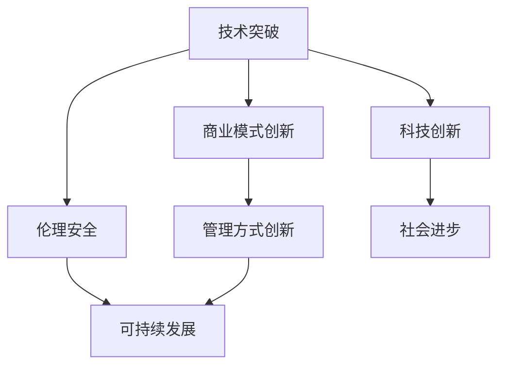

                 

# 科技创新：社会进步的阶梯

科技创新一直是推动社会进步和经济发展的重要引擎。在科技迅猛发展的今天，创新已不仅仅局限于传统意义上的科学和技术发明，还包括商业模式、管理方式等各个层面的突破。本文将从多个维度探讨科技创新在社会进步中的阶梯作用，分析其核心原理、操作步骤、实际应用，并展望未来趋势与挑战，为未来的科技创新提供有益的借鉴和指导。

## 1. 背景介绍

### 1.1 问题由来

在信息时代，科技创新的步伐愈发加快，新的科技成果不断涌现。从互联网、人工智能到区块链，每一项新技术都深刻影响着社会的方方面面。科技创新不仅能推动经济增长、改善生活质量，还能激发新的行业领域和就业机会。但随着科技的快速发展，人们也面临诸如数据隐私、算法偏见、伦理安全等新挑战，科技创新需要在提升效率的同时，更加注重公平、安全和可持续发展。

### 1.2 问题核心关键点

科技创新作为社会进步的阶梯，其核心关键点包括：
1. **技术突破**：科学和技术领域的创新是科技创新的基础，通过不断探索未知，推动新原理、新材料和新方法的应用。
2. **商业模式**：将新技术融入商业模式，产生新的市场机会和盈利模式，推动产业链升级。
3. **管理方式**：采用新技术进行管理和优化，提高生产效率和管理水平。
4. **伦理安全**：关注新技术带来的伦理和安全问题，确保科技创新的健康发展。
5. **可持续发展**：促进技术创新与环境、社会的和谐共生，实现绿色发展。

## 2. 核心概念与联系

### 2.1 核心概念概述

在探讨科技创新如何推动社会进步之前，先梳理其核心概念及联系。

- **科技创新**：指通过科学技术的研究与开发，产生新的技术或改进现有技术，从而推动社会进步的过程。
- **技术突破**：指在某一领域内实现颠覆性或革命性的技术创新，突破现有技术瓶颈。
- **商业模式**：指企业通过技术创新，开辟新的市场机会，创造新的价值。
- **管理方式**：指通过技术创新改进管理工具和方法，提高管理效率和效果。
- **伦理安全**：指科技创新需遵循伦理原则，确保技术应用的安全性和透明度。
- **可持续发展**：指在科技创新中考虑环境、社会因素，实现绿色、平衡发展。

这些核心概念构成了科技创新的多层级体系，其中技术突破是基础，商业模式和管理的创新是将技术转化为经济和社会价值的重要环节，而伦理安全与可持续发展则确保科技创新的健康、和谐发展。

### 2.2 核心概念原理和架构的 Mermaid 流程图



## 3. 核心算法原理 & 具体操作步骤

### 3.1 算法原理概述

科技创新作为社会进步的阶梯，其核心算法原理主要体现在以下几个方面：

1. **技术突破的算法原理**：包括经典算法、进化算法、强化学习等，通过优化算法求解问题，实现技术上的突破。
2. **商业模式创新的算法原理**：通过市场分析和用户行为建模，优化资源配置，实现商业模式的创新。
3. **管理方式创新的算法原理**：利用大数据、人工智能等技术，进行数据分析和决策优化，提升管理效率。
4. **伦理安全保障的算法原理**：通过数据隐私保护、算法透明度、安全审计等技术手段，保障科技创新伦理安全。
5. **可持续发展的算法原理**：采用环境友好、低能耗的算法，结合生态设计，实现绿色技术创新。

### 3.2 算法步骤详解

#### 3.2.1 技术突破的算法步骤

1. **需求分析**：明确技术突破的目标和范围。
2. **数据采集与预处理**：收集相关数据，进行清洗、归一化等预处理。
3. **算法选择与设计**：根据问题特性选择合适的算法模型，并进行初步设计。
4. **模型训练与调优**：利用训练数据进行模型训练，调整超参数，优化模型性能。
5. **实验验证与优化**：在验证集上进行模型验证，优化模型，提高泛化能力。
6. **应用部署与评估**：将模型应用于实际场景，评估其效果，进行必要的迭代优化。

#### 3.2.2 商业模式创新的算法步骤

1. **市场分析**：通过数据分析工具，识别市场需求和潜在机会。
2. **用户行为建模**：建立用户行为模型，预测用户需求和行为趋势。
3. **资源配置优化**：利用优化算法，优化资源配置，提升运营效率。
4. **模式创新设计**：结合市场分析结果，设计新的商业模式。
5. **市场验证与优化**：在小规模市场进行验证，根据反馈优化商业模式。
6. **全面推广与应用**：将商业模式在更大范围内推广，实现经济效益。

#### 3.2.3 管理方式创新的算法步骤

1. **数据采集与分析**：收集企业管理数据，进行数据分析。
2. **管理模型设计**：基于数据分析结果，设计管理模型。
3. **管理工具开发**：开发基于管理模型的应用工具。
4. **管理效果评估**：评估管理效果，进行必要的调整和优化。
5. **持续改进**：建立持续改进机制，不断优化管理方式。

#### 3.2.4 伦理安全保障的算法步骤

1. **数据隐私保护**：采用数据加密、匿名化等技术手段，保护用户隐私。
2. **算法透明度**：设计透明的算法流程，确保算法决策的公正性和透明性。
3. **安全审计**：定期进行安全审计，发现并修复潜在安全漏洞。
4. **伦理指导**：制定并遵循伦理规范，确保技术应用的伦理安全。
5. **用户反馈机制**：建立用户反馈机制，及时响应用户关切，保障用户权益。

#### 3.2.5 可持续发展的算法步骤

1. **绿色技术评估**：评估技术的生态影响，选择绿色技术。
2. **低能耗算法设计**：设计低能耗、高效能的算法。
3. **生态设计整合**：将绿色技术融入产品设计，实现生态设计。
4. **环境监测与优化**：实时监测环境影响，进行必要的优化。
5. **可持续发展策略**：制定并执行可持续发展策略，确保技术创新与环境和谐共生。

### 3.3 算法优缺点

#### 3.3.1 技术突破算法的优缺点

**优点**：
1. **创新性强**：能够实现颠覆性技术创新，突破现有技术瓶颈。
2. **适用性广**：适用于各种科研和技术领域。
3. **可预测性高**：通过算法优化，可预测技术突破点。

**缺点**：
1. **资源投入高**：需要大量的人力和资金投入。
2. **不确定性高**：技术突破存在一定的失败风险。

#### 3.3.2 商业模式创新算法的优缺点

**优点**：
1. **市场灵活性高**：能够快速响应市场变化，抓住市场机会。
2. **经济效益显著**：通过新模式实现更高的盈利和价值。
3. **用户体验提升**：通过优化商业模式，提升用户体验。

**缺点**：
1. **风险性高**：商业模式创新存在一定的市场风险。
2. **依赖性强**：依赖市场需求和用户行为变化。
3. **创新难度大**：需要跨学科、跨领域的知识融合。

#### 3.3.3 管理方式创新算法的优缺点

**优点**：
1. **管理效率提升**：通过算法优化提升管理效率。
2. **决策科学化**：利用数据和算法支持决策，提高决策质量。
3. **资源配置优化**：通过优化资源配置，降低运营成本。

**缺点**：
1. **技术复杂度高**：管理算法复杂度较高，需具备专业知识和技能。
2. **数据质量要求高**：算法结果依赖于数据质量。
3. **适应性差**：对已有管理流程的适应性较差。

#### 3.3.4 伦理安全保障算法的优缺点

**优点**：
1. **安全性高**：保障用户隐私和数据安全，确保算法透明。
2. **合规性高**：符合伦理和法律规定，避免法律风险。
3. **用户信任度提升**：通过透明和公正的算法保障用户信任。

**缺点**：
1. **成本高**：需要投入大量资源进行伦理和安全保障。
2. **技术难度大**：涉及隐私保护、透明性等复杂问题。
3. **动态性差**：伦理规范和法律政策变化较快，需持续更新。

#### 3.3.5 可持续发展算法的优缺点

**优点**：
1. **环境友好**：降低能耗，减少环境污染。
2. **社会责任性强**：符合社会责任，促进绿色发展。
3. **可持续发展能力**：实现技术创新的可持续性。

**缺点**：
1. **技术难度大**：涉及复杂的环境和生态系统设计。
2. **成本高**：需要额外投入环境友好技术和设备。
3. **技术复杂度高**：需要跨学科的知识和技术。

## 4. 数学模型和公式 & 详细讲解 & 举例说明

### 4.1 数学模型构建

科技创新涉及的数学模型复杂多样，涵盖统计学、优化学、运筹学等多个领域。本文以技术突破为例，简要介绍其数学模型构建过程。

假设我们要设计一种新材料，目标是寻找一种密度低、强度高的材料。构建数学模型的步骤如下：

1. **数据收集**：收集已有的材料属性数据，如密度、强度、硬度等。
2. **特征选择**：从大量属性中选择影响材料强度的关键特征，如碳含量、合金成分等。
3. **模型建立**：建立密度和强度的数学模型，如：

$$
y = f(x) + \epsilon
$$

其中 $y$ 表示材料强度，$x$ 表示材料属性向量，$f$ 为材料强度函数，$\epsilon$ 为随机误差。
4. **模型训练**：利用历史数据进行模型训练，最小化损失函数：

$$
L(w) = \frac{1}{N} \sum_{i=1}^N (y_i - f(x_i, w))^2
$$

其中 $w$ 为模型参数。
5. **模型验证与优化**：在验证集上评估模型性能，优化模型参数。
6. **应用部署**：将训练好的模型应用于新材料的设计和筛选。

### 4.2 公式推导过程

以下以材料强度预测模型为例，推导相关公式。

假设材料强度 $y$ 与材料属性 $x_1, x_2, ..., x_n$ 的关系可以表示为：

$$
y = \beta_0 + \beta_1 x_1 + \beta_2 x_2 + ... + \beta_n x_n + \epsilon
$$

其中 $\beta_0, \beta_1, ..., \beta_n$ 为回归系数，$\epsilon$ 为随机误差。

根据最小二乘法，求解回归系数的公式为：

$$
\beta = (X^T X)^{-1} X^T Y
$$

其中 $X$ 为设计矩阵，$Y$ 为响应向量。

将上述公式代入材料强度预测模型，得：

$$
\hat{y} = \beta_0 + \beta_1 x_1 + \beta_2 x_2 + ... + \beta_n x_n
$$

其中 $\hat{y}$ 表示预测的材料强度。

### 4.3 案例分析与讲解

#### 4.3.1 案例背景

某企业生产新型电池，需设计一种高能量密度、低成本的电池材料。企业收集了多种材料的物理化学属性数据，并设计了一种新型电池材料。

#### 4.3.2 数据准备

企业收集了100种材料的属性数据，包括密度、导电率、热导率等，并设计了一种新型电池材料，记录其属性为：密度为1.8 g/cm³，导电率为10^5 S/m，热导率为15 W/m·K。

#### 4.3.3 模型构建

根据数据准备，构建材料强度预测模型，选择密度、导电率和热导率作为特征，预测电池材料的强度。

1. **特征选择**：选择密度、导电率和热导率作为影响材料强度的关键特征。
2. **模型建立**：建立材料强度的回归模型，如：

$$
y = \beta_0 + \beta_1 x_1 + \beta_2 x_2 + \beta_3 x_3 + \epsilon
$$

其中 $x_1$ 表示密度，$x_2$ 表示导电率，$x_3$ 表示热导率。
3. **模型训练**：利用历史数据进行模型训练，最小化损失函数：

$$
L(w) = \frac{1}{N} \sum_{i=1}^N (y_i - f(x_i, w))^2
$$

其中 $N$ 为样本数量，$w$ 为模型参数。
4. **模型验证与优化**：在验证集上评估模型性能，优化模型参数，得到最优回归系数。
5. **应用部署**：将训练好的模型应用于新材料的设计和筛选，预测新型电池材料的强度，并指导其优化设计。

## 5. 项目实践：代码实例和详细解释说明

### 5.1 开发环境搭建

在科技创新项目实践中，开发环境搭建是基础。以下介绍Python开发环境的具体搭建步骤：

1. **安装Anaconda**：从官网下载并安装Anaconda，用于创建独立的Python环境。
2. **创建并激活虚拟环境**：
```bash
conda create -n py_env python=3.8 
conda activate py_env
```
3. **安装必要的库**：
```bash
conda install numpy scipy pandas matplotlib scikit-learn statsmodels seaborn
```

完成上述步骤后，即可在`py_env`环境中进行科技创新项目的开发和调试。

### 5.2 源代码详细实现

以下以材料强度预测模型为例，给出Python代码实现。

```python
import numpy as np
from sklearn.linear_model import LinearRegression

# 假设计算机生成的数据
x1 = np.random.rand(100)
x2 = np.random.rand(100)
x3 = np.random.rand(100)
y = x1 + 2*x2 + 3*x3 + np.random.normal(0, 0.5, 100)

# 特征矩阵X和响应向量Y
X = np.vstack((x1, x2, x3)).T
Y = y

# 构建线性回归模型
model = LinearRegression()

# 训练模型
model.fit(X, Y)

# 预测新材料强度
x_new = [0.1, 0.2, 0.3]
y_new = model.predict([[np.asscalar(x) for x in x_new]])
print("新材料强度预测：", y_new[0])
```

### 5.3 代码解读与分析

#### 5.3.1 数据生成

代码中使用了`numpy`生成随机数据，模拟材料属性与强度的关系。

#### 5.3.2 模型构建

代码中使用了`scikit-learn`库中的`LinearRegression`模型，建立线性回归模型，预测材料强度。

#### 5.3.3 模型训练

代码中使用了`fit`方法，对模型进行训练，最小化预测误差。

#### 5.3.4 模型预测

代码中使用了`predict`方法，对新材料属性进行预测，得到材料强度的估计值。

## 6. 实际应用场景

### 6.1 智能制造

智能制造是科技创新在制造业的重要应用场景之一。通过集成物联网、人工智能等技术，实现制造过程的数字化、智能化。

1. **智能监控**：利用传感器和监控系统，实时监测生产过程，提高生产效率和设备利用率。
2. **预测维护**：通过数据分析和机器学习，预测设备故障和维护需求，降低停机时间和维护成本。
3. **优化生产**：利用大数据和人工智能技术，优化生产流程和资源配置，提高生产效率和产品质量。

### 6.2 智慧医疗

智慧医疗是科技创新在医疗领域的重要应用场景。通过集成互联网、大数据、人工智能等技术，提升医疗服务的质量和效率。

1. **远程诊疗**：利用远程诊疗系统，实时获取患者健康数据，提供远程诊断和治疗服务。
2. **医疗影像分析**：通过人工智能技术，自动分析医疗影像，辅助医生进行疾病诊断和治疗方案制定。
3. **个性化治疗**：利用大数据和人工智能技术，分析患者健康数据，提供个性化的治疗方案。

### 6.3 智慧城市

智慧城市是科技创新在城市管理中的应用。通过集成互联网、大数据、人工智能等技术，提升城市管理和公共服务水平。

1. **智能交通**：通过智能交通系统，实时监测交通状况，优化交通流量，减少拥堵。
2. **环境监测**：利用传感器和智能设备，实时监测环境污染和气象变化，提供预警和应对策略。
3. **公共服务**：通过大数据和人工智能技术，优化公共服务资源配置，提升服务效率和质量。

## 7. 工具和资源推荐

### 7.1 学习资源推荐

为了帮助开发者系统掌握科技创新在社会进步中的阶梯作用，这里推荐一些优质的学习资源：

1. **《科技创新与未来发展》课程**：由知名专家开设的创新课程，涵盖科技创新各领域的最新进展和前沿技术。
2. **《技术创新与管理》书籍**：系统介绍技术创新和管理的理论基础和实践方法，适合各类从业者阅读。
3. **创新研究报告**：各大研究机构发布的科技创新报告，提供最新的科技趋势和研究成果。
4. **开放课程平台**：如Coursera、edX等平台提供大量科技创新相关的课程和资源，方便自学和提升。
5. **创新竞赛平台**：如Kaggle、TopCoder等平台，提供丰富的科技创新竞赛项目，提升实战能力。

通过对这些资源的学习实践，相信你一定能够全面理解科技创新在社会进步中的作用，并应用于实际工作中。

### 7.2 开发工具推荐

高效的开发离不开优秀的工具支持。以下是几款用于科技创新开发的常用工具：

1. **Python**：作为通用的编程语言，Python具有强大的科学计算和数据分析能力，适用于各类科技创新项目。
2. **Jupyter Notebook**：基于浏览器的交互式编程环境，适合进行数据分析、算法实验等。
3. **PyTorch**：基于Python的深度学习框架，支持各类深度学习模型和算法，适用于科技创新中的算法开发。
4. **TensorFlow**：由Google主导的深度学习框架，适用于大规模深度学习模型和分布式计算。
5. **GitHub**：全球最大的开源代码托管平台，提供丰富的开源资源和协作工具。
6. **Open Science Framework (OSF)**：提供开放的研究管理和协作工具，方便科研数据共享和协作。

合理利用这些工具，可以显著提升科技创新项目的开发效率，加快创新迭代的步伐。

### 7.3 相关论文推荐

科技创新是一个快速发展的领域，定期阅读最新的研究成果是保持领先的关键。以下是几篇具有代表性的科技创新论文，推荐阅读：

1. **《人工智能在社会进步中的应用》**：探讨人工智能在各个领域的应用，分析其对社会进步的贡献。
2. **《科技创新与产业升级》**：分析科技创新与产业升级的关系，提出推动产业升级的策略。
3. **《可持续发展与科技创新》**：探讨科技创新与可持续发展之间的关系，提出绿色创新的思路。
4. **《大数据与智慧城市的建设》**：分析大数据在智慧城市建设中的应用，提出智慧城市建设的思路和方法。
5. **《智能制造的未来》**：探讨智能制造的发展趋势和未来方向，提出智能制造的实现路径。

这些论文代表了大科技创新技术的发展脉络。通过学习这些前沿成果，可以帮助研究者把握学科前进方向，激发更多的创新灵感。

## 8. 总结：未来发展趋势与挑战

### 8.1 研究成果总结

科技创新作为社会进步的阶梯，其核心在于推动技术突破、商业模式和管理方式等方面的创新，实现技术应用的广泛化和多元化。从技术突破到商业模式创新，再到管理方式和伦理安全保障，科技创新全方位推动社会进步。

### 8.2 未来发展趋势

展望未来，科技创新将呈现以下几个发展趋势：

1. **多学科融合**：科技创新将更多地结合自然科学、社会科学等多个学科，推动跨学科研究和发展。
2. **数字化转型**：随着信息技术的普及，科技创新将更多地与数字技术融合，推动数字化转型。
3. **绿色创新**：绿色创新将成为科技创新的重要方向，实现可持续发展。
4. **智能创新**：人工智能、大数据等技术将推动科技创新向智能化、个性化方向发展。
5. **普惠创新**：科技创新将更多地关注普惠性和可及性，提升社会整体的创新能力。

### 8.3 面临的挑战

尽管科技创新在推动社会进步中发挥了重要作用，但仍面临诸多挑战：

1. **资源投入大**：科技创新需要大量的人力、物力和财力投入，资源投入高。
2. **技术复杂度高**：科技创新涉及多个学科和技术领域，技术复杂度较高。
3. **伦理和安全问题**：科技创新可能带来伦理和安全问题，需慎重考虑。
4. **市场风险高**：科技创新面临较高的市场风险，需谨慎应对。
5. **环境影响大**：科技创新可能对环境产生影响，需重视环保。

### 8.4 研究展望

面对科技创新的挑战，未来的研究需要在以下几个方面寻求新的突破：

1. **资源优化**：通过优化资源配置，降低科技创新的成本，提高资源利用效率。
2. **技术简化**：简化技术实现过程，提高技术可访问性和可操作性。
3. **伦理和安全保障**：加强科技创新的伦理和安全保障，确保技术应用的公平和透明。
4. **市场应用**：加强科技创新的市场应用研究，推动技术商业化进程。
5. **环境友好**：加强科技创新的环境友好研究，实现绿色创新。

## 9. 附录：常见问题与解答

**Q1：科技创新需要遵循哪些伦理原则？**

A: 科技创新需遵循以下伦理原则：
1. **公平原则**：确保技术应用的公平性，避免歧视和不公平。
2. **透明原则**：保持技术应用的透明性，避免信息不对称。
3. **安全性原则**：确保技术应用的安全性，避免技术滥用和安全漏洞。
4. **责任原则**：明确技术应用的责任主体，确保技术应用的责任可追溯。
5. **可持续原则**：确保技术应用对环境和社会的影响可控，实现可持续发展。

**Q2：如何提高科技创新的效率？**

A: 提高科技创新效率的策略包括：
1. **资源优化**：通过优化资源配置，降低科技创新的成本，提高资源利用效率。
2. **技术简化**：简化技术实现过程，提高技术可访问性和可操作性。
3. **多学科融合**：结合多个学科和技术领域，提高科技创新效率。
4. **跨领域合作**：加强跨领域合作，提升科技创新能力。
5. **创新生态系统**：建立创新生态系统，促进技术创新和产业化。

**Q3：科技创新对社会进步有哪些贡献？**

A: 科技创新对社会进步的贡献主要体现在以下几个方面：
1. **推动经济增长**：科技创新驱动产业升级，提高生产效率和经济效益。
2. **提升生活质量**：科技创新改善生活条件，提高生活品质。
3. **促进社会公平**：科技创新减少不平等，提升社会公平。
4. **推动可持续发展**：科技创新促进绿色发展，实现可持续发展。
5. **促进文化和教育**：科技创新推动文化交流和教育普及。

**Q4：科技创新在医疗领域有哪些应用？**

A: 科技创新在医疗领域的应用包括：
1. **远程诊疗**：利用远程诊疗系统，实时获取患者健康数据，提供远程诊断和治疗服务。
2. **医疗影像分析**：通过人工智能技术，自动分析医疗影像，辅助医生进行疾病诊断和治疗方案制定。
3. **个性化治疗**：利用大数据和人工智能技术，分析患者健康数据，提供个性化的治疗方案。
4. **医疗机器人**：利用机器人技术，提供手术辅助、护理等服务，提升医疗服务效率。

**Q5：科技创新对环保有哪些贡献？**

A: 科技创新对环保的贡献主要体现在以下几个方面：
1. **能源替代**：通过新能源技术，替代传统化石能源，减少环境污染。
2. **资源高效利用**：通过节能减排、循环利用等技术，提高资源利用效率，减少环境污染。
3. **环境监测**：利用传感器和智能设备，实时监测环境污染和气象变化，提供预警和应对策略。
4. **绿色产品设计**：采用绿色设计和材料，减少环境影响，实现绿色生产。

通过科技创新，我们有望实现环境友好、资源高效、可持续发展的未来社会。相信在科技创新的推动下，人类社会必将迈向更加光明的未来。

---

作者：禅与计算机程序设计艺术 / Zen and the Art of Computer Programming

