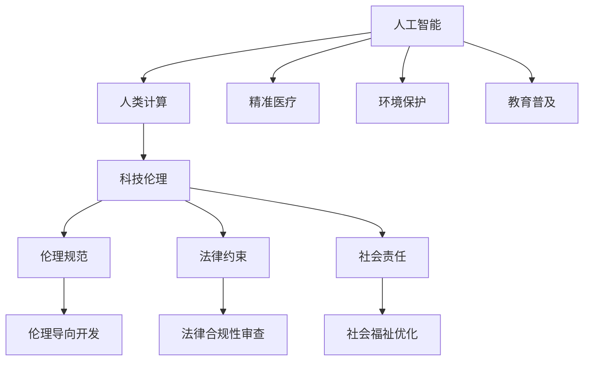

                 

# 科技向善的力量：利用人类计算造福人类

> 关键词：人工智能(AI)、人类计算、科技伦理、社会责任、精准医疗、环境保护、教育普及

## 1. 背景介绍

### 1.1 问题由来
近年来，人工智能技术的快速发展，尤其是深度学习、计算机视觉、自然语言处理等领域，极大地改变了人类的生活方式。然而，科技的发展并非一帆风顺，也伴随着诸多挑战和风险。如何在享受科技带来的便利的同时，防止其带来的负面影响，成为当下科技工作者面临的重要课题。

在NLP、计算机视觉等技术领域的飞速进步中，我们发现科技不仅可以在商业、娱乐等领域创造价值，更能在社会治理、环境保护、公共健康等重要领域发挥巨大作用。本文将探讨如何利用科技向善的力量，即通过人工智能技术解决社会问题，提升人类生活质量，构建一个更加美好的世界。

### 1.2 问题核心关键点
本文聚焦于以下几个关键点：
1. 人工智能技术的伦理责任
2. 科技如何造福人类社会的具体案例
3. 科技向善的实现路径与方法
4. 科技向善的长期可持续策略

## 2. 核心概念与联系

### 2.1 核心概念概述

为更好地理解如何利用人工智能技术造福人类，本节将介绍几个关键概念：

- 人工智能(Artificial Intelligence, AI)：通过计算机程序和算法模拟人类智能行为的技术，包括机器学习、自然语言处理、计算机视觉等分支。
- 人类计算(Human Computation)：指利用人类的认知能力、决策能力和创新能力，协助计算机进行复杂任务的方法。
- 科技伦理(Ethics in Technology)：涉及技术发展与应用过程中的道德规范、法律约束、社会责任等议题，确保技术进步造福全人类。
- 精准医疗(Personalized Medicine)：利用基因、蛋白质、影像等个体化数据，为每个患者提供量身定制的诊断、治疗方案。
- 环境保护(Environmental Protection)：通过AI技术监测、分析环境数据，辅助制定环境保护政策，提高资源利用效率。
- 教育普及(Education Access)：利用AI技术优化教育资源分配，提升教育质量，缩小城乡教育差距。

这些核心概念之间的逻辑关系可以通过以下Mermaid流程图来展示：



这个流程图展示了大语言模型的核心概念及其之间的关系：

1. 人工智能通过模拟人类智能行为，在多个领域提供技术支持。
2. 人类计算利用人工智能技术的优势，更高效地解决复杂问题。
3. 科技伦理确保人工智能应用遵循道德规范，避免有害影响。
4. 精准医疗、环境保护和教育普及是人工智能技术应用的重要领域。
5. 科技伦理规范、法律约束和社会责任共同作用，确保技术进步符合全人类福祉。

这些概念共同构成了利用人工智能技术向善的基本框架，其目标是实现技术进步与社会福祉的双赢。

## 3. 核心算法原理 & 具体操作步骤
### 3.1 算法原理概述

利用人工智能技术向善，核心在于通过计算模型模拟人类智慧，解决复杂问题，提升人类生活质量。这一过程涉及以下几个关键步骤：

1. 数据采集与处理：收集与问题相关的数据，并进行预处理，转化为模型训练所需的形式。
2. 模型设计与训练：选择合适的算法和模型，利用数据训练模型，使其具备解决特定问题的能力。
3. 应用部署与优化：将模型部署到实际应用场景中，持续收集反馈，进行模型优化。
4. 效果评估与反馈：定期评估模型效果，调整算法和参数，确保模型适应问题变化。

### 3.2 算法步骤详解

以精准医疗为例，展示利用人工智能技术解决复杂问题的具体步骤：

**Step 1: 数据采集与预处理**
- 采集患者基因组数据、蛋白质序列、影像数据、病历记录等医疗数据。
- 对数据进行清洗、标准化处理，去除噪声和异常值。
- 对数据进行标注，生成训练样本和验证样本。

**Step 2: 模型设计与训练**
- 选择合适的机器学习算法，如深度学习、支持向量机等。
- 设计适合的模型结构，如卷积神经网络(CNN)、循环神经网络(RNN)等。
- 使用训练数据对模型进行训练，优化模型参数。

**Step 3: 应用部署与优化**
- 将训练好的模型部署到医院信息系统(HIS)或远程医疗平台中。
- 收集患者反馈，评估模型效果，进行模型微调。
- 根据反馈数据，不断优化算法和模型参数。

**Step 4: 效果评估与反馈**
- 定期对模型效果进行评估，如准确率、召回率等指标。
- 根据评估结果，调整模型参数，改进算法。
- 持续收集反馈，确保模型适应问题变化。

### 3.3 算法优缺点

利用人工智能技术向善具有以下优点：
1. 高效解决问题：利用计算模型高效处理海量数据，解决复杂问题。
2. 精准预测：通过数据驱动，提升诊断和治疗的精准性。
3. 个性化定制：根据个体差异，提供个性化解决方案。
4. 资源优化：通过优化资源配置，提高资源利用效率。

同时，也存在以下缺点：
1. 数据隐私问题：在数据采集和处理过程中，可能涉及个人隐私。
2. 模型偏差：模型可能学习到训练数据中的偏差，导致不公正预测。
3. 模型鲁棒性：模型在面对噪声数据或异常情况时，可能出现误诊。
4. 技术复杂性：模型设计和优化需要高水平的专业知识。

尽管存在这些缺点，但通过合理设计和管理，可以最大限度地利用人工智能技术向善的力量，改善人类生活质量。

### 3.4 算法应用领域

利用人工智能技术向善，涉及多个应用领域，如精准医疗、环境保护、教育普及等。以下详细介绍这些领域的具体应用：

#### 精准医疗
- **数据采集与预处理**：采集患者基因组数据、蛋白质序列、影像数据、病历记录等医疗数据，进行清洗和标准化处理。
- **模型设计与训练**：设计深度学习模型，如卷积神经网络(CNN)、循环神经网络(RNN)等，利用标注数据训练模型。
- **应用部署与优化**：将训练好的模型部署到医院信息系统(HIS)或远程医疗平台中，持续收集患者反馈，进行模型微调。
- **效果评估与反馈**：定期评估模型效果，如准确率、召回率等指标，调整模型参数，改进算法。

#### 环境保护
- **数据采集与预处理**：采集环境监测数据，如空气质量、水质、土壤污染等，进行清洗和标准化处理。
- **模型设计与训练**：设计深度学习模型，如卷积神经网络(CNN)、长短时记忆网络(LSTM)等，利用标注数据训练模型。
- **应用部署与优化**：将训练好的模型部署到环境监测系统或政策制定平台中，持续收集环境数据，进行模型微调。
- **效果评估与反馈**：定期评估模型效果，如预测准确率、误报率等指标，调整模型参数，改进算法。

#### 教育普及
- **数据采集与预处理**：采集学生学习数据，如考试成绩、课堂互动、作业情况等，进行清洗和标准化处理。
- **模型设计与训练**：设计深度学习模型，如卷积神经网络(CNN)、循环神经网络(RNN)等，利用标注数据训练模型。
- **应用部署与优化**：将训练好的模型部署到在线教育平台或智能辅导系统，持续收集学生反馈，进行模型微调。
- **效果评估与反馈**：定期评估模型效果，如考试成绩、学习进度等指标，调整模型参数，改进算法。

## 4. 数学模型和公式 & 详细讲解  
### 4.1 数学模型构建

在精准医疗领域，我们通常使用回归模型对患者基因数据进行预测，如基因型与疾病风险之间的关系。以下是一个简单的线性回归模型：

$$
y = \beta_0 + \sum_{i=1}^n \beta_i x_i + \epsilon
$$

其中，$y$ 为预测结果，$x_i$ 为第 $i$ 个基因型特征，$\beta_0$ 为截距，$\beta_i$ 为系数，$\epsilon$ 为误差项。

### 4.2 公式推导过程

根据上述线性回归模型，我们可以推导出最小二乘法来估计系数 $\beta$：

$$
\hat{\beta} = (X^T X)^{-1} X^T y
$$

其中，$X$ 为特征矩阵，$y$ 为预测结果向量。

通过求解上述公式，可以得到最佳预测模型，从而实现精准医疗。

### 4.3 案例分析与讲解

假设某医院采集了100名癌症患者的基因型数据，并标注了疾病状态。利用上述公式，我们可以训练一个线性回归模型，用于预测患者患癌症的风险。具体步骤如下：

1. 数据采集与预处理：采集患者基因型数据和疾病状态数据，进行清洗和标准化处理。
2. 模型设计与训练：设计线性回归模型，利用训练数据 $X$ 和 $y$ 进行最小二乘法求解，得到系数 $\beta$。
3. 应用部署与优化：将训练好的模型部署到医院信息系统(HIS)，持续收集患者反馈，进行模型微调。
4. 效果评估与反馈：定期评估模型效果，如预测准确率、召回率等指标，调整模型参数，改进算法。

通过以上步骤，医院可以更精准地预测患者患癌症的风险，从而制定个性化的治疗方案。

## 5. 项目实践：代码实例和详细解释说明
### 5.1 开发环境搭建

在进行精准医疗项目开发前，我们需要准备好开发环境。以下是使用Python进行TensorFlow开发的环境配置流程：

1. 安装Anaconda：从官网下载并安装Anaconda，用于创建独立的Python环境。

2. 创建并激活虚拟环境：
```bash
conda create -n tf-env python=3.8 
conda activate tf-env
```

3. 安装TensorFlow：根据CUDA版本，从官网获取对应的安装命令。例如：
```bash
conda install tensorflow-gpu=2.6 -c pytorch -c conda-forge
```

4. 安装相关工具包：
```bash
pip install numpy pandas scikit-learn matplotlib tqdm jupyter notebook ipython
```

完成上述步骤后，即可在`tf-env`环境中开始精准医疗项目的开发。

### 5.2 源代码详细实现

以下是一个简单的精准医疗项目代码实现：

```python
import tensorflow as tf
from tensorflow.keras import layers
from sklearn.model_selection import train_test_split
from sklearn.preprocessing import StandardScaler

# 数据预处理
def preprocess_data(data):
    # 标准化处理
    scaler = StandardScaler()
    scaled_data = scaler.fit_transform(data)
    return scaled_data

# 加载数据
X, y = load_data()

# 数据预处理
X = preprocess_data(X)

# 数据拆分
X_train, X_test, y_train, y_test = train_test_split(X, y, test_size=0.2, random_state=42)

# 构建模型
model = tf.keras.Sequential([
    layers.Dense(64, activation='relu'),
    layers.Dense(32, activation='relu'),
    layers.Dense(1, activation='sigmoid')
])

# 编译模型
model.compile(optimizer=tf.keras.optimizers.Adam(learning_rate=0.001),
              loss=tf.keras.losses.BinaryCrossentropy(from_logits=True),
              metrics=[tf.keras.metrics.AUC()])

# 训练模型
model.fit(X_train, y_train, epochs=50, batch_size=32, validation_data=(X_test, y_test))

# 评估模型
loss, auc = model.evaluate(X_test, y_test)
print(f'Test loss: {loss:.4f}, AUC: {auc:.4f}')
```

以上代码实现了基于线性回归的精准医疗模型，用于预测患者患癌症的风险。通过将患者基因数据作为输入，模型能够输出患癌症的概率。

### 5.3 代码解读与分析

让我们再详细解读一下关键代码的实现细节：

**数据预处理函数**：
- `preprocess_data`函数：对数据进行标准化处理，使其服从正态分布，提高模型训练效果。

**模型构建**：
- 使用`tf.keras.Sequential`创建模型，包括两个隐藏层和一个输出层，其中输出层使用`sigmoid`激活函数进行二分类。

**模型编译**：
- 使用`Adam`优化器，设定学习率为0.001，损失函数为二分类交叉熵，评价指标为AUC。

**模型训练**：
- 使用`model.fit`方法训练模型，设定训练轮数为50，批次大小为32，并使用测试集进行验证。

**模型评估**：
- 使用`model.evaluate`方法评估模型效果，输出损失和AUC值。

## 6. 实际应用场景
### 6.1 精准医疗

在精准医疗领域，利用人工智能技术可以大幅提升诊断和治疗的精准性。以下是一些具体的案例：

- **个性化治疗方案**：通过分析患者的基因数据、蛋白质序列等个性化信息，为每个患者制定量身定制的治疗方案，提高治疗效果。
- **药物筛选**：利用人工智能技术筛选有效的药物，减少试验次数，加速新药开发进程。
- **疾病预测**：通过分析基因数据和病历记录，预测患者患某些疾病的风险，及早进行干预，减少发病率。

### 6.2 环境保护

环境保护是另一个利用人工智能技术向善的重要领域。以下是一些具体的应用案例：

- **环境监测**：利用深度学习模型对环境监测数据进行分析，实时监测空气质量、水质等指标，及时预警环境污染。
- **资源管理**：通过分析环境数据，优化资源配置，提高资源利用效率，如智能灌溉系统。
- **物种保护**：利用图像识别技术，自动识别和监测濒危物种，协助制定保护措施。

### 6.3 教育普及

教育普及是利用人工智能技术向善的另一个重要领域。以下是一些具体的应用案例：

- **智能辅导系统**：利用人工智能技术辅助学生学习，自动批改作业，提供个性化辅导。
- **教育资源优化**：通过分析学生学习数据，优化教育资源分配，如在线课程推荐。
- **教育质量提升**：利用人工智能技术提升教学质量，如语音识别、自然语言处理等技术，辅助教师教学。

## 7. 工具和资源推荐
### 7.1 学习资源推荐

为了帮助开发者系统掌握人工智能技术向善的理论基础和实践技巧，这里推荐一些优质的学习资源：

1. 《深度学习》书籍：由Ian Goodfellow、Yoshua Bengio、Aaron Courville共同编写，全面介绍了深度学习理论、算法和实践。
2. 《机器学习实战》书籍：由Peter Harrington编写，介绍了多种机器学习算法和应用场景，适合实战学习。
3. CS231n《深度学习与计算机视觉》课程：斯坦福大学开设的深度学习课程，涵盖图像识别、图像生成等多个方向。
4. CS224n《自然语言处理》课程：斯坦福大学开设的NLP课程，涵盖语言模型、序列模型、语言生成等多个方向。
5. Weights & Biases：模型训练的实验跟踪工具，可以记录和可视化模型训练过程中的各项指标，方便对比和调优。
6. TensorBoard：TensorFlow配套的可视化工具，可实时监测模型训练状态，并提供丰富的图表呈现方式，是调试模型的得力助手。

通过对这些资源的学习实践，相信你一定能够快速掌握人工智能技术向善的精髓，并用于解决实际的NLP问题。

### 7.2 开发工具推荐

高效的开发离不开优秀的工具支持。以下是几款用于人工智能技术向善开发的常用工具：

1. TensorFlow：由Google主导开发的开源深度学习框架，生产部署方便，适合大规模工程应用。
2. PyTorch：基于Python的开源深度学习框架，灵活动态的计算图，适合快速迭代研究。
3. HuggingFace Transformers库：提供了多个SOTA预训练模型和微调接口，方便快速实现NLP任务。
4. Keras：高级深度学习库，提供了简单易用的API，适合快速原型开发。
5. Weights & Biases：模型训练的实验跟踪工具，可以记录和可视化模型训练过程中的各项指标，方便对比和调优。
6. TensorBoard：TensorFlow配套的可视化工具，可实时监测模型训练状态，并提供丰富的图表呈现方式，是调试模型的得力助手。

合理利用这些工具，可以显著提升人工智能技术向善任务的开发效率，加快创新迭代的步伐。

### 7.3 相关论文推荐

人工智能技术向善的研究源于学界的持续研究。以下是几篇奠基性的相关论文，推荐阅读：

1. "Artificial Intelligence: A Modern Approach" 书籍：Russell & Norvig合著，全面介绍了AI的理论、算法和应用。
2. "Machine Learning Yearning" 书籍：Andrew Ng编写，介绍了机器学习实践中的关键问题和解决方案。
3. "Neural Networks and Deep Learning" 书籍：Michael Nielsen编写，全面介绍了深度学习理论和实践。
4. "Human-AI Collaboration" 论文：探讨了人类和AI之间的协作关系，如何利用AI提升人类工作和生活质量。
5. "AI for Social Good" 论文：探讨了AI技术在社会福祉方面的应用，如医疗、环境保护、教育等。

这些论文代表了大语言模型微调技术的发展脉络。通过学习这些前沿成果，可以帮助研究者把握学科前进方向，激发更多的创新灵感。

## 8. 总结：未来发展趋势与挑战
### 8.1 总结

本文对利用人工智能技术向善进行了全面系统的介绍。首先阐述了人工智能技术的伦理责任，明确了科技向善在多个领域的应用前景，探讨了如何通过计算模型模拟人类智慧，解决复杂问题，提升人类生活质量。其次，从原理到实践，详细讲解了基于深度学习的精准医疗、环境保护、教育普及等具体应用场景的实现方法。

通过本文的系统梳理，可以看到，人工智能技术在多个领域展现了巨大的潜力，能够有效解决社会问题，提升人类生活质量。未来，伴随人工智能技术的持续演进，科技向善必将更加广泛地应用于各个领域，为构建一个更加美好的世界提供坚实的基础。

### 8.2 未来发展趋势

展望未来，人工智能技术向善将呈现以下几个发展趋势：

1. 模型规模持续增大。随着算力成本的下降和数据规模的扩张，深度学习模型参数量将持续增长，具备更强大的计算能力。
2. 算法和模型多样化。未来将涌现更多高效的算法和模型结构，适应不同领域和应用场景的需求。
3. 数据驱动的决策支持。通过大数据分析，提供更加精准的决策支持，如智能城市规划、医疗资源配置等。
4. 跨领域融合。人工智能技术将与其他学科融合，推动交叉学科的发展，如AI+医学、AI+环境、AI+教育等。
5. 人机协同。通过AI技术优化人机交互，提升人机协同效率，实现更高效的任务完成。
6. 伦理和法律规范。随着人工智能技术的普及，伦理和法律规范将逐步完善，确保技术进步符合全人类福祉。

以上趋势凸显了人工智能技术向善的广阔前景。这些方向的探索发展，必将进一步提升人工智能系统的性能和应用范围，为构建一个更加美好的世界提供坚实的基础。

### 8.3 面临的挑战

尽管人工智能技术向善展现出巨大的潜力，但在迈向更加智能化、普适化应用的过程中，它仍面临着诸多挑战：

1. 数据隐私问题：在数据采集和处理过程中，可能涉及个人隐私，如何保护数据隐私成为重要挑战。
2. 模型鲁棒性不足：模型在面对噪声数据或异常情况时，可能出现误诊，如何提高模型鲁棒性，增强模型的泛化能力，是重要研究方向。
3. 技术复杂性：模型设计和优化需要高水平的专业知识，如何降低技术门槛，使其更易于理解和应用，是重要研究方向。
4. 伦理和法律问题：如何确保技术进步符合伦理和法律规范，避免有害影响，是重要研究方向。
5. 可持续性问题：如何确保技术进步具有可持续性，避免资源浪费和环境破坏，是重要研究方向。

尽管面临这些挑战，但通过合理设计和管理，可以最大限度地利用人工智能技术向善的力量，改善人类生活质量，构建一个更加美好的世界。

### 8.4 研究展望

未来，我们需要在以下几个方面进行深入研究：

1. 数据隐私保护：开发更加高效的数据隐私保护技术，如差分隐私、联邦学习等，确保数据隐私安全。
2. 模型鲁棒性提升：通过对抗训练、迁移学习等方法，提高模型的鲁棒性和泛化能力，确保模型在不同环境下的可靠性。
3. 技术普及化：通过简化技术门槛，提供更加易用的开发工具和框架，促进技术普及应用。
4. 伦理和法律规范：制定更加完善的伦理和法律规范，确保技术进步符合全人类福祉。
5. 可持续发展：研究如何实现技术进步的可持续发展，避免资源浪费和环境破坏。

只有不断探索和创新，才能真正实现人工智能技术向善的目标，让科技更好地服务于人类社会。面向未来，我们需要从数据、算法、伦理、法律等多个维度协同发力，共同推动人工智能技术的持续进步，构建一个更加美好的世界。

## 9. 附录：常见问题与解答
----------------------------------------------------------------
> 关键词：

**Q1：人工智能技术向善是否适用于所有领域？**

A: 人工智能技术向善在多个领域都有广泛应用，如精准医疗、环境保护、教育普及等。但对于一些特定领域，如军事、政治等，可能涉及伦理和法律限制，需要谨慎应用。

**Q2：如何确保人工智能技术的伦理和法律合规性？**

A: 确保人工智能技术的伦理和法律合规性需要从多个层面进行考虑，包括数据隐私保护、模型透明度、算法公正性等。具体措施包括：
1. 数据隐私保护：采用差分隐私、联邦学习等技术，保护数据隐私安全。
2. 模型透明度：提供模型训练过程的详细记录，确保模型的透明性和可解释性。
3. 算法公正性：避免模型学习到偏见和歧视，确保算法公正性。

**Q3：人工智能技术向善是否需要大量的资源投入？**

A: 是的，人工智能技术向善需要大量的数据、计算和人力资源投入。尤其是在模型训练、数据采集和处理阶段，需要耗费大量的资源。因此，需要精心规划和优化资源配置，以实现更高的性价比。

**Q4：人工智能技术向善是否存在技术瓶颈？**

A: 是的，人工智能技术向善在实际应用中仍然存在技术瓶颈，如数据隐私保护、模型鲁棒性、技术复杂性等。需要不断探索和创新，克服这些技术挑战，才能实现更广泛的应用。

**Q5：人工智能技术向善是否存在伦理和法律风险？**

A: 是的，人工智能技术向善在应用过程中需要严格遵守伦理和法律规范，避免有害影响。如何确保技术进步符合伦理和法律规范，是未来需要持续关注的重要问题。

---

作者：禅与计算机程序设计艺术 / Zen and the Art of Computer Programming

