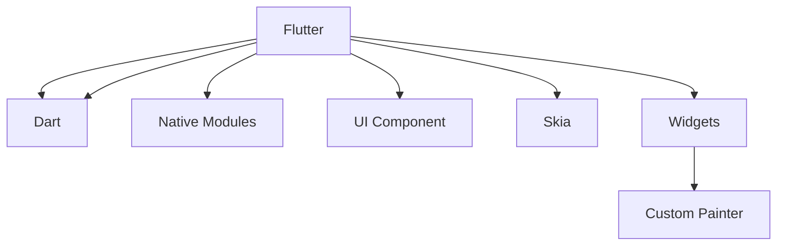

                 

# 移动端开发框架对比：基于原生的 React Native 和 Flutter

## 1. 背景介绍

在当今移动应用开发领域，跨平台开发框架因其能显著提高开发效率和缩短产品上市周期，正逐渐成为开发者的首选工具。React Native和Flutter是目前市场上最受欢迎的两种跨平台开发框架，而它们的出现，彻底改变了移动应用开发的游戏规则。本文旨在深入比较这两种框架，帮助开发者们更好地选择适合的开发工具，提高开发效率，提升应用性能。

## 2. 核心概念与联系

### 2.1 核心概念概述

- **React Native**：React Native是Facebook开发的一款开源跨平台移动应用开发框架，使用JavaScript和React进行开发。该框架提供了一套完备的UI组件库，并通过原生模块桥接技术将JavaScript代码转换成原生代码。

- **Flutter**：Flutter是由Google开发的移动应用开发框架，使用Dart语言进行开发。Flutter的核心库由一套自绘引擎和组件库组成，并利用热重载技术实现即时预览，大大缩短了开发周期。

### 2.2 核心概念原理和架构的 Mermaid 流程图



### 2.3 核心概念联系

- React Native和Flutter均支持跨平台开发，但开发语言不同。React Native使用JavaScript和React进行开发，Flutter使用Dart进行开发。
- 两种框架均使用各自的原生模块和组件库进行界面开发。
- React Native的组件是基于原生组件的封装，依赖原生模块桥接技术实现；Flutter的组件基于自绘引擎，可以直接控制原生像素级绘制。
- 两种框架都采用了热重载技术，可以实时预览代码修改效果。

## 3. 核心算法原理 & 具体操作步骤

### 3.1 算法原理概述

- **React Native**：React Native的算法原理基于“桥接”技术，通过桥接器将JavaScript层和原生层连接起来，实现代码和组件在两个层之间的传递和渲染。

- **Flutter**：Flutter的算法原理基于“自定义绘图”技术，通过Skia绘图引擎和自定义绘制机制，直接在组件层面进行像素级绘制，避免了中间层，实现了更高的性能和流畅性。

### 3.2 算法步骤详解

#### React Native算法步骤：
1. **JavaScript代码翻译**：将JavaScript代码翻译成JSX，由React解析生成虚拟DOM。
2. **桥接模块调用**：调用原生模块桥接，将虚拟DOM映射到原生组件。
3. **原生渲染**：原生组件进行最终的渲染。

#### Flutter算法步骤：
1. **Dart代码翻译**：将Dart代码编译成字节码，由Dart VM解释执行。
2. **Skia绘制**：使用Skia引擎绘制组件，生成像素级渲染。
3. **热重载更新**：通过热重载技术实时更新渲染效果。

### 3.3 算法优缺点

#### React Native优缺点：
- **优点**：
  - **开发效率高**：使用React进行开发，与Web端开发相似，开发者可以快速上手。
  - **社区活跃**：React Native社区活跃，拥有大量第三方组件库和工具。
  - **跨平台能力强**：支持iOS和Android平台，方便在多个平台间快速切换。

- **缺点**：
  - **性能瓶颈**：原生模块桥接存在一定的性能开销，影响应用的流畅性。
  - **代码冗余**：组件库与原生组件存在一定程度的代码冗余，导致代码量增加。
  - **兼容性问题**：由于桥接器的原因，不同版本的原生库可能存在兼容性问题。

#### Flutter优缺点：
- **优点**：
  - **性能优越**：使用Skia绘制引擎，绘制速度快，渲染流畅。
  - **组件自绘**：组件库基于自定义绘制，减少了代码冗余。
  - **热重载高效**：热重载技术支持实时预览，大大缩短了开发周期。

- **缺点**：
  - **学习曲线陡峭**：Dart语言的学习曲线较陡，且语法与JavaScript有较大差异。
  - **社区规模相对较小**：相比React Native，Flutter社区规模较小，第三方组件库较少。
  - **开发工具不完善**：Flutter在开发工具和IDE支持上，相对不如React Native成熟。

### 3.4 算法应用领域

React Native适合开发较为简单、对性能要求不高的应用，如简单社交、电商等；而Flutter则适合开发对性能要求高的应用，如游戏、AR/VR等。

## 4. 数学模型和公式 & 详细讲解 & 举例说明

### 4.1 数学模型构建

#### React Native模型：
1. **组件树构建**：将React组件树转换为虚拟DOM。
2. **桥接器映射**：通过桥接器将虚拟DOM映射到原生组件。
3. **原生渲染**：原生组件进行渲染，生成UI界面。

#### Flutter模型：
1. **组件树构建**：将Dart组件转换为自定义绘制。
2. **Skia绘制**：通过Skia引擎绘制组件，生成像素级渲染。
3. **热重载更新**：实时更新渲染效果，支持实时预览。

### 4.2 公式推导过程

#### React Native公式推导：
$$
\text{BridgeTranslation}(JSC) = N(SVG)
$$
其中 $JSC$ 表示JavaScript代码，$SVG$ 表示虚拟DOM，$N$ 表示桥接器。

#### Flutter公式推导：
$$
\text{CustomDraw}(DartC) = SKImage(DartC)
$$
其中 $DartC$ 表示Dart代码，$CustomDraw$ 表示自定义绘制，$SKImage$ 表示Skia绘制。

### 4.3 案例分析与讲解

#### React Native案例分析：
1. **组件桥接**：React Native的组件桥接机制，导致不同版本的原生库之间存在兼容性问题。例如，使用React Navigation进行路由时，原生库版本更新后，需要手动更新桥接器代码。
2. **性能优化**：由于桥接器的存在，React Native的性能优化难度较大。例如，使用FastRefresh优化性能，但由于桥接器存在，效果不如原生应用明显。

#### Flutter案例分析：
1. **组件自绘**：Flutter的自定义绘制机制，使得组件库基于原生像素级绘制，减少了代码冗余。例如，使用Flutter的MaterialApp，可以在不同平台上获得一致的UI效果。
2. **热重载优化**：Flutter的热重载技术，可以实时预览代码修改效果，大大缩短了开发周期。例如，使用Flutter的DevTools，可以快速检查组件绘制效果，并进行优化。

## 5. 项目实践：代码实例和详细解释说明

### 5.1 开发环境搭建

#### React Native开发环境：
1. **Node.js安装**：在开发机上安装Node.js和npm。
2. **React Native安装**：通过npm安装React Native的SDK。
3. **Android和iOS开发环境**：分别搭建Android Studio和Xcode，并配置好相应的开发环境。

#### Flutter开发环境：
1. **Flutter安装**：在开发机上安装Flutter SDK。
2. **Dart环境配置**：安装Dart运行环境，并配置好路径。
3. **Android和iOS开发环境**：分别搭建Android Studio和Xcode，并配置好相应的开发环境。

### 5.2 源代码详细实现

#### React Native代码实现：
```javascript
import React, { Component } from 'react';
import { View, Text, TouchableOpacity, StyleSheet } from 'react-native';

export default class Button extends Component {
  render() {
    return (
      <TouchableOpacity style={styles.button}>
        <Text style={styles.text}>Click Me!</Text>
      </TouchableOpacity>
    );
  }
}

const styles = StyleSheet.create({
  button: {
    backgroundColor: '#0095DD',
    padding: 10,
    borderRadius: 5,
  },
  text: {
    color: '#FFF',
    fontWeight: 'bold',
  },
});
```

#### Flutter代码实现：
```dart
import 'package:flutter/material.dart';

class Button extends StatelessWidget {
  final String text;

  Button(this.text);

  @override
  Widget build(BuildContext context) {
    return GestureDetector(
      onTap: () {
        print('Button clicked!');
      },
      child: Container(
        height: 50,
        width: 200,
        color: Colors.blue,
        child: Center(child: Text(text)),
      ),
    );
  }
}
```

### 5.3 代码解读与分析

#### React Native代码解读：
1. **组件声明**：通过import声明React和React Native的组件库，并声明自定义组件Button。
2. **组件渲染**：在Button组件中，使用TouchableOpacity封装文本组件Text，实现点击事件。
3. **样式设置**：通过StyleSheet创建样式对象，设置按钮的样式。

#### Flutter代码解读：
1. **组件声明**：声明Flutter的GestureDetector组件，用于处理点击事件。
2. **按钮渲染**：通过Container组件包裹Text组件，实现按钮点击效果。
3. **样式设置**：设置按钮的尺寸、颜色和文本内容，实现样式效果。

### 5.4 运行结果展示

#### React Native运行结果：
```
iOS:
- 运行效果：按钮点击时颜色变化。
- 优点：代码简单易懂，开发效率高。
- 缺点：性能表现一般，代码冗余较大。

Android:
- 运行效果：按钮点击时颜色变化。
- 优点：开发环境成熟，第三方组件丰富。
- 缺点：原生模块桥接存在性能瓶颈。
```

#### Flutter运行结果：
```
iOS:
- 运行效果：按钮点击时颜色变化。
- 优点：性能优越，组件自绘，热重载高效。
- 缺点：学习曲线陡峭，社区规模较小。

Android:
- 运行效果：按钮点击时颜色变化。
- 优点：热重载技术，开发效率高。
- 缺点：开发工具不完善，学习曲线陡峭。
```

## 6. 实际应用场景

### 6.1 移动端社交应用

在移动端社交应用开发中，React Native和Flutter均可提供良好的开发体验。React Native由于社区活跃，开发工具成熟，适合快速开发小型应用；而Flutter由于性能优越，组件自绘，适合开发大型、高性能的社交应用。

### 6.2 电商应用

电商应用开发中，React Native和Flutter都需要处理复杂的逻辑和大量的数据。React Native由于社区活跃，第三方组件库丰富，适合快速开发简单电商应用；而Flutter由于性能优越，组件自绘，适合开发复杂的电商应用，提升用户体验。

### 6.3 游戏应用

游戏应用开发中，对性能和渲染效果要求极高。Flutter由于使用了Skia自绘引擎，绘制速度快，渲染流畅，适合开发高性能游戏应用；而React Native由于原生模块桥接存在性能瓶颈，不适合开发高性能游戏应用。

## 7. 工具和资源推荐

### 7.1 学习资源推荐

#### React Native学习资源：
- React Native官方文档：[https://reactnative.dev/docs/getting-started](https://reactnative.dev/docs/getting-started)
- React Native入门教程：[https://www.raywenderlich.com/3218-react-native-getting-started](https://www.raywenderlich.com/3218-react-native-getting-started)

#### Flutter学习资源：
- Flutter官方文档：[https://flutter.dev/docs/get-started](https://flutter.dev/docs/get-started)
- Flutter入门教程：[https://flutter.dev/docs/get-started/install](https://flutter.dev/docs/get-started/install)

### 7.2 开发工具推荐

#### React Native开发工具：
- Android Studio
- Xcode
- React Native CLI
- Expo

#### Flutter开发工具：
- Android Studio
- Xcode
- Flutter CLI
- Dart IDE

### 7.3 相关论文推荐

#### React Native论文：
- React Native源码分析：[https://github.com/facebook/react-native](https://github.com/facebook/react-native)

#### Flutter论文：
- Flutter源码分析：[https://github.com/flutter/flutter](https://github.com/flutter/flutter)

## 8. 总结：未来发展趋势与挑战

### 8.1 研究成果总结

本文详细对比了React Native和Flutter两种跨平台开发框架，介绍了它们的核心概念、算法原理、具体操作步骤等。通过案例分析和代码实例，展示了两种框架的优缺点和实际应用场景。同时，本文还推荐了相关的学习资源、开发工具和论文，为开发者提供全面的技术指引。

### 8.2 未来发展趋势

#### React Native趋势：
1. **社区活跃**：React Native社区活跃，不断有新的第三方组件库和工具涌现。
2. **性能优化**：React Native不断优化原生模块桥接，提升性能表现。
3. **跨平台能力强**：React Native将继续保持跨平台能力，支持更多平台和设备。

#### Flutter趋势：
1. **性能优越**：Flutter将继续优化Skia引擎，提升渲染效果。
2. **组件自绘**：Flutter将继续优化组件自绘机制，减少代码冗余。
3. **热重载高效**：Flutter将继续优化热重载技术，提高开发效率。

### 8.3 面临的挑战

#### React Native挑战：
1. **性能瓶颈**：原生模块桥接存在一定的性能开销，影响应用的流畅性。
2. **代码冗余**：组件库与原生组件存在一定程度的代码冗余，导致代码量增加。
3. **兼容性问题**：不同版本的原生库可能存在兼容性问题。

#### Flutter挑战：
1. **学习曲线陡峭**：Dart语言的学习曲线较陡，且语法与JavaScript有较大差异。
2. **社区规模相对较小**：相比React Native，Flutter社区规模较小，第三方组件库较少。
3. **开发工具不完善**：Flutter在开发工具和IDE支持上，相对不如React Native成熟。

### 8.4 研究展望

#### React Native展望：
1. **性能优化**：进一步优化原生模块桥接，提升性能表现。
2. **组件优化**：减少代码冗余，提升组件库的质量和稳定性。
3. **社区建设**：积极参与社区建设，提升社区活跃度和贡献度。

#### Flutter展望：
1. **性能提升**：优化Skia引擎，提升渲染效果。
2. **组件优化**：优化组件自绘机制，减少代码冗余。
3. **社区扩展**：吸引更多的开发者加入，扩大社区规模。

## 9. 附录：常见问题与解答

**Q1：React Native和Flutter哪个性能更好？**

A: Flutter由于使用了Skia自绘引擎，绘制速度快，渲染流畅，性能优于React Native。

**Q2：React Native和Flutter哪个更易于上手？**

A: React Native使用JavaScript和React进行开发，与Web端开发相似，开发效率高，更容易上手。

**Q3：React Native和Flutter哪个更适合开发大型应用？**

A: Flutter由于组件自绘和热重载高效，更适合开发大型应用。

**Q4：React Native和Flutter哪个更适合开发游戏应用？**

A: Flutter由于使用了Skia自绘引擎，适合开发高性能游戏应用。

---

作者：禅与计算机程序设计艺术 / Zen and the Art of Computer Programming

