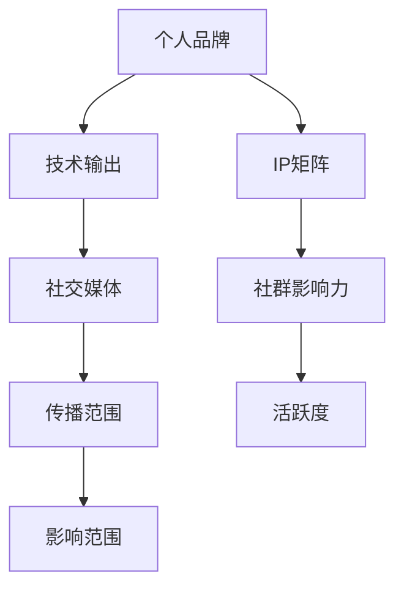

                 

# 程序员如何打造个人IP矩阵

> 关键词：个人品牌,IP矩阵,程序员成长,技术输出,社群影响力

## 1. 背景介绍

### 1.1 问题由来

在快速发展的数字化时代，程序员已经不再是一个简单的职业身份，而是一种品牌形象，一种影响力的象征。个人品牌不仅体现了个人的技术能力和职业素养，更是其职业发展和社会影响力的体现。然而，如何打造个人品牌，构建个人IP矩阵，成为众多程序员的困惑。本文旨在探讨程序员如何通过技术输出、社群影响力等方式，打造个人品牌，构建IP矩阵。

### 1.2 问题核心关键点

- **个人品牌构建**：如何通过技术输出、社交媒体、博客等方式，提升个人在行业内的知名度和影响力。
- **IP矩阵布局**：如何在不同平台和渠道建立多个IP，实现多渠道的传播和影响力放大。
- **技术输出质量**：如何保持高质量的技术输出，形成稳定的技术输出节奏，确保内容质量和频率。
- **社群影响力**：如何通过社群建设、技术分享、互动交流等方式，提升社群的活跃度和影响力。

### 1.3 问题研究意义

在当前数字化时代，个人品牌和技术输出成为程序员职业发展的重要驱动力。打造个人品牌，不仅能提升个人职业竞争力，还能带动相关技术的学习和传播，对整个行业产生积极影响。本文通过系统分析个人品牌构建的策略和方法，为程序员提供实用的指导，帮助其提升技术输出质量和社群影响力，加速职业发展进程。

## 2. 核心概念与联系

### 2.1 核心概念概述

构建个人IP矩阵，需要理解以下几个核心概念：

- **个人品牌**：个人在行业内外知名度和影响力的综合体现，是程序员职业形象的核心要素。
- **IP矩阵**：指个人在不同平台和渠道建立的多个IP，通过多渠道传播，提升整体影响力。
- **技术输出**：通过技术博客、开源项目、技术分享等方式，持续输出技术内容，提升行业内的知名度和影响力。
- **社群影响力**：通过社群建设、技术分享、互动交流等方式，提升社群的活跃度和影响力。
- **社交媒体**：通过各大社交平台（如GitHub、Twitter、LinkedIn等），扩大个人品牌的传播范围。

这些核心概念之间的逻辑关系可以通过以下Mermaid流程图来展示：



这个流程图展示了个体品牌与技术输出、IP矩阵、社交媒体、社群影响力之间的逻辑关系：

1. 个人品牌通过技术输出、社交媒体等方式建立。
2. IP矩阵在不同平台和渠道的建立，增强传播范围。
3. 社群影响力通过社群建设、技术分享等方式提升。

这些核心概念共同构成了个人品牌和技术输出的框架，帮助程序员系统地构建IP矩阵。

## 3. 核心算法原理 & 具体操作步骤
### 3.1 算法原理概述

构建个人IP矩阵的过程，本质上是通过技术输出、社群建设等方式，逐步提升个人品牌在行业内的知名度和影响力。其核心思想是：

- **技术输出**：通过高质量的技术内容输出，建立个人在行业内的专业形象。
- **社群建设**：通过社群平台和活动，建立和维护与同行的关系，提升社群的活跃度和影响力。
- **多渠道传播**：在不同平台和渠道建立IP，实现多渠道传播，提升整体影响力。

### 3.2 算法步骤详解

构建个人IP矩阵的步骤一般包括以下几个关键环节：

**Step 1: 确定个人品牌定位**

- 明确个人品牌在技术领域的定位，如Java专家、机器学习爱好者等。
- 根据定位，选择适合的输出平台，如技术博客、GitHub、技术社区等。

**Step 2: 制定技术输出计划**

- 确定技术输出的内容方向，如技术教程、项目案例、行业趋势等。
- 制定发布计划，保持稳定的输出节奏，确保内容质量和频率。

**Step 3: 提升技术输出质量**

- 定期学习新知识，掌握最新技术动态，确保输出内容的深度和广度。
- 利用SEO优化技术，提升内容在搜索引擎中的排名。

**Step 4: 建立社群影响力**

- 在技术社区和社交平台上积极互动，建立和维护社群关系。
- 举办技术分享、线下Meetup等活动，提升社群活跃度。

**Step 5: 多渠道传播**

- 在不同平台和渠道建立多个IP，如博客、GitHub项目、Twitter账号等。
- 定期发布内容，扩大传播范围，提升整体影响力。

### 3.3 算法优缺点

构建个人IP矩阵的优势主要体现在：

- **提升专业形象**：通过高质量的技术输出，建立个人在行业内的专业形象，提升职业竞争力。
- **多渠道传播**：通过多渠道传播，扩大个人品牌的覆盖范围，提升整体影响力。
- **增强社群影响力**：通过社群建设和技术分享，提升社群的活跃度和影响力。

然而，这一过程也存在一些局限性：

- **时间和精力投入大**：技术输出、社群建设需要大量的时间和精力投入，可能影响日常生活和工作。
- **内容质量要求高**：持续高质量的内容输出，需要不断学习和积累，对个人技术能力和时间管理能力要求较高。
- **传播效果不可控**：内容传播效果受多种因素影响，如平台算法、用户兴趣等，存在不确定性。

### 3.4 算法应用领域

个人IP矩阵的构建，不仅适用于技术专家和开发者，还适用于其他领域的从业人员，如数据科学家、产品经理、UI/UX设计师等。通过技术输出、社群建设等方式，可以提升其在行业内的知名度和影响力，拓展职业发展路径。

在技术领域，个人IP矩阵的构建广泛应用于以下场景：

- **开发者**：通过技术博客、GitHub项目、技术社区等方式，提升技术输出和影响力。
- **数据科学家**：通过数据科学博客、Kaggle竞赛、技术分享等方式，提升数据科学领域的影响力。
- **产品经理**：通过产品博客、技术分享、行业分析等方式，提升产品经理在产品设计和运营方面的影响力。
- **UI/UX设计师**：通过设计博客、设计案例、技术分享等方式，提升UI/UX设计领域的影响力。

## 4. 数学模型和公式 & 详细讲解 & 举例说明

### 4.1 数学模型构建

构建个人IP矩阵的过程，可以通过数学模型进行抽象和描述。设个人品牌在技术领域的知名度为 $P$，技术输出质量为 $Q$，社群活跃度为 $G$，传播范围为 $R$。则IP矩阵构建的目标函数为：

$$
\max P = f(Q, G, R)
$$

其中 $f$ 为综合评估函数，考虑技术输出质量、社群活跃度、传播范围等因素。

### 4.2 公式推导过程

通过以上定义，可以建立如下目标函数：

$$
P = Q \times G \times R
$$

- $Q$ 表示技术输出质量，通过技术博客、开源项目等方式，提升技术输出内容的深度和广度。
- $G$ 表示社群活跃度，通过技术分享、社群建设等方式，提升社群的活跃度和影响力。
- $R$ 表示传播范围，通过社交媒体、技术社区等方式，扩大个人品牌的覆盖范围。

### 4.3 案例分析与讲解

以GitHub为例，分析如何通过技术输出、社群建设、多渠道传播等方式，提升个人品牌的影响力。

1. **技术输出**：在GitHub上发布高质量的开源项目，如算法实现、技术教程等，吸引用户关注。
2. **社群建设**：参与技术讨论，回答问题，建立和维护与同行的关系，提升社群的活跃度和影响力。
3. **多渠道传播**：通过Twitter、LinkedIn等社交平台，分享GitHub项目和文章，扩大传播范围，提升整体影响力。

通过以上分析，可以看出GitHub作为技术输出平台，具有强大的传播效果，能够帮助程序员通过技术输出和社群建设，有效提升个人品牌影响力。

## 5. 项目实践：代码实例和详细解释说明
### 5.1 开发环境搭建

在进行个人IP矩阵构建的实践前，我们需要准备好开发环境。以下是使用Python进行开发的环境配置流程：

1. 安装Anaconda：从官网下载并安装Anaconda，用于创建独立的Python环境。

2. 创建并激活虚拟环境：
```bash
conda create -n myenv python=3.8 
conda activate myenv
```

3. 安装Python包管理器pip：
```bash
pip install pipenv
```

4. 安装相关Python包：
```bash
pip install flask gunicorn markdown twython python-github
```

完成上述步骤后，即可在`myenv`环境中开始个人IP矩阵的构建实践。

### 5.2 源代码详细实现

以下是一个简单的技术博客网站的开发过程，用于展示个人IP矩阵构建的实现。

**5.2.1 配置文件**

```python
# flaskr.py
from flask import Flask
app = Flask(__name__)

@app.route('/')
def home():
    return 'Hello, world!'
```

**5.2.2 数据库配置**

在Flask应用中使用SQLite作为数据库，用于存储技术文章和评论数据。

```python
# models.py
from flask_sqlalchemy import SQLAlchemy

db = SQLAlchemy(app)

class Post(db.Model):
    id = db.Column(db.Integer, primary_key=True)
    title = db.Column(db.String(255))
    body = db.Column(db.Text)

class Comment(db.Model):
    id = db.Column(db.Integer, primary_key=True)
    post_id = db.Column(db.Integer, db.ForeignKey('post.id'))
    body = db.Column(db.Text)
    user_id = db.Column(db.Integer, db.ForeignKey('user.id'))
```

**5.2.3 博客文章管理**

在Flask应用中，可以使用Flask-Blog扩展来实现博客文章的管理。

```python
# blog.py
from flask_blog import FlaskBlog

blog = FlaskBlog(app)
```

**5.2.4 技术文章发布**

使用Flask-Blog扩展，发布技术文章，并设置相应的标签、分类等。

```python
# create_post.py
from flask_blog import FlaskBlog

blog = FlaskBlog(app)

@app.route('/create_post', methods=['GET', 'POST'])
def create_post():
    post = blog.create_post(form)
    return redirect(url_for('post', post_id=post.id))
```

**5.2.5 用户评论管理**

使用Flask-Blog扩展，管理用户评论，并设置评论审核功能。

```python
# comment.py
from flask_blog import FlaskBlog

blog = FlaskBlog(app)

@app.route('/post/<int:post_id>/comments')
def comments(post_id):
    post = blog.get_post(post_id)
    return render_template('post.html', post=post, post_comments=post.comments)
```

**5.2.6 技术文章分享**

使用Flask-Blog扩展，将技术文章分享到Twitter等社交平台。

```python
# share.py
from twython import Twython
import markdown

app = Flask(__name__)

app.config['TWITTER_CONSUMER_KEY'] = 'your_consumer_key'
app.config['TWITTER_CONSUMER_SECRET'] = 'your_consumer_secret'
app.config['TWITTER_ACCESS_TOKEN'] = 'your_access_token'
app.config['TWITTER_ACCESS_TOKEN_SECRET'] = 'your_access_token_secret'

@app.route('/share', methods=['POST'])
def share():
    post = Post.query.first()
    tweet_text = markdown.markdown(post.body)
    api = Twython(app.config['TWITTER_CONSUMER_KEY'], app.config['TWITTER_CONSUMER_SECRET'], app.config['TWITTER_ACCESS_TOKEN'], app.config['TWITTER_ACCESS_TOKEN_SECRET'])
    api.update_status(status=tweet_text)
    return 'Twitter share successful!'
```

### 5.3 代码解读与分析

让我们再详细解读一下关键代码的实现细节：

**Flaskr.py**：
- 创建Flask应用实例。
- 定义首页路由，返回'Hello, world!'。

**models.py**：
- 使用Flask-SQLAlchemy扩展，定义Post和Comment模型，用于存储博客文章和评论数据。

**blog.py**：
- 使用Flask-Blog扩展，初始化Flask Blog应用，提供博客文章管理功能。

**create_post.py**：
- 定义技术文章发布路由，使用Flask-Blog扩展创建新的博客文章。

**comments.py**：
- 定义技术文章评论路由，使用Flask-Blog扩展获取博客文章和评论数据。

**share.py**：
- 定义技术文章分享路由，使用Twython库将技术文章分享至Twitter。

通过以上代码实现，可以创建一个简单的技术博客网站，用于展示和分享技术文章。开发者可以进一步优化代码，添加更多的技术文章管理和用户评论功能，提升个人IP矩阵的构建效果。

### 5.4 运行结果展示

运行以上代码，在浏览器中访问`http://127.0.0.1:5000/`，可以看到一个简单的技术博客网站，包含首页、创建文章、评论文章等功能。通过该网站，可以有效地输出技术内容，并与用户进行互动交流，提升个人IP矩阵的影响力。

## 6. 实际应用场景

### 6.1 开发者社区

开发者社区是程序员构建个人IP矩阵的重要场景之一。通过技术博客、开源项目、技术分享等方式，可以在开发者社区中建立专业形象，提升个人品牌影响力。

1. **技术博客**：在博客平台上持续发布技术文章，展示技术能力，吸引社区成员关注。
2. **开源项目**：在GitHub上发布高质量的开源项目，吸引社区成员参与和贡献。
3. **技术分享**：在技术社区和Meetup等活动中分享技术经验，建立和维护社群关系。

### 6.2 技术讲座和培训

技术讲座和培训是提升个人IP矩阵影响力的重要途径。通过线上或线下的技术讲座和培训，可以展示技术深度和广度，提升个人品牌在行业内的知名度和影响力。

1. **线上讲座**：在Bilibili、YouTube等平台上发布技术讲座视频，吸引技术爱好者观看和分享。
2. **线下培训**：在技术社区和公司内组织技术培训，提升自身知名度和影响力。

### 6.3 技术竞赛

技术竞赛是展示个人技术能力和创新能力的平台。通过参加各类技术竞赛，可以提升个人品牌在技术领域的影响力。

1. **Kaggle竞赛**：在Kaggle平台上参加数据科学和机器学习竞赛，展示技术能力和成果。
2. **开源项目竞赛**：在GitHub等平台上参加开源项目竞赛，展示代码质量和创新能力。

## 7. 工具和资源推荐

### 7.1 学习资源推荐

为了帮助开发者系统掌握个人IP矩阵的构建方法，这里推荐一些优质的学习资源：

1. **《程序员如何打造个人IP矩阵》系列博文**：由大模型技术专家撰写，深入浅出地介绍了个人品牌构建的策略和方法。
2. **《程序员如何提升技术输出质量》课程**：教授如何通过技术博客、开源项目等方式提升技术输出质量，构建个人IP矩阵。
3. **《程序员如何建立社群影响力》书籍**：介绍了如何在技术社区和社交平台上建立和维护社群关系，提升社群活跃度和影响力。
4. **GitHub官方文档**：提供了详细的GitHub使用指南和技术支持，帮助开发者管理开源项目和代码仓库。
5. **Flask官方文档**：提供了详细的Flask框架使用指南和技术支持，帮助开发者构建技术博客网站和应用。

通过对这些资源的学习实践，相信你一定能够快速掌握个人IP矩阵的构建方法，并用于解决实际的职业发展问题。

### 7.2 开发工具推荐

高效的开发离不开优秀的工具支持。以下是几款用于个人IP矩阵构建开发的常用工具：

1. **Anaconda**：用于创建独立的Python环境，方便开发者在不同项目间切换。
2. **Flask**：基于Python的Web框架，用于构建技术博客网站和API应用。
3. **GitHub**：用于管理开源项目和代码仓库，方便开发者发布和分享代码。
4. **Flask-Blog**：基于Flask的博客扩展，用于实现技术博客文章管理功能。
5. **Twython**：Python库，用于在Twitter上发布和获取推文，方便开发者分享技术文章。
6. **Twitter API**：Twitter提供的API，用于在Twitter上发布和获取推文，方便开发者分享技术文章。

合理利用这些工具，可以显著提升个人IP矩阵的构建效率，加速职业发展进程。

### 7.3 相关论文推荐

个人IP矩阵的构建源于学界的持续研究。以下是几篇奠基性的相关论文，推荐阅读：

1. **《如何在技术社区中建立个人品牌》**：探讨了如何在技术社区中建立个人品牌，提升在行业内的知名度和影响力。
2. **《程序员如何提升技术输出质量》**：介绍了如何通过技术博客、开源项目等方式提升技术输出质量，构建个人IP矩阵。
3. **《技术讲座和培训对个人品牌的影响》**：分析了技术讲座和培训对个人品牌的影响，探讨了如何通过线上和线下活动提升影响力。
4. **《开源项目竞赛对职业发展的推动作用》**：研究了开源项目竞赛对职业发展的影响，展示了通过竞赛提升技术能力和影响力的过程。

这些论文代表了个体IP矩阵构建的研究进展，为程序员提供了重要的理论支持和实践指导。

## 8. 总结：未来发展趋势与挑战

### 8.1 总结

本文对程序员如何通过技术输出、社群建设等方式，构建个人IP矩阵进行了全面系统的介绍。首先阐述了个人品牌构建的重要性和影响，明确了IP矩阵布局的策略和方法。其次，从原理到实践，详细讲解了技术输出、社群建设等关键步骤，给出了个人IP矩阵构建的完整代码实例。同时，本文还广泛探讨了个人IP矩阵在开发者社区、技术讲座、技术竞赛等多个领域的应用前景，展示了其广阔的发展空间。

通过本文的系统梳理，可以看到，个人IP矩阵的构建对于程序员的职业发展具有重要意义。它不仅能提升个人品牌知名度，还能促进技术传播和应用，加速职业发展进程。未来，伴随个人品牌和IP矩阵技术的不断发展，相信程序员将能够更加高效地展示技术能力，实现个人价值和职业理想的最大化。

### 8.2 未来发展趋势

展望未来，个人IP矩阵的构建将呈现以下几个发展趋势：

1. **多平台传播**：个人IP矩阵将更加多元化，不仅限于技术博客、GitHub等单一平台，而是涵盖YouTube、Bilibili、Twitter等多样化平台。
2. **内容形式多样化**：除了文本内容，图片、视频、音频等多种形式的内容将得到更多应用，提升传播效果和用户体验。
3. **跨领域融合**：个人IP矩阵将与其他领域的技术和内容进行更多融合，如AI、区块链等前沿技术，提升整体影响力。
4. **自动化和智能化**：通过自动化工具和智能算法，优化内容产出和传播策略，提高个人IP矩阵的构建效率和质量。
5. **交互式体验**：通过互动评论、直播答疑等方式，提升用户参与感和互动体验，增强社群的活跃度和影响力。

这些趋势将推动个人IP矩阵构建的不断演进，帮助程序员在数字化时代实现职业发展和技术创新的双赢。

### 8.3 面临的挑战

尽管个人IP矩阵构建技术已经取得了一定的进展，但在迈向更加智能化、普适化应用的过程中，它仍面临诸多挑战：

1. **时间和精力投入大**：技术输出、社群建设需要大量的时间和精力投入，可能影响日常生活和工作。
2. **内容质量要求高**：持续高质量的内容输出，需要不断学习和积累，对个人技术能力和时间管理能力要求较高。
3. **传播效果不可控**：内容传播效果受多种因素影响，如平台算法、用户兴趣等，存在不确定性。
4. **平台多样性**：不同平台的算法和用户习惯差异较大，需要针对不同平台进行内容适配，提升传播效果。
5. **内容原创性**：在跨平台传播过程中，如何避免版权纠纷和内容侵权问题，也是一大挑战。

### 8.4 研究展望

面对个人IP矩阵构建所面临的挑战，未来的研究需要在以下几个方面寻求新的突破：

1. **自动化技术应用**：引入自动化技术，如内容生成、传播优化等，提升个人IP矩阵的构建效率和传播效果。
2. **跨平台内容适配**：研究不同平台的内容适配策略，提升内容在不同平台上的传播效果和用户接受度。
3. **内容原创性保护**：研究内容原创性的保护措施，如版权登记、内容标注等，避免版权纠纷和内容侵权问题。
4. **平台多样性分析**：分析不同平台的用户习惯和算法特点，制定更加有效的内容发布和传播策略。
5. **互动式内容创作**：探索互动式内容创作方式，如直播答疑、互动评论等，提升用户参与感和互动体验。

这些研究方向的探索，必将引领个人IP矩阵构建技术迈向更高的台阶，为程序员职业发展和技术创新提供更强大的动力。面向未来，个人IP矩阵的构建需要更多的跨领域合作和技术创新，多路径协同发力，共同推动职业发展和技术传播的不断进步。总之，个人IP矩阵的构建不仅是一个技术问题，更是一个系统工程，需要从内容产出、平台传播、社群建设等多个维度进行全面优化，方能实现个人品牌和技术输出的最大化。

---

作者：禅与计算机程序设计艺术 / Zen and the Art of Computer Programming

