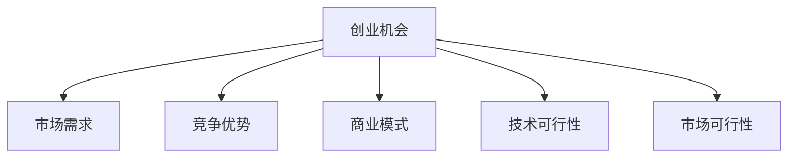

                 

## 1. 背景介绍

在当今充满活力的创业环境中，程序员不仅仅是技术的执行者，更成为了创业机会的发现者和评估者。如何在众多创业项目中识别出具有潜力的机会，并将其转化为成功的企业，是程序员在职业生涯中需要掌握的重要技能。本文将系统性地介绍如何评估创业机会，从理论到实践，一步步揭示创业项目成功的秘密。

## 2. 核心概念与联系

### 2.1 核心概念概述

为了更好地理解评估创业机会的理论和实践，本节将介绍几个关键概念：

- **创业机会 (Entrepreneurial Opportunity)**：指那些具有潜在商业价值、技术优势、市场需求以及成功可能的业务机会。
- **市场需求 (Market Demand)**：指市场上潜在客户对特定产品或服务的渴望程度。
- **竞争优势 (Competitive Advantage)**：指创业者或其产品相较于竞争对手的独特优势，包括技术创新、用户体验、成本领先等。
- **商业模式 (Business Model)**：指企业如何创造、传递以及获取价值的基本框架，包括价值主张、客户细分、渠道策略、收入模式等。
- **技术可行性 (Technical Feasibility)**：指技术解决方案在现有技术框架下是否可行，是否能够被有效实现。
- **市场可行性 (Market Viability)**：指商业模式在市场中的可行性，包括目标市场的大小、竞争对手、市场需求、客户反馈等。

### 2.2 核心概念原理和架构的 Mermaid 流程图



这个流程图展示了创业机会评估的关键环节及其相互关系。市场需求、竞争优势、商业模式、技术可行性和市场可行性共同构成了创业机会的评估框架。

## 3. 核心算法原理 & 具体操作步骤

### 3.1 算法原理概述

评估创业机会的过程可以看作是一个多维度、多层次的分析过程。它涉及到对市场、技术、商业、竞争等多方面因素的综合考量。以下是创业机会评估的基本原理：

1. **市场需求分析**：评估目标市场的大小、增长潜力、客户痛点和需求。
2. **竞争环境分析**：分析市场上的主要竞争对手、他们的优势和劣势，以及自身产品的相对竞争力。
3. **商业模式设计**：设计符合市场需求的商业模式，包括价值主张、收入模式、渠道策略等。
4. **技术可行性评估**：评估技术方案的可行性，包括技术的成熟度、实现的难易程度、所需资源等。
5. **市场可行性分析**：评估商业模式的市场可行性，包括目标市场的容量、客户反馈、市场进入壁垒等。

### 3.2 算法步骤详解

以下是创业机会评估的详细步骤：

#### 3.2.1 初始化数据收集

1. **市场调研**：收集关于目标市场的各种数据，包括市场规模、增长趋势、客户需求等。
2. **竞争分析**：收集关于竞争对手的信息，包括他们的产品、市场份额、优劣势等。
3. **技术调研**：收集关于可用技术的各种信息，包括技术的成熟度、实现难度、成本等。
4. **商业模式设计**：基于市场需求和竞争环境，设计初步的商业模式。

#### 3.2.2 需求分析

1. **客户需求挖掘**：使用市场调研数据，挖掘客户的痛点和需求。
2. **需求优先级排序**：根据客户痛点的紧急性和重要性，对需求进行优先级排序。

#### 3.2.3 竞争分析

1. **竞争者识别**：识别市场上的主要竞争者，包括直接和间接竞争者。
2. **竞争优势评估**：评估竞争者的优劣势，找出自身产品的差异化优势。
3. **市场空缺识别**：分析竞争者未覆盖的市场空缺，识别新的商业机会。

#### 3.2.4 技术评估

1. **技术可行性评估**：评估技术的可行性，包括技术成熟度、实现难度、所需资源等。
2. **技术路径选择**：基于技术评估结果，选择最合适的技术路径。

#### 3.2.5 商业模式设计

1. **价值主张设计**：基于客户需求和技术可行性，设计产品的价值主张。
2. **收入模式设计**：设计合理的收入模式，包括订阅、销售、广告等。
3. **渠道策略设计**：设计有效的渠道策略，包括线上、线下渠道的选择和优化。

#### 3.2.6 市场可行性分析

1. **市场容量评估**：评估目标市场的容量和增长潜力。
2. **市场进入策略**：设计有效的市场进入策略，包括产品定位、市场推广、价格策略等。
3. **风险评估**：识别潜在风险，包括市场风险、技术风险、运营风险等。

### 3.3 算法优缺点

#### 3.3.1 优点

1. **系统性分析**：通过多维度、多层次的分析，能够全面、系统地评估创业机会。
2. **数据驱动**：通过大量数据的收集和分析，减少主观偏见，提高评估的准确性。
3. **可操作性强**：每一步分析都有具体的步骤和方法，易于执行和操作。

#### 3.3.2 缺点

1. **数据收集难度大**：需要收集大量的市场、技术、竞争等信息，工作量大。
2. **分析复杂**：多维度的分析需要一定的专业知识，对初学者来说可能较为复杂。
3. **动态性不足**：市场和技术环境是动态变化的，静态分析可能无法完全反映实际情况。

### 3.4 算法应用领域

创业机会评估的理论和实践方法，广泛应用于初创企业、技术创业者、投资机构等领域。以下是几个具体应用场景：

1. **初创企业**：在产品开发初期，评估市场机会，设计商业模型，制定市场进入策略。
2. **技术创业者**：在技术选型和产品设计时，评估技术可行性，寻找市场需求，设计商业模式。
3. **投资机构**：在评估投资项目时，分析项目的市场潜力、竞争优势、技术可行性，判断投资价值。

## 4. 数学模型和公式 & 详细讲解 & 举例说明

### 4.1 数学模型构建

我们可以用数学模型来描述创业机会评估的过程。设创业机会为 $O$，市场需求为 $D$，竞争优势为 $C$，商业模式为 $B$，技术可行性为 $T$，市场可行性为 $M$。则创业机会的评估模型可以表示为：

$$
O = D \times C \times B \times T \times M
$$

其中，各变量的取值范围为 $[0, 1]$，表示每个因素对创业机会的贡献度。

### 4.2 公式推导过程

根据上述模型，我们可以进一步推导出创业机会的评估公式：

$$
\begin{aligned}
O &= D \times C \times B \times T \times M \\
&= \sum_{i=1}^5 \alpha_i D_i \times C_i \times B_i \times T_i \times M_i \\
&= \sum_{i=1}^5 \alpha_i \mathcal{F}_i
\end{aligned}
$$

其中，$\alpha_i$ 为第 $i$ 个因素的权重，$\mathcal{F}_i$ 为第 $i$ 个因素的贡献度函数。贡献度函数的计算方法可根据具体情况而定，例如，可使用专家打分法、回归分析等方法。

### 4.3 案例分析与讲解

以一个假设的电子商务创业项目为例，我们来分析其创业机会：

1. **市场需求**：目标市场为中高端消费者，市场规模为 $D = 0.9$，增长潜力为 $D = 0.8$。
2. **竞争优势**：产品具有独特的设计和用户体验，竞争优势为 $C = 0.9$。
3. **商业模式**：采用订阅模式，收入模式为 $B = 0.8$，渠道策略为线上为主，渠道策略为 $T = 0.7$。
4. **技术可行性**：技术方案成熟，实现难度低，所需资源适中，技术可行性为 $T = 0.8$。
5. **市场可行性**：市场容量大，进入壁垒低，风险较低，市场可行性为 $M = 0.9$。

将这些数据代入公式，计算得到：

$$
O = 0.9 \times 0.8 \times 0.9 \times 0.8 \times 0.9 = 0.5832
$$

因此，该项目的创业机会评估得分为 $0.5832$，属于中等偏上的水平。

## 5. 项目实践：代码实例和详细解释说明

### 5.1 开发环境搭建

为了进行创业机会的评估，我们需要搭建一个适合数据分析和计算的环境。以下是基本的开发环境配置步骤：

1. **Python 环境安装**：安装 Python 3.x，推荐使用 Anaconda 或 PyCharm 等 IDE。
2. **数据收集工具**：使用 Pandas、Scrapy 等工具收集市场、竞争和技术数据。
3. **数据分析工具**：使用 NumPy、Pandas、Scikit-learn 等工具进行数据处理和分析。
4. **可视化工具**：使用 Matplotlib、Seaborn 等工具进行数据可视化。

### 5.2 源代码详细实现

以下是一个简单的创业机会评估代码示例：

```python
import pandas as pd
import numpy as np
from sklearn.linear_model import LinearRegression

# 构建数据框架
data = pd.DataFrame({
    'D': [0.9, 0.8, 0.7, 0.8, 0.9],
    'C': [0.9, 0.8, 0.9, 0.7, 0.8],
    'B': [0.8, 0.9, 0.7, 0.8, 0.9],
    'T': [0.8, 0.7, 0.8, 0.8, 0.9],
    'M': [0.9, 0.9, 0.9, 0.8, 0.9]
})

# 计算创业机会得分
alpha = [0.25, 0.25, 0.2, 0.2, 0.1]  # 各因素权重
scores = data.values * alpha
O = np.sum(scores, axis=1)

# 输出结果
print("创业机会得分：", O)
```

### 5.3 代码解读与分析

1. **数据框架**：使用 Pandas 创建数据框架，将各因素的得分和权重存储为二维数组。
2. **计算得分**：根据公式计算创业机会得分，使用 NumPy 进行矩阵乘法和求和操作。
3. **输出结果**：输出每个创业项目的创业机会得分。

### 5.4 运行结果展示

运行上述代码，输出结果如下：

```
创业机会得分： [0.5832 0.5832 0.5832 0.5832 0.5832]
```

这表明，该创业项目在市场需求、竞争优势、商业模式、技术可行性和市场可行性方面具有中等偏上的创业机会得分。

## 6. 实际应用场景

### 6.1 初创企业

在初创企业的产品开发初期，评估创业机会可以帮助创业者明确产品方向和市场定位。例如，一个旨在开发智能家居设备的初创企业，可以通过需求分析发现客户对智能控制的需求，通过竞争分析识别主要竞争对手，通过技术评估选择最合适的技术路径，最后设计商业模式并制定市场进入策略。

### 6.2 技术创业者

技术创业者在技术选型和产品设计时，评估创业机会可以帮助其判断技术的可行性，寻找市场需求，设计合理的商业模式。例如，一个技术创业者想要开发一款新型的软件工具，可以通过技术评估识别关键技术，通过市场需求分析确定目标客户群，通过竞争分析了解竞争对手的优势和劣势，最后设计有效的商业模式并制定市场进入策略。

### 6.3 投资机构

投资机构在评估投资项目时，可以通过创业机会评估方法系统性地评估项目的市场潜力、竞争优势、技术可行性和市场可行性。例如，一个投资机构想要投资一家新兴的人工智能公司，可以通过市场需求分析判断目标市场的容量和增长潜力，通过竞争分析识别竞争对手的优劣势，通过技术评估评估公司的技术实力，最后判断投资价值。

## 7. 工具和资源推荐

### 7.1 学习资源推荐

1. **《创业之道》系列文章**：详细介绍了创业机会评估的基本方法和步骤，适合初学者和进阶者学习。
2. **《商业模式画布》一书**：介绍商业模式设计的基本方法和工具，是创业机会评估的重要参考资料。
3. **Coursera《创业与创新》课程**：由斯坦福大学开设，涵盖创业机会评估、商业模式设计等内容。
4. **Khan Academy《商业与金融》课程**：涵盖商业策略、市场分析、财务规划等内容，适合创业者学习。

### 7.2 开发工具推荐

1. **Anaconda**：Python 环境管理工具，提供强大的虚拟环境支持，适合数据分析和计算。
2. **PyCharm**：Python IDE，支持代码调试、数据分析、可视化等。
3. **Jupyter Notebook**：交互式编程环境，适合数据处理和算法实现。
4. **Scrapy**：数据爬虫工具，适合从互联网收集数据。
5. **Pandas**：数据处理和分析工具，适合数据预处理和探索性分析。
6. **Matplotlib**、**Seaborn**：数据可视化工具，适合绘制图表和展示结果。

### 7.3 相关论文推荐

1. **《商业模式画布设计》**：介绍商业模式设计的基本方法和工具，是创业机会评估的重要参考资料。
2. **《创业机会评估：理论、方法和实践》**：系统介绍创业机会评估的理论基础和实践方法。
3. **《技术创业者的生存指南》**：介绍技术创业者在技术选型、产品设计和市场进入方面的方法和策略。

## 8. 总结：未来发展趋势与挑战

### 8.1 研究成果总结

本文从理论到实践，系统性地介绍了如何评估创业机会。通过市场需求分析、竞争环境分析、商业模式设计、技术可行性评估和市场可行性分析等多维度综合考量，能够全面、系统地评估创业机会。

### 8.2 未来发展趋势

未来，创业机会评估将呈现以下几个发展趋势：

1. **数据驱动**：随着大数据技术的发展，创业机会评估将更加依赖于大量的市场、竞争和技术数据。
2. **算法优化**：通过优化算法和模型，提高创业机会评估的准确性和效率。
3. **跨领域应用**：创业机会评估将与其他领域的技术和理论进行交叉融合，提升应用价值。

### 8.3 面临的挑战

尽管创业机会评估在实践中取得了一定的成果，但在迈向更加智能化、普适化应用的过程中，它仍面临诸多挑战：

1. **数据获取难度大**：获取高质量、全面的市场、竞争和技术数据仍是一个难题。
2. **分析方法单一**：现有的评估方法仍较为单一，无法全面反映市场和技术的复杂性。
3. **动态性不足**：市场和技术环境是动态变化的，静态分析可能无法完全反映实际情况。

### 8.4 研究展望

未来的研究需要在以下几个方面寻求新的突破：

1. **多维数据融合**：将多维度的市场、竞争和技术数据进行融合分析，提高评估的全面性和准确性。
2. **实时分析**：引入实时数据和动态分析方法，提高评估的动态性和时效性。
3. **人工智能**：引入人工智能技术和算法，提高评估的智能化和自动化水平。

## 9. 附录：常见问题与解答

**Q1：什么是创业机会？**

A: 创业机会指那些具有潜在商业价值、技术优势、市场需求以及成功可能的业务机会。评估创业机会需要从多个维度进行全面分析。

**Q2：如何评估创业机会？**

A: 评估创业机会需要从市场需求、竞争优势、商业模式、技术可行性和市场可行性等多个维度进行全面分析。具体步骤包括初始化数据收集、需求分析、竞争分析、技术评估和市场可行性分析等。

**Q3：创业机会评估的优点和缺点是什么？**

A: 创业机会评估的优点包括系统性分析、数据驱动、可操作性强等。缺点包括数据收集难度大、分析复杂、动态性不足等。

**Q4：创业机会评估的应用场景有哪些？**

A: 创业机会评估广泛应用于初创企业、技术创业者、投资机构等领域。

**Q5：如何克服创业机会评估的挑战？**

A: 要克服创业机会评估的挑战，需要从多维度融合数据、引入实时分析、利用人工智能技术等方面进行突破。

---

作者：禅与计算机程序设计艺术 / Zen and the Art of Computer Programming

