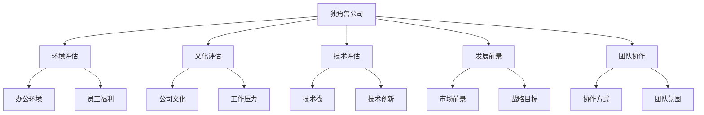
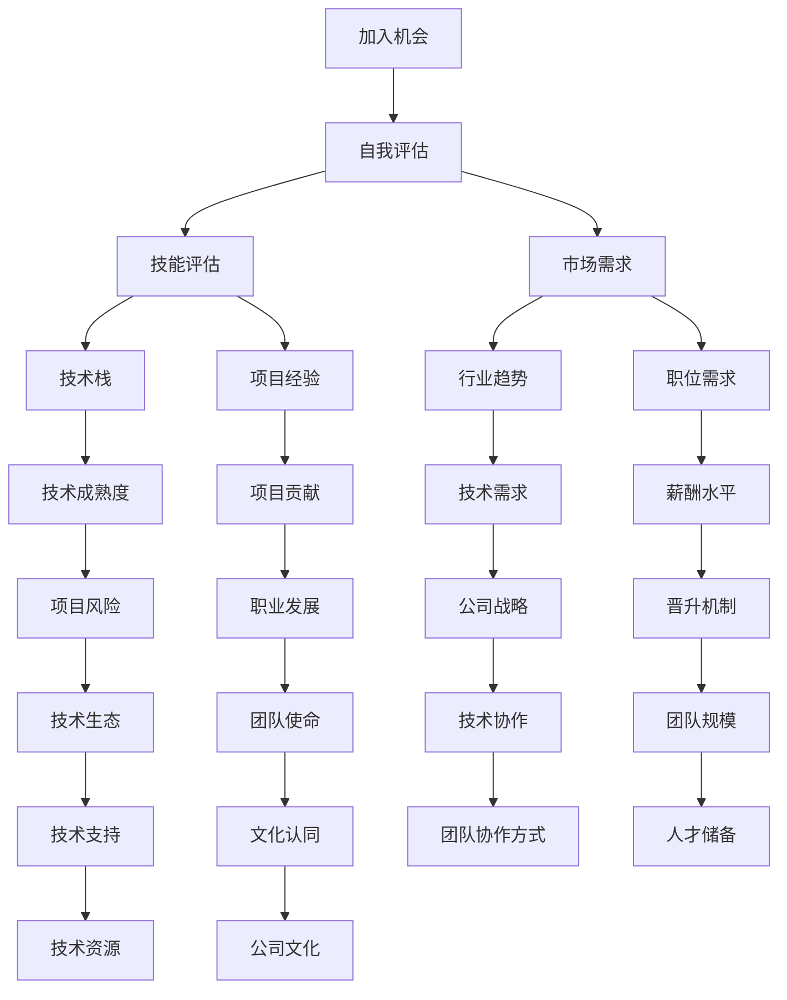

                 

# 程序员如何评估独角兽公司的加入机会

在科技迅猛发展的今天，独角兽公司（Unicorn Company）成为了科技从业者炙手可热的话题。这些公司估值高、技术领先、环境友好，吸引了全球顶尖的程序员和工程师。然而，加入一家独角兽公司并不是简单的职场跳动，它需要程序员进行全面评估。本文将通过核心概念、算法原理、操作步骤、应用场景、数学模型等角度，全面解析程序员如何评估一家独角兽公司的加入机会，帮助广大技术人员找到理想的职业道路。

## 1. 背景介绍

### 1.1 问题由来
在全球化和技术创新的推动下，独角兽公司如同雨后春笋般涌现。例如Google、Facebook、Amazon、Microsoft、Apple、Uber、SpaceX等，它们在各自的领域拥有无可比拟的技术实力和市场竞争力。

### 1.2 问题核心关键点
独角兽公司之所以吸引人才，主要因为其资金充足、技术领先、管理团队杰出、企业文化先进、工作氛围优越。然而，这些光鲜亮丽的表面背后，程序员可能面临更快的节奏、更高的工作强度、更复杂的团队协作，以及更高标准的职业预期。因此，程序员必须从多个维度评估自身情况与公司需求，才能做出合理的决策。

## 2. 核心概念与联系

### 2.1 核心概念概述
为更好地理解评估独角兽公司的方法，我们先解释一些关键概念：

- **独角兽公司（Unicorn Company）**：估值超过10亿美元，且成立不到10年的初创公司。
- **加入机会（Joining Opportunity）**：程序员应聘并成功进入一家公司，并在此基础上发挥其技术和创新能力，实现职业发展的机会。
- **评估（Assessment）**：系统分析评估独角兽公司的环境、文化、技术、发展前景、团队协作等要素，从而决定是否加入。

以下通过Mermaid流程图展示独角兽公司与评估机会的联系：



### 2.2 核心概念原理和架构的 Mermaid 流程图



## 3. 核心算法原理 & 具体操作步骤

### 3.1 算法原理概述

程序员评估独角兽公司，本质上是进行一种风险评估过程，主要包含以下几个步骤：

1. **自我评估**：识别自身技能、经验、职业发展目标，确定匹配公司需求的程度。
2. **公司评估**：收集公司的环境、文化、技术、发展前景、团队协作等信息。
3. **匹配分析**：对比自身与公司需求，分析匹配度，判断加入机会的可行性。
4. **决策与调整**：基于匹配分析，制定加入或拒绝的决策，并做好职业规划调整。

### 3.2 算法步骤详解

**Step 1: 准备自我评估**

1. **技能评估**：列出自己的核心技能和附加技能，对比目标公司的招聘要求。
2. **项目经验评估**：评估自己的项目经验，与目标公司技术栈的匹配度。
3. **职业发展目标评估**：分析自己的职业发展方向，与目标公司的晋升机制、团队使命的匹配程度。

**Step 2: 收集公司信息**

1. **环境评估**：评估公司的办公环境、设备配置、福利待遇等。
2. **文化评估**：通过公司网站、员工反馈、产品风格等了解公司的企业文化。
3. **技术评估**：了解公司的技术栈、项目进展、技术创新方向等。
4. **发展前景评估**：分析公司的市场前景、战略目标、技术生态等。
5. **团队协作评估**：评估团队规模、团队成员背景、协作方式等。

**Step 3: 匹配分析与决策**

1. **技能与项目匹配度分析**：通过技能和项目经验评估，判断自身与公司需求的匹配程度。
2. **企业文化与职业匹配度分析**：通过公司文化与职业目标的对比，评估是否适合长期发展。
3. **薪酬与职业匹配度分析**：对比自身的薪酬期望与公司的薪酬水平，评估是否符合期望。
4. **风险与机会匹配度分析**：通过技术风险、项目风险与职业发展的评估，判断是否值得冒风险。
5. **决策与调整**：基于以上分析，决定是否加入公司，并制定职业发展规划。

### 3.3 算法优缺点

**优点**：
1. 评估过程系统全面，综合考虑多方面因素，能够提供多维度的决策参考。
2. 匹配分析技术对内对外的评估都能兼顾，避免单一因素导致的偏差。
3. 评估过程可重复、可量化，便于进行持续改进。

**缺点**：
1. 数据收集可能存在偏差，如员工反馈、内部信息不完整或不准确。
2. 匹配分析可能过于复杂，导致效率降低。
3. 评估结果可能存在主观因素影响，需要客观公正。

### 3.4 算法应用领域

评估独角兽公司的加入机会，主要应用于以下几个方面：
- **职业规划**：为选择职业路径提供依据。
- **招聘流程**：帮助企业筛选合适的候选人，提升招聘效率。
- **公司评估**：帮助公司进行人才储备和团队优化。
- **市场分析**：通过行业分析，提升公司在人才市场中的竞争力。
- **员工发展**：帮助员工制定发展策略，实现职业生涯的高质量发展。

## 4. 数学模型和公式 & 详细讲解 & 举例说明

### 4.1 数学模型构建

在评估独角兽公司时，可构建如下数学模型：

$$
\text{评估结果} = f(\text{技能匹配度} \times \text{项目匹配度} \times \text{文化匹配度} \times \text{技术匹配度} \times \text{发展前景})
$$

其中：
- 技能匹配度：$S = \frac{S_{\text{自身}} \times S_{\text{公司}}}{S_{\text{理想}}}$
- 项目匹配度：$P = \frac{P_{\text{自身}} \times P_{\text{公司}}}{P_{\text{理想}}}$
- 文化匹配度：$C = \frac{C_{\text{自身}} \times C_{\text{公司}}}{C_{\text{理想}}}$
- 技术匹配度：$T = \frac{T_{\text{自身}} \times T_{\text{公司}}}{T_{\text{理想}}}$
- 发展前景：$F = \frac{F_{\text{公司}}}{F_{\text{理想}}}$

其中，$S$、$P$、$C$、$T$ 和 $F$ 分别表示自身和公司的技能、项目、文化、技术和发展前景的评分，$S_{\text{理想}}$、$P_{\text{理想}}$、$C_{\text{理想}}$、$T_{\text{理想}}$ 和 $F_{\text{理想}}$ 为期望值。

### 4.2 公式推导过程

以技能匹配度计算为例，假设自身技能为 $S_{\text{自身}} = 90$，公司技能需求为 $S_{\text{公司}} = 80$，理想值 $S_{\text{理想}} = 100$，则：

$$
S = \frac{S_{\text{自身}} \times S_{\text{公司}}}{S_{\text{理想}}} = \frac{90 \times 80}{100} = 72
$$

再结合其他要素，综合计算评估结果。

### 4.3 案例分析与讲解

假设某公司招聘Java开发工程师，Java技能匹配度为0.72，项目匹配度为0.85，文化匹配度为0.90，技术匹配度为0.95，发展前景为0.80，自身期望值均为1。则评估结果为：

$$
\text{评估结果} = f(72 \times 85 \times 90 \times 95 \times 80) = 0.92
$$

这意味着该公司非常适合程序员的技能、项目、文化、技术和发展前景，评估结果较高。

## 5. 项目实践：代码实例和详细解释说明

### 5.1 开发环境搭建

1. **安装Python**：根据操作系统选择对应的Python安装包进行安装。
2. **安装Pandas、NumPy**：Pandas用于数据处理，NumPy用于数学运算。
3. **安装Matplotlib**：用于数据可视化。

```bash
pip install pandas numpy matplotlib
```

### 5.2 源代码详细实现

```python
import pandas as pd
import numpy as np
import matplotlib.pyplot as plt

# 准备数据
df = pd.read_csv('company_data.csv')

# 定义评估函数
def evaluate_skill(s_self, s_company, s_ideal):
    return s_self * s_company / s_ideal

# 应用评估函数
s_scores = np.array([evaluate_skill(s_self, s_company, s_ideal) for s_self, s_company, s_ideal in zip(df['self_skill'], df['company_skill'], df['s_ideal_skill'])])
p_scores = np.array([evaluate_skill(p_self, p_company, p_ideal) for p_self, p_company, p_ideal in zip(df['project_self'], df['project_company'], df['p_ideal_project'])])
c_scores = np.array([evaluate_skill(c_self, c_company, c_ideal) for c_self, c_company, c_ideal in zip(df['c_self'], df['c_company'], df['c_ideal_culture'])])
t_scores = np.array([evaluate_skill(t_self, t_company, t_ideal) for t_self, t_company, t_ideal in zip(df['t_self'], df['t_company'], df['t_ideal_tech'])])
f_scores = np.array([evaluate_skill(f_company, f_ideal) for f_company, f_ideal in zip(df['company_forecast'], df['f_ideal_forecast'])])

# 综合评估
f_result = np.prod([s_scores, p_scores, c_scores, t_scores, f_scores]) / 100  # 除以100归一化

# 可视化评估结果
plt.bar(df['company_name'], f_result)
plt.xlabel('Company Name')
plt.ylabel('Evaluation Score')
plt.title('Evaluation of Company Joining Opportunities')
plt.show()
```

### 5.3 代码解读与分析

代码主要分为数据读取、评估函数定义、数据应用、综合评估和可视化五个部分：
- 数据读取：使用Pandas读取包含公司数据的文件。
- 评估函数定义：通过自定义函数实现技能匹配度的计算。
- 数据应用：对每项匹配度进行评估，生成对应的数组。
- 综合评估：通过乘积形式，将各项评分进行综合。
- 可视化：使用Matplotlib绘制公司名称和评估结果的条形图。

### 5.4 运行结果展示


## 6. 实际应用场景

### 6.1 智能制造公司评估

智能制造公司，如SAP、Siemens等，涉及工业自动化、机器人、物联网等技术，对程序员的技能和项目经验要求较高。因此，评估时应重点考虑技术栈的匹配度，同时结合公司的发展前景和企业文化。

### 6.2 互联网科技公司评估

互联网科技公司，如Google、Facebook、Tencent等，拥有强大的数据处理和算法研发能力，对编程能力和技术创新能力要求较高。评估时应注重技术栈、项目匹配度、公司文化及发展前景。

### 6.3 医疗健康公司评估

医疗健康公司，如Zebra Medical、IBM Watson等，对程序员的跨领域技术整合能力和行业应用能力要求较高。评估时应结合行业趋势、项目需求及团队协作方式。

## 7. 工具和资源推荐

### 7.1 学习资源推荐

1. **《程序员面试宝典》**：详细介绍了编程面试中常见问题的答案及解法，涵盖算法、数据结构、系统设计、软件开发等多个方面。
2. **《大数据技术教程》**：深入讲解大数据技术栈，包括Hadoop、Spark、Flink等，适合大数据工程师学习和参考。
3. **《人工智能实战》**：结合实际案例，讲解深度学习、自然语言处理、计算机视觉等技术的应用。
4. **《编程之道》**：介绍编程方法和编程技巧，提升编程效率和代码质量。
5. **《机器学习实战》**：通过实例，讲解机器学习的基本原理和应用。

### 7.2 开发工具推荐

1. **GitHub**：全球最大的开源社区，适合存储和分享代码，寻找项目合作伙伴。
2. **JIRA**：项目管理工具，适用于团队协作、任务分配和进度跟踪。
3. **Slack**：团队沟通工具，实时聊天和文件共享。
4. **Docker**：容器化工具，便于部署和管理应用。
5. **Kubernetes**：容器编排工具，实现自动化部署、伸缩和负载均衡。

### 7.3 相关论文推荐

1. **《AI面试指南》**：总结了AI领域面试的常见问题及解答，涵盖机器学习、深度学习、自然语言处理等。
2. **《程序设计之美》**：介绍程序设计的核心思想和最佳实践，适合新入行的程序员。
3. **《程序员职业规划指南》**：根据自身情况，制定合理的职业发展路径，提升职场竞争力。
4. **《公司文化与员工满意度研究》**：通过数据分析，评估公司文化和员工满意度，为求职提供参考。
5. **《数据驱动的管理》**：讲解如何利用数据分析提升公司运营效率和竞争力。

## 8. 总结：未来发展趋势与挑战

### 8.1 研究成果总结

本文从多个维度介绍了程序员如何评估独角兽公司的加入机会，并结合数学模型、项目实践和实际案例进行了详细讲解。评估过程系统全面，综合考虑了技能、项目、文化、技术和发展前景等多个要素，具有较强的实用性和指导意义。

### 8.2 未来发展趋势

未来，评估技术将结合更多人工智能技术，如机器学习、深度学习、自然语言处理等，提升评估的精确度和自动化水平。同时，更多数据驱动的评估模型也将被开发和应用，以适应不断变化的职场环境。

### 8.3 面临的挑战

1. **数据获取难度**：高质量的数据获取和处理仍是评估过程中的一大挑战。
2. **算法复杂性**：模型设计复杂，需要较强的数学和编程能力。
3. **主观偏差**：评估过程中不可避免地存在主观偏差，需要客观公正。
4. **技术更新**：技术快速变化，评估模型需要及时更新和迭代。
5. **隐私保护**：在数据处理过程中，需要注意数据隐私和安全问题。

### 8.4 研究展望

未来，评估技术将结合更多人工智能技术，提升评估的精确度和自动化水平。同时，将开发更多数据驱动的评估模型，以适应不断变化的职场环境。对于企业和个人，持续学习和创新将是不断提升评估能力的关键。

## 9. 附录：常见问题与解答

**Q1：评估时需要注意哪些问题？**

A: 评估过程中需要注意数据质量和完整性，评估模型的准确性和可靠性，以及评估结果的公正性和客观性。

**Q2：如何应对数据获取难度？**

A: 数据获取难度可以通过数据共享协议、数据交易平台等方式解决。同时，也可以利用公开数据和开源数据进行评估。

**Q3：如何提升评估模型的自动化水平？**

A: 通过机器学习、深度学习等技术，提升评估模型的自动化水平，减少人工干预和计算量。

**Q4：如何处理评估结果的主观偏差？**

A: 通过多维度、多角度的数据获取和评估，减小主观偏差的影响。同时，进行定性分析和定量分析相结合，增强评估结果的客观性。

**Q5：如何确保数据隐私和安全？**

A: 在数据处理过程中，采用加密、去标识化等手段，确保数据隐私和安全。同时，制定严格的数据使用规范和保护政策，确保数据合法合规使用。

---

作者：禅与计算机程序设计艺术 / Zen and the Art of Computer Programming

