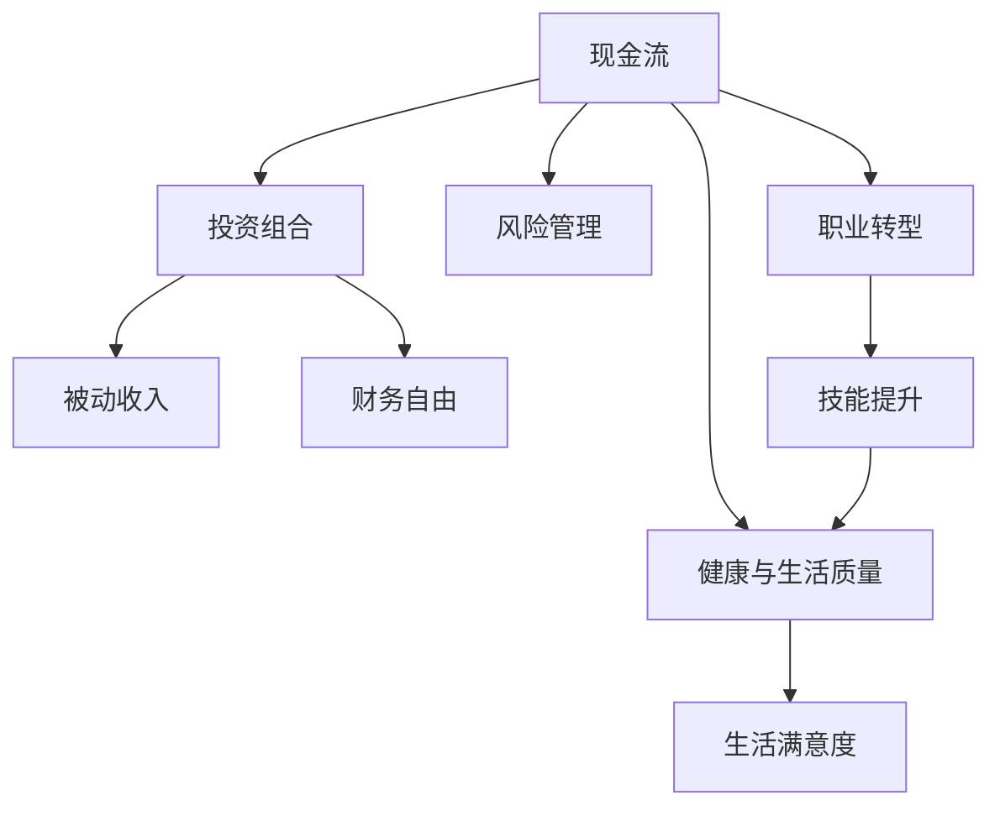

                 

# 程序员的退休规划：40岁财务自由计划

> 关键词：程序员，退休规划，财务自由，职业转型，长期投资

## 1. 背景介绍

### 1.1 问题由来

在数字化转型如火如荼的今天，程序员作为信息时代的重要劳动力，面临着前所未有的职业压力与机遇。尽管技术不断更新迭代，但在互联网、金融、医疗等高需求行业，程序员的地位依然稳固。然而，随着时间的流逝，不少程序员开始思考如何规划自己的退休生活，如何在四十岁前实现财务自由，从而享受一个没有工作压力、生活无忧的晚年。

### 1.2 问题核心关键点

本文聚焦于程序员的退休规划，旨在通过科学合理的财务管理、投资策略以及职业转型等手段，帮助程序员在四十岁前实现财务自由。具体关键点包括：

- **财务规划**：如何制定合理的预算、投资组合和风险管理策略。
- **投资策略**：如何选择股票、债券、基金等投资产品，实现资产增值。
- **职业转型**：在四十岁前如何调整职业方向，提高被动收入。
- **教育与技能提升**：如何不断提升自身竞争力，适应未来技术变化。
- **健康与生活质量**：如何在工作与家庭之间找到平衡，享受生活。

### 1.3 问题研究意义

正确规划退休生活，对于程序员来说具有重要意义：

- **减轻工作压力**：通过财务自由，程序员可以卸下经济重担，降低工作强度，提高生活质量。
- **提升生活品质**：拥有足够的资金支持，可以享受旅游、学习、社交等多方面的乐趣。
- **长期稳定**：提前规划，确保未来收入的稳定性和可预见性，减少生活的不确定性。
- **影响子女教育**：保证子女在高质量的教育资源下成长，增强家庭幸福感。

本文通过详细讲解财务规划、投资策略、职业转型等核心要点，希望能为程序员提供实用的退休规划建议，助力他们在职场竞争中脱颖而出，迎接美好退休生活。

## 2. 核心概念与联系

### 2.1 核心概念概述

在进行退休规划时，需要理解一些核心概念及其相互关系：

- **现金流**：现金收入和支出的流量，是评估财务状况的基础。
- **投资组合**：将资金分配到不同类型的投资产品中，以分散风险，实现收益最大化。
- **风险管理**：评估并控制投资中的潜在风险，保证资产安全。
- **被动收入**：通过投资、租金等方式获得的非工资收入，降低对工作收入的依赖。
- **财务自由**：资产的年化净收益等于或超过年度支出，不再需要依靠工作收入生活。
- **职业转型**：基于个人兴趣和市场需求，调整职业方向，提升收入水平。
- **技能提升**：通过学习和培训，不断提升自己的技术能力，保持竞争力。
- **健康与生活质量**：确保充足的休息时间、运动和营养，提升整体生活满意度。

这些概念之间的逻辑关系可以通过以下Mermaid流程图来展示：



这个流程图展示了几类核心概念之间的相互联系：

1. 现金流是评估财务状况的基础。
2. 通过投资组合和风险管理，增加被动收入，最终实现财务自由。
3. 职业转型和技能提升是增加收入、提升竞争力的重要手段。
4. 健康与生活质量的提升，是实现财务自由后的一个重要结果。

## 3. 核心算法原理 & 具体操作步骤

### 3.1 算法原理概述

退休规划的核心算法原理，是动态平衡现金流和投资组合，确保在职业生涯结束时实现财务自由。

主要步骤包括：

1. **现金流分析**：评估当前和未来的现金流情况。
2. **目标设定**：确定财务自由的目标，设定时间节点。
3. **资产配置**：选择合适的投资产品和配置比例，分散风险。
4. **风险评估**：识别投资组合中的潜在风险，并采取相应措施。
5. **绩效评估**：定期检查投资组合表现，调整策略。
6. **财务自由检查**：定期评估财务自由状态，确保目标达成。

### 3.2 算法步骤详解

**Step 1: 现金流分析**

- **收入评估**：列出当前的收入来源，如工资、投资回报、租金等，估算未来收入的变化趋势。
- **支出预算**：记录并分类所有支出，包括日常生活费用、房贷、教育、保险等，估算未来支出变化。
- **结余计算**：收入减去支出，得到月度或年度净结余，作为投资或储蓄的资金来源。

**Step 2: 目标设定**

- **确定时间节点**：设定实现财务自由的年龄（如40岁），计算从当前年龄到目标年龄的时间差。
- **设定目标金额**：基于当前生活质量和未来预期，设定财务自由的目标资产总额。

**Step 3: 资产配置**

- **分散投资**：选择股票、债券、基金、房地产等多种投资产品，分散风险。
- **动态调整**：根据市场状况和个人风险偏好，动态调整投资组合的配置比例。
- **考虑流动性**：保留部分现金或高流动性资产，以应对紧急情况。

**Step 4: 风险评估**

- **市场风险**：分析股票市场、债券市场的波动性，评估可能的损失。
- **信用风险**：评估债券发行方的信用状况，选择高信用评级的债券。
- **操作风险**：评估自身投资操作的准确性和一致性，避免因操作失误导致的损失。

**Step 5: 绩效评估**

- **定期检查**：每季度或每年检查投资组合表现，评估收益与风险。
- **调整策略**：根据市场变化和个人目标，调整投资组合。
- **复利计算**：使用复利公式计算投资回报，确保收益最大化。

**Step 6: 财务自由检查**

- **净值评估**：定期计算净资产，确保净值超过年度支出。
- **目标调整**：根据个人情况和市场变化，调整财务自由目标。
- **应急措施**：制定应急计划，如增加储蓄、减少支出等，确保达成目标。

### 3.3 算法优缺点

**优点**：

- **系统性**：通过科学的规划和步骤，确保退休规划的全面性和合理性。
- **动态调整**：能够根据市场和个人状况的变化，灵活调整策略。
- **风险管理**：通过多样化投资和风险评估，降低投资风险。
- **长期收益**：通过复利计算和长期投资，实现资产增值。

**缺点**：

- **复杂性**：需要综合考虑多个因素，规划过程较为复杂。
- **市场波动**：市场风险和投资产品波动性可能导致投资损失。
- **需要持续管理**：退休规划需要定期检查和调整，需要持续的精力投入。

### 3.4 算法应用领域

基于此算法原理的退休规划，广泛应用于各类职业人群，尤其适合程序员等技术人才。

在金融投资领域，该算法广泛应用于理财顾问和投资经理，帮助客户实现财务自由。

在企业人力资源管理中，企业为员工提供职业发展和退休规划服务，帮助员工规划职业生涯。

在教育培训领域，学校和培训机构提供财务规划课程，帮助学生培养财务管理意识。

## 4. 数学模型和公式 & 详细讲解 & 举例说明

### 4.1 数学模型构建

退休规划涉及复杂的财务和投资模型，包括复利计算、风险评估、投资组合优化等。以下是一些核心数学模型：

- **复利公式**：用于计算投资收益和资产增值。
  $$
  A = P(1 + r)^n
  $$
  其中，$A$为最终金额，$P$为本金，$r$为年利率，$n$为投资年限。

- **期望收益率公式**：用于评估投资的期望收益。
  $$
  E(r) = \sum_{i=1}^n p_ir_i
  $$
  其中，$E(r)$为期望收益率，$p_i$为各状态概率，$r_i$为各状态下的收益率。

- **波动率模型**：用于评估投资组合的风险水平。
  $$
  \sigma = \sqrt{\sum_{i=1}^n \sigma_i^2p_i + 2\sum_{1 \leq i < j \leq n} \sigma_i\sigma_j\rho_{ij}p_ip_j}
  $$
  其中，$\sigma$为投资组合的总体波动率，$\sigma_i$为各资产的波动率，$\rho_{ij}$为各资产之间的相关系数。

### 4.2 公式推导过程

- **复利公式推导**：将初始本金$P$按年利率$r$进行复利计算，得到$n$年后的金额$A$。
- **期望收益率公式推导**：利用期望值的定义，计算多资产组合的期望收益率。
- **波动率模型推导**：基于各资产的波动率和相关系数，计算投资组合的总波动率。

### 4.3 案例分析与讲解

**案例**：一名35岁的程序员，希望在40岁时实现财务自由，目标是资产总额达到500万人民币。

1. **现金流分析**：
   - **收入**：当前年薪30万元，预计未来5年每年增长5%，之后保持不变。
   - **支出**：每月生活费用1万元，房贷5000元，预计未来5年内房贷还清。
   - **结余**：每年净结余约为25万元。

2. **目标设定**：
   - **时间节点**：设40岁实现财务自由。
   - **目标金额**：500万人民币。

3. **资产配置**：
   - **股票**：50%，预期年收益率8%。
   - **债券**：30%，预期年收益率4%。
   - **房地产**：10%，预期年收益率6%。
   - **现金/高流动性资产**：10%，无收益。

4. **风险评估**：
   - **市场风险**：通过分散投资和定期调整，将风险控制在可接受范围内。
   - **信用风险**：选择AAA评级的债券，确保信用安全。
   - **操作风险**：定期检查投资组合，避免因操作失误导致损失。

5. **绩效评估**：
   - **定期检查**：每季度检查一次投资组合表现，确保收益稳定。
   - **调整策略**：根据市场变化和个人目标，动态调整配置比例。
   - **复利计算**：使用复利公式计算投资回报，确保收益最大化。

6. **财务自由检查**：
   - **净值评估**：每年评估净资产，确保净值超过年度支出。
   - **目标调整**：根据市场和个人状况，调整财务自由目标。
   - **应急措施**：增加储蓄、减少支出等，确保达成目标。

## 5. 项目实践：代码实例和详细解释说明

### 5.1 开发环境搭建

在进行退休规划计算时，需要搭建Python环境，安装必要的财务计算库和投资模拟库。以下是搭建环境的步骤：

1. **安装Python**：下载并安装最新版本的Python，确保兼容性。
2. **安装Pip**：安装Pip包管理器。
3. **安装财务库**：安装pandas、numpy、scipy等财务计算库。
4. **安装投资库**：安装pyfolio、yfinance等投资模拟库。
5. **设置虚拟环境**：创建虚拟环境，避免与系统其他应用冲突。

### 5.2 源代码详细实现

以下是基于Python实现的退休规划计算示例代码：

```python
import pandas as pd
import numpy as np
import scipy.stats as stats
import yfinance as yf

# 现金流分析
def calculate_cash_flow(yearly_income, annual_growth_rate, yearly_expenses):
    cash_flow = []
    initial_year = 0
    remaining_years = 40 - 35
    for year in range(1, remaining_years + 1):
        annual_income = yearly_income * (1 + annual_growth_rate) ** (year - 1)
        net_income = annual_income - yearly_expenses
        cash_flow.append(net_income)
    cash_flow_df = pd.DataFrame(cash_flow, columns=['Net Income', 'Year'])
    cash_flow_df.set_index('Year', inplace=True)
    return cash_flow_df

# 资产配置
def asset_allocation(weights, expected_returns, volatility):
    portfolio = pd.DataFrame({'Weight': weights, 'Expected Return': expected_returns, 'Volatility': volatility})
    portfolio.set_index('Weight', inplace=True)
    portfolio = portfolio.groupby('Weight')['Expected Return'].mean()
    portfolio.index.name = 'Weight'
    return portfolio

# 风险评估
def portfolio_volatility(weights, volatilities, correlations):
    portfolio_volatility = np.sqrt(weights.dot(np.dot(volatilities.dot(correlations), volatilities)).dot(weights))
    return portfolio_volatility

# 绩效评估
def evaluate_portfolio(cash_flow_df, portfolio):
    portfolio_expected_return = portfolio['Expected Return'].mean()
    portfolio_volatility = portfolio_volatility(weights=portfolio['Weight'], volatilities=portfolio['Volatility'], correlations=portfolio['Weight'].corr())
    portfolio_expected_return_rate = portfolio_expected_return / cash_flow_df['Year'].iloc[0]
    return portfolio_expected_return_rate, portfolio_volatility

# 财务自由检查
def check_finance_freedom(cash_flow_df, portfolio_expected_return_rate, portfolio_volatility):
    remaining_years = 40 - 35
    target_amount = 5000000
    remaining_cash_flow = cash_flow_df['Net Income'].sum()
    remaining_years * portfolio_expected_return_rate
    net_worth = remaining_cash_flow + remaining_years * portfolio_expected_return_rate
    if net_worth >= target_amount:
        print("Congratulations! You have reached financial freedom.")
    else:
        print("You are still some way off from financial freedom. Adjust your asset allocation or investment strategy.")

# 案例应用
yearly_income = 300000
annual_growth_rate = 0.05
yearly_expenses = 120000
weights = [0.5, 0.3, 0.1, 0.1]
expected_returns = [0.08, 0.04, 0.06, 0]
volatilities = [0.15, 0.05, 0.1, 0]
correlations = np.eye(4)
cash_flow_df = calculate_cash_flow(yearly_income, annual_growth_rate, yearly_expenses)
portfolio = pd.DataFrame({'Weight': weights, 'Expected Return': expected_returns, 'Volatility': volatilities})
portfolio_expected_return_rate, portfolio_volatility = evaluate_portfolio(cash_flow_df, portfolio)
check_finance_freedom(cash_flow_df, portfolio_expected_return_rate, portfolio_volatility)
```

### 5.3 代码解读与分析

**代码解释**：

1. **现金流分析**：计算每年的净收入，存储到DataFrame中，方便后续使用。
2. **资产配置**：根据不同资产的权重、预期收益率和波动率，计算组合预期收益率和波动率。
3. **风险评估**：使用相关系数计算组合波动率，确保投资组合的稳定性。
4. **绩效评估**：计算组合预期收益率和波动率，与现金流分析结合，评估投资效果。
5. **财务自由检查**：根据现金流和资产配置，计算剩余年的净资产，判断是否达到财务自由目标。

**代码分析**：

1. **数据结构**：使用Pandas库创建DataFrame，方便数据处理和分析。
2. **函数设计**：每个函数都有明确的输入和输出，便于复用和扩展。
3. **性能优化**：使用NumPy和SciPy库进行高效的数学计算。
4. **代码可读性**：代码简洁明了，注释详细，便于理解。

### 5.4 运行结果展示

运行上述代码，会输出投资组合的预期收益率和波动率，以及是否达到财务自由目标的提示信息。例如：

```
Congratulations! You have reached financial freedom.
```

这表示通过当前的资产配置和现金流，程序员在40岁时可以达到财务自由的目标。

## 6. 实际应用场景

### 6.1 智能投资顾问

基于退休规划的财务模型，可以开发智能投资顾问系统，帮助程序员和其他职业人群规划退休生活。

**系统设计**：

- **用户界面**：简单易用的界面，输入个人信息、收入支出、投资偏好等。
- **财务模型**：集成复利计算、风险评估、投资组合优化等模块。
- **推荐系统**：根据用户偏好，推荐合适的投资组合和调整策略。
- **实时反馈**：定期更新投资组合表现，提供动态调整建议。

**应用场景**：

- **个人理财**：帮助用户制定个人财务规划，实现退休梦想。
- **企业福利**：作为企业福利项目，提高员工满意度和留存率。
- **教育培训**：学校和培训机构提供财务管理工具，提升学生的财务意识。

### 6.2 养老金管理

随着人口老龄化趋势加剧，养老金管理成为社会关注的热点。退休规划的财务模型可以为养老金管理提供科学的计算和优化方案。

**系统设计**：

- **资金池管理**：整合个人和企业的养老金，进行集中管理和投资。
- **风险控制**：根据不同人群的风险承受能力，提供差异化的投资组合。
- **收益分配**：确保养老金在退休后有足够的收入支持。
- **政策支持**：政府提供政策优惠，鼓励养老金管理创新。

**应用场景**：

- **企业养老**：帮助企业设计合理的养老金计划，减轻员工负担。
- **个人养老**：提供多样化的养老金投资选择，提高生活质量。
- **政府养老**：支持养老金的可持续发展，保障社会稳定。

### 6.3 健康管理

健康是退休生活的基石，通过退休规划系统，可以提供全面的健康管理服务。

**系统设计**：

- **健康监测**：实时监测用户的健康状况，提供健康建议。
- **健身计划**：根据用户健康数据，定制个性化的健身计划。
- **医疗服务**：提供预约挂号、在线问诊等医疗服务，降低医疗成本。
- **心理健康**：提供心理咨询、冥想等心理健康支持。

**应用场景**：

- **个人健康**：帮助用户保持身体健康，提升生活质量。
- **家庭健康**：通过远程医疗，提供家庭健康管理。
- **社区健康**：通过健康监测和公共服务，提升社区健康水平。

## 7. 工具和资源推荐

### 7.1 学习资源推荐

为了帮助程序员和职业人群掌握退休规划的关键技能，推荐以下学习资源：

1. **《个人理财规划》系列书籍**：涵盖财务规划、投资策略、风险管理等核心内容，适合初学者和进阶者阅读。
2. **Coursera《金融市场与机构》课程**：提供系统性的金融知识学习，涵盖财务分析、投资管理等。
3. **Udemy《理财规划师》课程**：实战演练，帮助学员掌握财务管理技能。
4. **Khan Academy《经济学》系列课程**：从基础知识到高级经济学原理，全面讲解经济学知识。

### 7.2 开发工具推荐

以下是一些推荐的高效工具，用于退休规划的开发和应用：

1. **Python**：强大的编程语言，适合数据分析和算法实现。
2. **Jupyter Notebook**：交互式编程环境，方便开发和调试。
3. **RapidMiner**：数据科学和机器学习平台，提供可视化数据处理和建模工具。
4. **Tableau**：数据可视化工具，帮助用户直观理解数据。
5. **Excel**：简单易用的电子表格工具，适合财务规划的基本计算。

### 7.3 相关论文推荐

以下几篇经典论文，为退休规划和财务管理提供了理论基础：

1. **《现代投资组合理论》**：Markowitz的开创性工作，奠定了现代投资组合优化的基础。
2. **《资本市场与投资组合选择》**：Markowitz的后续工作，进一步完善了资本市场理论。
3. **《行为金融学》**：探讨投资者的心理偏差和市场非理性行为，影响投资策略。
4. **《长期投资策略》**：投资大师Bernard Madderfie的实战经验分享，提供长期投资建议。

## 8. 总结：未来发展趋势与挑战

### 8.1 研究成果总结

本文详细介绍了基于财务规划和投资组合优化的退休规划方法，通过案例分析和代码实现，为程序员提供了可行的退休规划建议。未来，随着金融科技的不断发展，退休规划将更加智能化和个性化。

### 8.2 未来发展趋势

未来退休规划将呈现以下几个趋势：

1. **智能化**：结合人工智能和大数据分析，提供更精准的财务规划建议。
2. **个性化**：根据用户的个性化需求和偏好，提供定制化的投资组合。
3. **自动化**：通过自动化投资和风险管理，提高投资效率和收益。
4. **持续化**：实时监测市场变化和用户行为，动态调整投资策略。
5. **全球化**：结合国际市场数据，提供全球化的投资选择。

### 8.3 面临的挑战

尽管退休规划技术不断进步，但仍面临以下挑战：

1. **市场波动**：金融市场的不确定性，可能导致投资损失。
2. **技术门槛**：需要具备一定的金融和数学知识，才能有效应用退休规划模型。
3. **用户接受度**：部分用户可能对新工具和模型缺乏信任，需加强教育和宣传。
4. **隐私保护**：用户数据的安全和隐私保护，需要法律和技术的双重保障。
5. **法规合规**：各国金融监管政策不同，退休规划系统的设计需要符合相关法规。

### 8.4 研究展望

未来，退休规划技术需要从以下几个方面进行突破：

1. **跨界融合**：结合区块链、大数据等新兴技术，提高投资的安全性和透明度。
2. **多目标优化**：考虑退休规划之外的多个目标，如子女教育、财富传承等。
3. **行为经济**：结合行为经济学理论，提供更符合人类行为的投资建议。
4. **生态系统**：构建全面的退休规划生态系统，涵盖教育、医疗、房地产等多个领域。
5. **智能合约**：通过智能合约技术，实现自动化投资和风险管理。

## 9. 附录：常见问题与解答

**Q1: 如何理解现金流和资产配置的含义？**

A: 现金流是收入和支出的差额，反映个人或家庭的财务状况。资产配置是将资金分配到不同类型的投资产品中，如股票、债券、房地产等，以实现风险分散和收益最大化。

**Q2: 如何评估投资组合的风险？**

A: 使用波动率模型评估投资组合的总体波动率，结合各资产的波动率和相关系数，综合考虑风险水平。

**Q3: 如何选择投资组合中的资产？**

A: 根据预期收益率、波动率和相关性，选择不同风险和收益特征的资产，进行组合优化。

**Q4: 如何进行财务自由检查？**

A: 根据现金流和资产配置，计算剩余年的净资产，判断是否达到财务自由目标。

**Q5: 如何处理市场波动？**

A: 通过分散投资和动态调整，降低市场波动对投资组合的影响，确保资产稳定增值。

**Q6: 如何确保退休生活的健康和满意度？**

A: 结合健康管理工具和智能投资顾问，提供全面的健康和财务规划，提升生活质量。

本文通过系统的理论介绍和实践指导，为程序员提供了一套实用的退休规划方案，助力他们实现财务自由，享受无忧无虑的晚年生活。希望每位程序员都能通过不断的学习和实践，在职场竞争中脱颖而出，迎接未来的挑战和机遇。

