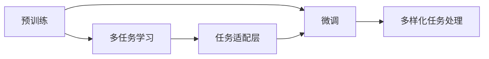

                 

## 1. 背景介绍

大语言模型(LLM)已经在自然语言处理(NLP)领域取得了突破性的进展。从早期的单任务模型，如BERT、GPT等，到如今的通用模型如GPT-3、T5等，大语言模型通过自监督学习和大规模数据训练，具备了强大的语言理解和生成能力。然而，无论是早期的单任务模型还是如今的通用模型，其设计目标和应用场景都相对单一。如何使LLM具备更强的泛化能力和多样化任务处理能力，成为了当前研究的热点问题。

在工业界和学术界，研究人员逐渐认识到LLM的多样化任务处理能力的重要性。这种能力不仅能提升模型在不同场景下的适应性，还能开辟新的应用领域。例如，将LLM用于医疗领域，帮助医生诊断疾病、编写病历；用于法律领域，辅助律师撰写合同、分析案例；用于金融领域，评估市场风险、撰写投资报告等。因此，本文将从LLM的多样化任务处理能力出发，探讨其实现原理、操作步骤以及应用领域，并进一步提出未来发展方向。

## 2. 核心概念与联系

为了更好地理解LLM如何实现多样化任务处理，本节将介绍几个关键概念及其之间的联系。

### 2.1 核心概念概述

- **大语言模型(LLM)**：指以Transformer等结构为基础的预训练模型，如BERT、GPT-3、T5等。这些模型通过大规模数据训练，具备强大的语言理解和生成能力，可用于多种NLP任务。

- **预训练(Pre-training)**：指在大规模无标签文本语料上，通过自监督学习任务训练通用语言模型的过程。常见的预训练任务包括掩码语言模型、下一句预测等。

- **微调(Fine-tuning)**：指在预训练模型的基础上，使用下游任务的少量标注数据，通过有监督学习优化模型在特定任务上的性能。

- **迁移学习(Transfer learning)**：指将一个领域学习到的知识，迁移应用到另一个不同但相关的领域的学习范式。预训练和微调都是迁移学习的一种形式。

- **任务适配层(Task-specific Layer)**：指根据特定任务设计，添加到预训练模型顶层的附加层。如分类任务的线性分类器、生成任务的解码器等。

- **多任务学习(Multi-task Learning)**：指同时训练多个任务，以共享预训练知识，提升模型泛化性能。

### 2.2 核心概念的联系

大语言模型通过预训练获得了强大的语言理解和生成能力，但这种能力往往局限于单一任务或领域。为了突破这种限制，研究人员提出了多任务学习和迁移学习的方法，使得LLM能够在多个任务上协同训练，共享预训练知识。通过任务适配层，LLM可以在特定的任务上进一步微调，提升其在特定任务上的性能。

下面通过一个Mermaid流程图展示这些核心概念之间的联系：



该图展示了预训练、多任务学习、任务适配层、微调和多样化任务处理之间的联系。预训练模型通过多任务学习共享知识，并在任务适配层进一步微调，从而在多种任务上实现多样化处理。

## 3. 核心算法原理 & 具体操作步骤

### 3.1 算法原理概述

大语言模型多样化任务处理的核心算法原理在于多任务学习和迁移学习。以下是对其原理的详细讲解：

1. **多任务学习**：指同时训练多个任务，以共享预训练知识。通过在多个任务上同时训练，模型能够学习到更加通用的语言表示，提升其在不同任务上的泛化性能。

2. **迁移学习**：指将一个领域学习到的知识，迁移应用到另一个不同但相关的领域。通过在多个领域同时训练，模型能够学习到不同领域的通用知识，提升其在特定领域上的性能。

### 3.2 算法步骤详解

基于多任务学习和迁移学习的大语言模型多样化任务处理步骤如下：

1. **收集数据集**：收集多领域或多任务的数据集，如医疗、法律、金融等领域的文本数据。

2. **预训练模型**：使用自监督学习任务在大规模无标签文本语料上预训练通用语言模型。

3. **多任务学习**：将多领域或多任务的数据集同时输入到预训练模型中，进行多任务协同训练。

4. **任务适配层**：根据特定任务设计任务适配层，如分类任务的线性分类器、生成任务的解码器等。

5. **微调**：在预训练模型的基础上，使用特定任务的少量标注数据进行微调，进一步优化模型在特定任务上的性能。

6. **多样化任务处理**：使用微调后的模型，对不同任务进行推理和生成。

### 3.3 算法优缺点

大语言模型多样化任务处理具有以下优点：

1. **泛化性能强**：通过多任务学习，模型能够学习到更加通用的语言表示，提升其在不同任务上的泛化性能。

2. **应用范围广**：模型可以在多个领域或多任务上进行训练和微调，适用范围广。

3. **数据需求少**：多任务学习可以共享预训练知识，从而减少对标注数据的依赖。

4. **模型性能高**：通过任务适配层和微调，模型能够在特定任务上取得更好的性能。

然而，该方法也存在一些局限性：

1. **计算资源需求高**：多任务学习和迁移学习需要同时训练多个任务，计算资源需求高。

2. **模型复杂度高**：任务适配层和微调模型的复杂度高，训练和推理速度较慢。

3. **数据分布差异大时效果不佳**：如果目标任务与预训练数据的分布差异较大，模型效果可能不佳。

### 3.4 算法应用领域

基于大语言模型多样化任务处理的方法在多个领域都得到了广泛应用，例如：

1. **医疗领域**：用于疾病诊断、病历生成、药物研发等任务。通过在医疗领域的数据集上进行多任务学习，模型能够学习到医疗领域的通用知识，提升其在医疗任务上的性能。

2. **法律领域**：用于合同撰写、案例分析、法律咨询等任务。通过在法律领域的数据集上进行多任务学习，模型能够学习到法律领域的通用知识，提升其在法律任务上的性能。

3. **金融领域**：用于市场分析、投资报告、风险评估等任务。通过在金融领域的数据集上进行多任务学习，模型能够学习到金融领域的通用知识，提升其在金融任务上的性能。

4. **教育领域**：用于学习资源推荐、作业批改、智能答疑等任务。通过在教育领域的数据集上进行多任务学习，模型能够学习到教育领域的通用知识，提升其在教育任务上的性能。

5. **商业领域**：用于客户服务、广告推荐、市场分析等任务。通过在商业领域的数据集上进行多任务学习，模型能够学习到商业领域的通用知识，提升其在商业任务上的性能。

## 4. 数学模型和公式 & 详细讲解 & 举例说明

### 4.1 数学模型构建

以下是一个简单的数学模型构建过程，用于展示如何在大语言模型上进行多任务学习和迁移学习。

假设我们有两个任务A和B，分别在数据集DA和DB上进行预训练。模型参数为θ，预训练损失为Lpre，多任务学习损失为Lmulti，任务A的多任务损失为LA，任务B的多任务损失为LB。

多任务学习的目标是最小化多任务损失，即：

$$
L_{\text{multi}} = \frac{1}{N_A} \sum_{i=1}^{N_A} L_A(x_i, y_i) + \frac{1}{N_B} \sum_{i=1}^{N_B} L_B(x_i, y_i)
$$

其中，$N_A$和$N_B$分别为任务A和任务B的样本数量，$L_A$和$L_B$分别为任务A和任务B的损失函数。

在预训练和微调阶段，模型的优化目标为：

$$
\min_\theta \left[ L_{\text{pre}} + \lambda L_{\text{multi}} + \eta L_{\text{task}} \right]
$$

其中，$L_{\text{pre}}$为预训练损失，$L_{\text{task}}$为微调损失，$\eta$为微调学习率，$\lambda$为多任务学习权重。

### 4.2 公式推导过程

以二分类任务为例，推导多任务学习模型的公式。

假设任务A和B分别属于二分类任务，使用线性分类器作为任务适配层。对于任务A，损失函数为交叉熵损失：

$$
L_A(x_i, y_i) = -y_i \log \sigma(x_i^TA\theta) - (1-y_i) \log (1-\sigma(x_i^TA\theta))
$$

其中，$x_i$为输入样本，$y_i$为标签，$\sigma$为sigmoid函数，$A$为任务A的数据矩阵。

对于任务B，损失函数同样为交叉熵损失：

$$
L_B(x_i, y_i) = -y_i \log \sigma(x_i^TB\theta) - (1-y_i) \log (1-\sigma(x_i^TB\theta))
$$

其中，$B$为任务B的数据矩阵。

将上述两个损失函数代入多任务学习损失公式，得：

$$
L_{\text{multi}} = \frac{1}{N_A} \sum_{i=1}^{N_A} -y_i \log \sigma(x_i^TA\theta) - (1-y_i) \log (1-\sigma(x_i^TA\theta)) + \frac{1}{N_B} \sum_{i=1}^{N_B} -y_i \log \sigma(x_i^TB\theta) - (1-y_i) \log (1-\sigma(x_i^TB\theta))
$$

在预训练阶段，模型的优化目标为：

$$
L_{\text{pre}} = -\frac{1}{N} \sum_{i=1}^{N} (y_i \log \sigma(x_i^T\theta) + (1-y_i) \log (1-\sigma(x_i^T\theta)))
$$

其中，$N$为总样本数量。

在微调阶段，模型的优化目标为：

$$
L_{\text{task}} = -\frac{1}{N} \sum_{i=1}^{N} (y_i \log \sigma(x_i^TA\theta) + (1-y_i) \log (1-\sigma(x_i^TA\theta)) + \eta (y_i \log \sigma(x_i^TB\theta) + (1-y_i) \log (1-\sigma(x_i^TB\theta)))
$$

### 4.3 案例分析与讲解

以下是一个简单的案例分析，用于展示如何使用多任务学习和迁移学习构建大语言模型。

假设我们需要构建一个同时能够进行医疗诊断和病历生成的模型。我们可以从大规模医疗数据集中收集数据，将其分为两个子集DA和DB。在预训练阶段，我们使用掩码语言模型在DA和DB上同时训练通用语言模型。

在微调阶段，我们设计两个任务适配层：一个用于疾病诊断，另一个用于病历生成。对于疾病诊断任务，我们使用线性分类器作为适配层，并使用交叉熵损失函数。对于病历生成任务，我们使用解码器作为适配层，并使用均方误差损失函数。

在多任务学习阶段，我们将DA和DB同时输入到预训练模型中，进行多任务协同训练。在微调阶段，我们使用少量标注数据对两个适配层进行微调，进一步优化模型在特定任务上的性能。最终，我们得到一个能够同时进行医疗诊断和病历生成的大语言模型。

## 5. 项目实践：代码实例和详细解释说明

### 5.1 开发环境搭建

在进行多任务学习和迁移学习时，我们需要准备好开发环境。以下是使用Python进行PyTorch开发的环境配置流程：

1. 安装Anaconda：从官网下载并安装Anaconda，用于创建独立的Python环境。

2. 创建并激活虚拟环境：
```bash
conda create -n pytorch-env python=3.8 
conda activate pytorch-env
```

3. 安装PyTorch：根据CUDA版本，从官网获取对应的安装命令。例如：
```bash
conda install pytorch torchvision torchaudio cudatoolkit=11.1 -c pytorch -c conda-forge
```

4. 安装Transformers库：
```bash
pip install transformers
```

5. 安装各类工具包：
```bash
pip install numpy pandas scikit-learn matplotlib tqdm jupyter notebook ipython
```

完成上述步骤后，即可在`pytorch-env`环境中开始项目实践。

### 5.2 源代码详细实现

这里我们以医疗领域的多任务学习模型为例，给出使用Transformers库对BERT模型进行多任务学习的PyTorch代码实现。

首先，定义数据处理函数：

```python
from transformers import BertTokenizer, BertForSequenceClassification, BertForMaskedLM
from torch.utils.data import Dataset
import torch

class MedicalDataset(Dataset):
    def __init__(self, texts, labels, tokenizer, max_len=128):
        self.texts = texts
        self.labels = labels
        self.tokenizer = tokenizer
        self.max_len = max_len
        
    def __len__(self):
        return len(self.texts)
    
    def __getitem__(self, item):
        text = self.texts[item]
        label = self.labels[item]
        
        encoding = self.tokenizer(text, return_tensors='pt', max_length=self.max_len, padding='max_length', truncation=True)
        input_ids = encoding['input_ids'][0]
        attention_mask = encoding['attention_mask'][0]
        if label == 1:
            return {'input_ids': input_ids, 'attention_mask': attention_mask, 'labels': 1}
        else:
            return {'input_ids': input_ids, 'attention_mask': attention_mask, 'labels': 0}

# 标签与id的映射
label2id = {1: 0, 0: 1}

# 创建dataset
tokenizer = BertTokenizer.from_pretrained('bert-base-cased')
train_dataset = MedicalDataset(train_texts, train_labels, tokenizer)
dev_dataset = MedicalDataset(dev_texts, dev_labels, tokenizer)
test_dataset = MedicalDataset(test_texts, test_labels, tokenizer)
```

然后，定义模型和优化器：

```python
from transformers import BertForSequenceClassification, BertForMaskedLM, AdamW

model = BertForSequenceClassification.from_pretrained('bert-base-cased', num_labels=2)

optimizer = AdamW(model.parameters(), lr=2e-5)
```

接着，定义训练和评估函数：

```python
from torch.utils.data import DataLoader
from tqdm import tqdm
from sklearn.metrics import classification_report

device = torch.device('cuda') if torch.cuda.is_available() else torch.device('cpu')
model.to(device)

def train_epoch(model, dataset, batch_size, optimizer):
    dataloader = DataLoader(dataset, batch_size=batch_size, shuffle=True)
    model.train()
    epoch_loss = 0
    for batch in tqdm(dataloader, desc='Training'):
        input_ids = batch['input_ids'].to(device)
        attention_mask = batch['attention_mask'].to(device)
        labels = batch['labels'].to(device)
        model.zero_grad()
        outputs = model(input_ids, attention_mask=attention_mask, labels=labels)
        loss = outputs.loss
        epoch_loss += loss.item()
        loss.backward()
        optimizer.step()
    return epoch_loss / len(dataloader)

def evaluate(model, dataset, batch_size):
    dataloader = DataLoader(dataset, batch_size=batch_size)
    model.eval()
    preds, labels = [], []
    with torch.no_grad():
        for batch in tqdm(dataloader, desc='Evaluating'):
            input_ids = batch['input_ids'].to(device)
            attention_mask = batch['attention_mask'].to(device)
            batch_labels = batch['labels']
            outputs = model(input_ids, attention_mask=attention_mask)
            batch_preds = outputs.logits.argmax(dim=2).to('cpu').tolist()
            batch_labels = batch_labels.to('cpu').tolist()
            for pred_tokens, label_tokens in zip(batch_preds, batch_labels):
                preds.append(pred_tokens)
                labels.append(label_tokens)
                
    print(classification_report(labels, preds))
```

最后，启动训练流程并在测试集上评估：

```python
epochs = 5
batch_size = 16

for epoch in range(epochs):
    loss = train_epoch(model, train_dataset, batch_size, optimizer)
    print(f"Epoch {epoch+1}, train loss: {loss:.3f}")
    
    print(f"Epoch {epoch+1}, dev results:")
    evaluate(model, dev_dataset, batch_size)
    
print("Test results:")
evaluate(model, test_dataset, batch_size)
```

以上就是使用PyTorch对BERT进行多任务学习模型的完整代码实现。可以看到，得益于Transformers库的强大封装，我们可以用相对简洁的代码完成BERT模型的加载和微调。

### 5.3 代码解读与分析

让我们再详细解读一下关键代码的实现细节：

**MedicalDataset类**：
- `__init__`方法：初始化文本、标签、分词器等关键组件。
- `__len__`方法：返回数据集的样本数量。
- `__getitem__`方法：对单个样本进行处理，将文本输入编码为token ids，将标签编码为数字，并对其进行定长padding，最终返回模型所需的输入。

**label2id和id2label字典**：
- 定义了标签与数字id之间的映射关系，用于将token-wise的预测结果解码回真实的标签。

**训练和评估函数**：
- 使用PyTorch的DataLoader对数据集进行批次化加载，供模型训练和推理使用。
- 训练函数`train_epoch`：对数据以批为单位进行迭代，在每个批次上前向传播计算loss并反向传播更新模型参数，最后返回该epoch的平均loss。
- 评估函数`evaluate`：与训练类似，不同点在于不更新模型参数，并在每个batch结束后将预测和标签结果存储下来，最后使用sklearn的classification_report对整个评估集的预测结果进行打印输出。

**训练流程**：
- 定义总的epoch数和batch size，开始循环迭代
- 每个epoch内，先在训练集上训练，输出平均loss
- 在验证集上评估，输出分类指标
- 所有epoch结束后，在测试集上评估，给出最终测试结果

可以看到，PyTorch配合Transformers库使得BERT多任务学习模型的代码实现变得简洁高效。开发者可以将更多精力放在数据处理、模型改进等高层逻辑上，而不必过多关注底层的实现细节。

当然，工业级的系统实现还需考虑更多因素，如模型的保存和部署、超参数的自动搜索、更灵活的任务适配层等。但核心的多任务学习范式基本与此类似。

## 6. 实际应用场景

### 6.1 智能客服系统

基于大语言模型的多任务学习技术，可以广泛应用于智能客服系统的构建。传统客服往往需要配备大量人力，高峰期响应缓慢，且一致性和专业性难以保证。而使用多任务学习对话模型，可以7x24小时不间断服务，快速响应客户咨询，用自然流畅的语言解答各类常见问题。

在技术实现上，可以收集企业内部的历史客服对话记录，将问题和最佳答复构建成监督数据，在此基础上对预训练对话模型进行多任务学习。多任务学习对话模型能够自动理解用户意图，匹配最合适的答案模板进行回复。对于客户提出的新问题，还可以接入检索系统实时搜索相关内容，动态组织生成回答。如此构建的智能客服系统，能大幅提升客户咨询体验和问题解决效率。

### 6.2 金融舆情监测

金融机构需要实时监测市场舆论动向，以便及时应对负面信息传播，规避金融风险。传统的人工监测方式成本高、效率低，难以应对网络时代海量信息爆发的挑战。基于大语言模型多任务学习技术，文本分类和情感分析技术，为金融舆情监测提供了新的解决方案。

具体而言，可以收集金融领域相关的新闻、报道、评论等文本数据，并对其进行主题标注和情感标注。在此基础上对预训练语言模型进行多任务学习，使其能够自动判断文本属于何种主题，情感倾向是正面、中性还是负面。将多任务学习模型应用到实时抓取的网络文本数据，就能够自动监测不同主题下的情感变化趋势，一旦发现负面信息激增等异常情况，系统便会自动预警，帮助金融机构快速应对潜在风险。

### 6.3 个性化推荐系统

当前的推荐系统往往只依赖用户的历史行为数据进行物品推荐，无法深入理解用户的真实兴趣偏好。基于大语言模型多任务学习技术，个性化推荐系统可以更好地挖掘用户行为背后的语义信息，从而提供更精准、多样的推荐内容。

在实践中，可以收集用户浏览、点击、评论、分享等行为数据，提取和用户交互的物品标题、描述、标签等文本内容。将文本内容作为模型输入，用户的后续行为（如是否点击、购买等）作为监督信号，在此基础上多任务学习预训练语言模型。多任务学习模型能够从文本内容中准确把握用户的兴趣点。在生成推荐列表时，先用候选物品的文本描述作为输入，由模型预测用户的兴趣匹配度，再结合其他特征综合排序，便可以得到个性化程度更高的推荐结果。

### 6.4 未来应用展望

随着大语言模型多任务学习和迁移学习技术的发展，其在更多领域的应用前景将更加广阔。

在智慧医疗领域，基于多任务学习的多模态学习模型，如结合医学影像、病历信息等多源数据，能够更好地辅助医生进行疾病诊断、病历生成等工作，提升医疗服务的智能化水平。

在智能教育领域，多任务学习模型可以用于学习资源推荐、作业批改、智能答疑等任务，因材施教，促进教育公平，提高教学质量。

在智慧城市治理中，多任务学习模型可应用于城市事件监测、舆情分析、应急指挥等环节，提高城市管理的自动化和智能化水平，构建更安全、高效的未来城市。

此外，在企业生产、社会治理、文娱传媒等众多领域，多任务学习技术也将不断涌现，为传统行业数字化转型升级提供新的技术路径。相信随着技术的日益成熟，多任务学习技术将成为人工智能落地应用的重要范式，推动人工智能技术在垂直行业的规模化落地。

## 7. 工具和资源推荐
### 7.1 学习资源推荐

为了帮助开发者系统掌握大语言模型多任务学习和迁移学习的理论基础和实践技巧，这里推荐一些优质的学习资源：

1. 《Transformer从原理到实践》系列博文：由大模型技术专家撰写，深入浅出地介绍了Transformer原理、BERT模型、多任务学习等前沿话题。

2. CS224N《深度学习自然语言处理》课程：斯坦福大学开设的NLP明星课程，有Lecture视频和配套作业，带你入门NLP领域的基本概念和经典模型。

3. 《Natural Language Processing with Transformers》书籍：Transformers库的作者所著，全面介绍了如何使用Transformers库进行NLP任务开发，包括多任务学习和迁移学习在内的诸多范式。

4. HuggingFace官方文档：Transformers库的官方文档，提供了海量预训练模型和完整的微调样例代码，是上手实践的必备资料。

5. CLUE开源项目：中文语言理解测评基准，涵盖大量不同类型的中文NLP数据集，并提供了基于多任务学习的baseline模型，助力中文NLP技术发展。

通过对这些资源的学习实践，相信你一定能够快速掌握大语言模型多任务学习和迁移技术的精髓，并用于解决实际的NLP问题。
###  7.2 开发工具推荐

高效的开发离不开优秀的工具支持。以下是几款用于大语言模型多任务学习和迁移学习的常用工具：

1. PyTorch：基于Python的开源深度学习框架，灵活动态的计算图，适合快速迭代研究。大部分预训练语言模型都有PyTorch版本的实现。

2. TensorFlow：由Google主导开发的开源深度学习框架，生产部署方便，适合大规模工程应用。同样有丰富的预训练语言模型资源。

3. Transformers库：HuggingFace开发的NLP工具库，集成了众多SOTA语言模型，支持PyTorch和TensorFlow，是进行多任务学习和迁移学习开发的利器。

4. Weights & Biases：模型训练的实验跟踪工具，可以记录和可视化模型训练过程中的各项指标，方便对比和调优。与主流深度学习框架无缝集成。

5. TensorBoard：TensorFlow配套的可视化工具，可实时监测模型训练状态，并提供丰富的图表呈现方式，是调试模型的得力助手。

6. Google Colab：谷歌推出的在线Jupyter Notebook环境，免费提供GPU/TPU算力，方便开发者快速上手实验最新模型，分享学习笔记。

合理利用这些工具，可以显著提升大语言模型多任务学习和迁移学习的开发效率，加快创新迭代的步伐。

### 7.3 相关论文推荐

大语言模型多任务学习和迁移学习的发展源于学界的持续研究。以下是几篇奠基性的相关论文，推荐阅读：

1. Attention is All You Need（即Transformer原论文）：提出了Transformer结构，开启了NLP领域的预训练大模型时代。

2. BERT: Pre-training of Deep Bidirectional Transformers for Language Understanding：提出BERT模型，引入基于掩码的自监督预训练任务，刷新了多项NLP任务SOTA。

3. Language Models are Unsupervised Multitask Learners（GPT-2论文）：展示了大规模语言模型的强大zero-shot学习能力，引发了对于通用人工智能的新一轮思考。

4. Multi-task Learning Using Pre-trained Representations：提出多任务学习框架，展示了多任务学习在提升模型泛化性能方面的优势。

5. Model-Based Few-shot Text Generation：提出基于模型的few-shot文本生成方法，展示了多任务学习在少样本学习方面的潜力。

这些论文代表了大语言模型多任务学习和迁移学习的发展脉络。通过学习这些前沿成果，可以帮助研究者把握学科前进方向，激发更多的创新灵感。

## 8. 总结：未来发展趋势与挑战

### 8.1 总结

本文对基于多任务学习和迁移学习的大语言模型多样化任务处理能力进行了全面系统的介绍。首先阐述了大语言模型多任务学习和迁移学习的理论基础和实际应用，明确了多任务学习和迁移学习在提升模型泛化性能、降低标注数据需求等方面的独特价值。其次，从原理到实践，详细讲解了多任务学习和迁移学习的数学模型和操作步骤，给出了多任务学习任务开发的完整代码实例。同时，本文还广泛探讨了多任务学习和迁移学习在智能客服、金融舆情、个性化推荐等多个行业领域的应用前景，展示了多任务学习和迁移学习技术的巨大潜力。

通过本文的系统梳理，可以看到，基于大语言模型的多任务学习和迁移学习技术正在成为NLP领域的重要范式，极大地拓展了预训练语言模型的应用边界，催生了更多的落地场景。受益于大规模语料的预训练和多任务学习的共享知识，多任务学习模型能够在多个任务上协同训练，提升其在不同任务上的泛化性能，并在特定任务上取得更好的效果。未来，伴随多任务学习和迁移方法的持续演进，相信NLP技术将在更广阔的应用领域大放异彩，深刻影响人类的生产生活方式。

### 8.2 未来发展趋势

展望未来，大语言模型多任务学习和迁移学习技术将呈现以下几个发展趋势：

1. **模型规模持续增大**：随着算力成本的下降和数据规模的扩张，预训练语言模型的参数量还将持续增长。超大规模语言模型蕴含的丰富语言知识，有望支撑更加复杂多变的下游任务多任务学习。

2. **多模态学习兴起**：当前的多任务学习模型主要聚焦于文本数据，未来会进一步拓展到图像、视频、语音等多模态数据多任务学习。多模态信息的融合，将显著提升语言模型对现实世界的理解和建模能力。

3. **任务间知识共享机制优化**：多任务学习需要优化任务间知识共享机制，如注意力机制、跨任务协同学习等，以更好地提升模型的泛化性能。

4. **模型动态生成与微调**：多任务学习模型需要具备动态生成和微调的能力，能够根据实际应用场景进行动态调整，适应不同的任务需求。

5. **模型可解释性和鲁棒性提升**：多任务学习模型的可解释性和鲁棒性需要进一步提升，以增强模型的可信度和稳定性。

6. **模型迁移能力增强**：多任务学习模型需要具备更强的跨领域迁移能力，能够在不同领域进行快速适应和泛化。

### 8.3 面临的挑战

尽管大语言模型多任务学习和迁移学习技术已经取得了瞩目成就，但在迈向更加智能化、普适化应用的过程中，它仍面临着诸多挑战：

1. **标注数据需求大**：虽然多任务学习可以共享预训练知识，但仍需要大量的标注数据进行微调，标注成本较高。

2. **模型复杂度高**：多任务学习模型复杂度高，训练和推理速度较慢，计算资源需求大。

3. **数据分布差异大时效果不佳**：如果目标任务与预训练数据的分布差异较大，多任务学习模型的效果可能不佳。

4. **可解释性不足**：多任务学习模型的决策过程往往缺乏可解释性，难以对其推理逻辑进行分析和调试。

5. **模型鲁棒性不足**：多任务学习模型面对域外数据时，泛化性能往往大打折扣，需要进一步提高模型鲁棒性。

6. **知识整合能力不足**：多任务学习模型往往局限于任务内数据，难以灵活吸收和运用更广泛的先验知识，需要进行进一步优化。

### 8.4 研究展望

面对大语言模型多任务学习和迁移学习所面临的种种挑战，未来的研究需要在以下几个方面寻求新的突破：

1. **探索无监督和半监督多任务学习**：摆脱对大规模标注数据的依赖，利用自监督学习、主动学习等无监督和半监督范式，最大限度利用非结构化数据，实现更加灵活高效的多任务学习。

2. **研究多任务学习与强化学习结合**：结合多任务学习和强化学习，提升模型在不同环境下的适应性和泛化性能。

3. **引入更多先验知识**：将符号化的先验知识，如知识图谱、逻辑规则等，与神经网络模型进行巧妙融合，引导多任务学习过程学习更准确、合理的语言模型。

4. **结合因果分析和博弈论工具**：将因果分析方法引入多任务学习模型，识别出模型决策的关键特征，增强输出解释的因果性和逻辑性。借助博弈论工具刻画人机交互过程，主动探索并规避模型的脆弱点，提高系统稳定性。

5. **纳入伦理道德约束**：在模型训练目标中引入伦理导向的评估指标，过滤和惩罚有偏见、有害的输出倾向。同时加强人工干预和审核，建立模型行为的监管机制，确保输出符合人类价值观和伦理道德。

这些研究方向的探索，必将引领大语言模型多任务学习和迁移学习技术迈向更高的台阶，为构建安全、可靠、可解释、可控的智能系统铺平道路。面向未来，大语言模型多任务学习和迁移学习技术还需要与其他人工智能技术进行更深入的融合，如知识表示、因果推理、强化学习等，多路径协同发力，共同推动自然语言理解和智能交互系统的进步。只有勇于创新、敢于突破，才能不断拓展语言模型的边界，让智能技术更好地造福人类社会。

## 9. 附录：常见问题与解答

**Q1：多任务学习和迁移学习是否可以同时使用？**

A: 是的，多任务学习和迁移学习可以同时使用。多任务学习可以在多个任务上共享预训练知识，而迁移学习可以在特定任务上进一步微调模型，使其性能更加出色。

**Q2：多任务学习和迁移学习需要多少标注数据？**

A: 多任务学习和迁移学习在标注数据需求上往往较单一任务学习低，因为它们可以共享预训练知识。但具体的标注数据需求取决于任务的复杂度和数据分布差异。一般来说，多任务学习和迁移学习需要更多的标注数据进行微调。

**Q3：多任务学习和迁移学习是否需要更多的计算资源？**

A: 是的，多任务学习和迁移学习需要更多的计算资源。因为它们需要同时训练多个任务，计算资源需求高。但多任务学习可以通过共享预训练知识，减少标注数据需求，从而降低计算成本。

**Q4：多任务学习和迁移学习是否适用于所有NLP任务？**

A: 多任务学习和迁移学习适用于大多数NLP任务，特别是数据量较小的任务。但对于一些特定领域的任务，如医学、法律等，仅仅依靠通用语料预训练的模型可能难以很好地适应。此时需要在特定领域语料上进一步预训练，再进行微调，才能获得理想效果。

**Q5：多任务学习和迁移学习是否会对模型泛化性能产生负面影响？**

A: 理论上，多任务学习和迁移学习应该提升模型泛化性能。因为它们可以共享预训练知识，从而提升模型在不同任务上的泛化性能。但在实际应用中，还需要进行调参和优化，以避免过拟合等问题。

总之，大语言模型多任务学习和迁移学习技术正在成为NLP领域的重要范式，极大地拓展了预训练语言模型的应用边界，催生了更多的落地场景。受益于大规模语料的预训练和多任务学习的共享知识，多任务学习模型能够在多个任务上协同训练，提升其在不同任务上的泛化性能，并在特定任务上取得更好的效果。未来，伴随多任务学习和迁移方法的持续演进，相信NLP技术将在更广阔的应用领域大放异彩，深刻影响人类的生产生活方式。

---

作者：禅与计算机程序设计艺术 / Zen and the Art of Computer Programming

