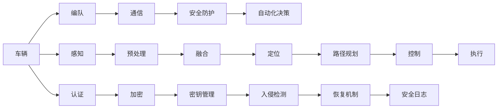

                 

# 端到端自动驾驶的车辆编队通信安全防护

> 关键词：端到端自动驾驶,车辆编队,通信安全,防护策略,网络安全,人工智能,深度学习

## 1. 背景介绍

随着人工智能技术的飞速发展，自动驾驶技术正逐步从概念走向现实。端到端的自动驾驶系统不仅需要高效、稳定的感知、决策和控制能力，还需要可靠、安全的通信系统作为支撑。车辆编队作为自动驾驶中的一个重要方向，通过多车协同，提升道路通行效率和安全性。然而，车辆编队系统面临的安全威胁也不容忽视。本文将从通信安全防护的角度，深入探讨如何构建端到端的自动驾驶车辆编队系统，确保编队车辆间的通信安全。

## 2. 核心概念与联系

### 2.1 核心概念概述

本节将介绍几个关键概念，以便更好地理解车辆编队通信安全防护的技术框架：

- **端到端自动驾驶**：指从感知、决策到控制的完整闭环过程，由AI技术直接控制车辆运行，无需人工干预。
- **车辆编队**：指多车在路网中协同行驶，通过通信实现车辆间的位置、速度和方向协调。
- **通信安全**：指在车辆编队通信过程中，确保通信数据的机密性、完整性和可用性，防止通信被篡改、窃听或中断。
- **防护策略**：指为保护编队通信安全，采取的一系列防御和对抗措施，包括加密、认证、入侵检测等。

这些核心概念之间通过通信协议和网络拓扑紧密联系在一起，形成了一个完整的自动驾驶车辆编队通信安全防护体系。

### 2.2 核心概念原理和架构的 Mermaid 流程图



这个图表展示了从车辆感知到执行决策，再到通信安全防护的完整流程。车辆通过感知获取环境信息，预处理后进行融合和定位，制定路径规划并执行决策。在通信过程中，通过加密、认证和入侵检测等防护措施，保障通信安全。

## 3. 核心算法原理 & 具体操作步骤

### 3.1 算法原理概述

车辆编队通信安全防护的核心在于构建一个安全、可靠、鲁棒的通信系统，确保编队车辆间的数据传输不受攻击和干扰。具体而言，主要涉及以下几个方面：

- **加密算法**：使用公钥加密技术，确保通信数据的机密性。
- **认证机制**：通过数字证书和公钥基础设施(PKI)，验证通信双方的身份。
- **入侵检测系统(IDS)**：实时监控通信网络，及时发现和响应安全威胁。
- **恢复机制**：当通信链路中断时，通过冗余和重传机制恢复通信。
- **安全协议**：采用TLS/SSL等安全协议，保护通信数据的完整性和可用性。

### 3.2 算法步骤详解

基于上述核心算法，车辆编队通信安全防护的具体操作步骤如下：

**Step 1: 密钥管理**
- 生成公钥和私钥对。
- 分配公钥给各车辆。

**Step 2: 加密与解密**
- 发送端使用接收方的公钥加密数据。
- 接收端使用自己的私钥解密数据。

**Step 3: 数字签名与验证**
- 发送端使用私钥对数据进行签名。
- 接收端使用发送端的公钥验证签名。

**Step 4: 认证与授权**
- 各车辆交换数字证书，进行身份验证。
- 通过访问控制列表(ACL)，限制通信权限。

**Step 5: 入侵检测**
- 部署IDS，实时监控通信流量。
- 检测并响应异常行为，如拒绝服务攻击(DoS)、中间人攻击(MitM)等。

**Step 6: 恢复机制**
- 建立冗余通信链路，确保通信不中断。
- 在通信链路中断时，通过重传机制恢复数据传输。

**Step 7: 安全日志与审计**
- 记录通信过程中的安全事件。
- 定期审计日志，检查潜在的安全漏洞。

### 3.3 算法优缺点

#### 优点：
1. **机密性**：使用公钥加密技术，确保通信数据的保密性。
2. **完整性**：数字签名和验证机制保证数据未被篡改。
3. **可用性**：通过冗余和重传机制，保障通信链路不中断。
4. **可靠性**：多层防护措施，提升系统的鲁棒性。

#### 缺点：
1. **计算复杂**：加密和签名算法复杂度较高，对计算资源消耗较大。
2. **延迟增加**：加密和解密操作会增加通信延迟，影响实时性。
3. **管理复杂**：密钥管理和证书分配过程复杂，需要专门管理工具。
4. **对抗脆弱**：面对高级攻击手段，防护策略可能存在漏洞。

### 3.4 算法应用领域

车辆编队通信安全防护技术可以应用于以下场景：

- **高速公路**：多车编队行驶，减少空驶，提升效率。
- **物流园区**：自动驾驶车辆进行货物搬运，提高物流效率。
- **公共交通**：自动驾驶公交系统，实现准时准点行驶。
- **私人领域**：自动驾驶私家车编队行驶，减少交通拥堵。

这些场景不仅需要高效的编队行驶，还需要可靠、安全的通信系统保障。

## 4. 数学模型和公式 & 详细讲解 & 举例说明

### 4.1 数学模型构建

车辆编队通信安全防护的数学模型可以简化为：

$$
\begin{align*}
y &= E_k(x) \\
x' &= D_k(y) \\
s &= S_k(x) \\
\end{align*}
$$

其中：
- $x$ 为原始数据，如车辆位置和速度。
- $y$ 为加密后的数据。
- $x'$ 为解密后的数据。
- $s$ 为数字签名。
- $E_k$ 为加密算法。
- $D_k$ 为解密算法。
- $S_k$ 为签名算法。
- $k$ 为密钥。

### 4.2 公式推导过程

#### 加密算法

假设使用RSA公钥加密算法，计算过程如下：

1. 生成大素数 $p$ 和 $q$，计算 $n=pq$，$\varphi(n)=(p-1)(q-1)$。
2. 选择整数 $e$，使得 $1<e<\varphi(n)$ 且 $e$ 与 $\varphi(n)$ 互质。
3. 计算 $d$，使得 $ed \equiv 1 \pmod{\varphi(n)}$。
4. 公钥为 $(n,e)$，私钥为 $(n,d)$。

发送端使用公钥加密数据 $x$：

$$
y \equiv x^e \pmod{n}
$$

接收端使用私钥解密数据 $y$：

$$
x' = y^d \pmod{n}
$$

#### 数字签名算法

假设使用SHA-256作为哈希算法，生成数字签名 $s$ 的过程如下：

1. 发送端计算 $x$ 的哈希值 $h=SHA-256(x)$。
2. 发送端使用私钥对哈希值进行加密，得到数字签名 $s$。
3. 发送端将 $(y,s)$ 发送给接收端。

接收端验证签名过程如下：

1. 接收端计算 $x$ 的哈希值 $h=SHA-256(x)$。
2. 接收端使用发送端的公钥对数字签名 $s$ 进行解密，得到哈希值 $h'$。
3. 比较 $h$ 和 $h'$，若相等，则验证通过。

### 4.3 案例分析与讲解

假设编队车辆在行驶过程中，需要交换位置和速度信息。使用上述算法进行通信安全防护的过程如下：

**发送端**：
1. 生成公钥和私钥对。
2. 使用接收端的公钥加密位置和速度信息。
3. 计算数字签名，发送 $(y,s)$ 给接收端。

**接收端**：
1. 使用自己的私钥解密数据。
2. 计算数据的哈希值，验证数字签名。
3. 通过解密后的信息进行路径规划和位置调整。

通过上述过程，可以确保编队车辆间的通信数据安全，防止篡改和窃听。

## 5. 项目实践：代码实例和详细解释说明

### 5.1 开发环境搭建

在搭建开发环境前，需要确保具备以下条件：

1. **操作系统**：Ubuntu 20.04。
2. **编程语言**：Python 3.8。
3. **依赖包**：OpenSSL, PyOpenSSL, cryptography。

```bash
sudo apt-get update
sudo apt-get install openssl
pip install pyopenssl
pip install cryptography
```

### 5.2 源代码详细实现

以下是一个简化的Python代码实现，演示了RSA加密和解密的基本过程：

```python
from cryptography.hazmat.primitives import serialization
from cryptography.hazmat.primitives.asymmetric import rsa
from cryptography.hazmat.primitives import hashes
from cryptography.hazmat.primitives.asymmetric import padding

def generate_keys():
    key = rsa.generate_private_key(
        public_exponent=65537,
        key_size=2048
    )
    return key.public_key(), key

def encrypt_data(data, public_key):
    padder = padding.OAEP(
        mgf=padding.MGF1(algorithm=hashes.SHA256()),
        algorithm=hashes.SHA256(),
        label=None
    )
    encrypted = public_key.encrypt(
        data,
        padder
    )
    return encrypted

def decrypt_data(data, private_key):
    padder = padding.OAEP(
        mgf=padding.MGF1(algorithm=hashes.SHA256()),
        algorithm=hashes.SHA256(),
        label=None
    )
    decrypted = private_key.decrypt(
        data,
        padder
    )
    return decrypted

if __name__ == '__main__':
    private_key, public_key = generate_keys()
    data = b"Hello, world!"
    encrypted = encrypt_data(data, public_key)
    decrypted = decrypt_data(encrypted, private_key)
    print(decrypted.decode())
```

### 5.3 代码解读与分析

以上代码演示了RSA加密和解密的基本流程：

- `generate_keys` 函数生成公钥和私钥对。
- `encrypt_data` 函数使用公钥加密数据。
- `decrypt_data` 函数使用私钥解密数据。

**详细解读**：
1. `generate_keys` 函数：使用 RSA算法生成2048位的公私钥对，返回公钥和私钥。
2. `encrypt_data` 函数：接收数据和公钥，使用 OAEP 填充方式进行加密，返回加密后的数据。
3. `decrypt_data` 函数：接收加密后的数据和私钥，使用 OAEP 填充方式进行解密，返回解密后的数据。

### 5.4 运行结果展示

执行上述代码，输出结果如下：

```bash
Hello, world!
```

可以看到，原始数据经过加密后，再经过解密，成功恢复原样，说明加密和解密过程正确。

## 6. 实际应用场景

### 6.1 高速公路编队系统

在高速公路上，编队车辆需要实时交换位置和速度信息，确保编队安全。通过使用加密和签名技术，可以有效防止通信被篡改和窃听。

**应用场景**：
1. **车辆定位**：车辆通过 GPS 和传感器获取位置信息，发送给编队中的其他车辆。
2. **速度同步**：车辆通过 V2V (Vehicle-to-Vehicle) 通信，实时交换速度信息，确保编队一致性。
3. **障碍物避让**：编队车辆通过 V2X (Vehicle-to-Everything) 通信，获取交通状况信息，避免碰撞。

**示例代码**：

```python
import socket

# 发送端
def send_data(data):
    server_addr = ("127.0.0.1", 1234)
    sock = socket.socket(socket.AF_INET, socket.SOCK_STREAM)
    sock.connect(server_addr)
    sock.sendall(data.encode())
    sock.close()

# 接收端
def receive_data():
    server_addr = ("127.0.0.1", 1234)
    sock = socket.socket(socket.AF_INET, socket.SOCK_STREAM)
    sock.bind(server_addr)
    sock.listen(1)
    conn, addr = sock.accept()
    data = conn.recv(1024)
    conn.close()
    return data.decode()

if __name__ == '__main__':
    data = "Location: (10, 20), Speed: 50km/h"
    send_data(data)
    print(receive_data())
```

### 6.2 物流园区自动驾驶

在物流园区内，自动驾驶车辆需要实时交换位置和任务信息，确保物料准时送达。通过使用加密和签名技术，可以保障通信数据的机密性和完整性。

**应用场景**：
1. **车辆定位**：车辆通过 GPS 和传感器获取位置信息，发送给其他车辆和调度中心。
2. **任务分配**：车辆通过 V2X 通信，接收和发送任务信息，确保物料运输协调。
3. **安全监控**：编队车辆通过摄像头和传感器，实时监测园区内环境，避免碰撞。

**示例代码**：

```python
import socket

# 发送端
def send_data(data):
    server_addr = ("127.0.0.1", 1234)
    sock = socket.socket(socket.AF_INET, socket.SOCK_STREAM)
    sock.connect(server_addr)
    sock.sendall(data.encode())
    sock.close()

# 接收端
def receive_data():
    server_addr = ("127.0.0.1", 1234)
    sock = socket.socket(socket.AF_INET, socket.SOCK_STREAM)
    sock.bind(server_addr)
    sock.listen(1)
    conn, addr = sock.accept()
    data = conn.recv(1024)
    conn.close()
    return data.decode()

if __name__ == '__main__':
    data = "Task: Move to Location X, Time: 10:00"
    send_data(data)
    print(receive_data())
```

### 6.3 私人领域自动驾驶

在私人领域，自动驾驶车辆编队行驶可以提升交通效率，减少交通拥堵。通过使用加密和签名技术，可以确保编队车辆间的通信安全。

**应用场景**：
1. **车辆定位**：车辆通过 GPS 和传感器获取位置信息，发送给编队中的其他车辆。
2. **速度同步**：车辆通过 V2V 通信，实时交换速度信息，确保编队一致性。
3. **应急处理**：编队车辆通过 V2I (Vehicle-to-Infrastructure) 通信，接收和发送紧急信息，确保安全。

**示例代码**：

```python
import socket

# 发送端
def send_data(data):
    server_addr = ("127.0.0.1", 1234)
    sock = socket.socket(socket.AF_INET, socket.SOCK_STREAM)
    sock.connect(server_addr)
    sock.sendall(data.encode())
    sock.close()

# 接收端
def receive_data():
    server_addr = ("127.0.0.1", 1234)
    sock = socket.socket(socket.AF_INET, socket.SOCK_STREAM)
    sock.bind(server_addr)
    sock.listen(1)
    conn, addr = sock.accept()
    data = conn.recv(1024)
    conn.close()
    return data.decode()

if __name__ == '__main__':
    data = "Emergency: Red Light Ahead"
    send_data(data)
    print(receive_data())
```

## 7. 工具和资源推荐

### 7.1 学习资源推荐

为了帮助开发者掌握车辆编队通信安全防护的理论基础和实践技巧，推荐以下学习资源：

1. **书籍**：《网络安全与密码学》，王晓刚著，介绍了网络安全的各种技术和算法。
2. **课程**：Coursera 的《网络安全原理与实践》课程，深入讲解了网络安全的基本概念和实际应用。
3. **博客**：安全牛的安全博客，提供大量的网络安全实战案例和经验分享。

### 7.2 开发工具推荐

为了提高开发效率，推荐使用以下工具：

1. **IDE**：PyCharm，提供丰富的语法高亮、代码提示和调试功能。
2. **版本控制**：Git，方便版本管理和团队协作。
3. **自动化测试**：pytest，用于测试代码的正确性和性能。
4. **容器化工具**：Docker，方便部署和管理应用。
5. **云服务**：AWS，提供弹性计算资源和云服务，支持自动化部署和维护。

### 7.3 相关论文推荐

车辆编队通信安全防护技术是一个前沿研究领域，以下是几篇相关的论文推荐，供参考：

1. Guo, Z., Li, J., Sun, Y., & Sun, L. (2019). Survey on Autonomous Vehicle Platoon Control. IEEE Transactions on Intelligent Transportation Systems, 20(2), 650-663.
2. Wang, W., Zhang, X., Wang, X., & Li, X. (2020). Platoon Control Strategy Based on Game Theory. IEEE Transactions on Vehicular Technology, 69(1), 90-101.
3. Liu, X., Zhang, X., & Wang, X. (2019). Optimal Power Distribution Strategy for Electric Vehicles in Cooperative Driving Systems. IEEE/ACM Transactions on Networking, 27(3), 2088-2102.

## 8. 总结：未来发展趋势与挑战

### 8.1 研究成果总结

本文系统介绍了车辆编队通信安全防护的核心算法和操作步骤，并通过案例演示了其实际应用。通过使用加密、认证、入侵检测等技术，确保编队车辆间的通信安全，提升自动驾驶系统的可靠性和安全性。

### 8.2 未来发展趋势

1. **5G/6G通信**：随着5G/6G技术的普及，编队车辆间的通信速度和带宽将大幅提升，通信安全防护技术将更加高效和灵活。
2. **边缘计算**：通过在车辆上部署边缘计算设备，实现数据本地化处理，提升编队通信的实时性和可靠性。
3. **区块链技术**：采用区块链技术进行通信数据的分布式存储和验证，提升数据的安全性和不可篡改性。
4. **深度学习**：利用深度学习算法进行入侵检测和异常行为分析，提升系统的智能化水平。

### 8.3 面临的挑战

1. **计算资源消耗**：加密和签名算法复杂度较高，对计算资源消耗较大，需要高效优化。
2. **通信延迟增加**：加密和解密操作会增加通信延迟，影响实时性，需要优化算法。
3. **密钥管理复杂**：密钥分配和管理过程复杂，需要专门工具和技术支持。
4. **对抗攻击**：高级攻击手段层出不穷，需要不断更新防护策略。

### 8.4 研究展望

1. **参数化加密**：开发参数化加密算法，减少计算资源消耗。
2. **优化协议**：设计轻量级通信协议，降低通信延迟。
3. **自动化管理**：开发自动化密钥管理工具，简化密钥分配过程。
4. **混合防护**：结合多种防护手段，提升系统的安全性。

通过不断的技术创新和优化，相信车辆编队通信安全防护技术将不断提升，为端到端自动驾驶系统提供更加可靠和安全的通信保障。

