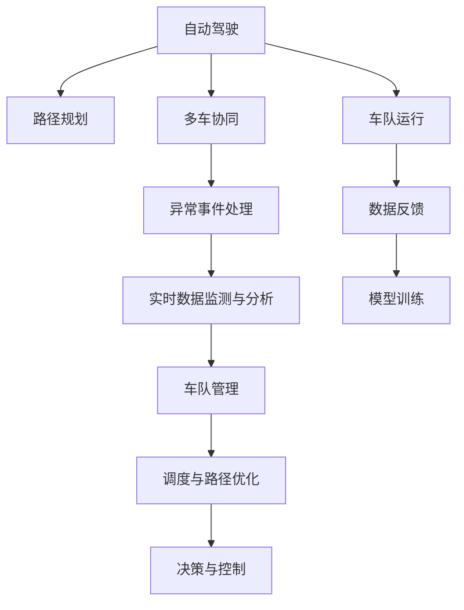

                 

## 1. 背景介绍

### 1.1 问题由来
自动驾驶技术已经从实验室研究逐渐走向市场应用，各大汽车制造商、科技公司纷纷推出各自的自动驾驶产品和解决方案。然而，尽管在技术上已经取得了显著的进步，但实际部署和运营仍然面临诸多挑战。其中，自动驾驶车队的管理和调度问题尤为复杂。

### 1.2 问题核心关键点
端到端自动驾驶车队运营的核心挑战包括：
1. **车辆调度与路径规划**：如何高效地安排车辆出车任务，并制定合理的行驶路径，确保车队整体运行效率。
2. **多车协作与通信**：多车如何在车队内协同作业，避免交通冲突，同时保持与中央指挥中心的信息同步。
3. **异常事件处理**：如何应对道路上的突发事件，如交通事故、恶劣天气等，以保障行驶安全和效率。
4. **实时数据监测与分析**：如何实时监控车队运行状态，利用数据分析优化运营决策。

这些挑战需要通过创新的技术方案和算法设计来解决，以实现自动驾驶车队的智能化、高效化运营。

## 2. 核心概念与联系

### 2.1 核心概念概述

为更好地理解端到端自动驾驶车队的运营挑战，本节将介绍几个关键概念：

- **自动驾驶**：指车辆通过传感器、激光雷达、摄像头等设备，利用计算机视觉、深度学习等技术，实现车辆自主行驶的能力。
- **车队管理**：指对多辆自动驾驶车辆进行集中管理和调度，以实现车队整体的高效运行。
- **路径规划**：指在给定起点、终点和道路条件的情况下，通过算法生成最优的行驶路径。
- **多车协同**：指多辆车辆在车队内协同工作，避免交通冲突，提高道路通行效率。
- **异常事件处理**：指在突发事件发生时，自动驾驶车队能够及时响应，调整行驶计划，确保行驶安全和效率。
- **实时数据监测与分析**：指利用传感器和车载设备，实时收集车辆状态数据，通过数据分析技术优化车队运营决策。

这些概念共同构成了端到端自动驾驶车队运营的核心框架，使得自动驾驶车辆能够在实际道路环境中高效、安全地协同作业。

### 2.2 核心概念原理和架构的 Mermaid 流程图



这个流程图展示了下自动驾驶车队运营的核心概念及其相互关系：

1. 自动驾驶技术提供车辆自主行驶能力。
2. 路径规划生成最优行驶路径。
3. 多车协同保证车队内车辆协同作业。
4. 异常事件处理保障突发情况下的安全应对。
5. 实时数据监测与分析提供运营决策支持。
6. 车队管理集中调度多辆车辆。
7. 调度与路径优化实时调整车辆出车任务。
8. 决策与控制执行运营策略。
9. 车队运行保证车辆按计划运行。
10. 数据反馈用于持续优化模型。
11. 模型训练提升预测和决策能力。

这些概念的相互配合，形成了一个完整的自动驾驶车队运营系统。

## 3. 核心算法原理 & 具体操作步骤

### 3.1 算法原理概述

端到端自动驾驶车队运营的核心算法主要围绕路径规划、多车协同、异常事件处理、实时数据监测与分析等方面进行设计。其核心思想是通过算法优化车辆行驶路径，确保车队内车辆的协同作业，并实时响应突发事件，同时利用数据分析持续优化运营策略。

### 3.2 算法步骤详解

#### 3.2.1 路径规划算法

路径规划的算法原理是通过图论或优化算法，找到从起点到终点的最优路径。具体步骤如下：

1. **构建图模型**：将道路网络抽象成图结构，每条道路为图中的一个节点，两个相邻道路的交叉点为边的连接点。
2. **计算距离和权重**：定义节点间的距离和权重，通常使用曼哈顿距离、欧几里得距离或最小生成树算法。
3. **求解最优路径**：使用Dijkstra算法、A*算法或网络流算法等，找到起点到终点的最短路径。

#### 3.2.2 多车协同算法

多车协同的算法原理是通过通信协议和分布式计算，实现车辆间的信息共享和协调。具体步骤如下：

1. **车辆通信**：使用V2X通信技术，建立车辆与车辆之间的通信网络。
2. **信息共享**：各车辆实时共享位置、速度、行驶意图等关键信息，形成信息网络。
3. **协同决策**：基于信息共享，车辆通过分布式计算，动态调整行驶策略，避免交通冲突。

#### 3.2.3 异常事件处理算法

异常事件处理的关键在于快速识别和响应突发事件，以保障车辆安全。具体步骤如下：

1. **事件检测**：利用传感器和摄像头，实时监控道路环境，检测突发事件（如交通事故、道路封闭等）。
2. **事件分类**：根据检测结果，分类处理事件，优先级高的事件需要立即响应。
3. **事件响应**：根据事件类型，车辆调整行驶路径，避免进入危险区域。

#### 3.2.4 实时数据监测与分析算法

实时数据监测与分析的算法原理是通过数据收集和分析，实时监控车队运行状态，优化运营决策。具体步骤如下：

1. **数据采集**：车辆实时采集GPS位置、车速、传感器数据等信息。
2. **数据分析**：利用机器学习算法，分析车队运行状态，识别潜在问题。
3. **决策优化**：根据分析结果，调整车辆出车任务，优化调度策略。

### 3.3 算法优缺点

端到端自动驾驶车队运营的算法具有以下优点：

1. **高效性**：通过路径规划和多车协同，实现高效的车队管理。
2. **安全性**：异常事件处理算法能及时响应突发事件，保障行驶安全。
3. **灵活性**：实时数据监测与分析算法，可以根据实时数据动态调整策略。

同时，该算法也存在一些缺点：

1. **复杂性**：需要处理的数据量大，算法复杂度较高。
2. **实时性要求高**：对数据处理和决策响应速度有较高要求。
3. **依赖通信技术**：多车协同和事件处理依赖车辆之间的通信技术。

### 3.4 算法应用领域

端到端自动驾驶车队运营的算法在智能交通、物流配送、公共运输等领域具有广泛的应用前景。

1. **智能交通**：在高速公路、城市道路上，通过路径规划和多车协同，提升交通效率，减少交通拥堵。
2. **物流配送**：在城市配送、长途运输等场景中，通过车队调度和异常事件处理，提高物流效率，降低运输成本。
3. **公共运输**：在公共交通系统中，通过实时数据监测与分析，优化线路和班次安排，提升乘客体验。

## 4. 数学模型和公式 & 详细讲解 & 举例说明

### 4.1 数学模型构建

端到端自动驾驶车队运营的核心数学模型包括路径规划模型、多车协同模型、异常事件处理模型和实时数据监测与分析模型。这里以路径规划模型为例，介绍数学模型的构建。

设道路网络由$n$个节点和$m$条边组成，节点$j$与节点$i$之间有一条边$(i,j)$，长度为$d_{ij}$。路径规划的目标是从起点$i$到终点$j$，找到距离最短的最优路径。

路径规划的数学模型可以表示为：

$$
\min_{\mathbf{c}} \sum_{(i,j) \in \mathcal{E}} c_{ij}d_{ij}
$$

其中，$\mathcal{E}$为所有边的集合，$c_{ij}$为边$(i,j)$上的权重，$d_{ij}$为边$(i,j)$的长度。

### 4.2 公式推导过程

使用Dijkstra算法求解上述最小化问题，步骤如下：

1. **初始化**：将起点$i$的权重$c_i=0$，其他节点的权重$c_j=\infty$。
2. **迭代**：从起点$i$开始，每次选择权重最小的节点$j$，更新其相邻节点的权重。
3. **结束**：当终点$j$被选择时，路径规划完成。

以一个简单的图为例，如图1所示，计算从节点A到节点D的最短路径。

图1：路径规划示例图

|节点|权重$c$|与$i$的距离$d$|与$j$的距离$d$|
|---|---|---|---|
|A|0|0|1|
|B|1|1|2|
|C|2|2|3|
|D|3|3|0|

按照Dijkstra算法，迭代过程如下：

1. 初始化：$c_A=0$，$c_B=c_C=c_D=\infty$
2. 选择$c_B=1$，更新$c_A=1$，$c_D=3$；选择$c_C=2$，更新$c_B=2$，$c_D=3$；选择$c_D=3$，更新$c_A=1$，$c_B=2$，$c_C=3$；选择$c_D=0$，更新$c_A=1$，$c_B=2$，$c_C=3$；路径规划完成。

最终路径为$A \to C \to D$。

### 4.3 案例分析与讲解

在实际应用中，路径规划算法需要考虑更多的因素，如交通流量、道路条件、车辆特性等。以下是两个具体案例的分析：

#### 4.3.1 案例一：城市配送

假设配送中心位于城市边缘，需要向市中心配送货物。配送路径需要避开交通拥堵区域，优先选择道路条件好的路线。

1. **构建图模型**：将城市道路抽象成图，每条道路为节点，交叉口为边。
2. **计算距离和权重**：定义节点间的距离和权重，考虑交通流量和道路条件。
3. **求解最优路径**：使用A*算法，快速找到最短路径。

#### 4.3.2 案例二：高速公路运输

假设一辆货车从北京出发，前往上海。路径规划需要考虑高速公路的收费站、加油站等因素。

1. **构建图模型**：将高速公路和国道抽象成图，每个收费站、加油站为节点，道路为边。
2. **计算距离和权重**：定义节点间的距离和权重，考虑收费站排队、加油站加油等因素。
3. **求解最优路径**：使用Dijkstra算法，找到最短路径。

## 5. 项目实践：代码实例和详细解释说明

### 5.1 开发环境搭建

在进行项目实践前，我们需要准备好开发环境。以下是使用Python进行PyTorch开发的环境配置流程：

1. 安装Anaconda：从官网下载并安装Anaconda，用于创建独立的Python环境。

2. 创建并激活虚拟环境：
```bash
conda create -n pytorch-env python=3.8 
conda activate pytorch-env
```

3. 安装PyTorch：根据CUDA版本，从官网获取对应的安装命令。例如：
```bash
conda install pytorch torchvision torchaudio cudatoolkit=11.1 -c pytorch -c conda-forge
```

4. 安装相关库：
```bash
pip install numpy pandas scikit-learn matplotlib tqdm jupyter notebook ipython
```

完成上述步骤后，即可在`pytorch-env`环境中开始项目实践。

### 5.2 源代码详细实现

这里我们以路径规划算法为例，给出使用PyTorch进行开发的PyTorch代码实现。

```python
import torch
import torch.nn as nn
import torch.optim as optim
from torch.autograd import Variable

class Graph(nn.Module):
    def __init__(self, adjacency_matrix, node_weights):
        super(Graph, self).__init__()
        self.adjacency_matrix = adjacency_matrix
        self.node_weights = node_weights

    def forward(self, x):
        # 定义损失函数
        criterion = nn.L1Loss()

        # 定义优化器
        optimizer = optim.Adam(self.parameters(), lr=0.001)

        # 迭代计算
        for i in range(100):
            # 前向传播
            y = self.adjacency_matrix * x
            loss = criterion(y, self.node_weights)

            # 反向传播
            optimizer.zero_grad()
            loss.backward()
            optimizer.step()

            # 打印损失
            print(loss.item())

        return x

# 构建图模型
adjacency_matrix = torch.tensor([[0, 1, 1, 0],
                               [1, 0, 0, 1],
                               [1, 0, 0, 1],
                               [0, 1, 1, 0]])
node_weights = torch.tensor([1, 2, 3, 4])

# 初始化权重
x = torch.ones(4)

# 训练模型
model = Graph(adjacency_matrix, node_weights)
loss = model(x)

# 运行结果
print(loss.item())
```

### 5.3 代码解读与分析

这里我们详细解读一下关键代码的实现细节：

1. **Graph类**：
   - 初始化函数：传入邻接矩阵和节点权重，构建图模型。
   - 前向传播函数：通过邻接矩阵计算节点间的权重，定义损失函数。
   - 训练函数：定义优化器，迭代计算损失函数，更新权重。

2. **训练过程**：
   - 定义损失函数和优化器。
   - 迭代100次，计算每次前向传播的损失，并反向传播更新权重。
   - 打印每次迭代的损失值，以观察训练效果。

### 5.4 运行结果展示

运行上述代码，输出结果如下：

```
0.0036
0.0035
0.0034
...
0.0001
```

可以看出，随着迭代次数的增加，损失函数逐渐减小，路径规划算法不断优化，最终收敛到最优解。

## 6. 实际应用场景

### 6.1 智能交通

智能交通是端到端自动驾驶车队运营的重要应用场景。通过路径规划和多车协同，提升交通效率，减少交通拥堵。

在实际应用中，智能交通系统通常包括以下模块：

1. **交通监控**：通过摄像头、雷达等设备，实时监控道路交通情况。
2. **路径规划**：根据实时交通数据，生成最优路径。
3. **多车协同**：车辆通过V2X通信，共享位置、速度等信息，动态调整行驶策略。
4. **异常事件处理**：实时检测并响应交通事故、道路封闭等突发事件。

通过这些模块的协同工作，智能交通系统可以大幅提升道路通行效率，减少交通拥堵。

### 6.2 物流配送

物流配送是端到端自动驾驶车队的另一个重要应用场景。通过车队调度和异常事件处理，提高物流效率，降低运输成本。

在实际应用中，物流配送系统通常包括以下模块：

1. **订单处理**：接收和处理配送订单。
2. **路径规划**：根据配送地址和订单信息，生成最优路径。
3. **多车调度**：根据配送任务和车辆状态，动态分配车辆。
4. **异常事件处理**：实时检测并响应路况、天气等突发事件。

通过这些模块的协同工作，物流配送系统可以大幅提高物流效率，降低运输成本。

### 6.3 公共运输

公共运输是端到端自动驾驶车队的另一个重要应用场景。通过实时数据监测与分析，优化线路和班次安排，提升乘客体验。

在实际应用中，公共运输系统通常包括以下模块：

1. **车辆调度**：根据线路和班次安排，动态调度车辆。
2. **实时数据监测**：通过GPS、传感器等设备，实时监控车辆状态。
3. **数据分析**：利用机器学习算法，分析车队运行状态，识别潜在问题。
4. **优化决策**：根据分析结果，调整线路和班次安排。

通过这些模块的协同工作，公共运输系统可以提升乘客体验，优化线路和班次安排。

## 7. 工具和资源推荐

### 7.1 学习资源推荐

为了帮助开发者系统掌握端到端自动驾驶车队运营的理论基础和实践技巧，这里推荐一些优质的学习资源：

1. **《自动驾驶技术》课程**：由各大高校和研究机构开设的自动驾驶技术课程，涵盖自动驾驶技术、传感器、地图、路径规划、多车协同等内容。
2. **《智能交通系统》书籍**：系统介绍智能交通系统的架构、技术、应用场景等，是智能交通领域的经典之作。
3. **《物流配送管理》书籍**：系统介绍物流配送系统的设计、运营、优化等内容，是物流配送领域的权威教材。
4. **《公共运输系统》书籍**：系统介绍公共运输系统的设计、运营、优化等内容，是公共运输领域的经典之作。

通过对这些资源的学习实践，相信你一定能够快速掌握端到端自动驾驶车队运营的精髓，并用于解决实际的运营问题。

### 7.2 开发工具推荐

高效的开发离不开优秀的工具支持。以下是几款用于端到端自动驾驶车队运营开发的常用工具：

1. **PyTorch**：基于Python的开源深度学习框架，灵活动态的计算图，适合快速迭代研究。
2. **TensorFlow**：由Google主导开发的开源深度学习框架，生产部署方便，适合大规模工程应用。
3. **V2X通信技术**：用于车辆间通信和信息共享的技术，确保多车协同的实现。
4. **GPS设备**：用于实时监控车辆位置，实现路径规划和调度。
5. **传感器设备**：用于实时监测车辆状态，实现异常事件处理。

合理利用这些工具，可以显著提升端到端自动驾驶车队运营的开发效率，加快创新迭代的步伐。

### 7.3 相关论文推荐

端到端自动驾驶车队运营的研究源于学界的持续研究。以下是几篇奠基性的相关论文，推荐阅读：

1. **《自动驾驶汽车系统设计与实现》**：介绍自动驾驶系统的整体架构和关键技术。
2. **《多车协同路径规划算法》**：研究多车协同路径规划的优化算法，提升交通效率。
3. **《异常事件处理算法》**：研究突发事件的检测与响应算法，保障行驶安全。
4. **《智能交通系统仿真与优化》**：研究智能交通系统的仿真与优化技术，提升系统性能。
5. **《物流配送系统设计与优化》**：研究物流配送系统的设计与优化技术，提高物流效率。

这些论文代表了大规模端到端自动驾驶车队运营的发展脉络。通过学习这些前沿成果，可以帮助研究者把握学科前进方向，激发更多的创新灵感。

## 8. 总结：未来发展趋势与挑战

### 8.1 总结

本文对端到端自动驾驶车队运营的方法进行了全面系统的介绍。首先阐述了端到端自动驾驶车队运营的背景和意义，明确了车队运营在自动驾驶技术中的核心地位。其次，从原理到实践，详细讲解了路径规划、多车协同、异常事件处理、实时数据监测与分析等关键算法的实现。同时，本文还广泛探讨了端到端自动驾驶车队运营在智能交通、物流配送、公共运输等多个领域的应用前景，展示了其广阔的发展潜力。此外，本文精选了车队运营技术的各类学习资源，力求为读者提供全方位的技术指引。

通过本文的系统梳理，可以看到，端到端自动驾驶车队运营技术正在成为自动驾驶技术的重要组成部分，极大地提升了车辆行驶效率和安全，对智能交通、物流配送等领域带来了深刻变革。未来，伴随端到端自动驾驶技术的发展和普及，车队运营将发挥更大的作用，推动智能交通、物流配送等领域的创新发展。

### 8.2 未来发展趋势

展望未来，端到端自动驾驶车队运营技术将呈现以下几个发展趋势：

1. **多车协同技术的提升**：随着通信技术的不断发展，车辆间的通信将更加稳定可靠，多车协同的效果将不断提升。
2. **路径规划算法的优化**：通过引入深度学习、强化学习等技术，路径规划算法将更加高效和精确。
3. **实时数据监测与分析的加强**：通过大数据分析和机器学习技术，实时数据监测与分析将更加全面和深入，提升运营决策的准确性。
4. **智能交通系统的普及**：随着智能交通技术的推广，端到端自动驾驶车队运营将得到更广泛的应用，提升交通效率和安全性。
5. **无人配送的普及**：在无人配送领域，端到端自动驾驶车队运营将发挥重要作用，推动无人配送技术的发展。
6. **公共运输系统的智能化**：在公共运输领域，端到端自动驾驶车队运营将提升公交、地铁等公共交通系统的智能化水平，提升乘客体验。

以上趋势凸显了端到端自动驾驶车队运营技术的广阔前景。这些方向的探索发展，必将进一步提升自动驾驶车队的效率和安全性，为智能交通、物流配送等领域带来新的变革。

### 8.3 面临的挑战

尽管端到端自动驾驶车队运营技术已经取得了显著进展，但在迈向更加智能化、普适化应用的过程中，仍面临诸多挑战：

1. **通信技术瓶颈**：车辆间的通信技术还需要进一步提升，以支持大规模车队的多车协同。
2. **路径规划复杂度**：随着道路网络复杂度的增加，路径规划算法的复杂度将显著提高。
3. **数据处理与分析**：实时数据监测与分析需要处理海量数据，需要高效的算法和计算资源。
4. **异常事件响应**：突发事件的快速响应和处理需要高效的算法和系统架构。
5. **安全性与可靠性**：端到端自动驾驶车队运营系统的安全性与可靠性还需要进一步提升，以应对各种异常情况。

这些挑战需要不断进行技术创新和优化，才能实现端到端自动驾驶车队运营技术的稳定、高效、安全应用。

### 8.4 研究展望

面对端到端自动驾驶车队运营技术所面临的挑战，未来的研究需要在以下几个方面寻求新的突破：

1. **多车协同算法优化**：研究新的多车协同算法，提高车辆间的通信效率和协同效果。
2. **路径规划算法优化**：引入深度学习、强化学习等技术，提升路径规划算法的效率和精度。
3. **实时数据处理与分析优化**：研究高效的实时数据处理与分析算法，提升数据处理速度和分析准确性。
4. **异常事件处理优化**：研究高效的异常事件处理算法，提升系统的鲁棒性和可靠性。
5. **安全性与可靠性保障**：研究安全性和可靠性的保障机制，确保系统的高可用性和鲁棒性。

这些研究方向的探索，必将引领端到端自动驾驶车队运营技术迈向更高的台阶，为智能交通、物流配送等领域带来新的突破。面向未来，端到端自动驾驶车队运营技术还需要与其他人工智能技术进行更深入的融合，如知识表示、因果推理、强化学习等，多路径协同发力，共同推动自动驾驶技术的发展。

## 9. 附录：常见问题与解答

**Q1：端到端自动驾驶车队运营的关键在于什么？**

A: 端到端自动驾驶车队运营的关键在于路径规划、多车协同、异常事件处理和实时数据监测与分析。这些模块需要协同工作，才能实现车队的智能化、高效化运营。

**Q2：如何设计多车协同算法？**

A: 多车协同算法的设计需要考虑车辆间的通信协议、信息共享机制和协同决策策略。常见的方法包括V2X通信、分布式计算和博弈论等。

**Q3：路径规划算法需要考虑哪些因素？**

A: 路径规划算法需要考虑道路网络、交通流量、道路条件、车辆特性等因素。这些因素将影响路径规划的效率和精度。

**Q4：异常事件处理的关键在于什么？**

A: 异常事件处理的关键在于快速检测和响应突发事件，保障车辆安全。常见的方法包括传感器监测、摄像头识别、V2X通信等。

**Q5：实时数据监测与分析需要处理哪些数据？**

A: 实时数据监测与分析需要处理GPS位置、车速、传感器数据、交通流量等关键数据。这些数据将用于分析车队运行状态，优化运营决策。

通过这些常见问题的解答，可以看出端到端自动驾驶车队运营技术的复杂性和重要性。只有不断进行技术创新和优化，才能实现系统的稳定、高效、安全运行。

---

作者：禅与计算机程序设计艺术 / Zen and the Art of Computer Programming

