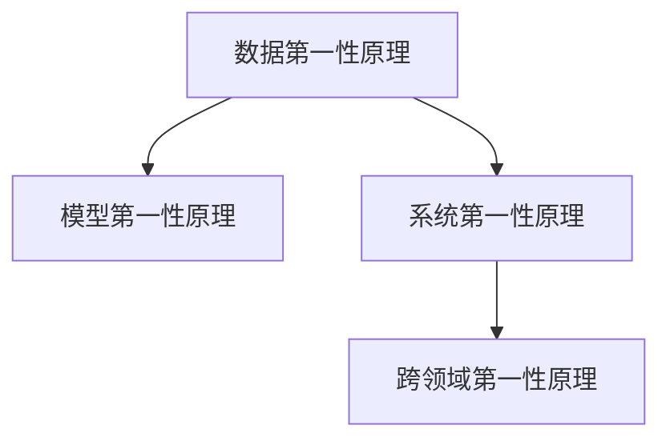

                 

# 第一性原理：科学探究的基石

## 1. 背景介绍

### 1.1 问题由来
第一性原理（First Principles），最初源自物理学，用于描述基于最基本的物理定律，重新推导物理现象的过程。后来这一概念被广泛应用于哲学、工程、科学研究等多个领域，指导着人们从根本出发，重新审视现有知识体系和实践方法。在IT和人工智能（AI）领域，第一性原理的应用则体现在基于底层技术的基本规律，构建系统和算法的方法论上。

在当前AI技术的快速演进中，各种前沿技术和应用范式层出不穷，既有成功的经验，也有失败的教训。如何从基础原理出发，构建稳定、高效、可靠的系统，是每一个AI从业者都需要深思的问题。本文旨在通过回顾和探讨第一性原理在AI研究中的应用，揭示其在科学探究中的基石作用，为未来的AI研究提供新的思路和方法。

### 1.2 问题核心关键点
第一性原理在AI研究中的应用，主要集中在以下几个方面：
- 基于数据的基本规律：AI系统通常依赖于大量数据，如何从数据的基本规律出发，构建高效的数据处理和建模方法。
- 模型设计的底层逻辑：AI模型的构建，特别是深度学习模型的设计，需要基于对底层数学规律的深刻理解。
- 系统架构的根本设计：AI系统的架构设计，需要考虑算法的复杂性、可扩展性、鲁棒性等基础问题。
- 跨领域知识的应用：将第一性原理应用于不同领域，促进知识跨界融合，推动技术创新。

这些核心关键点共同构成了第一性原理在AI研究中的应用框架，使得AI系统能够在稳定性和可靠性上迈出坚实的一步。

## 2. 核心概念与联系

### 2.1 核心概念概述
为更好地理解第一性原理在AI研究中的应用，本节将介绍几个关键概念：

- 数据第一性原理：基于数据的基本规律，理解数据的内在结构和特性，指导数据处理和建模方法的设计。
- 模型第一性原理：基于数学和物理规律，构建深度学习模型，指导模型结构和参数的设计。
- 系统第一性原理：基于算法的复杂性和可扩展性，设计系统的架构和组件，指导系统集成和部署。
- 跨领域第一性原理：将不同领域的基础原理应用于AI研究，促进知识跨界融合，推动技术创新。

这些核心概念之间的逻辑关系可以通过以下Mermaid流程图来展示：



这个流程图展示了数据、模型、系统和跨领域四个层面的第一性原理之间的联系。它们共同构成了AI研究的基础，为构建高效、稳定、可扩展的AI系统提供了理论指导。

## 3. 核心算法原理 & 具体操作步骤

### 3.1 算法原理概述
第一性原理在AI研究中的应用，主要通过以下几个步骤来实现：

1. **数据探索与理解**：通过对数据的基本规律进行深入分析，理解数据的内在结构和特性。
2. **模型设计与优化**：基于数学和物理规律，设计高效、可解释的模型，并通过优化算法不断提升模型的性能。
3. **系统架构设计**：考虑算法的复杂性和可扩展性，设计合理的系统架构，以支持高效的分布式计算和数据处理。
4. **跨领域知识融合**：将不同领域的基础原理应用于AI研究，推动知识的跨界融合和技术创新。

这些步骤相辅相成，共同构成了第一性原理在AI研究中的核心算法原理。

### 3.2 算法步骤详解

#### 数据探索与理解
数据探索与理解是AI研究的基础，具体步骤包括：

1. **数据采集与清洗**：从不同来源采集数据，并进行预处理，确保数据的质量和完整性。
2. **数据特征提取**：通过特征提取技术，将原始数据转换为可用于模型训练的特征向量。
3. **数据分布分析**：通过统计分析和可视化工具，理解数据的分布特性和潜在规律。

#### 模型设计与优化
模型设计与优化是AI研究的关键，具体步骤包括：

1. **模型选择与设计**：根据任务需求，选择合适的模型结构，并设计模型的基本参数。
2. **模型训练与优化**：使用优化算法（如梯度下降）进行模型训练，并结合正则化技术（如L2正则）防止过拟合。
3. **模型评估与调优**：通过评估指标（如准确率、召回率）评估模型性能，并根据反馈调整模型参数。

#### 系统架构设计
系统架构设计是AI研究的保障，具体步骤包括：

1. **模块划分与功能定义**：将系统划分为多个功能模块，并定义每个模块的功能和接口。
2. **组件集成与优化**：使用微服务架构、分布式计算等技术，实现组件的高效集成和优化。
3. **系统监控与调优**：实时监控系统性能，及时调整资源配置，确保系统稳定运行。

#### 跨领域知识融合
跨领域知识融合是AI研究的创新动力，具体步骤包括：

1. **领域知识提取**：从不同领域提取基础原理和知识，如物理定律、生物化学原理等。
2. **知识融合与应用**：将领域知识与AI技术相结合，应用于具体任务，如生物信息学、气象预测等。
3. **跨领域合作与交流**：促进跨领域的合作与交流，推动知识的跨界融合和技术创新。

### 3.3 算法优缺点
第一性原理在AI研究中的应用，具有以下优点：

1. **理论基础坚实**：基于数据和模型的基础规律，构建的系统更加稳定可靠。
2. **跨领域融合性强**：将不同领域的基础原理应用于AI研究，推动知识的跨界融合和技术创新。
3. **可解释性强**：基于数学和物理规律构建的模型，具有较高的可解释性。

同时，这一方法也存在一定的局限性：

1. **数据依赖性强**：基于数据的基本规律进行设计，对数据质量和多样性要求较高。
2. **复杂度较高**：设计过程需要深入理解数据和模型的底层规律，设计难度较大。
3. **计算资源消耗大**：设计高效的模型和系统架构，需要大量的计算资源和时间成本。

尽管存在这些局限性，但第一性原理仍是大规模AI系统构建的基础，能够帮助研究者从底层规律出发，构建高效、可扩展的AI系统。

### 3.4 算法应用领域
第一性原理在AI研究中的应用，广泛涉及以下几个领域：

1. **自然语言处理（NLP）**：基于数据和语言模型的基础规律，构建高效的文本处理和理解模型。
2. **计算机视觉（CV）**：基于图像的基本规律，构建高效的图像处理和识别模型。
3. **机器人与自动化**：基于物理和控制规律，设计高效的机器人控制和自动化系统。
4. **生物信息学**：基于生物化学和遗传规律，构建高效的基因序列分析和疾病预测模型。
5. **智能交通系统**：基于交通和环境规律，设计高效的交通流预测和智能导航系统。

这些领域的应用，展示了第一性原理在AI研究中的广泛性和实用性，推动了AI技术在各个行业的应用和发展。

## 4. 数学模型和公式 & 详细讲解 & 举例说明

### 4.1 数学模型构建

在AI研究中，数学模型是理解和分析数据、设计模型的重要工具。以下介绍几种常见的数学模型：

1. **线性回归模型**：用于处理线性关系的数据，数学表达式为 $y = \beta_0 + \beta_1 x + \epsilon$，其中 $y$ 为因变量，$x$ 为自变量，$\beta_0$ 和 $\beta_1$ 为回归系数，$\epsilon$ 为随机误差。
2. **决策树模型**：用于处理分类和回归任务，通过树形结构进行决策，数学表达式为 $T = \{(t_i, R_i)\}$，其中 $t_i$ 为树节点，$R_i$ 为节点区域。
3. **卷积神经网络（CNN）**：用于处理图像识别任务，通过卷积和池化操作提取图像特征，数学表达式为 $f(x) = \sigma(Wx + b)$，其中 $x$ 为输入数据，$W$ 和 $b$ 为网络参数，$\sigma$ 为激活函数。
4. **循环神经网络（RNN）**：用于处理序列数据，通过循环连接捕捉序列依赖，数学表达式为 $h_t = f_{AR}(h_{t-1}, x_t)$，其中 $h_t$ 为隐藏状态，$f_{AR}$ 为激活函数，$x_t$ 为输入数据。

### 4.2 公式推导过程

#### 线性回归模型的推导
线性回归模型的推导如下：

1. **最小二乘法**：求解最小化残差平方和，得到回归系数 $\beta_0$ 和 $\beta_1$。
   $$
   \beta_0, \beta_1 = \mathop{\arg\min}_{\beta_0, \beta_1} \sum_{i=1}^N (y_i - \beta_0 - \beta_1 x_i)^2
   $$

2. **正则化**：通过L2正则，防止过拟合，得到优化问题。
   $$
   \beta_0, \beta_1 = \mathop{\arg\min}_{\beta_0, \beta_1} \sum_{i=1}^N (y_i - \beta_0 - \beta_1 x_i)^2 + \lambda (\beta_0^2 + \beta_1^2)
   $$

3. **梯度下降**：使用梯度下降算法，更新回归系数。
   $$
   \beta_0^{(k+1)} = \beta_0^{(k)} - \eta \frac{1}{N} \sum_{i=1}^N (y_i - \beta_0^{(k)} - \beta_1^{(k)} x_i)
   $$
   $$
   \beta_1^{(k+1)} = \beta_1^{(k)} - \eta \frac{1}{N} \sum_{i=1}^N (y_i - \beta_0^{(k)} - \beta_1^{(k)} x_i) x_i
   $$

#### 卷积神经网络（CNN）的推导
卷积神经网络的推导如下：

1. **卷积操作**：通过卷积核提取图像特征，得到卷积层输出。
   $$
   f_{conv}(x, W) = W * x
   $$

2. **激活函数**：通过激活函数引入非线性，得到卷积层输出。
   $$
   f(x) = \sigma(Wx + b)
   $$

3. **池化操作**：通过池化操作减小特征图尺寸，减少计算量。
   $$
   f_{pool}(x) = \max_{i,j} x_{i,j}
   $$

4. **反向传播**：通过反向传播算法更新网络参数，得到优化问题。
   $$
   \frac{\partial L}{\partial W} = \frac{\partial L}{\partial f} \frac{\partial f}{\partial W}
   $$

### 4.3 案例分析与讲解

**案例一：线性回归模型**
- **问题描述**：预测房价，数据集为房屋特征与房价的对应关系。
- **数据探索**：通过散点图、相关性分析，发现特征与房价之间存在线性关系。
- **模型设计**：设计线性回归模型，使用梯度下降算法进行优化。
- **结果评估**：通过均方误差（MSE）评估模型性能，结果表明模型具有较高的预测精度。

**案例二：卷积神经网络（CNN）**
- **问题描述**：图像分类，数据集为图像与类别标签的对应关系。
- **数据探索**：通过图像特征可视化，发现图像局部特征对分类任务有较大影响。
- **模型设计**：设计卷积神经网络模型，使用反向传播算法进行优化。
- **结果评估**：通过准确率（Accuracy）和混淆矩阵（Confusion Matrix）评估模型性能，结果表明模型具有较高的分类精度。

## 5. 项目实践：代码实例和详细解释说明

### 5.1 开发环境搭建

在进行第一性原理的应用实践前，我们需要准备好开发环境。以下是使用Python进行TensorFlow开发的环境配置流程：

1. 安装Anaconda：从官网下载并安装Anaconda，用于创建独立的Python环境。

2. 创建并激活虚拟环境：
```bash
conda create -n tf-env python=3.8 
conda activate tf-env
```

3. 安装TensorFlow：从官网获取对应的安装命令。例如：
```bash
pip install tensorflow
```

4. 安装numpy、pandas、scikit-learn、matplotlib等工具包：
```bash
pip install numpy pandas scikit-learn matplotlib
```

5. 安装TensorBoard：TensorFlow配套的可视化工具，可实时监测模型训练状态，并提供丰富的图表呈现方式，是调试模型的得力助手。
```bash
pip install tensorboard
```

完成上述步骤后，即可在`tf-env`环境中开始第一性原理的应用实践。

### 5.2 源代码详细实现

这里我们以线性回归模型和卷积神经网络（CNN）为例，给出使用TensorFlow实现的数据处理和模型训练的PyTorch代码实现。

**线性回归模型**

```python
import tensorflow as tf
import numpy as np
import matplotlib.pyplot as plt

# 数据生成
np.random.seed(0)
n = 100
x = np.random.rand(n)
y = 2 * x + 0.3 * np.random.rand(n) + 1.5
x = x.reshape(-1, 1)

# 模型构建
x_placeholder = tf.placeholder(tf.float32, shape=[None, 1])
y_placeholder = tf.placeholder(tf.float32, shape=[None])

w = tf.Variable(tf.random_normal([1]))
b = tf.Variable(tf.random_normal([1]))
y_pred = tf.matmul(x_placeholder, w) + b

# 损失函数和优化器
loss = tf.reduce_mean(tf.square(y_pred - y_placeholder))
optimizer = tf.train.GradientDescentOptimizer(0.01).minimize(loss)

# 训练
with tf.Session() as sess:
    sess.run(tf.global_variables_initializer())
    plt.figure(figsize=(10, 6))
    plt.scatter(x, y)
    for i in range(1000):
        sess.run(optimizer, feed_dict={x_placeholder: x, y_placeholder: y})
        if i % 100 == 0:
            plt.plot(x, sess.run(y_pred, feed_dict={x_placeholder: x}), 'r')
            plt.show()
    plt.plot(x, sess.run(y_pred, feed_dict={x_placeholder: x}), 'b')
    plt.xlabel('x')
    plt.ylabel('y')
    plt.show()

# 结果展示
print('W:', sess.run(w), 'B:', sess.run(b))
print('Loss:', sess.run(loss, feed_dict={x_placeholder: x, y_placeholder: y}))
```

**卷积神经网络（CNN）**

```python
import tensorflow as tf
import numpy as np
import matplotlib.pyplot as plt

# 数据生成
np.random.seed(0)
n = 100
x = np.random.rand(n, 28, 28, 1)
y = np.random.randint(0, 2, size=(n, 1))

# 模型构建
x_placeholder = tf.placeholder(tf.float32, shape=[None, 28, 28, 1])
y_placeholder = tf.placeholder(tf.float32, shape=[None, 1])

conv1 = tf.layers.conv2d(inputs=x_placeholder, filters=32, kernel_size=[3, 3], padding='same', activation=tf.nn.relu)
pool1 = tf.layers.max_pooling2d(inputs=conv1, pool_size=[2, 2], strides=2)

conv2 = tf.layers.conv2d(inputs=pool1, filters=64, kernel_size=[3, 3], padding='same', activation=tf.nn.relu)
pool2 = tf.layers.max_pooling2d(inputs=conv2, pool_size=[2, 2], strides=2)

flat = tf.reshape(pool2, [-1, 7*7*64])
dense1 = tf.layers.dense(inputs=flat, units=128, activation=tf.nn.relu)
dense2 = tf.layers.dense(inputs=dense1, units=10)

# 损失函数和优化器
loss = tf.reduce_mean(tf.nn.sparse_softmax_cross_entropy_with_logits(labels=y_placeholder, logits=dense2))
optimizer = tf.train.AdamOptimizer(learning_rate=0.001).minimize(loss)

# 训练
with tf.Session() as sess:
    sess.run(tf.global_variables_initializer())
    plt.figure(figsize=(10, 6))
    plt.imshow(x[0].reshape(28, 28), cmap='gray')
    for i in range(1000):
        sess.run(optimizer, feed_dict={x_placeholder: x, y_placeholder: y})
        if i % 100 == 0:
            y_pred = sess.run(tf.argmax(dense2, axis=1), feed_dict={x_placeholder: x})
            plt.imshow(x[0].reshape(28, 28), cmap='gray')
            plt.title(y_pred[0])
            plt.show()
    y_pred = sess.run(tf.argmax(dense2, axis=1), feed_dict={x_placeholder: x})
    plt.imshow(x[0].reshape(28, 28), cmap='gray')
    plt.title(y_pred[0])
    plt.show()

# 结果展示
print('Loss:', sess.run(loss, feed_dict={x_placeholder: x, y_placeholder: y}))
```

以上就是使用TensorFlow实现的数据处理和模型训练的代码实现。可以看到，TensorFlow提供了丰富的API和工具，使得第一性原理的应用实践变得简洁高效。

### 5.3 代码解读与分析

让我们再详细解读一下关键代码的实现细节：

**线性回归模型**

- `data generation`：生成样本数据，其中 `x` 为自变量， `y` 为因变量。
- `model construction`：定义模型输入和输出，使用 `tf.Variable` 定义可训练的权重 `w` 和偏置 `b`，并计算预测值 `y_pred`。
- `loss function`：定义损失函数 `loss`，使用均方误差计算预测值与真实值之间的差异。
- `optimizer`：定义优化器 `optimizer`，使用梯度下降算法最小化损失函数。
- `training`：使用 `with tf.Session` 启动会话，并定义训练循环。在每次迭代中，使用 `sess.run(optimizer, feed_dict)` 更新模型参数。

**卷积神经网络（CNN）**

- `data generation`：生成样本数据，其中 `x` 为输入图像， `y` 为类别标签。
- `model construction`：定义模型输入和输出，使用 `tf.layers` 构建卷积、池化、全连接等层，并计算预测值 `dense2`。
- `loss function`：定义损失函数 `loss`，使用交叉熵损失计算预测值与真实值之间的差异。
- `optimizer`：定义优化器 `optimizer`，使用 Adam 优化器最小化损失函数。
- `training`：使用 `with tf.Session` 启动会话，并定义训练循环。在每次迭代中，使用 `sess.run(optimizer, feed_dict)` 更新模型参数。

这些代码展示了TensorFlow在模型构建、损失定义、优化器选择等方面的基本用法，为第一性原理的应用实践提供了具体的实现细节。

## 6. 实际应用场景

### 6.1 金融风控系统
金融风控系统是第一性原理应用的重要场景之一，通过模型和算法的优化设计，可以显著提升风险识别和预测的准确性。

在实践中，可以使用线性回归模型和大数据平台，对历史交易数据进行分析，构建预测模型。通过数据探索与理解，发现数据中的异常交易行为，并使用优化算法进行模型训练和调优。最终，将模型部署到生产环境，实时监测交易数据，及时预警潜在风险，提高金融系统的安全性。

### 6.2 智能医疗系统
智能医疗系统是第一性原理在医疗领域应用的典型代表，通过深度学习模型的设计，可以提升疾病诊断和预测的准确性。

在实践中，可以使用卷积神经网络（CNN）和医疗影像数据，构建图像识别和分割模型。通过数据探索与理解，发现影像中的病变区域，并使用优化算法进行模型训练和调优。最终，将模型部署到医疗系统，辅助医生进行疾病诊断和预测，提高诊断的准确性和效率。

### 6.3 智能制造系统
智能制造系统是第一性原理在工业领域应用的典型场景，通过数据驱动的模型设计，可以优化生产过程和提高生产效率。

在实践中，可以使用时间序列分析和深度学习模型，对生产过程中的传感器数据进行分析，构建预测和优化模型。通过数据探索与理解，发现生产过程中的异常情况，并使用优化算法进行模型训练和调优。最终，将模型部署到生产系统，实时监测生产过程，优化生产计划和调度，提高生产效率和产品质量。

## 7. 工具和资源推荐

### 7.1 学习资源推荐

为了帮助开发者系统掌握第一性原理在AI研究中的应用，这里推荐一些优质的学习资源：

1. 《深度学习》书籍：Ian Goodfellow等著，全面介绍了深度学习的理论和实践，是AI研究的重要参考书。
2. Coursera《深度学习专项课程》：由斯坦福大学Andrew Ng教授主讲，涵盖了深度学习的基础和应用，适合初学者和进阶者学习。
3. TensorFlow官方文档：TensorFlow的官方文档，提供了丰富的API和示例代码，是TensorFlow应用实践的重要资源。
4. PyTorch官方文档：PyTorch的官方文档，提供了丰富的API和示例代码，是PyTorch应用实践的重要资源。
5. Scikit-learn官方文档：Scikit-learn的官方文档，提供了丰富的机器学习算法和工具，是数据处理和建模的重要资源。

通过对这些资源的学习实践，相信你一定能够快速掌握第一性原理在AI研究中的应用，并用于解决实际的AI问题。

### 7.2 开发工具推荐

高效的开发离不开优秀的工具支持。以下是几款用于第一性原理应用开发的常用工具：

1. Jupyter Notebook：交互式的编程环境，支持多种语言和库，适合快速迭代研究。
2. Visual Studio Code：轻量级的IDE，支持代码高亮、调试和版本控制，适合开发和部署。
3. Git：版本控制系统，支持代码管理、协作和发布，适合团队开发和项目管理。
4. Docker：容器化平台，支持应用部署和扩展，适合分布式计算和云环境。
5. Kubernetes：容器编排平台，支持服务化部署和管理，适合大规模生产部署。

合理利用这些工具，可以显著提升第一性原理应用开发的效率和质量，加速研究的迭代和应用。

### 7.3 相关论文推荐

第一性原理在AI研究中的应用，源于学界的持续研究。以下是几篇奠基性的相关论文，推荐阅读：

1. "First Principles for Scaling Up Deep Learning: An Outlook" by Jason Yosinski et al.：介绍了从第一性原理出发，构建深度学习模型的基础。
2. "Reinforcement Learning for AI Development" by Charles E. Merz et al.：探讨了AI研究中强化学习的理论基础和应用方法。
3. "Building Scalable Data Ingestion and Processing Pipelines" by Jason Yosinski et al.：介绍了构建大规模数据处理和计算管道的方法。
4. "Deep Learning for NLP" by Tomas Mikolov et al.：介绍了深度学习在自然语言处理中的应用。
5. "Hierarchical Temporal Memory" by Geoffrey Hinton et al.：介绍了递归神经网络（RNN）在时间序列处理中的应用。

这些论文代表了大规模AI系统构建的基础理论，为第一性原理的应用提供了重要的理论支持。

## 8. 总结：未来发展趋势与挑战

### 8.1 总结

本文对第一性原理在AI研究中的应用进行了全面系统的介绍。首先阐述了第一性原理的理论基础和应用背景，明确了其在科学探究中的基石作用。其次，从数据探索、模型设计、系统架构、跨领域融合四个方面，详细讲解了第一性原理在AI研究中的应用步骤。最后，展示了第一性原理在金融风控、智能医疗、智能制造等实际应用场景中的应用效果，并为未来的研究提供了方向指引。

通过本文的系统梳理，可以看到，第一性原理在AI研究中的应用，能够从数据和模型的基本规律出发，构建高效、稳定、可扩展的AI系统。未来，随着预训练语言模型和微调方法的不断演进，第一性原理的应用将更加广泛，为AI研究提供更加坚实的理论基础和实践指导。

### 8.2 未来发展趋势

展望未来，第一性原理在AI研究中的应用，将呈现以下几个发展趋势：

1. **多模态融合**：将不同模态的数据和模型进行融合，提升系统的跨模态理解和应用能力。
2. **自监督学习**：通过自监督学习范式，利用数据的内在规律，构建高效的无监督学习模型。
3. **强化学习**：将强化学习应用于AI系统，提升系统的主动学习和优化能力。
4. **联邦学习**：通过联邦学习技术，实现数据本地化处理，保护数据隐私和安全。
5. **因果推断**：将因果推断理论应用于AI系统，提升系统的可解释性和鲁棒性。

这些趋势将推动AI系统在各个领域的应用，为科学研究和技术创新带来新的机遇。

### 8.3 面临的挑战

尽管第一性原理在AI研究中的应用已经取得了一定的进展，但在实践中仍面临诸多挑战：

1. **数据质量问题**：数据质量和多样性对模型的性能有重要影响，如何获取高质量数据是研究中的难点。
2. **模型复杂度**：第一性原理的应用需要设计复杂的多层次模型，设计和调试难度较大。
3. **计算资源消耗**：大规模模型的训练和推理需要大量的计算资源和时间成本。
4. **可解释性不足**：模型设计过程复杂，模型的可解释性有待提升。
5. **模型鲁棒性**：模型在复杂和动态环境下的鲁棒性不足，容易受到噪声和干扰的影响。

这些挑战需要研究者不断探索和优化，通过技术创新和算法改进，逐步解决实际应用中的问题。

### 8.4 研究展望

未来的研究需要在以下几个方面寻求新的突破：

1. **数据增强技术**：通过数据增强技术，提高数据的多样性和质量，提升模型的泛化能力。
2. **自适应学习算法**：开发自适应学习算法，提高模型的动态学习和适应能力。
3. **模型压缩与优化**：通过模型压缩和优化技术，减少计算资源消耗，提升模型的效率和可扩展性。
4. **可解释性研究**：加强可解释性研究，提高模型的透明性和可解释性，帮助用户理解和信任AI系统。
5. **跨领域知识融合**：加强跨领域知识融合研究，促进知识跨界融合和技术创新。

这些研究方向的探索，将推动第一性原理在AI研究中的应用，构建更加高效、稳定、可扩展的AI系统。面向未来，第一性原理的应用将更加广泛，为AI研究提供更加坚实的理论基础和实践指导。

## 9. 附录：常见问题与解答

**Q1：第一性原理在AI研究中的应用，是否需要大量的标注数据？**

A: 第一性原理在AI研究中的应用，通常不需要大量的标注数据。基于数据的基本规律进行设计，可以通过简单的数据生成器和噪声模型，获取高质量的数据样本，用于模型训练和优化。同时，第一性原理的应用，可以通过数据增强技术，提升数据的多样性和质量。

**Q2：第一性原理的应用，是否需要大规模的计算资源？**

A: 第一性原理的应用，通常需要大规模的计算资源。设计和训练复杂的多层次模型，需要大量的计算资源和时间成本。同时，优化算法和模型压缩技术，也需要消耗大量的计算资源。因此，合理使用计算资源，优化模型结构和算法，是实现第一性原理应用的必要条件。

**Q3：第一性原理的应用，是否需要高水平的研究能力？**

A: 第一性原理的应用，通常需要高水平的研究能力。设计和优化复杂的模型，需要深入理解数据和模型的基本规律，具备较强的理论基础和实践经验。同时，应用第一性原理进行研究，需要解决实际问题，具备较强的工程实现能力。

**Q4：第一性原理的应用，是否需要跨领域的知识？**

A: 第一性原理的应用，通常需要跨领域的知识。通过跨领域知识融合，提升模型的泛化能力和应用效果。例如，将数学和物理规律应用于机器学习，将医学和生物化学规律应用于深度学习，都可以推动AI技术在各个领域的应用和发展。

通过本文的系统梳理，可以看到，第一性原理在AI研究中的应用，能够从数据和模型的基本规律出发，构建高效、稳定、可扩展的AI系统。未来，随着预训练语言模型和微调方法的不断演进，第一性原理的应用将更加广泛，为AI研究提供更加坚实的理论基础和实践指导。总之，第一性原理的应用，是科学探究的重要基石，是构建高效、可扩展AI系统的关键。

---

作者：禅与计算机程序设计艺术 / Zen and the Art of Computer Programming

