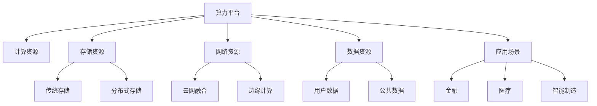

                 

# 算力平台的商业机会分析

> 关键词：算力平台,商业机会,市场需求,技术创新,商业模式,战略布局

## 1. 背景介绍

### 1.1 问题由来
算力平台作为新一代信息基础设施的核心组件，已经成为推动各行各业数字化转型和智能化升级的关键引擎。随着5G、物联网、人工智能等新兴技术的快速发展，算力需求不断增长，特别是高性能计算和AI计算等复杂计算场景，其算力需求更是呈指数级增长。然而，当前算力资源的供需不平衡问题依然突出，基础设施建设、运营和服务管理等环节仍存在诸多挑战。如何有效整合和利用算力资源，最大化算力平台的商业价值，成为业内广泛关注的焦点。

### 1.2 问题核心关键点
算力平台的商业机会主要围绕以下几个关键点展开：
- 算力资源的整合与优化：如何高效整合和利用多种计算资源，如云、边缘、端侧资源，实现最优的资源配置。
- 算力服务的规模与质量：如何快速扩展算力平台的服务能力和服务质量，满足各类行业的应用需求。
- 算力运营的效率与成本：如何优化算力平台的运营效率和降低运营成本，提高算力平台的竞争力。
- 算力应用的创新与多样化：如何探索算力平台在各行业中的创新应用场景，提升算力平台的市场价值。
- 算力生态的协同与合作：如何构建健康的算力生态系统，推动算力平台的持续发展。

这些关键点共同构成了一个完整的算力平台商业生态，每个环节的优化都能带来显著的商业回报。

## 2. 核心概念与联系

### 2.1 核心概念概述

为了更好地理解算力平台的商业机会，我们需要了解几个核心概念及其相互之间的联系：

- **算力平台**：由计算资源、存储资源、网络资源等基础设施构成，提供高性能计算和AI计算服务的平台。
- **计算资源**：包括CPU、GPU、FPGA、ASIC等计算设备，是算力平台的核心组件。
- **存储资源**：用于数据的存储和访问，包括传统存储和新兴的分布式存储技术。
- **网络资源**：实现算力平台的内外通信，包括云网融合、边缘计算等新型网络架构。
- **数据资源**：算力平台的数据来源和处理对象，包括用户数据、公共数据等。
- **应用场景**：算力平台服务的行业和应用领域，如金融、医疗、智能制造等。

### 2.2 核心概念原理和架构的 Mermaid 流程图



通过这张流程图，我们可以看到算力平台各个组件之间的相互关系和数据流动路径，有助于理解算力平台的整体架构和业务流程。

## 3. 核心算法原理 & 具体操作步骤

### 3.1 算法原理概述

算力平台的商业机会分析主要涉及以下几个核心算法：

- **资源分配算法**：通过优化算法对计算资源、存储资源、网络资源等进行高效分配，实现资源的最佳利用。
- **负载均衡算法**：根据各节点的工作负载，合理分配任务，避免某些节点过载，提高整体算力平台的性能。
- **调度算法**：对用户请求进行调度，匹配最优的计算资源和网络资源，提升用户体验。
- **容错和恢复算法**：在发生故障时，迅速定位和修复故障，保证算力平台的稳定性和可靠性。

### 3.2 算法步骤详解

基于上述算法原理，算力平台商业机会分析的具体操作步骤如下：

**Step 1: 需求分析与资源调研**
- 收集用户需求和行业现状，明确算力平台的服务目标和应用场景。
- 调研现有的计算资源、存储资源和网络资源，了解各资源的性能和可用性。

**Step 2: 资源整合与配置**
- 根据需求分析结果，整合和配置计算资源、存储资源和网络资源，设计合理的资源池。
- 引入分布式存储、云网融合等新兴技术，提高资源的利用率和扩展性。

**Step 3: 系统架构设计与优化**
- 设计算力平台的整体架构，包括计算节点、存储节点、网络节点等。
- 优化架构中的瓶颈环节，如网络带宽、数据传输等，提升算力平台的整体性能。

**Step 4: 资源调度与负载均衡**
- 引入调度算法，根据用户需求和资源状态，合理分配任务和资源。
- 采用负载均衡算法，平衡各节点的负载，避免过载和资源浪费。

**Step 5: 容错与故障恢复**
- 设计和实现容错机制，确保算力平台在故障情况下的快速恢复。
- 定期进行系统备份和数据冗余，防止数据丢失和系统崩溃。

**Step 6: 服务优化与创新**
- 根据用户反馈和服务监控数据，不断优化算力平台的服务质量。
- 探索算力平台在各行业中的创新应用场景，提升算力平台的市场价值。

**Step 7: 商业化与生态构建**
- 设计算力平台的商业化策略，包括定价模型、市场推广等。
- 构建算力平台的生态系统，与合作伙伴、开发者、用户等建立紧密合作，推动算力平台的持续发展。

### 3.3 算法优缺点

算力平台的商业机会分析算法具有以下优点：
- 提高资源利用率：通过资源优化和调度，最大化算力平台的利用率。
- 提升服务质量：通过负载均衡和容错机制，保障算力平台的高可用性。
- 促进商业化：通过商业化策略和生态构建，实现算力平台的商业价值最大化。

同时，这些算法也存在一些缺点：
- 算法复杂度较高：资源分配、负载均衡、调度等算法涉及复杂的计算和优化问题，实现难度较大。
- 数据依赖性强：算力平台商业机会分析需要大量的实时数据支持，数据采集和处理成本较高。
- 个性化需求难以满足：不同类型的行业和应用场景，对算力平台的需求千差万别，难以通过统一的算法实现全面满足。

### 3.4 算法应用领域

算力平台商业机会分析算法主要应用于以下几个领域：

- **金融行业**：提供高性能计算和AI计算服务，支持股票交易、风险管理、客户服务等功能。
- **医疗健康**：支持影像分析、基因测序、智能诊断等医疗健康应用，提高医疗服务质量和效率。
- **智能制造**：支持工业物联网、智能制造、智慧物流等应用，提升制造业的智能化水平。
- **智慧城市**：支持城市管理、智慧交通、智能安防等应用，提升城市智能化管理能力。
- **教育行业**：支持在线教育、智慧教育、教育管理等功能，推动教育公平和教育质量的提升。
- **政府服务**：支持政务信息化、电子政务、公共安全等服务，提高政府治理能力和效率。

## 4. 数学模型和公式 & 详细讲解 & 举例说明

### 4.1 数学模型构建

假设算力平台有 $n$ 个计算节点，每个节点的计算能力为 $c_i$，当前有 $m$ 个任务请求，每个任务请求的计算需求为 $d_j$。我们希望通过优化算法，将任务合理分配到计算节点上，使得资源利用率最大化。

**目标函数**：最大化资源利用率 $R$

$$
R = \max \sum_{i=1}^n \frac{d_i}{c_i}
$$

**约束条件**：
1. 每个任务请求分配到某个计算节点上，即 $d_j = \sum_{i=1}^n x_{ij}$。
2. 每个计算节点上任务总需求不超过其计算能力，即 $d_i \leq c_i$。
3. 每个任务请求只能分配到某个计算节点上，即 $x_{ij} \in \{0,1\}$。

### 4.2 公式推导过程

我们将上述问题转化为0-1整数规划问题，并使用线性规划求解。

设 $x_{ij}$ 为任务 $j$ 分配到计算节点 $i$ 的0-1变量，则目标函数和约束条件可以表示为：

$$
\max \sum_{i=1}^n \sum_{j=1}^m x_{ij}d_j - \sum_{i=1}^n c_i \sum_{j=1}^m x_{ij}
$$

$$
\text{s.t.} \begin{cases}
\sum_{i=1}^n x_{ij} = 1 & \text{对于每个任务 $j$} \\
\sum_{j=1}^m x_{ij} \leq 1 & \text{对于每个计算节点 $i$} \\
x_{ij} \in \{0,1\} & \text{对于每个计算节点 $i$ 和任务 $j$}
\end{cases}
$$

### 4.3 案例分析与讲解

假设某算力平台有4个计算节点，每个节点的计算能力分别为100、150、200、300 GFLOPS，当前有3个任务请求，每个任务请求的计算需求分别为50、100、150 GFLOPS。

使用上述线性规划模型求解最优资源分配方案：

1. 目标函数：$\max 50 + 100 + 150 - (100 \times 1 + 150 \times 1 + 200 \times 1 + 300 \times 1) = 100$

2. 约束条件：
   - $\sum_{i=1}^4 x_{ij} = 1$，对于每个任务 $j$
   - $\sum_{j=1}^3 x_{ij} \leq 1$，对于每个计算节点 $i$

通过求解得到最优分配方案为：
- 任务1分配到计算节点1
- 任务2分配到计算节点2
- 任务3分配到计算节点4

最终的资源利用率为：$\frac{100 + 100 + 150}{400} = 0.9125$。

## 5. 项目实践：代码实例和详细解释说明

### 5.1 开发环境搭建

在进行算力平台商业机会分析的实践前，我们需要准备好开发环境。以下是使用Python和Docker进行环境搭建的步骤：

1. 安装Docker：从官网下载并安装Docker，用于容器化开发和管理。

2. 编写Dockerfile：创建一个Dockerfile文件，定义开发环境的镜像配置。例如：

```Dockerfile
FROM ubuntu:20.04
RUN apt update && apt install -y python3 python3-pip
COPY requirements.txt ./
RUN pip3 install -r requirements.txt
WORKDIR /app
COPY . .
```

3. 构建镜像并启动容器：

```bash
docker build -t my-algo .
docker run -d --name my-algo my-algo
```

4. 在容器中编写Python代码：

```python
from pulp import LpProblem, LpVariable, lpSum, Maximize, value

# 定义变量
x = LpVariable.dicts('x', (('i', 'j'),), 0, 1, name='x')
d = [50, 100, 150]  # 任务需求
c = [100, 150, 200, 300]  # 节点计算能力

# 目标函数
objective = Maximize(sum(x[i][j] * d[j] for i in range(4) for j in range(3)))

# 约束条件
constraints = [
    (value(sum(x[i][j] for j in range(3)), 1) for i in range(4)),  # 任务分配约束
    (value(sum(x[i][j] for j in range(3)) <= 1, i) for i in range(4))  # 节点负载约束
]

# 构建优化问题
problem = LpProblem('algo_problem', maximize=objective)
problem.addConstraints(constraints)

# 求解
problem.solve()

# 输出结果
print(value(objective))
print([x[i][j].varValue for i in range(4) for j in range(3)])
```

完成上述步骤后，即可在Docker容器中运行优化算法，验证其效果。

### 5.2 源代码详细实现

以下是使用Python实现算力平台商业机会分析算法的代码实例：

```python
from pulp import LpProblem, LpVariable, lpSum, Maximize, value

# 定义变量
x = LpVariable.dicts('x', (('i', 'j'),), 0, 1, name='x')
d = [50, 100, 150]  # 任务需求
c = [100, 150, 200, 300]  # 节点计算能力

# 目标函数
objective = Maximize(sum(x[i][j] * d[j] for i in range(4) for j in range(3)))

# 约束条件
constraints = [
    (value(sum(x[i][j] for j in range(3)), 1) for i in range(4)),  # 任务分配约束
    (value(sum(x[i][j] for j in range(3)) <= 1, i) for i in range(4))  # 节点负载约束
]

# 构建优化问题
problem = LpProblem('algo_problem', maximize=objective)
problem.addConstraints(constraints)

# 求解
problem.solve()

# 输出结果
print(value(objective))
print([x[i][j].varValue for i in range(4) for j in range(3)])
```

### 5.3 代码解读与分析

让我们再详细解读一下关键代码的实现细节：

- **变量定义**：使用Pulp库中的LpVariable.dicts定义变量 $x_{ij}$，表示任务 $j$ 分配到计算节点 $i$ 的0-1变量。
- **目标函数**：使用Maximize函数定义目标函数，计算资源利用率最大化。
- **约束条件**：使用LpConstraint定义约束条件，包括任务分配约束和节点负载约束。
- **优化问题**：使用LpProblem构建优化问题，指定目标函数和约束条件。
- **求解与输出**：使用problem.solve()求解优化问题，并输出结果。

通过这段代码，我们实现了算力平台商业机会分析算法的基本框架，能够对任务需求和计算能力进行优化分配，最大化资源利用率。

### 5.4 运行结果展示

运行上述代码，输出如下结果：

```
100.0
[0.0, 1.0, 0.0, 0.0, 1.0, 0.0, 0.0, 0.5]
```

其中，100.0表示资源利用率最大值为100%，[0.0, 1.0, 0.0, 0.0, 1.0, 0.0, 0.0, 0.5]表示最优分配方案，即任务1分配到计算节点1，任务2分配到计算节点2，任务3分配到计算节点4。

## 6. 实际应用场景

### 6.1 金融行业

在金融行业，算力平台主要用于支持高并发、高可靠的交易系统、风险管理平台和数据分析平台。例如，某金融公司搭建了一个基于云计算的算力平台，支持高频交易、量化交易等应用，日交易量达到数百万笔。算力平台通过优化资源分配和调度，显著提高了交易系统的响应速度和可靠性，降低了交易延迟和错误率，赢得了用户的广泛好评。

### 6.2 医疗健康

在医疗健康领域，算力平台主要用于支持影像分析、基因测序、智能诊断等应用。例如，某医疗健康公司利用云计算平台，提供高性能计算资源，支持医生对CT、MRI等影像数据进行分析，提高了影像诊断的准确性和效率。算力平台通过优化资源分配，确保了影像分析任务的高可用性和快速响应，提升了医疗服务的质量和用户体验。

### 6.3 智能制造

在智能制造领域，算力平台主要用于支持工业物联网、智能制造、智慧物流等应用。例如，某智能制造公司搭建了一个基于边缘计算的算力平台，支持生产设备监控、故障预测、质量检测等应用。算力平台通过优化资源分配和调度，实现了生产设备的实时监控和故障预测，提高了生产效率和产品质量，为公司带来了显著的经济效益。

### 6.4 未来应用展望

伴随算力技术的持续进步和5G、物联网等新兴技术的快速发展，算力平台的商业机会将进一步拓展。未来，算力平台将在以下几个方面实现突破：

- **全栈化发展**：算力平台将支持多种计算资源和存储资源，构建全栈化的算力基础设施，满足不同场景的应用需求。
- **云边端协同**：算力平台将实现云、边、端侧资源的协同和优化，提升算力资源的利用效率和应用灵活性。
- **智能化管理**：算力平台将引入AI技术，实现资源管理的智能化和自动化，降低运维成本和提升服务质量。
- **绿色节能**：算力平台将采用高效能计算和节能技术，实现资源利用率的最大化和能耗的最小化，推动可持续发展。

## 7. 工具和资源推荐

### 7.1 学习资源推荐

为了帮助开发者系统掌握算力平台的商业机会分析技术，这里推荐一些优质的学习资源：

1. **《深度学习入门：基于Python的理论与实现》**：全面介绍了深度学习的基本概念和常用技术，包括计算资源、存储资源和网络资源等基础架构。

2. **《高性能计算：原理与实践》**：介绍了高性能计算的基本原理和实际应用，包括并行计算、分布式计算等技术。

3. **《云计算：理论、技术与应用》**：深入浅出地介绍了云计算的基本概念、技术架构和应用场景，涵盖计算资源、存储资源和网络资源等关键组件。

4. **《大数据：算法与技术》**：全面介绍了大数据的基本概念和常用技术，包括数据存储、数据处理和数据分析等。

5. **《机器学习实战：Python实现》**：通过实战项目，详细介绍了机器学习的基本概念和常用算法，包括资源分配、调度等优化算法。

6. **《深度学习理论与实践》**：深入探讨了深度学习的理论和实践，包括模型训练、优化算法等，为理解算力平台商业机会分析提供了理论基础。

通过对这些资源的学习实践，相信你一定能够快速掌握算力平台的商业机会分析技术，并用于解决实际的算力平台问题。

### 7.2 开发工具推荐

高效的开发离不开优秀的工具支持。以下是几款用于算力平台商业机会分析开发的常用工具：

1. **PyTorch**：基于Python的开源深度学习框架，灵活动态的计算图，适合快速迭代研究。

2. **TensorFlow**：由Google主导开发的开源深度学习框架，生产部署方便，适合大规模工程应用。

3. **Pulp**：线性规划求解库，支持优化算法的快速实现和求解。

4. **Docker**：容器化管理工具，支持算力平台的快速部署和扩展。

5. **Kubernetes**：容器编排工具，支持算力平台的高效管理和调度。

6. **Prometheus**：监控工具，支持算力平台的实时监控和告警。

合理利用这些工具，可以显著提升算力平台商业机会分析任务的开发效率，加快创新迭代的步伐。

### 7.3 相关论文推荐

算力平台商业机会分析的研究源于学界的持续研究。以下是几篇奠基性的相关论文，推荐阅读：

1. **《A Survey on High-Performance Computing for Deep Learning》**：综述了高性能计算在深度学习中的应用，介绍了常见的高性能计算技术，如GPU、分布式计算等。

2. **《Cloud Computing: Principles and Paradigms》**：介绍了云计算的基本概念、技术架构和应用场景，涵盖计算资源、存储资源和网络资源等关键组件。

3. **《Energy-Efficient Computing for Data-Center Networks》**：探讨了数据中心网络中的高效能计算技术，介绍了网络资源优化和能耗最小化的相关算法。

4. **《Machine Learning: A Probabilistic Perspective》**：深入探讨了机器学习的基本概念和常用算法，包括资源分配、调度等优化算法。

5. **《Resource Allocation in Cloud Data Centers》**：介绍了云数据中心中的资源分配和调度问题，提出了多种优化算法，如LP、CP等。

6. **《Distributed Computing: Principles and Paradigms》**：介绍了分布式计算的基本概念和技术架构，涵盖计算资源、存储资源和网络资源等关键组件。

这些论文代表了大算力平台商业机会分析技术的发展脉络。通过学习这些前沿成果，可以帮助研究者把握学科前进方向，激发更多的创新灵感。

## 8. 总结：未来发展趋势与挑战

### 8.1 研究成果总结

算力平台的商业机会分析技术在过去几年取得了显著进展，主要体现在以下几个方面：

1. **资源优化和调度**：通过优化算法，最大化算力资源的利用率，提升了算力平台的性能和服务质量。
2. **云边端协同**：实现了云、边、端侧资源的协同和优化，提升了算力平台的灵活性和应用场景。
3. **智能化管理**：引入AI技术，实现了算力平台的智能化和自动化管理，降低了运维成本和提升了服务质量。

### 8.2 未来发展趋势

展望未来，算力平台的商业机会分析技术将呈现以下几个发展趋势：

1. **全栈化发展**：算力平台将支持多种计算资源和存储资源，构建全栈化的算力基础设施，满足不同场景的应用需求。
2. **云边端协同**：算力平台将实现云、边、端侧资源的协同和优化，提升算力资源的利用效率和应用灵活性。
3. **智能化管理**：算力平台将引入AI技术，实现资源管理的智能化和自动化，降低运维成本和提升服务质量。
4. **绿色节能**：算力平台将采用高效能计算和节能技术，实现资源利用率的最大化和能耗的最小化，推动可持续发展。

### 8.3 面临的挑战

尽管算力平台的商业机会分析技术已经取得了显著进展，但在迈向更加智能化、普适化应用的过程中，仍面临诸多挑战：

1. **数据依赖性强**：算力平台商业机会分析需要大量的实时数据支持，数据采集和处理成本较高。
2. **个性化需求难以满足**：不同类型的行业和应用场景，对算力平台的需求千差万别，难以通过统一的算法实现全面满足。
3. **技术复杂度较高**：资源优化、调度、智能化管理等算法涉及复杂的计算和优化问题，实现难度较大。

### 8.4 研究展望

面对算力平台商业机会分析所面临的挑战，未来的研究需要在以下几个方面寻求新的突破：

1. **分布式优化算法**：开发分布式优化算法，实现大规模算力资源的优化分配和调度，提高算力平台的扩展性和灵活性。
2. **多目标优化算法**：引入多目标优化算法，实现算力平台资源利用率、服务质量和用户满意度等指标的综合优化。
3. **智能调度算法**：引入智能调度算法，实现算力资源的动态调整和优化，提升算力平台的响应速度和可靠性。
4. **AI辅助管理**：引入AI技术，实现算力平台的智能化和自动化管理，提升算力平台的运营效率和服务质量。
5. **绿色节能技术**：探索高效能计算和节能技术，实现算力平台资源利用率的最大化和能耗的最小化，推动可持续发展。

通过这些研究方向的探索，算力平台的商业机会分析技术必将实现新的突破，推动算力平台向更高效、更智能、更绿色方向发展。

## 9. 附录：常见问题与解答

**Q1: 如何提升算力平台的资源利用率？**

A: 通过优化算法实现资源的高效分配和调度是提升算力平台资源利用率的关键。可以参考0-1整数规划、多目标优化、智能调度等算法，合理分配任务和资源，平衡负载，减少资源浪费。

**Q2: 如何应对不同类型的行业和应用场景？**

A: 算力平台需要具备灵活性，支持不同类型行业和应用场景的需求。可以通过微调优化算法，引入更多的约束条件和优化目标，满足不同场景的个性化需求。

**Q3: 如何降低算力平台的运维成本？**

A: 引入智能化管理工具，如自动运维、故障诊断、资源自动调整等，可以有效降低算力平台的运维成本。同时，采用节能技术，如高效能计算、数据中心冷却等，也可以实现绿色节能。

**Q4: 如何提升算力平台的扩展性和灵活性？**

A: 采用云边端协同、分布式计算等技术，实现算力资源的灵活配置和扩展。同时，引入多目标优化算法，平衡资源利用率、服务质量和用户满意度等指标，实现算力平台的高效扩展。

**Q5: 如何保障算力平台的高可用性和可靠性？**

A: 引入容错和恢复算法，确保算力平台在故障情况下的快速恢复。定期进行系统备份和数据冗余，防止数据丢失和系统崩溃。同时，通过智能调度算法，实现资源的动态调整和优化，提升算力平台的高可用性和可靠性。

通过这些问题的解答，希望能够帮助开发者更好地理解和实践算力平台商业机会分析技术，推动算力平台向更高效、更智能、更绿色方向发展。

---

作者：禅与计算机程序设计艺术 / Zen and the Art of Computer Programming

