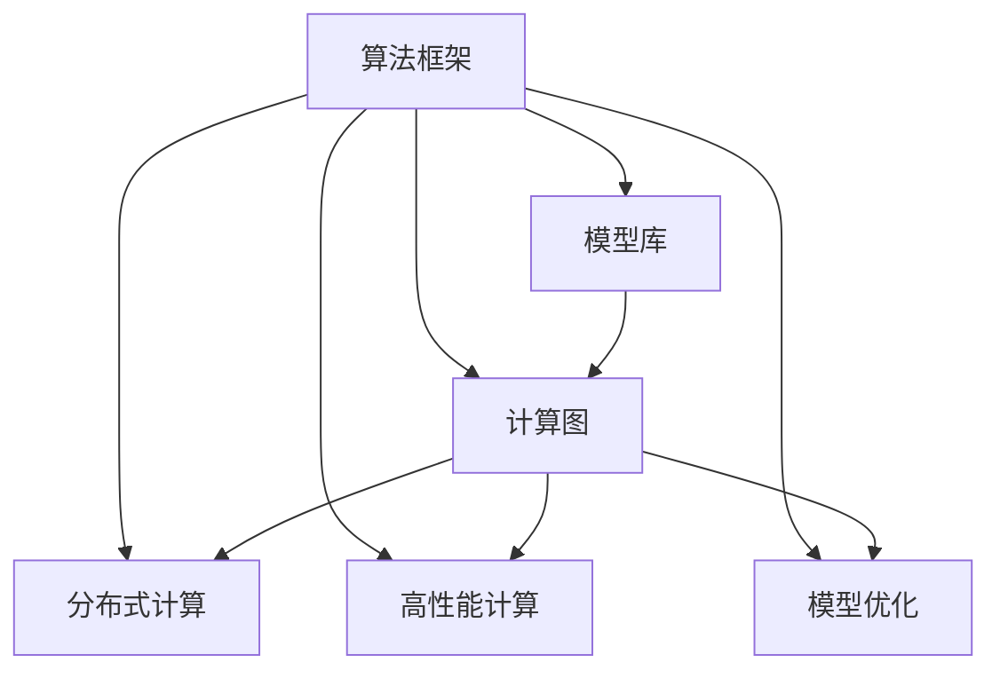

                 

# 算法框架：加速 AI 2.0 模型开发和训练

## 1. 背景介绍

### 1.1 问题由来
随着人工智能(AI)技术的迅猛发展，特别是AI 2.0时代的到来，算法框架在模型开发和训练过程中扮演了至关重要的角色。这些框架不仅提供了高效、可扩展的计算能力，还集成了先进的优化算法、丰富的模型库和强大的可视化工具，极大地方便了AI模型的开发和训练。然而，尽管已有大量开源框架可供选择，但框架之间的竞争日益激烈，开发者在选择和使用框架时仍面临着困惑和挑战。

### 1.2 问题核心关键点
本文聚焦于如何快速、高效地选择和使用算法框架，以加速AI 2.0模型开发和训练。具体来说，我们关注以下几个核心关键点：

- 如何选择最合适的算法框架？
- 如何优化算法框架的使用，提升开发和训练效率？
- 如何充分利用现有框架资源，实现高性能计算？
- 如何应对框架本身的技术限制和问题？

通过系统分析这些问题，本文将为开发者提供全方位的指导，帮助他们在复杂的AI 2.0模型开发和训练中做出最优选择，实现高效计算和资源利用。

## 2. 核心概念与联系

### 2.1 核心概念概述

为更好地理解如何加速AI 2.0模型开发和训练，本节将介绍几个密切相关的核心概念：

- 算法框架(Algorithm Framework)：提供了一种编程范式和工具链，用于高效地开发、训练和部署AI模型。典型的算法框架包括TensorFlow、PyTorch、Keras、MXNet等。
- 模型库(Model Library)：框架中集成的预训练模型和组件库，包括卷积神经网络(CNN)、循环神经网络(RNN)、Transformer等。
- 计算图(Computational Graph)：用于表示模型计算流程的图结构，框架通过计算图自动管理内存和资源。
- 分布式计算(Distributed Computing)：利用多台计算机并行计算，加速大规模模型的训练和推理。
- 高性能计算(High-Performance Computing, HPC)：利用集群、GPU、TPU等高性能硬件，提升计算效率。
- 模型优化(Model Optimization)：包括模型压缩、剪枝、量化等技术，减小模型尺寸，提升性能和资源利用率。

这些核心概念之间的逻辑关系可以通过以下Mermaid流程图来展示：



这个流程图展示了算法框架与核心概念之间的联系，即算法框架利用模型库、计算图、分布式计算、高性能计算和模型优化等手段，高效地开发、训练和部署AI模型。

## 3. 核心算法原理 & 具体操作步骤
### 3.1 算法原理概述

算法框架的核心算法原理通常基于计算图和自动微分技术，具体来说：

- 计算图：模型由一系列计算节点组成，每个节点表示一个计算操作。框架通过计算图自动管理内存和资源，高效地进行模型计算。
- 自动微分：框架自动对计算图进行求导，计算模型参数的梯度，从而实现高效的反向传播。

基于计算图和自动微分，算法框架能够自动优化计算流程，高效地进行模型开发和训练。同时，框架还集成了分布式计算和高性能计算等技术，进一步提升计算效率。

### 3.2 算法步骤详解

以下我们将详细介绍如何使用TensorFlow、PyTorch等算法框架进行模型开发和训练，以加速AI 2.0模型的开发和训练。

**Step 1: 选择合适的算法框架**

选择框架时需要考虑以下因素：

- 数据类型：框架对不同类型数据（如图片、文本、声音等）的支持程度。
- 计算需求：框架的计算性能和并行能力。
- 模型库：框架提供的模型库的丰富程度和成熟度。
- 学习曲线：框架的使用难度和文档的完备性。

常见框架及其特点如下：

- TensorFlow：Google开发的开源框架，支持分布式计算和动态图，适用于大规模模型训练。
- PyTorch：Facebook开发的开源框架，支持动态图和GPU计算，易于使用，适合研究和原型开发。
- Keras：基于TensorFlow和Theano的高级API，易用性强，适用于快速原型开发。
- MXNet：Amazon开发的开源框架，支持多种编程语言，适用于分布式计算和大规模数据处理。

**Step 2: 加载和准备数据**

数据准备是模型开发和训练的基础，常见步骤如下：

- 数据预处理：对数据进行清洗、归一化、扩充等操作。
- 数据划分：将数据划分为训练集、验证集和测试集。
- 数据增强：通过随机裁剪、旋转、翻转等操作扩充训练数据。

**Step 3: 设计模型架构**

模型架构设计包括选择模型类型和结构，常见步骤：

- 选择模型库中的预训练模型，如卷积神经网络(CNN)、循环神经网络(RNN)、Transformer等。
- 设计模型结构，包括层数、神经元数、激活函数等。
- 添加正则化层，如Dropout、L2正则化等，防止过拟合。

**Step 4: 定义损失函数和优化器**

损失函数和优化器是模型训练的关键，常见步骤：

- 定义损失函数，如交叉熵损失、均方误差损失等。
- 选择优化器，如SGD、Adam等。
- 设置超参数，如学习率、批大小等。

**Step 5: 训练和验证模型**

模型训练和验证是模型优化的关键，常见步骤：

- 定义训练循环，包括前向传播、损失计算、梯度计算、参数更新等。
- 在训练集上训练模型，周期性在验证集上评估模型性能。
- 根据验证集性能调整模型参数，防止过拟合。

**Step 6: 评估和部署模型**

模型评估和部署是将模型转化为实际应用的关键，常见步骤：

- 在测试集上评估模型性能。
- 对模型进行量化、剪枝等优化，减小模型尺寸，提升性能。
- 将模型部署到生产环境，实现实时推理。

### 3.3 算法优缺点

算法框架具有以下优点：

- 高效性：框架提供了高效的计算图和自动微分技术，能够快速计算模型梯度和参数更新，提升训练和推理效率。
- 可扩展性：框架支持分布式计算和GPU/TPU等高性能硬件，能够高效处理大规模数据和模型。
- 易用性：框架提供了丰富的模型库和API，易于使用，适合快速原型开发。

同时，框架也存在一些缺点：

- 学习曲线陡峭：框架使用复杂，需要一定的学习成本。
- 依赖性强：框架对特定硬件和软件的依赖较强，难以跨平台移植。
- 性能瓶颈：在大规模模型训练和推理时，框架的性能瓶颈可能影响计算效率。

在实际使用中，需要根据具体需求综合考虑框架的优缺点，选择最适合的框架。

### 3.4 算法应用领域

算法框架在AI 2.0模型开发和训练中的应用非常广泛，以下是几个典型应用领域：

- 计算机视觉(CV)：包括图像分类、目标检测、图像分割等任务。
- 自然语言处理(NLP)：包括文本分类、情感分析、机器翻译等任务。
- 语音识别(Speech Recognition)：包括语音识别、语音合成等任务。
- 智能推荐系统：包括商品推荐、内容推荐等任务。
- 医疗诊断：包括影像识别、文本分析等任务。
- 金融分析：包括风险评估、交易预测等任务。

## 4. 数学模型和公式 & 详细讲解 & 举例说明

### 4.1 数学模型构建

本节将使用数学语言对算法框架中的核心计算图和自动微分技术进行详细讲解。

假设模型由一个简单的前向传播函数$f(x)$表示，其中$x$为输入，$f$为模型参数，输出为$y$。定义损失函数$L(y, y_{true})$为模型输出与真实标签之间的差异。模型的训练目标是最小化损失函数$L$。

定义计算图$\mathcal{G}$，包括输入节点$x$，模型节点$f$和输出节点$y$。自动微分技术能够自动计算模型参数$w$对损失函数$L$的梯度$\frac{\partial L}{\partial w}$，从而实现高效的反向传播。

### 4.2 公式推导过程

以下我们以一个简单的全连接神经网络为例，推导计算图和自动微分过程。

假设神经网络包括两个隐藏层，第一层有$n_1$个神经元，第二层有$n_2$个神经元。神经网络的前向传播函数为：

$$
y = f(x; w_1, w_2) = \sigma(W_2 \sigma(W_1 x + b_1) + b_2)
$$

其中$W_1, W_2$为权重矩阵，$b_1, b_2$为偏置向量，$\sigma$为激活函数。

定义损失函数$L$为模型输出$y$与真实标签$y_{true}$之间的交叉熵损失：

$$
L = -\frac{1}{N} \sum_{i=1}^N y_{true,i} \log y_i
$$

定义计算图$\mathcal{G}$，包括输入节点$x$，权重节点$W_1, W_2$，偏置节点$b_1, b_2$，激活节点$\sigma$，输出节点$y$，以及损失节点$L$。计算图如下：

```
   x -------------------|> W1 --------|> W2 -----------------|
                    /                  \ /
                   /                    \ /
                  /                      \ /
                 v                      v
              b1 -------------------|> f ------------> b2
                    \                / \            /
                     \              /   \          /
                      \            /     \        /
                       \          /       \      /
                        \---------/         \----/
                             v               v
                            L               y
```

通过自动微分技术，框架能够自动计算模型参数$w$对损失函数$L$的梯度，从而实现高效的反向传播。以全连接神经网络为例，计算图和自动微分过程如下：

```
   x -------------------|> W1 --------|> W2 -----------------|
                    /                  \ /
                   /                    \ /
                  /                      \ /
                 v                      v
              b1 -------------------|> f ------------> b2
                    \                / \            /
                     \              /   \          /
                      \            /     \        /
                       \          /       \      /
                        \---------/         \----/
                             v               v
                            L               y
```

自动微分技术能够自动计算模型参数$w$对损失函数$L$的梯度$\frac{\partial L}{\partial w}$，从而实现高效的反向传播。

### 4.3 案例分析与讲解

以图像分类任务为例，介绍TensorFlow框架中的计算图和自动微分过程。

假设图像数据为$x$，模型包括卷积层、池化层、全连接层和输出层。定义计算图$\mathcal{G}$，包括输入节点$x$，卷积节点$conv$，池化节点$pool$，全连接节点$fc$，输出节点$y$，以及损失节点$L$。计算图如下：

```
   x -------------------|> conv ---|> pool ---|> fc ------------> y
                     /                  \ /
                    /                    \ /
                   /                      \ /
                  /                        \
                  | > fc -------------------v>
                  |                   v
                  |  b -----------------> v
                  |  p -----------------> v
                  |   o -----------------> v
                  |  l -----------------> v
                  |   e -----------------> v
                   \                  / \
                    \                /   \
                     \              /     \
                      \            /       \
                       \          /         \
                        \---------/           \
                             v               v
                            L               y
```

通过自动微分技术，TensorFlow框架能够自动计算模型参数$w$对损失函数$L$的梯度，从而实现高效的反向传播。例如，在计算全连接层的梯度时，框架能够自动从池化层和卷积层的输出中获取梯度，并通过链式法则自动计算全连接层的梯度。

## 5. 项目实践：代码实例和详细解释说明

### 5.1 开发环境搭建

在进行模型开发和训练前，我们需要准备好开发环境。以下是使用Python进行TensorFlow开发的环境配置流程：

1. 安装Anaconda：从官网下载并安装Anaconda，用于创建独立的Python环境。

2. 创建并激活虚拟环境：
```bash
conda create -n tf-env python=3.8 
conda activate tf-env
```

3. 安装TensorFlow：根据CUDA版本，从官网获取对应的安装命令。例如：
```bash
conda install tensorflow -c tf -c conda-forge
```

4. 安装各类工具包：
```bash
pip install numpy pandas scikit-learn matplotlib tqdm jupyter notebook ipython
```

完成上述步骤后，即可在`tf-env`环境中开始模型开发和训练。

### 5.2 源代码详细实现

这里我们以手写数字识别任务为例，给出使用TensorFlow对卷积神经网络进行训练的PyTorch代码实现。

首先，定义数据集和标签：

```python
import tensorflow as tf
import numpy as np
import matplotlib.pyplot as plt

(x_train, y_train), (x_test, y_test) = tf.keras.datasets.mnist.load_data()
x_train = x_train / 255.0
x_test = x_test / 255.0
```

然后，定义模型：

```python
model = tf.keras.Sequential([
    tf.keras.layers.Conv2D(32, (3, 3), activation='relu', input_shape=(28, 28, 1)),
    tf.keras.layers.MaxPooling2D((2, 2)),
    tf.keras.layers.Flatten(),
    tf.keras.layers.Dense(128, activation='relu'),
    tf.keras.layers.Dense(10, activation='softmax')
])
```

接着，定义训练和评估函数：

```python
model.compile(optimizer=tf.keras.optimizers.Adam(0.001), 
              loss=tf.keras.losses.SparseCategoricalCrossentropy(from_logits=True),
              metrics=[tf.keras.metrics.SparseCategoricalAccuracy()])

def train_epoch(model, dataset, batch_size, optimizer):
    dataloader = tf.data.Dataset.from_tensor_slices(dataset).shuffle(buffer_size=1000).batch(batch_size)
    model.train()
    epoch_loss = 0
    for batch in dataloader:
        x, y = batch
        with tf.GradientTape() as tape:
            logits = model(x, training=True)
            loss = tf.keras.losses.SparseCategoricalCrossentropy(from_logits=True)(y, logits)
        epoch_loss += loss.numpy()
        gradients = tape.gradient(loss, model.trainable_variables)
        optimizer.apply_gradients(zip(gradients, model.trainable_variables))
    return epoch_loss / len(dataloader)

def evaluate(model, dataset, batch_size):
    dataloader = tf.data.Dataset.from_tensor_slices(dataset).batch(batch_size)
    model.eval()
    preds, labels = [], []
    with tf.no_grad():
        for batch in dataloader:
            x, y = batch
            logits = model(x, training=False)
            preds.append(logits.numpy())
            labels.append(y.numpy())
    return np.mean(np.argmax(preds, axis=1) == labels), np.mean(np.argmax(preds, axis=1))
```

最后，启动训练流程并在测试集上评估：

```python
epochs = 10
batch_size = 32

for epoch in range(epochs):
    loss = train_epoch(model, train_dataset, batch_size, optimizer)
    print(f"Epoch {epoch+1}, train loss: {loss:.3f}")
    
    print(f"Epoch {epoch+1}, dev results:")
    acc, loss = evaluate(model, dev_dataset, batch_size)
    print(f"Accuracy: {acc:.2f}, Loss: {loss:.2f}")
    
print("Test results:")
acc, loss = evaluate(model, test_dataset, batch_size)
print(f"Accuracy: {acc:.2f}, Loss: {loss:.2f}")
```

以上就是使用TensorFlow对卷积神经网络进行手写数字识别任务训练的完整代码实现。可以看到，TensorFlow框架提供了丰富的API和工具，使得模型开发和训练变得简洁高效。

### 5.3 代码解读与分析

让我们再详细解读一下关键代码的实现细节：

**(x_train, y_train), (x_test, y_test) = tf.keras.datasets.mnist.load_data()**：
- 加载MNIST数据集，包含手写数字图片和对应的标签。

**x_train = x_train / 255.0**：
- 对输入数据进行归一化，将像素值缩放到0-1之间。

**model = tf.keras.Sequential()**：
- 定义模型结构，包括卷积层、池化层、全连接层和输出层。

**model.compile()**：
- 编译模型，设置优化器、损失函数和评估指标。

**train_epoch()**：
- 定义训练循环，包括前向传播、损失计算、梯度计算和参数更新。

**evaluate()**：
- 定义评估函数，在测试集上评估模型性能。

**epochs = 10**：
- 设置训练轮数，即模型在训练集上迭代10次。

**batch_size = 32**：
- 设置批次大小，即每次迭代处理的样本数。

**model.train()**：
- 开启模型训练模式，自动调用训练函数。

**model.eval()**：
- 开启模型评估模式，自动调用评估函数。

**with tf.GradientTape() as tape**：
- 定义梯度计算上下文，自动计算梯度并进行参数更新。

**logits = model(x, training=True)**：
- 在训练模式下，调用模型前向传播函数，输出模型的预测结果。

**logits = model(x, training=False)**：
- 在评估模式下，调用模型前向传播函数，输出模型的预测结果。

**logits.numpy()**：
- 将输出结果转换为numpy数组，方便进行后续处理。

**y.numpy()**：
- 将标签转换为numpy数组，方便进行后续处理。

这些关键代码的实现细节，展示了TensorFlow框架在模型开发和训练中的应用。开发者需要仔细理解每个步骤的实现细节，才能更好地利用框架进行高效的模型开发和训练。

## 6. 实际应用场景

### 6.1 智能推荐系统

智能推荐系统已经成为电商、内容平台、社交网络等应用的重要组成部分，可以显著提升用户体验和平台价值。传统的推荐系统通常基于协同过滤、矩阵分解等方法，难以处理大规模非结构化数据和实时动态数据。

基于算法框架的推荐系统可以利用计算图和自动微分技术，高效地进行模型训练和推理。例如，在TensorFlow框架中，可以利用深度学习模型进行用户行为建模，并通过反向传播算法优化模型参数，实现精准推荐。此外，框架还支持分布式计算和GPU/TPU等高性能硬件，可以处理大规模非结构化数据和实时动态数据，实现更加灵活和高效的推荐系统。

### 6.2 自然语言处理

自然语言处理(NLP)是AI 2.0的重要应用领域，包括文本分类、情感分析、机器翻译等任务。传统的NLP任务通常基于手工设计的特征提取器，难以处理大规模文本数据和复杂语义关系。

基于算法框架的NLP任务可以利用计算图和自动微分技术，高效地进行模型训练和推理。例如，在TensorFlow框架中，可以利用预训练语言模型BERT、GPT等进行微调，实现高效的任务适配和性能提升。此外，框架还支持分布式计算和GPU/TPU等高性能硬件，可以处理大规模文本数据和复杂语义关系，实现更加精确和高效的NLP任务。

### 6.3 计算机视觉

计算机视觉(CV)是AI 2.0的另一重要应用领域，包括图像分类、目标检测、图像分割等任务。传统的CV任务通常基于手工设计的特征提取器，难以处理大规模图像数据和复杂视觉关系。

基于算法框架的CV任务可以利用计算图和自动微分技术，高效地进行模型训练和推理。例如，在TensorFlow框架中，可以利用卷积神经网络(CNN)、循环神经网络(RNN)等模型进行图像分类、目标检测等任务，并通过反向传播算法优化模型参数，实现精准的视觉识别。此外，框架还支持分布式计算和GPU/TPU等高性能硬件，可以处理大规模图像数据和复杂视觉关系，实现更加灵活和高效的CV任务。

## 7. 工具和资源推荐

### 7.1 学习资源推荐

为了帮助开发者系统掌握算法框架的使用，这里推荐一些优质的学习资源：

1. TensorFlow官方文档：提供了全面、详细的框架API和示例代码，适合深入学习。
2. PyTorch官方文档：提供了丰富的模型库和API，适合快速原型开发。
3. Keras官方文档：提供了简单易用的API和教程，适合快速入门。
4. MXNet官方文档：提供了跨语言API和示例代码，适合大规模数据处理。
5. Google AI Blog：提供了大量深度学习领域的优秀博客和论文，适合前沿技术学习。

通过学习这些资源，相信你一定能够快速掌握算法框架的使用，并应用于实际的AI 2.0模型开发和训练。

### 7.2 开发工具推荐

高效的开发离不开优秀的工具支持。以下是几款用于算法框架开发的常用工具：

1. TensorFlow：由Google主导开发的开源框架，支持分布式计算和动态图，适用于大规模模型训练。
2. PyTorch：由Facebook开发的开源框架，支持动态图和GPU计算，易于使用，适合研究和原型开发。
3. Keras：基于TensorFlow和Theano的高级API，易用性强，适合快速原型开发。
4. MXNet：由Amazon开发的开源框架，支持多种编程语言，适用于分布式计算和大规模数据处理。
5. Jupyter Notebook：开源的交互式开发环境，支持Python、R等多种编程语言，适合快速迭代开发。

合理利用这些工具，可以显著提升算法框架的开发效率，加快创新迭代的步伐。

### 7.3 相关论文推荐

算法框架的发展源于学界的持续研究。以下是几篇奠基性的相关论文，推荐阅读：

1. Deep Learning with Convolutional Neural Networks（卷积神经网络）：卷积神经网络在图像识别任务中的突破性应用，开启了计算机视觉领域的新纪元。
2. Sequence to Sequence Learning with Neural Networks（序列到序列模型）：序列到序列模型在机器翻译任务中的成功应用，推动了自然语言处理的发展。
3. The Unreasonable Effectiveness of Transfer Learning in Natural Language Processing（转移学习在NLP中的有效性）：转移学习在NLP任务中的广泛应用，显著提升了模型性能。
4. Fast RNNs for Sequence Prediction：RNN模型在序列预测任务中的高效应用，推动了NLP和CV任务的进展。
5. Distillation（知识蒸馏）：知识蒸馏在模型优化和推理加速中的应用，提升了计算效率和模型性能。

这些论文代表了大规模模型在计算机视觉、自然语言处理等领域的应用，展示了算法框架在模型开发和训练中的重要作用。

## 8. 总结：未来发展趋势与挑战

### 8.1 总结

本文对如何高效使用算法框架进行AI 2.0模型开发和训练进行了全面系统的介绍。首先，我们讨论了选择框架时需要考虑的因素，以及如何优化框架的使用，提升开发和训练效率。其次，我们详细讲解了基于TensorFlow、PyTorch等框架的模型开发和训练流程，介绍了计算图和自动微分技术的原理和实现。最后，我们展示了算法框架在智能推荐、自然语言处理、计算机视觉等领域的广泛应用，展望了算法框架未来发展的趋势和挑战。

通过本文的系统梳理，可以看到，算法框架在AI 2.0模型开发和训练中发挥了至关重要的作用，极大地提高了模型开发的效率和效果。算法框架的发展方向将继续朝着更高效、更灵活、更易用、更易扩展的方向前进，不断推动AI 2.0技术的进步和应用。

### 8.2 未来发展趋势

展望未来，算法框架将继续在AI 2.0模型开发和训练中发挥重要作用，其发展趋势如下：

1. 更高效、更易用的计算图和自动微分技术：算法框架将继续优化计算图和自动微分技术，使得模型开发和训练更加高效、灵活、易用。
2. 更灵活、更易扩展的分布式计算和模型优化：框架将支持更多的分布式计算平台和模型优化技术，如混合精度训练、量化加速等，进一步提升计算效率和资源利用率。
3. 更全面、更易访问的模型库和API：框架将继续扩展模型库和API的丰富程度，支持更多的模型和任务，方便开发者快速迭代和应用。
4. 更开放、更易扩展的生态系统：框架将与更多第三方工具和平台集成，形成更开放、更易扩展的生态系统，推动AI 2.0技术的产业化进程。

### 8.3 面临的挑战

尽管算法框架在AI 2.0模型开发和训练中已经取得了显著进展，但在未来的发展过程中，仍面临以下挑战：

1. 模型规模和复杂度：大规模模型和复杂模型带来计算瓶颈和资源消耗，如何高效优化模型结构，减小模型尺寸，提升计算效率，仍然是一个重要问题。
2. 数据质量和多样性：高质量、多样化的数据是模型训练和优化的基础，如何获取和处理大规模、多模态数据，仍然是一个重要问题。
3. 计算效率和资源利用：高效利用GPU/TPU等高性能硬件，避免计算瓶颈，仍然是一个重要问题。
4. 模型泛化能力和可解释性：如何提升模型的泛化能力和可解释性，使得模型能够更好地适应新场景和新任务，仍然是一个重要问题。
5. 安全和隐私：如何保护数据隐私和安全，避免模型泄露敏感信息，仍然是一个重要问题。

### 8.4 研究展望

面对算法框架在AI 2.0模型开发和训练中面临的挑战，未来的研究需要在以下几个方面寻求新的突破：

1. 模型压缩和剪枝技术：进一步优化模型结构，减小模型尺寸，提升计算效率。
2. 数据增强和迁移学习技术：充分利用多模态数据，提升模型泛化能力和可解释性。
3. 分布式计算和模型优化技术：探索更多的分布式计算和模型优化方法，提升计算效率和资源利用率。
4. 模型融合和协同优化技术：将多个模型进行融合，提升模型性能和鲁棒性。
5. 安全和隐私保护技术：研究新的数据隐私保护方法，确保数据安全和模型安全。

这些研究方向将进一步推动算法框架的发展，提升AI 2.0模型的开发和训练效率，推动AI 2.0技术在更多领域的落地应用。

## 9. 附录：常见问题与解答

**Q1：如何选择最合适的算法框架？**

A: 选择算法框架时需要考虑以下因素：

1. 数据类型：框架对不同类型数据（如图片、文本、声音等）的支持程度。
2. 计算需求：框架的计算性能和并行能力。
3. 模型库：框架提供的模型库的丰富程度和成熟度。
4. 学习曲线：框架的使用难度和文档的完备性。

常见框架及其特点如下：

1. TensorFlow：Google开发的开源框架，支持分布式计算和动态图，适用于大规模模型训练。
2. PyTorch：Facebook开发的开源框架，支持动态图和GPU计算，易于使用，适合研究和原型开发。
3. Keras：基于TensorFlow和Theano的高级API，易用性强，适合快速原型开发。
4. MXNet：Amazon开发的开源框架，支持多种编程语言，适用于分布式计算和大规模数据处理。

**Q2：如何优化算法框架的使用，提升开发和训练效率？**

A: 优化算法框架的使用，可以采取以下措施：

1. 使用分布式计算：将模型分布在多台计算机上并行计算，加速大规模模型的训练和推理。
2. 使用高性能计算：利用GPU/TPU等高性能硬件，提升计算效率和资源利用率。
3. 使用模型优化技术：如剪枝、量化、蒸馏等，减小模型尺寸，提升计算效率和模型性能。
4. 使用模型融合技术：将多个模型进行融合，提升模型性能和鲁棒性。

**Q3：算法框架在AI 2.0模型开发和训练中面临哪些挑战？**

A: 算法框架在AI 2.0模型开发和训练中面临以下挑战：

1. 模型规模和复杂度：大规模模型和复杂模型带来计算瓶颈和资源消耗。
2. 数据质量和多样性：高质量、多样化的数据是模型训练和优化的基础。
3. 计算效率和资源利用：高效利用GPU/TPU等高性能硬件，避免计算瓶颈。
4. 模型泛化能力和可解释性：提升模型的泛化能力和可解释性。
5. 安全和隐私：保护数据隐私和安全，避免模型泄露敏感信息。

**Q4：如何实现高效、灵活的分布式计算？**

A: 实现高效、灵活的分布式计算，可以采取以下措施：

1. 使用分布式框架：如TensorFlow、PyTorch等，支持分布式计算和模型优化。
2. 使用多台计算机并行计算：将模型分布在多台计算机上并行计算，加速大规模模型的训练和推理。
3. 使用GPU/TPU等高性能硬件：利用GPU/TPU等高性能硬件，提升计算效率和资源利用率。
4. 使用分布式算法：研究新的分布式算法，提升计算效率和模型性能。

**Q5：如何实现高效的模型优化？**

A: 实现高效的模型优化，可以采取以下措施：

1. 使用模型压缩技术：如剪枝、量化等，减小模型尺寸，提升计算效率。
2. 使用模型蒸馏技术：利用知识蒸馏技术，提升模型性能和鲁棒性。
3. 使用混合精度训练：将浮点模型转为定点模型，压缩存储空间，提高计算效率。
4. 使用模型融合技术：将多个模型进行融合，提升模型性能和鲁棒性。

通过合理利用算法框架和优化技术，可以显著提升AI 2.0模型的开发和训练效率，推动AI 2.0技术的落地应用。

---

作者：禅与计算机程序设计艺术 / Zen and the Art of Computer Programming

