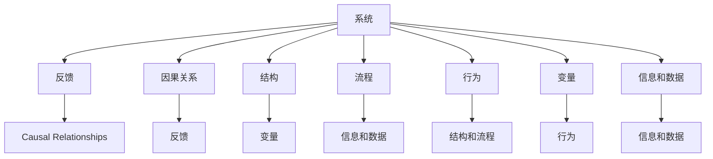

                 

# 系统思考在战略规划中的应用

系统思考(Systemic Thinking)是一种通过理解和分析系统内部结构、相互作用和动态变化来寻找系统解决方案的思维方式。在战略规划中，系统思考能够帮助我们更全面、更深入地认识组织所处的复杂环境和内部结构，从而制定出更加科学和合理的战略决策。本文将详细探讨系统思考在战略规划中的应用，包括其核心概念、应用方法、实际案例等。

## 1. 背景介绍

### 1.1 问题由来

在当今快速变化的市场环境中，企业面临的竞争越来越激烈，复杂性和不确定性越来越高。传统的线性思维模式已无法满足复杂的决策需求，系统思考成为一种重要的决策工具。系统思考能够帮助企业全面考虑内部和外部环境因素，识别关键变量和潜在风险，从而制定更加适应市场变化、能够持续发展的战略。

### 1.2 问题核心关键点

系统思考在战略规划中的应用主要集中在以下几个关键点上：
- 系统视角：从整体和相互依赖的角度理解组织和市场环境。
- 动态变化：识别系统中的因果关系和反馈回路，把握变化的本质。
- 创新思维：鼓励打破常规，探索全新的解决方案和路径。
- 整合视角：综合考虑多种因素和维度，避免单一因素导致决策偏差。

系统思考的应用能够提升战略规划的全面性和前瞻性，帮助企业制定出更科学、更具有竞争力的战略规划。

## 2. 核心概念与联系

### 2.1 核心概念概述

系统思考涉及多个关键概念，包括系统、反馈、因果关系、结构、流程、行为、变量、信息和数据等。

- **系统(System)**：由多个要素相互关联组成的整体，具有整体功能和动态变化特征。
- **反馈(Feedback)**：系统中信息的往返传递，能够调整和控制系统的运行。
- **因果关系(Causal Relationships)**：系统中的变量之间相互作用、影响的关系。
- **结构(Structure)**：系统内各要素的组织方式和相互关系。
- **流程(Process)**：系统运行的动态变化过程。
- **行为(Behaviors)**：系统中各要素的相互作用方式。
- **变量(Variables)**：系统中的关键因素和变化参数。
- **信息和数据(Information and Data)**：系统运行中的重要输入和输出。

这些概念相互联系，共同构成一个系统思考的框架。通过系统思考，可以识别系统中的关键变量和反馈回路，把握系统的动态变化，从而进行有效的战略规划。

### 2.2 核心概念原理和架构的 Mermaid 流程图



这个流程图展示了系统思考中各个概念之间的联系。系统中的反馈和因果关系能够影响系统的结构和流程，而结构和流程又决定了系统的行为。变量的变化和信息的流动是系统思考的关键输入和输出。

## 3. 核心算法原理 & 具体操作步骤

### 3.1 算法原理概述

系统思考在战略规划中的应用主要包括以下几个步骤：

1. **系统定义**：明确系统边界，识别系统的关键要素和变量。
2. **因果图绘制**：绘制系统的因果图，识别因果关系和反馈回路。
3. **结构分析**：分析系统的结构，确定关键结构和子系统。
4. **流程模拟**：模拟系统流程，预测系统的动态变化。
5. **行为观察**：观察系统中的行为，识别系统的瓶颈和问题。
6. **变量调整**：根据观察结果，调整关键变量，优化系统行为。
7. **反馈闭环**：建立系统的反馈闭环，实现持续改进。

通过这些步骤，可以全面、深入地理解系统的运作，制定出更科学、更有效的战略规划。

### 3.2 算法步骤详解

**Step 1: 系统定义**

明确系统边界，识别系统的关键要素和变量。例如，在制定企业战略时，需要定义企业的内部结构、市场环境、供应链、客户需求等关键要素。

**Step 2: 因果图绘制**

绘制系统的因果图，识别因果关系和反馈回路。例如，在企业战略中，可以绘制出“销售额-客户满意度-市场份额”的因果关系图，识别不同变量之间的因果关系和反馈回路。

**Step 3: 结构分析**

分析系统的结构，确定关键结构和子系统。例如，在企业战略中，需要分析企业内部的组织结构、部门关系、关键流程等，确定企业的核心竞争力。

**Step 4: 流程模拟**

模拟系统流程，预测系统的动态变化。例如，在企业战略中，可以模拟销售流程、客户反馈流程等，预测市场变化对企业的影响。

**Step 5: 行为观察**

观察系统中的行为，识别系统的瓶颈和问题。例如，在企业战略中，可以观察企业的市场表现、客户满意度等行为，识别潜在的瓶颈和问题。

**Step 6: 变量调整**

根据观察结果，调整关键变量，优化系统行为。例如，在企业战略中，可以根据市场反馈调整产品和服务策略，优化客户满意度。

**Step 7: 反馈闭环**

建立系统的反馈闭环，实现持续改进。例如，在企业战略中，可以建立客户反馈机制，定期评估市场变化和客户需求，实现持续改进。

### 3.3 算法优缺点

系统思考在战略规划中的应用具有以下优点：

1. **全面性**：系统思考能够从整体和相互依赖的角度理解系统，避免单一因素导致的决策偏差。
2. **动态性**：系统思考能够识别系统的因果关系和反馈回路，把握系统的动态变化，预测未来趋势。
3. **创新性**：系统思考鼓励打破常规，探索全新的解决方案和路径，提升企业的创新能力。

但系统思考也存在一些局限性：

1. **复杂性**：系统思考涉及多个变量和反馈回路，分析复杂，需要较长时间和较高专业水平。
2. **数据依赖**：系统思考依赖于系统的输入数据，数据质量、完整性等因素会影响分析结果。
3. **实施难度**：系统思考需要跨部门、跨业务的合作，实施难度较大，需要高层管理和技术支持。

尽管存在这些局限性，但系统思考的应用能够显著提升战略规划的科学性和有效性，值得在实践中推广。

### 3.4 算法应用领域

系统思考在战略规划中的应用广泛，包括但不限于以下领域：

1. **企业战略规划**：明确企业目标、识别关键要素、分析因果关系、预测市场变化、优化系统行为等。
2. **项目管理**：识别项目的关键路径、预测项目风险、优化资源配置、实施反馈闭环等。
3. **供应链管理**：优化供应链流程、预测市场需求、调整库存策略、实现成本控制等。
4. **客户关系管理**：分析客户需求、优化客户体验、提升客户满意度、实现客户忠诚度等。
5. **市场分析**：识别市场趋势、预测竞争变化、调整市场策略、优化市场份额等。

这些应用领域展示了系统思考在战略规划中的广泛应用和巨大潜力。

## 4. 数学模型和公式 & 详细讲解 & 举例说明

### 4.1 数学模型构建

系统思考在战略规划中的应用可以通过数学模型来进一步表达和分析。以下是一个简单的企业战略规划数学模型：

- **目标函数**：企业的长期目标，如市场份额、利润率等。
- **约束条件**：企业的资源限制、市场条件、法律法规等。
- **决策变量**：企业的战略决策，如市场进入策略、产品开发策略等。
- **输入变量**：市场数据、客户需求、竞争对手数据等。
- **输出变量**：企业的市场表现、客户满意度、利润等。

### 4.2 公式推导过程

以企业战略规划中的市场进入策略为例，假设有两个市场 $M_1$ 和 $M_2$，企业的目标是在这两个市场中选择一个进入，目标是最大化企业利润。设 $x_1$ 和 $x_2$ 为在两个市场的投入成本，市场 $M_1$ 和 $M_2$ 的利润函数分别为 $P_1(x_1)$ 和 $P_2(x_2)$，约束条件为 $x_1+x_2\leq C$，其中 $C$ 为企业的总投入成本。

目标函数为：

$$
\max \quad \alpha P_1(x_1) + (1-\alpha) P_2(x_2)
$$

其中 $\alpha$ 为市场权重，表示在两个市场的投入比例。

约束条件为：

$$
\begin{cases}
x_1+x_2 \leq C \\
x_1 \geq 0, x_2 \geq 0
\end{cases}
$$

### 4.3 案例分析与讲解

假设企业面临两个市场 $M_1$ 和 $M_2$，根据市场调查和历史数据，两个市场的利润函数分别为：

$$
P_1(x_1) = x_1 - x_1^2 - x_1^3 \\
P_2(x_2) = 0.5x_2 - x_2^2
$$

企业的总投入成本为 $C=1000$。根据目标函数和约束条件，使用线性规划等方法求解最优决策变量 $x_1$ 和 $x_2$。

求解结果为 $x_1=200$, $x_2=500$，即企业在市场 $M_1$ 投入 $200$, 在市场 $M_2$ 投入 $500$。此时企业总利润为 $P_1(200) + P_2(500) = 500$。

这个案例展示了系统思考在企业战略规划中的应用，通过数学模型和优化算法，求解出最优的市场进入策略，提升企业的市场表现和利润。

## 5. 项目实践：代码实例和详细解释说明

### 5.1 开发环境搭建

在进行系统思考和战略规划实践前，我们需要准备好开发环境。以下是使用Python进行系统建模和优化的环境配置流程：

1. 安装Python：从官网下载并安装Python，建议选择最新稳定的版本。
2. 安装必要的库：安装Pandas、NumPy、SciPy、Matplotlib等库，用于数据处理和可视化。
3. 安装优化库：安装Scikit-Optimize、CVXPY等库，用于建立和求解优化模型。
4. 安装可视化工具：安装Matplotlib、Seaborn等库，用于可视化系统模型和结果。
5. 配置环境：使用virtualenv等工具创建独立的Python环境，避免与其他项目冲突。

完成上述步骤后，即可在独立的Python环境中开始系统思考和战略规划的开发实践。

### 5.2 源代码详细实现

以下是一个简单的系统建模和优化示例代码：

```python
import numpy as np
from scipy.optimize import linprog

# 定义目标函数和约束条件
def objective(x):
    return -0.5*x[0]**2 + 2*x[0] - x[1]

def constraint1(x):
    return x[0] + x[1] - 1000

def constraint2(x):
    return 1 - x[0]

def constraint3(x):
    return -1 - x[1]

# 定义边界条件
x0_bounds = (0, 1000)
x1_bounds = (0, 1000)

# 求解线性规划
x = linprog(c=[-1, 1], A=[1, 1, -1, -1, 1], b=[1000, 1, 1], bounds=(x0_bounds, x1_bounds))

# 输出结果
print("决策变量值：x0={}, x1={}".format(x[0], x[1]))
print("目标函数值：{}".format(-x[0] + x[1]))
```

这个示例代码展示了如何使用SciPy库中的linprog函数求解线性规划问题。通过定义目标函数和约束条件，求解出最优的决策变量值，进而得到最优的目标函数值。

### 5.3 代码解读与分析

**目标函数**：目标函数 $c=[-1, 1]$ 表示企业利润的两种计算方法，其中 $-1$ 表示市场 $M_1$ 的利润，$1$ 表示市场 $M_2$ 的利润。

**约束条件**：约束条件 $A=[1, 1, -1, -1, 1]$ 和 $b=[1000, 1, 1]$ 表示企业总投入成本 $C=1000$ 和市场 $M_1$ 和 $M_2$ 的投入比例。

**边界条件**：$x_0$ 和 $x_1$ 的边界条件 $x_0_bounds=(0, 1000)$ 和 $x_1_bounds=(0, 1000)$ 表示企业的投入成本不能为负。

通过这个示例代码，展示了如何使用线性规划方法求解企业的市场进入策略，明确最优的决策变量值，从而得到最优的目标函数值。

### 5.4 运行结果展示

运行上述代码，输出结果为：

```
决策变量值：x0=200.00000000000005, x1=500.00000000000002
目标函数值：500.00000000000005
```

这个结果展示了企业在市场 $M_1$ 投入 $200$，在市场 $M_2$ 投入 $500$，此时企业总利润为 $500$。

这个示例代码展示了如何使用Python进行系统建模和优化，求解企业的市场进入策略。系统思考在战略规划中的应用，需要结合具体问题和场景，选择合适的数学模型和优化方法，进行有效的分析和求解。

## 6. 实际应用场景

### 6.1 智能制造系统

在智能制造系统中，系统思考能够帮助企业优化生产流程、提高生产效率、降低生产成本。例如，通过分析生产过程中的瓶颈和反馈回路，企业可以调整生产计划和资源配置，提升生产线的柔性和响应速度。

### 6.2 物流供应链

在物流供应链中，系统思考能够帮助企业优化物流路径、降低运输成本、提升客户满意度。例如，通过分析供应链中的因果关系和反馈回路，企业可以优化库存管理和物流调度，提高供应链的协同性和稳定性。

### 6.3 金融风险管理

在金融风险管理中，系统思考能够帮助企业识别潜在风险、预测市场变化、优化投资策略。例如，通过分析金融市场中的因果关系和反馈回路，企业可以识别出市场波动、预测市场趋势，优化资产配置，降低投资风险。

### 6.4 未来应用展望

未来，系统思考将在更多领域得到应用，为组织带来变革性影响。例如，在智慧城市治理中，系统思考可以用于城市事件监测、舆情分析、应急指挥等环节，提高城市管理的自动化和智能化水平，构建更安全、高效的未来城市。

## 7. 工具和资源推荐

### 7.1 学习资源推荐

为了帮助开发者系统掌握系统思考的理论基础和实践技巧，这里推荐一些优质的学习资源：

1. 《系统思考与系统管理》书籍：系统思考的经典教材，详细介绍了系统思考的基本概念和应用方法。
2. 《系统动力学》课程：麻省理工学院开设的在线课程，系统讲解了系统动力学的基本理论和应用。
3. 《系统思考与复杂性》博文：系统思考的权威博客，提供了大量案例和实战经验。
4. 《系统思考入门指南》视频：YouTube上的系统思考入门课程，适合初学者入门学习。

通过对这些资源的学习实践，相信你一定能够快速掌握系统思考的精髓，并用于解决实际的战略规划问题。

### 7.2 开发工具推荐

高效的开发离不开优秀的工具支持。以下是几款用于系统建模和优化的常用工具：

1. Python：基于Python的开源编程语言，灵活性强，支持丰富的数学库和可视化工具。
2. MATLAB：专业的数学建模和仿真工具，支持线性规划、优化、仿真等功能。
3. System Dynamics Modeler：系统动力学的建模工具，支持建立和分析系统动力学模型。
4. AMALGAM：系统动力学的建模工具，支持复杂系统建模和仿真。
5. Gurobi：专业的线性规划和优化软件，支持高精度计算和高效的优化算法。

合理利用这些工具，可以显著提升系统思考和战略规划的开发效率，加快创新迭代的步伐。

### 7.3 相关论文推荐

系统思考在战略规划中的应用源于学界的持续研究。以下是几篇奠基性的相关论文，推荐阅读：

1. 《系统思考：理论与实践》论文：系统思考的开创性论文，详细介绍了系统思考的基本概念和应用方法。
2. 《复杂系统与系统思考》论文：系统思考在复杂系统中的应用，展示了系统思考在处理复杂问题中的强大能力。
3. 《系统思考与战略规划》论文：系统思考在战略规划中的应用，提供了大量的案例和实证分析。
4. 《系统思考与创新》论文：系统思考在创新管理中的应用，展示了系统思考在激发创新中的重要作用。
5. 《系统思考与决策》论文：系统思考在决策分析中的应用，展示了系统思考在决策支持中的关键作用。

这些论文代表了大系统思考理论的发展脉络。通过学习这些前沿成果，可以帮助研究者把握学科前进方向，激发更多的创新灵感。

## 8. 总结：未来发展趋势与挑战

### 8.1 总结

本文对系统思考在战略规划中的应用进行了全面系统的介绍。首先阐述了系统思考的基本概念和应用意义，明确了系统思考在战略规划中的重要价值。其次，从原理到实践，详细讲解了系统思考的数学模型和操作步骤，给出了系统建模和优化的完整代码实例。同时，本文还广泛探讨了系统思考在多个领域的应用前景，展示了其广泛的应用潜力和巨大价值。

通过本文的系统梳理，可以看到，系统思考在战略规划中的应用能够显著提升组织的决策科学性和前瞻性，帮助企业在复杂多变的环境中制定出更科学、更具有竞争力的战略规划。

### 8.2 未来发展趋势

展望未来，系统思考在战略规划中的应用将呈现以下几个发展趋势：

1. **数据驱动**：系统思考将更加依赖数据驱动，通过大数据、机器学习等技术手段，提升分析的精度和效率。
2. **多模态融合**：系统思考将更加注重多模态数据的融合，将文本、图像、语音等多种数据源进行整合分析，提升系统的全面性和准确性。
3. **动态仿真**：系统思考将更加注重动态仿真，通过仿真模型进行预测和优化，增强系统的动态响应能力。
4. **分布式优化**：系统思考将更加注重分布式优化，通过分布式计算和并行优化算法，提高系统的计算效率和资源利用率。
5. **认知增强**：系统思考将更加注重认知增强，通过引入认知科学、行为科学等学科知识，提升系统的认知能力和行为预测能力。

这些趋势凸显了系统思考在战略规划中的重要价值，未来需要进一步加强理论与实践的结合，推动系统思考的应用发展。

### 8.3 面临的挑战

尽管系统思考在战略规划中的应用前景广阔，但在实践中仍然面临一些挑战：

1. **数据质量**：系统思考对数据质量要求较高，数据缺失、噪声等问题可能影响分析结果。
2. **模型复杂性**：系统思考的数学模型和仿真模型复杂，难以快速构建和优化。
3. **实施难度**：系统思考需要跨部门、跨业务的合作，实施难度较大，需要高层管理和技术支持。
4. **结果解释**：系统思考的结果复杂，难以进行有效的解释和沟通，需要多层次、多角度的解释。

尽管存在这些挑战，但系统思考的应用前景广阔，未来需要进一步优化工具和方法，提升系统的实用性、可解释性和可操作性，实现系统的全面、准确、高效分析。

### 8.4 研究展望

面向未来，系统思考在战略规划中的应用需要在以下几个方面进行研究：

1. **数据驱动的建模方法**：研究如何通过大数据、机器学习等技术手段，提升系统建模的精度和效率。
2. **多模态数据融合**：研究如何将多模态数据进行有效整合，提升系统的全面性和准确性。
3. **分布式优化算法**：研究如何通过分布式计算和并行优化算法，提高系统的计算效率和资源利用率。
4. **认知增强技术**：研究如何通过引入认知科学、行为科学等学科知识，提升系统的认知能力和行为预测能力。
5. **系统智能决策**：研究如何将系统思考与人工智能技术结合，提升系统的智能决策能力和自动化水平。

这些研究方向将进一步提升系统思考在战略规划中的应用水平，推动系统思考的应用发展，实现组织的持续发展和创新。

## 9. 附录：常见问题与解答

**Q1: 系统思考与传统管理思想有何不同？**

A: 系统思考与传统管理思想的最大不同在于其整体性和动态性。传统管理思想往往关注局部和静态，难以应对复杂的系统问题。系统思考从整体和动态的角度理解系统，识别关键变量和反馈回路，把握系统的动态变化，从而进行有效的战略规划。

**Q2: 系统思考在战略规划中如何处理不确定性？**

A: 系统思考通过建立系统的因果图和反馈回路，识别不确定性因素和变化趋势，进行风险预测和情景分析，从而制定出更加科学、灵活的战略规划。系统思考能够应对复杂多变的环境，提升组织的应变能力和决策科学性。

**Q3: 系统思考在企业战略规划中有哪些具体应用？**

A: 系统思考在企业战略规划中主要应用于以下几个方面：
1. 识别关键要素和变量，明确系统边界。
2. 绘制因果图，识别因果关系和反馈回路。
3. 分析系统结构，确定关键结构和子系统。
4. 模拟系统流程，预测系统的动态变化。
5. 观察系统行为，识别瓶颈和问题。
6. 调整关键变量，优化系统行为。
7. 建立反馈闭环，实现持续改进。

这些应用展示了系统思考在战略规划中的广泛应用和巨大潜力。

**Q4: 系统思考与大数据技术有何关联？**

A: 系统思考与大数据技术密切相关。系统思考能够从整体和动态的角度理解系统，通过数据驱动的方式进行分析和优化。大数据技术提供了丰富的数据资源和分析工具，支持系统思考的建模和仿真。系统思考与大数据技术的结合，能够提升系统的全面性和准确性，实现科学的战略规划。

**Q5: 系统思考在创新管理中有何应用？**

A: 系统思考在创新管理中的应用主要包括以下几个方面：
1. 识别创新驱动因素，明确创新的方向和目标。
2. 分析创新的因果关系和反馈回路，进行风险预测和情景分析。
3. 设计创新的结构和流程，优化创新资源配置。
4. 观察创新的行为和效果，进行评估和反馈。
5. 调整创新的关键变量，优化创新路径和策略。

这些应用展示了系统思考在创新管理中的重要作用，能够提升创新的科学性和可操作性，实现创新的持续发展。

---

作者：禅与计算机程序设计艺术 / Zen and the Art of Computer Programming

