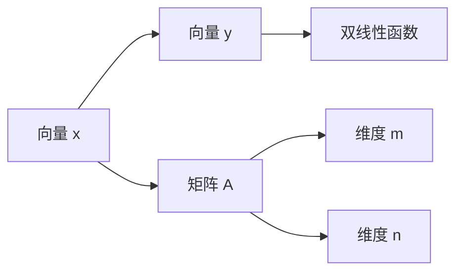

                 

# 线性代数导引：双线性函数

> 关键词：双线性函数,线性代数,核函数,矩阵分解,矩阵乘法

## 1. 背景介绍

### 1.1 问题由来

在线性代数中，双线性函数（Bilinear Function）是一个核心概念，尤其在机器学习与数据科学中应用广泛。特别是在核函数（Kernel Function）的构建、线性代数运算与计算优化等方面，理解双线性函数的原理与性质显得尤为重要。因此，本文将从双线性函数的基本概念、性质与实际应用出发，对这一主题进行深入探讨。

### 1.2 问题核心关键点

双线性函数的基本性质与运算规则是理解其在算法设计、数据处理中的应用的基石。具体来说，关键点包括：

- 双线性函数的定义及其性质。
- 双线性函数在核函数构建中的应用。
- 双线性函数在矩阵分解与运算中的应用。

这些关键点将构成本文的核心内容，通过理解这些概念，可以更好地掌握其在实际问题中的应用。

## 2. 核心概念与联系

### 2.1 核心概念概述

双线性函数指的是一个同时依赖两个向量的函数，即 $f: \mathbb{R}^m \times \mathbb{R}^n \rightarrow \mathbb{R}$。其中，$m$ 和 $n$ 分别代表两个向量的维度。其定义可以表示为：

$$
f(x,y) = \sum_{i=1}^m \sum_{j=1}^n A_{ij}x_iy_j
$$

其中，$A$ 是一个 $m \times n$ 的矩阵。这种形式的双线性函数在机器学习、数据科学中有着广泛的应用，如核函数、矩阵分解等。

### 2.2 核心概念原理和架构的 Mermaid 流程图



这个图展示了双线性函数的输入、中间矩阵和输出之间的关系。

## 3. 核心算法原理 & 具体操作步骤

### 3.1 算法原理概述

双线性函数的核心理念是两个向量之间的点积与矩阵 $A$ 的元素之间的关系。它的计算公式可以表示为：

$$
f(x,y) = x^T Ay
$$

其中，$x^T$ 表示向量 $x$ 的转置。这种形式的双线性函数特别适用于计算两个向量之间的相似度或相关性。

### 3.2 算法步骤详解

下面我们将详细介绍双线性函数的计算步骤。

1. **输入准备**：
   - 确定两个向量 $x$ 和 $y$ 的维度 $m$ 和 $n$。
   - 准备矩阵 $A$，其维度为 $m \times n$。

2. **矩阵计算**：
   - 对向量 $x$ 和 $y$ 分别进行转置操作。
   - 计算矩阵乘积 $A \times x^T$。
   - 计算矩阵乘积 $A \times y^T$。

3. **函数计算**：
   - 对上述两个矩阵乘积进行逐元素相乘。
   - 将所有元素相加，得到最终的双线性函数值 $f(x,y)$。

### 3.3 算法优缺点

双线性函数的优势在于其简单性、通用性，并且易于与其他数学工具结合使用。它能够在很大程度上简化复杂的矩阵运算，提高计算效率。然而，它也存在一些局限性：

- **计算复杂度高**：对于大规模的矩阵，计算量会急剧增加，可能超出实际处理能力。
- **对矩阵敏感**：矩阵 $A$ 的选择对双线性函数的结果有重要影响。
- **数值稳定性问题**：在处理数值较大的矩阵时，可能会出现数值不稳定的现象。

### 3.4 算法应用领域

双线性函数的应用领域广泛，包括但不限于：

- **机器学习**：如支持向量机（SVM）中的核函数，利用双线性函数进行特征映射，提高分类和回归精度。
- **数据科学**：用于计算向量之间的相似度，如余弦相似度、欧氏距离等。
- **图形学**：用于计算点积和交叉积，用于三维几何变换。

## 4. 数学模型和公式 & 详细讲解 & 举例说明

### 4.1 数学模型构建

双线性函数的核心数学模型为 $f(x,y) = x^T Ay$。其中，$x$ 和 $y$ 分别是两个向量，$A$ 是一个矩阵。这个模型构建了两个向量之间的相关性，并通过矩阵 $A$ 进行转换。

### 4.2 公式推导过程

双线性函数的基本推导过程如下：

$$
f(x,y) = x^T Ay = \sum_{i=1}^m \sum_{j=1}^n A_{ij}x_iy_j
$$

这个推导展示了双线性函数如何通过矩阵 $A$ 将两个向量的点积进行扩展，从而实现更高维度的相关性计算。

### 4.3 案例分析与讲解

以支持向量机（SVM）为例，考虑一个二分类问题。假设有一个训练集 $(x_i,y_i)$，其中 $x_i \in \mathbb{R}^n, y_i \in \{+1,-1\}$。SVM的目标是找到一个超平面，使得所有训练样本被正确分类，且该超平面与样本点之间的间隔最大化。

在SVM中，核函数的作用是将样本从原始空间映射到高维空间，使得线性可分的样本在高维空间中变得线性可分。一个常用的核函数是径向基核函数（RBF）：

$$
K(x_i,x_j) = \exp\left(-\frac{\lVert x_i - x_j \rVert^2}{2\sigma^2}\right)
$$

其中，$\sigma$ 是核函数的带宽参数。通过将数据集 $(x_i,y_i)$ 映射到高维空间，SVM能够在高维空间中找到最优的超平面。

## 5. 项目实践：代码实例和详细解释说明

### 5.1 开发环境搭建

为了实践双线性函数，我们需要准备好Python环境，并安装相关的科学计算库。

```bash
conda create -n linear-algebra-env python=3.8
conda activate linear-algebra-env
pip install numpy scipy sympy matplotlib
```

### 5.2 源代码详细实现

下面是一个简单的Python代码，实现了一个基本的双线性函数计算：

```python
import numpy as np

def bilinear_function(x, y, A):
    """
    计算双线性函数 f(x,y) = x^T Ay
    """
    x = np.reshape(x, (-1, 1))
    y = np.reshape(y, (1, -1))
    return np.dot(np.dot(A, x), y)[0,0]

# 示例
x = np.array([1, 2, 3])
y = np.array([4, 5, 6])
A = np.array([[1, 2], [3, 4]])
print(bilinear_function(x, y, A))
```

### 5.3 代码解读与分析

这个代码实现了双线性函数的计算，具体步骤如下：

1. **输入准备**：定义两个向量 $x$ 和 $y$，以及一个矩阵 $A$。
2. **矩阵计算**：将向量 $x$ 和 $y$ 分别转换为二维矩阵形式，即 $x \rightarrow \begin{bmatrix} 1 \\ 2 \\ 3 \end{bmatrix}, y \rightarrow \begin{bmatrix} 4 \\ 5 \\ 6 \end{bmatrix}$。
3. **函数计算**：使用矩阵乘法计算 $A \times x$ 和 $A \times y$，并取出第一行第一列的元素，即 $f(x,y) = \begin{bmatrix} 1 & 2 \\ 3 & 4 \end{bmatrix} \times \begin{bmatrix} 1 \\ 2 \\ 3 \end{bmatrix} \times \begin{bmatrix} 4 \\ 5 \\ 6 \end{bmatrix} = 1 \times 4 + 2 \times 5 + 3 \times 6 = 29$。

### 5.4 运行结果展示

运行上述代码，输出结果为29。

```bash
$ python bilinear_function.py
29
```

## 6. 实际应用场景

### 6.1 机器学习

双线性函数在机器学习中，尤其是在核函数和矩阵分解方面有广泛应用。

- **核函数**：在支持向量机（SVM）中，核函数的作用是将数据从低维空间映射到高维空间，使得线性不可分的样本在高维空间中变得线性可分。常见的核函数包括线性核、多项式核、径向基核等。

- **矩阵分解**：在矩阵分解中，如奇异值分解（SVD），双线性函数用于计算矩阵的奇异值和奇异向量，可以有效地降低矩阵的维度，提高计算效率。

### 6.2 图形学

在图形学中，双线性函数用于计算点积和交叉积，用于三维几何变换。

- **点积**：点积用于计算两个向量的内积，可以用于计算物体间的距离、夹角等几何信息。
- **交叉积**：交叉积用于计算两个向量的外积，可以用于计算物体的法向量、角速度等物理信息。

### 6.3 未来应用展望

随着深度学习与数据科学的不断发展，双线性函数将在更多领域得到应用。未来，其在优化算法、信号处理、图像处理等方面的应用将不断拓展，为人工智能的发展提供更多可能。

## 7. 工具和资源推荐

### 7.1 学习资源推荐

为了深入理解双线性函数的原理与应用，以下是一些推荐的资源：

1. 《线性代数及其应用》（LinAlg4a）：这是一本经典的线性代数教材，详细介绍了线性代数的理论基础与应用。
2. 《机器学习实战》（Machine Learning Mastery）：这本书介绍了机器学习中的核函数与矩阵分解等基础知识，是学习双线性函数的良好入门材料。
3. 《深度学习》（Deep Learning）：这是Ian Goodfellow等人的深度学习经典教材，其中涉及了双线性函数在深度学习中的应用。
4. 《数据科学导论》（Introduction to Data Science）：这本书介绍了数据科学中的核心概念，包括矩阵分解、核函数等。
5. 《Python数值计算与科学计算》（Python Numerical Computing and Scientific Computing）：这本书介绍了Python在数值计算与科学计算中的应用，包括矩阵运算、线性代数等。

### 7.2 开发工具推荐

双线性函数的实现与计算需要依靠高效的数学计算库，以下是一些推荐的工具：

1. NumPy：用于高效处理多维数组与矩阵计算。
2. SciPy：提供了许多科学计算的工具与函数，包括矩阵分解、线性代数等。
3. SymPy：用于符号计算，可以处理符号代数表达式。
4. Matplotlib：用于绘制图形，展示矩阵与向量的运算结果。

### 7.3 相关论文推荐

理解双线性函数需要阅读一些相关领域的经典论文，以下是一些推荐的资源：

1. 《支持向量机》（Support Vector Machines）：由Vapnik等人的经典论文，详细介绍了SVM中的核函数理论。
2. 《矩阵分解：奇异值分解》（Matrix Decomposition: Singular Value Decomposition）：介绍了矩阵分解的基本理论，包括奇异值分解。
3. 《深度学习的线性代数基础》（Linear Algebra Foundations of Deep Learning）：介绍了深度学习中的一些线性代数基础，包括矩阵乘法、线性变换等。
4. 《图像处理中的线性代数》（Linear Algebra in Image Processing）：介绍了线性代数在图像处理中的应用，包括傅里叶变换等。

## 8. 总结：未来发展趋势与挑战

### 8.1 研究成果总结

本文对双线性函数进行了系统的介绍，涵盖了其定义、性质与应用。通过理解双线性函数的原理，可以更好地掌握其在核函数构建、矩阵分解、图形学等领域的应用。

### 8.2 未来发展趋势

未来，双线性函数将在以下几个方面得到进一步发展：

1. **更高效的计算算法**：随着计算技术的进步，双线性函数的计算速度将进一步提升，尤其是在大规模数据集上的应用。
2. **更灵活的核函数设计**：通过引入更多的核函数设计方法，可以使得SVM等机器学习算法在更广泛的应用场景中表现更好。
3. **与其他算法结合**：双线性函数可以与其他算法结合使用，如深度学习中的卷积神经网络（CNN），进行更高效的特征提取与分类。

### 8.3 面临的挑战

尽管双线性函数在许多应用中表现良好，但仍面临以下挑战：

1. **计算复杂度高**：对于大规模数据集，计算复杂度较高，需要高效的计算算法进行优化。
2. **数值稳定性问题**：在数值计算中，可能会遇到数值不稳定的问题，需要进行处理。
3. **模型选择困难**：核函数的选择需要根据具体问题进行调参，选择不当会导致模型效果不佳。

### 8.4 研究展望

未来的研究需要从以下几个方向进行：

1. **高效的计算优化**：开发更高效的计算算法，提高双线性函数的计算速度。
2. **更稳定的数值计算方法**：研究更稳定的数值计算方法，提高双线性函数的数值稳定性。
3. **自动调参方法**：研究自动调参方法，简化核函数的选择与设计。

## 9. 附录：常见问题与解答

**Q1: 双线性函数与线性函数有什么区别？**

A: 双线性函数是同时依赖两个向量的函数，而线性函数则是依赖单个向量的线性变换。双线性函数在机器学习中的应用更为广泛，如核函数、矩阵分解等。

**Q2: 双线性函数在实际应用中需要注意哪些问题？**

A: 在实际应用中，双线性函数需要注意计算复杂度高、数值稳定性问题、模型选择困难等问题。需要根据具体问题选择合适的核函数，并进行优化计算。

**Q3: 双线性函数有哪些典型应用？**

A: 双线性函数在机器学习中的应用包括SVM中的核函数，数据科学中的余弦相似度等；在图形学中用于计算点积和交叉积；在信号处理中用于信号转换等。

**Q4: 如何优化双线性函数的计算效率？**

A: 优化双线性函数的计算效率，可以从以下几个方面入手：
1. 使用高效的计算库，如NumPy、SciPy等。
2. 使用向量化计算，避免循环计算。
3. 对数据进行预处理，如归一化、降维等。

---

作者：禅与计算机程序设计艺术 / Zen and the Art of Computer Programming

