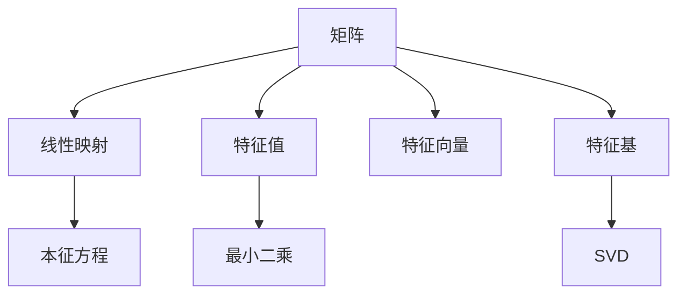

                 

# 线性代数导引：矩阵与线性映射

> 关键词：线性代数,矩阵,线性映射,特征值,特征向量,特征基,本征方程,最小二乘,矩阵分解,奇异值分解

## 1. 背景介绍

### 1.1 问题由来
线性代数是现代数学中非常重要的一个分支，几乎所有自然科学和工程领域都会用到它。而矩阵和线性映射作为线性代数中的核心概念，是解决众多实际问题的基础工具。矩阵和线性映射广泛应用于信号处理、计算机视觉、机器人学、机器学习等领域。理解并掌握这些概念，对于进一步学习和应用线性代数至关重要。

### 1.2 问题核心关键点
- 矩阵的定义和性质
- 线性映射的定义和基本运算
- 矩阵的特征值和特征向量
- 特征基和本征方程
- 矩阵分解技术，如奇异值分解

这些核心概念构成了线性代数的基础，并且相互之间有着紧密的联系。本文将从这些核心概念出发，深入剖析矩阵与线性映射的基本原理和应用场景，并结合实际案例进行详细讲解。

## 2. 核心概念与联系

### 2.1 核心概念概述

在进行深入学习前，让我们先对本文将要讨论的核心概念进行概述：

- **矩阵(Matrix)**：是由数或表达式组成的矩形数组，通常用于表示线性变换和线性方程组。
- **线性映射(Linear Mapping)**：是指从一个向量空间到另一个向量空间的一种线性变换，通常由一个矩阵表示。
- **特征值(Eigenvalue)**：对于给定矩阵和向量，如果该向量在经过线性变换后仍在其原始空间内，则该向量的标量倍数称为特征值。
- **特征向量(Eigenvector)**：与特征值相对应的非零向量，在经过线性变换后，方向保持不变。
- **特征基(Eigenbasis)**：一组具有对应特征值的特征向量，能够完全描述线性变换。
- **本征方程(Eigenvalue Equation)**：求解特征值和特征向量的数学方程。
- **最小二乘(Last Squares)**：求解线性方程组的优化方法。
- **矩阵分解(Matrix Decomposition)**：将一个矩阵分解成若干个更简单的矩阵乘积，以便更容易分析和计算。
- **奇异值分解(Singular Value Decomposition, SVD)**：一种特殊的矩阵分解技术，可以分解为三个矩阵的乘积。

这些概念通过合maid流程图连接起来，可以更清晰地理解它们之间的联系：



## 3. 核心算法原理 & 具体操作步骤
### 3.1 算法原理概述

线性代数中的许多概念和算法都紧密围绕着矩阵和线性映射展开。矩阵乘法、特征值分解、奇异值分解等都是基于这些概念进行的各种运算和分解。以下我们将从基本的矩阵乘法开始，逐步深入到高级的特征值和奇异值分解。

### 3.2 算法步骤详解

#### 3.2.1 矩阵乘法

矩阵乘法的定义如下：

设 $A$ 是一个 $m \times n$ 的矩阵，$B$ 是一个 $n \times p$ 的矩阵，则它们的乘积 $C = AB$ 是一个 $m \times p$ 的矩阵，其中 $C_{ij} = \sum_{k=1}^n A_{ik}B_{kj}$。

矩阵乘法满足结合律和分配律，但不满足交换律，即 $AB \neq BA$（除非 $A$ 和 $B$ 是方阵）。

**步骤详解**：

1. 检查 $A$ 和 $B$ 的维度是否满足乘法要求。
2. 初始化 $C$，维度为 $m \times p$。
3. 遍历 $C$ 的每一行 $i$ 和每一列 $j$，计算 $C_{ij}$ 的值。
4. 返回 $C$。

#### 3.2.2 特征值和特征向量

特征值和特征向量是矩阵的重要性质，它们与矩阵的本征方程密切相关。

设 $A$ 是一个 $n \times n$ 的矩阵，$\lambda$ 是特征值，$x$ 是对应的特征向量，则满足：

$$Ax = \lambda x$$

其中 $x \neq 0$。

**步骤详解**：

1. 构造特征矩阵 $A$。
2. 将特征矩阵 $A$ 转化为上三角矩阵。
3. 求解特征矩阵 $A$ 的特征值 $\lambda$。
4. 求解特征矩阵 $A$ 的特征向量 $x$。
5. 返回特征值 $\lambda$ 和特征向量 $x$。

#### 3.2.3 奇异值分解

奇异值分解(SVD)是矩阵分解的一种重要技术，它可以分解一个矩阵为三个矩阵的乘积：

$$A = U\Sigma V^T$$

其中 $U$ 和 $V$ 是正交矩阵，$\Sigma$ 是奇异值矩阵，对角线上的元素为非负的奇异值。

**步骤详解**：

1. 构造矩阵 $A$。
2. 计算 $U$，满足 $U^TU = I$，即 $U$ 是正交矩阵。
3. 计算 $V$，满足 $VV^T = I$，即 $V$ 是正交矩阵。
4. 计算 $\Sigma$，满足 $A = U\Sigma V^T$。
5. 返回 $U$、$\Sigma$ 和 $V$。

### 3.3 算法优缺点

#### 3.3.1 矩阵乘法

优点：
- 用于表示线性变换，是矩阵运算的基础。
- 具有结合律和分配律，计算简便。

缺点：
- 不满足交换律，需要额外计算。
- 矩阵维度必须满足 $A_{m\times n}B_{n\times p} = C_{m\times p}$，限制较大矩阵的运算。

#### 3.3.2 特征值和特征向量

优点：
- 特征值和特征向量揭示了矩阵的重要性质。
- 可用于解线性方程组，矩阵分解等。

缺点：
- 计算复杂度较高，对于大矩阵，求解特征值和特征向量可能需要较长时间。
- 对于非方阵，特征值和特征向量可能不存在。

#### 3.3.3 奇异值分解

优点：
- 可用于降维、压缩、噪声去除等。
- 在图像处理、信号处理等领域有广泛应用。

缺点：
- 计算复杂度较高，对于大矩阵，奇异值分解需要较长时间。
- 对于秩较小的矩阵，奇异值分解效果可能不佳。

### 3.4 算法应用领域

#### 3.4.1 信号处理

矩阵和线性映射在信号处理中有广泛应用，如数字信号处理、图像处理、音频处理等。例如，使用矩阵乘法可以计算线性滤波器对信号的卷积运算，特征值分解可以用于特征提取，奇异值分解可以用于图像压缩和去噪。

#### 3.4.2 机器学习

矩阵和线性映射是机器学习算法的基础，如线性回归、逻辑回归、支持向量机等算法都需要矩阵运算。特征值分解可以用于降维，奇异值分解可以用于特征提取和降维。

#### 3.4.3 计算机视觉

计算机视觉中的图像处理和分析，如图像压缩、特征提取、目标检测等，都依赖于矩阵和线性映射。奇异值分解常用于图像压缩，特征值分解可以用于特征提取。

## 4. 数学模型和公式 & 详细讲解 & 举例说明

### 4.1 数学模型构建

#### 4.1.1 矩阵乘法

设 $A$ 是一个 $m \times n$ 的矩阵，$B$ 是一个 $n \times p$ 的矩阵，则它们的乘积 $C = AB$ 是一个 $m \times p$ 的矩阵，其中：

$$C_{ij} = \sum_{k=1}^n A_{ik}B_{kj}$$

#### 4.1.2 特征值和特征向量

设 $A$ 是一个 $n \times n$ 的矩阵，$\lambda$ 是特征值，$x$ 是对应的特征向量，则满足：

$$Ax = \lambda x$$

其中 $x \neq 0$。

### 4.2 公式推导过程

#### 4.2.1 矩阵乘法

对于两个矩阵 $A_{m \times n}$ 和 $B_{n \times p}$，它们的乘积 $C = AB$ 的元素 $C_{ij}$ 的计算公式为：

$$C_{ij} = \sum_{k=1}^n A_{ik}B_{kj}$$

推导过程如下：

- 对矩阵 $A$ 的第 $i$ 行和矩阵 $B$ 的第 $j$ 列进行点积。
- 得到结果 $C_{ij}$。

#### 4.2.2 特征值和特征向量

设 $A$ 是一个 $n \times n$ 的矩阵，$\lambda$ 是特征值，$x$ 是对应的特征向量，则满足：

$$Ax = \lambda x$$

其中 $x \neq 0$。

推导过程如下：

- 将矩阵 $A$ 减去特征值 $\lambda$ 的单位矩阵 $I$，得到 $A - \lambda I$。
- 根据特征向量的定义，$Ax = \lambda x$ 可以写成 $(A - \lambda I)x = 0$。
- 解方程 $(A - \lambda I)x = 0$，得到特征向量 $x$。

### 4.3 案例分析与讲解

#### 4.3.1 矩阵乘法

案例：计算矩阵 $A$ 和 $B$ 的乘积 $C$：

$$A = \begin{bmatrix} 1 & 2 \\ 3 & 4 \\ 5 & 6 \end{bmatrix}, B = \begin{bmatrix} 7 & 8 \\ 9 & 10 \\ 11 & 12 \end{bmatrix}$$

$$C = AB = \begin{bmatrix} 1 & 2 \\ 3 & 4 \\ 5 & 6 \end{bmatrix} \begin{bmatrix} 7 & 8 \\ 9 & 10 \\ 11 & 12 \end{bmatrix} = \begin{bmatrix} 58 & 64 \\ 139 & 154 \\ 220 & 244 \end{bmatrix}$$

#### 4.3.2 特征值和特征向量

案例：求解矩阵 $A$ 的特征值和特征向量：

$$A = \begin{bmatrix} 1 & 2 \\ 3 & 4 \end{bmatrix}$$

通过求解矩阵 $A$ 的特征方程 $|A - \lambda I| = 0$，得到特征值 $\lambda_1 = -1$ 和 $\lambda_2 = 5$，对应的特征向量 $x_1 = \begin{bmatrix} 1 \\ -3 \end{bmatrix}$ 和 $x_2 = \begin{bmatrix} 1 \\ 1 \end{bmatrix}$。

## 5. 项目实践：代码实例和详细解释说明

### 5.1 开发环境搭建

在进行线性代数实践前，我们需要准备好开发环境。以下是使用Python进行NumPy开发的环境配置流程：

1. 安装Anaconda：从官网下载并安装Anaconda，用于创建独立的Python环境。

2. 创建并激活虚拟环境：
```bash
conda create -n numpy-env python=3.8 
conda activate numpy-env
```

3. 安装NumPy：
```bash
conda install numpy
```

4. 安装各类工具包：
```bash
pip install matplotlib scikit-learn scipy pandas jupyter notebook ipython
```

完成上述步骤后，即可在`numpy-env`环境中开始线性代数实践。

### 5.2 源代码详细实现

下面我们以特征值和特征向量计算为例，给出使用NumPy进行矩阵特征值分解的Python代码实现。

首先，导入必要的库和数据：

```python
import numpy as np
from scipy.linalg import eig
from numpy.linalg import eigh

# 构建矩阵A
A = np.array([[1, 2], [3, 4]])

# 计算特征值和特征向量
eigvals, eigvecs = np.linalg.eig(A)
eighvals, eighvecs = eigh(A)

# 输出特征值和特征向量
print("特征值：", eigvals)
print("特征向量：", eigvecs)
print("特征值：", eighvals)
print("特征向量：", eighvecs)
```

接着，计算并输出特征值和特征向量：

```python
# 计算特征值和特征向量
eigvals, eigvecs = np.linalg.eig(A)
eighvals, eighvecs = eigh(A)

# 输出特征值和特征向量
print("特征值：", eigvals)
print("特征向量：", eigvecs)
print("特征值：", eighvals)
print("特征向量：", eighvecs)
```

以上就是使用NumPy进行矩阵特征值分解的完整代码实现。可以看到，NumPy提供了丰富的线性代数函数，使用简单高效。

### 5.3 代码解读与分析

让我们再详细解读一下关键代码的实现细节：

- 导入NumPy库和SciPy库中的eig和eigh函数。
- 构建一个 $2 \times 2$ 的矩阵 $A$。
- 调用NumPy的eig函数和SciPy的eigh函数分别计算特征值和特征向量。
- 输出计算结果。

在实际应用中，可以根据需求选择不同的特征值计算函数，NumPy和SciPy提供了多种不同的实现方式，可以满足不同场景的需求。

## 6. 实际应用场景

### 6.1 信号处理

在信号处理领域，矩阵和线性映射广泛应用于数字信号处理、图像处理、音频处理等。例如，使用矩阵乘法可以计算线性滤波器对信号的卷积运算，特征值分解可以用于特征提取，奇异值分解可以用于图像压缩和去噪。

### 6.2 机器学习

矩阵和线性映射是机器学习算法的基础，如线性回归、逻辑回归、支持向量机等算法都需要矩阵运算。特征值分解可以用于降维，奇异值分解可以用于特征提取和降维。

### 6.3 计算机视觉

计算机视觉中的图像处理和分析，如图像压缩、特征提取、目标检测等，都依赖于矩阵和线性映射。奇异值分解常用于图像压缩，特征值分解可以用于特征提取。

## 7. 工具和资源推荐

### 7.1 学习资源推荐

为了帮助开发者系统掌握线性代数的理论基础和实践技巧，这里推荐一些优质的学习资源：

1. 《线性代数及其应用》：一本经典教材，详细讲解了矩阵和线性映射的基本概念和应用。
2. MIT的线性代数公开课：由MIT教授Gil Strang主讲，讲解线性代数的基本概念和运算方法。
3. DeepLearning.AI的线性代数课程：由Andrew Ng主讲，结合深度学习应用，讲解线性代数的重要知识点。

通过对这些资源的学习实践，相信你一定能够快速掌握线性代数的精髓，并用于解决实际的数学和工程问题。

### 7.2 开发工具推荐

高效的开发离不开优秀的工具支持。以下是几款用于线性代数开发的常用工具：

1. NumPy：Python的科学计算库，提供了丰富的线性代数函数和矩阵运算。
2. SciPy：基于NumPy的科学计算库，提供了更多高级的线性代数函数和算法。
3. MATLAB：广泛应用于工程和科学计算的高级数学软件，提供了丰富的线性代数函数和工具。
4. Jupyter Notebook：开源的交互式计算环境，适合数学和科学计算。
5. R：广泛应用于统计分析和科学计算的高级编程语言，提供了丰富的线性代数函数和工具。

合理利用这些工具，可以显著提升线性代数任务的开发效率，加快创新迭代的步伐。

### 7.3 相关论文推荐

线性代数和矩阵理论的发展源于学界的持续研究。以下是几篇奠基性的相关论文，推荐阅读：

1. Matrix Analysis：Gil Strang著作，详细讲解了矩阵和线性代数的基本概念和应用。
2. Linear Algebra and Its Applications：David C. Lay著作，详细讲解了线性代数的基本概念和应用。
3. TensorFlow官方文档：TensorFlow提供了丰富的线性代数函数和矩阵运算，提供了详细的文档和样例代码。

通过对这些论文的学习，可以帮助研究者把握学科前进方向，激发更多的创新灵感。

## 8. 总结：未来发展趋势与挑战

### 8.1 总结

本文对线性代数中的矩阵和线性映射进行了全面系统的介绍。首先阐述了矩阵和线性映射的研究背景和意义，明确了它们在信号处理、机器学习、计算机视觉等领域的重要应用。其次，从基本的矩阵乘法开始，逐步深入到高级的特征值和奇异值分解，详细讲解了这些概念的数学原理和实际应用。最后，本文还给出了矩阵和线性映射的Python代码实现，结合实际案例进行了详细讲解。

通过本文的系统梳理，可以看到，矩阵和线性映射在现代科技中的广泛应用，以及它们在理论和实践中的重要作用。矩阵和线性映射的思想，在许多领域都有着深远的影响，值得深入学习和研究。

### 8.2 未来发展趋势

展望未来，线性代数的发展趋势可以从以下几个方面进行思考：

1. 高维数据的处理：随着大数据时代的到来，高维数据的处理和分析将成为一个重要研究方向。线性代数在这方面有着广泛的应用，例如主成分分析、张量分解等。

2. 深度学习与线性代数的结合：深度学习的发展离不开线性代数的基础，如何更深入地结合线性代数和深度学习，是一个重要的研究方向。

3. 量子计算与线性代数：量子计算是一个新兴的研究领域，它与线性代数有着紧密的联系。如何利用线性代数来优化量子计算算法，是一个重要研究方向。

4. 线性代数的计算复杂度：随着计算机性能的不断提高，线性代数的计算复杂度是否能够得到有效降低，也是一个重要研究方向。

5. 线性代数的应用扩展：线性代数在科学、工程、金融等领域有着广泛的应用，如何拓展其在新的领域的应用，也是一个重要研究方向。

以上趋势凸显了线性代数的发展前景，以及其在现代社会中的重要作用。这些方向的探索发展，必将进一步推动线性代数技术的发展，为现代社会带来更多的变革。

### 8.3 面临的挑战

尽管线性代数在各个领域都有着广泛的应用，但在其研究和应用过程中，仍面临一些挑战：

1. 计算复杂度：线性代数的计算复杂度较高，对于大规模数据的处理，计算资源消耗较大。如何优化算法，降低计算复杂度，是一个重要研究方向。

2. 可解释性：线性代数的计算过程较为抽象，难以直观理解。如何在实际应用中提供更好的可解释性，是一个重要研究方向。

3. 应用场景的泛化性：线性代数在不同领域的应用场景中，泛化能力可能不足。如何在不同的应用场景中更好地应用线性代数，是一个重要研究方向。

4. 与其他学科的融合：线性代数需要与其他学科如计算机科学、物理学等进行深度融合，才能更好地应用。

5. 教育与普及：线性代数在教育中的普及度较低，如何提高教育质量和普及度，是一个重要研究方向。

这些挑战需要研究者不断努力，探索新的方法和技术，才能推动线性代数的发展和应用。

### 8.4 研究展望

面向未来，线性代数的研究方向可以从以下几个方面进行探索：

1. 高维数据的处理：结合高维数据的特征提取和降维技术，研究高维数据处理的线性代数方法。

2. 深度学习与线性代数的结合：深入研究深度学习与线性代数的结合方法，优化深度学习算法。

3. 量子计算与线性代数的结合：研究量子计算中线性代数的应用，优化量子计算算法。

4. 线性代数的计算复杂度：研究线性代数算法的优化方法，降低计算复杂度。

5. 线性代数的应用扩展：研究线性代数在新的应用场景中的应用，拓展其应用范围。

这些方向的研究将推动线性代数的发展，为其在更多领域的应用提供新的动力。相信通过研究者的共同努力，线性代数将在现代社会中发挥更大的作用，推动科技进步和社会发展。

## 9. 附录：常见问题与解答

**Q1：矩阵和线性映射的定义是什么？**

A: 矩阵是由数或表达式组成的矩形数组，通常用于表示线性变换和线性方程组。线性映射是指从一个向量空间到另一个向量空间的一种线性变换，通常由一个矩阵表示。

**Q2：矩阵乘法的计算公式是什么？**

A: 设 $A$ 是一个 $m \times n$ 的矩阵，$B$ 是一个 $n \times p$ 的矩阵，则它们的乘积 $C = AB$ 是一个 $m \times p$ 的矩阵，其中：

$$C_{ij} = \sum_{k=1}^n A_{ik}B_{kj}$$

**Q3：特征值和特征向量的定义是什么？**

A: 设 $A$ 是一个 $n \times n$ 的矩阵，$\lambda$ 是特征值，$x$ 是对应的特征向量，则满足：

$$Ax = \lambda x$$

其中 $x \neq 0$。

**Q4：奇异值分解的计算公式是什么？**

A: 设 $A$ 是一个 $m \times n$ 的矩阵，$U$ 和 $V$ 是正交矩阵，$\Sigma$ 是奇异值矩阵，对角线上的元素为非负的奇异值，则：

$$A = U\Sigma V^T$$

**Q5：最小二乘的计算公式是什么？**

A: 最小二乘是一种求解线性方程组的优化方法，其计算公式为：

$$\min ||Ax - b||_2$$

其中 $A$ 是系数矩阵，$x$ 是未知数向量，$b$ 是常数向量，$||.||_2$ 是二范数。

---

作者：禅与计算机程序设计艺术 / Zen and the Art of Computer Programming

