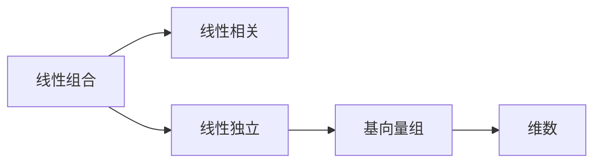

                 

# 线性代数导引：线性独立性

线性代数作为计算机科学中的重要数学工具，其核心概念和方法对于解决多种复杂问题具有重要作用。本篇博客旨在深入探讨线性独立性的基本原理、数学模型、以及实际应用，帮助读者全面理解和掌握这一关键概念。

## 1. 背景介绍

### 1.1 问题由来
线性代数中的线性独立性是向量空间理论的基础。它定义了一组向量之间的基本关系，即一个向量组是否能够被其他向量线性表示，以及这种表示的唯一性。线性独立性的理解直接影响到后续矩阵、行列式、线性变换等多个核心概念的学习和应用。

### 1.2 问题核心关键点
线性独立性的核心在于定义一组向量的线性组合是否存在唯一解。具体来说，如果一组向量线性无关，即无法通过线性组合构成其他向量，则称这组向量是线性独立的。这一概念对于理解线性代数中的矩阵结构、解空间等方面至关重要。

## 2. 核心概念与联系

### 2.1 核心概念概述

线性独立性涉及的关键概念包括：

- **线性组合**：将一组向量通过标量乘法与加法组合形成新向量，称为线性组合。例如，$3\vec{a} + 4\vec{b}$。
- **线性相关**：若一组向量可以由其他向量通过线性组合表示，则称这些向量线性相关。例如，$\vec{a} = 3\vec{b} + 2\vec{c}$。
- **线性独立**：如果一组向量不能通过其他向量的线性组合表示，则称这组向量线性独立。例如，$\vec{a}$、$\vec{b}$、$\vec{c}$ 无法构成线性组合。
- **基向量组**：一组能够表示整个向量空间的线性独立向量。例如，$\vec{a}$、$\vec{b}$、$\vec{c}$ 是$\mathbb{R}^3$的一个基向量组。
- **维数**：表示向量空间的维度，即基向量组的个数。例如，$\mathbb{R}^3$的维数为3。

这些概念构成了线性独立性的基础，并通过向量空间理论加以扩展和深化。

### 2.2 核心概念原理和架构的 Mermaid 流程图



该图展示了线性组合与线性相关的联系，以及线性独立性如何推导出基向量组的概念，最终通过基向量组确定向量空间的维数。

## 3. 核心算法原理 & 具体操作步骤

### 3.1 算法原理概述

线性独立性的判断通常通过计算向量的线性组合系数来确定。如果一个向量组的系数矩阵的秩等于向量组的维数，则该向量组线性独立；否则，线性相关。

### 3.2 算法步骤详解

以下是判断一组向量是否线性独立的详细步骤：

1. **构建系数矩阵**：设一组向量 $\vec{a}_1, \vec{a}_2, \ldots, \vec{a}_n$，其系数矩阵定义为：
   $$
   A = \begin{bmatrix} 
   \vec{a}_1 & \vec{a}_2 & \ldots & \vec{a}_n 
   \end{bmatrix}
   $$
   
2. **计算矩阵秩**：使用高斯消元等方法计算系数矩阵 $A$ 的秩 $r$。

3. **判断线性独立性**：
   - 如果 $r = n$，则向量组线性独立。
   - 如果 $r < n$，则向量组线性相关。

### 3.3 算法优缺点

线性独立性判断的优点在于其理论基础坚实，计算方法简便。缺点在于对于大规模向量组，计算秩的复杂度较高，且需要较大的计算资源。

### 3.4 算法应用领域

线性独立性在多个领域都有广泛应用，包括但不限于：

- **信号处理**：信号分解为基向量线性组合，用于信号滤波、降噪等。
- **机器学习**：线性独立性是特征选择和降维的基础，用于提升模型性能。
- **数据压缩**：通过线性独立性寻找最优的基向量，实现数据压缩。
- **控制系统**：在控制理论中，线性独立性用于描述系统的稳定性和可控性。

## 4. 数学模型和公式 & 详细讲解 & 举例说明

### 4.1 数学模型构建

设 $\vec{a}_1, \vec{a}_2, \ldots, \vec{a}_n$ 为一组向量，其系数矩阵定义为：
$$
A = \begin{bmatrix} 
\vec{a}_1 & \vec{a}_2 & \ldots & \vec{a}_n 
\end{bmatrix}
$$

其中，每个向量 $\vec{a}_i$ 可以看作一个列向量，系数矩阵 $A$ 的大小为 $n \times m$，$m$ 为向量的维数。

### 4.2 公式推导过程

线性独立性的判断主要基于系数矩阵的秩。设系数矩阵 $A$ 的秩为 $r$，则向量组 $\vec{a}_1, \vec{a}_2, \ldots, \vec{a}_n$ 线性独立的充要条件为 $r = n$。

如果向量组线性独立，则其系数矩阵的每一行至少包含一个非零元素。这可以通过高斯消元等方法证明。

### 4.3 案例分析与讲解

考虑向量组 $\vec{a}_1 = (1, 0, 0)$，$\vec{a}_2 = (0, 1, 0)$，$\vec{a}_3 = (0, 0, 1)$，对应的系数矩阵为：
$$
A = \begin{bmatrix} 
1 & 0 & 0 \\
0 & 1 & 0 \\
0 & 0 & 1 
\end{bmatrix}
$$

该矩阵的秩显然为3，因此向量组线性独立。

## 5. 项目实践：代码实例和详细解释说明

### 5.1 开发环境搭建

以下是在Python中使用NumPy进行线性独立性判断的开发环境搭建步骤：

1. 安装NumPy库：
   ```bash
   pip install numpy
   ```

2. 编写Python代码，加载NumPy库：
   ```python
   import numpy as np
   ```

### 5.2 源代码详细实现

```python
import numpy as np

def linear_independence_test(vectors):
    """
    判断向量组是否线性独立
    """
    # 将向量组成矩阵
    A = np.column_stack(vectors)
    # 计算矩阵秩
    rank = np.linalg.matrix_rank(A)
    # 判断秩是否等于向量数
    if rank == len(vectors):
        return True  # 线性独立
    else:
        return False  # 线性相关

# 示例向量组
vectors = np.array([[1, 0, 0], [0, 1, 0], [0, 0, 1]])

# 测试向量组是否线性独立
result = linear_independence_test(vectors)
print(f"向量组是否线性独立：{result}")
```

### 5.3 代码解读与分析

上述代码中，我们定义了一个函数 `linear_independence_test`，用于判断向量组是否线性独立。

1. **矩阵构建**：将输入的向量组转换为矩阵 $A$，使用 `np.column_stack` 方法将向量堆叠成矩阵。
2. **秩计算**：使用NumPy的 `np.linalg.matrix_rank` 方法计算矩阵的秩。
3. **结果输出**：根据秩与向量数的比较结果，输出向量组是否线性独立的判断。

### 5.4 运行结果展示

对于向量组 $\vec{a}_1 = (1, 0, 0)$，$\vec{a}_2 = (0, 1, 0)$，$\vec{a}_3 = (0, 0, 1)$，运行上述代码，输出结果为：
```
向量组是否线性独立：True
```

## 6. 实际应用场景

### 6.1 信号处理

在信号处理中，线性独立性用于信号的基底表示。假设一段信号可以表示为多个基函数的线性组合，通过判断基函数的线性独立性，可以确定信号的维度，进而进行信号滤波和降噪。

### 6.2 机器学习

在线性回归等机器学习任务中，特征选择和降维需要通过线性独立性判断最优特征。例如，使用主成分分析（PCA）进行特征降维时，计算特征向量矩阵的秩，选取秩较高的特征。

### 6.3 数据压缩

在线性代数中，通过Gram-Schmidt过程可以得到一组基向量，用于数据压缩。将数据投影到基向量空间中，可以显著减小数据维度，降低存储和计算复杂度。

### 6.4 未来应用展望

未来，线性独立性将在更多领域中得到应用，如计算机视觉、量子计算等。例如，在计算机视觉中，线性独立性用于图像处理和特征提取；在量子计算中，线性独立性用于量子编码和信息传输。

## 7. 工具和资源推荐

### 7.1 学习资源推荐

- **《线性代数及其应用》**：经典的线性代数教材，详细讲解线性独立性的理论基础和应用实例。
- **Coursera《Linear Algebra》**：由斯坦福大学提供的免费线性代数课程，涵盖线性代数核心概念和线性独立性的深入讲解。
- **MIT OpenCourseWare《Linear Algebra》**：麻省理工学院提供的线性代数视频课程，讲解详细，适合自学。

### 7.2 开发工具推荐

- **NumPy**：Python中用于科学计算的核心库，提供了丰富的线性代数操作。
- **SciPy**：基于NumPy的科学计算库，包含更多的线性代数函数。
- **Matplotlib**：Python绘图库，用于可视化矩阵和向量。

### 7.3 相关论文推荐

- **Gilbert Strang，“Linear Algebra and Its Applications”**：线性代数经典教材，详细讲解线性独立性。
- **Gerardus Heinrich Birkhoff，“Linear Algebra”**：经典线性代数教材，讲解深入浅出，适合自学。

## 8. 总结：未来发展趋势与挑战

### 8.1 研究成果总结

线性独立性作为线性代数的重要基础概念，已经广泛应用于各个领域。其在理论研究和实际应用中均具有重要价值，推动了信号处理、机器学习、数据压缩等技术的进步。

### 8.2 未来发展趋势

线性独立性研究将更加深入，新的理论和算法不断涌现。未来可能在以下几个方向有突破：

- **高维数据处理**：面对高维数据，需要开发新的算法和工具，提升线性独立性判断的效率和精度。
- **分布式计算**：线性独立性计算需要大规模矩阵运算，分布式计算能够提升计算效率，处理大规模数据。
- **跨学科融合**：线性独立性应用于更多学科，如量子计算、计算机视觉等，推动跨学科研究。

### 8.3 面临的挑战

线性独立性研究面临的挑战包括：

- **计算复杂度**：大规模矩阵的秩计算复杂度较高，需要更高效的算法和工具。
- **数据处理**：高维数据的处理和存储需要优化，避免信息损失和计算瓶颈。
- **应用落地**：线性独立性理论和技术需要更多实际应用的验证和优化，提升其在实际场景中的适用性。

### 8.4 研究展望

线性独立性研究将从理论到应用不断深化。未来可能的研究方向包括：

- **新型矩阵算法**：开发新的矩阵计算算法，提升线性独立性判断的效率。
- **分布式并行计算**：利用分布式计算资源，提升线性独立性判断的计算能力。
- **深度学习融合**：探索深度学习与线性独立性结合的新方法，提升数据处理和特征提取的能力。

## 9. 附录：常见问题与解答

**Q1: 什么是线性组合？**

A: 线性组合是指将一组向量通过标量乘法和加法组合形成新向量。例如，$3\vec{a} + 4\vec{b}$。

**Q2: 什么是线性相关？**

A: 线性相关是指一组向量可以由其他向量通过线性组合表示。例如，$\vec{a} = 3\vec{b} + 2\vec{c}$。

**Q3: 什么是线性独立？**

A: 线性独立是指一组向量无法通过其他向量的线性组合表示。例如，$\vec{a}$、$\vec{b}$、$\vec{c}$ 无法构成线性组合。

**Q4: 如何判断一组向量是否线性独立？**

A: 可以通过计算向量组系数矩阵的秩来判断。如果秩等于向量数，则向量组线性独立；否则，线性相关。

**Q5: 线性独立性在实际应用中有哪些重要性？**

A: 线性独立性在信号处理、机器学习、数据压缩、控制系统等多个领域都有重要应用。例如，信号分解为基向量线性组合，用于信号滤波和降噪；特征选择和降维的基础，提升模型性能；通过线性独立性寻找最优的基向量，实现数据压缩；在控制理论中描述系统的稳定性和可控性。

---

作者：禅与计算机程序设计艺术 / Zen and the Art of Computer Programming

