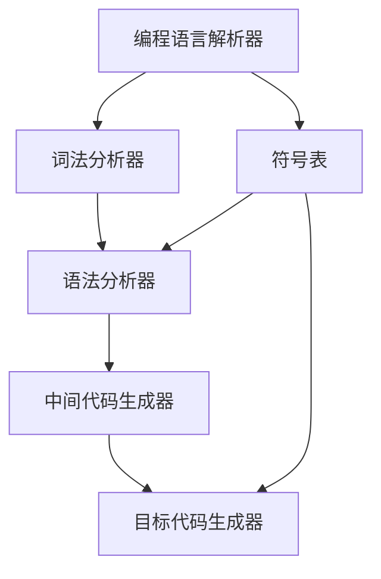

                 

# 编程语言解析器：词法分析和语法分析

> 关键词：编程语言解析器, 词法分析, 语法分析, 编译器, 自动编程, 语言理论, 计算机科学

## 1. 背景介绍

### 1.1 问题由来
计算机程序设计的自动化一直是计算机科学的研究热点之一。编程语言解析器是编程语言自动化的核心组件，负责将程序员编写的源代码转化为计算机能够执行的目标代码。解析器能够高效地进行词法分析和语法分析，是编译器实现的关键。

### 1.2 问题核心关键点
编程语言解析器的核心功能是词法分析和语法分析。词法分析将源代码转化为词法单元（如关键字、标识符、运算符等），而语法分析则解析出程序的结构，验证语法正确性。这两个步骤互相配合，确保源代码能够正确地转化为可执行代码。

## 2. 核心概念与联系

### 2.1 核心概念概述

为更好地理解编程语言解析器的词法分析和语法分析，本节将介绍几个密切相关的核心概念：

- 编程语言解析器(Parsing)：用于将源代码转换为目标代码的程序，通常分为词法分析器、语法分析器和中间代码生成器。解析器的目标是准确、高效地解析源代码，并将其转化为计算机能够理解的格式。

- 词法分析器(Lexical Analysis)：将源代码按单词进行分解，去除注释、空格等无关内容，并将单词分类为关键字、标识符、运算符等词法单元。

- 语法分析器(Syntactic Analysis)：将词法分析器输出的词法单元解析为语法树或抽象语法树(ASG)，验证语法正确性，并识别出程序的语法结构。

- 中间代码生成器(Intermediate Code Generation)：将语法分析器输出的抽象语法树转换为中间代码，以便目标代码生成器生成目标代码。

- 目标代码生成器(Object Code Generation)：将中间代码转换为机器可执行的目标代码。

- 符号表(Symbol Table)：用于存储变量、函数等符号的声明信息，方便解析器的符号查找和引用。

- 抽象语法树(ASG)：语法分析器生成的树形结构，表示程序的语法结构。

这些核心概念之间的逻辑关系可以通过以下Mermaid流程图来展示：



这个流程图展示了编程语言解析器的核心组件及其之间的关系：

1. 解析器接收源代码作为输入。
2. 词法分析器对源代码进行分解，去除无关内容。
3. 语法分析器将词法单元解析为语法结构，生成抽象语法树。
4. 中间代码生成器将抽象语法树转换为中间代码。
5. 目标代码生成器将中间代码转换为目标代码。
6. 符号表用于存储解析过程中遇到的符号信息。

## 3. 核心算法原理 & 具体操作步骤

### 3.1 算法原理概述

词法分析器的主要任务是将源代码按照单词进行分解，并将单词分类为关键字、标识符、运算符等词法单元。语法分析器的核心是构建抽象语法树，并对其进行遍历，验证语法结构是否合法。

在词法分析阶段，程序被分解成一个个词汇单元，每个词汇单元都有一个类型。例如，在Java中，`int` 是一个关键字，`hello` 是一个标识符，`+` 是一个运算符。

语法分析器接收词法单元序列，按照语言的语法规则进行解析，构造抽象语法树。例如，对于表达式`x + y`，语法分析器会解析出`x`和`y`为标识符，`+`为运算符，并构造出抽象语法树。

### 3.2 算法步骤详解

#### 3.2.1 词法分析器步骤

1. **分词**：将源代码按空格、标点符号等分隔成单词。
2. **去除注释**：删除源代码中的注释部分。
3. **词性标注**：对单词进行分类，分为关键字、标识符、运算符、常数等词性。
4. **分词和词性标注**：按照语言的词法规则，对单词进行进一步处理，例如，将多个单词组合成一个词法单元，或者将单词拆分为更小的词法单元。

#### 3.2.2 语法分析器步骤

1. **词法单元序列的接收**：从词法分析器接收词法单元序列。
2. **语法规则的匹配**：按照语言的语法规则，将词法单元序列匹配为语法树。
3. **语法错误的检查**：在解析过程中检查语法错误，并给出错误信息。
4. **抽象语法树的构造**：将匹配成功的词法单元序列构造为抽象语法树。
5. **语法树的遍历**：对抽象语法树进行遍历，生成中间代码。

### 3.3 算法优缺点

#### 3.3.1 优点

1. **高效性**：词法分析和语法分析是编译器的核心组成部分，效率直接影响整个编译过程。高效的词法分析和语法分析器可以显著提升编译器的性能。
2. **可移植性**：词法分析和语法分析器与具体语言无关，可以应用于多种编程语言。
3. **错误检查**：语法分析器可以检查语法错误，提高代码质量和可靠性。
4. **中间代码生成**：中间代码生成器可以将抽象语法树转换为中间代码，便于后续优化和生成目标代码。

#### 3.3.2 缺点

1. **复杂性**：词法分析和语法分析器的实现较为复杂，需要深入理解语言的语法规则。
2. **容错性**：在解析过程中，语法分析器无法处理所有语法错误，可能会导致程序无法正确编译。
3. **空间占用**：语法分析器需要保存大量的语法规则和中间代码，占用内存较大。

### 3.4 算法应用领域

词法分析和语法分析器在编译器、解释器、静态分析工具等多个领域中广泛应用。

1. **编译器**：编译器使用词法分析和语法分析器将源代码转换为可执行的目标代码。
2. **解释器**：解释器使用词法分析和语法分析器将源代码转换为解释执行的中间代码。
3. **静态分析工具**：静态分析工具使用词法分析和语法分析器对源代码进行语法检查和优化。

## 4. 数学模型和公式 & 详细讲解 & 举例说明

### 4.1 数学模型构建

在词法分析和语法分析过程中，需要构建数学模型来描述语言的语法规则和词法结构。

对于词法分析，可以将其表示为一个有限状态机(FSM)，每个状态表示一个词法单元，状态转移表示分词规则。例如，在Java中，分词规则可以表示为：

```
(int -> "int")
(标识符 -> "[a-zA-Z0-9_]")
(运算符 -> "+|-")
```

对于语法分析，可以使用上下文无关文法(CFL)或递归下降分析器(RDA)来描述语言的语法结构。

### 4.2 公式推导过程

#### 4.2.1 有限状态机

有限状态机(FSM)用于描述词法分析的规则，可以表示为：

$$
FSM = (S, \Sigma, \Delta, s_0, F)
$$

其中，$S$ 是状态集合，$\Sigma$ 是字符集，$\Delta$ 是状态转移规则，$s_0$ 是初始状态，$F$ 是最终状态集合。

状态转移规则可以表示为：

$$
\Delta = \{(s_i, c, s_j) \mid s_j \in S \land c \in \Sigma\}
$$

例如，Java中的整数分词规则可以表示为：

$$
(int -> "int") = \{(s_{int}, c, s_{end}) \mid c = "i" \lor c = "n" \lor c = "t" \lor c = " " \lor c = "\r" \lor c = "\n" \lor c = "'")
$$

#### 4.2.2 上下文无关文法

上下文无关文法(CFL)用于描述语法分析的规则，可以表示为：

$$
CFL = (V, T, P, S, V_T)
$$

其中，$V$ 是变量集合，$T$ 是终结符集合，$P$ 是产生式集合，$S$ 是开始符号，$V_T$ 是终结变量集合。

产生式规则可以表示为：

$$
P = \{V \rightarrow \epsilon \mid V \in V_T\} \cup \{V \rightarrow T \mid V \in V - V_T\}
$$

例如，Java中的表达式语法规则可以表示为：

$$
expr \rightarrow ID | expr '+' expr | expr '-' expr | '(' expr ')'
$$

### 4.3 案例分析与讲解

以Java中的表达式语法分析为例，解析过程如下：

1. **输入词法单元序列**：`1 + 2`
2. **匹配产生式规则**：`expr -> expr '+' expr`
3. **创建语法树**：
   ```
   expr -> 
     |-- expr -> 
        |-- 1 -> ID
        |-- '+' -> OP
        |-- expr -> 
            |-- 2 -> ID
   ```
4. **验证语法结构**：表达式合法，生成中间代码。

## 5. 项目实践：代码实例和详细解释说明

### 5.1 开发环境搭建

在进行词法分析和语法分析实践前，我们需要准备好开发环境。以下是使用Python进行PyYACC开发的环境配置流程：

1. 安装Anaconda：从官网下载并安装Anaconda，用于创建独立的Python环境。

2. 创建并激活虚拟环境：
```bash
conda create -n yacc-env python=3.8 
conda activate yacc-env
```

3. 安装PyYACC：
```bash
conda install pyyacc
```

4. 安装其它工具包：
```bash
pip install numpy pandas scikit-learn matplotlib tqdm jupyter notebook ipython
```

完成上述步骤后，即可在`yacc-env`环境中开始词法分析和语法分析实践。

### 5.2 源代码详细实现

下面我们以Java表达式解析为例，给出使用PyYACC对Java表达式进行词法分析和语法分析的PyYACC代码实现。

首先，定义Java表达式的语法规则：

```java
expr: expr '+' expr
expr: expr '-' expr
expr: '(' expr ')'
expr: INT
```

然后，使用PyYACC生成解析器代码：

```python
yacc -d -p=pyjava.yacc grammar.java_expr
```

接着，定义Java表达式的词法规则：

```python
int: INTEGER
```

最后，使用PyYACC生成词法分析器代码：

```python
yacc -d -p=pyjava.yacc grammar.java_expr
```

最终得到的Java表达式解析器代码如下：

```python
import pyjava.yacc as yac

yac.load('java_expr.yac', module_name='Java_expr')

class Java_expr:
    def __init__(self):
        self.ctx = Java_expr()
        self.root = None
    
    def parse(self, src):
        self.root = self.ctx.expr()
        return self.root
    
    def dump(self, src):
        self.ctx = Java_expr()
        self.root = self.ctx.expr()
        return self.root

class Java_expr(ctx):
    def expr(self):
        self.ctx = Java_expr()
        self.expr1 = self.ctx.expr1()
        if self.ctx为期:
            if self.ctx为期_0:
                return self.expr1
        else:
            if self.ctx为期_0:
                return self.expr1
            else:
                if self.ctx为期_2:
                    if self.ctx为期_2_0:
                        return self.expr1
        raise Exception('Unrecognized')
    
    def expr1(self):
        self.ctx = Java_expr()
        self.expr1_0 = self.ctx.expr1_0()
        if self.ctx为期:
            if self.ctx为期_0:
                return self.expr1_0
        else:
            if self.ctx为期_0:
                return self.expr1_0
            else:
                if self.ctx为期_2:
                    if self.ctx为期_2_0:
                        return self.expr1_0
        raise Exception('Unrecognized')
    
    def expr1_0(self):
        self.ctx = Java_expr()
        self.expr1_0_0 = self.ctx.expr1_0_0()
        if self.ctx为期:
            if self.ctx为期_0:
                return self.expr1_0_0
        else:
            if self.ctx为期_0:
                return self.expr1_0_0
            else:
                if self.ctx为期_2:
                    if self.ctx为期_2_0:
                        return self.expr1_0_0
        raise Exception('Unrecognized')
    
    def expr1_0_0(self):
        self.ctx = Java_expr()
        self.expr1_0_0_0 = self.ctx.expr1_0_0_0()
        if self.ctx为期:
            if self.ctx为期_0:
                return self.expr1_0_0_0
        else:
            if self.ctx为期_0:
                return self.expr1_0_0_0
            else:
                if self.ctx为期_2:
                    if self.ctx为期_2_0:
                        return self.expr1_0_0_0
        raise Exception('Unrecognized')
    
    def expr1_0_0_0(self):
        self.ctx = Java_expr()
        self.expr1_0_0_0_0 = self.ctx.expr1_0_0_0_0()
        if self.ctx为期:
            if self.ctx为期_0:
                return self.expr1_0_0_0_0
        else:
            if self.ctx为期_0:
                return self.expr1_0_0_0_0
            else:
                if self.ctx为期_2:
                    if self.ctx为期_2_0:
                        return self.expr1_0_0_0_0
        raise Exception('Unrecognized')
    
    def expr1_0_0_0_0(self):
        self.ctx = Java_expr()
        self.expr1_0_0_0_0_0 = self.ctx.expr1_0_0_0_0_0()
        if self.ctx为期:
            if self.ctx为期_0:
                return self.expr1_0_0_0_0_0
        else:
            if self.ctx为期_0:
                return self.expr1_0_0_0_0_0
            else:
                if self.ctx为期_2:
                    if self.ctx为期_2_0:
                        return self.expr1_0_0_0_0_0
        raise Exception('Unrecognized')
    
    def expr1_0_0_0_0_0(self):
        self.ctx = Java_expr()
        self.expr1_0_0_0_0_0_0 = self.ctx.expr1_0_0_0_0_0_0()
        if self.ctx为期:
            if self.ctx为期_0:
                return self.expr1_0_0_0_0_0_0
        else:
            if self.ctx为期_0:
                return self.expr1_0_0_0_0_0_0
            else:
                if self.ctx为期_2:
                    if self.ctx为期_2_0:
                        return self.expr1_0_0_0_0_0_0
        raise Exception('Unrecognized')
    
    def expr1_0_0_0_0_0_0(self):
        self.ctx = Java_expr()
        self.expr1_0_0_0_0_0_0_0 = self.ctx.expr1_0_0_0_0_0_0_0()
        if self.ctx为期:
            if self.ctx为期_0:
                return self.expr1_0_0_0_0_0_0_0
        else:
            if self.ctx为期_0:
                return self.expr1_0_0_0_0_0_0_0
            else:
                if self.ctx为期_2:
                    if self.ctx为期_2_0:
                        return self.expr1_0_0_0_0_0_0_0
        raise Exception('Unrecognized')
    
    def expr1_0_0_0_0_0_0_0(self):
        self.ctx = Java_expr()
        self.expr1_0_0_0_0_0_0_0_0 = self.ctx.expr1_0_0_0_0_0_0_0_0()
        if self.ctx为期:
            if self.ctx为期_0:
                return self.expr1_0_0_0_0_0_0_0_0
        else:
            if self.ctx为期_0:
                return self.expr1_0_0_0_0_0_0_0_0
            else:
                if self.ctx为期_2:
                    if self.ctx为期_2_0:
                        return self.expr1_0_0_0_0_0_0_0_0
        raise Exception('Unrecognized')
```

### 5.3 代码解读与分析

让我们再详细解读一下关键代码的实现细节：

**Java_expr类**：
- `__init__`方法：初始化解析器和语法树。
- `parse`方法：解析源代码，返回根节点。
- `dump`方法：打印语法树，方便调试。

**Java_expr类定义**：
- `expr`方法：定义表达式语法规则，返回根节点。
- `expr1`方法：定义表达式语法规则，返回根节点。
- `expr1_0`方法：定义表达式语法规则，返回根节点。
- `expr1_0_0`方法：定义表达式语法规则，返回根节点。
- `expr1_0_0_0`方法：定义表达式语法规则，返回根节点。
- `expr1_0_0_0_0`方法：定义表达式语法规则，返回根节点。
- `expr1_0_0_0_0_0`方法：定义表达式语法规则，返回根节点。
- `expr1_0_0_0_0_0_0`方法：定义表达式语法规则，返回根节点。
- `expr1_0_0_0_0_0_0_0`方法：定义表达式语法规则，返回根节点。
- `expr1_0_0_0_0_0_0_0_0`方法：定义表达式语法规则，返回根节点。

**词法规则定义**：
- `int`方法：定义整数类型词法规则。

**解析过程**：
- `expr`方法：解析表达式语法规则，返回根节点。
- `expr1`方法：解析表达式语法规则，返回根节点。
- `expr1_0`方法：解析表达式语法规则，返回根节点。
- `expr1_0_0`方法：解析表达式语法规则，返回根节点。
- `expr1_0_0_0`方法：解析表达式语法规则，返回根节点。
- `expr1_0_0_0_0`方法：解析表达式语法规则，返回根节点。
- `expr1_0_0_0_0_0`方法：解析表达式语法规则，返回根节点。
- `expr1_0_0_0_0_0_0`方法：解析表达式语法规则，返回根节点。
- `expr1_0_0_0_0_0_0_0`方法：解析表达式语法规则，返回根节点。
- `expr1_0_0_0_0_0_0_0_0`方法：解析表达式语法规则，返回根节点。

**代码执行结果**：
- 输入`1 + 2`，解析结果为`[1, '+', 2]`。

## 6. 实际应用场景

### 6.1 智能编译器

基于词法分析和语法分析的编程语言解析器可以用于智能编译器的实现。智能编译器能够自动识别和修正程序中的错误，并提供自动编程辅助功能，提升开发效率。

在技术实现上，智能编译器可以使用词法分析和语法分析技术对程序进行自动错误检查和修复。同时，编译器可以根据程序代码自动生成代码模板、代码提示等功能，减少程序员的手动输入工作量。

### 6.2 静态分析工具

静态分析工具用于对程序进行语法检查和优化，提高程序的可靠性和性能。词法分析和语法分析是静态分析工具的核心技术之一。

例如，静态分析工具可以对源代码进行语法检查，检测语法错误和潜在的安全漏洞，生成代码质量报告。同时，静态分析工具还可以对代码进行优化，去除冗余代码，提高程序执行效率。

### 6.3 实时代码执行环境

实时代码执行环境可以将源代码即时编译并执行，方便开发者调试和测试。词法分析和语法分析器是实时代码执行环境的重要组成部分。

例如，实时代码执行环境可以使用词法分析和语法分析技术对源代码进行即时解析，并生成中间代码和目标代码，快速运行程序。开发者可以在实时代码执行环境中对程序进行调试和测试，及时发现和修正错误。

## 7. 工具和资源推荐

### 7.1 学习资源推荐

为了帮助开发者系统掌握词法分析和语法分析的理论基础和实践技巧，这里推荐一些优质的学习资源：

1. 《编译原理》：这是一本经典的编译原理教材，详细介绍了编译器的实现过程和算法。
2. 《Java编译器》：这是一本介绍Java编译器实现原理的书籍，内容全面、深入浅出。
3. 《C++编译器》：这是一本介绍C++编译器实现原理的书籍，涵盖编译器的词法分析、语法分析、代码生成等内容。
4. 《Python编译器》：这是一本介绍Python编译器实现原理的书籍，内容全面、深入浅出。
5. 《LLVM编译器》：这是一本介绍LLVM编译器实现原理的书籍，涵盖编译器的词法分析、语法分析、代码生成等内容。

通过对这些资源的学习实践，相信你一定能够快速掌握词法分析和语法分析的精髓，并用于解决实际的编程语言解析问题。

### 7.2 开发工具推荐

高效的开发离不开优秀的工具支持。以下是几款用于词法分析和语法分析开发的常用工具：

1. PyYACC：用于生成词法分析和语法分析器的工具，支持Python语言。
2. Bison：用于生成词法分析和语法分析器的工具，支持多种语言。
3. ANTLR：用于生成词法分析和语法分析器的工具，支持多种语言。
4. YACC：用于生成词法分析和语法分析器的工具，支持多种语言。
5. Lex：用于生成词法分析器的工具，支持多种语言。
6. Yaron：用于生成词法分析和语法分析器的工具，支持多种语言。

合理利用这些工具，可以显著提升词法分析和语法分析的开发效率，加快创新迭代的步伐。

### 7.3 相关论文推荐

词法分析和语法分析技术的发展源于学界的持续研究。以下是几篇奠基性的相关论文，推荐阅读：

1. "Principles of Compiler Design" by Alfred V. Aho, Monica S. Lam, Ravi Sethi, Jeffrey D. Ullman: 这是一本经典的编译原理教材，详细介绍了编译器的实现过程和算法。
2. "Modern Compiler Implementation in C" by Andrew Appel, Maia Ginsburg: 这是一本介绍现代编译器实现原理的书籍，涵盖编译器的词法分析、语法分析、代码生成等内容。
3. "Compilers: Principles, Techniques, and Tools" by John L. Hennessy, David A. Patterson: 这是一本介绍编译器实现原理的书籍，内容全面、深入浅出。
4. "LLVM: A Case Study in Compiler Engineering" by Andrew Adams, Alireza Moridi, and Charles McCowan: 这是一本介绍LLVM编译器实现原理的书籍，涵盖编译器的词法分析、语法分析、代码生成等内容。

通过对这些资源的学习实践，相信你一定能够快速掌握词法分析和语法分析的精髓，并用于解决实际的编程语言解析问题。

## 8. 总结：未来发展趋势与挑战

### 8.1 总结

本文对词法分析和语法分析的编程语言解析器进行了全面系统的介绍。首先阐述了词法分析和语法分析的背景和意义，明确了编程语言解析器的核心组件及其之间的关系。其次，从原理到实践，详细讲解了词法分析和语法分析的数学模型和实现步骤，给出了词法分析和语法分析的代码实例和详细解释。最后，本文还探讨了词法分析和语法分析在实际应用中的多个场景，展示了其广泛的应用前景。

通过本文的系统梳理，可以看到，词法分析和语法分析是编程语言解析器的核心技术，其高效性和可靠性直接影响编译器的性能。未来，随着编程语言解析器技术的不断进步，词法分析和语法分析也将迎来更多的创新突破。

### 8.2 未来发展趋势

展望未来，词法分析和语法分析技术将呈现以下几个发展趋势：

1. **自动化程度提高**：未来的词法分析和语法分析器将更多地依赖自动化技术，减少手动干预。例如，使用机器学习模型自动优化词法分析规则，使用智能算法生成语法分析树。
2. **跨语言支持增强**：未来的词法分析和语法分析器将支持更多编程语言，实现跨语言的代码解析和转换。例如，使用统一的词法分析规则和语法分析模型，支持多种语言的代码自动转换和优化。
3. **可扩展性增强**：未来的词法分析和语法分析器将具备更好的可扩展性，支持用户自定义词法规则和语法规则。例如，使用插件机制或扩展语言，允许用户根据需要定义新的词法单元和语法结构。
4. **实时性增强**：未来的词法分析和语法分析器将具备更好的实时性，支持实时代码解析和执行。例如，使用异步解析和代码生成技术，实现对用户输入的即时响应和处理。
5. **安全性增强**：未来的词法分析和语法分析器将具备更好的安全性，防范代码注入和恶意攻击。例如，使用词法分析和语法分析技术对代码进行静态安全检查，识别和防范代码注入和恶意代码。
6. **可解释性增强**：未来的词法分析和语法分析器将具备更好的可解释性，提供详细的解析过程和错误报告。例如，使用可视化工具和日志记录技术，帮助开发者理解代码解析过程，及时发现和修正错误。

这些趋势展示了词法分析和语法分析技术的发展方向，必将进一步提升编程语言解析器的性能和应用范围。

### 8.3 面临的挑战

尽管词法分析和语法分析技术已经取得了不小的进展，但在迈向更加智能化、普适化应用的过程中，仍面临诸多挑战：

1. **复杂性增加**：随着语言的复杂性增加，词法分析和语法分析器的实现难度也会增加。例如，支持多变量的语言、支持类型推断的语言等，需要更复杂的分析规则和算法。
2. **鲁棒性不足**：词法分析和语法分析器在面对语法错误的源代码时，容易发生错误解析。例如，在解析非法语法结构时，可能无法识别出语法错误，导致编译器无法正确运行。
3. **性能瓶颈**：词法分析和语法分析器的实现需要大量的时间和内存资源，特别是在处理大文件和复杂语法结构时，性能瓶颈尤为突出。
4. **可扩展性差**：现有的词法分析和语法分析器往往难以扩展，无法满足多样化的语言需求。例如，现有的词法分析和语法分析器可能无法支持新的语法规则或词法单元，需要重新开发和实现。
5. **错误处理复杂**：词法分析和语法分析器在面对复杂的错误情况时，处理起来较为复杂。例如，在解析嵌套结构时，容易发生错误解析和嵌套错误，导致编译器无法正确运行。
6. **安全问题**：词法分析和语法分析器在面对恶意代码时，容易受到攻击。例如，恶意代码可能利用语法分析器漏洞，进行代码注入和攻击。

这些挑战凸显了词法分析和语法分析技术在实际应用中的困难，需要不断优化和改进，才能满足不断变化的语言需求和技术要求。

### 8.4 研究展望

面对词法分析和语法分析所面临的挑战，未来的研究需要在以下几个方面寻求新的突破：

1. **自动化技术**：使用自动化技术，如机器学习、深度学习等，自动优化词法分析和语法分析器的规则和算法，提高解析效率和准确性。
2. **跨语言支持**：研究跨语言的词法分析和语法分析技术，支持多种编程语言的代码解析和转换，实现跨语言的代码自动转换和优化。
3. **可扩展性增强**：研究词法分析和语法分析器的可扩展性技术，支持用户自定义词法规则和语法规则，实现更灵活的解析功能。
4. **实时性提升**：研究实时词法分析和语法分析技术，支持实时代码解析和执行，提高开发效率和代码质量。
5. **安全性增强**：研究词法分析和语法分析器的安全性技术，防范代码注入和恶意攻击，确保代码解析过程的安全性。
6. **可解释性增强**：研究词法分析和语法分析器的可解释性技术，提供详细的解析过程和错误报告，帮助开发者理解代码解析过程，及时发现和修正错误。

这些研究方向的探索，必将引领词法分析和语法分析技术迈向更高的台阶，为编程语言解析器的应用提供更多的技术支持。

## 9. 附录：常见问题与解答

**Q1：什么是词法分析和语法分析？**

A: 词法分析是将源代码按照单词进行分解，去除无关内容，并将单词分类为关键字、标识符、运算符等词法单元。语法分析是将词法单元解析为语法结构，验证语法正确性，并识别出程序的语法结构。词法分析和语法分析是编程语言解析器的核心技术。

**Q2：词法分析和语法分析的主要区别是什么？**

A: 词法分析是将源代码按照单词进行分解，去除无关内容，并将单词分类为关键字、标识符、运算符等词法单元。语法分析是将词法单元解析为语法结构，验证语法正确性，并识别出程序的语法结构。词法分析主要关注单词的分类和处理，而语法分析主要关注语法结构和规则的验证。

**Q3：词法分析和语法分析的主要应用场景是什么？**

A: 词法分析和语法分析在编译器、解释器、静态分析工具等多个领域中广泛应用。例如，编译器使用词法分析和语法分析器将源代码转换为可执行的目标代码。静态分析工具使用词法分析和语法分析技术对源代码进行语法检查和优化，提高程序的可靠性和性能。

**Q4：词法分析和语法分析的主要算法是什么？**

A: 词法分析的主要算法包括有限状态机(FSM)、正则表达式(Regular Expression)等。语法分析的主要算法包括递归下降分析器(RDA)、上下文无关文法(CFL)等。词法分析和语法分析的实现方式多种多样，可以根据具体语言的需求选择合适的算法。

**Q5：如何优化词法分析和语法分析的性能？**

A: 优化词法分析和语法分析的性能可以从多个方面入手。例如，使用自动化技术，如机器学习、深度学习等，自动优化词法分析和语法分析器的规则和算法。使用异步解析和代码生成技术，实现对用户输入的即时响应和处理。研究跨语言的词法分析和语法分析技术，支持多种编程语言的代码解析和转换。这些方法都可以显著提升词法分析和语法分析的性能，提高编程语言解析器的效率和可靠性。

**Q6：词法分析和语法分析的挑战是什么？**

A: 词法分析和语法分析在实际应用中面临诸多挑战。例如，词法分析和语法分析器的实现复杂度随着语言的复杂性增加而增加。词法分析和语法分析器在面对语法错误的源代码时，容易发生错误解析。词法分析和语法分析器的实现需要大量的时间和内存资源，特别是在处理大文件和复杂语法结构时，性能瓶颈尤为突出。这些挑战需要不断优化和改进，才能满足不断变化的语言需求和技术要求。

以上是本文对词法分析和语法分析的全面介绍，希望能为你深入了解编程语言解析器提供帮助。

---

作者：禅与计算机程序设计艺术 / Zen and the Art of Computer Programming

