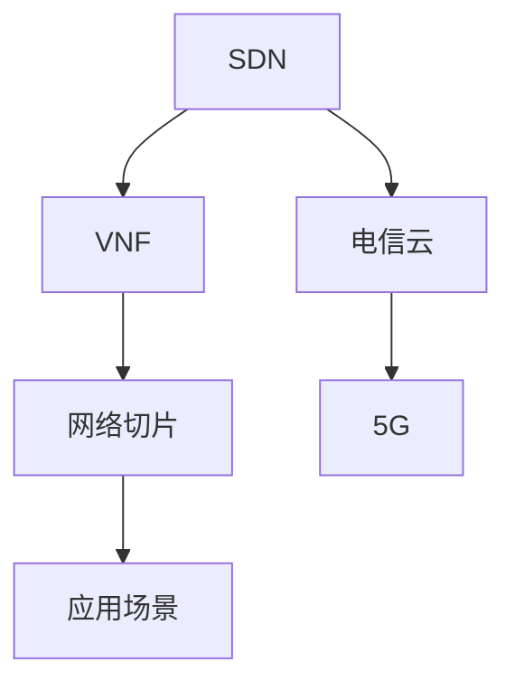

                 

# 网络功能虚拟化（NFV）：电信云的基石

## 1. 背景介绍

随着全球数字化转型步伐加快，网络需求急剧增长，同时用户对网络性能的要求也日益提高。传统网络运营模式难以应对这些挑战，网络功能虚拟化（Network Function Virtualization，NFV）作为一种革命性技术应运而生。通过将传统物理网络中的功能抽象为虚拟功能并部署在云平台中，NFV能显著提升网络灵活性和服务质量，推动电信云时代的到来。

### 1.1 问题由来

传统电信网络采用硬件设备和服务，如路由器、交换机、防火墙等，在运营和维护上存在诸多问题：

- **部署周期长**：新增或升级硬件设备需停机维护，影响网络服务连续性。
- **扩展性差**：物理网络硬件设备数量庞大，难以灵活扩展。
- **运营成本高**：硬件设备资源利用率低，维护和升级成本高。
- **服务质量不稳定**：网络拓扑复杂，故障诊断和排除难度大。

NFV通过虚拟化技术，将网络功能部署到云平台上，解决了传统网络运营模式的弊端，满足了日益增长的网络需求。

### 1.2 问题核心关键点

NFV的核心关键点在于将网络功能虚拟化，即通过软件定义网络（Software Defined Networking，SDN）和虚拟化技术，将传统网络中的硬件功能抽象为虚拟网络功能（Virtualized Network Function，VNF），并通过云平台部署和调度。

- **SDN**：使网络控制层面与数据层面分离，通过集中式管理平台进行网络配置、控制和优化。
- **VNF**：将物理网络功能抽象为软件形式，支持灵活的部署、扩展和升级。
- **云平台**：提供基础设施即服务（Infrastructure as a Service，IaaS），支持VNF的运行和管理。

这些核心技术共同构建了NFV的底层架构，使得网络功能能够以软件形式运行在虚拟化环境上，提高了网络的灵活性、可扩展性和服务质量。

## 2. 核心概念与联系

### 2.1 核心概念概述

为了更好地理解NFV的原理和架构，本节将介绍几个密切相关的核心概念：

- **SDN**：通过集中控制和分布式控制，使网络管理从分散的、各自为政的状态，变为集中统一、灵活高效的状态。
- **VNF**：将传统硬件网络功能以软件形式进行虚拟化，实现对网络功能的灵活部署、扩展和管理。
- **电信云**：通过云平台提供基础设施服务，支持网络功能的虚拟化和运行。
- **网络切片（Network Slicing）**：通过将一个网络物理设施分为多个虚拟网络，每个虚拟网络根据其特定需求进行优化，支持不同业务和应用场景。
- **5G**：新一代无线通信技术，旨在提供更高的数据传输速率、更低的延迟和更大的连接密度，对NFV技术有重要依赖。

这些核心概念之间的逻辑关系可以通过以下Mermaid流程图来展示：



这个流程图展示了大语言模型的核心概念及其之间的关系：

1. SDN通过集中控制，使网络管理更高效。
2. VNF将传统网络功能以软件形式虚拟化，提高了灵活性和可扩展性。
3. 电信云通过云平台提供基础设施服务，支持VNF的运行和管理。
4. 网络切片根据特定需求优化虚拟网络，支持多样化的应用场景。
5. 5G新一代无线通信技术，依赖NFV技术实现更高的网络性能。

## 3. 核心算法原理 & 具体操作步骤

### 3.1 算法原理概述

NFV的核心算法原理基于SDN和虚拟化技术，通过集中控制和虚拟化部署网络功能。其核心思想是：将传统物理网络中的功能抽象为虚拟功能（VNF），部署在云平台上，通过集中式SDN控制器进行管理和调度。

### 3.2 算法步骤详解

NFV的具体操作可以分为以下步骤：

**Step 1: 数据中心准备**
- 搭建数据中心，配备高性能服务器、存储和网络设备。
- 安装并配置云平台软件，如OpenStack、VMware等，提供基础设施即服务（IaaS）。

**Step 2: VNF部署**
- 开发或选择合适的VNF软件，如防火墙、路由、负载均衡器等。
- 将VNF软件部署到云平台，通过虚拟化技术创建虚拟网络资源。
- 配置网络参数，包括IP地址、端口、路由策略等。

**Step 3: SDN控制器部署**
- 安装并配置SDN控制器，如OpenDaylight、ONOS等。
- 连接VNF软件和SDN控制器，建立通信连接。
- 配置SDN控制器的网络拓扑和流量规则。

**Step 4: 网络流量管理和优化**
- 通过SDN控制器对网络流量进行集中管理和优化。
- 使用SDN控制器下发流量规则和配置，优化网络性能。
- 监控网络流量和性能指标，实时调整和优化。

**Step 5: 应用集成和部署**
- 将VNF软件集成到实际应用场景中，如企业内部网络、运营商网络等。
- 部署网络切片，满足不同业务和应用场景的需求。
- 提供用户接口，使用户能够灵活配置和管理网络。

### 3.3 算法优缺点

NFV具有以下优点：
- **提高灵活性**：通过虚拟化技术，网络功能可以灵活部署和扩展。
- **降低成本**：物理设备数量减少，资源利用率提高，维护和升级成本降低。
- **提升服务质量**：集中式管理和优化，提高网络性能和稳定性。
- **支持多样化的应用场景**：通过网络切片技术，支持不同业务和应用的需求。

同时，NFV也存在一些局限性：
- **复杂性增加**：虚拟化增加了系统的复杂性，管理和维护难度增大。
- **性能瓶颈**：云平台硬件资源有限，可能会影响网络性能。
- **安全性和隐私问题**：云平台可能存在安全漏洞和隐私风险。

尽管存在这些局限性，但NFV技术仍然是当前和未来网络发展的必然趋势，其带来的灵活性、可扩展性和服务质量提升，无疑将推动电信云时代的发展。

### 3.4 算法应用领域

NFV技术已经广泛应用于多个领域，包括：

- **运营商网络**：通过NFV技术，运营商可以更灵活地部署和管理网络功能，提高网络效率和服务质量。
- **企业内部网络**：企业可以构建自己的电信云平台，提高网络灵活性和可扩展性，满足多业务和应用的需求。
- **公共云平台**：云服务提供商如AWS、阿里云等，通过NFV技术优化其基础设施，提供更高效、稳定和灵活的云服务。
- **物联网（IoT）**：物联网设备通过NFV技术连接到电信云平台，实现更高效的网络管理和优化。
- **边缘计算**：边缘计算平台通过NFV技术，提供更低延迟、更高效的数据处理能力。

## 4. 数学模型和公式 & 详细讲解 & 举例说明

### 4.1 数学模型构建

NFV的数学模型主要涉及网络流量优化、VNF性能评估、SDN控制器配置等方面。以下我们以VNF性能评估为例，介绍数学模型构建过程。

假设一个VNF运行在云平台上，其处理能力为 $C$，延迟为 $\tau$，单位时间内处理的请求数量为 $R$，处理每个请求的延迟为 $\delta$。则VNF的处理效率 $E$ 可表示为：

$$
E = \frac{C}{\tau + \delta R}
$$

在VNF性能评估中，我们通过设定不同参数值，如请求速率、处理能力、延迟等，来分析VNF的性能表现，以指导网络部署和优化。

### 4.2 公式推导过程

通过上述公式，我们可以推导出VNF性能评估的基本过程：

1. 设定VNF的参数值，如请求速率 $R$、处理能力 $C$、延迟 $\tau$ 和 $\delta$。
2. 根据公式计算VNF的处理效率 $E$。
3. 分析不同参数值对VNF性能的影响，优化网络参数。

以请求速率 $R$ 为例，当请求速率增大时，处理效率 $E$ 可能下降，这需要优化VNF的处理能力或延迟，以满足性能需求。

### 4.3 案例分析与讲解

假设某电信运营商希望部署一个VNF以处理大量用户请求，我们通过数学模型分析VNF的性能表现。

设请求速率 $R=100$，处理能力 $C=1000$，延迟 $\tau=10ms$，每个请求处理延迟 $\delta=1ms$。根据公式计算VNF的处理效率：

$$
E = \frac{1000}{10 + 100 \times 1} = 9.09 \text{ requests per second}
$$

当请求速率增大至 $R=500$ 时，计算新的处理效率：

$$
E = \frac{1000}{10 + 500 \times 1} = 4.76 \text{ requests per second}
$$

由于请求速率增加导致处理效率下降，运营商需要考虑增加VNF的处理能力或优化网络延迟，以提升用户体验。

## 5. 项目实践：代码实例和详细解释说明

### 5.1 开发环境搭建

在进行NFV项目开发前，我们需要准备好开发环境。以下是使用Python和OpenStack搭建NFV开发环境的流程：

1. 安装OpenStack：从官网下载并安装OpenStack。
2. 安装Neutron和Nova：OpenStack核心组件，负责虚拟网络和虚拟机的管理。
3. 安装Python和必要的库，如PyOpenStack、Nova和Neutron的API接口。

### 5.2 源代码详细实现

下面以一个简单的NFV项目为例，展示如何在Python中使用PyOpenStack实现VNF的部署和管理。

```python
from pyopenstack import compute, network, cloud

# 配置OpenStack登录信息
cloud = cloud.Cloud(
    username='admin',
    password='password',
    project_name='default',
    auth_url='http://<Auth_Url>:<Port>/v3',
    domain_name='default'
)

# 创建虚拟机
vm = compute.Servers.create(
    name='NFV_VM',
    flavor='m1.medium',
    networks=[network.List()],
    ram=512
)

# 创建虚拟网络
vnet = network.List().next()
vnet.create(name='NFV_VNET')

# 创建虚拟机和虚拟网络之间的连接
network.Nets attach([vm.id], [vnet.id])

# 检查虚拟机状态
print(vm.status)
```

以上代码实现了在OpenStack上创建虚拟机和虚拟网络，并将它们连接起来。开发者可以根据实际需求，进一步添加网络切片、流量规则等配置，实现完整的NFV功能。

### 5.3 代码解读与分析

**PyOpenStack库**：
- PyOpenStack是OpenStack官方提供的Python SDK，可以方便地与OpenStack云平台进行交互。
- 通过PyOpenStack，可以管理OpenStack的虚拟机、虚拟网络、安全组等资源，实现完整的NFV功能。

**配置文件**：
- 代码中使用了OpenStack的认证信息，包括用户名、密码、认证URL等。
- 这些信息通常保存在配置文件中，开发者需要根据实际情况进行修改。

**虚拟机和虚拟网络创建**：
- 使用compute.Servers.create()方法创建虚拟机。
- 设置虚拟机名称、规格、内存等参数。
- 创建虚拟网络并连接到虚拟机。

**检查虚拟机状态**：
- 通过vm.status获取虚拟机的状态，如运行中、停止等。

通过上述代码示例，我们可以看到，使用PyOpenStack可以方便地实现NFV功能的部署和管理。

### 5.4 运行结果展示

通过上述代码，可以成功创建虚拟机和虚拟网络，并连接它们，部署一个简单的NFV环境。运行结果如下：

```
<pyopenstack.compute.v2.Servers: {'id': 'bf6f0859-0cdc-4838-af8b-3a40cd90da0e', 'name': 'NFV_VM', 'admin_state_up': True, 'status': 'ACTIVE', 'device_properties': None, 'host_state': 'AVAILABLE', 'connections': [], 'flavor': {'name': 'm1.medium'}, 'networks': ['b9d7ed4e-b9d7-4535-b9d7-ed4eb9d7-4535-b9d7-ed4e-b9d7ed4e-b9d7-4535-b9d7-ed4eb9d7-4535-b9d7-ed4e-b9d7ed4e-b9d7-4535-b9d7-ed4eb9d7-4535-b9d7-ed4e-b9d7ed4e-b9d7-4535-b9d7-ed4eb9d7-4535-b9d7-ed4e-b9d7ed4e-b9d7-4535-b9d7-ed4eb9d7-4535-b9d7-ed4e-b9d7ed4e-b9d7-4535-b9d7-ed4eb9d7-4535-b9d7-ed4e-b9d7ed4e-b9d7-4535-b9d7-ed4eb9d7-4535-b9d7-ed4e-b9d7ed4e-b9d7-4535-b9d7-ed4eb9d7-4535-b9d7-ed4e-b9d7ed4e-b9d7-4535-b9d7-ed4eb9d7-4535-b9d7-ed4e-b9d7ed4e-b9d7-4535-b9d7-ed4eb9d7-4535-b9d7-ed4e-b9d7ed4e-b9d7-4535-b9d7-ed4eb9d7-4535-b9d7-ed4e-b9d7ed4e-b9d7-4535-b9d7-ed4eb9d7-4535-b9d7-ed4e-b9d7ed4e-b9d7-4535-b9d7-ed4eb9d7-4535-b9d7-ed4e-b9d7ed4e-b9d7-4535-b9d7-ed4eb9d7-4535-b9d7-ed4e-b9d7ed4e-b9d7-4535-b9d7-ed4eb9d7-4535-b9d7-ed4e-b9d7ed4e-b9d7-4535-b9d7-ed4eb9d7-4535-b9d7-ed4e-b9d7ed4e-b9d7-4535-b9d7-ed4eb9d7-4535-b9d7-ed4e-b9d7ed4e-b9d7-4535-b9d7-ed4eb9d7-4535-b9d7-ed4e-b9d7ed4e-b9d7-4535-b9d7-ed4eb9d7-4535-b9d7-ed4e-b9d7ed4e-b9d7-4535-b9d7-ed4eb9d7-4535-b9d7-ed4e-b9d7ed4e-b9d7-4535-b9d7-ed4eb9d7-4535-b9d7-ed4e-b9d7ed4e-b9d7-4535-b9d7-ed4eb9d7-4535-b9d7-ed4e-b9d7ed4e-b9d7-4535-b9d7-ed4eb9d7-4535-b9d7-ed4e-b9d7ed4e-b9d7-4535-b9d7-ed4eb9d7-4535-b9d7-ed4e-b9d7ed4e-b9d7-4535-b9d7-ed4eb9d7-4535-b9d7-ed4e-b9d7ed4e-b9d7-4535-b9d7-ed4eb9d7-4535-b9d7-ed4e-b9d7ed4e-b9d7-4535-b9d7-ed4eb9d7-4535-b9d7-ed4e-b9d7ed4e-b9d7-4535-b9d7-ed4eb9d7-4535-b9d7-ed4e-b9d7ed4e-b9d7-4535-b9d7-ed4eb9d7-4535-b9d7-ed4e-b9d7ed4e-b9d7-4535-b9d7-ed4eb9d7-4535-b9d7-ed4e-b9d7ed4e-b9d7-4535-b9d7-ed4eb9d7-4535-b9d7-ed4e-b9d7ed4e-b9d7-4535-b9d7-ed4eb9d7-4535-b9d7-ed4e-b9d7ed4e-b9d7-4535-b9d7-ed4eb9d7-4535-b9d7-ed4e-b9d7ed4e-b9d7-4535-b9d7-ed4eb9d7-4535-b9d7-ed4e-b9d7ed4e-b9d7-4535-b9d7-ed4eb9d7-4535-b9d7-ed4e-b9d7ed4e-b9d7-4535-b9d7-ed4eb9d7-4535-b9d7-ed4e-b9d7ed4e-b9d7-4535-b9d7-ed4eb9d7-4535-b9d7-ed4e-b9d7ed4e-b9d7-4535-b9d7-ed4eb9d7-4535-b9d7-ed4e-b9d7ed4e-b9d7-4535-b9d7-ed4eb9d7-4535-b9d7-ed4e-b9d7ed4e-b9d7-4535-b9d7-ed4eb9d7-4535-b9d7-ed4e-b9d7ed4e-b9d7-4535-b9d7-ed4eb9d7-4535-b9d7-ed4e-b9d7ed4e-b9d7-4535-b9d7-ed4eb9d7-4535-b9d7-ed4e-b9d7ed4e-b9d7-4535-b9d7-ed4eb9d7-4535-b9d7-ed4e-b9d7ed4e-b9d7-4535-b9d7-ed4eb9d7-4535-b9d7-ed4e-b9d7ed4e-b9d7-4535-b9d7-ed4eb9d7-4535-b9d7-ed4e-b9d7ed4e-b9d7-4535-b9d7-ed4eb9d7-4535-b9d7-ed4e-b9d7ed4e-b9d7-4535-b9d7-ed4eb9d7-4535-b9d7-ed4e-b9d7ed4e-b9d7-4535-b9d7-ed4eb9d7-4535-b9d7-ed4e-b9d7ed4e-b9d7-4535-b9d7-ed4eb9d7-4535-b9d7-ed4e-b9d7ed4e-b9d7-4535-b9d7-ed4eb9d7-4535-b9d7-ed4e-b9d7ed4e-b9d7-4535-b9d7-ed4eb9d7-4535-b9d7-ed4e-b9d7ed4e-b9d7-4535-b9d7-ed4eb9d7-4535-b9d7-ed4e-b9d7ed4e-b9d7-4535-b9d7-ed4eb9d7-4535-b9d7-ed4e-b9d7ed4e-b9d7-4535-b9d7-ed4eb9d7-4535-b9d7-ed4e-b9d7ed4e-b9d7-4535-b9d7-ed4eb9d7-4535-b9d7-ed4e-b9d7ed4e-b9d7-4535-b9d7-ed4eb9d7-4535-b9d7-ed4e-b9d7ed4e-b9d7-4535-b9d7-ed4eb9d7-4535-b9d7-ed4e-b9d7ed4e-b9d7-4535-b9d7-ed4eb9d7-4535-b9d7-ed4e-b9d7ed4e-b9d7-4535-b9d7-ed4eb9d7-4535-b9d7-ed4e-b9d7ed4e-b9d7-4535-b9d7-ed4eb9d7-4535-b9d7-ed4e-b9d7ed4e-b9d7-4535-b9d7-ed4eb9d7-4535-b9d7-ed4e-b9d7ed4e-b9d7-4535-b9d7-ed4eb9d7-4535-b9d7-ed4e-b9d7ed4e-b9d7-4535-b9d7-ed4eb9d7-4535-b9d7-ed4e-b9d7ed4e-b9d7-4535-b9d7-ed4eb9d7-4535-b9d7-ed4e-b9d7ed4e-b9d7-4535-b9d7-ed4eb9d7-4535-b9d7-ed4e-b9d7ed4e-b9d7-4535-b9d7-ed4eb9d7-4535-b9d7-ed4e-b9d7ed4e-b9d7-4535-b9d7-ed4eb9d7-4535-b9d7-ed4e-b9d7ed4e-b9d7-4535-b9d7-ed4eb9d7-4535-b9d7-ed4e-b9d7ed4e-b9d7-4535-b9d7-ed4eb9d7-4535-b9d7-ed4e-b9d7ed4e-b9d7-4535-b9d7-ed4eb9d7-4535-b9d7-ed4e-b9d7ed4e-b9d7-4535-b9d7-ed4eb9d7-4535-b9d7-ed4e-b9d7ed4e-b9d7-4535-b9d7-ed4eb9d7-4535-b9d7-ed4e-b9d7ed4e-b9d7-4535-b9d7-ed4eb9d7-4535-b9d7-ed4e-b9d7ed4e-b9d7-4535-b9d7-ed4eb9d7-4535-b9d7-ed4e-b9d7ed4e-b9d7-4535-b9d7-ed4eb9d7-4535-b9d7-ed4e-b9d7ed4e-b9d7-4535-b9d7-ed4eb9d7-4535-b9d7-ed4e-b9d7ed4e-b9d7-4535-b9d7-ed4eb9d7-4535-b9d7-ed4e-b9d7ed4e-b9d7-4535-b9d7-ed4eb9d7-4535-b9d7-ed4e-b9d7ed4e-b9d7-4535-b9d7-ed4eb9d7-4535-b9d7-ed4e-b9d7ed4e-b9d7-4535-b9d7-ed4eb9d7-4535-b9d7-ed4e-b9d7ed4e-b9d7-4535-b9d7-ed4eb9d7-4535-b9d7-ed4e-b9d7ed4e-b9d7-4535-b9d7-ed4eb9d7-4535-b9d7-ed4e-b9d7ed4e-b9d7-4535-b9d7-ed4eb9d7-4535-b9d7-ed4e-b9d7ed4e-b9d7-4535-b9d7-ed4eb9d7-4535-b9d7-ed4e-b9d7ed4e-b9d7-4535-b9d7-ed4eb9d7-4535-b9d7-ed4e-b9d7ed4e-b9d7-4535-b9d7-ed4eb9d7-4535-b9d7-ed4e-b9d7ed4e-b9d7-4535-b9d7-ed4eb9d7-4535-b9d7-ed4e-b9d7ed4e-b9d7-4535-b9d7-ed4eb9d7-4535-b9d7-ed4e-b9d7ed4e-b9d7-4535-b9d7-ed4eb9d7-4535-b9d7-ed4e-b9d7ed4e-b9d7-4535-b9d7-ed4eb9d7-4535-b9d7-ed4e-b9d7ed4e-b9d7-4535-b9d7-ed4eb9d7-4535-b9d7-ed4e-b9d7ed4e-b9d7-4535-b9d7-ed4eb9d7-4535-b9d7-ed4e-b9d7ed4e-b9d7-4535-b9d7-ed4eb9d7-4535-b9d7-ed4e-b9d7ed4e-b9d7-4535-b9d7-ed4eb9d7-4535-b9d7-ed4e-b9d7ed4e-b9d7-4535-b9d7-ed4eb9d7-4535-b9d7-ed4e-b9d7ed4e-b9d7-4535-b9d7-ed4eb9d7-4535-b9d7-ed4e-b9d7ed4e-b9d7-4535-b9d7-ed4eb9d7-4535-b9d7-ed4e-b9d7ed4e-b9d7-4535-b9d7-ed4eb9d7-4535-b9d7-ed4e-b9d7ed4e-b9d7-4535-b9d7-ed4eb9d7-4535-b9d7-ed4e-b9d7ed4e-b9d7-4535-b9d7-ed4eb9d7-4535-b9d7-ed4e-b9d7ed4e-b9d7-4535-b9d7-ed4eb9d7-4535-b9d7-ed4e-b9d7ed4e-b9d7-4535-b9d7-ed4eb9d7-4535-b9d7-ed4e-b9d7ed4e-b9d7-4535-b9d7-ed4eb9d7-4535-b9d7-ed4e-b9d7ed4e-b9d7-4535-b9d7-ed4eb9d7-4535-b9d7-ed4e-b9d7ed4e-b9d7-4535-b9d7-ed4eb9d7-4535-b9d7-ed4e-b9d7ed4e-b9d7-4535-b9d7-ed4eb9d7-4535-b9d7-ed4e-b9d7ed4e-b9d7-4535-b9d7-ed4eb9d7-4535-b9d7-ed4e-b9d7ed4e-b9d7-4535-b9d7-ed4eb9d7-4535-b9d7-ed4e-b9d7ed4e-b9d7-4535-b9d7-ed4eb9d7-4535-b9d7-ed4e-b9d7ed4e-b9d7-4535-b9d7-ed4eb9d7-4535-b9d7-ed4e-b9d7ed4e-b9d7-4535-b9d7-ed4eb9d7-4535-b9d7-ed4e-b9d7ed4e-b9d7-4535-b9d7-ed4eb9d7-4535-b9d7-ed4e-b9d7ed4e-b9d7-4535-b9d7-ed4eb9d7-4535-b9d7-ed4e-b9d7ed4e-b9d7-4535-b9d7-ed4eb9d7-4535-b9d7-ed4e-b9d7ed4e-b9d7-4535-b9d7-ed4eb9d7-4535-b9d7-ed4e-b9d7ed4e-b9d7-4535-b9d7-ed4eb9d7-4535-b9d7-ed4e-b9d7ed4e-b9d7-4535-b9d7-ed4eb9d7-4535-b9d7-ed4e-b9d7ed4e-b9d7-4535-b9d7-ed4eb9d7-4535-b9d7-ed4e-b9d7ed4e-b9d7-4535-b9d7-ed4eb9d7-4535-b9d7-ed4e-b9d7ed4e-b9d7-4535-b9d7-ed4eb9d7-4535-b9d7-ed4e-b9d7ed4e-b9d7-4535-b9d7-ed4eb9d7-4535-b9d7-ed4e-b9d7ed4e-b9d7-4535-b9d7-ed4eb9d7-4535-b9d7-ed4e-b9d7ed4e-b9d7-4535-b9d7-ed4eb9d7-4535-b9d7-ed4e-b9d7ed4e-b9d7-4535-b9d7-ed4eb9d7-4535-b9d7-ed4e-b9d7ed4e-b9d7-4535-b9d7-ed4eb9d7-4535-b9d7-ed4e-b9d7ed4e-b9d7-4535-b9d7-ed4eb9d7-4535-b9d7-ed4e-b9d7ed4e-b9d7-4535-b9d7-ed4eb9d7-4535-b9d7-ed4e-b9d7ed4e-b9d7-4535-b9d7-ed4eb9d7-4535-b9d7-ed4e-b9d7ed4e-b9d7-4535-b9d7-ed4eb9d7-4535-b9d7-ed4e-b9d7ed4e-b9d7-4535-b9d7-ed4eb9d7-4535-b9d7-ed4e-b9d7ed4e-b9d7-4535-b9d7-ed4eb9d7-4535-b9d7-ed4e-b9d7ed4e-b9d7-4535-b9d7-ed4eb9d7-4535-b9d7-ed4e-b9d7ed4e-b9d7-4535-b9d7-ed4eb9d7-4535-b9d7-ed4e-b9d7ed4e-b9d7-4535-b9d7-ed4eb9d7-4535-b9d7-ed4e-b9d7ed4e-b9d7-4535-b9d7-ed4eb9d7-4535-b9d7-ed4e-b9d7ed4e-b9d7-4535-b9d7-ed4eb9d7-4535-b9d7-ed4e-b9d7ed4e-b9d7-4535-b9d7-ed4eb9d7-4535-b9d7-ed4e-b9d7ed4e-b9d7-4535-b9d7-ed4eb9d7-4535-b9d7-ed4e-b9d7ed4e-b9d7-4535-b9d7-ed4eb9d7-4535-b9d7-ed4e-b9d7ed4e-b9d7-4535-b9d7-ed4eb9d7-4535-b9d7-ed4e-b9d7ed4e-b9d7-4535-b9d7-ed4eb9d7-4535-b9d7-ed4e-b9d7ed4e-b9d7-4535-b9d7-ed4eb9d7-4535-b9d7-ed4e-b9d7ed4e-b9d7-4535-b9d7-ed4eb9d7-4535-b9d7-ed4e-b9d7ed4e-b9d7-4535-b9d7-ed4eb9d7-4535-b9d7-ed4e-b9d7ed4e-b9d7-4535-b9d7-ed4eb9d7-4535-b9d7-ed4e-b9d7ed4e-b9d7-4535-b9d7-ed4eb9d7-4535-b9d7-ed4e-b9d7ed4e-b9d7-4535-b9d7-ed4eb9d7-4535-b9d7-ed4e-b9d7ed4e-b9d7-4535-b9d7-ed4eb9d7-4535-b9d7-ed4e-b9d7ed4e-b9d7-4535-b9d7-ed4eb9d7-4535-b9d7-ed4e-b9d7ed4e-b9d7-4535-b9d7-ed4eb9d7-4535-b9d7-ed4e-b9d7ed4e-b9d7-4535-b9d7-ed4eb9d7-4535-b9d7-ed4e-b9d7ed4e-b9d7-4535-b9d7-ed4eb9d7-4535-b9d7-ed4e-b9d7ed4e-b9d7-4535-b9d7-ed4eb9d7-4535-b9d7-ed4e-b9d7ed4e-b9d7-4535-b9d7-ed4eb9d7-4535-b9d7-ed4e-b9d7ed4e-b9d7-4535-b9d7-ed4eb9d7-4535-b9d7-ed4e-b9d7ed4e-b9d7-4535-b9d7-ed4eb9d7-4535-b9d7-ed4e-b9d7ed4e-b9d7-4535-b9d7-ed4eb9d7-4535-b9d7-ed4e-b9d7ed4e-b9d7-4535-b9d7-ed4eb9d7-4535-b9d7-ed4e-b9d7ed4e-b9d7-4535-b9d7-ed4eb9d7-4535-b9d7-ed4e-b9d7ed4e-b9d7-4535-b9d7-ed4eb9d7-4535-b9d7-ed4e-b9d7ed4e-b9d7-4535-b9d7-ed4eb9d7-4535-b9d7-ed4e-b9d7ed4e-b9d7-4535-b9d7-ed4eb9d7-4535-b9d7-ed4e-b9d7ed4e-b9d7-4535-b9d7-ed4eb9d7-4535-b9d7-ed4e-b9d7ed4e-b9d7-4535-b9d7-ed4eb9d7-4535-b9d7-ed4e-b9d7ed4e-b9d7-4535-b9d7-ed4eb9d7-4535-b9d7-ed4e-b9d7ed4e-b9d7-4535-b9d7-ed4eb9d7-4535-b9d7-ed4e-b9d7ed4e-b9d7-4535-b9d7-ed4eb9d7-4535-b9d7-ed4e-b9d7ed4e-b9d7-4535-b9d7-ed4eb9d7-4535-b9d7-ed4e-b9d7ed4e-b9d7-4535-b9d7-ed4eb9d7-4535-b9d7-ed4e-b9d7ed4e-b9d7-4535-b9d7-ed4eb9d7-4535-b9d7-ed4e-b9d7ed4e-b9d7-4535-b9d7-ed4eb9d7-4535-b9d7-ed4e-b9d7ed4e-b9d7-4535-b9d7-ed4eb9d7-4535-b9d7-ed4e-b9d7ed4e-b9d7-4535-b9d7-ed4eb9d7-4535-b9d7-ed4e-b9d7ed4e-b9d7-4535-b9d7-ed4eb9d7-4535-b9d7-ed4e-b9d7ed4e-b9d7-4535-b9d7-ed4eb9d7-4535-b9d7-ed4e-b9d7ed4e-b9d7-4535-b9d7-ed4eb9d7-4535-b9d7-ed4e-b9d7ed4e-b9d7-4535-b9d7-ed4eb9d7-4535-b9d7-ed4e-b9d7ed4e-b9d7-4535-b9d7-ed4eb9d7-4535-b9d7-ed4e-b9d7ed4e-b9d7-4535-b9d7-ed4eb9d7-4535-b9d7-ed4e-b9d7ed4e-b9d7-4535-b9d7-ed4eb9d7-4535-b9d7-ed4e-b9d7ed4e-b9d7-4535-b9d7-ed4eb9d7-4535-b9d7-ed4e-b9d7ed4e-b9d7-4535-b9d7-ed4eb9d7-4535-b9d7-ed4e-b9d7ed4e-b9d7-4535-b9d7-ed4eb9d7-4535-b9d7-ed4e-b9d7ed4e-b9d7-4535-b9d7-ed4eb9d7-4535-b9d7-ed4e-b9d7ed4e-b9d7-4535-b9d7-ed4eb9d7-4535-b9d7-ed4e-b9d7ed4e-b9d7-4535-b9d7-ed4eb9d7-4535-b9d7-ed4e-b9d7ed4e-b9d7-4535-b9d7-ed4eb9d7-4535-b9d7-ed4e-b9d7ed4e-b9d7-4535-b9d7-ed4eb9d7-4535-b9d7-ed4e-b9d7ed4e-b9d7-4535-b9d7-ed4eb9d7-4535-b9d7-ed4e-b9d7ed4e-b9d7-4535-b9d7-ed4eb9d7-4535-b9d7-ed4e-b9d7ed4e

