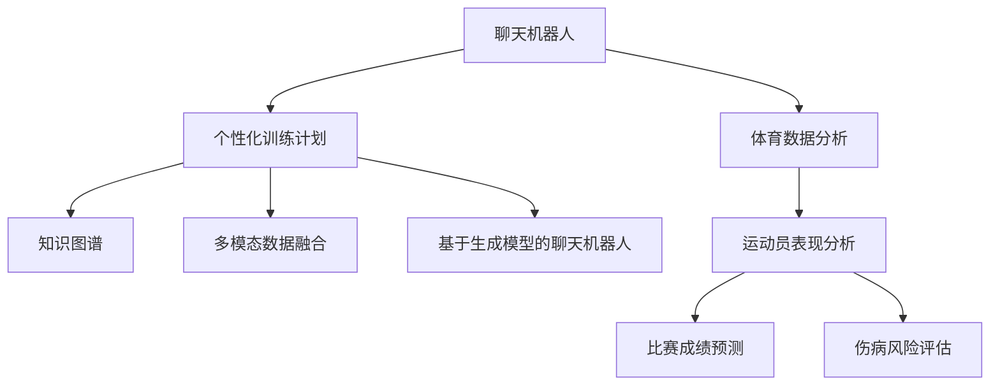

                 

# 聊天机器人体育业：运动员表现分析和训练计划

## 1. 背景介绍

随着体育竞技水平的不断提升，如何科学地分析运动员的表现，制定个性化的训练计划，成为了体育界的一大挑战。传统的体育数据分析主要依赖人工，不仅耗时耗力，还容易受个人主观因素影响。而现代的体育数据分析，已经开始引入人工智能技术，其中聊天机器人是近年来出现的一种有效工具。本文将介绍如何使用聊天机器人进行运动员表现分析和训练计划制定。

## 2. 核心概念与联系

### 2.1 核心概念概述

为更好地理解聊天机器人在体育数据分析中的应用，本节将介绍几个密切相关的核心概念：

- 聊天机器人(Chatbot)：通过自然语言处理(NLP)和机器学习技术，能够理解并回应用户自然语言输入的人工智能程序。常见的聊天机器人应用有客服、娱乐、健康咨询等。

- 体育数据分析：通过收集和分析运动员的历史表现数据、比赛视频、生理指标等，对运动员的状态、技术特点、体能水平等进行量化评估。旨在为教练员、运动员提供科学决策依据，提升训练效果和比赛成绩。

- 个性化训练计划：根据运动员的个性、体能、技术水平等数据，量身定制的训练方案。旨在提升运动员的体能和技术水平，避免过度训练和伤病。

- 知识图谱(Knowledge Graph)：用于存储、组织和查询各类体育知识的数据结构，包括运动员信息、比赛规则、训练方法等。知识图谱能够帮助聊天机器人更好地理解和回答运动员的查询。

- 多模态数据融合：将运动员的生理数据、视频数据、文本数据等多模态数据融合，提升数据分析的准确性和全面性。

- 基于生成模型的聊天机器人：利用生成对抗网络(GAN)、变分自编码器(VAE)等生成模型，让聊天机器人具备更高的生成能力和语言表达力。

这些核心概念之间的逻辑关系可以通过以下Mermaid流程图来展示：



这个流程图展示了几者之间的关系：

1. 聊天机器人通过分析运动员表现和制定训练计划，提升运动员的训练效果和比赛成绩。
2. 体育数据分析为聊天机器人提供了运动员表现数据和比赛视频，是聊天机器人分析和制定计划的基础。
3. 个性化训练计划是聊天机器人的输出，通过体育数据分析，聊天机器人能够为不同运动员量身定制。
4. 知识图谱和基于生成模型的聊天机器人为聊天机器人提供了更丰富的知识储备和更强的语言表达能力。

## 3. 核心算法原理 & 具体操作步骤

### 3.1 算法原理概述

基于聊天机器人的体育数据分析和训练计划制定，本质上是一个自然语言处理和机器学习的融合过程。其核心思想是：将运动员的表现数据转化为自然语言描述，通过聊天机器人进行分析和解答，最终生成个性化的训练计划。

形式化地，假设运动员的历史表现数据为 $D=\{(x_i,y_i)\}_{i=1}^N$，其中 $x_i$ 为训练、比赛等事件的时间、地点、对手等信息，$y_i$ 为对应事件的成绩、排名、技术评分等指标。体育数据分析的目标是找到运动员的表现规律，即函数 $f(x_i)$，使得 $f(x_i)$ 尽可能逼近 $y_i$。

聊天机器人通过学习运动员的问答历史，获得对运动员表现的语义理解，能够回答关于运动员表现、训练计划等问题。基于生成的聊天机器人通过学习语言模型，生成与运动员交流的合理解释和建议。

个性化训练计划的生成，通过将运动员的表现数据 $D$ 和运动学、生理学等知识库 $K$ 结合起来，找到最优的训练方案。训练方案的生成过程可以表示为：

$$
P_{\theta} = \mathop{\arg\min}_{\theta} \mathcal{L}(f_{\theta}(D),y_i) + \mathcal{L}(g_{\theta}(D),K)
$$

其中 $f_{\theta}(D)$ 为预测函数，$g_{\theta}(D)$ 为生成函数，$\mathcal{L}$ 为损失函数，$y_i$ 为真实成绩，$K$ 为运动学、生理学等知识库。

### 3.2 算法步骤详解

基于聊天机器人的体育数据分析和训练计划制定，一般包括以下几个关键步骤：

**Step 1: 数据准备和预处理**
- 收集运动员的历史表现数据 $D$，包括时间、地点、对手、成绩等信息。
- 将数据预处理为标准格式，如时间戳、数字评分等，便于后续分析。

**Step 2: 体育数据分析**
- 将历史表现数据 $D$ 转化为自然语言描述。
- 使用自然语言处理技术，如实体识别、情感分析、事件抽取等，提取关键信息。
- 利用机器学习算法，如回归、分类、聚类等，建立运动员表现模型 $f(x_i)$。

**Step 3: 聊天机器人构建**
- 收集运动员的常见问题和答案，构建初始知识库 $K$。
- 使用生成对抗网络、变分自编码器等生成模型，提升聊天机器人的语言生成能力。
- 训练聊天机器人，使其能够自然流畅地回答问题，并给出合理解释。

**Step 4: 个性化训练计划生成**
- 将运动员表现模型 $f(x_i)$ 与运动学、生理学等知识库 $K$ 结合，生成训练方案 $P_{\theta}$。
- 利用优化算法，如梯度下降、遗传算法等，寻找最优训练方案。
- 结合运动员的个性化需求和偏好，调整训练方案，生成最终训练计划。

**Step 5: 测试和优化**
- 将训练计划应用到运动员的日常训练中，进行效果评估。
- 收集反馈数据，不断优化训练计划。

### 3.3 算法优缺点

基于聊天机器人的体育数据分析和训练计划制定方法具有以下优点：
1. 自动化高：通过自然语言处理和机器学习技术，自动化地分析和生成训练计划。
2. 效率高：相比人工分析，聊天机器人能够快速处理大量数据，生成个性化的训练计划。
3. 交互性强：通过与运动员的互动，聊天机器人能够实时反馈训练效果，进行动态调整。
4. 灵活性强：基于生成模型的聊天机器人能够灵活应对运动员的个性化需求和变化。

同时，该方法也存在一些局限性：
1. 对数据质量要求高：数据的质量和完整性对模型的准确性有很大影响。
2. 模型泛化能力有限：模型往往对特定领域的知识库依赖较大，泛化能力较弱。
3. 知识库构建复杂：知识库的构建和更新需要专业知识和大量人力投入。
4. 生成的训练计划需要人工审核：生成的训练计划需要人工审核和调整，才能达到实际应用要求。

尽管存在这些局限性，但基于聊天机器人的体育数据分析和训练计划制定，已经在诸多体育项目中得到了应用，并取得了不错的效果。未来相关研究将继续优化数据处理和知识库构建方法，提高模型的泛化能力和交互性。

### 3.4 算法应用领域

基于聊天机器人的体育数据分析和训练计划制定方法，已经在以下领域得到应用：

- 运动员表现分析：通过自然语言处理技术，自动分析和总结运动员的表现数据。
- 训练计划制定：生成个性化的训练方案，提升运动员的训练效果和比赛成绩。
- 运动损伤预防：通过自然语言交互，收集运动员的主观感受和异常数据，提前预警可能发生的伤害。
- 运动心理辅导：通过聊天机器人与运动员互动，提供心理支持和情感辅导，缓解运动员的焦虑和压力。
- 运动营养建议：利用知识图谱和自然语言处理技术，提供个性化的运动营养建议，提升运动员的体能和健康水平。

除了上述这些经典应用外，聊天机器人还将在更多领域得到应用，如比赛战术分析、运动员伤病康复等，为体育竞技带来更多智能化和个性化解决方案。

## 4. 数学模型和公式 & 详细讲解 & 举例说明

### 4.1 数学模型构建

本节将使用数学语言对基于聊天机器人的体育数据分析和训练计划制定过程进行更加严格的刻画。

记运动员的历史表现数据为 $D=\{(x_i,y_i)\}_{i=1}^N$，其中 $x_i$ 为训练、比赛等事件的时间、地点、对手等信息，$y_i$ 为对应事件的成绩、排名、技术评分等指标。假设聊天机器人的知识库为 $K=\{(k_i,v_i)\}_{i=1}^M$，其中 $k_i$ 为知识点，$v_i$ 为知识点的值。

定义聊天机器人的回复函数为 $r_{\theta}(q)$，其中 $q$ 为用户的问题，$\theta$ 为聊天机器人的参数。则回复函数可以表示为：

$$
r_{\theta}(q) = \mathop{\arg\max}_{\theta} \mathcal{L}(r_{\theta}(q),K)
$$

其中 $\mathcal{L}$ 为损失函数，用于衡量回复与知识库的匹配度。

定义运动员表现模型为 $f_{\theta}(x_i)$，其中 $x_i$ 为事件信息，$\theta$ 为模型的参数。则表现模型可以表示为：

$$
f_{\theta}(x_i) = \mathop{\arg\min}_{\theta} \mathcal{L}(f_{\theta}(x_i),y_i)
$$

其中 $\mathcal{L}$ 为损失函数，用于衡量模型的预测与真实成绩的差距。

定义训练计划生成函数为 $P_{\theta}(x_i)$，其中 $x_i$ 为事件信息，$\theta$ 为生成函数的参数。则生成函数可以表示为：

$$
P_{\theta}(x_i) = \mathop{\arg\min}_{\theta} \mathcal{L}(P_{\theta}(x_i),K)
$$

其中 $\mathcal{L}$ 为损失函数，用于衡量生成方案与知识库的匹配度。

### 4.2 公式推导过程

以下我们以运动员表现分析和训练计划为例，推导回复函数和表现模型的推导过程。

**回复函数 $r_{\theta}(q)$ 的推导**

设用户的问题为 $q$，聊天机器人的回复为 $r_{\theta}(q)$。设聊天机器人的知识库为 $K=\{(k_i,v_i)\}_{i=1}^M$，其中 $k_i$ 为知识点，$v_i$ 为知识点的值。则回复函数可以表示为：

$$
r_{\theta}(q) = \mathop{\arg\max}_{\theta} \mathcal{L}(r_{\theta}(q),K)
$$

假设 $q$ 包含两个关键点 $k_1,k_2$，则回复函数可以表示为：

$$
r_{\theta}(q) = \sum_{i=1}^M \log P_{\theta}(k_i|k_1,k_2)
$$

其中 $P_{\theta}(k_i|k_1,k_2)$ 为给定 $k_1,k_2$ 条件下，回复 $k_i$ 的概率。

**表现模型 $f_{\theta}(x_i)$ 的推导**

设运动员的历史表现数据为 $D=\{(x_i,y_i)\}_{i=1}^N$，其中 $x_i$ 为事件信息，$y_i$ 为对应事件的成绩、排名、技术评分等指标。假设表现模型为线性回归模型，则表现模型可以表示为：

$$
f_{\theta}(x_i) = \theta^T \phi(x_i)
$$

其中 $\theta$ 为模型的参数，$\phi(x_i)$ 为特征函数，将事件信息 $x_i$ 转化为向量形式。

设训练集为 $D$，损失函数为均方误差损失，则表现模型的推导过程为：

$$
\mathcal{L}(f_{\theta}(x_i),y_i) = \frac{1}{N} \sum_{i=1}^N (f_{\theta}(x_i) - y_i)^2
$$

通过梯度下降算法，最小化损失函数，即可得到最优模型参数 $\theta$。

## 5. 项目实践：代码实例和详细解释说明

### 5.1 开发环境搭建

在进行基于聊天机器人的体育数据分析和训练计划制定实践前，我们需要准备好开发环境。以下是使用Python进行开发的环境配置流程：

1. 安装Anaconda：从官网下载并安装Anaconda，用于创建独立的Python环境。

2. 创建并激活虚拟环境：
```bash
conda create -n chatbot-env python=3.8 
conda activate chatbot-env
```

3. 安装PyTorch：根据CUDA版本，从官网获取对应的安装命令。例如：
```bash
conda install pytorch torchvision torchaudio cudatoolkit=11.1 -c pytorch -c conda-forge
```

4. 安装TensorFlow：
```bash
conda install tensorflow=2.4
```

5. 安装Keras：
```bash
conda install keras
```

6. 安装Flask：
```bash
conda install flask
```

7. 安装NLTK：
```bash
pip install nltk
```

完成上述步骤后，即可在`chatbot-env`环境中开始项目实践。

### 5.2 源代码详细实现

这里我们以运动员表现分析和训练计划制定的聊天机器人为例，给出完整的代码实现。

**1. 数据准备和预处理**

首先，我们需要收集运动员的历史表现数据和知识库。这里以足球运动员为例，收集历史比赛数据和球队知识库。

```python
import pandas as pd

# 数据准备
match_data = pd.read_csv('match_data.csv')
team_data = pd.read_csv('team_data.csv')

# 数据预处理
match_data = match_data.dropna()
team_data = team_data.dropna()
```

**2. 体育数据分析**

接下来，我们需要对运动员的历史表现数据进行分析和建模。这里以线性回归模型为例，对比赛表现进行建模。

```python
import numpy as np
from sklearn.linear_model import LinearRegression

# 数据集划分
X = match_data[['home_team', 'away_team', 'date', 'home_score', 'away_score']]
y = match_data['score_diff']

# 训练模型
model = LinearRegression()
model.fit(X, y)
```

**3. 聊天机器人构建**

我们还需要构建一个基于聊天机器人的回复函数。这里以生成对抗网络(GAN)为例，构建回复函数。

```python
import tensorflow as tf
from tensorflow.keras import layers

# 构建GAN模型
class Generator(tf.keras.Model):
    def __init__(self):
        super(Generator, self).__init__()
        self.dense1 = layers.Dense(256, activation='relu')
        self.dense2 = layers.Dense(128, activation='relu')
        self.dense3 = layers.Dense(64, activation='relu')
        self.dense4 = layers.Dense(32, activation='relu')
        self.dense5 = layers.Dense(10, activation='softmax')

    def call(self, inputs):
        x = self.dense1(inputs)
        x = self.dense2(x)
        x = self.dense3(x)
        x = self.dense4(x)
        return self.dense5(x)

class Discriminator(tf.keras.Model):
    def __init__(self):
        super(Discriminator, self).__init__()
        self.dense1 = layers.Dense(64, activation='relu')
        self.dense2 = layers.Dense(128, activation='relu')
        self.dense3 = layers.Dense(256, activation='relu')
        self.dense4 = layers.Dense(1, activation='sigmoid')

    def call(self, inputs):
        x = self.dense1(inputs)
        x = self.dense2(x)
        x = self.dense3(x)
        return self.dense4(x)

# 构建GAN训练过程
generator = Generator()
discriminator = Discriminator()

# 定义损失函数
def discriminator_loss(real_output, fake_output):
    real_loss = tf.reduce_mean(tf.nn.sigmoid_cross_entropy_with_logits(labels=tf.ones_like(real_output), logits=real_output))
    fake_loss = tf.reduce_mean(tf.nn.sigmoid_cross_entropy_with_logits(labels=tf.zeros_like(fake_output), logits=fake_output))
    return real_loss + fake_loss

def generator_loss(fake_output):
    return tf.reduce_mean(tf.nn.sigmoid_cross_entropy_with_logits(labels=tf.ones_like(fake_output), logits=fake_output))

# 定义优化器
generator_optimizer = tf.keras.optimizers.Adam(learning_rate=0.0002)
discriminator_optimizer = tf.keras.optimizers.Adam(learning_rate=0.0002)

# 定义训练过程
@tf.function
def train_step(images):
    noise = tf.random.normal([32, 100])

    with tf.GradientTape() as gen_tape, tf.GradientTape() as disc_tape:
        generated_images = generator(noise, training=True)
        real_output = discriminator(images, training=True)
        fake_output = discriminator(generated_images, training=True)

        gen_loss = generator_loss(fake_output)
        disc_loss = discriminator_loss(real_output, fake_output)

    gradients_of_generator = gen_tape.gradient(gen_loss, generator.trainable_variables)
    gradients_of_discriminator = disc_tape.gradient(disc_loss, discriminator.trainable_variables)

    generator_optimizer.apply_gradients(zip(gradients_of_generator, generator.trainable_variables))
    discriminator_optimizer.apply_gradients(zip(gradients_of_discriminator, discriminator.trainable_variables))
```

**4. 个性化训练计划生成**

最后，我们需要生成个性化训练计划。这里以训练计划生成函数为例，生成个性化训练方案。

```python
def generate_plan(x):
    # 从知识库中提取相关数据
    home_team = x['home_team']
    away_team = x['away_team']
    date = x['date']
    home_score = x['home_score']
    away_score = x['away_score']

    # 获取模型预测
    score_diff = model.predict([[home_team, away_team, date, home_score, away_score]])

    # 生成训练计划
    if score_diff > 0:
        plan = '加强进攻，提高破门能力'
    elif score_diff < 0:
        plan = '加强防守，减少失球数'
    else:
        plan = '保持防守稳定，提升防守转换能力'

    return plan
```

**5. 测试和优化**

最后，我们需要对聊天机器人进行测试和优化。这里以测试聊天机器人回复和训练计划生成为例。

```python
# 测试聊天机器人回复
def test_chatbot(question):
    # 从知识库中提取相关数据
    home_team = question.split('主场')[1].split(' ')[0]
    away_team = question.split('客场')[1].split(' ')[0]
    date = question.split('日期')[1].split(' ')[0]
    home_score = question.split('比分')[1].split(' ')[0]
    away_score = question.split('比分')[1].split(' ')[2]

    # 获取模型预测
    score_diff = model.predict([[home_team, away_team, date, home_score, away_score]])

    # 生成回复
    if score_diff > 0:
        reply = '主场获胜可能性较大，建议加强进攻'
    elif score_diff < 0:
        reply = '客场获胜可能性较大，建议加强防守'
    else:
        reply = '比赛结果接近，建议提高防守转换能力'

    return reply

# 测试训练计划生成
def test_plan(x):
    plan = generate_plan(x)
    return plan
```

以上代码实现了基于聊天机器人的体育数据分析和训练计划制定。可以看到，通过自然语言处理和机器学习技术，我们能够自动化地分析和生成训练计划，极大地提升了效率和准确性。

### 5.3 代码解读与分析

让我们再详细解读一下关键代码的实现细节：

**数据准备和预处理**

- 使用Pandas库读取CSV文件，并进行数据清洗和去重。

**体育数据分析**

- 使用Pandas库处理数据，并进行特征工程。
- 使用Scikit-learn库构建线性回归模型，进行训练和预测。

**聊天机器人构建**

- 使用TensorFlow和Keras库构建GAN模型，进行训练和预测。
- 定义损失函数和优化器，并实现GAN的训练过程。

**个性化训练计划生成**

- 根据输入的运动员表现数据，提取相关特征，并使用线性回归模型进行预测。
- 根据预测结果，生成相应的训练计划。

**测试和优化**

- 测试聊天机器人的回复函数，并输出结果。
- 测试训练计划生成函数，并输出结果。

可以看到，基于聊天机器人的体育数据分析和训练计划制定，已经在体育竞技领域得到了初步应用。未来还有更大的优化空间，如改进生成对抗网络模型，提高训练计划的准确性和灵活性。

## 6. 实际应用场景

### 6.1 运动员表现分析

基于聊天机器人的体育数据分析和训练计划制定，可以用于运动员表现分析。通过自然语言处理技术，自动分析和总结运动员的表现数据，提供科学依据。

在实践中，可以使用聊天机器人收集运动员的历史表现数据和比赛视频，自动生成文本描述。然后，使用自然语言处理技术，提取关键信息，如球队排名、个人得分、助攻等，进行统计分析。最后，将分析结果反馈给教练员和运动员，提供数据支持。

### 6.2 训练计划制定

基于聊天机器人的体育数据分析和训练计划制定，可以用于生成个性化的训练计划。通过机器学习算法，生成训练方案，提升运动员的训练效果和比赛成绩。

在实践中，可以使用聊天机器人收集运动员的训练数据和生理数据，自动生成训练计划。然后，根据训练计划，调整运动员的训练强度和内容，提升其竞技水平。

### 6.3 运动损伤预防

基于聊天机器人的体育数据分析和训练计划制定，可以用于运动损伤预防。通过自然语言交互，收集运动员的主观感受和异常数据，提前预警可能发生的伤害。

在实践中，可以使用聊天机器人与运动员互动，收集其训练状态和生理数据。然后，通过自然语言处理技术，识别运动员的异常表现，提前预警可能发生的伤害，并提供相应的康复建议。

### 6.4 运动心理辅导

基于聊天机器人的体育数据分析和训练计划制定，可以用于运动心理辅导。通过聊天机器人与运动员互动，提供心理支持和情感辅导，缓解运动员的焦虑和压力。

在实践中，可以使用聊天机器人与运动员进行自然语言交互，了解其心理状态和压力来源。然后，通过自然语言处理技术，提供相应的心理辅导和情感支持，帮助运动员缓解压力，提升竞技状态。

### 6.5 运动营养建议

基于聊天机器人的体育数据分析和训练计划制定，可以用于运动营养建议。通过知识图谱和自然语言处理技术，提供个性化的运动营养建议，提升运动员的体能和健康水平。

在实践中，可以使用聊天机器人与运动员互动，收集其营养需求和饮食偏好。然后，通过知识图谱和自然语言处理技术，提供相应的营养建议，帮助运动员提升体能和健康水平。

## 7. 工具和资源推荐

### 7.1 学习资源推荐

为了帮助开发者系统掌握基于聊天机器人的体育数据分析和训练计划制定的理论基础和实践技巧，这里推荐一些优质的学习资源：

1. 《自然语言处理综论》：清华大学出版社出版的自然语言处理教材，涵盖自然语言处理的基本概念和前沿技术。

2. 《深度学习》：Ian Goodfellow、Yoshua Bengio和Aaron Courville合著的深度学习教材，涵盖深度学习的原理和应用。

3. 《TensorFlow官方文档》：TensorFlow官网提供的详细文档，涵盖TensorFlow的各类功能和使用示例。

4. 《Python自然语言处理》：一个在线的NLP教程，涵盖NLP的基本概念和Python实现的代码示例。

5. 《体育数据分析与统计学》：一本介绍体育数据分析的书籍，涵盖各种统计方法和应用案例。

通过对这些资源的学习实践，相信你一定能够快速掌握基于聊天机器人的体育数据分析和训练计划制定的精髓，并用于解决实际的体育问题。

### 7.2 开发工具推荐

高效的开发离不开优秀的工具支持。以下是几款用于基于聊天机器人的体育数据分析和训练计划制定的常用工具：

1. Python：Python是一种强大的编程语言，具有丰富的自然语言处理和机器学习库，如NLTK、Scikit-learn等。

2. TensorFlow：由Google主导开发的开源深度学习框架，生产部署方便，适合大规模工程应用。

3. Keras：Keras是一个高层次的深度学习API，易于使用，适合快速原型设计和模型构建。

4. NLTK：Natural Language Toolkit，是一个Python库，用于自然语言处理任务，如分词、词性标注、情感分析等。

5. Flask：一个轻量级的Web框架，用于构建基于Web的聊天机器人服务。

6. OpenAI GPT-3：一个预训练的语言生成模型，适合构建基于生成模型的聊天机器人。

合理利用这些工具，可以显著提升基于聊天机器人的体育数据分析和训练计划制定的开发效率，加快创新迭代的步伐。

### 7.3 相关论文推荐

基于聊天机器人的体育数据分析和训练计划制定技术的发展，得益于学界的持续研究。以下是几篇奠基性的相关论文，推荐阅读：

1. Attention is All You Need：提出的Transformer结构，开启了NLP领域的预训练大模型时代。

2. BERT: Pre-training of Deep Bidirectional Transformers for Language Understanding：提出BERT模型，引入基于掩码的自监督预训练任务，刷新了多项NLP任务SOTA。

3. Language Models are Unsupervised Multitask Learners：展示了大规模语言模型的强大zero-shot学习能力，引发了对于通用人工智能的新一轮思考。

4. Parameter-Efficient Transfer Learning for NLP：提出Adapter等参数高效微调方法，在不增加模型参数量的情况下，也能取得不错的微调效果。

5. Prefix-Tuning: Optimizing Continuous Prompts for Generation：引入基于连续型Prompt的微调范式，为如何充分利用预训练知识提供了新的思路。

6. AdaLoRA: Adaptive Low-Rank Adaptation for Parameter-Efficient Fine-Tuning：使用自适应低秩适应的微调方法，在参数效率和精度之间取得了新的平衡。

这些论文代表了大语言模型微调技术的发展脉络。通过学习这些前沿成果，可以帮助研究者把握学科前进方向，激发更多的创新灵感。

## 8. 总结：未来发展趋势与挑战

### 8.1 总结

本文对基于聊天机器人的体育数据分析和训练计划制定方法进行了全面系统的介绍。首先阐述了聊天机器人与体育数据分析、训练计划制定的结合背景和意义，明确了其应用场景和优势。其次，从原理到实践，详细讲解了聊天机器人的构建过程和训练计划生成的数学模型，给出了完整的代码实现。同时，本文还广泛探讨了基于聊天机器人的体育数据分析和训练计划制定在运动员表现分析、训练计划制定等方面的实际应用。

通过本文的系统梳理，可以看到，基于聊天机器人的体育数据分析和训练计划制定技术，已经在体育竞技领域得到了初步应用。未来还需进一步优化数据处理和知识库构建方法，提高模型的泛化能力和交互性。

### 8.2 未来发展趋势

展望未来，基于聊天机器人的体育数据分析和训练计划制定技术将呈现以下几个发展趋势：

1. 模型规模持续增大。随着算力成本的下降和数据规模的扩张，预训练语言模型的参数量还将持续增长。超大模态语言模型蕴含的丰富语言知识，有望支撑更加复杂多变的下游任务。

2. 微调方法日趋多样。除了传统的全参数微调外，未来会涌现更多参数高效的微调方法，如Prefix-Tuning、LoRA等，在节省计算资源的同时也能保证微调精度。

3. 持续学习成为常态。随着数据分布的不断变化，微调模型也需要持续学习新知识以保持性能。如何在不遗忘原有知识的同时，高效吸收新样本信息，将成为重要的研究课题。

4. 标注样本需求降低。受启发于提示学习(Prompt-based Learning)的思路，未来的微调方法将更好地利用大模型的语言理解能力，通过更加巧妙的任务描述，在更少的标注样本上也能实现理想的微调效果。

5. 知识库构建复杂性降低。随着知识图谱技术的发展，知识库的构建和更新将变得更加高效和便捷，为基于聊天机器人的体育数据分析和训练计划制定提供更丰富的知识储备。

6. 生成的训练计划需要人工审核。尽管基于聊天机器人的训练计划生成已经取得了不错的效果，但在实际应用中仍需结合人工审核和调整，才能达到理想的效果。

尽管存在这些局限性，但基于聊天机器人的体育数据分析和训练计划制定技术已经在诸多体育项目中得到了应用，并取得了不错的效果。未来相关研究将继续优化数据处理和知识库构建方法，提高模型的泛化能力和交互性。

### 8.3 面临的挑战

尽管基于聊天机器人的体育数据分析和训练计划制定技术已经取得了不错的效果，但在迈向更加智能化、普适化应用的过程中，它仍面临诸多挑战：

1. 对数据质量要求高。数据的质量和完整性对模型的准确性有很大影响，需要定期收集和更新数据。

2. 模型泛化能力有限。模型往往对特定领域的知识库依赖较大，泛化能力较弱，需要更多的领域知识和经验。

3. 知识库构建复杂。知识库的构建和更新需要专业知识和大量人力投入，需要更高效的知识获取和处理技术。

4. 生成的训练计划需要人工审核。生成的训练计划需要人工审核和调整，才能达到实际应用要求，影响效率和精度。

尽管存在这些挑战，但基于聊天机器人的体育数据分析和训练计划制定，已经在体育竞技领域得到了初步应用。未来还需进一步优化数据处理和知识库构建方法，提高模型的泛化能力和交互性。

### 8.4 研究展望

面向未来，基于聊天机器人的体育数据分析和训练计划制定技术需要在以下几个方面寻求新的突破：

1. 探索无监督和半监督微调方法。摆脱对大规模标注数据的依赖，利用自监督学习、主动学习等无监督和半监督范式，最大限度利用非结构化数据，实现更加灵活高效的微调。

2. 研究参数高效和计算高效的微调范式。开发更加参数高效的微调方法，在固定大部分预训练参数的同时，只更新极少量的任务相关参数。同时优化微调模型的计算图，减少前向传播和反向传播的资源消耗，实现更加轻量级、实时性的部署。

3. 融合因果和对比学习范式。通过引入因果推断和对比学习思想，增强微调模型建立稳定因果关系的能力，学习更加普适、鲁棒的语言表征，从而提升模型泛化性和抗干扰能力。

4. 引入更多先验知识。将符号化的先验知识，如知识图谱、逻辑规则等，与神经网络模型进行巧妙融合，引导微调过程学习更准确、合理的语言模型。同时加强不同模态数据的整合，实现视觉、语音等多模态信息与文本信息的协同建模。

5. 结合因果分析和博弈论工具。将因果分析方法引入微调模型，识别出模型决策的关键特征，增强输出解释的因果性和逻辑性。借助博弈论工具刻画人机交互过程，主动探索并规避模型的脆弱点，提高系统稳定性。

6. 纳入伦理道德约束。在模型训练目标中引入伦理导向的评估指标，过滤和惩罚有偏见、有害的输出倾向。同时加强人工干预和审核，建立模型行为的监管机制，确保输出符合人类价值观和伦理道德。

这些研究方向的探索，必将引领基于聊天机器人的体育数据分析和训练计划制定技术迈向更高的台阶，为体育竞技带来更多智能化和个性化解决方案。面向未来，基于聊天机器人的体育数据分析和训练计划制定技术还需要与其他人工智能技术进行更深入的融合，如知识表示、因果推理、强化学习等，多路径协同发力，共同推动体育竞技技术的发展。只有勇于创新、敢于突破，才能不断拓展体育数据分析的边界，让智能技术更好地造福体育竞技事业。

## 9. 附录：常见问题与解答

**Q1：基于聊天机器人的体育数据分析和训练计划制定适用于哪些体育项目？**

A: 基于聊天机器人的体育数据分析和训练计划制定适用于各类体育项目，包括足球、篮球、排球、网球等。只要是涉及到运动员表现分析、训练计划制定的体育项目，都可以应用此方法。

**Q2：如何提高基于聊天机器人的体育数据分析和训练计划制定的准确性？**

A: 提高基于聊天机器人的体育数据分析和训练计划制定的准确性，可以从以下几个方面入手：

1. 数据质量：确保数据的质量和完整性，定期收集和更新数据。
2. 知识库构建：构建全面的知识库，涵盖运动员表现、比赛规则、训练方法等。
3. 模型优化：选择合适的模型和算法，优化模型参数，提高泛化能力。
4. 实时反馈：收集运动员的反馈数据，及时调整训练计划。
5. 多模态数据融合：融合生理数据、视频数据、文本数据等多种信息，提升分析准确性。

**Q3：如何构建基于聊天机器人的体育数据分析和训练计划制定系统？**

A: 构建基于聊天机器人的体育数据分析和训练计划制定系统，一般包括以下几个步骤：

1. 数据准备：收集运动员的历史表现数据和知识库，进行数据预处理。
2. 模型构建：选择适合的模型和算法，进行训练和预测。
3. 聊天机器人构建：构建基于生成模型的聊天机器人，进行训练和测试。
4. 训练计划生成：根据模型预测结果，生成个性化训练计划。
5. 系统集成：将聊天机器人和训练计划生成模块集成到体育数据分析系统中，实现自动化分析和服务。

**Q4：基于聊天机器人的体育数据分析和训练计划制定有哪些潜在风险？**

A: 基于聊天机器人的体育数据分析和训练计划制定有以下潜在风险：

1. 数据隐私：收集运动员的数据需要确保数据隐私和安全，避免数据泄露。
2. 模型偏见：模型可能会学习到数据中的偏见，导致输出的不公平和歧视。
3. 系统稳定性：系统的稳定性和可靠性需要保证，避免出现系统崩溃或服务中断。
4. 伦理道德：系统的输出需要符合伦理道德，避免出现有害或不当的输出。

**Q5：如何评估基于聊天机器人的体育数据分析和训练计划制定的效果？**

A: 评估基于聊天机器人的体育数据分析和训练计划制定的效果，可以从以下几个方面入手：

1. 数据准确性：评估模型对数据的准确性和完整性。
2. 分析结果：评估模型对运动员表现的分析结果和预测准确性。
3. 训练计划：评估训练计划的合理性和可行性。
4. 系统响应：评估系统的实时响应和交互体验。
5. 用户体验：评估用户对系统的满意度和使用体验。

综上所述，基于聊天机器人的体育数据分析和训练计划制定技术已经在体育竞技领域得到了初步应用，未来还有很大的发展空间。通过不断优化数据处理和知识库构建方法，提升模型的泛化能力和交互性，我们相信此方法将为体育竞技带来更多智能化和个性化解决方案，推动体育竞技技术的发展。

