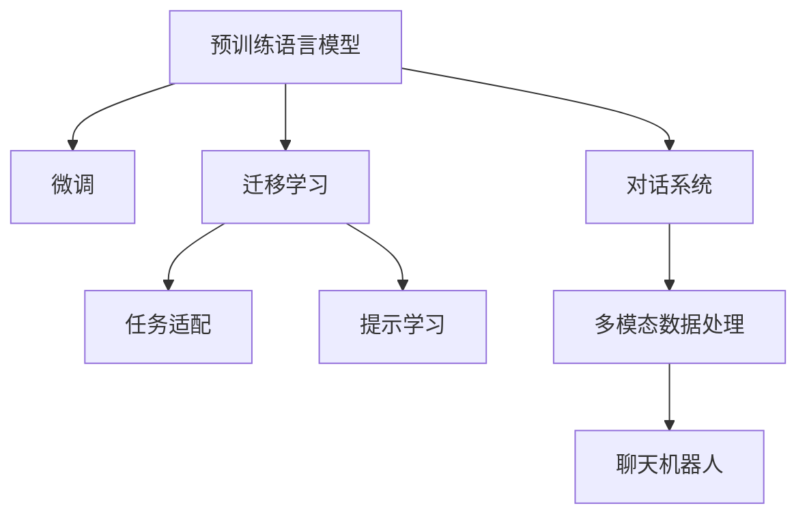

                 

## 1. 背景介绍

随着科技的不断进步，银行业正逐步向数字化转型，聊天机器人作为数字银行和金融服务的重要组成部分，正在改变传统的客户服务方式。数字银行将人工智能(AI)技术应用于客户互动和业务流程中，通过聊天机器人提供24/7的即时服务，提升用户体验和运营效率。

### 1.1 数字银行和聊天机器人的发展

数字银行兴起于2008年全球金融危机之后，目的是为了提升银行服务效率，降低成本，改善客户体验。随着移动支付和金融科技的发展，数字银行得以快速扩展，满足了用户对便捷、高效、安全的金融服务需求。

聊天机器人在银行业的应用主要集中在客户服务、操作指引、业务咨询、产品推荐等方面。聊天机器人能够提供快速响应的客户服务，缓解银行柜员的压力，降低人力成本。用户可以通过聊天机器人进行账户查询、交易操作、贷款申请、投资咨询等，无需等待，操作便捷。

### 1.2 技术发展与需求匹配

聊天机器人在银行业的应用，得益于自然语言处理(NLP)、语音识别、机器学习、数据分析等技术的进步。以NLP技术为例，通过预训练语言模型、微调、提示学习等技术，聊天机器人可以理解并处理复杂的自然语言指令，为用户提供准确的回答。

然而，银行的业务场景复杂多样，涉及金融、法律、风险控制等多个方面，不同用户具有不同的金融需求和心理预期。如何设计合适的聊天机器人，使其能够智能地匹配客户需求，提供个性化服务，是一个重要课题。

## 2. 核心概念与联系

### 2.1 核心概念概述

为了更好地理解聊天机器人银行业务，本节将介绍几个密切相关的核心概念：

- **聊天机器人(Chatbot)**：基于人工智能技术的对话系统，能够模拟人类的对话过程，处理用户输入并生成响应。

- **自然语言处理(Natural Language Processing, NLP)**：涉及语音识别、文本分析、语义理解、生成等技术，使计算机能够理解、处理和生成人类语言。

- **预训练语言模型(Pre-trained Language Models, PLMs)**：通过大规模语料预训练学习到的语言表示模型，如BERT、GPT系列。

- **微调(Fine-Tuning)**：在预训练模型的基础上，使用任务特定的数据集进行训练，优化模型在该任务上的表现。

- **迁移学习(Transfer Learning)**：通过预训练模型在相关任务上的表现，快速适应新任务。

- **对话系统(Conversational System)**：使机器人能够理解和回应用户输入，完成多轮对话的智能系统。

- **多模态数据处理(Multimodal Data Processing)**：结合文本、图像、语音等多种数据源，构建更全面的信息处理能力。

这些概念之间的逻辑关系可以通过以下Mermaid流程图来展示：



这个流程图展示了大语言模型的核心概念及其之间的关系：

1. 预训练语言模型通过大规模语料预训练获得基础能力。
2. 微调使模型针对特定任务进行优化，如金融咨询、账户管理等。
3. 迁移学习使得模型能够适应新的任务场景。
4. 对话系统使机器人能够模拟人类对话，实现人机互动。
5. 多模态数据处理增强了机器人对多种信息源的整合能力。

这些概念共同构成了聊天机器人银行业务的基础框架，使其能够高效、准确地处理复杂的银行业务需求。

## 3. 核心算法原理 & 具体操作步骤

### 3.1 算法原理概述

基于自然语言处理的聊天机器人银行业务，本质上是一个多轮对话生成过程。其核心思想是：通过预训练语言模型获得通用的语言表示，通过微调和迁移学习获得特定任务的适配能力，并通过对话系统生成多轮对话，实现人机互动。

形式化地，假设预训练语言模型为 $M_{\theta}$，其中 $\theta$ 为预训练得到的模型参数。假设银行业务场景的对话数据集为 $D=\{(x_i,y_i)\}_{i=1}^N$，其中 $x_i$ 为用户输入的文本，$y_i$ 为模型的输出回答。微调的目标是找到新的模型参数 $\hat{\theta}$，使得：

$$
\hat{\theta}=\mathop{\arg\min}_{\theta} \mathcal{L}(M_{\theta},D)
$$

其中 $\mathcal{L}$ 为针对任务设计的损失函数，用于衡量模型输出与真实标签之间的差异。

### 3.2 算法步骤详解

基于自然语言处理的银行业聊天机器人微调过程，通常包括以下几个关键步骤：

**Step 1: 准备预训练模型和数据集**
- 选择合适的预训练语言模型 $M_{\theta}$ 作为初始化参数，如 GPT、BERT 等。
- 准备银行业务场景的对话数据集 $D$，划分为训练集、验证集和测试集。一般要求对话数据与预训练数据的分布不要差异过大。

**Step 2: 添加任务适配层**
- 根据银行业务的具体需求，在预训练模型顶层设计合适的对话生成和判断层。
- 对于生成任务，通常在顶层添加生成器，用于生成自然语言回答。
- 对于判断任务，通常添加分类器，用于判断对话流程的正确性。

**Step 3: 设置微调超参数**
- 选择合适的优化算法及其参数，如 AdamW、SGD 等，设置学习率、批大小、迭代轮数等。
- 设置正则化技术及强度，包括权重衰减、Dropout、Early Stopping 等。
- 确定冻结预训练参数的策略，如仅微调顶层，或全部参数都参与微调。

**Step 4: 执行梯度训练**
- 将训练集数据分批次输入模型，前向传播计算损失函数。
- 反向传播计算参数梯度，根据设定的优化算法和学习率更新模型参数。
- 周期性在验证集上评估模型性能，根据性能指标决定是否触发 Early Stopping。
- 重复上述步骤直到满足预设的迭代轮数或 Early Stopping 条件。

**Step 5: 测试和部署**
- 在测试集上评估微调后模型 $M_{\hat{\theta}}$ 的性能，对比微调前后的精度提升。
- 使用微调后的模型对新样本进行推理预测，集成到实际的应用系统中。
- 持续收集新的数据，定期重新微调模型，以适应数据分布的变化。

以上是基于自然语言处理的银行业务聊天机器人微调的一般流程。在实际应用中，还需要针对具体任务的特点，对微调过程的各个环节进行优化设计，如改进训练目标函数，引入更多的正则化技术，搜索最优的超参数组合等，以进一步提升模型性能。

### 3.3 算法优缺点

基于自然语言处理的银行业务聊天机器人微调方法具有以下优点：

- 高效快速：通过预训练模型快速适配银行业务，大大降低了开发和运营成本。
- 高准确性：利用NLP技术处理复杂的银行业务对话，准确性高，用户体验好。
- 灵活性：根据银行业务需求，灵活适配各种聊天机器人任务，如账户查询、贷款咨询等。
- 可解释性：对话生成过程可解释性强，用户能够清晰理解机器人的操作逻辑。

同时，该方法也存在一些局限性：

- 依赖数据质量：微调效果高度依赖银行业务对话数据集的质量和数量，数据不足或噪声较多会影响效果。
- 模型复杂性：预训练和微调过程复杂，需要大规模算力支持。
- 定制化需求高：银行业务场景复杂，需要针对不同任务定制化开发聊天机器人，工作量大。
- 隐私保护：银行业务涉及大量敏感数据，聊天机器人需严格遵守数据保护法规。

尽管存在这些局限性，但就目前而言，基于自然语言处理的银行业务聊天机器人微调方法仍是大规模银行业务自动化和智能化的重要手段。未来相关研究的重点在于如何进一步降低微调对数据的质量和数量的依赖，提高模型的通用性和可解释性，同时兼顾隐私保护和业务安全。

### 3.4 算法应用领域

基于银行业务的聊天机器人，可以广泛应用于各种银行业务场景，例如：

- **客户服务**：用户可以通过聊天机器人查询账户余额、交易记录、理财产品等，解决常见问题。
- **业务咨询**：用户可以咨询贷款利率、贷款条件、信用卡申请等，获得专业建议。
- **操作指引**：用户可以通过聊天机器人了解如何开通账户、修改密码、关闭账户等业务操作流程。
- **投诉处理**：用户可以提交投诉和建议，机器人自动分类并转接至相应部门。
- **风险控制**：用户进行大额交易时，机器人自动提示风险并建议用户确认。

除了上述这些经典应用外，聊天机器人还可以用于各种个性化服务，如用户画像分析、信用评分预测、智能投顾等，为银行业务的数字化和智能化升级提供新的动力。

## 4. 数学模型和公式 & 详细讲解  
### 4.1 数学模型构建

本节将使用数学语言对基于自然语言处理的银行业务聊天机器人微调过程进行更加严格的刻画。

记预训练语言模型为 $M_{\theta}$，其中 $\theta$ 为预训练得到的模型参数。假设银行业务场景的对话数据集为 $D=\{(x_i,y_i)\}_{i=1}^N$，其中 $x_i$ 为用户输入的文本，$y_i$ 为模型的输出回答。

定义模型 $M_{\theta}$ 在输入 $x$ 上的输出为 $\hat{y}=M_{\theta}(x) \in [0,1]$，表示用户输入的文本与银行相关业务的匹配度。真实标签 $y \in \{0,1\}$。则对话系统的损失函数定义为：

$$
\ell(M_{\theta}(x),y) = -[y\log \hat{y} + (1-y)\log (1-\hat{y})]
$$

将其代入经验风险公式，得：

$$
\mathcal{L}(\theta) = -\frac{1}{N}\sum_{i=1}^N [y_i\log M_{\theta}(x_i)+(1-y_i)\log(1-M_{\theta}(x_i))]
$$

在得到损失函数的梯度后，即可带入参数更新公式，完成模型的迭代优化。重复上述过程直至收敛，最终得到适应银行业务场景的聊天机器人模型。

### 4.2 公式推导过程

以下我们以贷款咨询对话为例，推导生成任务的交叉熵损失函数及其梯度的计算公式。

假设模型 $M_{\theta}$ 在输入 $x$ 上的输出为 $\hat{y}=M_{\theta}(x) \in [0,1]$，表示用户输入的文本与银行贷款相关业务的匹配度。真实标签 $y \in \{0,1\}$。则生成任务的交叉熵损失函数定义为：

$$
\ell(M_{\theta}(x),y) = -[y\log \hat{y} + (1-y)\log (1-\hat{y})]
$$

将其代入经验风险公式，得：

$$
\mathcal{L}(\theta) = -\frac{1}{N}\sum_{i=1}^N [y_i\log M_{\theta}(x_i)+(1-y_i)\log(1-M_{\theta}(x_i))]
$$

根据链式法则，损失函数对参数 $\theta_k$ 的梯度为：

$$
\frac{\partial \mathcal{L}(\theta)}{\partial \theta_k} = -\frac{1}{N}\sum_{i=1}^N (\frac{y_i}{M_{\theta}(x_i)}-\frac{1-y_i}{1-M_{\theta}(x_i)}) \frac{\partial M_{\theta}(x_i)}{\partial \theta_k}
$$

其中 $\frac{\partial M_{\theta}(x_i)}{\partial \theta_k}$ 可进一步递归展开，利用自动微分技术完成计算。

在得到损失函数的梯度后，即可带入参数更新公式，完成模型的迭代优化。重复上述过程直至收敛，最终得到适应银行业务场景的聊天机器人模型。

## 5. 项目实践：代码实例和详细解释说明
### 5.1 开发环境搭建

在进行银行业务聊天机器人微调实践前，我们需要准备好开发环境。以下是使用Python进行PyTorch开发的环境配置流程：

1. 安装Anaconda：从官网下载并安装Anaconda，用于创建独立的Python环境。

2. 创建并激活虚拟环境：
```bash
conda create -n pytorch-env python=3.8 
conda activate pytorch-env
```

3. 安装PyTorch：根据CUDA版本，从官网获取对应的安装命令。例如：
```bash
conda install pytorch torchvision torchaudio cudatoolkit=11.1 -c pytorch -c conda-forge
```

4. 安装Transformers库：
```bash
pip install transformers
```

5. 安装各类工具包：
```bash
pip install numpy pandas scikit-learn matplotlib tqdm jupyter notebook ipython
```

完成上述步骤后，即可在`pytorch-env`环境中开始银行业务聊天机器人微调实践。

### 5.2 源代码详细实现

这里我们以贷款咨询对话生成为例，给出使用Transformers库对BERT模型进行银行业务微调的PyTorch代码实现。

首先，定义银行业务对话生成任务的标签：

```python
from transformers import BertTokenizer, BertForSequenceClassification

label_list = ['贷款申请成功', '贷款申请失败', '贷款咨询', '投诉']
```

然后，定义标签与数字的映射关系：

```python
label2id = {label: i for i, label in enumerate(label_list)}
id2label = {i: label for i, label in enumerate(label_list)}
```

接着，定义模型的训练函数：

```python
from transformers import AdamW
import torch
from torch.utils.data import Dataset, DataLoader

class LoanDataset(Dataset):
    def __init__(self, texts, labels, tokenizer, max_len=128):
        self.texts = texts
        self.labels = labels
        self.tokenizer = tokenizer
        self.max_len = max_len
        
    def __len__(self):
        return len(self.texts)
    
    def __getitem__(self, item):
        text = self.texts[item]
        label = self.labels[item]
        
        encoding = self.tokenizer(text, return_tensors='pt', max_length=self.max_len, padding='max_length', truncation=True)
        input_ids = encoding['input_ids'][0]
        attention_mask = encoding['attention_mask'][0]
        
        label = label2id[label]
        
        return {'input_ids': input_ids, 
                'attention_mask': attention_mask,
                'labels': torch.tensor([label], dtype=torch.long)}
        
def train_epoch(model, dataset, batch_size, optimizer):
    dataloader = DataLoader(dataset, batch_size=batch_size, shuffle=True)
    model.train()
    epoch_loss = 0
    for batch in dataloader:
        input_ids = batch['input_ids'].to(device)
        attention_mask = batch['attention_mask'].to(device)
        labels = batch['labels'].to(device)
        model.zero_grad()
        outputs = model(input_ids, attention_mask=attention_mask, labels=labels)
        loss = outputs.loss
        epoch_loss += loss.item()
        loss.backward()
        optimizer.step()
    return epoch_loss / len(dataloader)

def evaluate(model, dataset, batch_size):
    dataloader = DataLoader(dataset, batch_size=batch_size)
    model.eval()
    preds, labels = [], []
    with torch.no_grad():
        for batch in dataloader:
            input_ids = batch['input_ids'].to(device)
            attention_mask = batch['attention_mask'].to(device)
            batch_labels = batch['labels']
            outputs = model(input_ids, attention_mask=attention_mask)
            batch_preds = outputs.logits.argmax(dim=2).to('cpu').tolist()
            batch_labels = batch_labels.to('cpu').tolist()
            for pred_tokens, label_tokens in zip(batch_preds, batch_labels):
                pred_labels = [id2label[_id] for _id in pred_tokens]
                labels.append(label_tokens)
                preds.append(pred_labels)
                
    print(classification_report(labels, preds))
```

最后，启动训练流程并在测试集上评估：

```python
epochs = 5
batch_size = 16

device = torch.device('cuda') if torch.cuda.is_available() else torch.device('cpu')
model.to(device)

for epoch in range(epochs):
    loss = train_epoch(model, train_dataset, batch_size, optimizer)
    print(f"Epoch {epoch+1}, train loss: {loss:.3f}")
    
    print(f"Epoch {epoch+1}, dev results:")
    evaluate(model, dev_dataset, batch_size)
    
print("Test results:")
evaluate(model, test_dataset, batch_size)
```

以上就是使用PyTorch对BERT进行银行业务聊天机器人微调的完整代码实现。可以看到，得益于Transformers库的强大封装，我们可以用相对简洁的代码完成BERT模型的加载和微调。

### 5.3 代码解读与分析

让我们再详细解读一下关键代码的实现细节：

**LoanDataset类**：
- `__init__`方法：初始化训练样本、标签、分词器等关键组件。
- `__len__`方法：返回数据集的样本数量。
- `__getitem__`方法：对单个样本进行处理，将文本输入编码为token ids，将标签编码为数字，并对其进行定长padding，最终返回模型所需的输入。

**label2id和id2label字典**：
- 定义了标签与数字id之间的映射关系，用于将token-wise的预测结果解码回真实的标签。

**训练和评估函数**：
- 使用PyTorch的DataLoader对数据集进行批次化加载，供模型训练和推理使用。
- 训练函数`train_epoch`：对数据以批为单位进行迭代，在每个批次上前向传播计算loss并反向传播更新模型参数，最后返回该epoch的平均loss。
- 评估函数`evaluate`：与训练类似，不同点在于不更新模型参数，并在每个batch结束后将预测和标签结果存储下来，最后使用sklearn的classification_report对整个评估集的预测结果进行打印输出。

**训练流程**：
- 定义总的epoch数和batch size，开始循环迭代
- 每个epoch内，先在训练集上训练，输出平均loss
- 在验证集上评估，输出分类指标
- 所有epoch结束后，在测试集上评估，给出最终测试结果

可以看到，PyTorch配合Transformers库使得BERT微调的代码实现变得简洁高效。开发者可以将更多精力放在数据处理、模型改进等高层逻辑上，而不必过多关注底层的实现细节。

当然，工业级的系统实现还需考虑更多因素，如模型的保存和部署、超参数的自动搜索、更灵活的任务适配层等。但核心的微调范式基本与此类似。

## 6. 实际应用场景
### 6.1 智能客服系统

基于银行业务的聊天机器人，可以广泛应用于智能客服系统的构建。传统客服往往需要配备大量人力，高峰期响应缓慢，且一致性和专业性难以保证。而使用微调后的聊天机器人，可以7x24小时不间断服务，快速响应客户咨询，用自然流畅的语言解答各类常见问题。

在技术实现上，可以收集企业内部的历史客服对话记录，将问题和最佳答复构建成监督数据，在此基础上对预训练聊天机器人进行微调。微调后的聊天机器人能够自动理解用户意图，匹配最合适的回答。对于客户提出的新问题，还可以接入检索系统实时搜索相关内容，动态组织生成回答。如此构建的智能客服系统，能大幅提升客户咨询体验和问题解决效率。

### 6.2 金融舆情监测

金融机构需要实时监测市场舆论动向，以便及时应对负面信息传播，规避金融风险。传统的人工监测方式成本高、效率低，难以应对网络时代海量信息爆发的挑战。基于银行业务的聊天机器人，可以监测社交媒体、新闻网站等文本数据，通过文本分类和情感分析，实时识别和分析舆情动态，及时预警金融风险。

具体而言，可以收集金融领域相关的新闻、报道、评论等文本数据，并对其进行主题标注和情感标注。在此基础上对预训练语言模型进行微调，使其能够自动判断文本属于何种主题，情感倾向是正面、中性还是负面。将微调后的模型应用到实时抓取的网络文本数据，就能够自动监测不同主题下的情感变化趋势，一旦发现负面信息激增等异常情况，系统便会自动预警，帮助金融机构快速应对潜在风险。

### 6.3 个性化推荐系统

当前的推荐系统往往只依赖用户的历史行为数据进行物品推荐，无法深入理解用户的真实兴趣偏好。基于银行业务的聊天机器人，可以更全面地了解用户的金融需求和行为，从而提供个性化的金融产品推荐。

在实践中，可以收集用户浏览、点击、评论、分享等行为数据，提取和用户交互的金融产品信息。将产品信息作为模型输入，用户的后续行为（如是否点击、购买等）作为监督信号，在此基础上微调预训练语言模型。微调后的模型能够从文本内容中准确把握用户的兴趣点。在生成推荐列表时，先用候选产品的文本描述作为输入，由模型预测用户的兴趣匹配度，再结合其他特征综合排序，便可以得到个性化程度更高的推荐结果。

### 6.4 未来应用展望

随着银行业务聊天机器人技术的不断发展，基于微调范式将在更多领域得到应用，为金融科技带来变革性影响。

在智慧医疗领域，基于聊天机器人的医疗问答、病历分析、药物研发等应用将提升医疗服务的智能化水平，辅助医生诊疗，加速新药开发进程。

在智能教育领域，聊天机器人可应用于作业批改、学情分析、知识推荐等方面，因材施教，促进教育公平，提高教学质量。

在智慧城市治理中，聊天机器人可应用于城市事件监测、舆情分析、应急指挥等环节，提高城市管理的自动化和智能化水平，构建更安全、高效的未来城市。

此外，在企业生产、社会治理、文娱传媒等众多领域，基于银行业务的聊天机器人微调技术也将不断涌现，为各行各业带来新的技术动力。相信随着技术的日益成熟，微调方法将成为银行业务自动化和智能化的重要手段，推动人工智能技术在垂直行业的规模化落地。

## 7. 工具和资源推荐
### 7.1 学习资源推荐

为了帮助开发者系统掌握银行业务聊天机器人的理论基础和实践技巧，这里推荐一些优质的学习资源：

1. 《Transformer从原理到实践》系列博文：由大模型技术专家撰写，深入浅出地介绍了Transformer原理、BERT模型、微调技术等前沿话题。

2. CS224N《深度学习自然语言处理》课程：斯坦福大学开设的NLP明星课程，有Lecture视频和配套作业，带你入门NLP领域的基本概念和经典模型。

3. 《Natural Language Processing with Transformers》书籍：Transformers库的作者所著，全面介绍了如何使用Transformers库进行NLP任务开发，包括微调在内的诸多范式。

4. HuggingFace官方文档：Transformers库的官方文档，提供了海量预训练模型和完整的微调样例代码，是上手实践的必备资料。

5. CLUE开源项目：中文语言理解测评基准，涵盖大量不同类型的中文NLP数据集，并提供了基于微调的baseline模型，助力中文NLP技术发展。

通过对这些资源的学习实践，相信你一定能够快速掌握银行业务聊天机器人的精髓，并用于解决实际的金融问题。
###  7.2 开发工具推荐

高效的开发离不开优秀的工具支持。以下是几款用于银行业务聊天机器人开发的常用工具：

1. PyTorch：基于Python的开源深度学习框架，灵活动态的计算图，适合快速迭代研究。大部分预训练语言模型都有PyTorch版本的实现。

2. TensorFlow：由Google主导开发的开源深度学习框架，生产部署方便，适合大规模工程应用。同样有丰富的预训练语言模型资源。

3. Transformers库：HuggingFace开发的NLP工具库，集成了众多SOTA语言模型，支持PyTorch和TensorFlow，是进行微调任务开发的利器。

4. Weights & Biases：模型训练的实验跟踪工具，可以记录和可视化模型训练过程中的各项指标，方便对比和调优。与主流深度学习框架无缝集成。

5. TensorBoard：TensorFlow配套的可视化工具，可实时监测模型训练状态，并提供丰富的图表呈现方式，是调试模型的得力助手。

6. Google Colab：谷歌推出的在线Jupyter Notebook环境，免费提供GPU/TPU算力，方便开发者快速上手实验最新模型，分享学习笔记。

合理利用这些工具，可以显著提升银行业务聊天机器人微调任务的开发效率，加快创新迭代的步伐。

### 7.3 相关论文推荐

银行业务聊天机器人的研究源于学界的持续研究。以下是几篇奠基性的相关论文，推荐阅读：

1. Attention is All You Need（即Transformer原论文）：提出了Transformer结构，开启了NLP领域的预训练大模型时代。

2. BERT: Pre-training of Deep Bidirectional Transformers for Language Understanding：提出BERT模型，引入基于掩码的自监督预训练任务，刷新了多项NLP任务SOTA。

3. Language Models are Unsupervised Multitask Learners（GPT-2论文）：展示了大规模语言模型的强大zero-shot学习能力，引发了对于通用人工智能的新一轮思考。

4. Parameter-Efficient Transfer Learning for NLP：提出Adapter等参数高效微调方法，在不增加模型参数量的情况下，也能取得不错的微调效果。

5. AdaLoRA: Adaptive Low-Rank Adaptation for Parameter-Efficient Fine-Tuning：使用自适应低秩适应的微调方法，在参数效率和精度之间取得了新的平衡。

这些论文代表了大语言模型微调技术的发展脉络。通过学习这些前沿成果，可以帮助研究者把握学科前进方向，激发更多的创新灵感。

## 8. 总结：未来发展趋势与挑战

### 8.1 总结

本文对基于自然语言处理的银行业务聊天机器人微调方法进行了全面系统的介绍。首先阐述了银行业务聊天机器人的背景和发展，明确了其对提升银行业务自动化和智能化水平的重要意义。其次，从原理到实践，详细讲解了银行业务对话生成任务的数学原理和关键步骤，给出了微调任务开发的完整代码实例。同时，本文还广泛探讨了银行业务聊天机器人技术在智能客服、金融舆情、个性化推荐等多个行业领域的应用前景，展示了微调范式的巨大潜力。此外，本文精选了微调技术的各类学习资源，力求为读者提供全方位的技术指引。

通过本文的系统梳理，可以看到，基于银行业务的自然语言处理聊天机器人微调方法正在成为银行业务自动化和智能化的重要手段，极大地拓展了银行业务的数字化水平。得益于自然语言处理技术的不断进步，银行业务聊天机器人能够理解和生成复杂的银行业务对话，显著提升了服务效率和用户体验。未来，伴随自然语言处理技术的持续演进，银行业务聊天机器人技术必将更加智能、高效、可靠，为银行业务的数字化和智能化升级提供新的动力。

### 8.2 未来发展趋势

展望未来，银行业务聊天机器人技术将呈现以下几个发展趋势：

1. 模型规模持续增大。随着算力成本的下降和数据规模的扩张，预训练语言模型的参数量还将持续增长。超大规模语言模型蕴含的丰富语言知识，有望支撑更加复杂多变的银行业务对话生成任务。

2. 微调方法日趋多样。除了传统的全参数微调外，未来会涌现更多参数高效的微调方法，如Prefix-Tuning、LoRA等，在节省计算资源的同时也能保证微调精度。

3. 持续学习成为常态。随着数据分布的不断变化，微调模型也需要持续学习新知识以保持性能。如何在不遗忘原有知识的同时，高效吸收新样本信息，将成为重要的研究课题。

4. 标注样本需求降低。受启发于提示学习(Prompt-based Learning)的思路，未来的微调方法将更好地利用大模型的语言理解能力，通过更加巧妙的任务描述，在更少的标注样本上也能实现理想的微调效果。

5. 多模态数据处理崛起。当前的微调主要聚焦于纯文本数据，未来会进一步拓展到图像、视频、语音等多种数据源微调。多模态信息的融合，将显著提升银行业务聊天机器人对现实世界的理解和建模能力。

6. 模型通用性增强。经过海量数据的预训练和多领域任务的微调，未来的银行业务聊天机器人将具备更强大的常识推理和跨领域迁移能力，逐步迈向通用人工智能(AGI)的目标。

以上趋势凸显了银行业务聊天机器人技术的广阔前景。这些方向的探索发展，必将进一步提升银行业务系统的性能和应用范围，为金融科技带来新的变革。

### 8.3 面临的挑战

尽管银行业务聊天机器人技术已经取得了瞩目成就，但在迈向更加智能化、普适化应用的过程中，它仍面临着诸多挑战：

1. 标注成本瓶颈。虽然微调大大降低了标注数据的需求，但对于长尾应用场景，难以获得充足的高质量标注数据，成为制约微调性能的瓶颈。如何进一步降低微调对标注样本的依赖，将是一大难题。

2. 模型鲁棒性不足。当前微调模型面对域外数据时，泛化性能往往大打折扣。对于测试样本的微小扰动，微调模型的预测也容易发生波动。如何提高微调模型的鲁棒性，避免灾难性遗忘，还需要更多理论和实践的积累。

3. 推理效率有待提高。大规模语言模型虽然精度高，但在实际部署时往往面临推理速度慢、内存占用大等效率问题。如何在保证性能的同时，简化模型结构，提升推理速度，优化资源占用，将是重要的优化方向。

4. 可解释性亟需加强。当前微调模型更像是"黑盒"系统，难以解释其内部工作机制和决策逻辑。对于医疗、金融等高风险应用，算法的可解释性和可审计性尤为重要。如何赋予微调模型更强的可解释性，将是亟待攻克的难题。

5. 安全性有待保障。预训练语言模型难免会学习到有偏见、有害的信息，通过微调传递到下游任务，产生误导性、歧视性的输出，给实际应用带来安全隐患。如何从数据和算法层面消除模型偏见，避免恶意用途，确保输出的安全性，也将是重要的研究课题。

6. 知识整合能力不足。现有的微调模型往往局限于任务内数据，难以灵活吸收和运用更广泛的先验知识。如何让微调过程更好地与外部知识库、规则库等专家知识结合，形成更加全面、准确的信息整合能力，还有很大的想象空间。

正视银行业务聊天机器人面临的这些挑战，积极应对并寻求突破，将是大语言模型微调走向成熟的必由之路。相信随着学界和产业界的共同努力，这些挑战终将一一被克服，银行业务聊天机器人技术必将在构建智能金融体系中扮演越来越重要的角色。

### 8.4 研究展望

面对银行业务聊天机器人所面临的种种挑战，未来的研究需要在以下几个方面寻求新的突破：

1. 探索无监督和半监督微调方法。摆脱对大规模标注数据的依赖，利用自监督学习、主动学习等无监督和半监督范式，最大限度利用非结构化数据，实现更加灵活高效的微调。

2. 研究参数高效和计算高效的微调范式。开发更加参数高效的微调方法，在固定大部分预训练参数的同时，只更新极少量的任务相关参数。同时优化微调模型的计算图，减少前向传播和反向传播的资源消耗，实现更加轻量级、实时性的部署。

3. 融合因果和对比学习范式。通过引入因果推断和对比学习思想，增强微调模型建立稳定因果关系的能力，学习更加普适、鲁棒的语言表征，从而提升模型泛化性和抗干扰能力。

4. 引入更多先验知识。将符号化的先验知识，如知识图谱、逻辑规则等，与神经网络模型进行巧妙融合，引导微调过程学习更准确、合理的语言模型。同时加强不同模态数据的整合，实现视觉、语音等多模态信息与文本信息的协同建模。

5. 结合因果分析和博弈论工具。将因果分析方法引入微调模型，识别出模型决策的关键特征，增强输出解释的因果性和逻辑性。借助博弈论工具刻画人机交互过程，主动探索并规避模型的脆弱点，提高系统稳定性。

6. 纳入伦理道德约束。在模型训练目标中引入伦理导向的评估指标，过滤和惩罚有偏见、有害的输出倾向。同时加强人工干预和审核，建立模型行为的监管机制，确保输出符合人类价值观和伦理道德。

这些研究方向的探索，必将引领银行业务聊天机器人技术迈向更高的台阶，为构建安全、可靠、可解释、可控的智能系统铺平道路。面向未来，银行业务聊天机器人技术还需要与其他人工智能技术进行更深入的融合，如知识表示、因果推理、强化学习等，多路径协同发力，共同推动智能金融系统的进步。只有勇于创新、敢于突破，才能不断拓展银行业务聊天机器人的边界，让智能技术更好地造福银行业务和金融消费者。

## 9. 附录：常见问题与解答

**Q1：银行业务聊天机器人如何保证数据安全？**

A: 银行业务聊天机器人需严格遵守数据保护法规，确保用户隐私和金融数据安全。在数据采集、存储、传输等环节，应采用加密、匿名化等技术手段保护用户隐私，防止数据泄露和滥用。

**Q2：银行业务聊天机器人如何处理金融复杂业务？**

A: 银行业务聊天机器人需具备较强的逻辑推理和问题解决能力，能够处理复杂的金融业务。通过预训练模型学习通用的语言表示，并在特定领域的数据上进行微调，可以提升模型在金融业务场景中的表现。

**Q3：银行业务聊天机器人如何提升用户满意度？**

A: 银行业务聊天机器人需注重用户界面设计和交互体验，提供清晰友好的用户界面，简化用户操作流程。同时，应实时监控用户反馈，不断优化模型和对话策略，提升用户满意度和信任感。

**Q4：银行业务聊天机器人如何实现跨平台应用？**

A: 银行业务聊天机器人需支持多种客户端平台，如PC端、移动端、智能音箱等。通过跨平台开发框架和API接口，确保不同平台间的数据互通和功能一致性。

**Q5：银行业务聊天机器人如何应对恶意攻击？**

A: 银行业务聊天机器人需具备风险识别和防范能力，防止恶意攻击和欺诈行为。通过监控用户行为和对话内容，及时发现异常行为，进行风险预警和防范。

**Q6：银行业务聊天机器人如何提升运营效率？**

A: 银行业务聊天机器人需具备自动化处理能力，减少人工干预，提高运营效率。通过微调和优化，实现高效的业务处理流程，提升业务处理速度和准确性。

以上问题解答，可以帮助开发者在实际应用中更好地理解和应对银行业务聊天机器人技术面临的挑战，确保其安全可靠、高效便捷的运行。银行业务聊天机器人技术的发展离不开各方共同努力，只有不断探索和创新，才能实现其长足进步，为银行业务数字化转型提供有力支持。

