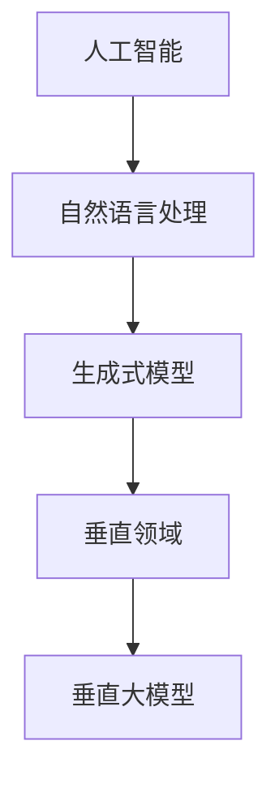

                 

# 聊聊AI创业：内容创作垂直大模型的机遇

> 关键词：人工智能,内容创作,垂直领域,大模型,生成式模型,自然语言处理,文本生成,文本分析,垂直应用

## 1. 背景介绍

### 1.1 问题由来

随着人工智能技术的快速发展，AI创业领域逐渐成为了一个备受关注的焦点。在众多AI创业项目中，内容创作领域（特别是垂直领域）的垂直大模型（Vertical Big Models）应用逐渐成为新的热门。这些模型能够针对特定领域的知识和语言习惯进行深度学习和微调，输出符合特定领域需求的内容，具有极强的市场应用前景。本文将重点探讨内容创作垂直大模型的原理、应用以及未来发展趋势。

### 1.2 问题核心关键点

内容创作垂直大模型的核心关键点在于：

- **领域知识的深度学习**：模型能够通过大量垂直领域的数据进行训练，学习到特定领域的专业术语、行业规范等，使得生成的内容更加准确和专业。
- **语言的流畅性和表达能力**：模型需要具备高度的自然语言处理能力，能够生成符合语法、逻辑以及情感表达的文本。
- **高互动性和个性化**：模型应能够根据用户的个性化需求，生成个性化的内容推荐，增强用户的参与度和满意度。
- **可扩展性和灵活性**：模型需要具备良好的扩展性，能够适应不同应用场景和需求，同时具备一定的灵活性，能够应对领域的快速变化和需求更新。

这些关键点共同构成了内容创作垂直大模型的核心能力，为AI创业公司提供了广阔的应用空间。

## 2. 核心概念与联系

### 2.1 核心概念概述

在深入探讨内容创作垂直大模型的原理与应用之前，我们需要先了解几个核心概念：

- **人工智能（AI）**：使用机器学习和深度学习技术，让计算机系统能够模拟人类智能，执行复杂任务的能力。
- **自然语言处理（NLP）**：研究如何使计算机能够理解、处理和生成人类语言。
- **生成式模型**：一种能够根据输入数据生成新的、具有一定概率的输出数据的模型，如GAN（Generative Adversarial Networks）、VAE（Variational Autoencoders）等。
- **垂直领域（Vertical Field）**：指针对特定行业或应用场景的领域，如金融、医疗、法律等。
- **垂直大模型（Vertical Big Models）**：基于深度学习框架训练的，能够处理特定领域任务的模型，具有高度的领域适应性和专业性。

这些概念之间的联系可以通过以下Mermaid流程图来展示：



这个流程图展示了从人工智能到垂直大模型的演进过程，每一步都是对前一步能力的深化和特化，最终形成了能够针对特定领域进行内容创作的模型。

## 3. 核心算法原理 & 具体操作步骤

### 3.1 算法原理概述

内容创作垂直大模型的核心算法原理主要基于以下两个方面：

- **自监督学习**：利用大规模无标签数据进行预训练，学习到通用的语言表示和模式。
- **监督学习**：针对特定领域的数据进行微调，使得模型能够输出符合特定领域要求的内容。

### 3.2 算法步骤详解

内容创作垂直大模型的微调过程通常包括以下几个关键步骤：

**Step 1: 准备数据集**

首先需要收集垂直领域的标注数据集，包括垂直领域内的文本、图片、视频等数据。标注数据集需要包含垂直领域的专业术语、行业规范等，以确保模型能够学习到特定领域的专业知识。

**Step 2: 设计任务适配层**

根据具体应用场景，设计相应的任务适配层。任务适配层通常包括输入编码层和输出解码层。输入编码层负责将输入数据转换为模型能够处理的格式，输出解码层负责将模型生成的结果转换为最终的应用格式。

**Step 3: 设置微调超参数**

选择适合该垂直领域的微调超参数，包括学习率、批大小、迭代次数、正则化参数等。学习率通常比预训练时小，以避免破坏预训练权重。

**Step 4: 执行微调**

使用收集到的标注数据，在任务适配层上进行微调。微调过程通常包括前向传播、计算损失函数、反向传播更新参数等步骤，直到模型收敛或达到预设的迭代次数。

**Step 5: 评估和测试**

在微调完成后，使用验证集和测试集对模型进行评估和测试，确保其能够在垂直领域内生成高质量的内容。

### 3.3 算法优缺点

内容创作垂直大模型的优点包括：

- **领域适应性强**：模型能够根据特定领域的知识和语言习惯进行调整，生成符合领域需求的内容。
- **数据依赖性低**：相较于通用模型，垂直大模型对标注数据的需求相对较低，能够利用少量标注数据进行微调。
- **生成内容质量高**：由于垂直大模型经过特定领域的训练，生成内容的准确性和专业性较高。

缺点包括：

- **训练成本高**：需要收集大量的垂直领域数据，并进行标注，增加了训练成本。
- **模型泛化能力有限**：垂直大模型通常针对特定领域进行训练，难以适应领域外的数据。

## 4. 数学模型和公式 & 详细讲解

### 4.1 数学模型构建

内容创作垂直大模型的数学模型构建基于深度学习框架，通常使用自编码器、RNN（Recurrent Neural Networks）、Transformer等结构。以Transformer为例，模型主要由编码器和解码器组成，其中编码器负责将输入数据转换为模型能够处理的表示，解码器负责生成目标输出。

### 4.2 公式推导过程

以Transformer模型为例，其基本推导过程如下：

假设输入序列为 $\{x_1, x_2, ..., x_n\}$，模型目标为生成序列 $\{y_1, y_2, ..., y_m\}$。Transformer模型将输入序列映射为 $H_{enc}$，并通过注意力机制计算得到编码器输出 $H_{dec}$，再经过解码器生成目标序列 $\hat{y}_1, \hat{y}_2, ..., \hat{y}_m$。

模型损失函数通常为交叉熵损失：

$$
\mathcal{L} = -\frac{1}{N} \sum_{i=1}^N \sum_{j=1}^M \log \hat{y}_{i,j}
$$

其中 $N$ 为序列长度，$M$ 为输出维度，$\hat{y}_{i,j}$ 为模型在时间步 $i$ 和位置 $j$ 上的预测输出。

### 4.3 案例分析与讲解

以医疗领域的垂直大模型为例，模型需要对医学文本进行分词、词性标注、命名实体识别等任务，然后生成医生病历摘要、药物说明等文本。具体过程如下：

- **预训练**：在通用语料库上进行自监督学习，如掩码语言模型（Masked Language Modeling）、下一句预测（Next Sentence Prediction）等。
- **微调**：使用医疗领域的标注数据，如医生病历、药品说明书等，进行监督学习微调。
- **测试**：在测试集上进行评估，检查模型的生成效果是否符合医疗领域的规范和标准。

## 5. 项目实践：代码实例和详细解释说明

### 5.1 开发环境搭建

在进行内容创作垂直大模型的开发前，需要准备以下开发环境：

1. 安装Python：从官网下载并安装Python 3.x版本，建议在虚拟环境中进行开发。
2. 安装TensorFlow或PyTorch：这两种深度学习框架都是常用的选择，安装方式可以参考官方文档。
3. 安装相关的NLP库：如NLTK、spaCy、gensim等，这些库可以帮助处理自然语言文本数据。

### 5.2 源代码详细实现

以下是一个基于TensorFlow的垂直大模型代码示例：

```python
import tensorflow as tf
from tensorflow.keras.layers import Input, Dense, Dropout, Embedding, Bidirectional, LSTM
from tensorflow.keras.models import Model
from tensorflow.keras.optimizers import Adam

# 定义模型结构
input_layer = Input(shape=(max_length,))
embedding_layer = Embedding(input_dim=vocab_size, output_dim=embedding_dim, input_length=max_length)(input_layer)
bidirectional_layer = Bidirectional(LSTM(128, return_sequences=True))(embedding_layer)
dense_layer = Dense(256, activation='relu')(bidirectional_layer)
dropout_layer = Dropout(0.5)(dense_layer)
output_layer = Dense(1, activation='sigmoid')(dropout_layer)

# 构建模型
model = Model(inputs=input_layer, outputs=output_layer)

# 编译模型
model.compile(loss='binary_crossentropy', optimizer=Adam(lr=0.001), metrics=['accuracy'])

# 训练模型
model.fit(x_train, y_train, epochs=10, batch_size=32, validation_data=(x_val, y_val))

# 测试模型
test_loss, test_acc = model.evaluate(x_test, y_test)
```

### 5.3 代码解读与分析

这段代码定义了一个简单的基于LSTM的垂直大模型，用于二分类任务。其中，输入层定义了输入数据的形状，嵌入层将输入数据转换为向量表示，双向LSTM层进行特征提取，全连接层进行分类，最后输出层输出二分类结果。

在训练过程中，使用了Adam优化器和交叉熵损失函数，对模型进行了10个epoch的训练，每个batch大小为32。在测试阶段，评估了模型的准确率。

## 6. 实际应用场景

### 6.1 智能医疗

内容创作垂直大模型在智能医疗领域有着广泛的应用前景。例如，智能医生助手可以根据医生的病历，自动生成病历摘要、药物说明书等文本，减轻医生的工作负担，提升医疗服务质量。

### 6.2 法律文书生成

在法律领域，内容创作垂直大模型可以自动生成法律文书，如合同、协议、诉状等。模型通过学习大量法律条文和案例，能够生成符合法律规范的文书，提高法律事务处理的效率和准确性。

### 6.3 金融报告

在金融领域，内容创作垂直大模型可以自动生成金融报告，如财务报表、市场分析报告等。模型通过学习金融领域的知识，生成高质量的金融文本，支持金融分析和决策。

### 6.4 未来应用展望

未来，内容创作垂直大模型将会在更多领域得到应用，如教育、新闻、旅游等。随着模型的不断优化和数据量的增加，内容创作垂直大模型将能够生成更加丰富、多样化的内容，进一步拓展其应用边界。

## 7. 工具和资源推荐

### 7.1 学习资源推荐

为了帮助开发者系统掌握内容创作垂直大模型的理论基础和实践技巧，这里推荐一些优质的学习资源：

1. TensorFlow官方文档：提供了详细的TensorFlow框架介绍和代码示例，适合初学者入门。
2. PyTorch官方文档：提供了丰富的深度学习框架和NLP库，适合研究人员和开发者使用。
3. Coursera《Deep Learning Specialization》：由Andrew Ng教授开设的深度学习课程，涵盖了深度学习的基础和应用。
4. Udacity《Natural Language Processing with TensorFlow》：介绍了如何使用TensorFlow进行自然语言处理和文本生成。
5. arXiv论文：订阅arXiv上的相关论文，跟踪最新的研究成果和技术进展。

### 7.2 开发工具推荐

以下是几款用于内容创作垂直大模型开发的常用工具：

1. TensorFlow：由Google主导开发的深度学习框架，生产部署方便，适合大规模工程应用。
2. PyTorch：灵活的动态计算图，适合快速迭代研究，是当前NLP领域的主流框架。
3. NLTK：Python中的自然语言处理库，提供了丰富的文本处理功能。
4. spaCy：基于Python的自然语言处理库，提供了高效的文本分析功能。
5. gensim：Python中的文本处理库，提供了多种文本处理和建模功能。

### 7.3 相关论文推荐

内容创作垂直大模型的发展源于学界的持续研究。以下是几篇奠基性的相关论文，推荐阅读：

1. Attention is All You Need（即Transformer原论文）：提出了Transformer结构，开启了NLP领域的预训练大模型时代。
2. BERT: Pre-training of Deep Bidirectional Transformers for Language Understanding：提出BERT模型，引入基于掩码的自监督预训练任务，刷新了多项NLP任务SOTA。
3. Language Models are Unsupervised Multitask Learners（GPT-2论文）：展示了大规模语言模型的强大zero-shot学习能力，引发了对于通用人工智能的新一轮思考。
4. Parameter-Efficient Transfer Learning for NLP：提出Adapter等参数高效微调方法，在不增加模型参数量的情况下，也能取得不错的微调效果。
5. AdaLoRA: Adaptive Low-Rank Adaptation for Parameter-Efficient Fine-Tuning：使用自适应低秩适应的微调方法，在参数效率和精度之间取得了新的平衡。

## 8. 总结：未来发展趋势与挑战

### 8.1 总结

本文对内容创作垂直大模型的原理与应用进行了全面系统的介绍。首先阐述了垂直大模型的研究背景和应用意义，明确了垂直大模型在内容创作领域的重要价值。其次，从原理到实践，详细讲解了垂直大模型的数学原理和关键步骤，给出了模型开发的完整代码实例。同时，本文还广泛探讨了垂直大模型在智能医疗、法律文书生成、金融报告等诸多行业领域的应用前景，展示了垂直大模型的巨大潜力。

通过本文的系统梳理，可以看到，内容创作垂直大模型正在成为NLP领域的重要范式，极大地拓展了预训练语言模型的应用边界，催生了更多的落地场景。受益于大规模语料的预训练，垂直大模型以更低的时间和标注成本，在小样本条件下也能取得不俗的效果，有力推动了NLP技术的产业化进程。未来，伴随预训练语言模型和微调方法的持续演进，相信NLP技术必将进一步拓展应用领域，为各行各业带来变革性影响。

### 8.2 未来发展趋势

展望未来，内容创作垂直大模型将呈现以下几个发展趋势：

1. **模型规模持续增大**：随着算力成本的下降和数据规模的扩张，预训练语言模型的参数量还将持续增长。超大规模语言模型蕴含的丰富语言知识，有望支撑更加复杂多变的下游任务微调。
2. **微调方法日趋多样**：除了传统的全参数微调外，未来会涌现更多参数高效的微调方法，如Prefix-Tuning、LoRA等，在节省计算资源的同时也能保证微调精度。
3. **持续学习成为常态**：随着数据分布的不断变化，垂直大模型也需要持续学习新知识以保持性能。如何在不遗忘原有知识的同时，高效吸收新样本信息，将成为重要的研究课题。
4. **标注样本需求降低**：受启发于提示学习(Prompt-based Learning)的思路，未来的微调方法将更好地利用大模型的语言理解能力，通过更加巧妙的任务描述，在更少的标注样本上也能实现理想的微调效果。
5. **多模态微调崛起**：当前的微调主要聚焦于纯文本数据，未来会进一步拓展到图像、视频、语音等多模态数据微调。多模态信息的融合，将显著提升语言模型对现实世界的理解和建模能力。
6. **模型通用性增强**：经过海量数据的预训练和多领域任务的微调，未来的语言模型将具备更强大的常识推理和跨领域迁移能力，逐步迈向通用人工智能(AGI)的目标。

以上趋势凸显了内容创作垂直大模型微调技术的广阔前景。这些方向的探索发展，必将进一步提升NLP系统的性能和应用范围，为人类认知智能的进化带来深远影响。

### 8.3 面临的挑战

尽管内容创作垂直大模型已经取得了瞩目成就，但在迈向更加智能化、普适化应用的过程中，它仍面临着诸多挑战：

1. **标注成本瓶颈**：虽然垂直大模型对标注数据的需求相对较低，但对于长尾应用场景，仍然需要收集大量的垂直领域数据，增加了标注成本。如何进一步降低微调对标注样本的依赖，将是一大难题。
2. **模型鲁棒性不足**：垂直大模型面对域外数据时，泛化性能往往大打折扣。对于测试样本的微小扰动，模型容易发生波动。如何提高垂直大模型的鲁棒性，避免灾难性遗忘，还需要更多理论和实践的积累。
3. **推理效率有待提高**：大规模语言模型虽然精度高，但在实际部署时往往面临推理速度慢、内存占用大等效率问题。如何在保证性能的同时，简化模型结构，提升推理速度，优化资源占用，将是重要的优化方向。
4. **可解释性亟需加强**：垂直大模型通常作为"黑盒"系统，难以解释其内部工作机制和决策逻辑。对于医疗、金融等高风险应用，算法的可解释性和可审计性尤为重要。如何赋予垂直大模型更强的可解释性，将是亟待攻克的难题。
5. **安全性有待保障**：预训练语言模型难免会学习到有偏见、有害的信息，通过垂直大模型传递到下游任务，产生误导性、歧视性的输出，给实际应用带来安全隐患。如何从数据和算法层面消除模型偏见，避免恶意用途，确保输出的安全性，也将是重要的研究课题。
6. **知识整合能力不足**：现有的垂直大模型往往局限于任务内数据，难以灵活吸收和运用更广泛的先验知识。如何让垂直大模型更好地与外部知识库、规则库等专家知识结合，形成更加全面、准确的信息整合能力，还有很大的想象空间。

正视垂直大模型面临的这些挑战，积极应对并寻求突破，将是大语言模型微调走向成熟的必由之路。相信随着学界和产业界的共同努力，这些挑战终将一一被克服，垂直大模型微调必将在构建人机协同的智能时代中扮演越来越重要的角色。

### 8.4 未来突破

面对垂直大模型所面临的种种挑战，未来的研究需要在以下几个方面寻求新的突破：

1. **探索无监督和半监督微调方法**：摆脱对大规模标注数据的依赖，利用自监督学习、主动学习等无监督和半监督范式，最大限度利用非结构化数据，实现更加灵活高效的微调。
2. **研究参数高效和计算高效的微调范式**：开发更加参数高效的微调方法，在固定大部分预训练参数的同时，只更新极少量的任务相关参数。同时优化微调模型的计算图，减少前向传播和反向传播的资源消耗，实现更加轻量级、实时性的部署。
3. **融合因果和对比学习范式**：通过引入因果推断和对比学习思想，增强垂直大模型建立稳定因果关系的能力，学习更加普适、鲁棒的语言表征，从而提升模型泛化性和抗干扰能力。
4. **引入更多先验知识**：将符号化的先验知识，如知识图谱、逻辑规则等，与神经网络模型进行巧妙融合，引导垂直大模型学习更准确、合理的语言模型。同时加强不同模态数据的整合，实现视觉、语音等多模态信息与文本信息的协同建模。
5. **结合因果分析和博弈论工具**：将因果分析方法引入垂直大模型，识别出模型决策的关键特征，增强输出解释的因果性和逻辑性。借助博弈论工具刻画人机交互过程，主动探索并规避模型的脆弱点，提高系统稳定性。
6. **纳入伦理道德约束**：在模型训练目标中引入伦理导向的评估指标，过滤和惩罚有偏见、有害的输出倾向。同时加强人工干预和审核，建立模型行为的监管机制，确保输出符合人类价值观和伦理道德。

这些研究方向的探索，必将引领垂直大模型微调技术迈向更高的台阶，为构建安全、可靠、可解释、可控的智能系统铺平道路。面向未来，垂直大模型微调技术还需要与其他人工智能技术进行更深入的融合，如知识表示、因果推理、强化学习等，多路径协同发力，共同推动自然语言理解和智能交互系统的进步。只有勇于创新、敢于突破，才能不断拓展语言模型的边界，让智能技术更好地造福人类社会。

## 9. 附录：常见问题与解答

**Q1：垂直大模型是否适用于所有NLP任务？**

A: 垂直大模型在大多数NLP任务上都能取得不错的效果，特别是对于数据量较小的任务。但对于一些特定领域的任务，如医学、法律等，仅仅依靠通用语料预训练的模型可能难以很好地适应。此时需要在特定领域语料上进一步预训练，再进行微调，才能获得理想效果。此外，对于一些需要时效性、个性化很强的任务，如对话、推荐等，垂直大模型也需要针对性的改进优化。

**Q2：垂直大模型如何处理长尾问题？**

A: 垂直大模型在处理长尾问题时，可以通过以下方法进行优化：
1. **数据增强**：通过数据合成、回译等方式扩充训练集，增加长尾样本的数量。
2. **正则化**：引入L2正则、Dropout等正则化技术，减少模型对长尾样本的过拟合。
3. **损失函数设计**：设计针对长尾样本的损失函数，如Focal Loss等，增加长尾样本的权重。
4. **模型结构调整**：优化模型结构，增加长尾样本的关注度，如在模型中加入长尾分类器等。

**Q3：垂直大模型的训练成本如何控制？**

A: 垂直大模型的训练成本可以通过以下方法进行控制：
1. **选择合适的预训练模型**：选择规模适中、适用于垂直领域的预训练模型，避免过度训练导致的资源浪费。
2. **数据预处理**：优化数据预处理流程，减少数据处理的时间成本。
3. **硬件加速**：使用GPU、TPU等高性能设备进行模型训练，提升训练速度。
4. **分布式训练**：利用分布式训练技术，将训练任务分配到多个计算节点上进行，提高训练效率。
5. **模型压缩和量化**：使用模型压缩、量化等技术，减小模型参数和计算量，降低训练成本。

**Q4：垂直大模型的可解释性如何增强？**

A: 垂直大模型的可解释性可以通过以下方法增强：
1. **输入解释**：提供详细的输入数据解释，帮助用户理解模型的预测过程。
2. **输出解释**：设计可解释的输出格式，如生成原因、逻辑推理等，增强模型的透明度。
3. **可视化**：通过可视化技术，展示模型的内部工作机制和决策路径，帮助用户理解模型行为。
4. **专家咨询**：引入领域专家进行模型评估和解释，提高模型的可信度和可解释性。
5. **可解释性模型**：使用可解释性模型，如决策树、规则库等，与神经网络模型结合，提升模型的可解释性。

**Q5：垂直大模型如何应对领域变化？**

A: 垂直大模型应对领域变化的方法包括：
1. **动态微调**：定期对模型进行微调，更新领域知识，适应领域变化。
2. **领域扩展**：逐步扩展模型的领域范围，增加模型的泛化能力。
3. **知识注入**：通过知识图谱、规则库等形式，向模型注入新的领域知识。
4. **多模型集成**：构建多模型系统，利用不同的模型对同一任务进行预测，提高系统的稳定性和鲁棒性。

通过合理应对领域变化，垂直大模型可以保持其适应性和时效性，持续服务于垂直领域的内容创作需求。

---

作者：禅与计算机程序设计艺术 / Zen and the Art of Computer Programming

