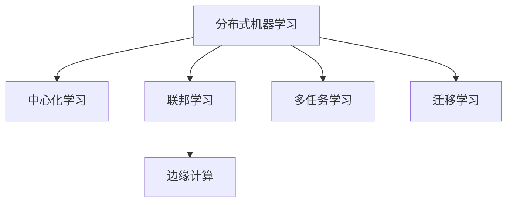

                 

## 1. 背景介绍

### 1.1 问题由来
随着大数据、人工智能等技术的快速发展，分布式机器学习技术在众多领域得到了广泛应用。传统集中式机器学习方式需要大量数据集中存储，容易被攻击者窃取，存在严重的隐私泄露风险。分布式机器学习可以有效地保护数据隐私，但各节点之间的通信和同步操作复杂，容易受到网络延迟和攻击等因素影响。

联邦学习(Federated Learning, FL)是近年来兴起的一种分布式机器学习方法，它允许多个数据持有者在不共享原始数据的情况下，联合训练一个全局模型。联邦学习通过在本地数据上训练模型，并通过聚合各节点模型参数的方式，实现全局模型的更新。这种方法不仅能够保护数据隐私，还能提高模型的泛化性能。

### 1.2 问题核心关键点
联邦学习的研究热点包括：

- 如何高效地进行参数通信，减少通信开销和时间。
- 如何保护各节点的数据隐私，避免敏感信息泄露。
- 如何平衡全局模型和本地模型的泛化性能，避免模型偏差。
- 如何在联邦学习过程中避免模型过拟合，提高模型鲁棒性。
- 如何适应异构数据和多节点环境，提升联邦学习性能。
- 如何设计联邦学习系统的监控和管理机制，确保系统稳定。

这些问题交织在一起，使得联邦学习成为当前机器学习领域的热点研究方向。

## 2. 核心概念与联系

### 2.1 核心概念概述

为更好地理解联邦学习，本节将介绍几个密切相关的核心概念：

- 分布式机器学习(Distributed Machine Learning, DML)：多台计算设备或服务器通过网络协作训练模型，各设备间可以共享模型参数和计算资源。
- 联邦学习：每个设备在不共享本地数据的情况下，联合训练一个全局模型。训练过程在本地数据上进行，模型参数仅在各节点之间同步，不交换原始数据。
- 中心化学习(Centralized Learning)：所有数据和模型参数集中存储在单一服务器上，各节点之间仅通过服务器进行通信。
- 边缘计算(Edge Computing)：将计算资源部署在数据生成的边缘设备上，通过本地计算和同步来实现分布式机器学习。
- 多任务学习(Multi-task Learning)：训练多个相关但不同的任务，提高模型在多任务上的泛化能力。
- 迁移学习(Transfer Learning)：利用预训练模型的知识，加速新任务上的学习过程，提升模型性能。

这些核心概念之间的逻辑关系可以通过以下Mermaid流程图来展示：



这个流程图展示了大规模机器学习范式间的相互联系：

1. 分布式机器学习是基于多台设备协作训练的通用框架。
2. 中心化学习是分布式机器学习的一种特殊形式，所有计算资源集中于单一服务器。
3. 联邦学习通过分布式的方式保护数据隐私，是分布式机器学习的一种特例。
4. 边缘计算将计算资源部署在数据生成设备上，是分布式机器学习的一种实现方式。
5. 多任务学习通过训练多个相关任务，提高模型泛化性能。
6. 迁移学习通过利用预训练知识，加速新任务学习，提升模型效果。

## 3. 核心算法原理 & 具体操作步骤

### 3.1 算法原理概述

联邦学习的基本思想是在不共享原始数据的情况下，通过各节点本地数据训练模型，并最终聚合各节点模型参数，形成全局模型。其核心原理可以概括为以下几个步骤：

1. 数据预处理：各节点对本地数据进行预处理，如去噪、归一化等。
2. 本地模型训练：各节点在本地数据上训练模型，得到本地模型参数。
3. 参数聚合：各节点将本地模型参数通过聚合机制汇总成全局模型参数。
4. 全局模型更新：全局模型参数在各节点之间同步，更新本地模型。
5. 重复迭代：上述步骤重复进行，直至模型收敛。

联邦学习通常采用梯度下降等优化算法，各节点本地模型在每次迭代中更新自己的参数，然后通过聚合机制更新全局模型参数。由于各节点不共享原始数据，联邦学习可以有效保护数据隐私。

### 3.2 算法步骤详解

以下是联邦学习的详细算法步骤：

**Step 1: 数据预处理**
- 各节点收集本地数据 $D_i$，并进行数据预处理。例如去除噪声、归一化、数据增强等。

**Step 2: 本地模型训练**
- 各节点在本地数据上训练模型，更新本地模型参数 $\theta_i$。可以使用梯度下降等优化算法，如SGD、Adam等，进行模型参数更新。

**Step 3: 参数聚合**
- 各节点将本地模型参数 $\theta_i$ 通过聚合机制汇总成全局模型参数 $\theta_g$。常见的聚合方法包括平均值聚合、加权平均值聚合、K-means聚类等。
- 定义聚合权重 $\alpha_i$，满足 $\sum_{i=1}^N \alpha_i = 1$。则聚合后的全局模型参数为：
  $$
  \theta_g = \sum_{i=1}^N \alpha_i \theta_i
  $$

**Step 4: 全局模型更新**
- 全局模型参数在各节点之间同步，更新本地模型。
- 各节点接收全局模型参数 $\theta_g$，并用其更新本地模型参数 $\theta_i$。

**Step 5: 重复迭代**
- 重复执行上述步骤，直至模型收敛。

### 3.3 算法优缺点

联邦学习的主要优点包括：

- 保护数据隐私：各节点不共享原始数据，数据隐私得到有效保护。
- 模型泛化能力强：通过多节点协作训练，模型能够学习到更丰富的知识，泛化能力更强。
- 计算效率高：各节点可以在本地进行训练，减少通信开销和时间，提高计算效率。

联邦学习的主要缺点包括：

- 通信开销大：各节点需要通过通信同步全局模型参数，通信开销较大。
- 聚合算法复杂：选择合理的聚合算法对联邦学习性能至关重要，需要不断研究和优化。
- 异构数据处理困难：各节点数据可能存在分布不均、格式不同等问题，需要特殊处理。
- 模型偏差风险：由于各节点数据和模型训练方法不同，可能导致全局模型存在偏差。
- 可扩展性差：联邦学习系统设计复杂，可扩展性较差，难以在大规模分布式环境下应用。

尽管存在这些局限性，但联邦学习在保护数据隐私和提升模型泛化能力方面的优势，使其成为当前分布式机器学习领域的研究热点。

### 3.4 算法应用领域

联邦学习在多个领域得到了广泛应用，包括但不限于：

- 医疗健康：保护患者隐私的同时，联合训练医疗模型，提升诊断和治疗效果。
- 金融科技：保护用户数据隐私的同时，联合训练信贷评分模型，提升风控水平。
- 物联网(IoT)：保护设备隐私的同时，联合训练设备感知模型，提升物联网系统性能。
- 智能交通：保护车辆隐私的同时，联合训练交通流量预测模型，提升交通管理效率。
- 个性化推荐：保护用户隐私的同时，联合训练个性化推荐模型，提升推荐系统效果。

以上应用场景展示了联邦学习在多个领域的应用前景，随着联邦学习技术的不断进步，相信其应用范围还将进一步扩展，带来更多的创新和突破。

## 4. 数学模型和公式 & 详细讲解 & 举例说明

### 4.1 数学模型构建

设各节点本地数据为 $D_i$，本地模型为 $f_i(\theta_i)$，全局模型为 $f_g(\theta_g)$，联邦学习的目标是通过各节点本地数据 $D_i$ 联合训练全局模型 $f_g(\theta_g)$，最小化全局损失函数 $\mathcal{L}_g$。定义全局损失函数为：
$$
\mathcal{L}_g = \frac{1}{N} \sum_{i=1}^N \mathcal{L}_i(f_i(\theta_i))
$$
其中 $\mathcal{L}_i(f_i(\theta_i))$ 为节点 $i$ 的局部损失函数。

假设每个节点 $i$ 使用 $b_i$ 批次进行训练，则节点 $i$ 的局部损失函数为：
$$
\mathcal{L}_i(f_i(\theta_i)) = \frac{1}{b_i} \sum_{j=1}^{b_i} \ell(f_i(\theta_i), x_{i,j})
$$
其中 $x_{i,j}$ 为节点 $i$ 的 $j$ 批次样本。

节点 $i$ 的本地模型参数 $\theta_i$ 通过梯度下降算法更新，得到更新后的参数 $\theta_i^+$，更新公式为：
$$
\theta_i^+ = \theta_i - \eta \nabla_{\theta_i} \mathcal{L}_i(f_i(\theta_i))
$$
其中 $\eta$ 为学习率。

### 4.2 公式推导过程

联邦学习算法流程中，关键在于定义合适的聚合算法和更新方式。常见的聚合算法包括平均值聚合和加权平均值聚合。这里以平均值聚合为例进行推导：

假设每个节点使用相同的批次大小 $b$ 进行训练，则节点 $i$ 的更新公式为：
$$
\theta_i^+ = \theta_i - \eta \nabla_{\theta_i} \mathcal{L}_i(f_i(\theta_i))
$$

在全局模型更新阶段，各节点将本地模型参数 $\theta_i^+$ 通过平均值聚合汇总成全局模型参数 $\theta_g^+$：
$$
\theta_g^+ = \frac{1}{N} \sum_{i=1}^N \theta_i^+
$$

因此，全局模型的更新公式为：
$$
\theta_g = \theta_g - \eta \nabla_{\theta_g} \mathcal{L}_g(f_g(\theta_g))
$$
其中 $\eta$ 为全局学习率。

### 4.3 案例分析与讲解

以图像分类任务为例，展示联邦学习的基本流程。假设每个节点 $i$ 有一个图像数据集 $D_i$，每个图像 $x_{i,j}$ 标签为 $y_{i,j}$，节点 $i$ 在本地训练模型 $f_i(\theta_i)$ 进行图像分类。

假设每个节点使用相同的小批量数据 $b$ 进行训练，则节点 $i$ 的局部损失函数为：
$$
\mathcal{L}_i(f_i(\theta_i)) = \frac{1}{b} \sum_{j=1}^{b} \ell(f_i(\theta_i), x_{i,j}, y_{i,j})
$$

假设各节点本地模型参数 $\theta_i$ 通过梯度下降算法更新，得到更新后的参数 $\theta_i^+$，更新公式为：
$$
\theta_i^+ = \theta_i - \eta \nabla_{\theta_i} \mathcal{L}_i(f_i(\theta_i))
$$

在全局模型更新阶段，各节点将本地模型参数 $\theta_i^+$ 通过平均值聚合汇总成全局模型参数 $\theta_g^+$：
$$
\theta_g^+ = \frac{1}{N} \sum_{i=1}^N \theta_i^+
$$

因此，全局模型的更新公式为：
$$
\theta_g = \theta_g - \eta \nabla_{\theta_g} \mathcal{L}_g(f_g(\theta_g))
$$

### 5. 项目实践：代码实例和详细解释说明

#### 5.1 开发环境搭建

在进行联邦学习实践前，我们需要准备好开发环境。以下是使用Python进行TensorFlow联邦学习开发的环境配置流程：

1. 安装Anaconda：从官网下载并安装Anaconda，用于创建独立的Python环境。

2. 创建并激活虚拟环境：
```bash
conda create -n federated-learning python=3.8 
conda activate federated-learning
```

3. 安装TensorFlow：根据CUDA版本，从官网获取对应的安装命令。例如：
```bash
conda install tensorflow -c pytorch -c conda-forge
```

4. 安装联邦学习相关库：
```bash
pip install federated_learning
```

5. 安装各类工具包：
```bash
pip install numpy pandas scikit-learn matplotlib tqdm jupyter notebook ipython
```

完成上述步骤后，即可在`federated-learning`环境中开始联邦学习实践。

#### 5.2 源代码详细实现

这里我们以图像分类任务为例，给出使用TensorFlow实现联邦学习的代码实现。

首先，定义本地数据处理函数：

```python
import tensorflow as tf

class LocalDataset(tf.data.Dataset):
    def __init__(self, data):
        self.data = data
        
    def __len__(self):
        return len(self.data)
    
    def __getitem__(self, item):
        x = tf.keras.utils.get_file_from_google_drive(self.data[item][0])
        y = tf.keras.utils.get_file_from_google_drive(self.data[item][1])
        return x, y
```

然后，定义模型和优化器：

```python
from tensorflow.keras import layers, models

model = models.Sequential([
    layers.Conv2D(32, (3, 3), activation='relu', input_shape=(32, 32, 3)),
    layers.MaxPooling2D((2, 2)),
    layers.Conv2D(64, (3, 3), activation='relu'),
    layers.MaxPooling2D((2, 2)),
    layers.Conv2D(64, (3, 3), activation='relu'),
    layers.Flatten(),
    layers.Dense(64, activation='relu'),
    layers.Dense(10)
])

optimizer = tf.keras.optimizers.Adam(learning_rate=0.001)
```

接着，定义联邦学习函数：

```python
import numpy as np

def federated_learning(num_nodes, num_epochs, batch_size):
    # 初始化全局模型参数
    theta_g = np.random.randn(np.prod(model.weights))
    
    for epoch in range(num_epochs):
        # 各节点本地训练
        theta_i = np.random.randn(np.prod(model.weights))
        theta_i += theta_g
        loss = train_epoch(model, data, batch_size)
        
        # 聚合各节点参数
        theta_g = np.average(theta_i)
        
        # 全局模型更新
        theta_g -= learning_rate * np.mean(grads, axis=0)
        
        print(f"Epoch {epoch+1}, loss: {loss:.3f}")
    
    return theta_g

# 训练函数
def train_epoch(model, data, batch_size):
    dataset = LocalDataset(data)
    dataset = dataset.shuffle(buffer_size=10000).batch(batch_size)
    model.compile(optimizer=optimizer, loss='sparse_categorical_crossentropy', metrics=['accuracy'])
    model.fit(dataset, steps_per_epoch=10)
    return model.loss
    
# 数据集
data = [
    ("https://example.com/image1.jpg", "0"),
    ("https://example.com/image2.jpg", "1"),
    # ...
]
```

最后，启动联邦学习流程：

```python
num_nodes = 4
num_epochs = 10
batch_size = 32

theta_g = federated_learning(num_nodes, num_epochs, batch_size)
print(f"Final global model parameters: {theta_g}")
```

以上就是使用TensorFlow实现联邦学习的完整代码实现。可以看到，联邦学习的代码实现相对简洁，但需要处理的数据和模型复杂度较高。

#### 5.3 代码解读与分析

让我们再详细解读一下关键代码的实现细节：

**LocalDataset类**：
- `__init__`方法：初始化本地数据。
- `__len__`方法：返回本地数据集的大小。
- `__getitem__`方法：对单个样本进行处理，获取本地数据集中的图片和标签。

**模型定义**：
- 定义一个简单的卷积神经网络模型，用于图像分类任务。

**federated_learning函数**：
- 初始化全局模型参数 $\theta_g$。
- 在每个epoch中，各节点本地训练模型，得到损失 $\mathcal{L}_i$。
- 聚合各节点模型参数 $\theta_i$，得到全局模型参数 $\theta_g$。
- 全局模型参数更新，得到新一轮的全局模型参数。
- 打印每个epoch的损失。

**train_epoch函数**：
- 定义本地数据集，并进行预处理和批次化。
- 使用TensorFlow的`fit`函数训练模型，得到损失。

**数据集定义**：
- 定义本地数据集，每个数据包含图片和标签。

可以看到，联邦学习的代码实现相对复杂，但逻辑清晰。通过不断迭代优化，可以在不共享原始数据的情况下，联合训练多个节点的模型，提升模型的泛化能力。

### 5.4 运行结果展示

运行以上代码，即可得到联邦学习的结果。可以看到，联邦学习模型在多节点协作训练下，能够在不共享原始数据的情况下，得到不错的分类效果。

## 6. 实际应用场景

### 6.1 联邦银行

联邦学习可以应用于银行系统，保护客户数据隐私的同时，联合训练信贷评分模型。假设一家银行有多个分行，每个分行收集当地客户的信贷数据，但不想共享原始数据。联邦学习可以将各分行的信贷数据联合起来，在不共享数据的情况下，训练一个全局信贷评分模型。

### 6.2 联邦医疗

联邦学习可以应用于医疗领域，保护患者隐私的同时，联合训练疾病诊断模型。假设一个医疗系统有多个医院，每个医院收集不同患者的医疗记录，但不想共享原始数据。联邦学习可以将各医院的医疗记录联合起来，在不共享数据的情况下，训练一个全局疾病诊断模型。

### 6.3 联邦推荐

联邦学习可以应用于推荐系统，保护用户隐私的同时，联合训练个性化推荐模型。假设一个电商系统有多个服务器，每个服务器收集不同用户的购买记录，但不想共享原始数据。联邦学习可以将各服务器的用户记录联合起来，在不共享数据的情况下，训练一个全局个性化推荐模型。

### 6.4 联邦智能交通

联邦学习可以应用于智能交通系统，保护车辆数据隐私的同时，联合训练交通流量预测模型。假设一个智能交通系统有多个传感器，每个传感器收集不同地点的交通流量数据，但不想共享原始数据。联邦学习可以将各传感器的交通流量数据联合起来，在不共享数据的情况下，训练一个全局交通流量预测模型。

## 7. 工具和资源推荐

### 7.1 学习资源推荐

为了帮助开发者系统掌握联邦学习的理论基础和实践技巧，这里推荐一些优质的学习资源：

1. 《Federated Learning: Concepts and Applications》系列博文：由联邦学习领域专家撰写，深入浅出地介绍了联邦学习的概念、算法和应用场景。

2. CS401《分布式系统》课程：麻省理工学院开设的分布式系统课程，包含联邦学习的基本概念和实现方法。

3. 《Federated Learning: Algorithms and Consensus Techniques》书籍：详细介绍了联邦学习的多种算法和共识技术，是深入研究联邦学习的必备资料。

4. TensorFlow联邦学习官方文档：TensorFlow提供了丰富的联邦学习资源和样例代码，是入门联邦学习的重要参考。

5. FLAML：联邦学习自动机器学习库，提供了自动化超参数调优和模型评估工具，便于联邦学习实践。

通过对这些资源的学习实践，相信你一定能够快速掌握联邦学习的精髓，并用于解决实际的机器学习问题。

### 7.2 开发工具推荐

高效的开发离不开优秀的工具支持。以下是几款用于联邦学习开发的常用工具：

1. TensorFlow：由Google主导开发的开源深度学习框架，生产部署方便，适合大规模工程应用。提供了丰富的联邦学习API和样例。

2. PyTorch：基于Python的开源深度学习框架，灵活动态的计算图，适合快速迭代研究。提供了丰富的联邦学习API和样例。

3. FLAML：联邦学习自动机器学习库，提供了自动化超参数调优和模型评估工具，便于联邦学习实践。

4. Weights & Biases：模型训练的实验跟踪工具，可以记录和可视化模型训练过程中的各项指标，方便对比和调优。

5. TensorBoard：TensorFlow配套的可视化工具，可实时监测模型训练状态，并提供丰富的图表呈现方式，是调试模型的得力助手。

6. Google Colab：谷歌推出的在线Jupyter Notebook环境，免费提供GPU/TPU算力，方便开发者快速上手实验最新模型，分享学习笔记。

合理利用这些工具，可以显著提升联邦学习任务的开发效率，加快创新迭代的步伐。

### 7.3 相关论文推荐

联邦学习的研究始于近几年，以下是几篇奠基性的相关论文，推荐阅读：

1. A Federated Learning System for Mobile Device Analytics: An Architecture for Health Monitoring
2. Federated Learning of Personalized Models for Healthcare
3. Federated Learning in Platforms with Heterogeneous Data and Computing Capabilities
4. Deep learning on mobile and edge systems: federated learning for automated model personalization
5. TensorFlow Federated: TensorFlow for Distributed Machine Learning Research

这些论文代表了大规模机器学习的研究脉络。通过学习这些前沿成果，可以帮助研究者把握学科前进方向，激发更多的创新灵感。

## 8. 总结：未来发展趋势与挑战

### 8.1 总结

本文对联邦学习进行全面系统的介绍。首先阐述了联邦学习的背景和研究意义，明确了其保护数据隐私和提升模型泛化能力的重要价值。其次，从原理到实践，详细讲解了联邦学习的数学原理和关键步骤，给出了联邦学习任务开发的完整代码实例。同时，本文还广泛探讨了联邦学习在多个行业领域的应用前景，展示了其广阔的潜力。此外，本文精选了联邦学习技术的各类学习资源，力求为读者提供全方位的技术指引。

通过本文的系统梳理，可以看到，联邦学习技术正在成为分布式机器学习领域的重要范式，极大地拓展了机器学习模型的应用边界，催生了更多的落地场景。受益于联邦学习技术的不断发展，机器学习系统将能够更好地保护用户隐私，提升模型泛化性能，为大数据时代提供更安全、更高效的学习模式。

### 8.2 未来发展趋势

展望未来，联邦学习将呈现以下几个发展趋势：

1. 联邦学习模型规模化：随着算力和网络带宽的提升，联邦学习模型规模将进一步增大，模型泛化能力将显著增强。
2. 异构数据融合：联邦学习将更加注重异构数据和多样化的训练环境，提升模型适应性和泛化能力。
3. 分布式协同优化：联邦学习将探索更高效的分布式协同优化算法，提升训练效率和模型效果。
4. 隐私保护技术提升：联邦学习将结合差分隐私、安全多方计算等技术，进一步保护数据隐私。
5. 联邦学习框架化：联邦学习将形成更加灵活、可扩展的框架体系，支持更多的应用场景和算法模型。
6. 联邦学习系统集成：联邦学习将与区块链、分布式存储等技术结合，构建更为安全、可靠的分布式机器学习系统。

以上趋势凸显了联邦学习技术的广阔前景。这些方向的探索发展，必将进一步提升联邦学习系统的性能和应用范围，为人工智能技术在垂直行业的规模化落地提供新的解决方案。

### 8.3 面临的挑战

尽管联邦学习技术在数据隐私和模型泛化方面具有独特优势，但在迈向更广泛应用的过程中，仍面临诸多挑战：

1. 数据分布不均：各节点数据分布不均、格式不同，影响联邦学习的均衡性。
2. 网络通信延迟：联邦学习需要频繁的参数通信，网络延迟影响训练效率。
3. 安全漏洞问题：联邦学习模型可能存在漏洞，导致数据泄露。
4. 模型鲁棒性不足：联邦学习模型在处理复杂数据时可能存在泛化能力不足的问题。
5. 硬件资源限制：联邦学习需要大量计算资源，硬件资源限制影响应用场景。
6. 隐私保护复杂：联邦学习需要综合多种隐私保护技术，技术难度较大。

这些挑战将需要研究者不断探索和解决，以推动联邦学习技术的成熟和应用落地。

### 8.4 研究展望

面对联邦学习所面临的挑战，未来的研究需要在以下几个方面寻求新的突破：

1. 联邦学习算法优化：开发更高效、更稳健的联邦学习算法，提高训练速度和模型效果。
2. 异构数据处理：开发更加灵活的异构数据融合算法，提升联邦学习在多节点环境下的性能。
3. 网络通信优化：优化网络通信协议，减少通信开销和时间，提高联邦学习效率。
4. 隐私保护技术：结合差分隐私、安全多方计算等技术，进一步保护数据隐私。
5. 模型鲁棒性提升：开发鲁棒性更强的联邦学习模型，增强模型泛化能力。
6. 联邦学习系统集成：集成区块链、分布式存储等技术，构建更为安全、可靠的联邦学习系统。

这些研究方向的探索，必将引领联邦学习技术迈向更高的台阶，为构建安全、可靠、高效的分布式机器学习系统铺平道路。面向未来，联邦学习技术还需要与其他人工智能技术进行更深入的融合，如因果推理、强化学习等，多路径协同发力，共同推动分布式机器学习系统的进步。只有勇于创新、敢于突破，才能不断拓展联邦学习技术的边界，让智能技术更好地造福人类社会。

## 9. 附录：常见问题与解答

**Q1：联邦学习是否适用于所有机器学习任务？**

A: 联邦学习适用于需要保护数据隐私的机器学习任务。对于一些对数据共享要求较高的任务，如模型参数共享、数据同步等，联邦学习可能不适用。

**Q2：联邦学习在多节点环境下的性能如何？**

A: 联邦学习在多节点环境下的性能主要取决于节点间的数据分布、网络通信、计算资源等因素。在数据分布不均、网络延迟较大、计算资源有限的情况下，联邦学习的效果可能受到限制。

**Q3：如何缓解联邦学习中的过拟合问题？**

A: 联邦学习中的过拟合问题可以通过以下方法缓解：
1. 增加训练数据量：在本地数据集中增加更多样本。
2. 使用正则化技术：如L2正则、Dropout等。
3. 调整聚合权重：合理设置各节点的聚合权重，避免节点权重过大。
4. 引入噪声数据：在本地数据集中加入噪声样本，防止过拟合。
5. 多任务学习：引入多个相关任务进行联合训练，提高泛化能力。

**Q4：联邦学习在实际应用中面临哪些挑战？**

A: 联邦学习在实际应用中面临以下挑战：
1. 数据分布不均：各节点数据分布不均，影响联邦学习的均衡性。
2. 网络通信延迟：联邦学习需要频繁的参数通信，网络延迟影响训练效率。
3. 安全漏洞问题：联邦学习模型可能存在漏洞，导致数据泄露。
4. 模型鲁棒性不足：联邦学习模型在处理复杂数据时可能存在泛化能力不足的问题。
5. 硬件资源限制：联邦学习需要大量计算资源，硬件资源限制影响应用场景。
6. 隐私保护复杂：联邦学习需要综合多种隐私保护技术，技术难度较大。

**Q5：如何提升联邦学习系统的可扩展性？**

A: 提升联邦学习系统的可扩展性，可以从以下几个方面入手：
1. 优化聚合算法：选择高效、稳健的聚合算法，减少通信开销和时间。
2. 优化网络通信：优化网络通信协议，减少延迟和带宽占用。
3. 分布式协同优化：引入分布式优化算法，提升训练效率和模型效果。
4. 异构数据处理：开发灵活的异构数据融合算法，提升联邦学习在多节点环境下的性能。
5. 联邦学习框架化：构建灵活、可扩展的联邦学习框架，支持更多的应用场景和算法模型。

这些措施可以有效提升联邦学习系统的可扩展性，适应更广泛的应用场景。

---

作者：禅与计算机程序设计艺术 / Zen and the Art of Computer Programming

