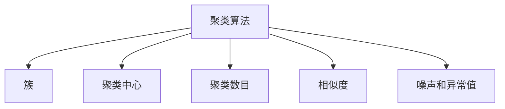

                 

## 聚类算法 原理与代码实例讲解

> 关键词：聚类算法, 聚类原理, 代码实例, K-Means, DBSCAN, 聚类优缺点, 聚类应用领域, 学习资源推荐

## 1. 背景介绍

### 1.1 问题由来
聚类（Clustering）是机器学习领域中非常基础且重要的任务，旨在将数据集中的样本分成若干个组，每个组内的样本相似度较高，不同组间的样本相似度较低。聚类算法在数据挖掘、图像处理、推荐系统、自然语言处理等众多领域有着广泛应用。然而，由于聚类任务本身的复杂性，如何高效、准确地聚类，成为了一个重要的研究方向。本文将深入讲解聚类算法的核心原理、代码实现及应用实例，以期对机器学习爱好者和从业者提供有价值的指导。

### 1.2 问题核心关键点
聚类算法的核心问题在于如何在数据空间中找到一个合理的划分方法，使得同一组内的数据相似度较高，不同组间的数据相似度较低。这一问题涉及多个方面，包括如何选择聚类方法、如何评估聚类效果、如何处理噪声和异常值等。本文将详细讨论这些关键问题，并给出实用的解决方案。

## 2. 核心概念与联系

### 2.1 核心概念概述

为更好地理解聚类算法的核心原理，本节将介绍几个密切相关的核心概念：

- **聚类算法（Clustering Algorithm）**：通过将数据集分成若干个组，每个组内的样本相似度较高，不同组间的样本相似度较低，实现数据划分和组织的方法。
- **簇（Cluster）**：一组相似度较高的数据点，通常由聚类算法生成。
- **聚类中心（Cluster Center）**：簇中所有数据点的均值或中位数等统计量，用于表示簇的位置。
- **聚类数目（Cluster Number）**：聚类过程中需要指定的组数，影响聚类效果和性能。
- **相似度（Similarity）**：用于衡量数据点之间的相似性，常用的度量方式包括欧式距离、余弦相似度等。
- **噪声和异常值（Noise and Outliers）**：聚类过程中可能会遇到的数据异常点，需要特殊处理。

这些核心概念之间的逻辑关系可以通过以下Mermaid流程图来展示：



这个流程图展示了聚类算法的核心概念及其之间的关系：

1. 聚类算法通过对数据集进行划分，生成若干簇。
2. 聚类中心是簇中所有数据点的均值或中位数，用于表示簇的位置。
3. 聚类数目是需要在聚类前指定的组数，影响聚类效果和性能。
4. 相似度用于衡量数据点之间的相似性，是聚类算法的重要组成部分。
5. 噪声和异常值是聚类过程中需要特殊处理的数据异常点。

这些核心概念共同构成了聚类算法的学习和应用框架，使其能够高效、准确地对数据进行聚类。

## 3. 核心算法原理 & 具体操作步骤
### 3.1 算法原理概述

聚类算法主要分为两大类：划分（Partitional）聚类和层次（Hierarchical）聚类。本文重点介绍常用的划分聚类算法：K-Means和DBSCAN。

**K-Means算法**：通过将数据集分成K个簇，每个簇的聚类中心为该簇内所有数据点的均值。K-Means算法通过迭代优化，使得簇内数据点与聚类中心的距离最小，簇间数据点与聚类中心的距离最大，从而实现数据的划分。

**DBSCAN算法**：基于密度的聚类算法，通过寻找高密度区域（核心点）和其附近低密度区域（样本），将数据点分为核心点、边界点和噪声点。DBSCAN算法能够自动确定聚类数目，不需要指定簇的数目。

### 3.2 算法步骤详解

**K-Means算法步骤**：
1. 随机选择K个数据点作为初始聚类中心。
2. 将每个数据点分配到最近的聚类中心所在的簇。
3. 重新计算每个簇的聚类中心（即簇内数据点的均值）。
4. 重复步骤2和3，直至簇内数据点不再变化或达到预设迭代次数。

**DBSCAN算法步骤**：
1. 选择一个随机数据点作为初始核心点。
2. 从初始核心点开始，通过遍历其邻域（ε）内的数据点，找到所有核心点和边界点。
3. 重复步骤2，直至无法找到新的核心点或边界点。
4. 将所有核心点和其形成的簇（即核心点、边界点的集合）标记为已访问。
5. 重复步骤1至4，直至所有数据点被访问。

### 3.3 算法优缺点
**K-Means算法的优缺点**：
- **优点**：算法简单易懂，执行速度快，适用于大规模数据集。
- **缺点**：需要预先指定簇的数目K，对初始值敏感，容易陷入局部最优解。

**DBSCAN算法的优缺点**：
- **优点**：不需要预先指定簇的数目，能够自动确定簇的数量，对噪声和异常值不敏感。
- **缺点**：对参数ε和MinPts敏感，算法复杂度较高，不适用于大规模数据集。

### 3.4 算法应用领域

聚类算法在众多领域中有着广泛应用，例如：

- 图像处理：通过聚类算法，可以将图像中的像素点分为背景和前景，用于图像分割、边缘检测等任务。
- 文本挖掘：通过聚类算法，可以将文本数据分为若干主题，用于主题建模、文档分类等任务。
- 推荐系统：通过聚类算法，可以将用户分为不同兴趣组，用于个性化推荐。
- 社交网络分析：通过聚类算法，可以将用户分为不同社交群组，用于社区发现、用户行为分析等任务。

这些领域中，聚类算法已经成为不可或缺的工具，帮助人们更好地理解和组织数据。

## 4. 数学模型和公式 & 详细讲解  
### 4.1 数学模型构建

**K-Means算法的数学模型**：
1. 聚类中心：$C_k$，其中$k=1,2,\ldots,K$，$K$为簇的数目。
2. 数据点$x_i$分配到簇$C_j$，满足$j=\arg\min_{1\leq k\leq K}||x_i-C_k||^2$。
3. 聚类中心更新：$C_k=\frac{1}{|C_k|}\sum_{x_i\in C_k}x_i$。

**DBSCAN算法的数学模型**：
1. 核心点：$C_i$，满足$N_{\epsilon}(x_i)\geq MinPts$，其中$N_{\epsilon}(x_i)$表示以$x_i$为中心，半径为$\epsilon$的邻域内的数据点数量。
2. 边界点：$B_i$，满足$N_{\epsilon}(x_i)<MinPts$，且与某个核心点相邻。
3. 噪声点：$N$，不属于任何簇的数据点。

### 4.2 公式推导过程

**K-Means算法的公式推导**：
1. 聚类中心更新公式：
   $$
   C_k = \frac{1}{|C_k|}\sum_{x_i\in C_k}x_i
   $$
2. 目标函数：最小化簇内数据点与聚类中心的距离之和，最大化簇间数据点与聚类中心的距离之和：
   $$
   \min_{C_k} \sum_{i=1}^N\min_{1\leq k\leq K}||x_i-C_k||^2
   $$

**DBSCAN算法的公式推导**：
1. 核心点判定公式：
   $$
   N_{\epsilon}(x_i)\geq MinPts
   $$
2. 边界点判定公式：
   $$
   N_{\epsilon}(x_i)<MinPts \quad \text{且} \quad \exists j \text{ 满足 } N_{\epsilon}(x_j)\geq MinPts \text{ 且 } ||x_i-x_j||\leq 2\epsilon
   $$
3. 噪声点判定公式：
   $$
   N_{\epsilon}(x_i)<MinPts \quad \text{且} \quad \forall j \text{ 满足 } N_{\epsilon}(x_j)<MinPts \text{ 或 } ||x_i-x_j||>2\epsilon
   $$

### 4.3 案例分析与讲解

**K-Means算法案例**：
假设有一个数据集，包含5个簇，簇中心分别为$(0,0),(1,1),(2,2),(3,3),(4,4)$。初始聚类中心随机选择为$(1,1)$和$(3,3)$。经过多次迭代，最终聚类中心分别收敛到$(0,0)$和$(4,4)$，簇内的数据点与聚类中心的距离最小。

**DBSCAN算法案例**：
假设有一个数据集，包含5个簇，簇中心分别为$(0,0),(1,1),(2,2),(3,3),(4,4)$。参数$\epsilon=1$，$MinPts=2$。通过DBSCAN算法，可以将数据点分为3个簇，其中$(0,0)$和$(4,4)$为噪声点。

## 5. 项目实践：代码实例和详细解释说明
### 5.1 开发环境搭建

在进行聚类算法实践前，我们需要准备好开发环境。以下是使用Python进行聚类算法开发的常见环境配置流程：

1. 安装Python：从官网下载并安装Python，用于编写和运行聚类算法代码。
2. 安装NumPy：用于科学计算和数组操作，通过pip安装。
3. 安装scikit-learn：用于聚类算法的实现和应用，通过pip安装。
4. 安装Matplotlib：用于数据可视化，通过pip安装。
5. 安装Jupyter Notebook：用于编写和运行聚类算法代码，通过conda安装。

完成上述步骤后，即可在Jupyter Notebook环境下开始聚类算法的实践。

### 5.2 源代码详细实现

这里以K-Means算法为例，使用scikit-learn库实现聚类算法的代码：

```python
from sklearn.cluster import KMeans
import numpy as np
import matplotlib.pyplot as plt

# 生成样本数据
np.random.seed(0)
X = np.random.rand(100, 2)

# 实例化KMeans模型
kmeans = KMeans(n_clusters=3, random_state=0)

# 拟合数据并聚类
kmeans.fit(X)

# 可视化聚类结果
plt.scatter(X[:, 0], X[:, 1], c=kmeans.labels_)
plt.show()
```

这段代码首先生成了100个随机样本数据，每个样本包含两个特征。然后实例化了一个KMeans模型，指定簇的数目为3，并随机初始化聚类中心。通过拟合数据，模型自动对数据进行聚类，最终得到每个样本的聚类标签。最后，使用Matplotlib库将聚类结果可视化。

### 5.3 代码解读与分析

让我们再详细解读一下关键代码的实现细节：

**KMeans类**：
- `KMeans(n_clusters=3, random_state=0)`：实例化KMeans模型，指定簇的数目为3，并设置随机种子为0。
- `kmeans.fit(X)`：拟合数据，自动聚类，并更新聚类中心。

**可视化**：
- `plt.scatter(X[:, 0], X[:, 1], c=kmeans.labels_)`：使用Matplotlib库绘制散点图，并根据聚类标签为每个点着色。

**代码优化**：
- `np.random.seed(0)`：设置随机种子，确保代码的可重复性。
- `plt.show()`：显示可视化结果。

在实际应用中，还需要考虑模型的调参、数据预处理、结果后处理等细节，以达到更好的聚类效果。

## 6. 实际应用场景
### 6.1 图像分割

在图像处理领域，聚类算法常用于图像分割，即将图像中的像素点分为背景和前景。通过聚类算法，可以自动将图像中的相似像素点聚为一类，形成图像的分割结果。

**应用实例**：
使用K-Means算法对彩色图像进行分割，将图像分为若干个颜色块，用于图像分析和处理。

### 6.2 用户行为分析

在社交网络分析领域，聚类算法常用于用户行为分析，即将用户分为不同兴趣组，用于社区发现、用户行为分析等任务。

**应用实例**：
使用DBSCAN算法对社交网络中的用户进行聚类，识别出不同兴趣群组，用于个性化推荐和用户行为分析。

### 6.3 推荐系统

在推荐系统领域，聚类算法常用于用户和物品的分类，用于个性化推荐。

**应用实例**：
使用K-Means算法对用户和物品进行聚类，将相似的用户和物品分为同一组，用于推荐相似物品。

## 7. 工具和资源推荐
### 7.1 学习资源推荐

为了帮助开发者系统掌握聚类算法的理论基础和实践技巧，这里推荐一些优质的学习资源：

1. **《机器学习实战》**：是一本经典的机器学习入门书籍，详细介绍了K-Means、DBSCAN等聚类算法的原理和实现。
2. **Coursera《机器学习》课程**：由斯坦福大学Andrew Ng教授开设的机器学习课程，详细讲解了聚类算法的基本原理和应用场景。
3. **scikit-learn官方文档**：scikit-learn库的官方文档，提供了丰富的聚类算法实现和应用示例，是学习聚类算法的必备资料。
4. **K-Means算法论文**：介绍K-Means算法的基本原理和应用，是了解聚类算法的重要参考资料。
5. **DBSCAN算法论文**：介绍DBSCAN算法的基本原理和应用，是了解聚类算法的另一重要参考资料。

通过对这些资源的学习实践，相信你一定能够快速掌握聚类算法的精髓，并用于解决实际的聚类问题。

### 7.2 开发工具推荐

高效的聚类算法开发离不开优秀的工具支持。以下是几款用于聚类算法开发的常用工具：

1. **NumPy**：用于科学计算和数组操作，支持高效的数值计算。
2. **scikit-learn**：用于聚类算法的实现和应用，提供了丰富的聚类算法和评估方法。
3. **Matplotlib**：用于数据可视化，支持丰富的图表绘制和展示。
4. **Jupyter Notebook**：用于编写和运行聚类算法代码，支持代码片段的交互式执行。

合理利用这些工具，可以显著提升聚类算法的开发效率，加快创新迭代的步伐。

### 7.3 相关论文推荐

聚类算法在机器学习领域有着广泛的研究，以下是几篇奠基性的相关论文，推荐阅读：

1. **K-Means算法论文**：介绍K-Means算法的基本原理和应用，是了解聚类算法的重要参考资料。
2. **DBSCAN算法论文**：介绍DBSCAN算法的基本原理和应用，是了解聚类算法的另一重要参考资料。
3. **K-Means++算法论文**：介绍K-Means++算法，一种更高效的K-Means算法变体，适用于大规模数据集。
4. **层次聚类算法论文**：介绍层次聚类算法的基本原理和应用，是了解聚类算法的另一重要参考资料。

这些论文代表了大规模聚类算法的发展脉络。通过学习这些前沿成果，可以帮助研究者把握学科前进方向，激发更多的创新灵感。

## 8. 总结：未来发展趋势与挑战
### 8.1 总结

本文对聚类算法的核心原理、代码实现及应用实例进行了全面系统的介绍。首先详细讲解了聚类算法的核心问题，包括聚类中心、相似度、簇数目等关键概念，以及K-Means和DBSCAN两种常见聚类算法的工作原理和具体操作步骤。其次，通过代码实例，演示了聚类算法的实现细节和应用场景，并通过数学模型和公式，进一步解释了聚类算法的原理和应用。

通过本文的系统梳理，可以看到，聚类算法在机器学习领域具有重要的应用价值，能够帮助人们更好地理解和组织数据。未来的聚类算法研究还需要在算法优化、应用场景扩展等方面进行深入探索，以期实现更好的聚类效果和应用效果。

### 8.2 未来发展趋势

展望未来，聚类算法将呈现以下几个发展趋势：

1. **算法优化**：未来的聚类算法将更加注重算法的优化和效率，如分布式聚类、在线聚类等，能够在更短的时间内处理更大规模的数据。
2. **应用扩展**：聚类算法将更加广泛地应用于不同领域，如生物信息学、金融风险评估、网络安全等，帮助解决更多的实际问题。
3. **多模态聚类**：未来的聚类算法将能够处理多模态数据，如文本、图像、时间序列等，实现不同类型数据的协同聚类。
4. **深度学习融合**：未来的聚类算法将更多地与深度学习技术融合，如生成对抗网络（GAN）、变分自编码器（VAE）等，提升聚类算法的复杂度和效果。

这些趋势凸显了聚类算法的广阔前景，相信在未来的研究中，聚类算法将不断创新和优化，为机器学习领域带来更多的突破。

### 8.3 面临的挑战

尽管聚类算法已经取得了一定的研究成果，但在迈向更加智能化、普适化应用的过程中，仍面临诸多挑战：

1. **数据质量**：聚类算法的性能依赖于数据的质量，噪声和异常值对聚类结果的影响较大。未来需要更好的数据清洗和预处理技术，提升数据质量。
2. **聚类数目确定**：聚类算法的性能也依赖于聚类数目的选择，如何自动确定聚类数目，仍是未来的研究方向。
3. **多模态数据处理**：多模态数据的聚类处理仍然是一个挑战，如何实现不同类型数据的协同聚类，需要更多的探索和优化。
4. **算法的可扩展性**：大规模数据集的处理仍然是聚类算法的一大挑战，如何提升算法的可扩展性和计算效率，是未来的研究方向。

面对这些挑战，聚类算法的未来研究需要在算法优化、数据处理、模型融合等方面进行深入探索，以期实现更好的聚类效果和应用效果。

### 8.4 研究展望

未来的聚类算法研究需要在以下几个方面寻求新的突破：

1. **自动聚类数目确定**：开发更加高效、鲁棒的聚类数目选择算法，如基于密度的聚类数目确定方法，避免人为干预的偏差。
2. **多模态数据融合**：探索多模态数据融合的聚类方法，实现不同类型数据的协同聚类，提升聚类算法的复杂度和效果。
3. **分布式聚类**：开发分布式聚类算法，实现大规模数据集的快速处理，提升聚类算法的可扩展性。
4. **聚类算法融合**：将不同的聚类算法进行融合，实现更加复杂的聚类效果，如层次聚类、密度聚类等。

这些研究方向的探索，必将引领聚类算法技术迈向更高的台阶，为机器学习领域带来更多的突破。

## 9. 附录：常见问题与解答

**Q1：聚类算法是否可以应用于无监督学习？**

A: 聚类算法是一种无监督学习算法，不需要标注数据，通过数据点之间的相似度进行聚类。聚类算法在无监督学习中的应用非常广泛，如图像分割、用户行为分析等。

**Q2：聚类算法如何处理噪声和异常值？**

A: 噪声和异常值对聚类结果的影响较大，常用的处理方法包括：
1. 基于距离的阈值方法：设定一个距离阈值，将距离大于阈值的数据点视为异常值。
2. 基于密度的DBSCAN算法：通过寻找高密度区域和低密度区域，将数据点分为核心点、边界点和噪声点。
3. 基于模型的聚类方法：如高斯混合模型（GMM），通过建立数据点生成的概率模型，进行聚类和异常值检测。

这些方法在实际应用中需要根据具体情况进行选择和调整，以达到更好的聚类效果。

**Q3：聚类算法的计算复杂度如何？**

A: 聚类算法的计算复杂度通常与数据集的大小和聚类数目有关。K-Means算法的计算复杂度为O(knd)，其中k为聚类数目，n为数据集大小。DBSCAN算法的计算复杂度取决于数据集的大小和ε参数的设置，一般认为在O(n^2)到O(nlogn)之间。

**Q4：聚类算法如何确定聚类数目？**

A: 聚类数目的确定是一个重要的问题，通常可以通过以下方法进行确定：
1. 基于肘部法则：绘制不同聚类数目下的聚类误差平方和（SSE），选取SSE下降最明显的聚类数目。
2. 基于轮廓系数：计算不同聚类数目下的轮廓系数，选取轮廓系数最大的聚类数目。
3. 基于信息准则：如贝叶斯信息准则（BIC）和赤池信息准则（AIC），根据数据集的大小和聚类数目，选取最优的聚类数目。

这些方法在实际应用中需要根据具体情况进行选择和调整，以达到更好的聚类效果。

**Q5：聚类算法是否可以用于处理高维数据？**

A: 聚类算法可以用于处理高维数据，但高维数据的聚类处理更加困难。常用的高维聚类方法包括基于降维的聚类方法，如主成分分析（PCA）和线性判别分析（LDA），以及基于密度的DBSCAN算法。

通过这些方法，聚类算法可以有效地处理高维数据，提升聚类效果。

---

作者：禅与计算机程序设计艺术 / Zen and the Art of Computer Programming

