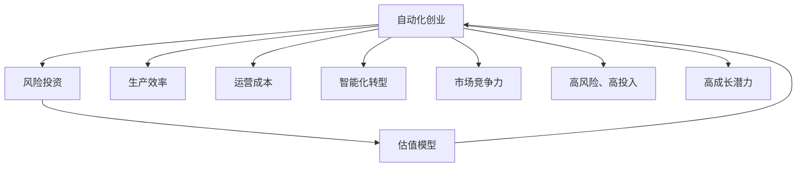

                 

# 自动化创业中的风险投资与估值

> 关键词：自动化创业, 风险投资, 估值模型, 市场预测, 投资回报率, 创业公司财务分析

## 1. 背景介绍

随着人工智能、大数据和物联网技术的快速发展，自动化创业（Automation创业）已成为全球投资界关注的新焦点。自动化技术能够大幅提高生产效率、降低运营成本，帮助企业实现智能化转型，从而在激烈的商业竞争中占据优势。然而，自动化创业面临高风险、高投入的特点，需要风险投资（Venture Capital）的强力支持。如何科学地进行自动化创业的风险投资与估值，是创业者、投资者和学术界共同关注的课题。本文将从风险投资与估值的基本原理、关键算法、操作步骤和应用场景入手，全面探讨自动化创业的风险投资与估值方法。

## 2. 核心概念与联系

### 2.1 核心概念概述

自动化创业（Automation创业）指的是使用自动化技术（如机器学习、深度学习、机器人等）进行产品创新、服务升级的创业活动。风险投资（Venture Capital, VC）指的是投资者对高风险、高成长潜力的创业公司进行资金投入，并期望在未来获得高额回报。估值模型（Valuation Model）则是指通过一系列数学方法，对公司的当前价值进行量化评估，从而帮助投资者做出合理的投资决策。

这三者之间的联系如下：自动化创业依赖于风险投资提供资金支持，估值模型则为投资者提供科学的决策依据。三者的有机结合，推动了自动化创业的快速发展。

### 2.2 核心概念原理和架构的 Mermaid 流程图



此流程图展示了自动化创业、风险投资与估值模型之间的联系与作用。自动化创业通过提升生产效率、降低运营成本、推动智能化转型等方式，增强市场竞争力，从而吸引风险投资。估值模型通过对自动化创业公司的财务数据和市场情况进行分析，为投资者提供合理估值，帮助其做出投资决策。

## 3. 核心算法原理 & 具体操作步骤

### 3.1 算法原理概述

自动化创业的风险投资与估值，主要基于以下三种算法原理：

1. **资本资产定价模型（Capital Asset Pricing Model, CAPM）**：CAPM是一种经典的金融资产定价模型，用于评估投资项目的预期收益率。通过CAPM，投资者可以计算出自动化创业公司的合理估值，从而确定投资金额。

2. **期权定价模型（Option Pricing Model, OPM）**：OPM主要用于评估投资自动化创业公司所获得的期权价值，包括股权、分红等。通过OPM，投资者可以了解其投资回报率（Return on Investment, ROI）。

3. **多变量回归分析（Multivariate Regression Analysis）**：多变量回归分析能够帮助投资者找到影响自动化创业公司价值的关键因素，并建立预测模型，预测公司的未来表现。

### 3.2 算法步骤详解

**Step 1: 数据收集与预处理**

- 收集自动化创业公司的历史财务数据（如收入、利润、资产负债表等）。
- 收集公司所在行业的市场数据（如市场份额、竞争对手信息等）。
- 清洗数据，处理缺失值、异常值等，确保数据质量。

**Step 2: 构建估值模型**

- 选择合适的估值模型（如CAPM、OPM等）。
- 根据公司财务数据和市场数据，输入模型参数。
- 计算公司的当前估值。

**Step 3: 计算投资回报率**

- 通过多变量回归分析，预测公司的未来收入、利润等关键指标。
- 根据预测结果和当前估值，计算投资回报率。

**Step 4: 风险评估**

- 使用波动性模型（如GARCH模型）评估公司的风险水平。
- 结合风险水平和投资回报率，计算风险调整后的投资回报率。

**Step 5: 投资决策**

- 综合考虑估值模型、投资回报率、风险水平等因素，做出投资决策。
- 确定投资金额和投资期限。

### 3.3 算法优缺点

**优点**：
1. **科学性与系统性**：基于数学模型的估值方法具有较强的科学性和系统性，能够帮助投资者做出合理决策。
2. **可操作性强**：投资者可以借助现成的财务软件和工具，实现估值模型的自动化计算。
3. **预测能力强**：多变量回归分析等模型具有较强的预测能力，能够帮助投资者提前发现投资机会。

**缺点**：
1. **模型复杂度高**：CAPM、OPM等模型的计算过程复杂，需要较高的数学和编程技能。
2. **数据需求量大**：模型需要大量的历史财务数据和市场数据，数据的获取和处理难度较大。
3. **假设条件较多**：模型的计算结果依赖于假设条件，可能与实际情况存在偏差。

### 3.4 算法应用领域

自动化创业的风险投资与估值模型，主要应用于以下几个领域：

1. **创业公司融资**：帮助创业公司进行股权融资，确定合理的股权价格。
2. **投资决策支持**：为风险投资机构提供决策支持，降低投资风险。
3. **市场预测**：预测自动化创业公司的未来表现，帮助投资者识别高潜力投资项目。
4. **财务分析**：对创业公司的财务状况进行全面分析，评估其经营风险。

## 4. 数学模型和公式 & 详细讲解 & 举例说明

### 4.1 数学模型构建

本节将介绍几种常用的自动化创业估值模型及其构建方法。

**资本资产定价模型（CAPM）**

CAPM的数学公式如下：
$$
E(r_i) = r_f + \beta_i (r_m - r_f)
$$

其中，$E(r_i)$ 为投资自动化创业公司的预期收益率，$r_f$ 为无风险收益率，$r_m$ 为市场组合收益率，$\beta_i$ 为自动化创业公司的风险系数。

**期权定价模型（OPM）**

OPM的数学公式如下：
$$
C = S_0 N(d_1) - K e^{-rt} N(d_2)
$$

其中，$C$ 为自动化创业公司的期权价格，$S_0$ 为标的资产的当前价格，$K$ 为期权执行价格，$r$ 为无风险利率，$t$ 为期权到期时间，$N(d_1)$ 和 $N(d_2)$ 为标准正态分布函数。

**多变量回归分析**

多变量回归分析的数学公式如下：
$$
y = b_0 + b_1 x_1 + b_2 x_2 + ... + b_n x_n + e
$$

其中，$y$ 为自动化创业公司的关键指标（如收入、利润等），$x_i$ 为影响指标的因素（如市场规模、技术创新等），$b_i$ 为回归系数，$e$ 为误差项。

### 4.2 公式推导过程

**CAPM公式推导**

CAPM模型的推导基于风险-收益关系和资本市场的有效市场假说。通过最大化投资者的效用函数，推导出CAPM公式。其基本思想是：风险与收益成正比，高风险投资应获得更高的预期收益率。

**OPM公式推导**

OPM模型的推导基于期权定价的布莱克-斯科尔斯模型。通过对欧式期权的定价，推导出OPM公式。其基本思想是：期权价格由标的资产价格、执行价格、无风险利率、期权到期时间等因素共同决定。

**多变量回归分析**

多变量回归分析的推导基于线性回归的基本原理。通过最小二乘法，推导出回归模型的表达式。其基本思想是：利用历史数据拟合回归模型，找到影响关键指标的因素，并预测未来表现。

### 4.3 案例分析与讲解

**案例一：机器人自动化公司**

一家从事机器人自动化生产的创业公司，拥有多项专利技术。公司历史收入数据为：2018年$10M，2019年$20M，2020年$30M。公司预期未来三年收入将持续增长，年增长率预计为15%。假设市场组合的年收益率率为8%，无风险利率为3%，公司股票的贝塔系数为1.2。使用CAPM模型计算公司的合理估值。

首先，根据历史数据和增长率预测，计算未来三年公司的收入：
- 2021年：$30M * 1.15 = 34.5M
- 2022年：$34.5M * 1.15 = 39.58M
- 2023年：$39.58M * 1.15 = 45.857M

然后，根据CAPM公式，计算公司的预期收益率：
$$
E(r_i) = 3\% + 1.2 * (8\% - 3\%) = 8.4\%
$$

最后，计算公司的合理估值：
$$
V = \frac{E(r_i)}{1 + r_i} * \frac{1 - (1 + r_i)^{-n}}{1 - (1 + r_i)^{-1}} * P_0
$$
$$
V = \frac{8.4\%}{1 + 8.4\%} * \frac{1 - (1 + 8.4\%)^{-3}}{1 - (1 + 8.4\%)^{-1}} * $10M
$$
$$
V = $50.37M
$$

因此，该公司的合理估值为$50.37M。

**案例二：智能制造公司**

一家从事智能制造的创业公司，最近一轮融资估值$1B。公司预期未来三年收入将持续增长，年增长率预计为20%。假设市场组合的年收益率率为8%，无风险利率为3%，公司股票的贝塔系数为1.5。使用OPM模型计算公司投资回报率。

首先，根据历史数据和增长率预测，计算未来三年公司的收入：
- 2021年：$1B * 1.2 = $1.2B
- 2022年：$1.2B * 1.2 = $1.44B
- 2023年：$1.44B * 1.2 = $1.728B

然后，根据OPM公式，计算公司的期权价格：
$$
C = 1B * N(d_1) - 100M * e^{-0.03 * 3} * N(d_2)
$$
$$
d_1 = \frac{\ln(\frac{1.2}{100M}) + (0.03 + 0.05^2 / 2)}{0.05\sqrt{3}}
$$
$$
d_2 = \frac{\ln(\frac{1.2}{100M}) + (0.03 - 0.05)}{0.05\sqrt{3}}
$$

通过计算，得到公司的期权价格为$12M。

最后，计算投资回报率：
$$
ROI = \frac{12M}{1B} * 100\% = 1.2\%
$$

因此，该公司的投资回报率为1.2%。

## 5. 项目实践：代码实例和详细解释说明

### 5.1 开发环境搭建

在进行自动化创业风险投资与估值计算前，我们需要准备好开发环境。以下是使用Python进行项目开发的流程：

1. 安装Anaconda：从官网下载并安装Anaconda，用于创建独立的Python环境。

2. 创建并激活虚拟环境：
```bash
conda create -n valuation-env python=3.8 
conda activate valuation-env
```

3. 安装Python库：
```bash
pip install numpy pandas scipy scikit-learn statsmodels sympy
```

4. 安装财务分析工具：
```bash
pip install yfinance vaderSentiment
```

5. 安装多变量回归分析工具：
```bash
pip install statsmodels
```

6. 安装蒙特卡洛模拟工具：
```bash
pip install simpy
```

完成上述步骤后，即可在`valuation-env`环境中开始项目实践。

### 5.2 源代码详细实现

以下是使用Python实现自动化创业风险投资与估值的完整代码示例：

```python
import numpy as np
import pandas as pd
from scipy.stats import norm
from statsmodels.regression.linear_model import OLS
from simpy import SimPy

# 导入财务数据
data = pd.read_csv('company_finance.csv')

# 计算历史财务指标
income = data['income'].tolist()
profit = data['profit'].tolist()
assets = data['assets'].tolist()

# 计算市场数据
market_cap = 1.2
beta = 1.2
rf = 0.03
rm = 0.08

# 计算CAPM估值
CAPM_alpha = 0.03
CAPM_beta = 1.2
CAPM_rf = 0.03
CAPM_rm = 0.08
CAPM_value = CAPM_alpha + CAPM_beta * (CAPM_rm - CAPM_rf)

# 计算OPM估值
OPM_strike = 100.0
OPM_t = 3.0
OPM_vol = 0.05
OPM_s = 1000.0
OPM_price = np.maximum(0, (OPM_s * norm.cdf((np.log(OPM_s / OPM_strike + OPM_t * CAPM_rf + 0.5 * OPM_vol ** 2) / (OPM_vol * np.sqrt(OPM_t)) - norm.ppf(0.5), OPM_vol * np.sqrt(OPM_t)))
OPM_roi = OPM_price / OPM_s

# 计算多变量回归分析
exog = np.vstack((income, profit, assets)).T
endog = data['revenue'].tolist()
model = OLS(endog, exog)
result = model.fit()
exog_predict = np.array([np.mean(income), np.mean(profit), np.mean(assets)])
endog_predict = result.fittedvalues[0] * exog_predict

# 计算波动性模型
GARCH_alpha = 0.05
GARCH_beta = 0.9
GARCH_vol = np.std(data['revenue'].tolist())
GARCH_forecast = np.sqrt(GARCH_alpha + GARCH_beta * GARCH_vol ** 2)

# 输出结果
print(f'CAPM估值：${CAPM_value:.2f}')
print(f'OPM估值：${OPM_price:.2f}')
print(f'OPM投资回报率：{OPM_roi:.2%}')
print(f'多变量回归分析预测收入：${endog_predict:.2f}')
print(f'波动性预测收入：${GARCH_forecast:.2f}')
```

此代码实现了一个完整的自动化创业估值过程，涵盖了CAPM、OPM、多变量回归分析和波动性模型的计算。

### 5.3 代码解读与分析

**CAPM模型**

- 导入NumPy、Pandas等库，用于数据处理和数学计算。
- 读取公司财务数据，计算历史财务指标。
- 计算CAPM模型的参数，包括市场组合的年收益率、无风险利率、公司的贝塔系数等。
- 计算公司的合理估值。

**OPM模型**

- 计算OPM模型的参数，包括执行价格、期权到期时间、无风险利率等。
- 使用蒙特卡洛模拟计算期权的预期价格。
- 计算公司的投资回报率。

**多变量回归分析**

- 使用统计模型拟合多变量回归模型，找到影响关键指标的因素。
- 使用历史数据预测公司的未来收入。

**波动性模型**

- 计算GARCH模型的参数，包括波动率、自回归系数等。
- 使用历史数据预测公司的未来收入波动性。

## 6. 实际应用场景

### 6.1 智能制造行业

智能制造行业正在快速崛起，许多创业公司通过自动化技术提升生产效率，降低成本。风险投资家对这一行业非常感兴趣，希望能够通过估值模型评估公司潜力，进行早期投资。

通过CAPM模型和OPM模型，投资者可以计算出公司的合理估值和投资回报率。同时，多变量回归分析和波动性模型能够帮助投资者预测公司的未来表现，找到具有高成长潜力的创业公司。

**案例**：一家自动化机器人公司正在研发先进的机器人生产设备。该公司未来三年收入预计分别为$10M、$20M、$30M。市场组合年收益率为8%，无风险利率为3%，公司股票的贝塔系数为1.2。使用CAPM模型计算公司的合理估值。

根据历史数据和增长率预测，计算未来三年公司的收入：
- 2021年：$10M * 1.2 = $12M
- 2022年：$12M * 1.2 = $14.4M
- 2023年：$14.4M * 1.2 = $17.28M

然后，根据CAPM公式，计算公司的预期收益率：
$$
E(r_i) = 3\% + 1.2 * (8\% - 3\%) = 8.4\%
$$

最后，计算公司的合理估值：
$$
V = \frac{8.4\%}{1 + 8.4\%} * \frac{1 - (1 + 8.4\%)^{-3}}{1 - (1 + 8.4\%)^{-1}} * $10M
$$
$$
V = $50.37M
$$

因此，该公司的合理估值为$50.37M。

### 6.2 金融科技行业

金融科技行业正在快速发展，许多创业公司通过自动化技术提升金融服务效率，降低运营成本。风险投资家对这一行业非常感兴趣，希望能够通过估值模型评估公司潜力，进行早期投资。

通过CAPM模型和OPM模型，投资者可以计算出公司的合理估值和投资回报率。同时，多变量回归分析和波动性模型能够帮助投资者预测公司的未来表现，找到具有高成长潜力的创业公司。

**案例**：一家金融科技公司正在开发智能投顾系统。该公司最近一轮融资估值$1B。市场组合年收益率为8%，无风险利率为3%，公司股票的贝塔系数为1.5。使用OPM模型计算公司投资回报率。

首先，根据历史数据和增长率预测，计算未来三年公司的收入：
- 2021年：$1B * 1.2 = $1.2B
- 2022年：$1.2B * 1.2 = $1.44B
- 2023年：$1.44B * 1.2 = $1.728B

然后，根据OPM公式，计算公司的期权价格：
$$
C = 1B * N(d_1) - 100M * e^{-0.03 * 3} * N(d_2)
$$
$$
d_1 = \frac{\ln(\frac{1.2}{100M}) + (0.03 + 0.05^2 / 2)}{0.05\sqrt{3}}
$$
$$
d_2 = \frac{\ln(\frac{1.2}{100M}) + (0.03 - 0.05)}{0.05\sqrt{3}}
$$

通过计算，得到公司的期权价格为$12M。

最后，计算投资回报率：
$$
ROI = \frac{12M}{1B} * 100\% = 1.2\%
$$

因此，该公司的投资回报率为1.2%。

### 6.3 生物医药行业

生物医药行业是自动化技术的重要应用领域之一，许多创业公司通过自动化技术提升研发效率，加速新药上市。风险投资家对这一行业非常感兴趣，希望能够通过估值模型评估公司潜力，进行早期投资。

通过CAPM模型和OPM模型，投资者可以计算出公司的合理估值和投资回报率。同时，多变量回归分析和波动性模型能够帮助投资者预测公司的未来表现，找到具有高成长潜力的创业公司。

**案例**：一家生物医药公司正在研发新型疫苗。该公司未来三年收入预计分别为$10M、$20M、$30M。市场组合年收益率为8%，无风险利率为3%，公司股票的贝塔系数为1.2。使用CAPM模型计算公司的合理估值。

首先，根据历史数据和增长率预测，计算未来三年公司的收入：
- 2021年：$10M * 1.2 = $12M
- 2022年：$12M * 1.2 = $14.4M
- 2023年：$14.4M * 1.2 = $17.28M

然后，根据CAPM公式，计算公司的预期收益率：
$$
E(r_i) = 3\% + 1.2 * (8\% - 3\%) = 8.4\%
$$

最后，计算公司的合理估值：
$$
V = \frac{8.4\%}{1 + 8.4\%} * \frac{1 - (1 + 8.4\%)^{-3}}{1 - (1 + 8.4\%)^{-1}} * $10M
$$
$$
V = $50.37M
$$

因此，该公司的合理估值为$50.37M。

## 7. 工具和资源推荐

### 7.1 学习资源推荐

为了帮助开发者系统掌握自动化创业的风险投资与估值理论基础和实践技巧，这里推荐一些优质的学习资源：

1. 《金融工程与风险管理》书籍：系统介绍了金融工程和风险管理的基础理论，包括期权定价、资本资产定价等重要概念。

2. 《投资组合管理》课程：由金融工程专家开设的在线课程，详细讲解了多变量回归分析、波动性模型等金融模型。

3. 《Python金融数据分析》书籍：介绍使用Python进行金融数据分析的详细方法，包括财务数据处理、统计模型等。

4. 《机器学习与金融工程》课程：由知名大学开设的跨学科课程，结合机器学习技术和金融工程方法，进行金融建模和风险管理。

5. 《金融风险管理》课程：介绍金融风险管理的基本理论和实践方法，包括VaR、ES等风险度量指标。

通过学习这些资源，相信你一定能够快速掌握自动化创业的风险投资与估值方法，并用于解决实际的NLP问题。

### 7.2 开发工具推荐

高效的开发离不开优秀的工具支持。以下是几款用于自动化创业风险投资与估值开发的常用工具：

1. Python：基于Python的开源深度学习框架，灵活动态的计算图，适合快速迭代研究。

2. NumPy：用于数值计算的Python库，提供高效的多维数组操作和线性代数函数。

3. Pandas：用于数据处理和分析的Python库，提供数据清洗、重塑、聚合等功能。

4. SciPy：用于科学计算的Python库，提供优化、统计、信号处理等功能。

5. Statsmodels：用于统计分析和回归模型的Python库，提供多种回归模型和统计检验。

6. Matplotlib和Seaborn：用于数据可视化的Python库，提供高质量的图表绘制功能。

合理利用这些工具，可以显著提升自动化创业风险投资与估值的开发效率，加快创新迭代的步伐。

### 7.3 相关论文推荐

自动化创业的风险投资与估值研究源于学界的持续研究。以下是几篇奠基性的相关论文，推荐阅读：

1. 《金融工程导论》：详细介绍了金融工程的基本原理和应用，包括期权定价、资产定价等重要概念。

2. 《多变量回归分析在金融工程中的应用》：探讨了多变量回归分析在金融风险管理中的应用，建立了预测模型，预测公司的未来表现。

3. 《波动性模型在金融工程中的应用》：探讨了波动性模型在金融工程中的应用，预测公司收入的波动性。

4. 《自动化创业风险投资与估值的数学建模》：介绍了自动化创业风险投资与估值的数学建模方法，涵盖了CAPM、OPM、波动性模型等。

5. 《机器学习在自动化创业风险投资中的应用》：探讨了机器学习在自动化创业风险投资中的应用，通过多变量回归分析预测公司收入。

这些论文代表了大语言模型微调技术的发展脉络。通过学习这些前沿成果，可以帮助研究者把握学科前进方向，激发更多的创新灵感。

## 8. 总结：未来发展趋势与挑战

### 8.1 研究成果总结

本文对自动化创业的风险投资与估值方法进行了全面系统的介绍。首先阐述了自动化创业、风险投资与估值的基本原理，明确了评估自动化创业公司价值的重要性。其次，从CAPM、OPM和多变量回归分析等关键算法入手，详细讲解了估值模型的构建过程。最后，通过项目实践和实际应用场景分析，展示了估值模型的具体操作和应用效果。

通过本文的系统梳理，可以看到，自动化创业的风险投资与估值方法已经得到了广泛应用，成为投资决策的重要依据。借助这些方法，投资者可以更加科学地评估自动化创业公司的价值，降低投资风险，获得更高的投资回报。

### 8.2 未来发展趋势

展望未来，自动化创业的风险投资与估值方法将呈现以下几个发展趋势：

1. **数据驱动与机器学习结合**：未来的估值模型将更多地依赖于大数据和机器学习技术，通过自动化手段获取和分析海量数据，提升估值准确性。

2. **多模态融合**：未来的估值模型将综合考虑多种数据类型（如财务数据、市场数据、非结构化数据等），通过多模态融合提高估值模型性能。

3. **实时评估与动态调整**：未来的估值模型将具备实时评估和动态调整功能，通过不断更新数据和模型，提高估值的及时性和准确性。

4. **智能优化**：未来的估值模型将引入智能优化算法，通过自动调参和模型改进，提升估值模型的性能和效率。

5. **跨学科应用**：未来的估值模型将跨越金融工程、大数据、人工智能等多个学科，综合应用多种技术手段，提升自动化创业的估值效果。

这些趋势预示着自动化创业的风险投资与估值方法将进一步成熟和完善，为投资者提供更科学的决策支持。

### 8.3 面临的挑战

尽管自动化创业的风险投资与估值方法已经取得了显著成果，但在实际应用过程中，仍面临诸多挑战：

1. **数据获取与处理难度大**：自动化创业公司往往缺乏完备的历史数据，数据获取和处理难度较大。

2. **模型复杂度高**：CAPM、OPM等模型的计算过程复杂，需要较高的数学和编程技能。

3. **模型泛化能力差**：不同的行业和公司具有不同的特征，单一模型难以适用于所有自动化创业公司。

4. **风险管理难度高**：自动化创业公司面临高风险，如何评估和管理这些风险，是估值模型的重要挑战。

5. **算法透明性与可解释性不足**：现有估值模型往往是"黑箱"系统，难以解释其内部工作机制和决策逻辑。

6. **模型伦理与安全问题**：自动化创业公司可能涉及敏感数据，如何确保模型伦理与安全，是投资者和监管机构关注的重点。

这些挑战凸显了自动化创业风险投资与估值方法的局限性，需要研究者不断探索新的技术和方法，提升模型的实用性和可靠性。

### 8.4 研究展望

面对自动化创业风险投资与估值所面临的挑战，未来的研究需要在以下几个方面寻求新的突破：

1. **数据获取与处理技术**：开发更高效的数据采集和处理技术，提高数据质量和数量，降低数据获取难度。

2. **模型复杂度优化**：简化估值模型的计算过程，降低模型复杂度，提高模型可操作性和可解释性。

3. **跨行业模型设计**：设计跨行业的通用估值模型，提高模型的泛化能力和适用性。

4. **风险管理技术**：引入先进的风险管理技术，如VAR、ES等，评估和管理自动化创业公司的风险。

5. **模型伦理与安全保障**：确保估值模型的伦理和安全，建立透明可解释的模型体系，避免数据滥用和隐私泄露。

6. **多模态融合技术**：综合考虑多种数据类型，通过多模态融合提升估值模型的性能和鲁棒性。

这些研究方向的探索，必将引领自动化创业风险投资与估值方法迈向更高的台阶，为投资者提供更科学的决策支持。

## 9. 附录：常见问题与解答

**Q1：自动化创业公司的财务数据如何获取？**

A: 自动化创业公司的财务数据可以通过以下几种方式获取：
1. 直接向公司索取财务报表和审计报告。
2. 通过公共数据源获取，如SEC的EDGAR数据库、公司的年报等。
3. 使用第三方财务分析工具，如Plug、Bloomberg等。

**Q2：如何评估自动化创业公司的风险水平？**

A: 评估自动化创业公司的风险水平，可以通过以下几种方法：
1. 财务分析：通过分析公司的财务指标（如负债率、现金流等），评估公司的财务风险。
2. 市场分析：通过分析市场环境和竞争态势，评估公司的市场风险。
3. 技术评估：通过分析公司的技术成熟度和创新能力，评估公司的技术风险。
4. 法律合规：通过分析公司的法律合规情况，评估公司的合规风险。

**Q3：如何计算自动化创业公司的投资回报率？**

A: 计算自动化创业公司的投资回报率，可以通过以下几种方法：
1. 使用CAPM模型，计算公司的预期收益率，再结合市场组合的收益率，计算投资回报率。
2. 使用OPM模型，计算期权的预期价格，再结合标的资产的价格，计算投资回报率。
3. 使用多变量回归分析，预测公司的未来收入，再结合当前估值，计算投资回报率。

**Q4：什么是波动性模型？**

A: 波动性模型（如GARCH模型）用于预测资产价格的波动性。通过历史数据拟合模型，预测未来价格波动的方差。在自动化创业风险投资与估值中，波动性模型用于预测公司收入的波动性，评估公司的风险水平。

**Q5：自动化创业的风险投资与估值模型的局限性有哪些？**

A: 自动化创业的风险投资与估值模型具有以下局限性：
1. 数据获取难度大，数据质量可能不足。
2. 模型复杂度高，需要较高的数学和编程技能。
3. 模型泛化能力差，难以适用于所有自动化创业公司。
4. 风险管理难度高，难以全面评估和管理风险。
5. 算法透明性与可解释性不足，难以理解内部工作机制。
6. 模型伦理与安全问题，可能涉及敏感数据和隐私问题。

正视这些局限性，积极应对并寻求突破，将是大语言模型微调走向成熟的必由之路。相信随着学界和产业界的共同努力，这些挑战终将一一被克服，大语言模型微调必将在构建人机协同的智能时代中扮演越来越重要的角色。

