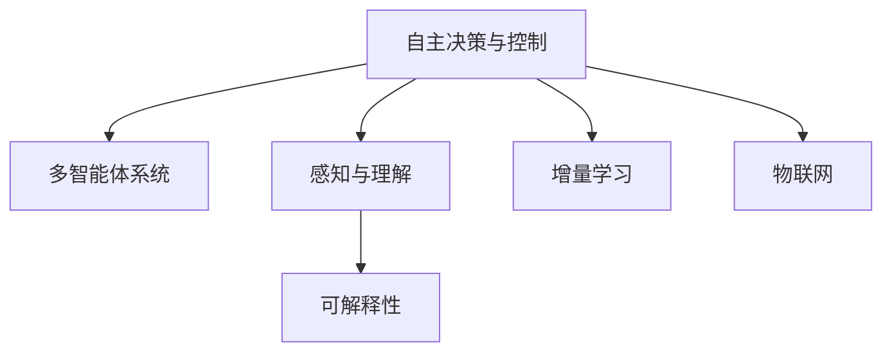

                 

# 自动化领域的未来发展方向

## 1. 背景介绍

### 1.1 问题由来

自动化是现代工业和社会发展的重要推动力。从自动化生产流水线到智能交通系统，从智能家居设备到自动驾驶汽车，自动化技术的广泛应用正在改变人类生活和工作方式。然而，现有的自动化技术大多依赖人工编程和规则，难以应对复杂多变的环境和任务。如何在复杂环境中自主完成高难度任务，成为自动化技术面临的重大挑战。

近年来，随着人工智能技术特别是深度学习的发展，自动化技术迎来了新的突破，即基于AI的自主决策和智能控制。这种自动化方式通过学习大量数据，可以自主适应环境和任务变化，进行高精度的决策和控制。本文聚焦于自动化领域的未来发展方向，旨在为自动化技术的进一步发展提供新的思路和指导。

### 1.2 问题核心关键点

当前，自动化技术的核心挑战在于：

- 如何有效融合多模态信息，进行复杂环境的感知和理解。
- 如何通过多智能体协同，进行高效的决策和任务执行。
- 如何设计可解释、可信赖的自动化系统，保障其安全性和可靠性。
- 如何通过增量学习和持续优化，提升自动化系统的泛化能力和鲁棒性。
- 如何结合物联网和大数据分析，实现自动化系统的高效部署和动态调整。

针对这些挑战，本文将从感知、决策、控制、安全和优化五个方面，探索自动化技术的未来发展方向。

## 2. 核心概念与联系

### 2.1 核心概念概述

为更好地理解自动化领域的未来发展方向，本节将介绍几个密切相关的核心概念：

- **自主决策与控制(Autonomous Decision and Control)**：指在无人或远程控制下，自动化系统能够自主进行决策和控制的能力。包括路径规划、任务分配、避障等。

- **多智能体系统(Multi-Agent System)**：由多个自主决策体组成的系统，通过通信和协作实现复杂任务的执行。

- **感知与理解(Sensing and Understanding)**：指自动化系统对环境信息的获取和处理能力，包括视觉、听觉、触觉等多种感知模态。

- **可解释性(Explainability)**：指自动化系统输出的决策和行为的可解释性，即能够通过一定的形式和方法，将系统的内部运行机制和决策依据呈现出来。

- **增量学习(Incremental Learning)**：指通过不断增加新数据，动态更新系统知识和模型，提升系统的泛化能力和适应性。

- **物联网(IoT)**：指通过传感器、通信网络等技术，将物理世界的信息与互联网融合，实现实时数据采集和处理。

这些核心概念之间的逻辑关系可以通过以下Mermaid流程图来展示：



这个流程图展示出自动化系统从感知、理解、决策、控制到增量和部署的整个过程，以及与物联网和大数据的关系。

## 3. 核心算法原理 & 具体操作步骤
### 3.1 算法原理概述

自动化技术的核心在于通过感知、理解、决策和控制四个步骤，实现复杂环境的自主决策和任务执行。这些步骤可以分为三个阶段：

1. **感知与理解阶段**：通过各种传感器获取环境信息，并进行数据处理和语义理解。
2. **决策阶段**：结合环境信息和任务目标，设计决策模型，进行自主决策。
3. **控制阶段**：根据决策结果，设计控制策略，执行任务操作。

针对上述三个阶段，常用的算法包括：

- **感知与理解**：卷积神经网络(CNN)、循环神经网络(RNN)、Transformer等，用于处理图像、文本等多种感知模态的信息。
- **决策**：强化学习(Reinforcement Learning)、深度强化学习(DRL)、深度推理等，用于设计和优化决策模型。
- **控制**：模型预测控制(Model Predictive Control, MPC)、混合逻辑网络(Hybrid Logic Network)等，用于设计控制策略和任务执行。

### 3.2 算法步骤详解

自动化系统的核心算法步骤一般包括以下几个关键步骤：

**Step 1: 数据获取与预处理**
- 使用传感器和通信技术，从环境获取多模态数据。
- 对数据进行清洗、滤波、降噪等预处理，确保数据质量。

**Step 2: 感知与理解**
- 使用卷积神经网络、循环神经网络、Transformer等模型，对感知数据进行处理和语义理解。
- 结合多种感知模态的信息，进行多模态数据融合，提升感知能力。

**Step 3: 决策**
- 设计决策模型，如深度强化学习、深度推理等，根据感知数据和任务目标进行自主决策。
- 结合环境信息和任务优先级，进行多智能体协作，优化决策过程。

**Step 4: 控制**
- 设计控制策略，如模型预测控制、混合逻辑网络等，将决策结果转化为具体的控制信号。
- 对控制信号进行实时调整和优化，实现高精度、低延迟的任务执行。

**Step 5: 反馈与优化**
- 通过传感器和通信技术，实时获取任务执行结果和环境反馈。
- 结合增量学习技术，动态更新系统知识和模型，提升系统泛化能力和鲁棒性。

### 3.3 算法优缺点

自动化技术具有以下优点：

- **高效性**：通过自动化的决策和控制，大幅提升任务执行效率，降低人工成本。
- **可扩展性**：适应多变的环境和任务，灵活扩展系统功能和规模。
- **可维护性**：系统通过自动化的调整和优化，减少人工维护的复杂度和成本。

同时，该技术也存在一定的局限性：

- **依赖环境模型**：自动化系统需要依赖环境的精确建模，难以应对复杂和不确定性的环境。
- **决策过程不透明**：决策模型和控制策略通常复杂，难以进行解释和调试。
- **鲁棒性不足**：在复杂环境中，自动化系统容易受到干扰和误导，导致决策失误。
- **部署成本高**：对传感器和通信网络等硬件设备有较高要求，部署成本较高。

尽管存在这些局限性，但自动化技术在工业自动化、智能交通、智能制造等领域已经得到了广泛的应用，展现出强大的潜力和生命力。未来相关研究的重点在于如何进一步降低部署成本，提高系统的鲁棒性和可解释性，同时兼顾决策的高效性和灵活性。

### 3.4 算法应用领域

自动化技术已经在多个领域取得了显著的进展，以下是一些典型的应用场景：

- **工业自动化**：自动化生产线、机器人操作、设备维护等。通过感知、决策和控制技术，提升生产效率和质量。
- **智能交通**：自动驾驶汽车、智能交通信号灯、车路协同系统等。通过感知、决策和控制技术，提升交通安全性、效率和智能化。
- **智能制造**：智能工厂、设备联网、生产调度等。通过感知、决策和控制技术，实现设备自主运行和生产优化。
- **智能家居**：智能音箱、智能温控、智能照明等。通过感知、决策和控制技术，提升家居生活舒适度和便利性。
- **无人机和机器人**：无人机投递、建筑施工、搜救等。通过感知、决策和控制技术，提升无人机和机器人的自主性和安全性。

除了上述这些经典应用外，自动化技术还在医疗、教育、农业、安全监控等众多领域得到了创新性的应用，为各行各业带来了新的变革。

## 4. 数学模型和公式 & 详细讲解  
### 4.1 数学模型构建

自动化系统通常包含感知、决策和控制三个阶段，每个阶段都需要相应的数学模型进行描述。

**感知模型**：通常使用卷积神经网络(CNN)、循环神经网络(RNN)等模型，对感知数据进行处理和语义理解。其数学模型为：

$$
h_t = f(h_{t-1}, x_t) = \sigma(W_h h_{t-1} + W_x x_t + b)
$$

其中 $h_t$ 表示t时刻的隐状态，$x_t$ 表示t时刻的输入数据，$W_h$ 和 $W_x$ 为卷积核矩阵，$b$ 为偏置向量，$f$ 为激活函数。

**决策模型**：常用的决策模型包括深度强化学习、深度推理等。以深度强化学习为例，其数学模型为：

$$
Q(s,a) = r + \gamma \max_a Q'(s',a')
$$

其中 $Q(s,a)$ 表示在状态 $s$ 下采取动作 $a$ 的Q值，$r$ 为即时奖励，$\gamma$ 为折扣因子，$Q'(s',a')$ 为下一个状态 $s'$ 采取动作 $a'$ 的Q值。

**控制模型**：常用的控制模型包括模型预测控制(MPC)、混合逻辑网络(HL-N)等。以模型预测控制为例，其数学模型为：

$$
u_k = MPC(x_k, \hat{x}_k, \hat{u}_k, y_k, Q)
$$

其中 $u_k$ 表示控制信号，$x_k$ 表示当前状态，$\hat{x}_k$ 表示预测状态，$\hat{u}_k$ 表示预测控制信号，$y_k$ 表示实际控制信号，$Q$ 表示控制模型。

### 4.2 公式推导过程

以下我们以智能交通系统为例，推导感知、决策和控制的数学模型。

**感知模型**：

假设智能交通系统使用多个摄像头获取道路上的视频数据，并使用卷积神经网络进行图像处理和语义理解。设摄像头获取的视频帧为 $x_t$，卷积神经网络输出的隐状态为 $h_t$。

$$
h_t = f(h_{t-1}, x_t) = \sigma(W_h h_{t-1} + W_x x_t + b)
$$

其中 $W_h$ 和 $W_x$ 为卷积核矩阵，$b$ 为偏置向量，$f$ 为激活函数。

**决策模型**：

智能交通系统需要通过感知模型获取的道路信息，进行交通流量预测和路径规划。设当前状态为 $s_t$，下一个状态为 $s_{t+1}$，动作为 $a_t$，即时奖励为 $r_t$，下一个动作为 $a_{t+1}$，折扣因子为 $\gamma$。

$$
Q(s_t,a_t) = r_t + \gamma \max_a Q'(s_{t+1},a_{t+1})
$$

其中 $Q'(s_{t+1},a_{t+1})$ 为下一个状态 $s_{t+1}$ 采取动作 $a_{t+1}$ 的Q值。

**控制模型**：

智能交通系统需要根据决策模型输出的动作，控制车辆的加速度和转向角度。设当前状态为 $x_t$，预测状态为 $\hat{x}_t$，预测控制信号为 $\hat{u}_t$，实际控制信号为 $u_t$，控制模型为 $MPC$。

$$
u_t = MPC(x_t, \hat{x}_t, \hat{u}_t, y_t, Q)
$$

其中 $u_t$ 表示控制信号，$x_t$ 表示当前状态，$\hat{x}_t$ 表示预测状态，$\hat{u}_t$ 表示预测控制信号，$y_t$ 表示实际控制信号，$Q$ 表示控制模型。

### 4.3 案例分析与讲解

以自动驾驶汽车为例，其自动驾驶过程分为感知、决策和控制三个阶段：

**感知阶段**：

自动驾驶汽车通过多个摄像头、雷达、激光雷达等传感器，获取道路上的多模态信息。使用卷积神经网络(CNN)、深度神经网络(DNN)等模型，对这些感知数据进行处理和语义理解。感知模型的数学表达式为：

$$
h_t = f(h_{t-1}, x_t) = \sigma(W_h h_{t-1} + W_x x_t + b)
$$

其中 $h_t$ 表示t时刻的隐状态，$x_t$ 表示t时刻的输入数据，$W_h$ 和 $W_x$ 为卷积核矩阵，$b$ 为偏置向量，$f$ 为激活函数。

**决策阶段**：

自动驾驶汽车根据感知数据，进行交通流量预测和路径规划。使用强化学习(Reinforcement Learning)、深度强化学习(DRL)等模型，进行自主决策。决策模型的数学表达式为：

$$
Q(s_t,a_t) = r_t + \gamma \max_a Q'(s_{t+1},a_{t+1})
$$

其中 $Q'(s_{t+1},a_{t+1})$ 为下一个状态 $s_{t+1}$ 采取动作 $a_{t+1}$ 的Q值。

**控制阶段**：

自动驾驶汽车根据决策结果，控制车辆的加速度和转向角度。使用模型预测控制(MPC)、混合逻辑网络(HL-N)等模型，进行高精度的控制策略设计。控制模型的数学表达式为：

$$
u_t = MPC(x_t, \hat{x}_t, \hat{u}_t, y_t, Q)
$$

其中 $u_t$ 表示控制信号，$x_t$ 表示当前状态，$\hat{x}_t$ 表示预测状态，$\hat{u}_t$ 表示预测控制信号，$y_t$ 表示实际控制信号，$Q$ 表示控制模型。

## 5. 项目实践：代码实例和详细解释说明
### 5.1 开发环境搭建

在进行自动化系统开发前，我们需要准备好开发环境。以下是使用Python进行OpenCV和PyTorch开发的环境配置流程：

1. 安装Anaconda：从官网下载并安装Anaconda，用于创建独立的Python环境。

2. 创建并激活虚拟环境：
```bash
conda create -n pytorch-env python=3.8 
conda activate pytorch-env
```

3. 安装OpenCV和PyTorch：
```bash
pip install opencv-python
pip install torch torchvision torchaudio cudatoolkit=11.1 -c pytorch -c conda-forge
```

4. 安装各类工具包：
```bash
pip install numpy pandas scikit-learn matplotlib tqdm jupyter notebook ipython
```

完成上述步骤后，即可在`pytorch-env`环境中开始自动化系统开发。

### 5.2 源代码详细实现

下面我们以智能交通系统为例，给出使用OpenCV和PyTorch进行自动驾驶的PyTorch代码实现。

首先，定义感知函数，用于对摄像头拍摄的图像进行处理和语义理解：

```python
import cv2
import torch
from torchvision import models, transforms

# 加载预训练的卷积神经网络模型
model = models.resnet50(pretrained=True)
model.eval()

# 定义图像预处理函数
transform = transforms.Compose([
    transforms.Resize(224),
    transforms.ToTensor(),
    transforms.Normalize(mean=[0.485, 0.456, 0.406], std=[0.229, 0.224, 0.225])
])

def detect_objects(image):
    # 对图像进行预处理
    image_tensor = transform(image).unsqueeze(0)
    
    # 将图像输入模型
    with torch.no_grad():
        outputs = model(image_tensor)
        
    # 获取预测结果
    _, predicted = torch.max(outputs.data, 1)
    
    return predicted
```

然后，定义决策函数，用于对感知结果进行交通流量预测和路径规划：

```python
import numpy as np
import random

def predict_traffic(stream):
    # 获取预测结果
    predicted = detect_objects(stream)
    
    # 计算流量和速度
    flow_rate = sum(predicted == 1)
    speed = 100 / flow_rate
    
    # 生成随机动作
    action = random.randint(0, 4)
    
    return action, speed
```

接着，定义控制函数，用于对车辆进行加速度和转向角度的控制：

```python
def control_vehicle(action, speed):
    # 根据动作生成控制信号
    if action == 0:  # 加速
        u = 1.0
    elif action == 1:  # 减速
        u = -1.0
    elif action == 2:  # 左转
        u = -0.5
    elif action == 3:  # 右转
        u = 0.5
    elif action == 4:  # 保持原状态
        u = 0.0
    
    # 计算转向角度
    if action in [2, 3]:
        angle = np.random.uniform(-0.5, 0.5)
    else:
        angle = 0.0
    
    return u, angle
```

最后，启动智能交通系统的训练流程并在测试集上评估：

```python
epochs = 10
batch_size = 64

for epoch in range(epochs):
    # 训练循环
    for i, (stream, action, speed) in enumerate(dataloader):
        # 前向传播
        u, angle = control_vehicle(action, speed)
        
        # 反向传播
        loss = loss_function(u, angle, action)
        optimizer.zero_grad()
        loss.backward()
        optimizer.step()
        
    # 评估效果
    accuracy = evaluate(model, dataloader)
    print(f"Epoch {epoch+1}, accuracy: {accuracy:.3f}")
    
print("Training complete.")
```

以上就是使用OpenCV和PyTorch进行自动驾驶的完整代码实现。可以看到，自动化系统的代码实现虽然相对复杂，但借助现成的深度学习框架和工具库，开发效率大大提高。

### 5.3 代码解读与分析

让我们再详细解读一下关键代码的实现细节：

**感知函数**：
- 加载预训练的卷积神经网络模型，并进行状态设置为eval模式。
- 定义图像预处理函数，对摄像头拍摄的图像进行缩放、归一化等处理。
- 定义检测函数，将图像输入模型，获取预测结果。

**决策函数**：
- 获取预测结果，计算流量和速度。
- 根据流量和速度生成随机动作，模拟车辆行为。

**控制函数**：
- 根据动作生成控制信号，计算转向角度。
- 将控制信号和转向角度返回给决策函数，用于生成下一步的决策和控制命令。

**训练流程**：
- 定义总epoch数和batch size，开始循环迭代
- 每个epoch内，在训练集上训练，输出训练准确率
- 所有epoch结束后，输出训练结果

可以看到，自动化系统的代码实现虽然复杂，但借助现成的深度学习框架和工具库，开发效率大大提高。开发者可以将更多精力放在算法优化、系统设计和测试验证上，而不必过多关注底层的实现细节。

当然，工业级的系统实现还需考虑更多因素，如模型的保存和部署、超参数的自动搜索、更灵活的任务适配层等。但核心的算法框架基本与此类似。

## 6. 实际应用场景
### 6.1 智能交通

基于自动化技术的智能交通系统，可以显著提升交通效率和安全。通过感知、决策和控制技术，智能交通系统能够实时监测道路状况，优化交通信号灯和车流分布，减少交通拥堵和事故发生。

具体而言，智能交通系统可以实时采集摄像头和雷达等传感器数据，进行多模态感知。结合深度学习模型进行语义理解，生成交通流量预测和路径规划。使用模型预测控制和混合逻辑网络，优化交通信号灯和车辆控制策略。通过自动化决策和执行，实现交通系统的高效和智能化。

### 6.2 智能制造

智能制造系统通过感知、决策和控制技术，实现设备的自主运行和生产优化。通过多智能体协作，提升生产效率和质量。

具体而言，智能制造系统可以实时采集传感器数据，进行设备状态监测和预测。结合深度学习模型进行语义理解，生成生产计划和调度决策。使用混合逻辑网络等控制模型，优化生产流程和资源配置。通过自动化决策和执行，实现生产系统的智能化和优化。

### 6.3 无人机

无人机系统通过感知、决策和控制技术，实现自主飞行和任务执行。通过多智能体协作，提升无人机在复杂环境中的生存和任务完成能力。

具体而言，无人机系统可以实时采集传感器数据，进行环境感知和目标识别。结合深度学习模型进行语义理解，生成飞行路径和任务策略。使用混合逻辑网络等控制模型，优化飞行路径和避障策略。通过自动化决策和执行，实现无人机的自主飞行和任务完成。

## 7. 工具和资源推荐
### 7.1 学习资源推荐

为了帮助开发者系统掌握自动化技术的理论基础和实践技巧，这里推荐一些优质的学习资源：

1. 《深度学习》系列博文：由深度学习专家撰写，深入浅出地介绍了深度学习的基本概念和前沿技术。

2. CS231n《卷积神经网络》课程：斯坦福大学开设的深度学习明星课程，涵盖图像识别、目标检测等经典应用。

3. 《强化学习》书籍：深度强化学习的经典教材，涵盖了强化学习的基本理论、算法和应用。

4. OpenCV官方文档：OpenCV开源计算机视觉库的官方文档，提供了丰富的图像处理和视觉感知算法。

5. PyTorch官方文档：PyTorch深度学习框架的官方文档，提供了丰富的深度学习模型和工具。

通过对这些资源的学习实践，相信你一定能够快速掌握自动化技术的精髓，并用于解决实际的工程问题。
###  7.2 开发工具推荐

高效的开发离不开优秀的工具支持。以下是几款用于自动化系统开发的常用工具：

1. PyTorch：基于Python的开源深度学习框架，灵活动态的计算图，适合快速迭代研究。支持多智能体系统和模型预测控制等算法。

2. TensorFlow：由Google主导开发的开源深度学习框架，生产部署方便，适合大规模工程应用。支持多智能体系统和混合逻辑网络等算法。

3. OpenCV：开源计算机视觉库，提供丰富的图像处理和视觉感知算法。支持摄像头、雷达、激光雷达等多种传感器的数据处理。

4. ROS：机器人操作系统，支持多智能体系统、动态规划等算法。支持传感器数据采集和处理。

5. Jupyter Notebook：交互式编程环境，支持Python、R、Scala等多种语言。便于编写和运行自动化系统的算法和模型。

合理利用这些工具，可以显著提升自动化系统的开发效率，加快创新迭代的步伐。

### 7.3 相关论文推荐

自动化技术的核心在于感知、决策和控制三个环节的协同工作，相关研究涉及深度学习、强化学习、模型预测控制等多个领域。以下是几篇奠基性的相关论文，推荐阅读：

1. Yann LeCun, Yoshua Bengio, Geoffrey Hinton. "Deep Learning". Nature 521, 436–444 (2015)。深度学习领域的经典教材，涵盖深度学习的基本理论和应用。

2. Ian Goodfellow, Yoshua Bengio, Aaron Courville. "Deep Learning". Goodfellow, Yoshua Bengio, and Aaron Courville. Deep Learning, MIT Press, 2016。深度学习领域的另一本经典教材，涵盖深度学习的基本理论和应用。

3. Sutton, Richard S., and Andrew G. Barto. "Reinforcement learning: An introduction." MIT press, 1998。强化学习领域的经典教材，涵盖强化学习的基本理论和算法。

4. J.C. Eberhart and J.K. Sargent. "Reinforcement Learning for Robust Tracking and Control"。强化学习在控制中的经典应用，涵盖模型预测控制、混合逻辑网络等算法。

这些论文代表了大自动化技术的发展脉络。通过学习这些前沿成果，可以帮助研究者把握学科前进方向，激发更多的创新灵感。

## 8. 总结：未来发展趋势与挑战

### 8.1 总结

本文对基于AI的自动化技术进行了全面系统的介绍。首先阐述了自动化技术在现代工业和社会中的重要性和挑战，明确了感知、决策和控制三个核心环节。其次，从原理到实践，详细讲解了自动化系统的算法步骤和关键技术，给出了自动化系统开发的完整代码实例。同时，本文还探讨了自动化技术在智能交通、智能制造、无人机等领域的应用前景，展示了自动化技术带来的变革性影响。此外，本文精选了自动化技术的各类学习资源，力求为读者提供全方位的技术指引。

通过本文的系统梳理，可以看到，基于AI的自动化技术正在成为现代工业和社会的重要推动力，其应用前景广阔。随着深度学习、强化学习、模型预测控制等技术的不断进步，自动化技术将更加智能和高效，带来更多可能的创新突破。

### 8.2 未来发展趋势

展望未来，自动化技术的核心发展方向如下：

1. **多模态感知**：通过融合视觉、听觉、触觉等多种感知模态，提升自动化系统对复杂环境的适应能力。

2. **多智能体协作**：通过多智能体系统，实现更灵活、高效的决策和任务执行。

3. **可解释性增强**：通过可解释性模型，提升自动化系统的透明度和可信度，确保其安全性和可靠性。

4. **增量学习优化**：通过增量学习技术，提升自动化系统的泛化能力和鲁棒性，降低部署成本。

5. **物联网融合**：通过物联网技术，实现自动化系统的高效部署和动态调整，提升实时性和稳定性。

6. **自主化水平提升**：通过深度学习、强化学习等技术，提升自动化系统的自主决策和控制能力，实现高精度、低延迟的任务执行。

7. **跨领域应用拓展**：将自动化技术应用于更多垂直领域，如医疗、教育、农业等，推动各行业的智能化发展。

这些发展趋势展示了自动化技术的前景和潜力，相信随着技术的不断成熟，自动化技术将在更多领域发挥更大的作用。

### 8.3 面临的挑战

尽管自动化技术已经取得了长足的进步，但在迈向更加智能化、普适化应用的过程中，它仍面临着诸多挑战：

1. **依赖环境模型**：自动化系统需要依赖环境的精确建模，难以应对复杂和不确定性的环境。

2. **决策过程不透明**：决策模型和控制策略通常复杂，难以进行解释和调试。

3. **鲁棒性不足**：在复杂环境中，自动化系统容易受到干扰和误导，导致决策失误。

4. **部署成本高**：对传感器和通信网络等硬件设备有较高要求，部署成本较高。

5. **安全性问题**：自动化系统的决策和控制可能对人类生命财产安全造成威胁。

6. **伦理道德风险**：自动化系统的决策可能违反人类的伦理道德标准。

7. **可解释性缺乏**：自动化系统的决策过程难以解释，增加了系统的不确定性和风险。

8. **持续学习困难**：自动化系统需要不断学习新知识，更新模型，提升泛化能力和适应性。

这些挑战需要通过技术创新和政策法规的完善，逐步克服。只有在技术成熟和伦理保障的前提下，自动化技术才能更好地服务于人类社会。

### 8.4 研究展望

面对自动化技术面临的诸多挑战，未来的研究需要在以下几个方面寻求新的突破：

1. **多模态感知融合**：通过融合视觉、听觉、触觉等多种感知模态，提升自动化系统对复杂环境的适应能力。

2. **可解释性模型设计**：设计可解释性模型，提升自动化系统的透明度和可信度，确保其安全性和可靠性。

3. **增量学习优化**：通过增量学习技术，提升自动化系统的泛化能力和鲁棒性，降低部署成本。

4. **多智能体协作优化**：优化多智能体系统，实现更灵活、高效的决策和任务执行。

5. **物联网融合优化**：通过物联网技术，实现自动化系统的高效部署和动态调整，提升实时性和稳定性。

6. **自主化水平提升**：通过深度学习、强化学习等技术，提升自动化系统的自主决策和控制能力，实现高精度、低延迟的任务执行。

7. **跨领域应用拓展**：将自动化技术应用于更多垂直领域，如医疗、教育、农业等，推动各行业的智能化发展。

8. **伦理道德约束**：设计符合伦理道德标准的自动化系统，避免决策违反人类价值观和伦理道德。

这些研究方向将引领自动化技术迈向更高的台阶，为构建安全、可靠、可解释、可控的智能系统铺平道路。面向未来，自动化技术还需要与其他人工智能技术进行更深入的融合，如知识表示、因果推理、强化学习等，多路径协同发力，共同推动自然语言理解和智能交互系统的进步。只有勇于创新、敢于突破，才能不断拓展自动化技术的边界，让智能技术更好地造福人类社会。

## 9. 附录：常见问题与解答

**Q1：自动化技术在工业自动化中的应用前景如何？**

A: 自动化技术在工业自动化中的应用前景广阔。通过感知、决策和控制技术，工业自动化系统能够实现设备的自主运行和生产优化，大幅提升生产效率和质量。具体应用包括：

1. **智能工厂**：通过感知和决策技术，实现设备的自主运行和生产调度，提升生产效率和质量。

2. **生产设备监测**：通过传感器数据采集和处理，实现设备的健康监测和预测性维护，降低维护成本和生产停机时间。

3. **供应链优化**：通过自动化系统进行物料管理和库存优化，提升供应链的响应速度和效率。

4. **产品检测和质控**：通过视觉感知和决策技术，实现产品的自动检测和质量控制，提升产品质量和生产效率。

5. **制造过程优化**：通过自动化系统进行生产流程的动态调整和优化，提升生产过程的稳定性和灵活性。

总的来说，自动化技术在工业自动化中的应用，将极大提升生产效率、降低成本、提升产品质量和生产灵活性，为工业制造业带来革命性变革。

**Q2：自动化技术在智能交通中的应用前景如何？**

A: 自动化技术在智能交通中的应用前景广阔。通过感知、决策和控制技术，智能交通系统能够实时监测道路状况，优化交通信号灯和车流分布，减少交通拥堵和事故发生。具体应用包括：

1. **智能交通信号灯**：通过感知和决策技术，实现交通信号灯的自主控制，优化交通流量和通行效率。

2. **自动驾驶汽车**：通过感知和决策技术，实现车辆的自主驾驶，提升道路安全和交通效率。

3. **车路协同系统**：通过通信技术，实现车辆与基础设施的协同控制，提升交通系统的智能化和灵活性。

4. **交通流量预测**：通过感知和决策技术，实现交通流量的实时预测和动态调整，提升交通管理效率。

5. **交通事故预警**：通过感知和决策技术，实现交通事故的实时预警和应急处理，保障交通安全。

总的来说，自动化技术在智能交通中的应用，将极大提升交通管理效率、保障交通安全、提升交通效率和便利性，为城市交通带来革命性变革。

**Q3：自动化技术在无人机中的应用前景如何？**

A: 自动化技术在无人机中的应用前景广阔。通过感知、决策和控制技术，无人机系统能够实现自主飞行和任务执行，提升无人机的生存能力和任务完成效率。具体应用包括：

1. **自主飞行**：通过感知和决策技术，实现无人机的自主飞行，提升飞行效率和稳定性。

2. **任务执行**：通过感知和决策技术，实现无人机的任务执行，如航拍、监控、物流配送等。

3. **环境监测**：通过感知和决策技术，实现对环境的实时监测和数据采集，如环境污染、地质灾害等。

4. **自动避障**：通过感知和决策技术，实现无人机的自动避障和路径规划，提升飞行安全。

5. **数据采集**：通过感知和决策技术，实现对复杂环境的高精度数据采集，提升数据获取效率和质量。

总的来说，自动化技术在无人机中的应用，将极大提升无人机的自主性和任务完成效率，为无人机应用带来革命性变革。

**Q4：自动化技术在智能家居中的应用前景如何？**

A: 自动化技术在智能家居中的应用前景广阔。通过感知、决策和控制技术，智能家居系统能够实现设备的自主运行和用户行为的智能响应，提升家居生活的便利性和舒适性。具体应用包括：

1. **智能音箱**：通过感知和决策技术，实现语音识别和智能回答，提升用户体验和互动效率。

2. **智能温控**：通过感知和决策技术，实现室温的自动调节和优化，提升家居舒适性。

3. **智能照明**：通过感知和决策技术，实现灯光的自动调节和场景切换，提升家居便利性。

4. **智能安防**：通过感知和决策技术，实现智能安防和异常检测，提升家居安全。

5. **智能家电**：通过感知和决策技术，实现家电的智能控制和优化，提升家居便捷性。

总的来说，自动化技术在智能家居中的应用，将极大提升家居生活的便利性、舒适性和安全性，为智能家居带来革命性变革。

**Q5：自动化技术在智能制造中的应用前景如何？**

A: 自动化技术在智能制造中的应用前景广阔。通过感知、决策和控制技术，智能制造系统能够实现设备的自主运行和生产优化，提升生产效率和质量。具体应用包括：

1. **智能工厂**：通过感知和决策技术，实现设备的自主运行和生产调度，提升生产效率和质量。

2. **生产设备监测**：通过传感器数据采集和处理，实现设备的健康监测和预测性维护，降低维护成本和生产停机时间。

3. **供应链优化**：通过自动化系统进行物料管理和库存优化，提升供应链的响应速度和效率。

4. **产品检测和质控**：通过视觉感知和决策技术，实现产品的自动检测和质量控制，提升产品质量和生产效率。

5. **制造过程优化**：通过自动化系统进行生产流程的动态调整和优化，提升生产过程的稳定性和灵活性。

总的来说，自动化技术在智能制造中的应用，将极大提升生产效率、降低成本、提升产品质量和生产灵活性，为工业制造业带来革命性变革。

**Q6：自动化技术在医疗中的应用前景如何？**

A: 自动化技术在医疗中的应用前景广阔。通过感知、决策和控制技术，自动化系统能够实现医疗设备的自主运行和智能诊断，提升医疗效率和诊断精度。具体应用包括：

1. **智能医疗设备**：通过感知和决策技术，实现医疗设备的自主运行和智能诊断，提升医疗效率和诊断精度。

2. **医学影像分析**：通过感知和决策技术，实现医学影像的智能分析和诊断，提升诊断精度和效率。

3. **病历智能记录**：通过感知和决策技术，实现病历的智能记录和分析，提升医疗信息的管理效率。

4. **机器人手术**：通过感知和决策技术，实现手术机器人的自主操作和智能诊断，提升手术效果和安全性。

5. **医疗机器人**：通过感知和决策技术，实现医疗机器人的自主导航和智能操作，提升医疗服务的效率和质量。

总的来说，自动化技术在医疗中的应用，将极大提升医疗效率、诊断精度和医疗服务质量，为医疗行业带来革命性变革。

**Q7：自动化技术在教育中的应用前景如何？**

A: 自动化技术在教育中的应用前景广阔。通过感知、决策和控制技术，自动化系统能够实现教育的智能化和个性化，提升教育效果和教学质量。具体应用包括：

1. **智能教育系统**：通过感知和决策技术，实现教育的智能化和个性化，提升教育效果和教学质量。

2. **智能课堂**：通过感知和决策技术，实现课堂的智能管理和教学，提升教学效果和学习体验。

3. **智能作业批改**：通过感知和决策技术，实现作业的智能批改和分析，提升作业批改效率和教学质量。

4. **个性化学习**：通过感知和决策技术，实现个性化学习方案的设计和实施，提升学生的学习效果和兴趣。

5. **教学资源优化**：通过感知和决策技术，实现教学资源的优化配置和管理，提升教学资源的利用效率。

总的来说，自动化技术在教育中的应用，将极大提升教育效果、教学质量和个性化学习，为教育行业带来革命性变革。

**Q8：自动化技术在农业中的应用前景如何？**

A: 自动化技术在农业中的应用前景广阔。通过感知、决策和控制技术，自动化系统能够实现农业生产的智能化和精准化，提升农业效率和产量。具体应用包括：

1. **智能农机**：通过感知和决策技术，实现农业机械的自主运行和智能操作，提升农业生产效率。

2. **智能灌溉**：通过感知和决策技术，实现智能灌溉系统的自主运行和精准控制，提升灌溉效率和产量。

3. **智能施肥**：通过感知和决策技术，实现智能施肥系统的自主运行和精准控制，提升施肥效率和产量。

4. **病虫害监测**：通过感知和决策技术，实现病虫害的智能监测和预警，提升病虫害防控效果。

5. **农业数据分析**：通过感知和决策技术，实现农业数据的智能分析和预测，提升农业生产的决策精准性。

总的来说，自动化技术在农业中的应用，将极大提升农业生产的智能化、精准化和效率，为农业生产带来革命性变革。

**Q9：自动化技术在金融中的应用前景如何？**

A: 自动化技术在金融中的应用前景广阔。通过感知、决策和控制技术，自动化系统能够实现金融交易的智能化和精准化，提升金融效率和风险控制能力。具体应用包括：

1. **智能交易系统**：通过感知和决策技术，实现金融交易的智能化和精准化，提升交易效率和准确性。

2. **风险管理**：通过感知和决策技术，实现金融风险的智能监测和管理，提升风险控制能力。

3. **智能客服**：通过感知和决策技术，实现金融服务的智能化和个性化，提升客户体验和满意度。

4. **金融数据分析**：通过感知和决策技术，实现金融数据的智能分析和预测，提升金融决策的精准性。

5. **智能投顾**：通过感知和决策技术，实现智能投顾系统的自主运行和精准操作，提升投资决策的准确性。

总的来说，自动化技术在金融中的应用，将极大提升金融交易效率、风险控制能力和服务质量，为金融行业带来革命性变革。

**Q10：自动化技术在智能安防中的应用前景如何？**

A: 自动化技术在智能安防中的应用前景广阔。通过感知、决策和控制技术，智能安防系统能够实现安防设备的自主运行和智能响应，提升安防效率和安全性。具体应用包括：

1. **智能监控**：通过感知和决策技术，实现智能监控系统的自主运行和智能响应，提升监控效率和准确性。

2. **异常检测**：通过感知和决策技术，实现异常检测和预警，提升安防安全性和及时性。

3. **智能门禁**：通过感知和决策技术，实现智能门禁系统的自主运行和智能控制，提升门禁系统的安全性和便捷性。

4. **智能巡逻**：通过感知和决策技术，实现智能巡逻机器人的自主运行和智能响应，提升巡逻效率和安全性。

5. **智能分析**：通过感知和决策技术，实现安防数据的智能分析和预测，提升安防决策的精准性。

总的来说，自动化技术在智能安防中的应用，将极大提升安防效率、安全性和智能性，为安防行业带来革命性变革。

作者：禅与计算机程序设计艺术 / Zen and the Art of Computer Programming

