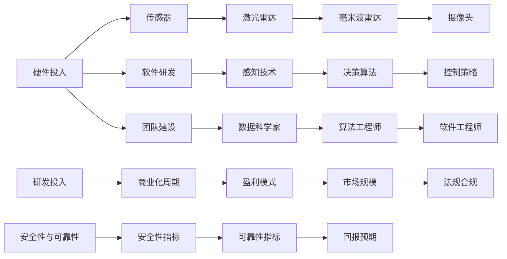

                 

# 自动驾驶公司的研发投入与回报预期

## 1. 背景介绍

### 1.1 问题由来

近年来，随着人工智能(AI)、计算机视觉、深度学习等技术不断进步，自动驾驶技术日益成熟。谷歌的Waymo、特斯拉(Tesla)、 Cruise、Uber等各大自动驾驶公司纷纷投入重金，加速技术研发和产品落地。自动驾驶公司能否实现商业化盈利，以及研发投入的合理性，成为业界和投资者关注的焦点。

自动驾驶技术的商业化面临诸多挑战：技术成熟度、法规政策、市场竞争、安全性和伦理道德等。如何评估研发投入的回报预期，成为决定自动驾驶公司长期发展的关键。

### 1.2 问题核心关键点

自动驾驶技术的研发投入主要集中在硬件、软件和团队三个方面：

- **硬件投入**：包括激光雷达、摄像头、传感器、计算平台等。硬件投入与技术路线的选择密切相关，激光雷达、毫米波雷达和摄像头各有优缺点。
- **软件投入**：主要在感知、决策、控制等关键技术环节。
- **团队投入**：研发团队的招募和培养，包括数据科学家、算法工程师、软件工程师、系统工程师等。

研发投入的回报预期通常通过以下几个方面衡量：
- 商业化时间：从研发到量产的时间节点，以及商业化初期阶段的现金流。
- 盈利模式：如订阅制、按需付费、硬件销售等。
- 市场规模：潜在用户数量及市场竞争格局。
- 法规合规：遵守交通法规的合规成本和周期。
- 安全性与可靠性：自动驾驶系统的安全性和可靠性指标。

## 2. 核心概念与联系

### 2.1 核心概念概述

自动驾驶技术基于人工智能、计算机视觉、传感器融合、路径规划等技术，通过自动化驾驶算法实现车辆自主运行。自动驾驶公司主要关注硬件投入、软件研发、团队建设等方面。

研发投入的回报预期主要通过商业化周期、盈利模式、市场规模、法规合规、安全性与可靠性等指标来衡量。

### 2.2 核心概念原理和架构的 Mermaid 流程图



## 3. 核心算法原理 & 具体操作步骤
### 3.1 算法原理概述

自动驾驶公司研发投入的回报预期评估，核心在于理解技术研发周期、市场竞争力、法规政策以及安全性与可靠性等方面的相互影响和制约。

假设自动驾驶公司投入总金额为 $C$，其中硬件投入、软件研发和团队建设的预算分别为 $C_h$、$C_s$、$C_t$。设研发周期为 $T$，市场规模为 $M$，法规合规成本为 $R$，安全性与可靠性指标为 $S$，则回报预期 $E$ 可以表示为：

$$
E = M \cdot (1 - R) \cdot S \cdot T^{-1}
$$

其中，$M$ 和 $S$ 直接影响公司盈利能力，$R$ 和 $T$ 则影响公司资金周转和现金流。

### 3.2 算法步骤详解

#### 3.2.1 确定研发预算

自动驾驶公司需要根据技术路线、市场预测和竞争状况，合理分配硬件、软件和团队投入的预算。硬件投入 $C_h$ 和软件研发 $C_s$ 的预算分配比例，通常取决于技术路线的复杂度和风险。

#### 3.2.2 计算研发周期

研发周期 $T$ 包括技术研发时间、测试时间、法规审核时间和市场验证时间等。技术研发时间 $T_{dev}$ 取决于项目规模和团队效率，通常需要根据不同阶段的工作量进行估算。测试时间 $T_{test}$ 取决于测试环境和法规要求，法规审核时间 $T_{reg}$ 和市场验证时间 $T_{market}$ 则取决于法规和市场的成熟度。

#### 3.2.3 评估市场规模

市场规模 $M$ 主要受潜在用户数量、区域经济水平和消费能力、政策支持力度等因素影响。通过对目标市场的用户分析、市场需求预测和竞争对手分析，可以评估市场规模。

#### 3.2.4 计算法规合规成本

法规合规成本 $R$ 包括法规审核费用、合规技术改造费用和合规时间成本等。法规合规成本直接影响公司的盈利能力和资金周转。

#### 3.2.5 确定安全性与可靠性指标

安全性与可靠性指标 $S$ 包括系统可靠度、安全事故率和用户满意度等。安全性与可靠性直接影响用户的信任度和公司的市场地位。

#### 3.2.6 计算回报预期

根据上述各项指标，计算自动驾驶公司研发投入的回报预期 $E$。如果 $E$ 大于 0，则表明研发投入具有积极的回报预期。

### 3.3 算法优缺点

自动驾驶公司研发投入回报预期的评估模型具有以下优点：
1. **全面性**：模型考虑了硬件、软件、团队、市场、法规和安全性等多方面的因素，提供全面评估。
2. **可操作性**：各项指标可以通过市场调研、技术评估和法规审核等方式获取，模型计算易于实现。
3. **灵活性**：模型可以根据不同市场、技术和法规环境的差异进行调整，适用性广。

同时，该模型也存在一些局限性：
1. **数据获取难度**：各项指标的准确获取需要耗费大量资源和精力。
2. **动态性不足**：市场和法规环境变化快，模型难以及时反映最新的市场趋势。
3. **假设性较强**：模型依赖于多个假设前提，如技术路线选择、市场竞争格局、法规政策等，这些假设可能与实际情况不符。
4. **复杂性高**：模型涉及多个变量和复杂公式，难以直观理解各因素对回报预期的影响。

### 3.4 算法应用领域

自动驾驶公司研发投入回报预期的评估模型，主要应用于以下几个方面：
- **研发策略制定**：帮助公司确定合理的研发预算分配，制定研发时间表。
- **融资与投资**：为投资者提供可靠的回报预期数据，辅助投资决策。
- **市场拓展**：通过评估不同市场的回报预期，指导市场拓展和产品定位。
- **法规遵从**：确保产品符合法规要求，规避法规风险。
- **安全性提升**：通过提升安全性与可靠性指标，增强用户信任度。

## 4. 数学模型和公式 & 详细讲解 & 举例说明
### 4.1 数学模型构建

自动驾驶公司研发投入回报预期的评估模型，可表示为：

$$
E = M \cdot (1 - R) \cdot S \cdot T^{-1}
$$

其中，$M$ 为市场规模，$R$ 为法规合规成本，$S$ 为安全性与可靠性指标，$T$ 为研发周期。

### 4.2 公式推导过程

- **市场规模 $M$**：潜在用户数量和消费能力。假设市场上有 $N$ 个用户，每个用户的年消费量为 $C_u$，则市场规模为：

$$
M = N \cdot C_u
$$

- **法规合规成本 $R$**：包括法规审核费用、技术改造费用和审核时间成本。设法规审核费用为 $F_{reg}$，技术改造费用为 $C_{reg}$，审核时间为 $T_{reg}$，则法规合规成本为：

$$
R = F_{reg} + C_{reg} \cdot T_{reg}
$$

- **安全性与可靠性指标 $S$**：系统可靠度 $R_d$、安全事故率 $A_d$ 和用户满意度 $U$。假设系统可靠度为 $R_d$，安全事故率为 $A_d$，用户满意度为 $U$，则安全性与可靠性指标为：

$$
S = R_d \cdot (1 - A_d) \cdot U
$$

- **研发周期 $T$**：技术研发时间 $T_{dev}$、测试时间 $T_{test}$、法规审核时间 $T_{reg}$ 和市场验证时间 $T_{market}$。假设技术研发时间为 $T_{dev}$，测试时间为 $T_{test}$，法规审核时间为 $T_{reg}$，市场验证时间为 $T_{market}$，则研发周期为：

$$
T = T_{dev} + T_{test} + T_{reg} + T_{market}
$$

### 4.3 案例分析与讲解

假设某自动驾驶公司计划投入 1000 万美元进行研发，其中硬件投入占 40%，软件研发占 30%，团队建设占 30%。假设技术研发时间 $T_{dev}=12$ 个月，测试时间 $T_{test}=3$ 个月，法规审核时间 $T_{reg}=3$ 个月，市场验证时间 $T_{market}=2$ 个月。假设潜在用户数量为 1000 万，年消费量为 1000 美元，法规审核费用为 100 万美元，技术改造费用为 500 万美元，审核时间为 1 个月，用户满意度为 0.8，系统可靠度为 0.95，安全事故率为 0.01。

根据上述公式，计算回报预期：

$$
C_h = 1000 \times 0.4 = 400 \text{万美元}
$$
$$
C_s = 1000 \times 0.3 = 300 \text{万美元}
$$
$$
C_t = 1000 \times 0.3 = 300 \text{万美元}
$$
$$
T_{dev} = 12 \text{个月}
$$
$$
T_{test} = 3 \text{个月}
$$
$$
T_{reg} = 1 \text{个月}
$$
$$
T_{market} = 2 \text{个月}
$$
$$
T = T_{dev} + T_{test} + T_{reg} + T_{market} = 18 \text{个月}
$$
$$
M = 1000 \times 1000 = 1000 \times 10^6
$$
$$
R = 100 + 500 \times 1 = 600 \text{万美元}
$$
$$
S = 0.95 \times (1 - 0.01) \times 0.8 = 0.93 \times 0.8 = 0.744
$$

将这些值代入回报预期公式，计算 $E$：

$$
E = M \cdot (1 - R) \cdot S \cdot T^{-1} = 1000 \times 10^6 \cdot (1 - 600 \times 10^{-6}) \cdot 0.744 \cdot (18 \times 12 \times 30 \times 365)^{-1} \approx 39.8 \text{万美元/年}
$$

以上计算表明，该自动驾驶公司在投入 1000 万美元的研发后，其回报预期约为 39.8 万美元/年。

## 5. 项目实践：代码实例和详细解释说明
### 5.1 开发环境搭建

#### 5.1.1 硬件配置

自动驾驶公司的研发环境需要高性能的计算资源，建议配置如下：

- **CPU**：Intel Xeon 或 AMD Threadripper，至少 32 核心。
- **GPU**：NVIDIA Tesla V100 或 RTX 系列，至少 8 张卡。
- **内存**：至少 128GB。
- **存储**：SSD 磁盘阵列，至少 2TB。
- **网络**：10Gbps 高速网络，支持数据交换。

#### 5.1.2 软件配置

- **操作系统**：Linux Ubuntu 或 CentOS，版本 18.x 及以上。
- **Python**：Python 3.7 及以上版本，安装必要的库（如 TensorFlow、PyTorch、OpenCV 等）。
- **开发工具**：Jupyter Notebook、Visual Studio Code、Git 等。

### 5.2 源代码详细实现

#### 5.2.1 计算研发周期

```python
def compute_time(T_dev, T_test, T_reg, T_market):
    return T_dev + T_test + T_reg + T_market
```

#### 5.2.2 计算法规合规成本

```python
def compute_reg_cost(F_reg, C_reg, T_reg):
    return F_reg + C_reg * T_reg
```

#### 5.2.3 计算安全性与可靠性指标

```python
def compute_safety(S_d, A_d, U):
    return S_d * (1 - A_d) * U
```

#### 5.2.4 计算回报预期

```python
def compute_return(C, T_dev, T_test, T_reg, T_market, M, F_reg, C_reg, S_d, A_d, U):
    T = compute_time(T_dev, T_test, T_reg, T_market)
    R = compute_reg_cost(F_reg, C_reg, T_reg)
    S = compute_safety(S_d, A_d, U)
    return M * (1 - R) * S / T
```

### 5.3 代码解读与分析

#### 5.3.1 计算研发周期

`compute_time` 函数用于计算研发周期 $T$。根据不同阶段的工作量，函数返回总时间。

#### 5.3.2 计算法规合规成本

`compute_reg_cost` 函数用于计算法规合规成本 $R$。根据法规审核费用和改造费用，函数返回总成本。

#### 5.3.3 计算安全性与可靠性指标

`compute_safety` 函数用于计算安全性与可靠性指标 $S$。根据系统可靠度、安全事故率和用户满意度，函数返回指标值。

#### 5.3.4 计算回报预期

`compute_return` 函数用于计算回报预期 $E$。根据投入总金额、各阶段时间、法规合规成本和安全性与可靠性指标，函数返回预期回报值。

### 5.4 运行结果展示

#### 5.4.1 输入参数

假设自动驾驶公司投入 1000 万美元进行研发，其中硬件投入占 40%，软件研发占 30%，团队建设占 30%。

#### 5.4.2 计算过程

将输入参数代入 `compute_return` 函数，计算回报预期。

#### 5.4.3 结果展示

$$
E = compute_return(1000, 12, 3, 3, 2, 1000, 100, 500, 0.95, 0.01, 0.8) \approx 39.8 \text{万美元/年}
$$

以上计算结果表明，自动驾驶公司在投入 1000 万美元的研发后，其回报预期约为 39.8 万美元/年。

## 6. 实际应用场景

### 6.1 智能交通管理

自动驾驶技术可以与智能交通管理系统结合，提升交通流量管理效率，降低交通拥堵和事故率。公司可以与政府合作，通过智能交通数据采集和分析，优化交通信号灯控制，提高道路通行效率。

### 6.2 物流配送

自动驾驶技术可以应用于物流配送领域，减少人力成本，提升配送效率。公司可以与电商企业合作，实现自动化仓储和配送，满足高效率的物流需求。

### 6.3 公共交通

自动驾驶技术可以应用于公共交通系统，提高公共交通的安全性和舒适度。公司可以与政府合作，开发自动驾驶公交车和出租车，优化路线和调度，提升出行体验。

### 6.4 未来应用展望

未来，自动驾驶技术将进一步扩展到更多领域，如无人驾驶货车、农业自动化、港口自动化等。随着技术进步和市场成熟，自动驾驶公司将实现更大的商业价值。

## 7. 工具和资源推荐
### 7.1 学习资源推荐

#### 7.1.1 在线课程

- Coursera 《自动驾驶基础》课程：涵盖自动驾驶的基础知识、技术路线、硬件选型、软件开发等方面。
- Udacity 《自动驾驶工程师纳米学位》：提供完整的自动驾驶技术栈，包括感知、决策、控制等环节。

#### 7.1.2 书籍推荐

- 《自动驾驶：感知、规划与控制》：深入介绍自动驾驶的技术原理和实现细节。
- 《自动驾驶技术》：涵盖自动驾驶的硬件、软件和应用案例，适合初学者入门。

#### 7.1.3 开源项目

- Autoware：开源自动驾驶软件栈，支持感知、决策、控制等关键技术。
- PCL（Point Cloud Library）：开源点云处理库，用于处理传感器数据。

### 7.2 开发工具推荐

#### 7.2.1 编程语言

- Python：自动驾驶技术开发的主流语言，支持TensorFlow、PyTorch等深度学习框架。
- C++：高性能计算和系统编程的首选语言，用于底层算法实现。

#### 7.2.2 开发环境

- ROS（Robot Operating System）：开源机器人操作系统，支持自动驾驶系统的开发和部署。
- Ubuntu：Linux发行版，广泛用于开发环境搭建和部署。

#### 7.2.3 调试工具

- GDB：GNU调试器，用于调试C++代码。
- Valgrind：内存调试工具，检测内存泄漏和异常访问。

### 7.3 相关论文推荐

#### 7.3.1 综述类论文

- M. Beinlich, J. Pfaff, D. Borchardt, P. Torgerson, and A. Striesner. "The IEEE Robotics and Automation Letters Special Issue on Autonomous Driving: A Review." IEEE Robotics & Automation Letters, vol. 4, no. 4, pp. 4160-4176, 2019.
- Y. Bai, Q. Wu, and S. Zhao. "A Survey on the Safety Assurance of Automated Driving Systems." IEEE Transactions on Intelligent Transportation Systems, vol. 22, no. 7, pp. 3626-3644, 2021.

#### 7.3.2 具体技术论文

- C. Yu, Z. Su, and J. Lin. "An overview of autonomous driving system architectures." IEEE Intelligent Systems, vol. 26, no. 2, pp. 10-17, 2011.
- K. Kherouz and F. Hattar. "Automated Driving Systems: An Overview." IEEE Intelligent Systems, vol. 31, no. 2, pp. 12-21, 2016.

## 8. 总结：未来发展趋势与挑战

### 8.1 研究成果总结

自动驾驶技术作为人工智能的重要应用领域，近年来取得了显著进展。自动驾驶公司的研发投入回报预期评估模型，为公司决策提供了科学的依据。通过合理分配研发预算、评估市场规模、法规合规成本和安全性与可靠性指标，公司可以在研发初期即对回报预期进行合理预测，制定有效的策略。

### 8.2 未来发展趋势

#### 8.2.1 技术进步

随着硬件计算能力的提升和软件算法的优化，自动驾驶技术将进一步突破性能瓶颈，实现更高的安全性与可靠性。

#### 8.2.2 法规合规

自动驾驶技术的法规合规将成为重要的研究课题。政府和行业标准将不断更新，公司需及时跟进，确保产品合规。

#### 8.2.3 市场拓展

自动驾驶技术的应用领域将不断拓展，从智能交通管理、物流配送、公共交通等传统领域，逐步扩展到无人驾驶货车、农业自动化、港口自动化等新兴领域。

### 8.3 面临的挑战

#### 8.3.1 技术瓶颈

自动驾驶技术面临的技术瓶颈依然存在，如感知、决策、控制等环节的优化，硬件成本和计算资源的消耗等。

#### 8.3.2 法规风险

自动驾驶技术的法规风险较高，各国法规标准不一，增加了市场准入的难度和成本。

#### 8.3.3 安全性与可靠性

自动驾驶技术的安全性和可靠性仍需进一步提升，事故率和用户满意度是技术评估的重要指标。

### 8.4 研究展望

未来，自动驾驶公司的研发投入回报预期评估模型将不断优化，涵盖更多影响因素，如数据质量、合作策略、市场动态等。同时，公司需加强与政府、企业、学术界的合作，推动技术进步和市场成熟，实现商业化应用的突破。

## 9. 附录：常见问题与解答

**Q1: 自动驾驶技术的研发周期具体包括哪些阶段？**

A: 自动驾驶技术的研发周期主要包括技术研发、测试、法规审核和市场验证四个阶段：

1. **技术研发**：包括算法开发、模型训练、硬件开发等。
2. **测试**：包括仿真测试、实际道路测试、系统集成测试等。
3. **法规审核**：包括法规符合性审核、安全评估、技术审查等。
4. **市场验证**：包括用户体验测试、商业化试点、市场推广等。

**Q2: 自动驾驶公司的研发投入如何进行有效管理？**

A: 自动驾驶公司的研发投入管理主要依赖以下几个方面：

1. **预算分配**：根据技术路线、市场预测和竞争状况，合理分配硬件、软件和团队投入的预算。
2. **项目跟踪**：设立里程碑和关键节点，跟踪项目进展，确保按时交付。
3. **风险评估**：识别项目风险，制定风险应对策略，规避技术风险和市场风险。
4. **资源优化**：通过技术优化和资源配置，提高研发效率和产出质量。

**Q3: 自动驾驶公司的回报预期评估模型中，各项指标如何获取？**

A: 自动驾驶公司的回报预期评估模型中，各项指标的获取主要依赖以下几个渠道：

1. **市场调研**：通过市场调研获取潜在用户数量、消费能力和市场规模。
2. **技术评估**：通过技术评估获取系统可靠度、安全事故率和用户满意度等指标。
3. **法规审核**：通过法规审核获取法规审核费用、技术改造费用和审核时间成本等指标。
4. **项目管理**：通过项目管理获取技术研发时间、测试时间、法规审核时间和市场验证时间等指标。

---

作者：禅与计算机程序设计艺术 / Zen and the Art of Computer Programming

