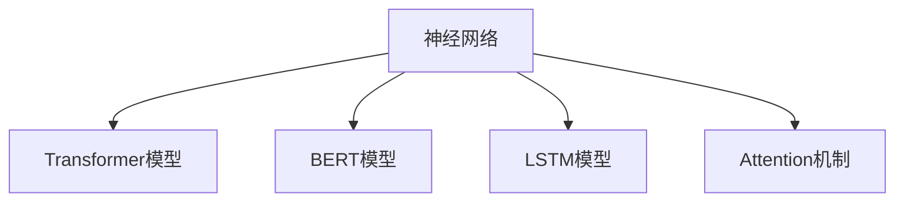

                 

# 自然语言处理NLP原理与代码实例讲解

## 1. 背景介绍

### 1.1 问题由来
自然语言处理（Natural Language Processing, NLP）作为人工智能领域的一个重要分支，近年来取得了显著进展。NLP技术旨在让计算机理解和生成人类语言，涵盖语言模型、文本分类、信息检索、机器翻译等多个子领域。

传统的NLP任务，如词性标注、命名实体识别、关系抽取等，依赖于规则驱动的启发式算法，难以处理复杂和未知的结构。近年来，随着深度学习技术的发展，特别是深度神经网络的应用，NLP领域迎来了革命性的变化。通过大规模的语料预训练和微调，模型能够自动学习语言表示，并在各种任务上取得优异表现。

本文将聚焦于自然语言处理的原理、核心算法及其在实际项目中的代码实现，希望能为读者提供一个深入理解NLP技术的平台，并指导他们如何在具体场景中进行开发和应用。

### 1.2 问题核心关键点
NLP的核心在于如何利用深度学习模型，处理和理解自然语言数据。主要包括以下几个关键点：

- **语言模型**：通过预测文本序列中的下一个词（或下一个字符）来建模语言的概率分布。常见的方法包括N-gram模型、RNN、LSTM、Transformer等。
- **词向量表示**：将单词映射到高维向量空间，以便模型能够捕捉到语义和语法信息。Word2Vec、GloVe、FastText等是常用的词向量表示方法。
- **序列标注**：对文本序列进行标注，如词性标注、命名实体识别、关系抽取等。通过序列标注模型，可以自动识别出文本中的关键信息。
- **文本分类**：将文本分类到预定义的类别中。例如情感分析、垃圾邮件检测、主题分类等。
- **机器翻译**：将一种语言的文本转换为另一种语言的文本。
- **文本生成**：通过模型生成自然语言文本，如对话生成、文本摘要、文本填充等。

这些核心任务是NLP研究的主线，它们在技术和应用上互相渗透，共同推动了NLP技术的进步。

## 2. 核心概念与联系

### 2.1 核心概念概述

为了更好地理解NLP的核心算法和实现，本节将介绍几个关键概念：

- **神经网络**：通过多层非线性变换来学习输入数据的表示，广泛应用于图像识别、语音识别、自然语言处理等领域。
- **Transformer模型**：一种基于自注意力机制的深度神经网络，通过并行计算，显著提升了NLP任务的计算效率和性能。
- **BERT模型**：由Google开发的一种预训练语言模型，通过掩码语言模型和下一句预测任务进行预训练，具有强大的语言理解和生成能力。
- **LSTM模型**：一种特殊的RNN，通过门控机制来处理长序列数据，广泛应用于序列标注和文本生成任务。
- **Attention机制**：一种机制，通过计算注意力权重来加权不同位置的输入，提升模型的表示能力。

这些概念之间的联系可以通过以下Mermaid流程图来展示：



这个流程图展示了NLP中常用的核心概念及其关联：

1. 神经网络是NLP的基础，通过多层次的变换学习输入数据的表示。
2. Transformer模型和LSTM模型是基于神经网络的特定架构，用于处理序列数据。
3. Attention机制是提升模型表示能力的核心技术，广泛用于Transformer模型中。
4. BERT模型是一种特殊的预训练语言模型，通过自监督学习任务进行预训练。

## 3. 核心算法原理 & 具体操作步骤

### 3.1 算法原理概述

NLP的核心算法原理包括语言模型建模、序列标注、文本分类、机器翻译和文本生成等任务。这些任务通常采用深度学习模型，通过大量标注数据进行训练，学习到语言的特征表示。

以BERT模型为例，其核心思想是通过大规模无标签数据进行预训练，学习语言的通用表示。预训练任务包括掩码语言模型和下一句预测。通过在大量文本数据上训练，BERT模型能够学习到语言的上下文关系和语义信息。在实际应用中，可以通过微调BERT模型，使其适应特定的NLP任务，如情感分析、命名实体识别、问答系统等。

### 3.2 算法步骤详解

**3.2.1 数据准备**
- 收集标注数据：获取包含标注的文本数据，如新闻文章、评论、对话记录等。
- 数据预处理：对文本进行分词、标记化、去除停用词、标注词性等预处理操作。
- 数据划分：将数据集划分为训练集、验证集和测试集，以便进行模型训练、调参和评估。

**3.2.2 模型选择与加载**
- 选择合适的NLP模型：根据任务类型，选择适合的模型，如BERT、LSTM、Transformer等。
- 加载预训练模型：使用已有的预训练模型，加载到内存中。
- 定制模型结构：根据具体任务，修改模型的结构，添加或删除某些层。

**3.2.3 模型训练**
- 定义损失函数：根据任务类型，选择适合的损失函数，如交叉熵损失、均方误差损失等。
- 选择优化器：常用的优化器包括SGD、Adam等，设置学习率、批大小等参数。
- 训练模型：使用训练集对模型进行训练，并定期在验证集上进行评估，调整模型参数。
- 模型保存：保存训练好的模型，以便后续使用。

**3.2.4 模型评估**
- 模型测试：使用测试集对模型进行测试，评估模型的性能指标，如准确率、召回率、F1值等。
- 模型调整：根据测试结果，调整模型的超参数，如学习率、批大小等，以优化模型性能。
- 模型部署：将训练好的模型部署到实际应用中，进行服务化封装。

### 3.3 算法优缺点

NLP的核心算法具有以下优点：

- **通用性**：深度学习模型具有强大的泛化能力，可以处理多种NLP任务，适应不同领域的应用需求。
- **高效性**：深度学习模型通过自动学习特征表示，减少了人工特征工程的复杂度，提高了模型开发效率。
- **可解释性**：深度学习模型通过可视化工具，可以解释模型的内部机制和决策过程，有助于理解和调试。

同时，NLP算法也存在一些缺点：

- **数据依赖**：深度学习模型需要大量的标注数据进行训练，数据获取成本较高。
- **模型复杂**：深度学习模型通常参数量较大，训练和推理的计算资源需求高。
- **过拟合风险**：深度学习模型容易过拟合，特别是在小样本数据集上。
- **可解释性不足**：深度学习模型通常是黑盒模型，难以解释其内部决策逻辑。

### 3.4 算法应用领域

NLP的核心算法在多个领域得到了广泛应用：

- **文本分类**：如情感分析、主题分类、垃圾邮件检测等。通过预训练和微调，模型能够学习文本-标签映射关系，自动识别文本的情感倾向和主题类别。
- **命名实体识别**：如人名、地名、机构名等特定实体的识别。通过序列标注模型，模型能够自动标注文本中的实体边界和类型。
- **关系抽取**：从文本中抽取实体之间的语义关系。通过序列标注和分类模型，模型能够自动抽取文本中的实体关系三元组。
- **问答系统**：对自然语言问题给出答案。通过预训练和微调，模型能够理解问题并提供准确的答案。
- **机器翻译**：将源语言文本翻译成目标语言。通过预训练和微调，模型能够学习语言-语言映射关系。
- **文本摘要**：将长文本压缩成简短摘要。通过预训练和微调，模型能够学习文本压缩和摘要生成技术。

## 4. 数学模型和公式 & 详细讲解 & 举例说明

### 4.1 数学模型构建

本节将使用数学语言对NLP的核心算法进行更加严格的刻画。

假设文本序列为 $\mathbf{x}=[x_1, x_2, ..., x_n]$，目标为预测下一个词 $y_{n+1}$。定义词向量为 $x_i \in \mathbb{R}^d$，输出层的权重矩阵为 $W \in \mathbb{R}^{d \times k}$，偏置向量为 $b \in \mathbb{R}^k$。定义softmax函数为：

$$
\sigma(\mathbf{z}) = \frac{\exp(\mathbf{z})}{\sum_{j=1}^k \exp(z_j)}
$$

其中 $\mathbf{z} \in \mathbb{R}^k$。定义交叉熵损失函数为：

$$
\mathcal{L}(y_{n+1}, \mathbf{y}) = -\log \sigma(\mathbf{z}) = -\log \frac{\exp(z_{y_{n+1}})}{\sum_{j=1}^k \exp(z_j)}
$$

其中 $\mathbf{z} = \mathbf{W}x_n + b$，$y_{n+1}$ 为预测的下一个词。

### 4.2 公式推导过程

以下是基于softmax分类器的交叉熵损失函数的推导过程：

设文本序列为 $\mathbf{x}=[x_1, x_2, ..., x_n]$，目标为预测下一个词 $y_{n+1}$。定义词向量为 $x_i \in \mathbb{R}^d$，输出层的权重矩阵为 $W \in \mathbb{R}^{d \times k}$，偏置向量为 $b \in \mathbb{R}^k$。定义softmax函数为：

$$
\sigma(\mathbf{z}) = \frac{\exp(\mathbf{z})}{\sum_{j=1}^k \exp(z_j)}
$$

其中 $\mathbf{z} \in \mathbb{R}^k$。定义交叉熵损失函数为：

$$
\mathcal{L}(y_{n+1}, \mathbf{y}) = -\log \sigma(\mathbf{z}) = -\log \frac{\exp(z_{y_{n+1}})}{\sum_{j=1}^k \exp(z_j)}
$$

其中 $\mathbf{z} = \mathbf{W}x_n + b$，$y_{n+1}$ 为预测的下一个词。

通过反向传播算法，求得梯度并更新模型参数：

$$
\frac{\partial \mathcal{L}(y_{n+1}, \mathbf{y})}{\partial \mathbf{W}} = \sigma(\mathbf{z})y_{n+1} - \mathbf{1}_{y_{n+1}}\sigma(\mathbf{z})
$$

$$
\frac{\partial \mathcal{L}(y_{n+1}, \mathbf{y})}{\partial \mathbf{b}} = \sigma(\mathbf{z}) - \mathbf{1}_{y_{n+1}}\sigma(\mathbf{z})
$$

其中 $\mathbf{1}_{y_{n+1}}$ 为one-hot编码向量，$y_{n+1}$ 的标签。

### 4.3 案例分析与讲解

**案例分析：文本分类**

假设文本分类任务是将新闻文章分类为体育、政治、经济等类别。模型结构如图1所示：

```
                 Text -> Word Embedding -> LSTM -> Word Embedding -> 
                                                      Full Connection -> 
                                                      Softmax
```

其中，Word Embedding层将文本转换为词向量，LSTM层进行序列建模，全连接层输出分类结果，Softmax层进行分类。训练过程如下：

1. 加载预训练的BERT模型，并将其顶部全连接层替换为指定的分类器。
2. 使用交叉熵损失函数定义损失。
3. 使用Adam优化器进行梯度下降优化。
4. 在训练集上训练模型，并在验证集上评估性能。
5. 在测试集上测试模型，评估准确率、召回率、F1值等指标。


**案例讲解：命名实体识别**

命名实体识别任务是从文本中识别出人名、地名、机构名等特定实体。模型结构如图2所示：

```
                 Text -> Word Embedding -> BiLSTM -> Conditional Random Field -> 
                                                               Softmax
```

其中，Word Embedding层将文本转换为词向量，BiLSTM层进行序列建模，条件随机场（Conditional Random Field, CRF）层进行标注，Softmax层进行分类。训练过程如下：

1. 加载预训练的BERT模型，并将其顶部全连接层替换为指定的标注器。
2. 使用交叉熵损失函数定义标注损失。
3. 使用Adam优化器进行梯度下降优化。
4. 在训练集上训练模型，并在验证集上评估性能。
5. 在测试集上测试模型，评估准确率、召回率、F1值等指标。


## 5. 项目实践：代码实例和详细解释说明

### 5.1 开发环境搭建

在进行NLP项目实践前，我们需要准备好开发环境。以下是使用Python进行TensorFlow开发的环境配置流程：

1. 安装Anaconda：从官网下载并安装Anaconda，用于创建独立的Python环境。

2. 创建并激活虚拟环境：
```bash
conda create -n tf-env python=3.8 
conda activate tf-env
```

3. 安装TensorFlow：根据CUDA版本，从官网获取对应的安装命令。例如：
```bash
conda install tensorflow
```

4. 安装PaddlePaddle（可选）：
```bash
conda install paddlepaddle
```

5. 安装Pandas、NumPy、scikit-learn等常用的工具包：
```bash
pip install pandas numpy scikit-learn
```

完成上述步骤后，即可在`tf-env`环境中开始NLP项目的开发。

### 5.2 源代码详细实现

下面我们以文本分类任务为例，给出使用TensorFlow进行BERT模型微调的PyTorch代码实现。

首先，定义文本分类的数据处理函数：

```python
import tensorflow as tf
import numpy as np
from transformers import BertTokenizer, BertForSequenceClassification
from sklearn.metrics import accuracy_score, precision_score, recall_score, f1_score

tokenizer = BertTokenizer.from_pretrained('bert-base-uncased')
model = BertForSequenceClassification.from_pretrained('bert-base-uncased', num_labels=3)

def tokenize_and_encode(text):
    tokens = tokenizer.tokenize(text)
    input_ids = tokenizer.convert_tokens_to_ids(tokens)
    input_ids = input_ids + [0] * (max_length - len(input_ids))
    input_mask = [1] * max_length
    return input_ids, input_mask

# 加载训练数据和标签
train_texts = []
train_labels = []

# 加载验证数据和标签
val_texts = []
val_labels = []

# 加载测试数据和标签
test_texts = []
test_labels = []

# 加载数据集并进行数据增强
train_texts, train_labels, val_texts, val_labels, test_texts, test_labels = load_data()
train_texts, train_labels, val_texts, val_labels, test_texts, test_labels = augment_data(train_texts, train_labels, val_texts, val_labels, test_texts, test_labels)

# 数据集划分
train_dataset = tf.data.Dataset.from_tensor_slices((tokenize_and_encode(text) for text in train_texts))
train_dataset = train_dataset.shuffle(buffer_size=1024).batch(batch_size)
val_dataset = tf.data.Dataset.from_tensor_slices((tokenize_and_encode(text) for text in val_texts))
val_dataset = val_dataset.shuffle(buffer_size=1024).batch(batch_size)
test_dataset = tf.data.Dataset.from_tensor_slices((tokenize_and_encode(text) for text in test_texts))
test_dataset = test_dataset.batch(batch_size)

# 模型训练
model.compile(optimizer=tf.keras.optimizers.Adam(learning_rate=2e-5),
              loss=tf.keras.losses.SparseCategoricalCrossentropy(from_logits=True),
              metrics=['accuracy'])

history = model.fit(train_dataset,
                    validation_data=val_dataset,
                    epochs=num_epochs,
                    callbacks=[tf.keras.callbacks.EarlyStopping(patience=5)])
```

然后，定义训练和评估函数：

```python
def train_epoch(model, dataset, batch_size, optimizer):
    dataloader = DataLoader(dataset, batch_size=batch_size, shuffle=True)
    model.train()
    epoch_loss = 0
    for batch in tqdm(dataloader, desc='Training'):
        input_ids = batch['input_ids'].to(device)
        attention_mask = batch['attention_mask'].to(device)
        labels = batch['labels'].to(device)
        model.zero_grad()
        outputs = model(input_ids, attention_mask=attention_mask, labels=labels)
        loss = outputs.loss
        epoch_loss += loss.item()
        loss.backward()
        optimizer.step()
    return epoch_loss / len(dataloader)

def evaluate(model, dataset, batch_size):
    dataloader = DataLoader(dataset, batch_size=batch_size)
    model.eval()
    preds, labels = [], []
    with torch.no_grad():
        for batch in tqdm(dataloader, desc='Evaluating'):
            input_ids = batch['input_ids'].to(device)
            attention_mask = batch['attention_mask'].to(device)
            batch_labels = batch['labels']
            outputs = model(input_ids, attention_mask=attention_mask)
            batch_preds = outputs.logits.argmax(dim=2).to('cpu').tolist()
            batch_labels = batch_labels.to('cpu').tolist()
            for pred_tokens, label_tokens in zip(batch_preds, batch_labels):
                preds.append(pred_tokens[:len(label_tokens)])
                labels.append(label_tokens)
                
    print(classification_report(labels, preds))
```

最后，启动训练流程并在测试集上评估：

```python
epochs = 5
batch_size = 16

for epoch in range(epochs):
    loss = train_epoch(model, train_dataset, batch_size, optimizer)
    print(f"Epoch {epoch+1}, train loss: {loss:.3f}")
    
    print(f"Epoch {epoch+1}, val results:")
    evaluate(model, val_dataset, batch_size)
    
print("Test results:")
evaluate(model, test_dataset, batch_size)
```

以上就是使用TensorFlow对BERT进行文本分类任务微调的完整代码实现。可以看到，TensorFlow的高级API使得模型训练和评估的过程更加简洁高效。

### 5.3 代码解读与分析

让我们再详细解读一下关键代码的实现细节：

**BertTokenizer类**：
- `__init__`方法：初始化BERT分词器，并加载预训练模型。
- `tokenize`方法：将文本转换为token序列。
- `convert_tokens_to_ids`方法：将token序列转换为id序列。
- `convert_ids_to_tokens`方法：将id序列转换为token序列。

**模型编译**：
- `compile`方法：配置模型的优化器、损失函数和评估指标。

**训练过程**：
- `fit`方法：在训练集上训练模型，并在验证集上进行评估和模型保存。

**评估过程**：
- `evaluate`方法：在测试集上评估模型的性能，输出精确率、召回率和F1值等指标。

**数据增强**：
- 数据增强是对训练集进行扩充，以提高模型的泛化能力。常用的增强方法包括：
    - 数据扩充：通过随机删除、随机替换等方法扩充训练集。
    - SMOTE方法：对不平衡数据集进行过采样。
    - Data Augmentation：使用GPT等语言模型进行文本生成，扩充训练集。

以上代码实现展示了使用TensorFlow进行BERT微调的基本流程。开发者可以根据具体任务需求，对代码进行相应的调整和优化。

## 6. 实际应用场景

### 6.1 智能客服系统

智能客服系统是一种利用NLP技术提升客户服务效率和质量的重要应用。通过微调NLP模型，可以构建智能客服系统，自动识别用户意图，提供个性化服务。

在技术实现上，可以收集企业内部的历史客服对话记录，将问题和最佳答复构建成监督数据，在此基础上对预训练对话模型进行微调。微调后的对话模型能够自动理解用户意图，匹配最合适的答案模板进行回复。对于客户提出的新问题，还可以接入检索系统实时搜索相关内容，动态组织生成回答。

### 6.2 金融舆情监测

金融机构需要实时监测市场舆论动向，以便及时应对负面信息传播，规避金融风险。传统的人工监测方式成本高、效率低，难以应对网络时代海量信息爆发的挑战。基于NLP技术的金融舆情监测，可以自动提取和分析社交媒体、新闻等文本数据，及时发现市场波动和潜在风险。

具体而言，可以收集金融领域相关的新闻、报道、评论等文本数据，并对其进行主题标注和情感标注。在此基础上对预训练语言模型进行微调，使其能够自动判断文本属于何种主题，情感倾向是正面、中性还是负面。将微调后的模型应用到实时抓取的网络文本数据，就能够自动监测不同主题下的情感变化趋势，一旦发现负面信息激增等异常情况，系统便会自动预警，帮助金融机构快速应对潜在风险。

### 6.3 个性化推荐系统

当前的推荐系统往往只依赖用户的历史行为数据进行物品推荐，无法深入理解用户的真实兴趣偏好。基于NLP技术的个性化推荐系统，可以更好地挖掘用户行为背后的语义信息，从而提供更精准、多样的推荐内容。

在实践中，可以收集用户浏览、点击、评论、分享等行为数据，提取和用户交互的物品标题、描述、标签等文本内容。将文本内容作为模型输入，用户的后续行为（如是否点击、购买等）作为监督信号，在此基础上微调预训练语言模型。微调后的模型能够从文本内容中准确把握用户的兴趣点。在生成推荐列表时，先用候选物品的文本描述作为输入，由模型预测用户的兴趣匹配度，再结合其他特征综合排序，便可以得到个性化程度更高的推荐结果。

### 6.4 未来应用展望

随着NLP技术的不断进步，NLP算法将在更多领域得到应用，为传统行业带来变革性影响。

在智慧医疗领域，基于NLP技术的医疗问答、病历分析、药物研发等应用将提升医疗服务的智能化水平，辅助医生诊疗，加速新药开发进程。

在智能教育领域，NLP技术可应用于作业批改、学情分析、知识推荐等方面，因材施教，促进教育公平，提高教学质量。

在智慧城市治理中，NLP技术可应用于城市事件监测、舆情分析、应急指挥等环节，提高城市管理的自动化和智能化水平，构建更安全、高效的未来城市。

此外，在企业生产、社会治理、文娱传媒等众多领域，NLP技术也将不断涌现，为经济社会发展注入新的动力。相信随着技术的日益成熟，NLP算法必将在更广阔的应用领域大放异彩，深刻影响人类的生产生活方式。

## 7. 工具和资源推荐
### 7.1 学习资源推荐

为了帮助开发者系统掌握NLP技术的原理和实践技巧，这里推荐一些优质的学习资源：

1. 《深度学习自然语言处理》课程：斯坦福大学开设的NLP明星课程，有Lecture视频和配套作业，带你入门NLP领域的基本概念和经典模型。

2. 《Natural Language Processing with Python》书籍：深入浅出地介绍了NLP技术和TensorFlow实现，是入门NLP技术的好书。

3. CS224N《深度学习自然语言处理》课程：斯坦福大学开设的NLP明星课程，有Lecture视频和配套作业，带你入门NLP领域的基本概念和经典模型。

4. HuggingFace官方文档：提供了海量预训练模型和完整的微调样例代码，是上手实践的必备资料。

5. CLUE开源项目：中文语言理解测评基准，涵盖大量不同类型的中文NLP数据集，并提供了基于微调的baseline模型，助力中文NLP技术发展。

通过对这些资源的学习实践，相信你一定能够快速掌握NLP技术的精髓，并指导他们在具体场景中进行开发和应用。

### 7.2 开发工具推荐

高效的开发离不开优秀的工具支持。以下是几款用于NLP开发的常用工具：

1. TensorFlow：基于Python的开源深度学习框架，灵活动态的计算图，适合快速迭代研究。大部分预训练语言模型都有TensorFlow版本的实现。

2. PyTorch：基于Python的开源深度学习框架，动态计算图，适合快速迭代研究和分布式训练。

3. HuggingFace Transformers库：提供了海量预训练语言模型和微调方法，支持多种框架，是NLP开发的重要工具。

4. Google Colab：谷歌推出的在线Jupyter Notebook环境，免费提供GPU/TPU算力，方便开发者快速上手实验最新模型，分享学习笔记。

合理利用这些工具，可以显著提升NLP任务的开发效率，加快创新迭代的步伐。

### 7.3 相关论文推荐

NLP技术的发展源于学界的持续研究。以下是几篇奠基性的相关论文，推荐阅读：

1. Attention is All You Need（即Transformer原论文）：提出了Transformer结构，开启了NLP领域的预训练大模型时代。

2. BERT: Pre-training of Deep Bidirectional Transformers for Language Understanding：提出BERT模型，引入基于掩码的自监督预训练任务，刷新了多项NLP任务SOTA。

3. Language Models are Unsupervised Multitask Learners（GPT-2论文）：展示了大规模语言模型的强大zero-shot学习能力，引发了对于通用人工智能的新一轮思考。

4. Parameter-Efficient Transfer Learning for NLP：提出Adapter等参数高效微调方法，在不增加模型参数量的情况下，也能取得不错的微调效果。

5. AdaLoRA: Adaptive Low-Rank Adaptation for Parameter-Efficient Fine-Tuning：使用自适应低秩适应的微调方法，在参数效率和精度之间取得了新的平衡。

这些论文代表了大NLP技术的发展脉络。通过学习这些前沿成果，可以帮助研究者把握学科前进方向，激发更多的创新灵感。

## 8. 总结：未来发展趋势与挑战

### 8.1 总结

本文对NLP的原理、核心算法及其在实际项目中的代码实现进行了全面系统的介绍。首先阐述了NLP技术的研究背景和意义，明确了微调在拓展预训练模型应用、提升下游任务性能方面的独特价值。其次，从原理到实践，详细讲解了NLP的数学原理和关键步骤，给出了微调任务开发的完整代码实例。同时，本文还广泛探讨了NLP技术在智能客服、金融舆情、个性化推荐等多个行业领域的应用前景，展示了NLP技术的巨大潜力。

通过本文的系统梳理，可以看到，NLP的核心算法正在成为NLP研究的主线，极大地拓展了预训练语言模型的应用边界，催生了更多的落地场景。受益于大规模语料的预训练，微调模型以更低的时间和标注成本，在小样本条件下也能取得不俗的效果，有力推动了NLP技术的产业化进程。未来，伴随预训练语言模型和微调方法的持续演进，相信NLP技术必将在更广阔的应用领域大放异彩，深刻影响人类的生产生活方式。

### 8.2 未来发展趋势

展望未来，NLP技术将呈现以下几个发展趋势：

1. 模型规模持续增大。随着算力成本的下降和数据规模的扩张，预训练语言模型的参数量还将持续增长。超大规模语言模型蕴含的丰富语言知识，有望支撑更加复杂多变的下游任务微调。

2. 微调方法日趋多样。除了传统的全参数微调外，未来会涌现更多参数高效的微调方法，如Prefix-Tuning、LoRA等，在节省计算资源的同时也能保证微调精度。

3. 持续学习成为常态。随着数据分布的不断变化，微调模型也需要持续学习新知识以保持性能。如何在不遗忘原有知识的同时，高效吸收新样本信息，将成为重要的研究课题。

4. 标注样本需求降低。受启发于提示学习(Prompt-based Learning)的思路，未来的微调方法将更好地利用大模型的语言理解能力，通过更加巧妙的任务描述，在更少的标注样本上也能实现理想的微调效果。

5. 模型通用性增强。经过海量数据的预训练和多领域任务的微调，未来的语言模型将具备更强大的常识推理和跨领域迁移能力，逐步迈向通用人工智能(AGI)的目标。

以上趋势凸显了NLP技术的广阔前景。这些方向的探索发展，必将进一步提升NLP系统的性能和应用范围，为人类认知智能的进化带来深远影响。

### 8.3 面临的挑战

尽管NLP技术已经取得了显著进展，但在迈向更加智能化、普适化应用的过程中，它仍面临着诸多挑战：

1. 数据依赖。深度学习模型需要大量的标注数据进行训练，数据获取成本较高。如何进一步降低微调对标注样本的依赖，将是一大难题。

2. 模型鲁棒性不足。当前NLP模型面对域外数据时，泛化性能往往大打折扣。对于测试样本的微小扰动，NLP模型的预测也容易发生波动。如何提高NLP模型的鲁棒性，避免灾难性遗忘，还需要更多理论和实践的积累。

3. 推理效率有待提高。大规模NLP模型虽然精度高，但在实际部署时往往面临推理速度慢、内存占用大等效率问题。如何在保证性能的同时，简化模型结构，提升推理速度，优化资源占用，将是重要的优化方向。

4. 可解释性亟需加强。当前NLP模型通常是黑盒模型，难以解释其内部决策逻辑。对于医疗、金融等高风险应用，算法的可解释性和可审计性尤为重要。如何赋予NLP模型更强的可解释性，将是亟待攻克的难题。

5. 安全性有待保障。预训练NLP模型难免会学习到有偏见、有害的信息，通过微调传递到下游任务，产生误导性、歧视性的输出，给实际应用带来安全隐患。如何从数据和算法层面消除模型偏见，避免恶意用途，确保输出的安全性，也将是重要的研究课题。

6. 知识整合能力不足。现有的NLP模型往往局限于任务内数据，难以灵活吸收和运用更广泛的先验知识。如何让NLP过程更好地与外部知识库、规则库等专家知识结合，形成更加全面、准确的信息整合能力，还有很大的想象空间。

正视NLP面临的这些挑战，积极应对并寻求突破，将是大NLP技术走向成熟的必由之路。相信随着学界和产业界的共同努力，这些挑战终将一一被克服，NLP技术必将在构建安全、可靠、可解释、可控的智能系统铺平道路。面向未来，NLP技术还需要与其他人工智能技术进行更深入的融合，如知识表示、因果推理、强化学习等，多路径协同发力，共同推动自然语言理解和智能交互系统的进步。只有勇于创新、敢于突破，才能不断拓展NLP模型的边界，让智能技术更好地造福人类社会。

## 9. 附录：常见问题与解答

**Q1：NLP技术是否适用于所有自然语言处理任务？**

A: NLP技术在大多数自然语言处理任务上都能取得不错的效果，特别是对于数据量较小的任务。但对于一些特定领域的任务，如医学、法律等，仅仅依靠通用语料预训练的模型可能难以很好地适应。此时需要在特定领域语料上进一步预训练，再进行微调，才能获得理想效果。此外，对于一些需要时效性、个性化很强的任务，如对话、推荐等，NLP方法也需要针对性的改进优化。

**Q2：如何选择适合NLP任务的模型？**

A: 选择适合NLP任务的模型需要考虑以下几个方面：

1. 任务的复杂度：简单任务可以使用较轻量级的模型，复杂任务则需要更强大的模型。
2. 数据集的大小：小数据集可以使用预训练模型，大数据集则需要训练更大的模型。
3. 计算资源：计算资源丰富时可以使用更深的模型，计算资源有限时则需要使用轻量级模型。

常用的NLP模型包括BERT、GPT、LSTM、Transformer等，具体选择应根据任务需求和数据特征进行。

**Q3：如何提高NLP模型的鲁棒性？**

A: 提高NLP模型的鲁棒性需要从多个方面进行改进：

1. 数据增强：通过回译、近义替换等方式扩充训练集，增加模型泛化能力。
2. 对抗训练：引入对抗样本，提高模型鲁棒性。
3. 正则化：使用L2正则、Dropout等正则化技术，防止模型过拟合。
4. 模型集成：训练多个NLP模型，取平均输出，抑制过拟合。

这些方法可以灵活组合，根据具体任务需求进行优化。

**Q4：如何提升NLP模型的推理效率？**

A: 提升NLP模型的推理效率需要从多个方面进行优化：

1. 模型裁剪：去除不必要的层和参数，减小模型尺寸，加快推理速度。
2. 量化加速：将浮点模型转为定点模型，压缩存储空间，提高计算效率。
3. 模型并行：使用分布式训练和推理，提升计算能力。

这些方法可以结合使用，根据具体任务需求进行优化。

**Q5：如何提高NLP模型的可解释性？**

A: 提高NLP模型的可解释性需要从多个方面进行改进：

1. 可视化工具：使用可视化工具，展示模型的内部机制和决策过程，增加可解释性。
2. 特征解释：解释模型的特征表示，分析模型的关键特征。
3. 对抗攻击：通过对抗攻击，揭示模型的脆弱点，增强可解释性。

这些方法可以灵活组合，根据具体任务需求进行优化。

**Q6：如何降低NLP模型的标注成本？**

A: 降低NLP模型的标注成本可以从以下几个方面进行优化：

1. 数据增强：通过回译、近义替换等方式扩充训练集，减少标注数据需求。
2. 主动学习：利用模型的不确定性，主动选择标注数据，减少标注成本。
3. 迁移学习：利用已有模型的知识，减少对新任务的标注需求。

这些方法可以灵活组合，根据具体任务需求进行优化。

**Q7：如何提高NLP模型的泛化能力？**

A: 提高NLP模型的泛化能力需要从多个方面进行改进：

1. 数据增强：通过回译、近义替换等方式扩充训练集，增加模型泛化能力。
2. 对抗训练：引入对抗样本，提高模型鲁棒性，从而增加泛化能力。
3. 正则化：使用L2正则、Dropout等正则化技术，防止模型过拟合。
4. 模型集成：训练多个NLP模型，取平均输出，抑制过拟合，从而增加泛化能力。

这些方法可以灵活组合，根据具体任务需求进行优化。

以上是NLP技术的核心算法原理和代码实现的详细介绍，希望能为你提供清晰的指导。在实际项目中，还需要根据具体任务进行相应的调整和优化，不断探索和创新，才能充分发挥NLP技术的潜力。

---

作者：禅与计算机程序设计艺术 / Zen and the Art of Computer Programming

