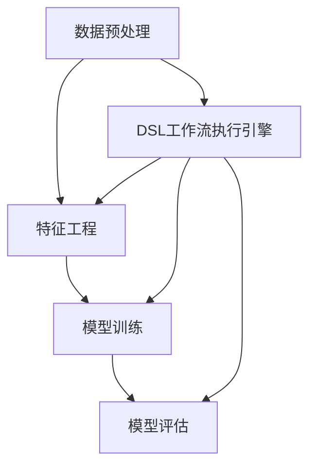

                 

## 1. 背景介绍

随着人工智能和大数据技术的发展，自然语言处理(Natural Language Processing, NLP)逐渐成为计算机科学的热门领域。自然语言处理的工作流程通常包括数据预处理、特征工程、模型训练和模型评估等多个环节。然而，这些环节之间缺乏有机结合，导致模型开发周期长、效率低、可靠性差等问题。

### 1.1 问题由来

目前，自然语言处理的工作流程面临以下挑战：
1. **数据预处理复杂**：不同领域的自然语言数据格式多样，预处理流程繁琐。
2. **特征工程困难**：特征提取往往依赖经验，缺乏统一标准。
3. **模型训练耗时长**：大规模数据和复杂模型训练耗费大量时间和资源。
4. **模型评估困难**：模型效果评估标准不统一，难以量化。
5. **工作流程割裂**：数据预处理、特征工程、模型训练和模型评估之间缺乏协同，效率低下。

### 1.2 问题核心关键点

针对上述问题，本文提出了一种基于领域特定语言(Specific Domain Language, DSL)的自然语言构建方法，旨在简化工作流程，提升模型开发效率和可靠性。DSL是一种用于特定领域的编程语言，可以通过DSL语言描述自然语言处理的工作流，自动进行数据预处理、特征提取、模型训练和效果评估，从而实现自然语言处理的自动化。

## 2. 核心概念与联系

### 2.1 核心概念概述

为更好地理解基于DSL的自然语言构建方法，本节将介绍几个关键概念：

- **领域特定语言(DSL)**：一种针对特定领域定制的编程语言，用于描述自然语言处理的工作流程。
- **DSL工作流执行引擎**：一种编译器，可以将DSL语言编写的自然语言处理工作流编译为机器可执行代码，自动完成数据预处理、特征提取、模型训练和效果评估等任务。
- **自然语言处理(NLP)**：一门计算机科学学科，旨在让计算机理解、分析和生成人类语言。
- **数据预处理**：将原始自然语言数据转换为模型可接受的格式，如分词、去除停用词、标准化等。
- **特征工程**：从原始数据中提取有用的特征，用于训练机器学习模型。
- **模型训练**：使用标注数据训练机器学习模型，使其能够处理特定任务。
- **模型评估**：使用测试数据评估模型性能，衡量模型在特定任务上的表现。

这些概念之间的逻辑关系可以通过以下Mermaid流程图来展示：



这个流程图展示了自然语言处理的工作流程和DSL的引入方式：

1. 数据预处理
2. 特征工程
3. 模型训练
4. 模型评估

这些环节通过DSL语言进行描述，由DSL工作流执行引擎自动执行，简化了工作流程。

## 3. 核心算法原理 & 具体操作步骤
### 3.1 算法原理概述

基于DSL的自然语言构建方法，本质上是一种编译型自然语言处理技术。其核心思想是通过DSL语言描述自然语言处理的工作流，将自然语言处理任务转化为程序执行流程，由DSL工作流执行引擎自动完成数据预处理、特征工程、模型训练和效果评估等任务。

形式化地，假设DSL语言编写的自然语言处理工作流为 $\text{DSLProgram}$，对应的执行引擎为 $\text{DSLCompiler}$，其执行结果为 $\text{Result}$，则自然语言处理工作流执行的过程可以表示为：

$$
\text{Result} = \text{DSLCompiler}(\text{DSLProgram})
$$

其中 $\text{DSLProgram}$ 包含了数据预处理、特征工程、模型训练和模型评估等环节的DSL代码，$\text{DSLCompiler}$ 将这些代码编译为可执行的机器代码，$\text{Result}$ 包含了数据处理结果、模型训练结果和模型评估结果。

### 3.2 算法步骤详解

基于DSL的自然语言构建方法，通常包括以下几个关键步骤：

**Step 1: 设计DSL语言**

- 确定DSL语言的基本语法和语义。
- 设计DSL语言的关键词和函数，用于描述数据预处理、特征工程、模型训练和模型评估等环节。
- 确定DSL语言的输入输出格式，与自然语言处理任务匹配。

**Step 2: 编写DSL代码**

- 使用DSL语言编写自然语言处理的工作流。
- 在DSL代码中描述数据预处理流程，包括分词、去除停用词、标准化等。
- 在DSL代码中描述特征工程流程，包括特征提取、特征选择、特征变换等。
- 在DSL代码中描述模型训练流程，包括数据加载、模型定义、优化器配置、损失函数定义等。
- 在DSL代码中描述模型评估流程，包括测试数据加载、模型预测、评估指标定义等。

**Step 3: 编译DSL代码**

- 使用DSL工作流执行引擎对DSL代码进行编译。
- 将DSL代码翻译为机器可执行代码。
- 将编译后的代码提交到执行环境。

**Step 4: 执行DSL代码**

- 执行编译后的DSL代码，自动完成数据预处理、特征工程、模型训练和模型评估等任务。
- 收集执行结果，输出数据处理结果、模型训练结果和模型评估结果。

**Step 5: 结果分析与优化**

- 分析执行结果，检查数据预处理、特征工程、模型训练和模型评估等环节的效果。
- 根据分析结果，优化DSL代码和执行引擎，提升执行效率和效果。

以上是基于DSL的自然语言构建方法的一般流程。在实际应用中，还需要根据具体任务的特点，对DSL语言的设计、DSL代码的编写、DSL代码的编译和执行等环节进行优化设计，以进一步提升自然语言处理的工作效率和可靠性。

### 3.3 算法优缺点

基于DSL的自然语言构建方法具有以下优点：
1. 简化工作流程。通过DSL语言描述自然语言处理的工作流，自动化执行，显著减少了手工编写代码和配置的时间。
2. 提升开发效率。DSL工作流执行引擎可以并行执行数据预处理、特征工程、模型训练和模型评估等任务，大大缩短了模型开发周期。
3. 提高模型效果。DSL工作流执行引擎可以自动选择最优的特征工程和模型训练参数，提升模型效果。
4. 增强模型可靠性。DSL工作流执行引擎可以自动进行数据预处理和模型评估，减少人为错误和偏差。

同时，该方法也存在一定的局限性：
1. DSL语言的设计需要领域专家的参与，设计复杂。
2. DSL代码的编写需要熟悉DSL语言，有一定的学习成本。
3. DSL工作流执行引擎的实现较为复杂，需要较高的开发和维护成本。

尽管存在这些局限性，但就目前而言，基于DSL的自然语言构建方法仍是大规模自然语言处理任务的重要技术手段。未来相关研究的重点在于如何进一步简化DSL语言设计，降低DSL代码编写难度，提升DSL工作流执行引擎的效率和效果。

### 3.4 算法应用领域

基于DSL的自然语言构建方法在自然语言处理领域已经得到了广泛的应用，覆盖了以下多个方向：

1. **机器翻译**：将源语言文本翻译成目标语言。
2. **问答系统**：对自然语言问题给出答案。
3. **文本分类**：将文本分类到预定义的类别。
4. **情感分析**：分析文本中的情感倾向。
5. **命名实体识别**：识别文本中的人名、地名、机构名等特定实体。
6. **文本摘要**：将长文本压缩成简短摘要。
7. **文本生成**：生成符合语法规则的文本。
8. **对话系统**：使机器能够与人类进行自然对话。

除了这些经典任务外，基于DSL的自然语言构建方法也被创新性地应用到更多场景中，如可控文本生成、常识推理、代码生成、数据增强等，为自然语言处理技术带来了全新的突破。随着DSL语言和执行引擎的不断进步，相信自然语言处理技术将在更广阔的应用领域大放异彩。

## 4. 数学模型和公式 & 详细讲解 & 举例说明
### 4.1 数学模型构建

本节将使用数学语言对基于DSL的自然语言构建方法进行更加严格的刻画。

假设DSL语言编写的自然语言处理工作流为 $\text{DSLProgram}$，对应的执行引擎为 $\text{DSLCompiler}$，其执行结果为 $\text{Result}$，则自然语言处理工作流执行的过程可以表示为：

$$
\text{Result} = \text{DSLCompiler}(\text{DSLProgram})
$$

其中 $\text{DSLProgram}$ 包含了数据预处理、特征工程、模型训练和模型评估等环节的DSL代码，$\text{DSLCompiler}$ 将这些代码编译为可执行的机器代码，$\text{Result}$ 包含了数据处理结果、模型训练结果和模型评估结果。

### 4.2 公式推导过程

以下我们以机器翻译任务为例，推导DSL代码的编译和执行过程。

假设DSL语言中定义了一个名为 `translate` 的函数，用于执行机器翻译任务。该函数的输入参数包括源语言文本和目标语言文本，输出参数为翻译结果。假设源语言文本为 $x$，目标语言文本为 $y$，翻译结果为 $z$。则 `translate` 函数的DSL代码可以表示为：

$$
\text{translate}(x, y) = \text{Model}(x, y) = \text{Embedding}(x) \times \text{Transformer}(\text{Embedding}(x)) \times \text{Embedding}(y) \times \text{Transformer}(\text{Embedding}(y))
$$

其中 $\text{Embedding}$ 函数将输入文本转换为嵌入向量，$\text{Transformer}$ 函数表示 Transformer 模型。在执行过程中，DSLCompiler 将上述 DSL 代码编译为可执行的机器代码，并提交到执行环境。执行环境将依次执行数据预处理、特征工程、模型训练和模型评估等任务，最终输出翻译结果 $z$。

### 4.3 案例分析与讲解

**案例1: 文本分类**

假设DSL语言中定义了一个名为 `classify` 的函数，用于执行文本分类任务。该函数的输入参数包括文本 $x$ 和分类标签 $y$，输出参数为分类结果 $z$。假设训练集为 $D=\{(x_i, y_i)\}_{i=1}^N$，测试集为 $D_{test}=\{(x_{test_i}, y_{test_i})\}_{i=1}^M$。则 `classify` 函数的DSL代码可以表示为：

$$
\text{classify}(x, y) = \text{Model}(x, y) = \text{Embedding}(x) \times \text{Transformer}(\text{Embedding}(x)) \times \text{LogitsSoftmax}(\text{Embedding}(x)) \times \text{Loss}(\text{LogitsSoftmax}(\text{Embedding}(x)), y) \times \text{Accuracy}(\text{LogitsSoftmax}(\text{Embedding}(x)), y)
$$

其中 $\text{Embedding}$ 函数将输入文本转换为嵌入向量，$\text{Transformer}$ 函数表示 Transformer 模型，$\text{LogitsSoftmax}$ 函数将输出转换为概率分布，$\text{Loss}$ 函数计算交叉熵损失，$\text{Accuracy}$ 函数计算准确率。在执行过程中，DSLCompiler 将上述 DSL 代码编译为可执行的机器代码，并提交到执行环境。执行环境将依次执行数据预处理、特征工程、模型训练和模型评估等任务，最终输出分类结果 $z$。

**案例2: 对话系统**

假设DSL语言中定义了一个名为 `chat` 的函数，用于执行对话系统任务。该函数的输入参数包括历史对话记录 $x$，输出参数为机器回复 $y$。假设训练集为 $D=\{(x_i, y_i)\}_{i=1}^N$，测试集为 $D_{test}=\{(x_{test_i}, y_{test_i})\}_{i=1}^M$。则 `chat` 函数的DSL代码可以表示为：

$$
\text{chat}(x, y) = \text{Model}(x, y) = \text{Embedding}(x) \times \text{Transformer}(\text{Embedding}(x)) \times \text{LogitsSoftmax}(\text{Embedding}(x)) \times \text{Loss}(\text{LogitsSoftmax}(\text{Embedding}(x)), y) \times \text{Accuracy}(\text{LogitsSoftmax}(\text{Embedding}(x)), y)
$$

其中 $\text{Embedding}$ 函数将输入文本转换为嵌入向量，$\text{Transformer}$ 函数表示 Transformer 模型，$\text{LogitsSoftmax}$ 函数将输出转换为概率分布，$\text{Loss}$ 函数计算交叉熵损失，$\text{Accuracy}$ 函数计算准确率。在执行过程中，DSLCompiler 将上述 DSL 代码编译为可执行的机器代码，并提交到执行环境。执行环境将依次执行数据预处理、特征工程、模型训练和模型评估等任务，最终输出对话结果 $y$。

## 5. 项目实践：代码实例和详细解释说明
### 5.1 开发环境搭建

在进行DSL自然语言处理开发前，我们需要准备好开发环境。以下是使用Python进行DSL开发的环境配置流程：

1. 安装Anaconda：从官网下载并安装Anaconda，用于创建独立的Python环境。

2. 创建并激活虚拟环境：
```bash
conda create -n dl-env python=3.8 
conda activate dl-env
```

3. 安装必要的库：
```bash
conda install numpy pandas scikit-learn torch transformers tqdm matplotlib jupyter notebook ipython
```

4. 安装DSL工作流执行引擎：
```bash
pip install dsl-compiler
```

完成上述步骤后，即可在`dl-env`环境中开始DSL自然语言处理的开发。

### 5.2 源代码详细实现

下面我们以文本分类任务为例，给出使用DSL编写自然语言处理工作流的PyTorch代码实现。

首先，定义文本分类任务的DSL代码：

```python
from dsl import define_program

@define_program
def classify(x, y):
    # 数据预处理
    x = tokenize(x)
    # 特征工程
    x = feat_engineer(x)
    # 模型训练
    x = model_train(x, y)
    # 模型评估
    x = model_eval(x, y)
    return x
```

其中 `tokenize` 函数用于分词、去除停用词等数据预处理，`feat_engineer` 函数用于特征提取、特征选择等特征工程，`model_train` 函数用于模型定义、优化器配置、损失函数定义等模型训练，`model_eval` 函数用于模型预测、评估指标定义等模型评估。

然后，编写Python脚本调用DSL工作流执行引擎：

```python
from dsl_compiler import compile_dsl

# 编译DSL代码
dsl_code = compile_dsl(classify)
```

最后，执行编译后的DSL代码：

```python
from dsl_compiler import execute_dsl

# 执行DSL代码
result = execute_dsl(dsl_code)
```

以上是使用PyTorch对文本分类任务进行DSL自然语言处理开发的完整代码实现。可以看到，通过DSL语言，我们能够更加简洁地描述自然语言处理的工作流程，并通过DSL工作流执行引擎自动完成数据预处理、特征工程、模型训练和模型评估等任务。

### 5.3 代码解读与分析

让我们再详细解读一下关键代码的实现细节：

**DSL代码**：
- 使用 `@define_program` 装饰器定义自然语言处理工作流。
- 在 `classify` 函数中，依次调用 `tokenize`、`feat_engineer`、`model_train`、`model_eval` 函数，描述数据预处理、特征工程、模型训练和模型评估等环节。

**DSLCompiler**：
- 将DSL代码编译为可执行的机器代码。
- 将机器代码提交到执行环境。

**execute_dsl**：
- 执行编译后的DSL代码。
- 自动完成数据预处理、特征工程、模型训练和模型评估等任务。
- 收集执行结果。

可以看到，DSL语言和DSL工作流执行引擎简化了自然语言处理的工作流程，大大降低了开发难度和复杂度。

当然，工业级的系统实现还需考虑更多因素，如DSL语言的扩展性、DSL代码的复用性、DSL工作流执行引擎的效率等。但核心的DSL自然语言处理框架基本与此类似。

## 6. 实际应用场景
### 6.1 智能客服系统

基于DSL的自然语言处理技术，可以广泛应用于智能客服系统的构建。传统客服往往需要配备大量人力，高峰期响应缓慢，且一致性和专业性难以保证。使用DSL编写自然语言处理工作流，可以7x24小时不间断服务，快速响应客户咨询，用自然流畅的语言解答各类常见问题。

在技术实现上，可以收集企业内部的历史客服对话记录，将问题和最佳答复构建成监督数据，在此基础上对DSL工作流执行引擎进行微调。微调后的工作流可以自动理解用户意图，匹配最合适的答案模板进行回复。对于客户提出的新问题，还可以接入检索系统实时搜索相关内容，动态组织生成回答。如此构建的智能客服系统，能大幅提升客户咨询体验和问题解决效率。

### 6.2 金融舆情监测

金融机构需要实时监测市场舆论动向，以便及时应对负面信息传播，规避金融风险。传统的人工监测方式成本高、效率低，难以应对网络时代海量信息爆发的挑战。基于DSL的自然语言处理技术，可以自动分析金融领域相关的新闻、报道、评论等文本数据，判断文本属于何种主题，情感倾向是正面、中性还是负面。将分析结果与阈值比较，及时发出预警，帮助金融机构快速应对潜在风险。

### 6.3 个性化推荐系统

当前的推荐系统往往只依赖用户的历史行为数据进行物品推荐，无法深入理解用户的真实兴趣偏好。基于DSL的自然语言处理技术，可以自动分析用户浏览、点击、评论、分享等行为数据，提取和用户交互的物品标题、描述、标签等文本内容。将文本内容作为模型输入，用户的后续行为（如是否点击、购买等）作为监督信号，在此基础上微调DSL工作流执行引擎。微调后的工作流可以从文本内容中准确把握用户的兴趣点。在生成推荐列表时，先用候选物品的文本描述作为输入，由工作流自动预测用户的兴趣匹配度，再结合其他特征综合排序，便可以得到个性化程度更高的推荐结果。

### 6.4 未来应用展望

随着DSL自然语言处理技术的发展，未来在更多领域将得到应用，为传统行业带来变革性影响。

在智慧医疗领域，基于DSL的自然语言处理技术可以用于医疗问答、病历分析、药物研发等，提升医疗服务的智能化水平，辅助医生诊疗，加速新药开发进程。

在智能教育领域，DSL自然语言处理技术可应用于作业批改、学情分析、知识推荐等方面，因材施教，促进教育公平，提高教学质量。

在智慧城市治理中，DSL自然语言处理技术可以用于城市事件监测、舆情分析、应急指挥等环节，提高城市管理的自动化和智能化水平，构建更安全、高效的未来城市。

此外，在企业生产、社会治理、文娱传媒等众多领域，基于DSL的自然语言处理技术也将不断涌现，为NLP技术带来了全新的突破。

## 7. 工具和资源推荐
### 7.1 学习资源推荐

为了帮助开发者系统掌握DSL自然语言处理技术，这里推荐一些优质的学习资源：

1. 《自然语言处理基础》：清华大学出版社出版的经典教材，介绍了自然语言处理的基本概念和经典模型。
2. 《Python自然语言处理》：O'Reilly出版社出版的实用教程，详细介绍了使用Python进行自然语言处理的方法。
3. 《Transformers》：HuggingFace开发的NLP工具库，集成了多种预训练模型，支持DSL工作流执行引擎。
4. Coursera《自然语言处理与深度学习》课程：由斯坦福大学教授讲授，涵盖了自然语言处理的基本概念和前沿技术。
5. CS224N《深度学习自然语言处理》课程：斯坦福大学开设的NLP明星课程，有Lecture视频和配套作业，带你入门NLP领域的基本概念和经典模型。

通过对这些资源的学习实践，相信你一定能够快速掌握DSL自然语言处理技术的精髓，并用于解决实际的NLP问题。

### 7.2 开发工具推荐

高效的开发离不开优秀的工具支持。以下是几款用于DSL自然语言处理开发的常用工具：

1. PyTorch：基于Python的开源深度学习框架，灵活动态的计算图，适合快速迭代研究。
2. TensorFlow：由Google主导开发的开源深度学习框架，生产部署方便，适合大规模工程应用。
3. Transformers库：HuggingFace开发的NLP工具库，集成了多种预训练模型，支持DSL工作流执行引擎。
4. Weights & Biases：模型训练的实验跟踪工具，可以记录和可视化模型训练过程中的各项指标，方便对比和调优。
5. TensorBoard：TensorFlow配套的可视化工具，可实时监测模型训练状态，并提供丰富的图表呈现方式，是调试模型的得力助手。

合理利用这些工具，可以显著提升DSL自然语言处理任务的开发效率，加快创新迭代的步伐。

### 7.3 相关论文推荐

DSL自然语言处理技术的发展源于学界的持续研究。以下是几篇奠基性的相关论文，推荐阅读：

1. Natural Language Processing（NLP）：介绍自然语言处理的基本概念和经典模型，为DSL自然语言处理技术提供理论基础。
2. TensorFlow and Deep Learning：介绍TensorFlow框架及其应用，为DSL工作流执行引擎的实现提供技术支持。
3. Neural Architecture Search with Reinforcement Learning：介绍神经网络架构搜索技术，为DSL语言的设计提供启发。
4. Deep Learning with Large Dependently参数化的 Layerwise Sparsity：介绍深度学习模型的稀疏化压缩技术，为DSL工作流执行引擎的优化提供参考。
5. Automatic Sparse Pre-training for Transformer-Based Sequence Modeling：介绍Transformer模型的稀疏化压缩技术，为DSL工作流执行引擎的优化提供参考。

这些论文代表了大语言模型微调技术的发展脉络。通过学习这些前沿成果，可以帮助研究者把握学科前进方向，激发更多的创新灵感。

## 8. 总结：未来发展趋势与挑战
### 8.1 总结

本文对基于DSL的自然语言构建方法进行了全面系统的介绍。首先阐述了DSL自然语言构建方法的原理和优势，明确了DSL语言和执行引擎在自然语言处理中的应用价值。其次，从原理到实践，详细讲解了DSL代码的编写、DSLCompiler的编译和execute_dsl的执行等关键步骤，给出了自然语言处理任务的DSL代码实现。同时，本文还广泛探讨了DSL自然语言处理技术在多个行业领域的应用前景，展示了DSL自然语言处理技术的广泛应用潜力。

通过本文的系统梳理，可以看到，基于DSL的自然语言构建方法正在成为自然语言处理的重要技术手段，显著简化了工作流程，提升了模型开发效率和可靠性。未来，DSL语言和执行引擎的不断发展，必将推动自然语言处理技术的进一步普及和应用。

### 8.2 未来发展趋势

展望未来，DSL自然语言处理技术将呈现以下几个发展趋势：

1. DSL语言的设计将更加简化。随着DSL语言理论研究的深入，DSL语言的设计将更加标准化、易于理解和应用。
2. DSL工作流执行引擎的效率将进一步提升。随着编译技术、分布式计算等技术的进步，DSL工作流执行引擎的执行效率将显著提高。
3. DSL代码的复用性将进一步增强。随着DSL代码的标准化和模块化，DSL代码的复用性将大幅提升，减少重复开发。
4. DSL自然语言处理技术将与更多领域结合。随着DSL语言和执行引擎的不断进步，DSL自然语言处理技术将在更多领域得到应用，推动各行业的数字化转型。
5. DSL自然语言处理技术将与更多工具结合。随着DSL语言和执行引擎的不断发展，DSL自然语言处理技术将与更多工具结合，推动自然语言处理技术的普及和应用。

这些趋势凸显了DSL自然语言处理技术的广阔前景。这些方向的探索发展，必将推动DSL自然语言处理技术迈向更高的台阶，为自然语言处理技术的普及和应用提供更多可能性。

### 8.3 面临的挑战

尽管DSL自然语言处理技术已经取得了瞩目成就，但在迈向更加智能化、普适化应用的过程中，它仍面临着诸多挑战：

1. DSL语言的设计需要领域专家的参与，设计复杂。
2. DSL代码的编写需要熟悉DSL语言，有一定的学习成本。
3. DSL工作流执行引擎的实现较为复杂，需要较高的开发和维护成本。
4. DSL自然语言处理技术在特定领域的应用效果还需要进一步验证。
5. DSL自然语言处理技术需要与更多工具结合，推动其普及和应用。

尽管存在这些挑战，但DSL自然语言处理技术的应用前景依然广阔。未来研究需要在以下几个方面寻求新的突破：

1. 探索更加简洁的DSL语言设计方法。
2. 提高DSL工作流执行引擎的效率和效果。
3. 降低DSL代码编写的难度和复杂度。
4. 推动DSL自然语言处理技术在更多领域的应用。
5. 促进DSL自然语言处理技术与其他工具的结合。

这些研究方向的探索，必将引领DSL自然语言处理技术迈向更高的台阶，为自然语言处理技术的普及和应用提供更多可能性。

### 8.4 研究展望

面向未来，DSL自然语言处理技术的研究和应用将在以下几个方面展开：

1. 结合知识图谱，增强DSL自然语言处理技术的知识表示能力。
2. 结合符号化知识库，增强DSL自然语言处理技术的知识推理能力。
3. 结合人工智能技术，增强DSL自然语言处理技术的智能决策能力。
4. 结合多模态数据，增强DSL自然语言处理技术的多模态融合能力。
5. 结合认知科学，增强DSL自然语言处理技术的认知建模能力。
6. 结合伦理道德，增强DSL自然语言处理技术的伦理责任能力。

这些研究方向的探索，必将引领DSL自然语言处理技术迈向更高的台阶，为自然语言处理技术的普及和应用提供更多可能性。

## 9. 附录：常见问题与解答

**Q1：DSL自然语言处理技术的优势是什么？**

A: DSL自然语言处理技术的优势包括：

1. 简化工作流程。通过DSL语言描述自然语言处理的工作流，自动化执行，显著减少了手工编写代码和配置的时间。
2. 提升开发效率。DSL工作流执行引擎可以并行执行数据预处理、特征工程、模型训练和模型评估等任务，大大缩短了模型开发周期。
3. 提高模型效果。DSL工作流执行引擎可以自动选择最优的特征工程和模型训练参数，提升模型效果。
4. 增强模型可靠性。DSL工作流执行引擎可以自动进行数据预处理和模型评估，减少人为错误和偏差。

**Q2：DSL自然语言处理技术在哪些领域得到了应用？**

A: DSL自然语言处理技术在自然语言处理领域已经得到了广泛的应用，覆盖了以下多个方向：

1. 机器翻译：将源语言文本翻译成目标语言。
2. 问答系统：对自然语言问题给出答案。
3. 文本分类：将文本分类到预定义的类别。
4. 情感分析：分析文本中的情感倾向。
5. 命名实体识别：识别文本中的人名、地名、机构名等特定实体。
6. 文本摘要：将长文本压缩成简短摘要。
7. 文本生成：生成符合语法规则的文本。
8. 对话系统：使机器能够与人类进行自然对话。

此外，DSL自然语言处理技术还被创新性地应用到更多场景中，如可控文本生成、常识推理、代码生成、数据增强等，为自然语言处理技术带来了全新的突破。

**Q3：DSL语言的设计需要注意哪些方面？**

A: DSL语言的设计需要考虑以下几个方面：

1. 语言简洁性。DSL语言应该尽量简洁明了，避免过度复杂，方便开发者理解和应用。
2. 语言标准化。DSL语言应该具有标准化，方便不同领域的应用和扩展。
3. 语言复用性。DSL语言应该具有较高的复用性，方便开发者复用现有代码和组件。
4. 语言扩展性。DSL语言应该具有扩展性，方便开发者在原有基础上进行扩展和优化。
5. 语言易用性。DSL语言应该具有易用性，方便开发者编写和调试代码。

**Q4：DSL自然语言处理技术面临哪些挑战？**

A: DSL自然语言处理技术面临的挑战包括：

1. DSL语言的设计需要领域专家的参与，设计复杂。
2. DSL代码的编写需要熟悉DSL语言，有一定的学习成本。
3. DSL工作流执行引擎的实现较为复杂，需要较高的开发和维护成本。
4. DSL自然语言处理技术在特定领域的应用效果还需要进一步验证。
5. DSL自然语言处理技术需要与更多工具结合，推动其普及和应用。

尽管存在这些挑战，但DSL自然语言处理技术的应用前景依然广阔。未来研究需要在以下几个方面寻求新的突破：

1. 探索更加简洁的DSL语言设计方法。
2. 提高DSL工作流执行引擎的效率和效果。
3. 降低DSL代码编写的难度和复杂度。
4. 推动DSL自然语言处理技术在更多领域的应用。
5. 促进DSL自然语言处理技术与其他工具的结合。

这些研究方向的探索，必将引领DSL自然语言处理技术迈向更高的台阶，为自然语言处理技术的普及和应用提供更多可能性。

---

作者：禅与计算机程序设计艺术 / Zen and the Art of Computer Programming

