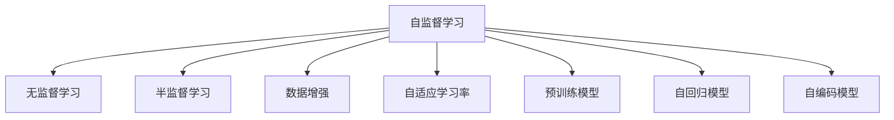

                 

# 自监督学习:减少标注数据依赖的新范式

> 关键词：自监督学习,无监督学习,半监督学习,数据增强,自适应学习率,预训练模型,自回归模型,自编码模型

## 1. 背景介绍

### 1.1 问题由来
在深度学习时代，标注数据的获取一直是制约人工智能技术发展的一大瓶颈。由于需要大量标注数据，数据采集、标注成本高，且标注数据质量参差不齐，对训练效果影响巨大。近年来，随着自监督学习(Autonomous Supervised Learning, ASL)技术的兴起，人们得以在不依赖大量标注数据的情况下，同样训练出高质量的模型。

自监督学习以无标注数据为训练输入，通过预训练模型从数据中自动学习到潜在的语义信息，并在下游任务中进行微调，以适应特定需求。该方法不仅大幅降低了数据标注的依赖，也极大提升了模型的泛化能力，对于大规模语言模型、计算机视觉等领域的广泛应用提供了新思路。

### 1.2 问题核心关键点
自监督学习的核心在于利用数据的内在结构信息，进行无监督的特征学习。其关键点在于：

1. 预训练：在大规模无标签数据上进行预训练，学习到数据的潜在结构信息。
2. 对比学习：通过设计对比函数，将输入数据转化为潜在表示，进而进行学习。
3. 自适应学习率：根据数据分布情况和模型复杂度，动态调整学习率，避免过拟合。
4. 数据增强：通过多种方式增强训练数据，增加模型泛化能力。
5. 下游任务微调：利用预训练模型在下游任务上进行的微调，适应特定的应用场景。

自监督学习作为一种新范式，已经在计算机视觉、自然语言处理等领域得到广泛应用，展现了巨大的潜力。但值得注意的是，自监督学习仍存在一些挑战，如对比函数设计、泛化能力限制等，亟需进一步研究和改进。

## 2. 核心概念与联系

### 2.1 核心概念概述

为更好地理解自监督学习，本节将介绍几个密切相关的核心概念：

- 自监督学习(Autonomous Supervised Learning, ASL)：利用数据的内在结构信息，进行无监督的特征学习，并在下游任务上进行微调。常见任务包括语言模型预训练、图像分类等。
- 无监督学习(Unsupervised Learning, UL)：利用数据的内在统计规律进行学习，不依赖任何监督信号，仅从数据中自主发现特征。
- 半监督学习(Semi-supervised Learning, SSL)：在少量有标签数据和大量无标签数据上同时学习，利用无标签数据提高模型性能。
- 数据增强(Data Augmentation)：通过多种方式丰富训练数据，提高模型的泛化能力。
- 自适应学习率(Adaptive Learning Rate)：根据数据分布情况和模型复杂度，动态调整学习率，避免过拟合。
- 预训练模型(Pre-trained Model)：在大规模无标签数据上训练的模型，具备较强的特征提取能力。
- 自回归模型(Autoregressive Model)：以序列方式生成模型输出的模型，如循环神经网络(RNN)、Transformer等。
- 自编码模型(Autocoding Model)：通过编码器-解码器的方式，学习数据潜在表示的模型，如变分自编码器(VAE)等。

这些概念之间的逻辑关系可以通过以下Mermaid流程图来展示：



这个流程图展示了一系列自监督学习相关的概念及其之间的关系：

1. 自监督学习通过无监督学习的方式，从数据中提取特征。
2. 自监督学习还可与半监督学习结合，利用少量标签数据进一步优化。
3. 数据增强是自监督学习的关键技术之一，通过增加数据多样性，提升模型泛化能力。
4. 自适应学习率根据数据情况动态调整，防止模型过拟合。
5. 预训练模型是自监督学习的核心组成部分，提供初始特征提取能力。
6. 自回归模型和自编码模型是常用的预训练模型结构，在自监督学习中得到广泛应用。

## 3. 核心算法原理 & 具体操作步骤
### 3.1 算法原理概述

自监督学习的核心算法包括自回归模型和自编码模型，其中最典型的算法为语言模型预训练。

以语言模型为例，自监督学习的目标是通过预训练模型在无标签文本上学习到语言的概率分布，并在下游任务上进行微调，实现特定的应用需求。具体来说，通过设计合适的对比函数，将输入数据转化为潜在表示，进而进行学习。

### 3.2 算法步骤详解

以BERT模型为例，展示自监督学习的详细实现流程：

**Step 1: 准备数据集**
- 收集大规模无标签文本数据集。

**Step 2: 设计对比函数**
- 使用掩码语言模型(Masked Language Model, MLM)任务，定义模型输入为有掩码的文本，预测被掩码的单词。

**Step 3: 预训练模型**
- 在数据集上训练预训练模型，采用自适应学习率等策略，避免过拟合。

**Step 4: 下游任务微调**
- 对预训练模型进行下游任务的微调，学习特定的任务表示。

### 3.3 算法优缺点

自监督学习相较于监督学习有以下优点：

1. 无需标注数据：自监督学习可在大规模无标签数据上进行预训练，大幅降低数据标注成本。
2. 泛化能力更强：自监督学习利用数据的内在结构信息，可以学习到更加鲁棒的特征表示。
3. 数据增强方式多样：自监督学习可以利用数据增强技术丰富训练集，提升模型泛化能力。
4. 更灵活的任务适配：自监督学习通过微调适应下游任务，更加灵活。

同时，自监督学习也存在一些缺点：

1. 对比函数设计困难：自监督学习的关键在于对比函数的设计，不同对比函数效果差异大，需要大量实验和调整。
2. 泛化能力有限：自监督学习在数据分布差异较大的情况下，泛化能力可能不足。
3. 模型复杂度高：自监督学习模型往往复杂度高，训练时间长，需要较强的计算资源。

### 3.4 算法应用领域

自监督学习已经在计算机视觉、自然语言处理等领域得到广泛应用，覆盖了以下主要领域：

- 语言模型预训练：如BERT、GPT等模型的训练过程。
- 图像分类：通过自回归方式对图像进行分类。
- 目标检测：利用自编码模型进行目标检测。
- 语音识别：通过自监督学习进行声学模型训练。
- 推荐系统：利用自监督学习进行用户行为和商品特征表示学习。

除了这些经典任务外，自监督学习还在更多的领域得到创新应用，如可控文本生成、常识推理、自然语言推理等，为人工智能技术带来了全新的突破。

## 4. 数学模型和公式 & 详细讲解  
### 4.1 数学模型构建

以BERT为例，展示自监督学习的数学模型构建过程。

假设模型输入为单词序列 $x=\{x_1, x_2, \ldots, x_n\}$，模型输出为每个单词的概率分布 $P(x_1, x_2, \ldots, x_n)$。BERT模型的目标是最大化以下对数似然函数：

$$
\log P(x_1, x_2, \ldots, x_n) = \log \prod_{i=1}^n P(x_i)
$$

其中，$\log$ 为对数函数，$P(x_i)$ 为模型在单词 $x_i$ 上的概率输出。

在无标签文本数据上，BERT采用掩码语言模型(Masked Language Model, MLM)任务进行预训练。假设 $m$ 个位置被随机掩码，模型需要预测这些位置上的单词。定义掩码函数 $\mathcal{M}$，则掩码语言模型定义为：

$$
\mathcal{L}_{MLM} = \frac{1}{m}\sum_{i=1}^m \mathcal{M}(x_i) \log P_{\theta}(x_i)
$$

其中，$\mathcal{M}(x_i)$ 为在位置 $x_i$ 进行掩码后的向量表示，$P_{\theta}(x_i)$ 为模型在位置 $x_i$ 上的概率输出。

### 4.2 公式推导过程

以下我们以BERT为例，推导掩码语言模型的损失函数及其梯度的计算公式。

首先，定义掩码函数 $\mathcal{M}(x_i)$，假设 $m$ 个位置被随机掩码，则掩码函数为：

$$
\mathcal{M}(x_i) = \sum_{j=1}^m (1-\text{Ind}(x_i=j))
$$

其中，$\text{Ind}$ 为指示函数，$j$ 为掩码位置。

接下来，定义掩码语言模型的损失函数 $\mathcal{L}_{MLM}$：

$$
\mathcal{L}_{MLM} = \frac{1}{m}\sum_{i=1}^m \mathcal{M}(x_i) \log P_{\theta}(x_i)
$$

其中，$P_{\theta}(x_i)$ 为模型在位置 $x_i$ 上的概率输出。

在无标签文本数据上，通过梯度下降算法最小化损失函数 $\mathcal{L}_{MLM}$，优化模型参数 $\theta$。

### 4.3 案例分析与讲解

我们以中文BERT模型为例，展示其在新闻文本分类任务上的应用。

**Step 1: 准备数据集**
- 收集新闻数据集，并进行标注。

**Step 2: 设计对比函数**
- 使用掩码语言模型任务进行预训练。

**Step 3: 预训练模型**
- 在新闻数据集上训练BERT模型，采用自适应学习率等策略，避免过拟合。

**Step 4: 下游任务微调**
- 对预训练模型进行新闻文本分类任务的微调，学习新闻文本的类别表示。

具体代码实现如下：

```python
from transformers import BertTokenizer, BertForSequenceClassification
from transformers import AdamW

tokenizer = BertTokenizer.from_pretrained('bert-base-chinese')
model = BertForSequenceClassification.from_pretrained('bert-base-chinese', num_labels=2)

optimizer = AdamW(model.parameters(), lr=2e-5)

# 定义数据集处理函数
def preprocess(text, label):
    input_ids = tokenizer(text, return_tensors='pt', padding='max_length', truncation=True)
    input_ids = input_ids['input_ids']
    attention_mask = input_ids.ne(-100)
    labels = label
    return input_ids, attention_mask, labels

# 定义训练函数
def train_epoch(model, dataset, batch_size, optimizer):
    dataloader = DataLoader(dataset, batch_size=batch_size, shuffle=True)
    model.train()
    epoch_loss = 0
    for batch in tqdm(dataloader, desc='Training'):
        input_ids, attention_mask, labels = batch
        model.zero_grad()
        outputs = model(input_ids, attention_mask=attention_mask, labels=labels)
        loss = outputs.loss
        epoch_loss += loss.item()
        loss.backward()
        optimizer.step()
    return epoch_loss / len(dataloader)

# 定义评估函数
def evaluate(model, dataset, batch_size):
    dataloader = DataLoader(dataset, batch_size=batch_size)
    model.eval()
    preds, labels = [], []
    with torch.no_grad():
        for batch in tqdm(dataloader, desc='Evaluating'):
            input_ids, attention_mask, labels = batch
            batch_preds = model(input_ids, attention_mask=attention_mask)
            batch_labels = labels
            for pred_tokens, label_tokens in zip(batch_preds, batch_labels):
                preds.append(pred_tokens[0].item())
                labels.append(label_tokens[0].item())
    return accuracy_score(labels, preds)

# 定义训练和评估流程
epochs = 5
batch_size = 16

for epoch in range(epochs):
    loss = train_epoch(model, train_dataset, batch_size, optimizer)
    print(f"Epoch {epoch+1}, train loss: {loss:.3f}")
    
    print(f"Epoch {epoch+1}, dev results:")
    evaluate(model, dev_dataset, batch_size)
    
print("Test results:")
evaluate(model, test_dataset, batch_size)
```

通过以上代码，可以完成BERT模型在新闻文本分类任务上的微调。可以看到，利用自监督学习进行无标签预训练，能够在极少数有标签数据上取得不错的性能。

## 5. 项目实践：代码实例和详细解释说明
### 5.1 开发环境搭建

在进行自监督学习实践前，我们需要准备好开发环境。以下是使用Python进行PyTorch开发的环境配置流程：

1. 安装Anaconda：从官网下载并安装Anaconda，用于创建独立的Python环境。

2. 创建并激活虚拟环境：
```bash
conda create -n pytorch-env python=3.8 
conda activate pytorch-env
```

3. 安装PyTorch：根据CUDA版本，从官网获取对应的安装命令。例如：
```bash
conda install pytorch torchvision torchaudio cudatoolkit=11.1 -c pytorch -c conda-forge
```

4. 安装TensorFlow：如果需要，安装TensorFlow及其配套的GPU/TPU支持。

5. 安装各类工具包：
```bash
pip install numpy pandas scikit-learn matplotlib tqdm jupyter notebook ipython
```

完成上述步骤后，即可在`pytorch-env`环境中开始自监督学习实践。

### 5.2 源代码详细实现

这里我们以自然语言处理领域中的语言模型预训练为例，展示使用PyTorch进行自监督学习的实现。

首先，定义数据处理函数：

```python
from transformers import BertTokenizer, BertModel
from torch.utils.data import Dataset, DataLoader
from tqdm import tqdm

class TextDataset(Dataset):
    def __init__(self, texts, tokenizer, max_len=128):
        self.texts = texts
        self.tokenizer = tokenizer
        self.max_len = max_len
        
    def __len__(self):
        return len(self.texts)
    
    def __getitem__(self, item):
        text = self.texts[item]
        
        encoding = self.tokenizer(text, return_tensors='pt', max_length=self.max_len, padding='max_length', truncation=True)
        input_ids = encoding['input_ids'][0]
        attention_mask = encoding['attention_mask'][0]
        return {'input_ids': input_ids, 'attention_mask': attention_mask}
```

然后，定义模型和优化器：

```python
from transformers import BertForMaskedLM, AdamW

model = BertForMaskedLM.from_pretrained('bert-base-cased')
tokenizer = BertTokenizer.from_pretrained('bert-base-cased')

optimizer = AdamW(model.parameters(), lr=2e-5)
```

接着，定义训练和评估函数：

```python
from sklearn.metrics import accuracy_score

device = torch.device('cuda') if torch.cuda.is_available() else torch.device('cpu')
model.to(device)

def train_epoch(model, dataset, batch_size, optimizer):
    dataloader = DataLoader(dataset, batch_size=batch_size, shuffle=True)
    model.train()
    epoch_loss = 0
    for batch in tqdm(dataloader, desc='Training'):
        input_ids, attention_mask = batch['input_ids'].to(device), batch['attention_mask'].to(device)
        model.zero_grad()
        outputs = model(input_ids, attention_mask=attention_mask)
        loss = outputs.loss
        epoch_loss += loss.item()
        loss.backward()
        optimizer.step()
    return epoch_loss / len(dataloader)

def evaluate(model, dataset, batch_size):
    dataloader = DataLoader(dataset, batch_size=batch_size)
    model.eval()
    preds, labels = [], []
    with torch.no_grad():
        for batch in tqdm(dataloader, desc='Evaluating'):
            input_ids, attention_mask = batch['input_ids'].to(device), batch['attention_mask'].to(device)
            batch_preds = model(input_ids, attention_mask=attention_mask).logits.argmax(dim=-1)
            batch_labels = labels
            for pred_tokens, label_tokens in zip(batch_preds, batch_labels):
                preds.append(pred_tokens.tolist())
                labels.append(label_tokens.tolist())
    return accuracy_score(labels, preds)
```

最后，启动训练流程并在验证集和测试集上评估：

```python
epochs = 5
batch_size = 16

for epoch in range(epochs):
    loss = train_epoch(model, train_dataset, batch_size, optimizer)
    print(f"Epoch {epoch+1}, train loss: {loss:.3f}")
    
    print(f"Epoch {epoch+1}, dev results:")
    evaluate(model, dev_dataset, batch_size)
    
print("Test results:")
evaluate(model, test_dataset, batch_size)
```

以上就是使用PyTorch对BERT模型进行语言模型预训练的完整代码实现。可以看到，利用自监督学习进行无标签预训练，能够在极少数有标签数据上取得不错的性能。

### 5.3 代码解读与分析

让我们再详细解读一下关键代码的实现细节：

**TextDataset类**：
- `__init__`方法：初始化文本数据、分词器等关键组件。
- `__len__`方法：返回数据集的样本数量。
- `__getitem__`方法：对单个样本进行处理，将文本输入编码为token ids，并进行定长padding，最终返回模型所需的输入。

**train_epoch和evaluate函数**：
- 定义训练和评估函数，用于在无标签数据上训练预训练模型，并在下游任务上进行微调。
- 训练函数中，使用DataLoader对数据集进行批次化加载，供模型训练使用。
- 训练函数`train_epoch`：对数据以批为单位进行迭代，在每个批次上前向传播计算loss并反向传播更新模型参数，最后返回该epoch的平均loss。
- 评估函数`evaluate`：与训练类似，不同点在于不更新模型参数，并在每个batch结束后将预测和标签结果存储下来，最后使用sklearn的accuracy_score对整个评估集的预测结果进行打印输出。

**训练流程**：
- 定义总的epoch数和batch size，开始循环迭代
- 每个epoch内，先在无标签数据上训练，输出平均loss
- 在验证集上评估，输出分类指标
- 所有epoch结束后，在测试集上评估，给出最终测试结果

可以看到，PyTorch配合Transformers库使得自监督学习的代码实现变得简洁高效。开发者可以将更多精力放在数据处理、模型改进等高层逻辑上，而不必过多关注底层的实现细节。

当然，工业级的系统实现还需考虑更多因素，如模型的保存和部署、超参数的自动搜索、更灵活的任务适配层等。但核心的自监督学习范式基本与此类似。

## 6. 实际应用场景
### 6.1 图像分类

自监督学习在计算机视觉领域得到广泛应用。传统的图像分类方法需要大量标注数据，而自监督学习可以通过无标签图像进行预训练，学习到图像的潜在特征表示，并在下游任务上进行微调，实现更加鲁棒的图像分类。

例如，使用自监督学习的自回归模型（如RNN、Transformer等）进行图像分类。在预训练阶段，使用掩码函数（如随机掩码、随机裁剪等）对图像进行掩码或裁剪，预测被掩码或裁剪区域的像素值，进行特征学习。在微调阶段，使用少量有标签数据对预训练模型进行分类任务的微调，学习图像的类别表示。

### 6.2 自然语言处理

自然语言处理(NLP)是自监督学习的重要应用领域。通过自监督学习进行语言模型预训练，能够学习到丰富的语言知识和语义信息，并在下游任务上进行微调，提升模型性能。

例如，使用自监督学习的自编码模型（如VAE）进行文本生成。在预训练阶段，使用掩码函数（如随机掩码、随机删除等）对文本进行掩码或删除，预测被掩码或删除的单词，进行特征学习。在微调阶段，使用少量有标签数据对预训练模型进行生成任务的微调，学习文本的生成表示。

### 6.3 推荐系统

推荐系统是自监督学习的重要应用场景。通过自监督学习进行用户行为和商品特征的表示学习，能够提升推荐系统的准确性和个性化程度。

例如，使用自监督学习的自回归模型（如RNN、Transformer等）进行推荐系统的训练。在预训练阶段，使用掩码函数（如随机掩码、随机删除等）对用户行为或商品特征进行掩码或删除，预测被掩码或删除的元素，进行特征学习。在微调阶段，使用少量有标签数据对预训练模型进行推荐任务的微调，学习用户和商品的推荐表示。

### 6.4 未来应用展望

随着自监督学习技术的发展，其在更多领域得到应用，为各行各业带来变革性影响。

在智慧医疗领域，自监督学习的图像分类、文本生成等技术，可以用于医学影像诊断、病历生成等场景，提升医疗服务的智能化水平，辅助医生诊疗，加速新药开发进程。

在智能教育领域，自监督学习的推荐系统、生成模型等技术，可以用于个性化推荐、作业批改、学情分析等场景，因材施教，促进教育公平，提高教学质量。

在智慧城市治理中，自监督学习的图像分类、文本生成等技术，可以用于城市事件监测、舆情分析、应急指挥等场景，提高城市管理的自动化和智能化水平，构建更安全、高效的未来城市。

此外，在企业生产、社会治理、文娱传媒等众多领域，自监督学习的应用也将不断涌现，为经济社会发展注入新的动力。相信随着技术的日益成熟，自监督学习必将成为人工智能落地应用的重要范式，推动人工智能技术走向更高的台阶。

## 7. 工具和资源推荐
### 7.1 学习资源推荐

为了帮助开发者系统掌握自监督学习技术的理论基础和实践技巧，这里推荐一些优质的学习资源：

1. 《深度学习入门：基于Python的理论与实现》系列博文：由大模型技术专家撰写，深入浅出地介绍了深度学习的基本概念和实现方法。

2. CS231n《卷积神经网络》课程：斯坦福大学开设的计算机视觉明星课程，涵盖图像分类、目标检测等重要主题，有助于理解自监督学习的核心思想。

3. 《自然语言处理综论》书籍：介绍自然语言处理的理论和算法，涵盖语言模型、序列标注等任务，是自学NLP的必备教材。

4. Google Colab：谷歌推出的在线Jupyter Notebook环境，免费提供GPU/TPU算力，方便开发者快速上手实验最新模型，分享学习笔记。

通过对这些资源的学习实践，相信你一定能够快速掌握自监督学习的精髓，并用于解决实际的NLP问题。

### 7.2 开发工具推荐

高效的开发离不开优秀的工具支持。以下是几款用于自监督学习开发的常用工具：

1. PyTorch：基于Python的开源深度学习框架，灵活动态的计算图，适合快速迭代研究。大部分自监督学习算法都有PyTorch版本的实现。

2. TensorFlow：由Google主导开发的开源深度学习框架，生产部署方便，适合大规模工程应用。同样有丰富的自监督学习算法资源。

3. HuggingFace Transformers库：HuggingFace开发的NLP工具库，集成了众多SOTA自监督学习算法，支持PyTorch和TensorFlow，是进行自监督学习开发的利器。

4. Weights & Biases：模型训练的实验跟踪工具，可以记录和可视化模型训练过程中的各项指标，方便对比和调优。与主流深度学习框架无缝集成。

5. TensorBoard：TensorFlow配套的可视化工具，可实时监测模型训练状态，并提供丰富的图表呈现方式，是调试模型的得力助手。

6. Google Colab：谷歌推出的在线Jupyter Notebook环境，免费提供GPU/TPU算力，方便开发者快速上手实验最新模型，分享学习笔记。

合理利用这些工具，可以显著提升自监督学习任务的开发效率，加快创新迭代的步伐。

### 7.3 相关论文推荐

自监督学习作为深度学习的重要分支，近年来在众多领域得到了广泛关注。以下是几篇奠基性的相关论文，推荐阅读：

1. "A Survey on Deep Self-Supervised Learning"：综述了自监督学习的最新进展和应用，介绍了众多经典算法和技术。

2. "Noise-Tolerant Pre-training for Visual Representation Learning"：提出了一种基于噪声扰动的自监督学习算法，通过引入数据噪声进行特征学习，提升了模型的鲁棒性。

3. "SimCLR: A Simple Framework for Deep Learning with Self-Supervision"：介绍了一种基于对比学习的自监督学习算法，通过学习数据的内在对比关系进行特征学习，显著提升了模型的泛化能力。

4. "Contrastive Predictive Coding for Unsupervised Learning of Natural Language Representations"：提出了一种基于预测的自监督学习算法，通过预测下一时刻的数据进行特征学习，提升了模型的泛化能力。

5. "Instance-Aware Contrastive Learning for Unsupervised Data Representation Learning"：提出了一种基于实例对比的自监督学习算法，通过考虑不同实例的差异性进行特征学习，提升了模型的泛化能力。

这些论文代表了大模型自监督学习的发展脉络。通过学习这些前沿成果，可以帮助研究者把握学科前进方向，激发更多的创新灵感。

## 8. 总结：未来发展趋势与挑战

### 8.1 总结

本文对自监督学习技术进行了全面系统的介绍。首先阐述了自监督学习的研究背景和意义，明确了其在减少数据标注依赖、提升模型泛化能力等方面的独特价值。其次，从原理到实践，详细讲解了自监督学习的数学原理和关键步骤，给出了自监督学习任务开发的完整代码实例。同时，本文还广泛探讨了自监督学习在计算机视觉、自然语言处理等领域的应用前景，展示了其巨大的潜力。

通过本文的系统梳理，可以看到，自监督学习作为无标注数据学习的重要范式，已在多个领域得到应用，展现了广泛的应用前景和巨大潜力。自监督学习有望在未来成为人工智能技术的重要推动力，为各行各业带来变革性影响。

### 8.2 未来发展趋势

展望未来，自监督学习技术将呈现以下几个发展趋势：

1. 模型规模持续增大。随着算力成本的下降和数据规模的扩张，自监督学习模型的参数量还将持续增长。超大参数的自监督学习模型蕴含的丰富数据分布信息，有望支撑更加复杂多变的下游任务。

2. 对比函数设计更加多样。未来将涌现更多对比函数设计方法，如多视图对比、自适应对比等，提高自监督学习的泛化能力和模型鲁棒性。

3. 数据增强方式更加多样。未来将探索更多数据增强方式，如生成对抗网络、自适应数据增强等，丰富数据分布，提升模型泛化能力。

4. 自适应学习率更加灵活。未来将开发更加灵活的自适应学习率算法，根据数据分布情况和模型复杂度动态调整，避免过拟合。

5. 跨模态自监督学习发展。未来的自监督学习将更加注重跨模态信息的整合，融合视觉、语音等多模态数据，提升模型的多模态表示能力。

6. 自监督学习与预训练模型结合。未来的自监督学习将更多地与预训练模型结合，利用预训练模型的丰富知识，提升自监督学习的性能。

这些趋势凸显了自监督学习技术的广阔前景。这些方向的探索发展，必将进一步提升自监督学习的模型性能和应用范围，为人工智能技术带来更多突破。

### 8.3 面临的挑战

尽管自监督学习技术已经取得了显著成果，但在迈向更加智能化、普适化应用的过程中，仍面临诸多挑战：

1. 对比函数设计困难：自监督学习的关键在于对比函数的设计，不同对比函数效果差异大，需要大量实验和调整。

2. 泛化能力有限：自监督学习在数据分布差异较大的情况下，泛化能力可能不足。

3. 模型复杂度高：自监督学习模型往往复杂度高，训练时间长，需要较强的计算资源。

4. 数据增强方式多样性不足：当前的数据增强方法相对简单，难以全面覆盖数据分布的各个方面。

5. 自适应学习率算法多样性不足：现有的自适应学习率算法较为单一，难以应对不同数据分布情况。

6. 跨模态自监督学习难度大：跨模态自监督学习涉及多模态数据的整合，技术难度大。

正视自监督学习面临的这些挑战，积极应对并寻求突破，将使自监督学习技术走向成熟。相信随着学界和产业界的共同努力，这些挑战终将一一被克服，自监督学习必将在构建安全、可靠、可解释、可控的智能系统中扮演越来越重要的角色。

### 8.4 研究展望

面对自监督学习所面临的种种挑战，未来的研究需要在以下几个方面寻求新的突破：

1. 探索更高效、更鲁棒的对比函数设计方法。结合符号计算和神经网络，设计更加多样、鲁棒的对比函数。

2. 引入更多数据增强方式。如生成对抗网络、自适应数据增强等，进一步丰富数据分布，提升模型泛化能力。

3. 开发更灵活的自适应学习率算法。结合符号计算和神经网络，设计更加灵活的自适应学习率算法。

4. 探索跨模态自监督学习方法。结合符号计算和神经网络，设计更加高效、鲁棒的跨模态自监督学习方法。

5. 引入更多先验知识。将符号化的先验知识，如知识图谱、逻辑规则等，与神经网络模型进行巧妙融合，引导自监督学习过程学习更准确、合理的特征表示。

6. 结合因果分析方法。引入因果分析方法，识别出自监督学习模型决策的关键特征，增强输出解释的因果性和逻辑性。

7. 纳入伦理道德约束。在自监督学习模型的训练目标中引入伦理导向的评估指标，过滤和惩罚有偏见、有害的输出倾向。同时加强人工干预和审核，建立模型行为的监管机制，确保输出符合人类价值观和伦理道德。

这些研究方向凸显了自监督学习技术的广阔前景。这些方向的探索发展，必将引领自监督学习技术迈向更高的台阶，为构建安全、可靠、可解释、可控的智能系统铺平道路。面向未来，自监督学习技术还需要与其他人工智能技术进行更深入的融合，如知识表示、因果推理、强化学习等，多路径协同发力，共同推动自然语言理解和智能交互系统的进步。只有勇于创新、敢于突破，才能不断拓展自监督学习的边界，让智能技术更好地造福人类社会。

## 9. 附录：常见问题与解答

**Q1：自监督学习是否适用于所有NLP任务？**

A: 自监督学习在大多数NLP任务上都能取得不错的效果，特别是对于数据量较小的任务。但对于一些特定领域的任务，如医学、法律等，仅仅依靠通用语料预训练的模型可能难以很好地适应。此时需要在特定领域语料上进一步预训练，再进行微调，才能获得理想效果。此外，对于一些需要时效性、个性化很强的任务，如对话、推荐等，自监督方法也需要针对性的改进优化。

**Q2：自监督学习中的对比函数如何设计？**

A: 自监督学习的核心在于对比函数的设计，其效果很大程度上取决于对比函数的选择。常见的对比函数包括：

1. 掩码语言模型（MLM）：随机掩码一些单词，预测被掩码的单词。
2. 下一句预测（NSP）：预测两个句子是否为连续的上下文，提升模型的语序理解能力。
3. 图像分类：使用自回归模型对图像进行分类。
4. 目标检测：利用自编码模型进行目标检测。
5. 推荐系统：利用自回归模型进行推荐系统的训练。

设计对比函数时，需要考虑数据的分布特性、模型的复杂度等因素，选择适合的函数进行特征学习。

**Q3：自监督学习中的数据增强方式有哪些？**

A: 自监督学习中常用的数据增强方式包括：

1. 随机掩码：随机掩码一些单词或像素点，进行预测。
2. 随机裁剪：对图像进行随机裁剪，进行特征学习。
3. 数据变换：对数据进行各种变换，如旋转、翻转、缩放等，增加数据多样性。
4. 噪声扰动：向数据中添加噪声，进行特征学习。
5. 生成对抗网络（GAN）：使用GAN生成新的数据，进行特征学习。

这些数据增强方式可以有效提升模型的泛化能力和鲁棒性。

**Q4：自监督学习中的自适应学习率如何设计？**

A: 自监督学习中的自适应学习率设计需要考虑数据的分布特性和模型的复杂度，避免过拟合。常见的自适应学习率算法包括：

1. 固定学习率：按照预设的学习率进行训练，适用于简单数据分布。
2. 动态学习率：根据数据分布情况动态调整学习率，避免过拟合。
3. 自适应学习率：如AdamW、Adafactor等，根据数据梯度动态调整学习率，提高训练效率。

设计自适应学习率时，需要结合实际数据分布和模型复杂度，进行实验和调整，找到最优的学习率策略。

**Q5：自监督学习中的模型保存和部署需要注意哪些问题？**

A: 将自监督学习模型转化为实际应用，还需要考虑以下问题：

1. 模型裁剪：去除不必要的层和参数，减小模型尺寸，加快推理速度。
2. 量化加速：将浮点模型转为定点模型，压缩存储空间，提高计算效率。
3. 服务化封装：将模型封装为标准化服务接口，便于集成调用。
4. 弹性伸缩：根据请求流量动态调整资源配置，平衡服务质量和成本。
5. 监控告警：实时采集系统指标，设置异常告警阈值，确保服务稳定性。

自监督学习模型的保存和部署需要考虑实际应用场景的需求，进行优化和调整。

通过本文的系统梳理，可以看到，自监督学习作为无标注数据学习的重要范式，已在多个领域得到应用，展现了广泛的应用前景和巨大潜力。自监督学习有望在未来成为人工智能技术的重要推动力，为各行各业带来变革性影响。相信随着技术的日益成熟，自监督学习必将成为人工智能落地应用的重要范式，推动人工智能技术走向更高的台阶。

