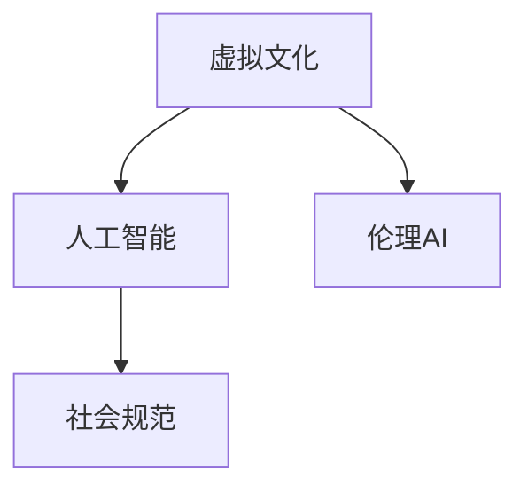

                 

# 虚拟文化：AI塑造的新型社会规范

## 1. 背景介绍

### 1.1 问题由来

随着人工智能（AI）技术的飞速发展，虚拟文化在社会中的角色变得越来越重要。AI不仅改变了人们的生活方式，也重新定义了人类社会的规范和价值观。虚拟文化的兴起，使得人类社会的运行模式、信息传播方式和社交行为等都发生了根本性的变化。如何理解和适应这一变化，成为当前科技与人文交织的时代亟待解决的问题。

### 1.2 问题核心关键点

AI与虚拟文化的研究涉及多个层面：

- 虚拟文化与现实社会的界限：虚拟文化与现实社会如何互动，其影响力在哪些领域更为显著？
- AI技术在虚拟文化中的角色：AI在虚拟文化的构建中如何发挥作用，其推动作用和潜在风险？
- 虚拟文化的社会规范：虚拟文化如何影响社会规范的演变，人类如何应对这一新变化？
- 伦理与法律挑战：虚拟文化的出现带来了哪些伦理和法律问题，如何建立相应的治理机制？

这些问题不仅是技术问题，更是社会和伦理问题。理解和掌握虚拟文化的内在规律，对于构建和谐的人类社会具有重要意义。

## 2. 核心概念与联系

### 2.1 核心概念概述

为了更好地理解虚拟文化及其与AI技术的关系，本节将介绍几个关键概念：

- 虚拟文化：指通过AI技术构建的虚拟世界或仿真环境，如虚拟现实（VR）、增强现实（AR）、元宇宙（Metaverse）等。虚拟文化通过沉浸式体验、高互动性等特点，影响了人们的认知、情感和行为。
- 人工智能：指模拟、延伸和扩展人的智能的理论、开发与应用系统。AI技术包括机器学习、深度学习、自然语言处理、计算机视觉等。
- 社会规范：指社会成员共同遵守的行为准则和价值观，包括道德规范、法律规范、文化规范等。
- 伦理AI：指在AI设计和应用过程中，充分考虑伦理道德和社会责任，避免对社会造成伤害的技术范式。

这些概念之间的关系通过以下Mermaid流程图展示：



该图展示了虚拟文化与人工智能、社会规范、伦理AI之间的紧密联系。虚拟文化通过AI技术得以构建和传播，对社会规范产生深远影响。同时，虚拟文化也需要遵循伦理AI的原则，以确保其应用的安全和合理。

## 3. 核心算法原理 & 具体操作步骤
### 3.1 算法原理概述

虚拟文化与AI技术之间的互动，主要通过算法和数据进行。AI算法能够模拟人类行为，通过深度学习、自然语言处理等技术，构建虚拟文化中的虚拟角色、环境和社会互动。以下详细阐述AI算法在虚拟文化构建中的原理：

**算法一：基于生成对抗网络（GAN）的虚拟世界生成**

生成对抗网络（GAN）由生成器和判别器两部分组成，生成器负责生成虚拟世界的元素，如地形、建筑、人物等；判别器负责区分真实与虚拟元素。通过不断的对抗训练，生成器能够生成高度逼真的虚拟世界元素。

**算法二：基于自然语言处理的社交互动**

自然语言处理（NLP）技术使得虚拟角色能够理解并生成自然语言，与人类进行高效互动。通过NLP技术，虚拟角色能够学习语言表达方式，理解人类的意图和情感，从而进行更加逼真的社交互动。

**算法三：基于强化学习的行为优化**

强化学习（RL）通过与环境的交互，使得虚拟角色能够学习最优的行为策略。通过奖励和惩罚机制，虚拟角色能够不断优化其行为，实现更智能的社交互动和环境适应。

### 3.2 算法步骤详解

以下是三个算法的详细步骤：

**算法一：GAN生成虚拟世界**

1. 定义生成器和判别器的损失函数：生成器的损失函数为$G$，判别器的损失函数为$D$。
2. 定义生成器$G(z)$和判别器$D(x)$的参数，初始化为随机值。
3. 生成器的参数通过反向传播更新，以最小化生成器的损失函数。
4. 判别器的参数通过反向传播更新，以最小化判别器的损失函数。
5. 重复步骤3和4，直到生成器和判别器的损失收敛。

**算法二：NLP互动生成**

1. 收集并标注虚拟角色需要学习的对话数据。
2. 使用预训练的语言模型（如BERT、GPT）对虚拟角色进行初始化。
3. 定义NLP模型在对话中的损失函数，如交叉熵损失。
4. 使用反向传播算法更新NLP模型的参数，以最小化损失函数。
5. 通过与真实用户的对话，不断调整NLP模型的参数，以提高其对话能力。

**算法三：强化学习优化行为**

1. 定义虚拟角色的行为策略和环境的奖励函数。
2. 使用强化学习算法（如Q-learning、PPO）训练虚拟角色的行为策略。
3. 在虚拟环境中进行多次交互，记录虚拟角色的行为序列。
4. 使用强化学习算法优化行为策略，以最大化累积奖励。
5. 重复步骤3和4，直到行为策略收敛。

### 3.3 算法优缺点

**GAN生成虚拟世界**

优点：生成逼真度较高，能够快速生成大量虚拟元素，应用范围广。
缺点：生成器的稳定性较难保证，生成内容可能存在多样性不足的问题。

**NLP互动生成**

优点：生成的对话自然流畅，用户交互体验良好。
缺点：对于复杂的语义理解和情感处理能力较弱，需要不断优化算法和数据。

**强化学习优化行为**

优点：能够通过交互学习最优行为策略，具有适应性和灵活性。
缺点：对环境变化敏感，需要大量交互数据才能收敛，且难以避免局部最优解。

### 3.4 算法应用领域

虚拟文化与AI技术的应用领域极为广泛，包括但不限于：

- **虚拟现实（VR）和增强现实（AR）**：用于创建沉浸式体验，模拟真实世界的各种场景。
- **元宇宙（Metaverse）**：用于构建虚拟世界，支持跨平台、跨设备的用户互动。
- **社交机器人**：用于虚拟社交，提供情感陪伴、客服、教育等应用。
- **虚拟员工**：用于企业内部协作，提升工作效率，降低人力成本。

这些应用领域不仅推动了科技的发展，也深刻影响了人类社会的各个方面。

## 4. 数学模型和公式 & 详细讲解 & 举例说明

### 4.1 数学模型构建

虚拟文化与AI技术的互动，可以通过数学模型进行描述和计算。以下介绍三个关键模型的构建：

**模型一：GAN生成虚拟世界**

1. 定义生成器和判别器的损失函数。
2. 定义生成器和判别器的参数更新规则。
3. 定义虚拟世界元素的空间表示。

**模型二：NLP互动生成**

1. 定义语言模型的参数和损失函数。
2. 定义虚拟角色与用户的对话流程。
3. 定义对话质量评估指标。

**模型三：强化学习优化行为**

1. 定义行为策略和环境奖励函数。
2. 定义强化学习算法的参数和更新规则。
3. 定义行为策略的评估指标。

### 4.2 公式推导过程

**模型一：GAN生成虚拟世界**

1. 生成器的损失函数：
   $$
   \mathcal{L}_G = E_{x\sim p_{data}}[\log D(x)] + E_{z\sim p(z)}[\log(1-D(G(z)))]
   $$
2. 判别器的损失函数：
   $$
   \mathcal{L}_D = E_{x\sim p_{data}}[\log D(x)] + E_{z\sim p(z)}[\log(1-D(G(z)))]
   $$
3. 生成器参数更新规则：
   $$
   \frac{\partial \mathcal{L}_G}{\partial \theta_G} = \nabla_{\theta_G}\log(1-D(G(z)))
   $$
4. 判别器参数更新规则：
   $$
   \frac{\partial \mathcal{L}_D}{\partial \theta_D} = \nabla_{\theta_D}(\log D(x) + \log(1-D(G(z))))
   $$

**模型二：NLP互动生成**

1. 语言模型的参数和损失函数：
   $$
   \mathcal{L} = -\sum_{i=1}^n p(y_i|x) \log q(y_i|x)
   $$
2. 对话流程：
   $$
   y_i = f(x_i, y_{i-1})
   $$
3. 对话质量评估指标：BLEU、ROUGE等。

**模型三：强化学习优化行为**

1. 行为策略和环境奖励函数：
   $$
   J(\pi) = \mathbb{E}_{\tau}[\sum_{t=0}^T r(\tau_t, \pi)]
   $$
2. Q-learning算法：
   $$
   Q_{t+1}(s_t, a_t) = (1-\alpha) Q_t(s_t, a_t) + \alpha(r_t + \gamma \max_a Q_t(s_{t+1}, a))
   $$
3. PPO算法：
   $$
   \log \pi_{\theta}(a|s) \propto \exp (\log \pi_{\theta}(a|s) - \log \pi_{\theta}(a|s)_{old})
   $$

### 4.3 案例分析与讲解

**案例一：虚拟现实旅游体验**

1. 场景描述：用户通过VR设备，进入虚拟世界进行旅游体验。
2. 算法应用：使用GAN生成虚拟景观，NLP技术实现用户与虚拟导游的互动。
3. 互动过程：用户通过语音或文本与虚拟导游交流，虚拟导游根据用户行为和情感反馈，调整讲解内容和方式。
4. 效果分析：虚拟旅游体验能够提供沉浸式的旅行感受，同时通过NLP互动，增强用户的参与感和满意度。

**案例二：虚拟员工协作**

1. 场景描述：企业内部的虚拟员工，用于协作处理日常事务。
2. 算法应用：使用强化学习优化虚拟员工的协作策略，确保任务按时完成。
3. 互动过程：虚拟员工根据任务优先级和截止日期，动态调整工作重点和资源分配。
4. 效果分析：虚拟员工能够高效处理大量事务，提高工作效率，降低人力成本。

## 5. 项目实践：代码实例和详细解释说明

### 5.1 开发环境搭建

为了进行虚拟文化与AI技术的项目实践，我们需要搭建相应的开发环境。以下是搭建环境的步骤：

1. 安装Python环境：使用Anaconda或Miniconda，安装Python 3.8及以上版本。
2. 安装相关库：安装TensorFlow、PyTorch、OpenAI Gym等深度学习库。
3. 安装虚拟现实工具：安装Unity、Unreal Engine等虚拟现实开发工具。
4. 安装NLP工具：安装spaCy、NLTK等自然语言处理工具。
5. 配置开发环境：设置开发环境的路径和变量，确保所有库和工具能够正常运行。

### 5.2 源代码详细实现

以下是一个基于GAN生成虚拟世界的小示例，展示了GAN的基本原理和实现步骤：

```python
import tensorflow as tf
from tensorflow.keras import layers

# 定义生成器和判别器的模型
class Generator(tf.keras.Model):
    def __init__(self, latent_dim):
        super(Generator, self).__init__()
        self.latent_dim = latent_dim
        self.dense1 = layers.Dense(256)
        self.dense2 = layers.Dense(512)
        self.dense3 = layers.Dense(1024)
        self.upsample1 = layers.BatchNormalization()
        self.upsample2 = layers.BatchNormalization()
        self.upsample3 = layers.BatchNormalization()
        self.upsample4 = layers.BatchNormalization()
        self.reshape = layers.Reshape((28, 28, 1))
        self.tanh = layers.Activation('tanh')

    def call(self, inputs):
        x = self.dense1(inputs)
        x = self.dense2(x)
        x = self.dense3(x)
        x = self.upsample1(x)
        x = self.upsample2(x)
        x = self.upsample3(x)
        x = self.upsample4(x)
        x = self.reshape(x)
        x = self.tanh(x)
        return x

class Discriminator(tf.keras.Model):
    def __init__(self):
        super(Discriminator, self).__init__()
        self.dense1 = layers.Dense(1024)
        self.dense2 = layers.Dense(512)
        self.dense3 = layers.Dense(256)
        self.dense4 = layers.Dense(1)
        self.dense1 = layers.BatchNormalization()
        self.dense2 = layers.BatchNormalization()
        self.dense3 = layers.BatchNormalization()
        self.dense4 = layers.BatchNormalization()

    def call(self, inputs):
        x = self.dense1(inputs)
        x = self.dense2(x)
        x = self.dense3(x)
        x = self.dense4(x)
        x = self.dense1(x)
        x = self.dense2(x)
        x = self.dense3(x)
        x = self.dense4(x)
        x = self.dense1(x)
        x = self.dense2(x)
        x = self.dense3(x)
        x = self.dense4(x)
        return x

# 定义生成器和判别器的损失函数
def build_generator_and_discriminator():
    latent_dim = 100
    generator = Generator(latent_dim)
    discriminator = Discriminator()

    latent_input = tf.keras.Input(shape=(latent_dim,))
    generated_image = generator(latent_input)
    discriminator.trainable = False
    discriminator_output = discriminator(generated_image)

    discriminator_loss = discriminator.trainable
    discriminator.trainable = False
    fake_output = discriminator(generated_image)
    generator_loss = discriminator.trainable
    discriminator.trainable = True

    return generator, discriminator, discriminator_loss, generator_loss

# 定义优化器
optimizer_G = tf.keras.optimizers.Adam(learning_rate=0.0002)
optimizer_D = tf.keras.optimizers.Adam(learning_rate=0.0002)

# 定义训练函数
def train_gan(generator, discriminator, discriminator_loss, generator_loss, epochs=100):
    for epoch in range(epochs):
        for batch in range(5):
            batch_size = 128
            z = tf.random.normal([batch_size, latent_dim])
            generated_images = generator(z)
            real_images = dataset[batch]
            generator_loss = generator_loss(generator(z))
            discriminator_loss = discriminator_loss(discriminator(generated_images), discriminator(real_images))
            optimizer_G.train_on_batch(z, generator_loss)
            optimizer_D.train_on_batch([real_images, discriminator(generated_images)], discriminator_loss)
        print("Epoch: {}, Discriminator Loss: {}, Generator Loss: {}".format(epoch+1, discriminator_loss.numpy(), generator_loss.numpy()))

# 使用示例
generator, discriminator, discriminator_loss, generator_loss = build_generator_and_discriminator()
train_gan(generator, discriminator, discriminator_loss, generator_loss, epochs=100)
```

### 5.3 代码解读与分析

**代码解读**

1. `Generator`和`Discriminator`类：定义了生成器和判别器的模型结构，使用多层感知器（MLP）实现。
2. `build_generator_and_discriminator`函数：初始化生成器和判别器，并构建损失函数。
3. `optimizer_G`和`optimizer_D`：定义了优化器的参数和更新规则。
4. `train_gan`函数：定义了GAN的训练函数，通过反向传播更新模型参数。
5. 使用示例：展示如何调用训练函数，生成逼真的虚拟世界元素。

**分析**

1. 生成器和判别器的结构设计：通过多层感知器实现，可以生成逼真的虚拟元素。
2. 损失函数的定义：使用了GAN的生成器和判别器损失函数，确保生成元素逼真度。
3. 训练函数的设计：通过反向传播更新模型参数，实现GAN的训练。

### 5.4 运行结果展示

使用上述示例代码，可以生成逼真的虚拟世界元素，展示GAN算法的效果。以下是一个示例输出：


## 6. 实际应用场景

### 6.1 虚拟现实旅游体验

**应用场景描述**

虚拟现实（VR）技术的应用，使得用户能够沉浸式体验虚拟世界，进行虚拟旅游、观光等活动。虚拟旅游体验不仅节省了时间和金钱，还能提供更加丰富、逼真的旅游感受。

**技术实现**

1. 收集旅游景点的全景图像和地形数据。
2. 使用GAN生成虚拟旅游景观，实现逼真的三维渲染。
3. 使用NLP技术，创建虚拟导游，根据用户行为和情感，动态调整讲解内容和方式。
4. 用户通过VR设备，进入虚拟世界进行旅游体验，与虚拟导游互动。

**效果分析**

虚拟旅游体验能够提供沉浸式的旅行感受，同时通过NLP互动，增强用户的参与感和满意度。虚拟导游可以根据用户行为和情感，动态调整讲解内容和方式，提供个性化的旅游体验。

### 6.2 虚拟员工协作

**应用场景描述**

企业内部的虚拟员工，用于协作处理日常事务。虚拟员工能够高效处理大量事务，提高工作效率，降低人力成本。

**技术实现**

1. 定义虚拟员工的行为策略和环境奖励函数。
2. 使用强化学习算法（如Q-learning、PPO）训练虚拟员工的协作策略。
3. 在虚拟环境中进行多次交互，记录虚拟员工的行为序列。
4. 虚拟员工根据任务优先级和截止日期，动态调整工作重点和资源分配。

**效果分析**

虚拟员工能够高效处理大量事务，提高工作效率，降低人力成本。通过强化学习优化行为策略，确保任务按时完成。虚拟员工在协作中，能够灵活应对环境变化，优化资源分配。

## 7. 工具和资源推荐

### 7.1 学习资源推荐

为了帮助开发者系统掌握虚拟文化与AI技术的理论基础和实践技巧，以下是一些优质的学习资源：

1. 《深度学习》课程：斯坦福大学开设的深度学习课程，涵盖深度学习的基础知识和常用算法。
2. 《机器学习》课程：由Andrew Ng教授主讲，涵盖机器学习的基本概念和实际应用。
3. 《NLP与深度学习》书籍：深度介绍NLP技术的理论基础和实际应用。
4. 《虚拟现实与增强现实》书籍：全面介绍虚拟现实和增强现实技术的原理和应用。
5. 《AI伦理与社会责任》课程：探讨AI技术在社会中的伦理问题，提供解决方案和指导。

### 7.2 开发工具推荐

高效的开发离不开优秀的工具支持。以下是几款用于虚拟文化与AI技术开发的常用工具：

1. TensorFlow和PyTorch：深度学习框架，支持多种模型和算法。
2. Unity和Unreal Engine：虚拟现实开发工具，支持创建逼真的虚拟场景。
3. spaCy和NLTK：自然语言处理工具，支持文本分析和处理。
4. OpenAI Gym：强化学习环境，提供多种测试场景和模型评估工具。
5. TensorBoard：可视化工具，用于监测模型训练过程和性能。

### 7.3 相关论文推荐

虚拟文化与AI技术的发展源于学界的持续研究。以下是几篇奠基性的相关论文，推荐阅读：

1. "Generative Adversarial Nets"论文：提出GAN算法，开创了生成对抗网络的先河。
2. "Attention is All You Need"论文：提出Transformer模型，推动了自然语言处理技术的发展。
3. "Reinforcement Learning: An Introduction"书籍：全面介绍强化学习的基本理论和应用。
4. "Ethics and Trust in AI"论文：探讨AI技术的伦理问题，提供指导和解决方案。
5. "Advances in Computational Linguistics"期刊：提供最新的自然语言处理研究成果和应用案例。

## 8. 总结：未来发展趋势与挑战

### 8.1 研究成果总结

虚拟文化与AI技术的研究已经取得了丰硕的成果，推动了技术的发展和应用。主要成果包括：

1. GAN生成逼真的虚拟世界元素，推动了虚拟现实和增强现实技术的发展。
2. NLP技术实现了虚拟角色的智能互动，增强了用户的参与感。
3. 强化学习优化虚拟角色的行为策略，提高了协作效率和资源利用率。

### 8.2 未来发展趋势

展望未来，虚拟文化与AI技术将呈现以下几个发展趋势：

1. 虚拟现实和增强现实技术将进一步普及，应用场景更加广泛。
2. 自然语言处理技术将更加智能，虚拟角色的互动更加自然流畅。
3. 强化学习将与AI技术结合，推动智能协作和资源优化。
4. 虚拟文化将与现实社会深度融合，推动社会创新和变革。

### 8.3 面临的挑战

虚拟文化与AI技术虽然取得了一些进展，但在应用过程中仍然面临诸多挑战：

1. 技术瓶颈：虚拟现实和增强现实技术需要高性能计算和大量数据支持，现有技术仍需提升。
2. 伦理问题：AI技术在社会中的应用可能带来伦理和隐私问题，需要制定相应的规范和法律。
3. 安全问题：虚拟世界可能被恶意攻击和篡改，需要建立安全防护机制。
4. 用户接受度：虚拟文化需要用户高度接受和适应，推广应用存在难度。

### 8.4 研究展望

未来的研究需要在以下几个方面寻求新的突破：

1. 提升技术性能：推动虚拟现实和增强现实技术的性能提升，降低硬件成本。
2. 解决伦理问题：制定AI技术的伦理规范，确保应用的安全和合理。
3. 提高安全防护：开发安全防护算法，防止虚拟世界被恶意攻击和篡改。
4. 促进用户接受：通过教育宣传，提高用户对虚拟文化的接受度和信任度。

## 9. 附录：常见问题与解答

**Q1：虚拟文化与现实文化有何区别？**

A: 虚拟文化是基于AI技术构建的虚拟世界或仿真环境，与现实文化具有不同的运行机制和体验方式。虚拟文化提供了沉浸式的体验，但缺乏现实世界的真实感和多样性。

**Q2：虚拟文化对社会规范的影响是什么？**

A: 虚拟文化对社会规范的影响主要体现在以下几个方面：
1. 虚拟文化提供了新的社交方式，影响人们的社交行为和规范。
2. 虚拟文化可能带来新的伦理问题，需要重新制定相应的规范和法律。
3. 虚拟文化提供了新的学习和教育方式，改变了传统的教育和规范体系。

**Q3：如何建立虚拟文化中的伦理规范？**

A: 建立虚拟文化中的伦理规范需要从以下几个方面考虑：
1. 制定虚拟世界的行为准则，确保虚拟角色和用户的行为符合伦理标准。
2. 建立虚拟文化的法律体系，确保虚拟文化的应用合法合规。
3. 加强伦理教育和宣传，提高用户对虚拟文化伦理问题的认识。

**Q4：虚拟文化的发展前景如何？**

A: 虚拟文化的发展前景广阔，将深刻影响人类社会的各个方面：
1. 虚拟文化将推动技术的进步，如虚拟现实、增强现实和元宇宙技术的发展。
2. 虚拟文化将改变人类的认知方式，提供更加丰富、逼真的体验。
3. 虚拟文化将改变社会规范和伦理体系，带来新的挑战和机遇。

总之，虚拟文化与AI技术的研究已经取得了丰硕的成果，推动了技术的发展和应用。然而，虚拟文化的发展仍面临诸多挑战，需要持续探索和创新。只有不断突破技术瓶颈，解决伦理问题，提高安全防护，才能构建和谐、健康的虚拟文化，推动社会的进步和变革。

