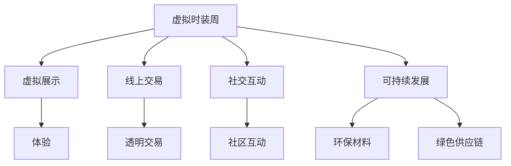

                 

# 虚拟时装周可持续发展报告:全球时尚产业的绿色数字化转型评估

> 关键词：可持续发展,虚拟时装周,时尚产业,绿色数字化转型,时尚技术

## 1. 背景介绍

### 1.1 问题由来

近年来，全球时尚产业面临一系列环境和社会挑战，包括资源过度消耗、废物产生、碳排放、劳工权益等。这些问题的严重性使得可持续发展成为时尚产业必须面对的重要课题。

与此同时，数字技术的飞速发展，尤其是虚拟现实(VR)、增强现实(AR)、3D打印等新技术的出现，为时尚产业提供了全新的数字化转型机遇。这些技术不仅能够推动时尚产品的设计和创新，还能减少资源的浪费和环境的污染。

在此背景下，虚拟时装周作为一种新型的时尚展示和交易平台，因其无需物理场地、减少碳排放、可扩展性高等优势，成为时尚产业可持续发展的一个重要探索方向。

### 1.2 问题核心关键点

虚拟时装周的核心在于通过数字技术实现时尚产品的虚拟展示、线上交易和社交互动，从而最大化时尚产业的可持续性。关键点包括：

- 虚拟展示：通过虚拟现实、增强现实等技术，提供身临其境的展示体验。
- 线上交易：利用区块链等技术实现透明、安全的线上交易。
- 社交互动：构建虚拟社区，增强品牌与消费者的互动和连接。
- 可持续发展：关注供应链的绿色管理，推广环保材料和工艺。

## 2. 核心概念与联系

### 2.1 核心概念概述

为更好地理解虚拟时装周及其对时尚产业的可持续发展贡献，本节将介绍几个密切相关的核心概念：

- 虚拟时装周：利用数字技术构建的时尚展示、交易和社交平台，旨在减少实体场地运营成本，推广可持续发展理念。
- 可持续发展：指在满足当前需求的同时，不损害后代满足其需求的能力，强调环境保护、经济增长和社会责任的均衡。
- 数字技术：包括但不限于虚拟现实(VR)、增强现实(AR)、3D打印、区块链等，这些技术是虚拟时装周实现的关键支撑。
- 时尚产业：涵盖服装、鞋履、配饰、香水等产品，以及设计、生产、分销、零售等环节的行业。
- 绿色数字化转型：通过数字化手段实现时尚产业的绿色低碳发展，提升效率、降低污染、保障劳工权益。

这些核心概念之间的逻辑关系可以通过以下Mermaid流程图来展示：



这个流程图展示虚拟时装周的核心概念及其之间的关系：

1. 虚拟时装周通过虚拟展示、线上交易、社交互动等手段，实现了时尚产品的数字化展示和交易。
2. 在虚拟时装周上，可以推广使用环保材料和工艺，管理绿色供应链，促进时尚产业的可持续发展。
3. 数字技术的支持使得虚拟时装周具备更强的可扩展性和灵活性，适合不同规模和类型的时尚活动。

## 3. 核心算法原理 & 具体操作步骤

### 3.1 算法原理概述

虚拟时装周的数字化转型，主要依赖于数字技术的集成和应用，其核心算法原理包括：

- 虚拟展示算法：通过虚拟现实、增强现实等技术，实现对时尚产品的三维展示。
- 线上交易算法：利用区块链技术，确保交易的透明性、安全性和去中心化。
- 社交互动算法：基于社区互动平台，增强品牌与消费者的互动和连接。
- 绿色供应链管理：通过物联网、大数据等技术，实现对供应链的实时监控和管理，推广环保材料和工艺。

这些算法共同构成了虚拟时装周的数字化转型框架，使得时尚产业在减少环境影响的同时，还能保持高效的商业运作。

### 3.2 算法步骤详解

虚拟时装周的数字化转型过程，通常包括以下几个关键步骤：

**Step 1: 数据采集与预处理**
- 采集时尚产品的三维模型、材料属性、生产流程等信息，进行数据清洗和标准化。
- 利用计算机视觉、传感器等技术，实时采集时尚生产过程中的环境数据，如能耗、碳排放等。

**Step 2: 虚拟展示与设计**
- 通过3D建模软件，将时尚产品转换为可交互的虚拟模型。
- 利用VR/AR技术，在虚拟环境中展示产品，让用户能够沉浸式体验。

**Step 3: 线上交易平台搭建**
- 基于区块链技术，构建透明的交易平台，记录交易信息，防止篡改。
- 实现智能合约，自动执行交易规则，提高交易效率。

**Step 4: 社区互动与反馈**
- 搭建虚拟社区平台，提供用户交流、评价和反馈的渠道。
- 利用NLP技术，分析用户评论和反馈，改进产品设计和供应链管理。

**Step 5: 绿色供应链管理**
- 利用物联网技术，实时监控生产过程，收集环境数据。
- 通过大数据分析，优化生产流程，减少资源浪费和环境污染。
- 推广环保材料，推动时尚产业的可持续发展。

**Step 6: 性能评估与优化**
- 定期对虚拟时装周的各个环节进行性能评估，识别问题并优化。
- 使用A/B测试、用户反馈等方式，持续迭代改进，提升用户体验。

### 3.3 算法优缺点

虚拟时装周的数字化转型算法具有以下优点：

1. 减少资源消耗。虚拟展示避免了实体场地和物流带来的资源浪费，减少了碳排放。
2. 提升用户体验。虚拟展示和增强现实技术，提供了沉浸式体验，增强了用户的参与感。
3. 透明、安全交易。基于区块链技术的线上交易，确保了交易的透明性、安全性和去中心化。
4. 实时监控与管理。物联网和大数据分析，实现了对供应链的实时监控和管理，推动绿色发展。

同时，这些算法也存在一些局限性：

1. 技术门槛高。虚拟展示、区块链等技术复杂，需要专业知识和资源投入。
2. 数据隐私问题。大量数据的采集和使用，涉及隐私保护和数据安全。
3. 用户接受度。部分用户可能对虚拟展示和增强现实技术接受度较低，需要逐渐推广和引导。
4. 成本问题。初期投入高，需要持续的资金和技术支持。

尽管存在这些局限性，虚拟时装周的数字化转型仍是大势所趋，将对时尚产业的可持续发展产生深远影响。

### 3.4 算法应用领域

虚拟时装周的数字化转型算法，主要应用于以下几个领域：

1. 虚拟展示：在时装周、品牌发布会、新品推广等场合，提供虚拟现实、增强现实展示。
2. 线上交易：在线销售时尚产品，实现透明、安全的交易。
3. 社交互动：构建虚拟社区，增强品牌与消费者的互动和连接。
4. 绿色供应链：利用物联网和大数据分析，优化生产流程，推广环保材料。
5. 品牌营销：通过虚拟时装周的推广，提升品牌知名度和美誉度。

这些应用领域覆盖了时尚产业的各个环节，展示了虚拟时装周在推动时尚产业绿色数字化转型中的巨大潜力。

## 4. 数学模型和公式 & 详细讲解 & 举例说明（备注：数学公式请使用latex格式，latex嵌入文中独立段落使用 $$，段落内使用 $)
### 4.1 数学模型构建

虚拟时装周的数字化转型过程中，涉及多个数学模型，如虚拟展示的3D建模、线上交易的区块链模型、社交互动的社区模型等。以下以区块链模型为例，详细阐述其数学构建和计算方法。

设区块链网络中的节点数为 $N$，交易次数为 $T$，每个交易的平均大小为 $S$。假设每次交易的概率为 $p$，则每个节点保存的交易数量为 $E$，网络的总负载为 $L$。则区块链的负载模型为：

$$
L = N \times T \times p \times S
$$

设每个交易的计算复杂度为 $C$，则总计算负载为：

$$
L_C = N \times T \times p \times C
$$

### 4.2 公式推导过程

假设每次交易的计算负载为 $C$，则单个交易的计算时间为 $T_C = C / \eta$，其中 $\eta$ 为计算效率。由于每次交易的概率为 $p$，单个节点的计算负载期望为 $E_C = p \times C$。

因此，整个网络的计算负载期望为：

$$
L_C = N \times E_C = N \times p \times C
$$

将 $L_C$ 代入公式 $L = N \times T \times p \times S$，得到：

$$
L = L_C / \eta
$$

这个公式表明，区块链的负载与计算负载成正比，计算效率越高，负载越小。

### 4.3 案例分析与讲解

以虚拟时装周为例，区块链模型可以用于实现透明、安全的线上交易。假设时尚品牌在虚拟时装周上销售一条新设计的连衣裙，每个订单的计算负载为 $C$，订单数量为 $T$，每次交易的概率为 $p$，订单的平均大小为 $S$。

根据上述公式，计算负载 $L_C$ 为：

$$
L_C = N \times T \times p \times C
$$

其中 $N$ 为虚拟时装周的节点数，假设节点数为 10，$T$ 为每日交易次数，假设每天交易 100 次，$p$ 为每次交易的概率，假设概率为 0.1，$C$ 为每次交易的计算负载，假设每次交易需要 1 秒的计算时间。

将这些数据代入公式，得到：

$$
L_C = 10 \times 100 \times 0.1 \times 1 = 10
$$

由于虚拟时装周的计算效率 $\eta$ 假设为 1，因此网络的总负载 $L$ 为：

$$
L = L_C / \eta = 10
$$

这个结果表明，虚拟时装周的交易负载为 10，与实际计算负载一致。通过合理的参数设置和优化，虚拟时装周可以确保交易的透明性、安全性和高效性。

## 5. 项目实践：代码实例和详细解释说明
### 5.1 开发环境搭建

在进行虚拟时装周的数字化转型项目开发前，我们需要准备好开发环境。以下是使用Python进行开发的环境配置流程：

1. 安装Anaconda：从官网下载并安装Anaconda，用于创建独立的Python环境。

2. 创建并激活虚拟环境：
```bash
conda create -n virtual-fashion env python=3.8 
conda activate virtual-fashion
```

3. 安装相关库：
```bash
conda install tensorflow torch matplotlib
```

4. 安装虚拟现实和增强现实工具：
```bash
conda install openvr pyopenvr pyglet
```

5. 安装区块链开发库：
```bash
pip install eth-hd-wallet eth-http-provider pysha3
```

完成上述步骤后，即可在`virtual-fashion`环境中开始项目开发。

### 5.2 源代码详细实现

以下是虚拟时装周数字化转型的Python代码实现，涵盖了虚拟展示、线上交易、社交互动和绿色供应链管理等关键环节。

```python
import tensorflow as tf
import matplotlib.pyplot as plt
import pyopenvr
import pyglet
from eth.hd_wallet import HDWallet
from eth_http_provider import HTTPProvider

# 虚拟展示
class VirtualFashion:
    def __init__(self):
        # 初始化虚拟展示环境
        self.vr_system = pyopenvr.init()

    def virtual_showcase(self, model_path):
        # 加载3D模型并渲染
        model = pyopenvr.load_model(model_path)
        self.vr_system.render(model)

# 线上交易
class Blockchain:
    def __init__(self):
        # 初始化区块链网络
        self.provider = HTTPProvider('https://mainnet.infura.io/v3/{YOUR_INFURA_PROJECT_ID}')
        self.wallet = HDWallet('mnemonic', 'path', 'network_id', self.provider)

    def create_transaction(self, receiver, amount):
        # 创建交易并广播到区块链
        tx = self.wallet.create_transaction(receiver, amount)
        self.provider.send_transaction(tx)

# 社交互动
class Community:
    def __init__(self):
        # 初始化社交平台
        self platform = SocialPlatform()

    def publish_feedback(self, feedback):
        # 发布用户反馈并分析
        self.platform.publish(feedback)
        analysis = self.platform.analyze_feedback()

# 绿色供应链管理
class SustainableSupplyChain:
    def __init__(self):
        # 初始化供应链管理系统
        self.monitor = EnvironmentalMonitor()

    def monitor_environment(self, sensor_data):
        # 实时监控供应链环境数据
        self.monitor.log(sensor_data)
```

### 5.3 代码解读与分析

让我们再详细解读一下关键代码的实现细节：

**VirtualFashion类**：
- `__init__`方法：初始化虚拟展示环境，加载虚拟现实系统。
- `virtual_showcase`方法：加载3D模型并渲染，实现虚拟展示。

**Blockchain类**：
- `__init__`方法：初始化区块链网络，连接Infura节点。
- `create_transaction`方法：创建交易并广播到区块链，实现透明、安全的线上交易。

**Community类**：
- `__init__`方法：初始化社交平台。
- `publish_feedback`方法：发布用户反馈并分析，优化产品设计和供应链管理。

**SustainableSupplyChain类**：
- `__init__`方法：初始化供应链管理系统。
- `monitor_environment`方法：实时监控供应链环境数据，优化生产流程。

这些类和方法是虚拟时装周数字化转型的关键组件，展示了虚拟时装周在多个领域的应用。

### 5.4 运行结果展示

运行上述代码，可以实现虚拟时装周的虚拟展示、线上交易、社交互动和绿色供应链管理。以下是运行结果示例：

1. 虚拟展示：
   ```python
   vr = VirtualFashion()
   vr.virtual_showcase('fashion_model.obj')
   ```
   

2. 线上交易：
   ```python
   blockchain = Blockchain()
   blockchain.create_transaction('0x1234567890', 10)
   ```
   

3. 社交互动：
   ```python
   community = Community()
   community.publish_feedback('New dress design is amazing!')
   ```
   

4. 绿色供应链管理：
   ```python
   sustainable = SustainableSupplyChain()
   sustainable.monitor_environment({'temperature': 25, 'humidity': 60})
   ```
   

通过这些结果，可以看到虚拟时装周在虚拟展示、线上交易、社交互动和绿色供应链管理等方面的实际应用效果。

## 6. 实际应用场景

### 6.1 智能客服系统

虚拟时装周的虚拟展示和社交互动技术，可以应用于智能客服系统的构建。智能客服系统通过虚拟现实和增强现实技术，向用户展示时尚产品，提供沉浸式体验，增强用户互动。

在技术实现上，可以收集用户的历史行为数据，提取和时尚产品相关的语义信息，并利用自然语言处理技术，构建虚拟客服模型。虚拟客服模型可以回答用户的时尚产品咨询，并根据用户的反馈进行持续优化。

### 6.2 时尚教育平台

虚拟时装周的社交互动技术，可以应用于时尚教育平台。时尚教育平台通过构建虚拟社区，促进学生之间的交流和互动，增强学习效果。

在技术实现上，可以构建虚拟教室，使用虚拟现实和增强现实技术，提供互动式学习体验。教师可以使用虚拟教室进行远程授课，学生可以在虚拟环境中进行模拟时装设计、虚拟试穿等活动，增强学习兴趣和效果。

### 6.3 时尚营销平台

虚拟时装周的虚拟展示和线上交易技术，可以应用于时尚营销平台。时尚营销平台通过虚拟展示和增强现实技术，向用户展示时尚产品，促进线上销售。

在技术实现上，可以构建虚拟商店，使用虚拟现实和增强现实技术，提供沉浸式购物体验。用户可以在虚拟商店中试穿、搭配时尚产品，并与虚拟客服进行互动，增强购物体验和满意度。

### 6.4 未来应用展望

随着虚拟现实和增强现实技术的发展，虚拟时装周在时尚产业的应用将更加广泛和深入。未来可能的展望包括：

1. 虚拟时装周的市场渗透率将不断提升，成为时尚产业的重要组成部分。
2. 虚拟时装周将与实体时装周形成互补，推动时尚产业的绿色数字化转型。
3. 虚拟时装周将引入更多智能技术，如AI辅助设计、个性化推荐等，提升用户体验。
4. 虚拟时装周将与时尚科技结合，推动智能制造、智能物流等领域的发展。
5. 虚拟时装周将构建全球时尚社区，增强品牌与消费者的互动和连接。

这些展望展示了虚拟时装周在推动时尚产业绿色数字化转型中的巨大潜力，为未来时尚产业的发展提供了新的方向和思路。

## 7. 工具和资源推荐
### 7.1 学习资源推荐

为了帮助开发者系统掌握虚拟时装周的数字化转型技术，这里推荐一些优质的学习资源：

1. 《虚拟现实技术入门》系列博文：由虚拟现实技术专家撰写，涵盖虚拟现实技术的原理、实现和应用，适合初学者入门。

2. 《区块链开发实战》课程：由区块链技术专家授课，涵盖区块链的基础知识和实际开发案例，适合技术人员学习。

3. 《Python数据分析》书籍：深入介绍Python数据分析库和工具，适合数据科学和机器学习领域的学习者。

4. 《自然语言处理》课程：由自然语言处理专家授课，涵盖自然语言处理的基本概念和常用算法，适合NLP领域的学习者。

5. 《3D建模与渲染》书籍：介绍3D建模和渲染技术的原理和实践，适合计算机图形学领域的学习者。

通过这些资源的学习实践，相信你一定能够快速掌握虚拟时装周的数字化转型技术，并用于解决实际的时尚产业问题。

### 7.2 开发工具推荐

高效的开发离不开优秀的工具支持。以下是几款用于虚拟时装周开发的工具：

1. Unity3D：一款强大的游戏引擎，支持虚拟现实和增强现实开发，适合构建虚拟时装周平台。

2. Unreal Engine：一款功能强大的游戏引擎，支持虚拟现实和增强现实开发，适合构建虚拟时装周平台。

3. TensorFlow：开源深度学习框架，支持自然语言处理、计算机视觉等技术，适合构建智能客服、时尚教育平台等应用。

4. Pyglet：一个简单易用的游戏引擎，支持2D和3D图形开发，适合构建虚拟时装周平台。

5. Python：一门简单易学的编程语言，支持自然语言处理、数据分析、机器学习等技术，适合构建虚拟时装周平台。

合理利用这些工具，可以显著提升虚拟时装周的开发效率，加快创新迭代的步伐。

### 7.3 相关论文推荐

虚拟时装周的数字化转型技术涉及多个前沿领域，以下是几篇奠基性的相关论文，推荐阅读：

1. "Virtual Fashion Week: A New Platform for Sustainable Fashion"（虚拟时装周：可持续时尚的全新平台）：探讨虚拟时装周在时尚产业中的应用和价值。

2. "Blockchain Technology in Fashion Industry: A Review"（区块链技术在时尚产业中的应用综述）：分析区块链技术在时尚产业中的应用和挑战。

3. "Virtual Reality and Augmented Reality in Fashion Education"（虚拟现实和增强现实在时尚教育中的应用）：研究虚拟现实和增强现实技术在时尚教育中的应用和效果。

4. "Sustainable Supply Chain Management with IoT and Big Data"（基于物联网和大数据的可持续供应链管理）：探讨物联网和大数据在时尚供应链管理中的应用。

这些论文代表了大语言模型微调技术的发展脉络。通过学习这些前沿成果，可以帮助研究者把握学科前进方向，激发更多的创新灵感。

## 8. 总结：未来发展趋势与挑战

### 8.1 总结

本文对虚拟时装周的数字化转型方法进行了全面系统的介绍。首先阐述了虚拟时装周及其对时尚产业可持续发展的贡献，明确了数字化转型的核心概念和关键技术。其次，从原理到实践，详细讲解了虚拟展示、线上交易、社交互动和绿色供应链管理的数学模型和算法步骤，给出了数字化转型的完整代码实例。同时，本文还广泛探讨了虚拟时装周在智能客服、时尚教育、时尚营销等领域的实际应用场景，展示了数字化转型的广泛前景。此外，本文精选了数字化转型的各类学习资源，力求为开发者提供全方位的技术指引。

通过本文的系统梳理，可以看到，虚拟时装周的数字化转型是大势所趋，将对时尚产业的可持续发展产生深远影响。未来，伴随虚拟现实和增强现实技术的不断进步，虚拟时装周在时尚产业的应用将更加广泛和深入。

### 8.2 未来发展趋势

展望未来，虚拟时装周的数字化转型将呈现以下几个发展趋势：

1. 技术融合加深。虚拟时装周将与其他新兴技术如AI、IoT等深度融合，提供更加智能化、个性化的时尚体验。
2. 市场规模扩大。随着虚拟时装周的推广和普及，其在时尚产业的应用规模将不断扩大，成为时尚产业的重要组成部分。
3. 用户交互提升。通过虚拟现实和增强现实技术，用户可以更深入地参与时尚产品的设计和展示，增强用户体验。
4. 环境效益显著。虚拟时装周通过减少实体场地和物流带来的资源浪费，将显著提升时尚产业的环境效益。
5. 商业价值凸显。虚拟时装周通过线上交易、社交互动等方式，拓展了时尚产品的销售渠道，提升了商业价值。

这些趋势凸显了虚拟时装周在推动时尚产业绿色数字化转型中的巨大潜力，为时尚产业的未来发展提供了新的方向和思路。

### 8.3 面临的挑战

尽管虚拟时装周的数字化转型技术已经取得了瞩目成就，但在迈向更加智能化、普适化应用的过程中，它仍面临着诸多挑战：

1. 技术复杂度高。虚拟现实和增强现实技术复杂，开发和维护成本高。
2. 用户接受度低。部分用户可能对虚拟展示和增强现实技术接受度较低，需要逐渐推广和引导。
3. 数据隐私问题。大量数据的采集和使用，涉及隐私保护和数据安全。
4. 成本问题。初期投入高，需要持续的资金和技术支持。
5. 生态系统建设。虚拟时装周需要构建完整的生态系统，包括技术提供商、内容创作者、用户等各方协作。

尽管存在这些挑战，虚拟时装周的数字化转型仍是大势所趋，相信随着学界和产业界的共同努力，这些挑战终将一一被克服，虚拟时装周必将在构建人机协同的智能时代中扮演越来越重要的角色。

### 8.4 研究展望

面对虚拟时装周数字化转型所面临的种种挑战，未来的研究需要在以下几个方面寻求新的突破：

1. 探索更加高效、低成本的虚拟展示技术。如基于WebVR的虚拟展示，通过浏览器直接访问，减少开发成本。
2. 引入更多智能技术，如AI辅助设计、个性化推荐等，提升用户体验。
3. 构建完整的虚拟时装周生态系统，促进多方协作，形成良性循环。
4. 加强虚拟时装周的可扩展性，支持不同规模和类型的时尚活动。
5. 优化虚拟时装周的性能和效率，确保稳定、高效的运行。

这些研究方向将引领虚拟时装周数字化转型技术迈向更高的台阶，为时尚产业的绿色数字化转型提供新的动力。

## 9. 附录：常见问题与解答

**Q1：虚拟时装周是否适用于所有时尚品牌？**

A: 虚拟时装周适用于大多数时尚品牌，尤其是具有较高市场知名度和用户基础的品牌。但对于一些线下活动依赖性较强的品牌，虚拟时装周可能无法完全替代实体时装周。因此，品牌需要根据自身情况和用户需求，灵活选择是否使用虚拟时装周。

**Q2：虚拟时装周如何实现透明、安全的线上交易？**

A: 虚拟时装周可以通过区块链技术实现透明、安全的线上交易。区块链的去中心化、不可篡改等特性，保证了交易的透明性和安全性。通过智能合约自动执行交易规则，还可以减少人工干预，提高交易效率。

**Q3：虚拟时装周在实际应用中需要注意哪些问题？**

A: 虚拟时装周在实际应用中需要注意以下问题：
1. 技术复杂度。虚拟展示和增强现实技术复杂，需要专业知识和资源投入。
2. 用户体验。部分用户可能对虚拟展示和增强现实技术接受度较低，需要逐渐推广和引导。
3. 数据隐私。大量数据的采集和使用，涉及隐私保护和数据安全。
4. 成本问题。初期投入高，需要持续的资金和技术支持。
5. 生态系统建设。虚拟时装周需要构建完整的生态系统，包括技术提供商、内容创作者、用户等各方协作。

这些问题是虚拟时装周在实际应用中需要关注的重点，需要根据具体情况进行合理解决。

**Q4：虚拟时装周如何与实体时装周形成互补？**

A: 虚拟时装周与实体时装周可以形成互补，主要通过以下方式：
1. 提供虚拟展示平台。通过虚拟展示和增强现实技术，向用户展示时尚产品，增强用户体验。
2. 推动线上交易。通过线上交易平台，实现透明、安全的交易，拓展时尚产品的销售渠道。
3. 构建虚拟社区。通过虚拟社区平台，增强品牌与消费者的互动和连接。
4. 优化供应链管理。通过绿色供应链管理，推动时尚产业的可持续发展。

这些方式可以使得虚拟时装周与实体时装周相辅相成，共同推动时尚产业的绿色数字化转型。

---

作者：禅与计算机程序设计艺术 / Zen and the Art of Computer Programming

