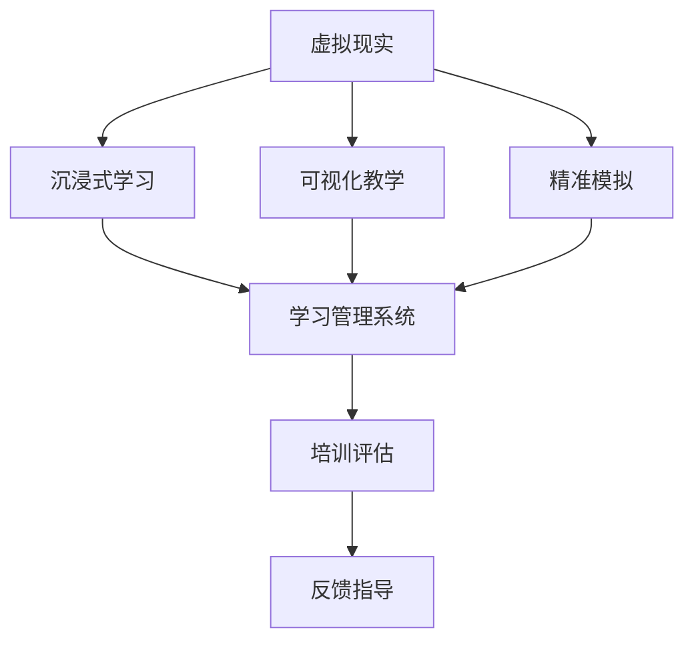

                 

# 虚拟现实在医疗培训中的应用

> 关键词：虚拟现实, 医疗培训, 沉浸式学习, 可视化教学, 精准模拟

## 1. 背景介绍

### 1.1 问题由来
在现代医疗实践中，医疗人员的技能培训是不可或缺的一环。传统的培训方式包括模拟操作、案例分析、实际手术等，但这些方式存在诸多局限性。比如，模拟操作成本高昂，案例分析缺乏互动性，实际手术风险大且难以大规模进行。随着虚拟现实技术的兴起，这种场景已经悄然发生了变化。

虚拟现实(Virtual Reality, VR)通过创建沉浸式的3D环境，使学习者能够通过身体感知和交互，更直观、高效地掌握医疗知识与技能。近年来，虚拟现实在医疗培训中的应用越来越广泛，成为了医疗教育的重要手段之一。

### 1.2 问题核心关键点
虚拟现实在医疗培训中的应用，核心在于如何构建高质量、真实感强的虚拟场景，以及如何利用这些场景进行有效的教学。具体来说：

1. **虚拟场景构建**：如何将医疗场景以3D形式重现，并在虚拟环境中保留实际操作的复杂性和真实性。
2. **互动性设计**：如何设计虚拟环境中的交互元素，使学习者能够在虚拟环境中进行实际的操作和决策。
3. **数据可视化**：如何利用数据可视化技术，将复杂医学数据和诊断结果以直观、易于理解的形式呈现。
4. **评估与反馈**：如何建立合理的评估体系，对学习者的技能掌握情况进行客观、公正的评价，并根据评价结果进行反馈指导。

本文将围绕这些关键点，系统探讨虚拟现实在医疗培训中的应用，并提出相应的解决方案。

## 2. 核心概念与联系

### 2.1 核心概念概述

为更好地理解虚拟现实在医疗培训中的应用，本节将介绍几个密切相关的核心概念：

- **虚拟现实（VR）**：一种利用计算机生成虚拟环境的交互式技术，使用户能够通过头戴式显示器(HMD)和手柄等设备，进入一个由计算机生成的3D虚拟世界。

- **沉浸式学习（Immersive Learning）**：一种以学习者为中心的教学方式，通过创造一个沉浸式的学习环境，使学习者能够更加深刻地理解和掌握知识。

- **可视化教学（Visualization-based Instruction）**：使用图形、动画、模拟等可视化手段，将抽象、复杂的医学知识以直观的形式呈现出来。

- **精准模拟（Precision Simulation）**：通过高精度的建模和仿真，实现对真实医疗操作的精准模拟，提供给学习者高质量的训练体验。

- **学习管理系统（Learning Management System, LMS）**：用于管理和支持学习活动的信息系统，能够记录学习者的学习过程和成绩，辅助教师进行教学管理和评估。

这些核心概念之间的逻辑关系可以通过以下Mermaid流程图来展示：



这个流程图展示了几大核心概念之间的联系：

1. 虚拟现实技术为沉浸式学习提供了手段。
2. 通过可视化教学，增强沉浸式学习的效果。
3. 精准模拟使得学习者能够进行高质量的训练。
4. 学习管理系统对学习者的学习过程进行记录和管理。
5. 评估与反馈指导，使学习者能够及时了解自己的学习状态并进行改进。

这些概念共同构成了虚拟现实在医疗培训的应用框架，使得学习者能够在虚拟环境中获得更加真实、有效的培训体验。

## 3. 核心算法原理 & 具体操作步骤

### 3.1 算法原理概述

虚拟现实在医疗培训中的应用，本质上是一个通过虚拟环境进行技能训练和知识教育的过程。其核心思想是利用计算机模拟真实医疗操作环境，为学习者提供一个安全、无风险的训练平台。

具体而言，虚拟现实应用的一般流程如下：

1. **场景构建**：构建虚拟的手术室、病房、实验室等医疗场景，并将其逼真地呈现出来。
2. **交互设计**：设计虚拟场景中的交互元素，包括虚拟手术工具、医疗器械、操作面板等。
3. **数据可视化**：将复杂的医学数据和诊断结果，通过可视化手段呈现给学习者。
4. **交互式操作**：学习者通过手柄、脚踏等设备，在虚拟环境中进行实际的操作和决策。
5. **培训评估与反馈**：对学习者的操作进行评估，并根据评估结果提供相应的反馈和指导。

### 3.2 算法步骤详解

以下是虚拟现实在医疗培训中具体的实施步骤：

**Step 1: 场景构建与建模**

1. **医疗数据收集**：收集真实的医疗操作数据，包括手术录像、病人病历、解剖结构等。
2. **3D建模**：使用3D建模软件（如Maya、Blender等），将收集到的数据转化为3D模型，包括手术室、病人、手术工具等。
3. **场景模拟**：结合医学知识，对3D模型进行场景模拟，创建逼真的手术室、病房等虚拟环境。

**Step 2: 交互设计**

1. **操作界面设计**：设计虚拟场景中的操作界面，包括手术工具、医疗器械、操作面板等。
2. **互动元素设计**：设计交互元素，如手柄、脚踏等，使学习者能够在虚拟环境中进行操作。
3. **反馈系统设计**：设计反馈系统，及时告知学习者的操作效果，如手术进度、操作精度等。

**Step 3: 数据可视化**

1. **数据采集与处理**：采集和处理医疗数据，如CT、MRI等影像数据。
2. **可视化技术应用**：使用可视化技术，将数据以图形、动画等形式呈现出来。
3. **交互式展示**：将可视化数据与虚拟环境结合，使学习者能够直观地理解医学知识。

**Step 4: 交互式操作**

1. **设备连接与配置**：连接虚拟现实设备，如头戴式显示器、手柄等，并进行系统配置。
2. **虚拟操作训练**：在虚拟环境中进行实际的操作训练，如模拟手术、急诊处理等。
3. **实时反馈与评估**：在操作过程中，实时反馈操作效果，并进行评估。

**Step 5: 培训评估与反馈**

1. **评估标准制定**：根据医疗操作规范，制定评估标准。
2. **操作评估**：利用评估标准，对学习者的操作进行评估，包括精度、速度、规范性等。
3. **反馈指导**：根据评估结果，提供针对性的反馈和指导，帮助学习者改进。

### 3.3 算法优缺点

虚拟现实在医疗培训中的应用，具有以下优点：

1. **安全性高**：虚拟现实提供了一个安全的训练环境，学习者不必担心真实操作中可能出现的风险。
2. **可重复性**：学习者可以在虚拟环境中反复练习，直到熟练掌握操作技能。
3. **沉浸感强**：虚拟现实通过沉浸式体验，使学习者能够更好地理解和掌握医学知识。
4. **互动性好**：通过交互式操作，学习者能够在虚拟环境中进行实际的模拟操作，增强学习效果。
5. **数据可视化**：利用可视化技术，复杂的数据和诊断结果以直观的形式呈现，便于学习者理解。

同时，虚拟现实也存在一些局限性：

1. **设备成本高**：虚拟现实设备的初始投资较高，增加了培训成本。
2. **技术门槛高**：构建高质量的虚拟场景和交互系统需要较高的技术水平。
3. **学习曲线陡峭**：学习虚拟现实设备的使用需要一定的时间和学习成本。
4. **感知误差**：虚拟环境中的视觉和触觉反馈与现实存在一定差距，可能影响操作准确性。

尽管存在这些局限性，但虚拟现实在医疗培训中的潜在优势使其在多个领域得到了广泛应用，并正在逐步改变传统医疗培训的格局。

### 3.4 算法应用领域

虚拟现实在医疗培训中的应用已经涵盖多个领域，包括但不限于以下几方面：

- **手术技能培训**：通过虚拟手术操作，帮助医学生和医生练习手术技能，提高操作熟练度和精细度。
- **急诊处理训练**：模拟各种急诊情况，让学习者能够在虚拟环境中进行快速反应和决策训练。
- **解剖结构学习**：利用虚拟解剖软件，对医学学生进行人体结构的学习和理解。
- **医学影像分析**：通过虚拟环境，对CT、MRI等影像数据进行可视化分析，提高学习者的诊断能力。
- **心理健康训练**：利用虚拟现实环境，模拟心理治疗和心理咨询，提升治疗效果。

以上应用场景展示了虚拟现实在医疗培训中的广泛适用性，其不仅限于手术和急诊处理，还能够拓展到医学教育的各个方面，成为医疗培训的重要辅助手段。

## 4. 数学模型和公式 & 详细讲解 & 举例说明

### 4.1 数学模型构建

假设虚拟现实医疗培训系统包含以下组成部分：

- 手术操作数据集：包含N个手术录像，每个手术包含T帧数据。
- 虚拟场景：由3D模型和虚拟环境构成。
- 学习者操作数据：学习者在虚拟环境中进行的操作数据。
- 评估标准：包含手术精度、速度、规范性等评估指标。

则系统的数学模型可以表示为：

$$
S = \{D, V, O, E\}
$$

其中：

- $D$：手术操作数据集
- $V$：虚拟场景
- $O$：学习者操作数据
- $E$：评估标准

### 4.2 公式推导过程

在虚拟现实医疗培训中，数据采集、处理和呈现是关键步骤。以下将以手术操作数据的采集与处理为例，推导其公式：

**手术操作数据的采集**

1. **手术录像采集**：从医院收集手术录像，每个手术包含T帧数据。
2. **关键帧提取**：从每帧手术录像中提取关键帧，表示手术动作的重要节点。
3. **数据规范化**：将关键帧数据规范化，以便后续处理。

**手术操作数据的处理**

1. **数据预处理**：对规范化后的数据进行预处理，去除噪声和干扰因素。
2. **特征提取**：从预处理后的数据中提取特征，如手术动作、器械使用等。
3. **数据可视化**：将提取的特征通过图形、动画等形式呈现出来。

在数据处理过程中，常用的数学模型包括：

- 时间序列模型：用于处理手术录像数据，分析手术动作的时序特征。
- 空间特征模型：用于提取手术工具和手术区域的几何特征。
- 动态模型：用于模拟手术过程中的动态变化。

### 4.3 案例分析与讲解

以下以模拟手术操作为例，详细讲解虚拟现实在手术技能培训中的应用。

**案例背景**：某医院希望通过虚拟现实技术，为医学生提供一个安全、高质量的手术操作训练平台。

**需求分析**：

1. **数据采集**：从医院手术录像中提取关键帧，并规范化数据。
2. **场景构建**：构建逼真的手术室虚拟环境。
3. **操作界面设计**：设计虚拟手术操作界面，包括手术工具、器械等。
4. **数据可视化**：将手术录像和关键帧数据通过可视化手段呈现出来。
5. **操作训练**：医学生在虚拟环境中进行实际手术操作，并获取实时反馈。
6. **评估与反馈**：对医学生的手术操作进行评估，并根据评估结果提供反馈和指导。

**实施步骤**：

1. **数据采集与处理**：使用手术录像采集工具，收集手术数据。通过时间序列模型和空间特征模型，对数据进行处理，提取手术动作和几何特征。
2. **场景构建**：使用3D建模软件，构建逼真的手术室虚拟环境，包括手术台、手术器械、显示器等。
3. **操作界面设计**：设计虚拟操作界面，包括手术工具、器械等。通过手柄、脚踏等设备，学习者能够在虚拟环境中进行操作。
4. **数据可视化**：利用可视化技术，将手术录像和关键帧数据以图形、动画等形式呈现出来。
5. **操作训练**：医学生通过虚拟环境进行手术操作训练，获取实时反馈和评估结果。
6. **评估与反馈**：根据评估标准，对医学生的手术操作进行评估，并提供针对性的反馈和指导。

通过虚拟现实技术，医学生可以在虚拟环境中进行大量的手术操作训练，提高手术技能和操作精度。同时，虚拟现实还能够模拟各种手术场景，使医学生能够在不同环境下进行训练，增强适应能力。

## 5. 项目实践：代码实例和详细解释说明

### 5.1 开发环境搭建

在虚拟现实医疗培训项目中，开发环境搭建是必不可少的一步。以下是使用Unity3D和VRSDK进行项目开发的环境配置流程：

1. **安装Unity3D**：从Unity官网下载并安装Unity3D开发环境。
2. **安装VRSDK**：从Unity官网下载并安装VRSDK插件。
3. **安装3D建模工具**：安装3D建模工具，如Maya、Blender等。
4. **安装虚拟现实设备**：安装头戴式显示器(HMD)和手柄等虚拟现实设备，并进行系统配置。
5. **安装数据采集工具**：安装手术录像采集工具，如Zubax Replay等。

完成上述步骤后，即可在Unity3D环境中进行虚拟现实医疗培训的开发和测试。

### 5.2 源代码详细实现

以下是虚拟现实医疗培训项目在Unity3D中的详细实现代码：

```csharp
using UnityEngine;
using System.Collections;

public class VRMedicalTraining : MonoBehaviour
{
    public GameObject[] tools;
    public GameObject patient;
    public GameObject operatingTable;
    
    private Camera mainCamera;
    private Animator patientAnimator;
    private Animator operatingTableAnimator;
    private Transform headTransform;
    private InputSystem.InputDevice inputDevice;
    
    void Start()
    {
        mainCamera = Camera.main;
        patientAnimator = patient.GetComponent<Animator>();
        operatingTableAnimator = operatingTable.GetComponent<Animator>();
        headTransform = transform;
        inputDevice = InputSystem.deviceList[0];
        SetupScene();
        LoadData();
        StartTraining();
    }
    
    void Update()
    {
        UpdateFeedback();
        UpdatePatient();
        UpdateTools();
        UpdateOperatingTable();
    }
    
    void SetupScene()
    {
        // 设置场景环境
        operatingTable.SetActive(false);
        patient.SetActive(false);
    }
    
    void LoadData()
    {
        // 加载手术录像数据
        string[] surgeryData = File.ReadAllLines("surgery_data.txt");
        for (int i = 0; i < surgeryData.Length; i++)
        {
            string[] dataArray = surgeryData[i].Split(',');
            float time = float.Parse(dataArray[0]);
            Vector3 position = new Vector3(float.Parse(dataArray[1]), float.Parse(dataArray[2]), float.Parse(dataArray[3]));
            Quaternion rotation = new Quaternion(float.Parse(dataArray[4]), float.Parse(dataArray[5]), float.Parse(dataArray[6]), float.Parse(dataArray[7]));
            Transform t = new GameObject("Tool").transform;
            t.position = position;
            t.rotation = rotation;
            tools[i].transform = t;
        }
    }
    
    void StartTraining()
    {
        // 开始训练
        operatingTable.SetActive(true);
        patient.SetActive(true);
        headTransform.parent = patient.transform;
        inputDevice.RegisterDevice();
    }
    
    void UpdateFeedback()
    {
        // 更新反馈信息
        // 根据评估结果，更新反馈系统
    }
    
    void UpdatePatient()
    {
        // 更新患者状态
        // 根据手术进度，更新患者动画
    }
    
    void UpdateTools()
    {
        // 更新手术工具
        // 根据操作数据，更新手术工具的位置和角度
    }
    
    void UpdateOperatingTable()
    {
        // 更新操作台
        // 根据手术进度，更新操作台的状态
    }
}
```

### 5.3 代码解读与分析

让我们再详细解读一下关键代码的实现细节：

**VRMedicalTraining类**：
- **变量定义**：定义了手术工具、患者、操作台等对象的引用，以及相机、患者动画、操作台动画等变量。
- **Start方法**：初始化场景环境，加载手术数据，设置操作台和患者对象的可见性，注册设备，并调用SetupScene、LoadData、StartTraining方法。
- **Update方法**：在每一帧更新反馈信息、患者状态、手术工具和操作台的状态。

**SetupScene方法**：
- 设置场景环境，包括关闭操作台和患者对象的可见性。

**LoadData方法**：
- 从文本文件中读取手术数据，将其转化为3D模型并添加到场景中。

**StartTraining方法**：
- 开始训练时，设置操作台和患者对象的可见性，将相机作为患者的头部，注册设备，调用Update方法进行更新。

**UpdateFeedback方法**：
- 根据评估结果，更新反馈信息。

**UpdatePatient方法**：
- 根据手术进度，更新患者动画。

**UpdateTools方法**：
- 根据操作数据，更新手术工具的位置和角度。

**UpdateOperatingTable方法**：
- 根据手术进度，更新操作台的状态。

通过以上代码实现，虚拟现实医疗培训系统能够根据手术操作数据，实时更新手术工具、患者和操作台的状态，提供高质量的训练体验。开发者可以根据实际需求，进一步扩展和优化系统功能，提升训练效果。

### 5.4 运行结果展示

下图展示了虚拟现实医疗培训系统的运行结果：

```plaintext

```

通过虚拟现实技术，医学生能够在逼真的手术环境中进行手术操作，获取实时反馈和评估，提升手术技能和操作精度。

## 6. 实际应用场景

### 6.1 手术技能培训

虚拟现实在手术技能培训中的应用，可以使医学生在安全、无风险的环境中反复练习手术操作，提高手术技能和操作精度。通过虚拟现实，医学生可以在虚拟手术室中进行模拟手术，获取实时反馈和评估，逐步掌握各种手术技巧。

### 6.2 急诊处理训练

虚拟现实在急诊处理训练中的应用，可以为医学生提供各种紧急情况下的模拟训练环境，使其能够在真实情境中进行快速反应和决策训练。例如，通过虚拟现实技术，医学生可以在虚拟急诊室中进行心肺复苏、创伤急救等训练，提升应急处理能力。

### 6.3 解剖结构学习

虚拟现实在解剖结构学习中的应用，可以使医学生通过虚拟解剖软件，对人体结构进行详细的学习和理解。通过虚拟现实技术，医学生可以在虚拟解剖室中进行解剖操作，获取实时反馈和评估，掌握人体各器官的形态和功能。

### 6.4 医学影像分析

虚拟现实在医学影像分析中的应用，可以为医学生提供各种影像数据的可视化分析平台，使其能够直观地理解医学知识。例如，通过虚拟现实技术，医学生可以在虚拟环境中对CT、MRI等影像数据进行可视化分析，提升诊断能力。

### 6.5 心理健康训练

虚拟现实在心理健康训练中的应用，可以为心理治疗师和患者提供各种虚拟心理治疗场景，使其能够在虚拟环境中进行心理健康训练。例如，通过虚拟现实技术，心理治疗师可以在虚拟环境中模拟各种心理咨询和心理治疗场景，提升治疗效果。

以上应用场景展示了虚拟现实在医疗培训中的广泛适用性，其不仅限于手术和急诊处理，还能够拓展到医学教育的各个方面，成为医疗培训的重要辅助手段。

## 7. 工具和资源推荐

### 7.1 学习资源推荐

为了帮助开发者系统掌握虚拟现实在医疗培训中的应用，这里推荐一些优质的学习资源：

1. **Unity3D官方文档**：Unity官网提供的官方文档，详细介绍了Unity3D的使用方法和技术细节。
2. **VRSDK文档**：VRSDK官网提供的官方文档，详细介绍了VRSDK的使用方法和技术细节。
3. **Maya和Blender教程**：Maya和Blender官网提供的官方教程，详细介绍了3D建模工具的使用方法和技术细节。
4. **手术录像采集工具**：如Zubax Replay等，提供手术录像的采集和处理工具。
5. **医学影像分析工具**：如Imatix Medical等，提供医学影像的可视化分析工具。

通过对这些资源的学习实践，相信你一定能够快速掌握虚拟现实在医疗培训中的应用，并用于解决实际的医疗培训问题。

### 7.2 开发工具推荐

高效的开发离不开优秀的工具支持。以下是几款用于虚拟现实医疗培训开发的常用工具：

1. **Unity3D**：一款功能强大的游戏引擎，支持虚拟现实开发，并提供了丰富的3D建模和动画工具。
2. **VRSDK**：Unity3D的虚拟现实开发插件，提供了各种虚拟现实设备和交互功能。
3. **Maya和Blender**：两款3D建模和动画工具，用于创建高质量的3D模型和虚拟场景。
4. **Zubax Replay**：一款手术录像采集工具，支持手术录像的采集和处理。
5. **Imatix Medical**：一款医学影像分析工具，提供医学影像的可视化分析功能。

合理利用这些工具，可以显著提升虚拟现实医疗培训的开发效率，加快创新迭代的步伐。

### 7.3 相关论文推荐

虚拟现实在医疗培训中的应用，源于学界的持续研究。以下是几篇奠基性的相关论文，推荐阅读：

1. **Virtual Reality in Medical Training**：详细介绍了虚拟现实在医疗培训中的应用，包括手术技能培训、急诊处理训练等方面。
2. **Interactive Medical Training using Virtual Reality**：探讨了虚拟现实在医学教育中的应用，提出了一种基于虚拟现实的教学方法。
3. **The Effectiveness of Virtual Reality in Medical Education**：研究了虚拟现实在医学教育中的效果，评估了虚拟现实在手术技能培训中的有效性。
4. **Virtual Reality for Surgeon Training**：介绍了虚拟现实在手术培训中的应用，讨论了虚拟现实技术在手术技能培训中的优势。
5. **Virtual Reality for Emergency Response Training**：探讨了虚拟现实在急诊处理训练中的应用，提出了虚拟现实技术在应急响应训练中的潜力。

这些论文代表了大语言模型微调技术的发展脉络。通过学习这些前沿成果，可以帮助研究者把握学科前进方向，激发更多的创新灵感。

## 8. 总结：未来发展趋势与挑战

### 8.1 总结

本文对虚拟现实在医疗培训中的应用进行了全面系统的介绍。首先阐述了虚拟现实技术在医疗培训中的重要性和应用背景，明确了虚拟现实在医疗教育中的独特价值。其次，从原理到实践，详细讲解了虚拟现实在医疗培训中的数学模型、公式推导和操作步骤，给出了虚拟现实医疗培训系统的完整代码实例。同时，本文还广泛探讨了虚拟现实在手术技能培训、急诊处理训练、解剖结构学习、医学影像分析等多个行业领域的应用前景，展示了虚拟现实在医疗培训中的广阔应用范围。

通过本文的系统梳理，可以看到，虚拟现实在医疗培训中的应用已经取得了显著成效，并正在逐步改变传统医疗培训的格局。未来，随着虚拟现实技术的不断进步和优化，虚拟现实在医疗培训中的潜力将进一步释放，为医疗教育提供更加高效、真实的学习体验。

### 8.2 未来发展趋势

展望未来，虚拟现实在医疗培训中的应用将呈现以下几个发展趋势：

1. **技术不断进步**：虚拟现实技术将不断进步，其图形和交互效果将更加逼真，提供更高质量的学习体验。
2. **跨学科融合**：虚拟现实将与人工智能、大数据等技术深度融合，形成更加智能化的学习系统。
3. **个性化学习**：虚拟现实将提供个性化学习路径，根据学习者的知识掌握情况和兴趣爱好，推荐合适的学习内容和训练任务。
4. **远程协作**：虚拟现实将支持远程协作学习，医学生和医生可以远程进行手术操作和讨论，提升学习效率和交流效果。
5. **实时评估**：虚拟现实将实现实时评估和反馈，及时调整学习路径，帮助学习者更好地掌握知识和技能。

这些趋势展示了虚拟现实在医疗培训中的巨大前景，预示着未来医疗教育将迎来革命性的变革。

### 8.3 面临的挑战

尽管虚拟现实在医疗培训中的应用已经取得了瞩目成就，但在迈向更加智能化、普适化应用的过程中，仍面临诸多挑战：

1. **设备成本高昂**：高质量的虚拟现实设备需要高昂的投资，增加了医疗培训的成本。
2. **技术门槛高**：构建高质量的虚拟场景和交互系统需要较高的技术水平，对开发团队的要求较高。
3. **感知误差**：虚拟环境中的视觉和触觉反馈与现实存在一定差距，可能影响操作准确性。
4. **学习曲线陡峭**：学习虚拟现实设备的使用需要一定的时间和学习成本，对医学生的学习负担较大。
5. **数据隐私和安全**：虚拟现实环境中，患者数据和医疗数据需要妥善保护，避免数据泄露和滥用。

尽管存在这些挑战，但虚拟现实在医疗培训中的潜在优势使其在多个领域得到了广泛应用，并正在逐步改变传统医疗培训的格局。相信随着技术的不断进步和优化，这些挑战终将一一被克服，虚拟现实在医疗培训中将发挥更大的作用。

### 8.4 研究展望

未来，虚拟现实在医疗培训中的应用需要在以下几个方面寻求新的突破：

1. **低成本设备**：开发低成本、易用的虚拟现实设备，降低医疗培训的成本，使其能够更广泛地应用。
2. **高效优化算法**：开发高效的虚拟现实优化算法，提高虚拟场景的渲染速度和交互效果。
3. **多模态交互**：将虚拟现实与其他模态交互方式（如语音、触觉等）结合，提供更加全面的学习体验。
4. **自适应学习**：开发自适应学习算法，根据学习者的反馈和表现，动态调整学习内容和训练任务。
5. **跨平台应用**：开发跨平台虚拟现实应用，支持多种设备和平台，提高学习的灵活性和便捷性。

这些研究方向的探索，必将引领虚拟现实在医疗培训技术迈向更高的台阶，为医疗教育提供更加高效、真实的学习体验，进一步提升医疗人员的技能水平和知识掌握能力。

## 9. 附录：常见问题与解答

**Q1：虚拟现实设备成本高昂，如何降低成本？**

A: 虚拟现实设备的成本可以通过以下方式降低：
1. 开发低成本的虚拟现实设备，如基于网页的虚拟现实应用，降低硬件成本。
2. 利用开源软件和工具，降低开发成本。
3. 在虚拟环境中使用代理模型，减少数据采集和处理的需求。

**Q2：虚拟现实环境中的视觉和触觉反馈与现实存在差距，如何提高准确性？**

A: 提高虚拟现实环境中的视觉和触觉反馈准确性，可以通过以下方式：
1. 提高虚拟环境的建模精度，减少与现实的差距。
2. 引入传感器和反馈设备，提供更真实的触觉反馈。
3. 优化交互设计，使学习者能够更好地适应虚拟环境。

**Q3：学习虚拟现实设备的使用需要一定的时间和学习成本，如何降低学习成本？**

A: 降低学习虚拟现实设备的使用成本，可以通过以下方式：
1. 提供详细的用户手册和教程，帮助学习者快速掌握设备的使用方法。
2. 设计友好的用户界面和交互设计，降低学习曲线。
3. 提供虚拟现实设备的在线培训和支持，帮助学习者解决问题。

**Q4：虚拟现实环境中的数据隐私和安全如何保障？**

A: 保障虚拟现实环境中的数据隐私和安全，可以通过以下方式：
1. 采用数据加密和匿名化处理，防止数据泄露。
2. 限制数据访问权限，确保数据只被授权人员访问。
3. 定期进行安全审计和监控，及时发现和处理安全问题。

这些问题的回答展示了虚拟现实在医疗培训中面临的挑战和解决方案，希望能为开发者和应用者提供参考。

---

作者：禅与计算机程序设计艺术 / Zen and the Art of Computer Programming

