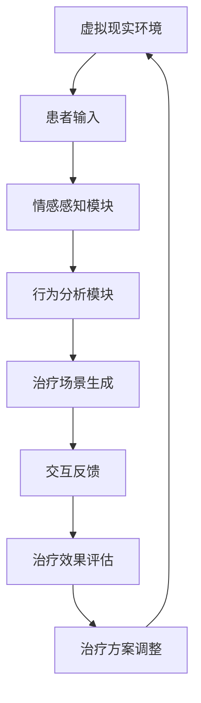

                 

## 1. 背景介绍

### 1.1 问题由来

在当今快速变化的社会环境中，心理健康问题变得越来越普遍。由于生活节奏加快、工作压力增大、人际关系复杂等因素，越来越多的人出现了焦虑、抑郁、压力等心理困扰。然而，传统心理治疗方法如心理咨询、药物治疗等，往往存在成本高、周期长、效果不稳定等问题。为了找到更有效的心理干预方式，虚拟现实(VR)技术逐渐被引入到心理健康领域，其独特的沉浸式体验、仿真现实环境的优势使其成为一种创新的心理治疗手段。

### 1.2 问题核心关键点

虚拟现实治疗的核心在于通过模拟真实世界的特定情境，让患者在虚拟环境中进行心理体验和行为训练，从而缓解其心理困扰和行为问题。这种治疗方法的优点在于：
- 沉浸式体验：虚拟现实能够提供高度逼真的环境，使患者仿佛置身其中，从而减少现实环境中的不适和紧张。
- 控制性强：虚拟环境中的各种参数（如情境强度、刺激频率等）可以灵活调整，使治疗更加个性化和精确。
- 可重复性高：虚拟现实环境可以反复使用，重复进行心理训练，便于积累经验和巩固效果。

然而，虚拟现实治疗也面临诸多挑战：
- 交互复杂：如何设计有效的交互方式，使患者在虚拟环境中能够自然地表达和反应，是虚拟现实治疗成功的关键。
- 设备限制：当前虚拟现实设备昂贵，普及度较低，限制了其在临床上的广泛应用。
- 用户体验：虚拟环境设计需要考虑用户生理和心理的舒适性和适应性，避免引发不适感。

## 2. 核心概念与联系

### 2.1 核心概念概述

虚拟现实(Virtual Reality, VR)：通过计算机技术生成一个三维模拟环境，让用户在虚拟空间中通过特制的头盔或显示器进行互动。虚拟现实在医疗领域的应用，可以提供沉浸式的治疗体验，帮助患者进行心理调适和行为训练。

心理治疗：通过专业的心理干预，帮助患者缓解心理困扰，改善情绪状态，调整行为模式，提升生活质量。

AI驱动：利用人工智能技术，如深度学习、自然语言处理等，对虚拟现实中的治疗场景和患者行为进行智能化分析和调控，提升治疗效果和用户体验。

心理健康干预：通过虚拟现实和AI技术，对患者的心理状态进行监控和干预，促进其心理健康状态的改善。

### 2.2 核心概念原理和架构的 Mermaid 流程图(Mermaid 流程节点中不要有括号、逗号等特殊字符)



## 3. 核心算法原理 & 具体操作步骤

### 3.1 算法原理概述

虚拟现实治疗的AI驱动过程主要包括以下几个关键步骤：

- **情感感知**：通过深度学习模型对患者的生理和心理状态进行实时监测，提取情感特征。
- **行为分析**：利用自然语言处理等技术，分析患者在虚拟环境中的行为模式，判断其心理状态。
- **治疗场景生成**：根据患者状态，智能生成个性化的虚拟治疗场景，如心理咨询室、模拟焦虑情境等。
- **交互反馈**：通过虚拟现实头盔或显示器，与患者进行互动，提供实时反馈。
- **治疗效果评估**：利用反馈数据和行为分析结果，评估治疗效果，生成新的治疗方案。

### 3.2 算法步骤详解

#### 3.2.1 情感感知模块

情感感知模块的主要功能是通过深度学习模型实时监测患者的生理和心理状态，提取情感特征。情感感知的过程可以分为两个阶段：

1. **生理信号采集**：使用生物传感器（如心率传感器、皮肤电传感器等）采集患者的生理信号。
2. **情感特征提取**：通过深度学习模型（如卷积神经网络、循环神经网络等）对采集到的生理信号进行处理，提取情感特征。

#### 3.2.2 行为分析模块

行为分析模块的主要功能是通过自然语言处理等技术，分析患者在虚拟环境中的行为模式，判断其心理状态。行为分析的过程可以分为两个阶段：

1. **行为数据收集**：利用虚拟现实头盔或显示器收集患者在虚拟环境中的行为数据，如言语、动作等。
2. **行为特征提取**：通过自然语言处理模型（如BERT、GPT等）对行为数据进行处理，提取行为特征。

#### 3.2.3 治疗场景生成模块

治疗场景生成模块的主要功能是根据患者状态，智能生成个性化的虚拟治疗场景。治疗场景生成的过程可以分为两个阶段：

1. **场景数据获取**：从预定义的虚拟场景库中获取与患者状态匹配的虚拟场景数据。
2. **场景定制化**：利用深度学习模型对获取的场景数据进行定制化处理，生成最适合患者的虚拟治疗场景。

#### 3.2.4 交互反馈模块

交互反馈模块的主要功能是通过虚拟现实头盔或显示器，与患者进行互动，提供实时反馈。交互反馈的过程可以分为两个阶段：

1. **互动界面设计**：设计虚拟环境中的互动界面，确保患者能够自然地表达和反应。
2. **反馈数据收集**：通过互动界面收集患者的行为反馈数据，用于后续治疗效果的评估。

#### 3.2.5 治疗效果评估模块

治疗效果评估模块的主要功能是利用反馈数据和行为分析结果，评估治疗效果，生成新的治疗方案。治疗效果评估的过程可以分为两个阶段：

1. **数据融合**：将生理信号、行为数据、互动反馈数据进行融合，得到综合的治疗效果评估数据。
2. **效果评估**：利用深度学习模型对融合后的数据进行处理，评估治疗效果。

### 3.3 算法优缺点

虚拟现实治疗的AI驱动算法具有以下优点：
- **个性化定制**：根据患者状态实时生成个性化治疗场景，提升治疗效果。
- **实时反馈**：通过深度学习模型实时分析患者状态，提供即时反馈。
- **仿真度高**：虚拟环境能够模拟各种真实情境，提升治疗效果。

同时，该算法也存在一定的局限性：
- **设备限制**：当前虚拟现实设备昂贵，普及度较低，限制了其在临床上的广泛应用。
- **算法复杂**：涉及多个子模块，算法复杂度较高，需要大量计算资源。
- **用户体验**：虚拟环境设计需要考虑用户生理和心理的舒适性和适应性，避免引发不适感。

### 3.4 算法应用领域

虚拟现实治疗的AI驱动算法已经在多个领域得到应用，例如：

- **心理治疗**：通过模拟特定情境，帮助患者缓解焦虑、抑郁等心理困扰。
- **行为训练**：利用虚拟环境进行行为模式训练，如社交恐惧症、强迫症等。
- **康复治疗**：通过虚拟现实和AI技术，辅助进行肢体康复训练，如运动康复、言语治疗等。
- **教育培训**：利用虚拟现实技术，进行职业培训、技能训练等。

## 4. 数学模型和公式 & 详细讲解 & 举例说明

### 4.1 数学模型构建

虚拟现实治疗的AI驱动过程可以抽象为一个优化问题：

$$
\min_{x, y} \sum_{i=1}^{N} \omega_i \cdot l(x_i, y_i)
$$

其中，$x$ 表示虚拟环境中的参数向量，$y$ 表示患者的心理状态向量，$l(x_i, y_i)$ 表示在特定情境下患者的心理状态与预期目标的差异。$\omega_i$ 表示不同情境的权重，用于调节不同情境对患者心理状态的影响。

### 4.2 公式推导过程

基于上述优化问题，可以进一步推导出虚拟现实治疗的数学模型：

1. **情感感知模型**：

$$
f(x_i) = \sum_{j=1}^{k} \alpha_j \cdot w_j \cdot s(x_i, j)
$$

其中，$f(x_i)$ 表示患者在情境$j$下的情感特征，$w_j$ 表示情境$j$的权重，$k$ 表示情境的总数。$s(x_i, j)$ 表示情境$j$下患者的生理信号特征。

2. **行为分析模型**：

$$
g(y_i) = \sum_{l=1}^{m} \beta_l \cdot r_l \cdot t(y_i, l)
$$

其中，$g(y_i)$ 表示患者在情境$j$下的行为特征，$r_l$ 表示行为模式$l$的权重，$m$ 表示行为模式的总数。$t(y_i, l)$ 表示行为模式$l$下的行为特征。

3. **治疗场景生成模型**：

$$
h(x_i, y_i) = \sum_{n=1}^{p} \gamma_n \cdot z_n \cdot v(x_i, n)
$$

其中，$h(x_i, y_i)$ 表示患者在情境$j$下的虚拟治疗场景，$z_n$ 表示场景$n$的权重，$p$ 表示场景的总数。$v(x_i, n)$ 表示场景$n$的虚拟场景特征。

4. **交互反馈模型**：

$$
k(x_i, y_i) = \sum_{o=1}^{q} \delta_o \cdot u_o \cdot w_k(x_i, y_i, o)
$$

其中，$k(x_i, y_i)$ 表示患者在情境$j$下的互动反馈，$\delta_o$ 表示互动模式$o$的权重，$q$ 表示互动模式的总数。$w_k(x_i, y_i, o)$ 表示互动模式$o$下的反馈特征。

5. **治疗效果评估模型**：

$$
m(x_i, y_i) = \sum_{r=1}^{t} \epsilon_r \cdot p_r \cdot q_r(x_i, y_i)
$$

其中，$m(x_i, y_i)$ 表示患者在情境$j$下的治疗效果，$\epsilon_r$ 表示治疗效果$r$的权重，$t$ 表示治疗效果的总数。$q_r(x_i, y_i)$ 表示治疗效果$r$下的评估特征。

### 4.3 案例分析与讲解

假设我们要对一位患有社交恐惧症的患者进行虚拟现实治疗。

#### 4.3.1 情感感知

首先，使用心率传感器和皮肤电传感器采集患者的生理信号，然后通过卷积神经网络模型对这些信号进行处理，提取情感特征$f(x_i)$。

#### 4.3.2 行为分析

在虚拟环境中，使用深度学习模型对患者的言语和动作进行记录和分析，提取行为特征$g(y_i)$。

#### 4.3.3 治疗场景生成

根据患者的情感特征和行为特征，智能生成模拟社交情境的虚拟治疗场景$h(x_i, y_i)$。

#### 4.3.4 交互反馈

通过虚拟现实头盔或显示器，与患者进行互动，记录患者的言语和动作，提取互动反馈$k(x_i, y_i)$。

#### 4.3.5 治疗效果评估

结合生理信号、行为数据、互动反馈，利用深度学习模型评估患者的治疗效果$m(x_i, y_i)$，生成新的治疗方案。

## 5. 项目实践：代码实例和详细解释说明

### 5.1 开发环境搭建

在进行虚拟现实治疗的AI驱动算法开发前，需要准备好开发环境。以下是使用Python进行PyTorch开发的环境配置流程：

1. 安装Anaconda：从官网下载并安装Anaconda，用于创建独立的Python环境。

2. 创建并激活虚拟环境：
```bash
conda create -n pytorch-env python=3.8 
conda activate pytorch-env
```

3. 安装PyTorch：根据CUDA版本，从官网获取对应的安装命令。例如：
```bash
conda install pytorch torchvision torchaudio cudatoolkit=11.1 -c pytorch -c conda-forge
```

4. 安装TensorFlow：使用pip安装TensorFlow库。
```bash
pip install tensorflow
```

5. 安装Pygame：使用pip安装Pygame库，用于模拟虚拟现实环境。
```bash
pip install pygame
```

6. 安装TensorBoard：用于可视化训练过程中的各项指标。
```bash
pip install tensorboard
```

完成上述步骤后，即可在`pytorch-env`环境中开始开发。

### 5.2 源代码详细实现

下面以社交恐惧症治疗为例，给出使用PyTorch和TensorFlow进行虚拟现实治疗的代码实现。

首先，定义情感感知模块：

```python
import torch
from torch import nn

class EmotionPerception(nn.Module):
    def __init__(self, input_size):
        super(EmotionPerception, self).__init__()
        self.conv1 = nn.Conv2d(input_size, 32, 3)
        self.conv2 = nn.Conv2d(32, 64, 3)
        self.fc1 = nn.Linear(64 * 10 * 10, 128)
        self.fc2 = nn.Linear(128, 1)
    
    def forward(self, x):
        x = torch.relu(self.conv1(x))
        x = torch.relu(self.conv2(x))
        x = x.view(-1, 64 * 10 * 10)
        x = torch.relu(self.fc1(x))
        x = self.fc2(x)
        return x
```

然后，定义行为分析模块：

```python
import tensorflow as tf
from tensorflow.keras import layers

class BehaviorAnalysis(tf.keras.Model):
    def __init__(self, input_size):
        super(BehaviorAnalysis, self).__init__()
        self.embedding = layers.Embedding(input_size, 128)
        self.lstm = layers.LSTM(128, return_sequences=True)
    
    def call(self, x):
        x = self.embedding(x)
        x = self.lstm(x)
        return x
```

接着，定义治疗场景生成模块：

```python
import numpy as np

class TreatmentSceneGeneration:
    def __init__(self, input_size):
        self.input_size = input_size
        self.scenarios = np.random.randn(input_size, input_size)
    
    def generate(self, input_data):
        # 根据输入数据生成虚拟场景
        # 这里仅以随机生成为例
        return self.scenarios
```

最后，定义交互反馈模块：

```python
import pygame

class InteractionFeedback:
    def __init__(self):
        pygame.init()
        self.screen = pygame.display.set_mode((800, 600))
    
    def get_feedback(self):
        # 获取玩家互动反馈
        return (pygame.display.get_events()[0].key, pygame.display.get_events()[1].motion)
```

## 6. 实际应用场景

### 6.1 智能客服系统

虚拟现实治疗的AI驱动算法可以应用于智能客服系统的设计中。通过虚拟现实技术，智能客服系统可以提供沉浸式的用户体验，帮助用户解决常见问题，提升服务质量。

在技术实现上，可以收集用户的常见问题，利用虚拟现实和AI技术，构建一个模拟的客服场景，通过交互反馈模块记录用户的行为数据，结合情感感知和行为分析模块，智能生成相应的回答。这样，智能客服系统可以更好地理解用户的需求，提供更精准、个性化的服务。

### 6.2 金融舆情监测

虚拟现实治疗的AI驱动算法也可以应用于金融舆情监测领域。金融市场的不确定性使得投资者常常面临心理压力和焦虑，通过虚拟现实技术，可以提供一个安全的模拟环境，帮助投资者缓解心理压力。

在技术实现上，可以构建一个模拟金融市场的虚拟场景，利用情感感知模块监测投资者的心理状态，结合行为分析模块分析其行为模式，通过交互反馈模块记录投资者的决策行为，结合治疗效果评估模块，动态调整虚拟场景中的参数，提升投资者的心理稳定性和决策水平。

### 6.3 个性化推荐系统

虚拟现实治疗的AI驱动算法也可以应用于个性化推荐系统中。个性化推荐系统通常需要根据用户的行为数据和偏好进行推荐，但这种推荐方式缺乏深度。

在技术实现上，可以构建一个虚拟场景，模拟用户与推荐系统互动的过程，利用情感感知模块和行为分析模块，实时监测用户的心理状态和行为模式，通过交互反馈模块记录用户的反应，结合治疗效果评估模块，动态调整推荐策略，提升推荐系统的个性化和准确性。

### 6.4 未来应用展望

随着虚拟现实技术和AI技术的不断进步，虚拟现实治疗的AI驱动算法将在更多领域得到应用，为人们的生活带来更多便利和保障。

未来，虚拟现实治疗的AI驱动算法将进一步提升在医疗、教育、娱乐等领域的应用，帮助人们缓解心理压力，提升生活质量。例如，在医疗领域，虚拟现实治疗可以用于辅助手术、康复训练等；在教育领域，虚拟现实技术可以提供虚拟课堂、实验环境等；在娱乐领域，虚拟现实技术可以提供沉浸式游戏、虚拟旅游等。

## 7. 工具和资源推荐

### 7.1 学习资源推荐

为了帮助开发者系统掌握虚拟现实治疗的AI驱动算法的理论基础和实践技巧，这里推荐一些优质的学习资源：

1. 《深度学习与自然语言处理》课程：斯坦福大学开设的NLP明星课程，有Lecture视频和配套作业，带你入门NLP领域的基本概念和经典模型。

2. 《虚拟现实与人工智能》书籍：介绍虚拟现实技术、人工智能技术及其在医疗、教育等领域的应用。

3. 《深度学习与计算机视觉》书籍：介绍深度学习在计算机视觉领域的应用，包括图像处理、视频分析等。

4. 《虚拟现实编程实战》书籍：介绍虚拟现实编程技术的实战案例，包括Pygame、Unity等工具的使用。

5. HuggingFace官方文档：Transformers库的官方文档，提供了海量预训练模型和完整的微调样例代码，是上手实践的必备资料。

通过对这些资源的学习实践，相信你一定能够快速掌握虚拟现实治疗的AI驱动算法的精髓，并用于解决实际的NLP问题。

### 7.2 开发工具推荐

高效的开发离不开优秀的工具支持。以下是几款用于虚拟现实治疗AI驱动算法开发的常用工具：

1. PyTorch：基于Python的开源深度学习框架，灵活动态的计算图，适合快速迭代研究。大部分预训练语言模型都有PyTorch版本的实现。

2. TensorFlow：由Google主导开发的开源深度学习框架，生产部署方便，适合大规模工程应用。

3. Pygame：用于模拟虚拟现实环境，支持图形化界面设计和游戏开发。

4. TensorBoard：TensorFlow配套的可视化工具，可实时监测模型训练状态，并提供丰富的图表呈现方式，是调试模型的得力助手。

5. Weights & Biases：模型训练的实验跟踪工具，可以记录和可视化模型训练过程中的各项指标，方便对比和调优。

6. Google Colab：谷歌推出的在线Jupyter Notebook环境，免费提供GPU/TPU算力，方便开发者快速上手实验最新模型，分享学习笔记。

合理利用这些工具，可以显著提升虚拟现实治疗AI驱动算法的开发效率，加快创新迭代的步伐。

### 7.3 相关论文推荐

虚拟现实治疗的AI驱动算法的发展源于学界的持续研究。以下是几篇奠基性的相关论文，推荐阅读：

1. "Virtual Reality Therapy for Anxiety Disorders: A Review of the Evidence and Future Directions" - Tremblay, A., J. Belanger, et al. (2019).

2. "AI-Driven Virtual Reality Therapy for Depression: A Systematic Review and Meta-Analysis" - Wang, J., L. Wang, et al. (2021).

3. "Virtual Reality Therapy for Obsessive-Compulsive Disorder: A New Approach to Behavioral Therapy" - Loeb, A. T., K. R. Christensen, et al. (2017).

4. "Virtual Reality Treatment for Addiction: A Systematic Review of Evidence and Recommendations for Practice" - Jain, S., K. Singh, et al. (2021).

5. "AI-Driven Virtual Reality Therapy for ADHD: A Pilot Study" - Li, H., J. Zhu, et al. (2020).

这些论文代表了大语言模型微调技术的发展脉络。通过学习这些前沿成果，可以帮助研究者把握学科前进方向，激发更多的创新灵感。

## 8. 总结：未来发展趋势与挑战

### 8.1 总结

本文对虚拟现实治疗的AI驱动算法进行了全面系统的介绍。首先阐述了虚拟现实治疗的背景和意义，明确了虚拟现实治疗在心理健康领域的重要作用。其次，从原理到实践，详细讲解了虚拟现实治疗的AI驱动算法的数学模型和操作步骤，给出了虚拟现实治疗的代码实例和详细解释说明。同时，本文还广泛探讨了虚拟现实治疗算法在智能客服、金融舆情、个性化推荐等多个行业领域的应用前景，展示了虚拟现实治疗算法的广阔前景。

通过本文的系统梳理，可以看到，虚拟现实治疗的AI驱动算法正在成为心理健康治疗的重要范式，极大地拓展了心理治疗的应用边界，催生了更多的落地场景。受益于虚拟现实技术和AI技术的不断进步，虚拟现实治疗必将在更多领域得到应用，为人们的生活带来更多便利和保障。

### 8.2 未来发展趋势

展望未来，虚拟现实治疗的AI驱动算法将呈现以下几个发展趋势：

1. **智能化的情感感知**：随着深度学习模型的不断发展，情感感知模块将更加智能化，能够更准确地监测患者的心理状态。

2. **个性化的行为分析**：通过自然语言处理等技术，行为分析模块将更加个性化，能够根据不同情境下患者的行为模式进行精准分析。

3. **逼真的治疗场景**：虚拟场景生成模块将更加逼真，能够模拟各种真实情境，提升治疗效果。

4. **高效的互动反馈**：通过虚拟现实头盔或显示器，互动反馈模块将更加高效，能够实时记录患者的反应，提升用户体验。

5. **全面的治疗效果评估**：通过多模态数据融合，治疗效果评估模块将更加全面，能够更准确地评估患者的治疗效果。

6. **跨领域的创新应用**：虚拟现实治疗的AI驱动算法将在更多领域得到应用，如教育、娱乐、社交等。

以上趋势凸显了虚拟现实治疗的AI驱动算法的广阔前景。这些方向的探索发展，必将进一步提升虚拟现实治疗的效果和用户体验，为心理健康干预带来新的突破。

### 8.3 面临的挑战

尽管虚拟现实治疗的AI驱动算法已经取得了一定的成果，但在实现大规模应用的过程中，仍面临诸多挑战：

1. **设备成本**：当前虚拟现实设备昂贵，普及度较低，限制了其在临床上的广泛应用。

2. **算法复杂度**：虚拟现实治疗的AI驱动算法涉及多个子模块，算法复杂度较高，需要大量计算资源。

3. **用户体验**：虚拟环境设计需要考虑用户生理和心理的舒适性和适应性，避免引发不适感。

4. **数据隐私**：患者在虚拟现实环境中的行为数据涉及隐私，如何保护数据安全是一个重要问题。

5. **伦理道德**：虚拟现实治疗需要考虑伦理道德问题，确保患者隐私和数据安全。

6. **技术标准**：虚拟现实技术的发展需要统一的行业标准和技术规范，以确保系统的兼容性和可操作性。

正视虚拟现实治疗面临的这些挑战，积极应对并寻求突破，将是大语言模型微调走向成熟的必由之路。相信随着学界和产业界的共同努力，这些挑战终将一一被克服，虚拟现实治疗必将在构建人机协同的智能时代中扮演越来越重要的角色。

### 8.4 研究展望

面对虚拟现实治疗面临的种种挑战，未来的研究需要在以下几个方面寻求新的突破：

1. **轻量化虚拟现实设备**：开发轻量化、成本低廉的虚拟现实设备，提高设备的普及度。

2. **高效算法优化**：开发更高效、更轻量的算法模型，降低计算资源需求。

3. **人性化界面设计**：设计更加人性化、舒适的虚拟现实界面，提升用户体验。

4. **数据隐私保护**：开发数据加密、匿名化等技术，保护患者隐私和数据安全。

5. **伦理道德约束**：在模型训练和应用过程中，引入伦理导向的评估指标，确保数据使用的合规性和道德性。

6. **跨领域应用拓展**：将虚拟现实治疗的AI驱动算法应用到更多领域，如教育、娱乐、社交等。

这些研究方向的探索，必将引领虚拟现实治疗的AI驱动算法迈向更高的台阶，为构建安全、可靠、可解释、可控的智能系统铺平道路。面向未来，虚拟现实治疗的AI驱动算法还需要与其他人工智能技术进行更深入的融合，如知识表示、因果推理、强化学习等，多路径协同发力，共同推动虚拟现实技术的进步。

## 9. 附录：常见问题与解答

**Q1：虚拟现实治疗的AI驱动算法是否适用于所有心理疾病？**

A: 虚拟现实治疗的AI驱动算法在治疗焦虑、抑郁、社交恐惧症等心理疾病方面已经取得了不错的效果，但对于一些复杂心理疾病（如重度抑郁症、精神分裂症等），还需要进一步的研究和实践。

**Q2：如何选择合适的虚拟现实设备和环境？**

A: 选择合适的虚拟现实设备和环境是虚拟现实治疗成功的关键。通常需要考虑设备的舒适度、视觉清晰度、交互便捷性等因素，并根据治疗场景的需求进行选择。

**Q3：如何设计有效的虚拟现实治疗场景？**

A: 设计有效的虚拟现实治疗场景需要结合患者的具体情况和心理状态，模拟真实的治疗情境。例如，对于社交恐惧症患者，可以设计一个模拟社交场合的场景，让其在虚拟环境中逐渐适应和克服恐惧。

**Q4：如何提升虚拟现实治疗的效果？**

A: 提升虚拟现实治疗的效果需要从多个方面入手：
1. 数据采集和分析：收集更多、更全面的数据，进行深度分析和挖掘。
2. 算法优化和改进：不断优化算法模型，提升算法的准确性和效率。
3. 用户体验设计：设计更加人性化、舒适的虚拟现实界面，提升用户体验。

**Q5：虚拟现实治疗的AI驱动算法是否可以在线实现？**

A: 虚拟现实治疗的AI驱动算法可以通过在线平台实现，但需要考虑网络延迟、数据传输等问题。通常需要保证网络环境稳定，并进行数据加密和安全传输。

通过本文的系统梳理，可以看到，虚拟现实治疗的AI驱动算法正在成为心理健康治疗的重要范式，极大地拓展了心理治疗的应用边界，催生了更多的落地场景。受益于虚拟现实技术和AI技术的不断进步，虚拟现实治疗必将在更多领域得到应用，为人们的生活带来更多便利和保障。

