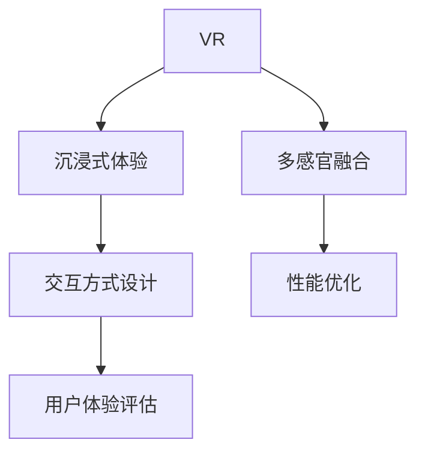

                 

# 虚拟现实（VR）技术：沉浸式体验设计

## 1. 背景介绍

### 1.1 问题由来
随着科技的进步，虚拟现实（Virtual Reality, VR）技术在近年来取得了显著的进展。从最初的头盔显示器到如今的沉浸式头戴设备，VR技术以其独特的沉浸式体验，为用户带来前所未有的感官享受。然而，尽管VR技术已经迈出了坚实的第一步，但如何设计出优秀的沉浸式体验，依然是一个挑战。本博客旨在深入探讨虚拟现实技术，特别是沉浸式体验设计的核心原理与实现步骤，以期为VR技术开发者提供全面的指导。

### 1.2 问题核心关键点
沉浸式体验设计的关键在于如何通过技术手段，创造一个虚拟环境，让用户感受到如同置身现实世界般的真实体验。这涉及到多个方面，包括视觉、听觉、触觉等多感官体验的模拟，以及交互方式的设计和优化。本文将重点介绍如何在VR中实现高保真的沉浸式体验，同时兼顾性能和可用性。

### 1.3 问题研究意义
研究沉浸式体验设计，对于拓展VR技术的应用范围，提升用户体验，加速VR技术的产业化进程，具有重要意义：

1. 降低用户门槛。通过精心设计的用户体验，使得技术复杂的VR产品更加易于上手，提高用户粘性。
2. 提升用户体验。沉浸式体验设计能够最大化用户的感官享受，提升其沉浸感和满意度。
3. 加速产业升级。优秀的沉浸式体验设计，可以加速VR技术在医疗、教育、游戏、旅游等多个领域的应用。
4. 带来技术创新。沉浸式体验设计促进了对虚拟环境渲染、交互方式、多感官融合等前沿技术的研究，催生新的研究方向和应用场景。

## 2. 核心概念与联系

### 2.1 核心概念概述

为更好地理解沉浸式体验设计的核心原理，本节将介绍几个密切相关的核心概念：

- 虚拟现实（Virtual Reality, VR）：通过计算机生成的模拟环境，使用户能够通过头盔显示器或其他设备，身临其境地感受虚拟世界。
- 沉浸式体验（Immersive Experience）：利用多感官输入输出技术，创造一个与现实世界高度相似的虚拟环境，使用户产生身临其境的感觉。
- 多感官融合（Multisensory Integration）：将视觉、听觉、触觉等多种感官体验融合在一起，增强用户的沉浸感和真实感。
- 交互方式设计（Interaction Design）：设计用户与虚拟环境交互的方式，包括手势控制、语音控制、物理交互等。
- 性能优化（Performance Optimization）：通过算法和硬件的优化，确保VR应用在低延迟、高帧率下运行，提供流畅的体验。
- 用户体验评估（User Experience Evaluation）：通过用户调研、测试等手段，评估沉浸式体验设计的成效和改进方向。

这些核心概念之间的逻辑关系可以通过以下Mermaid流程图来展示：



这个流程图展示的核心概念及其之间的关系：

1. VR技术为沉浸式体验提供了基础平台。
2. 多感官融合技术通过模拟真实世界的感官输入，提升用户体验。
3. 交互方式设计决定用户与虚拟环境的交互方式。
4. 性能优化确保VR应用的流畅运行。
5. 用户体验评估提供改进方向的反馈。

这些概念共同构成了沉浸式体验设计的核心框架，使其能够在各种场景下发挥强大的吸引力。

## 3. 核心算法原理 & 具体操作步骤
### 3.1 算法原理概述

沉浸式体验设计的核心算法原理包括以下几个方面：

- **多感官模拟算法**：通过计算机生成图像、声音、触感等感官信息，模拟真实世界的感官输入。
- **实时渲染算法**：使用图形处理单元（GPU）进行高效计算，实现虚拟场景的实时渲染。
- **交互感知算法**：捕捉用户的操作输入，如手势、表情、语音等，并实时反馈到虚拟环境中。
- **用户体验优化算法**：通过算法优化，确保用户在使用过程中保持流畅和舒适的体验。

### 3.2 算法步骤详解

沉浸式体验设计的具体操作步骤如下：

1. **用户调研与需求分析**：了解目标用户群体的特点，分析其需求和偏好，设计符合用户期望的虚拟环境。
2. **场景设计**：构建虚拟环境的3D模型，设计场景布局和背景元素。
3. **感官模拟实现**：使用图形渲染技术和声音处理技术，生成视觉和听觉效果，提供触感反馈等。
4. **交互方式设计**：选择合适的交互技术，如手势识别、语音识别、物理交互等，实现用户与虚拟环境的交互。
5. **性能优化**：优化算法和硬件配置，确保VR应用的流畅运行。
6. **用户体验评估与反馈**：通过用户调研、测试等手段，评估设计效果，并根据反馈进行改进。

### 3.3 算法优缺点

沉浸式体验设计具有以下优点：

1. 高保真体验：通过多感官融合和实时渲染技术，创造高度逼真的虚拟环境。
2. 交互性强：多样化的交互方式，使得用户能够以多种方式与虚拟环境互动。
3. 应用广泛：适用于教育、医疗、游戏、旅游等多个领域，具有广泛的应用前景。

同时，该技术也存在一定的局限性：

1. 硬件要求高：需要高性能的GPU、传感器等硬件设备支持。
2. 技术复杂：涉及多学科交叉，开发难度较大。
3. 用户适应期长：用户需要一定的适应期，才能充分体验其优势。
4. 成本较高：开发和维护成本较高，难以普及。

尽管存在这些局限性，但沉浸式体验设计在特定应用场景下，仍能带来颠覆性的变革，引领未来技术发展。

### 3.4 算法应用领域

沉浸式体验设计已经在多个领域得到了应用，例如：

- 教育：创建虚拟课堂，提供互动式学习体验。
- 医疗：构建虚拟手术室，模拟手术过程，提高外科医生技能。
- 旅游：提供虚拟旅游体验，让用户足不出户就能游历世界。
- 游戏：开发虚拟现实游戏，提供沉浸式的游戏体验。
- 军事：模拟战场上虚拟环境，进行战场训练和战术演练。
- 房地产：展示虚拟房产，让用户在线上体验购房。

除了上述这些应用外，沉浸式体验设计还在更多场景中得到创新性地应用，如虚拟博物馆、虚拟会议、虚拟展览等，为各行各业带来了全新的发展机遇。

## 4. 数学模型和公式 & 详细讲解 & 举例说明

### 4.1 数学模型构建

本节将使用数学语言对沉浸式体验设计的核心算法进行更加严格的刻画。

假设一个虚拟环境由三维空间和动态变化的对象组成，设用户所在的位置为 $\mathbf{p}(t)$，时间 $t$ 时刻对象的位置和姿态分别为 $\mathbf{r}_i(t)$ 和 $\mathbf{q}_i(t)$，其中 $i$ 为对象编号。设用户视角角度为 $\theta(t)$ 和 $\phi(t)$，对应视觉角度和方向。

设计一个多感官融合的数学模型，需要对用户位置、对象位置、视觉角度等变量进行实时计算和更新，以模拟用户的感官体验。例如，视觉模拟算法可以表示为：

$$
\mathbf{I}(t) = \mathbf{K} \cdot \mathbf{M}(\mathbf{p}(t), \mathbf{r}_i(t), \mathbf{q}_i(t), \theta(t), \phi(t))
$$

其中，$\mathbf{I}(t)$ 为视差图像，$\mathbf{K}$ 为相机矩阵，$\mathbf{M}$ 为相机投影矩阵。

### 4.2 公式推导过程

以下我们以视觉模拟为例，推导相机投影矩阵的计算公式。

假设相机位于位置 $\mathbf{p}$，方向 $\mathbf{q}$，焦距为 $f$，视差图像为 $\mathbf{I}$，对象在相机视线中的投影点为 $\mathbf{r}$，则相机投影矩阵的计算公式为：

$$
\mathbf{M} = \begin{bmatrix}
f & 0 & 0 & x_p \\
0 & f & 0 & y_p \\
0 & 0 & f & z_p \\
0 & 0 & 0 & 1
\end{bmatrix}
$$

其中，$x_p, y_p, z_p$ 分别为相机的位置坐标。

通过计算相机投影矩阵 $\mathbf{M}$ 和对象在相机视线中的投影点 $\mathbf{r}$，可以得到视差图像 $\mathbf{I}$ 的计算公式：

$$
\mathbf{I} = \mathbf{K} \cdot \mathbf{M} \cdot \mathbf{r}
$$

其中，$\mathbf{K}$ 为相机矩阵。

将公式代入实际应用中，即可实现对用户视角变化时视差图像的实时计算。

### 4.3 案例分析与讲解

考虑一个虚拟现实教育场景，教师在虚拟课堂上演示实验过程。为模拟教师的手部动作，可以设计手势识别算法，通过捕捉用户的手部姿态，实时更新虚拟手部的位置和姿态，实现与用户手势的同步互动。

手势识别算法的核心步骤如下：

1. **数据采集**：使用深度摄像头等设备，采集用户的手部姿态数据。
2. **姿态估计**：使用机器学习算法，对手部姿态进行估计，提取关键关节点。
3. **骨骼建模**：将关键关节点连接成骨骼结构，形成手部姿态模型。
4. **空间变换**：将手部姿态模型变换到虚拟环境中，生成虚拟手部的位置和姿态。
5. **渲染输出**：使用图形渲染技术，将虚拟手部渲染到虚拟场景中，实现与用户的互动。

在实际应用中，手势识别算法需要处理数据量大、计算复杂的问题，因此可以通过多线程并行和模型优化，提高算法的实时性和准确性。

## 5. 项目实践：代码实例和详细解释说明

### 5.1 开发环境搭建

在进行沉浸式体验设计的开发前，我们需要准备好开发环境。以下是使用Python进行PyTorch开发的环境配置流程：

1. 安装Anaconda：从官网下载并安装Anaconda，用于创建独立的Python环境。

2. 创建并激活虚拟环境：
```bash
conda create -n pytorch-env python=3.8 
conda activate pytorch-env
```

3. 安装PyTorch：根据CUDA版本，从官网获取对应的安装命令。例如：
```bash
conda install pytorch torchvision torchaudio cudatoolkit=11.1 -c pytorch -c conda-forge
```

4. 安装相关的图形处理库：
```bash
pip install opencv-python 
```

5. 安装深度学习库：
```bash
pip install pytorch-gpu
```

完成上述步骤后，即可在`pytorch-env`环境中开始沉浸式体验设计的开发。

### 5.2 源代码详细实现

下面我们以手势识别为例，给出使用PyTorch实现的手势识别算法的代码实现。

```python
import torch
import cv2
import numpy as np
from torchvision import transforms

class GestureDetector:
    def __init__(self, model_path):
        self.model = torch.load(model_path)
        self.transform = transforms.Compose([
            transforms.ToTensor(),
            transforms.Normalize(mean=[0.5, 0.5, 0.5], std=[0.5, 0.5, 0.5])
        ])
    
    def preprocess(self, frame):
        frame = cv2.cvtColor(frame, cv2.COLOR_BGR2RGB)
        frame = frame[10:310, 50:750]
        frame = frame / 255.0
        frame = self.transform(frame)
        frame = frame.unsqueeze(0)
        return frame
    
    def detect(self, frame):
        with torch.no_grad():
            frame = self.preprocess(frame)
            frame = self.model(frame)
            frame = torch.sigmoid(frame)
            frame = frame.to('cpu').numpy()
            frame = np.squeeze(frame)
        return frame
    
    def render(self, frame):
        frame = (frame * 255).astype(np.uint8)
        frame = cv2.cvtColor(frame, cv2.COLOR_GRAY2BGR)
        frame[frame > 0.5] = [0, 255, 0]
        frame[frame <= 0.5] = [255, 255, 255]
        return frame

# 实例化手势识别模型
detector = GestureDetector('path/to/model.pth')

# 测试手势识别算法
cap = cv2.VideoCapture(0)
while True:
    ret, frame = cap.read()
    if ret:
        frame = detector.detect(frame)
        rendered_frame = detector.render(frame)
        cv2.imshow('Hand Gesture', rendered_frame)
        if cv2.waitKey(1) & 0xFF == ord('q'):
            break
cap.release()
cv2.destroyAllWindows()
```

### 5.3 代码解读与分析

让我们再详细解读一下关键代码的实现细节：

**GestureDetector类**：
- `__init__`方法：加载手势识别模型和数据预处理函数。
- `preprocess`方法：将原始图像进行预处理，如裁剪、归一化等操作。
- `detect`方法：将处理后的图像输入模型，计算手势识别结果。
- `render`方法：将识别结果可视化，生成彩色图像。

**实例化手势识别模型**：
- 加载手势识别模型，并进行数据预处理函数。

**测试手势识别算法**：
- 打开摄像头，实时捕捉用户手势。
- 调用`detect`方法，识别手势，并调用`render`方法将结果可视化。
- 根据用户按键操作，关闭摄像头。

代码实现展示了如何使用PyTorch进行手势识别算法的开发，并结合OpenCV进行实时视频处理和显示。开发者可以根据实际需求，对模型、数据处理、渲染等环节进行优化，提升算法的性能和用户体验。

## 6. 实际应用场景

### 6.1 智能家居控制

沉浸式体验设计可以应用于智能家居控制，通过虚拟现实技术，用户可以在虚拟环境中与家居设备进行互动，实现智能控制。

例如，在虚拟客厅中，用户可以通过手势或语音控制电视、空调、窗帘等设备，实现房间的智能控制。同时，用户可以通过虚拟现实头盔，进入虚拟厨房，通过手势控制锅具、食材等，进行虚拟烹饪体验。

### 6.2 虚拟旅游

沉浸式体验设计可以用于虚拟旅游，使用户在虚拟环境中体验不同国家、城市和景点。

例如，用户可以在虚拟巴黎街头漫步，通过虚拟现实头盔，感受埃菲尔铁塔的壮观和卢浮宫的艺术魅力。用户可以通过手势或语音控制，进入不同的景点，进行深度游览。同时，虚拟旅游还可以结合增强现实(AR)技术，向用户展示真实的景点信息。

### 6.3 医疗培训

沉浸式体验设计可以用于医疗培训，提供虚拟手术室和虚拟患者体验，帮助医生和学生进行模拟训练。

例如，在虚拟手术室中，医生可以通过手势控制手术工具，进行虚拟手术操作，提升手术技能。同时，虚拟患者可以通过虚拟现实头盔，与医生进行互动，提供反馈，提升训练效果。

### 6.4 未来应用展望

随着技术的不断发展，沉浸式体验设计将在更多领域得到应用，为人们带来全新的体验。

未来，沉浸式体验设计将进一步扩展到教育、娱乐、游戏等多个领域，为用户提供更丰富、更真实的虚拟体验。例如，虚拟现实教育将提供互动式学习环境，虚拟现实游戏将提供沉浸式游戏体验，虚拟现实娱乐将提供全新的互动体验。

此外，沉浸式体验设计还将与其他技术结合，带来更多的创新应用。例如，与区块链技术结合，用户可以在虚拟世界中进行虚拟交易；与物联网技术结合，用户可以在虚拟环境中控制现实世界中的设备。

## 7. 工具和资源推荐

### 7.1 学习资源推荐

为了帮助开发者系统掌握沉浸式体验设计的理论基础和实践技巧，这里推荐一些优质的学习资源：

1. **《虚拟现实技术与应用》**：介绍虚拟现实技术的原理、历史和应用场景，适合初学者入门。
2. **《VR开发实战》**：详细讲解虚拟现实应用的开发流程，包括数据采集、传感器融合、渲染技术等。
3. **《多感官融合技术》**：研究多感官融合的数学模型和技术实现，适合有一定基础的学习者。
4. **《VR交互设计》**：介绍虚拟现实交互设计的基本原则和方法，适合交互设计师和开发者参考。
5. **《深度学习在虚拟现实中的应用》**：介绍深度学习技术在虚拟现实中的应用，包括图像处理、语音识别、手势识别等。

通过这些资源的学习实践，相信你一定能够快速掌握沉浸式体验设计的精髓，并用于解决实际的VR问题。

### 7.2 开发工具推荐

高效的开发离不开优秀的工具支持。以下是几款用于沉浸式体验设计的常用工具：

1. **Unity3D**：一款强大的游戏引擎，支持VR开发，提供丰富的图形渲染和交互功能。
2. **Unreal Engine**：另一款流行的游戏引擎，支持VR开发，提供高质量的图形渲染和物理模拟。
3. **OpenCV**：开源计算机视觉库，提供丰富的图像处理和视频处理功能，适用于手势识别等任务。
4. **TensorFlow**：由Google主导开发的深度学习框架，支持GPU加速，适用于模型训练和推理。
5. **PyTorch**：Facebook开发的深度学习框架，支持动态计算图，适用于模型开发和优化。
6. **Maya**：一款专业的3D建模和渲染软件，适用于虚拟环境的建模和渲染。

合理利用这些工具，可以显著提升沉浸式体验设计的开发效率，加快创新迭代的步伐。

### 7.3 相关论文推荐

沉浸式体验设计的发展源于学界的持续研究。以下是几篇奠基性的相关论文，推荐阅读：

1. **《虚拟现实中的多感官融合》**：探讨多感官融合技术的数学模型和实现方法，是领域内经典文献。
2. **《实时渲染算法》**：介绍实时渲染算法的原理和优化技术，是VR图形渲染的必备知识。
3. **《交互感知技术》**：研究交互感知算法的实现方法，提供丰富的交互技术方案。
4. **《用户体验优化》**：探讨用户体验优化的算法和技术，是提升用户满意度的重要参考。

这些论文代表了大语言模型微调技术的发展脉络。通过学习这些前沿成果，可以帮助研究者把握学科前进方向，激发更多的创新灵感。

## 8. 总结：未来发展趋势与挑战

### 8.1 总结

本文对沉浸式体验设计的核心原理与实现步骤进行了全面系统的介绍。首先阐述了虚拟现实技术的背景和意义，明确了沉浸式体验设计的核心概念及其之间的联系。其次，从原理到实践，详细讲解了沉浸式体验设计的数学模型和关键步骤，给出了沉浸式体验设计的完整代码实例。同时，本文还广泛探讨了沉浸式体验设计在多个行业领域的应用前景，展示了其广阔的发展空间。此外，本文精选了沉浸式体验设计的各类学习资源，力求为开发者提供全方位的技术指引。

通过本文的系统梳理，可以看到，沉浸式体验设计正在成为虚拟现实技术的重要范式，极大地拓展了虚拟现实应用的范围，提升了用户体验。未来，伴随技术的发展和应用场景的不断丰富，沉浸式体验设计必将在更多领域大放异彩，引领虚拟现实技术的未来发展。

### 8.2 未来发展趋势

展望未来，沉浸式体验设计将呈现以下几个发展趋势：

1. **多感官融合**：多感官融合技术将不断提升，实现更加自然和真实的感官体验，如虚拟触觉反馈、虚拟气味等。
2. **实时渲染**：实时渲染技术将进一步优化，支持更高分辨率和更大场景的虚拟环境渲染。
3. **交互自然化**：交互方式将更加自然和智能，如语音控制、情感识别、自然语言处理等，提升用户体验。
4. **高保真度**：虚拟环境的真实感将进一步提升，实现与现实世界高度相似的场景和对象。
5. **应用拓展**：沉浸式体验设计将在更多领域得到应用，如教育、医疗、娱乐、游戏等，推动技术普及。
6. **跨平台**：沉浸式体验设计将支持多种平台和设备，实现跨设备无缝交互。

这些趋势凸显了沉浸式体验设计的广阔前景。这些方向的探索发展，必将进一步提升虚拟现实系统的性能和应用范围，为人类认知智能的进化带来深远影响。

### 8.3 面临的挑战

尽管沉浸式体验设计已经取得了一定的进展，但在迈向更加智能化、普适化应用的过程中，仍面临诸多挑战：

1. **硬件成本高**：高性能的VR设备成本较高，限制了技术普及。
2. **用户体验复杂**：多感官融合和实时渲染技术需要复杂的算法和硬件支持，用户适应期较长。
3. **数据隐私和安全**：用户在虚拟环境中可能会泄露隐私信息，需要加强数据保护。
4. **算法复杂度**：多感官融合和实时渲染算法复杂，需要优化算法以提高性能。
5. **技术标准化**：不同厂商的VR设备和技术标准不统一，影响用户跨设备体验。
6. **内容创作难度**：高质量的虚拟内容创作需要专业知识和技能，限制了内容数量和质量。

尽管存在这些挑战，但沉浸式体验设计在特定应用场景下，仍能带来颠覆性的变革，引领未来技术发展。

### 8.4 研究展望

面对沉浸式体验设计所面临的种种挑战，未来的研究需要在以下几个方面寻求新的突破：

1. **硬件普及**：研发低成本高性能的VR设备，推动技术普及和应用。
2. **用户体验优化**：优化算法和设计，提升用户适应期和舒适感。
3. **数据隐私保护**：加强数据保护和隐私管理，确保用户数据安全。
4. **算法优化**：优化多感官融合和实时渲染算法，提升性能和效率。
5. **标准化建设**：推动技术标准化和跨平台兼容性，提升用户跨设备体验。
6. **内容创作工具**：开发易用的虚拟内容创作工具，降低内容创作门槛。

这些研究方向的探索，必将引领沉浸式体验设计迈向更高的台阶，为构建人机协同的智能时代铺平道路。面向未来，沉浸式体验设计需要从硬件、软件、内容等多个维度协同发力，共同推动虚拟现实技术的进步。

## 9. 附录：常见问题与解答

**Q1：沉浸式体验设计是否适用于所有应用场景？**

A: 沉浸式体验设计适用于需要高度沉浸感和真实感的场景，如教育、医疗、娱乐等。但对于一些对低延迟、高稳定性要求较高的场景，如工业控制、航空航天等，可能需要考虑其他技术解决方案。

**Q2：如何提升沉浸式体验设计的性能？**

A: 提升沉浸式体验设计的性能，可以从以下几个方面入手：
1. **算法优化**：优化多感官融合和实时渲染算法，提升计算效率和渲染效果。
2. **硬件升级**：升级硬件配置，如更换高性能GPU、增强传感器等，提升系统性能。
3. **资源管理**：优化内存和计算资源的管理，如使用图形渲染加速技术、GPU资源池等。
4. **并行计算**：采用多线程并行计算，提升渲染速度和实时性。

**Q3：如何在虚拟环境中实现自然交互？**

A: 实现自然交互需要从多个方面入手：
1. **手势识别**：使用深度摄像头等设备，捕捉用户手势，实时更新虚拟环境中的交互对象。
2. **语音识别**：使用麦克风等设备，捕捉用户语音，实时识别并反馈到虚拟环境中。
3. **自然语言处理**：使用自然语言处理技术，实现文本输入和输出，提升交互体验。
4. **情感识别**：使用面部识别和生理信号采集设备，捕捉用户情感状态，实时调整虚拟环境。

这些技术手段需要根据具体应用场景进行综合应用，才能实现自然、流畅的交互体验。

**Q4：虚拟现实技术的未来发展方向是什么？**

A: 虚拟现实技术的未来发展方向包括：
1. **跨平台和跨设备**：实现跨平台和跨设备的无缝交互，提升用户体验。
2. **高保真度和沉浸感**：提升虚拟环境的真实感和沉浸感，实现与现实世界高度相似的场景。
3. **多感官融合**：实现更加自然和真实的感官体验，如虚拟触觉反馈、虚拟气味等。
4. **实时渲染**：实现更高分辨率和更大场景的实时渲染，提升用户体验。
5. **自然交互**：实现更加自然和智能的交互方式，如语音控制、情感识别等，提升用户交互体验。
6. **应用拓展**：在教育、医疗、娱乐、游戏等多个领域得到应用，推动技术普及。

这些发展方向将引领虚拟现实技术的未来，为人类认知智能的进化带来深远影响。

---

作者：禅与计算机程序设计艺术 / Zen and the Art of Computer Programming

