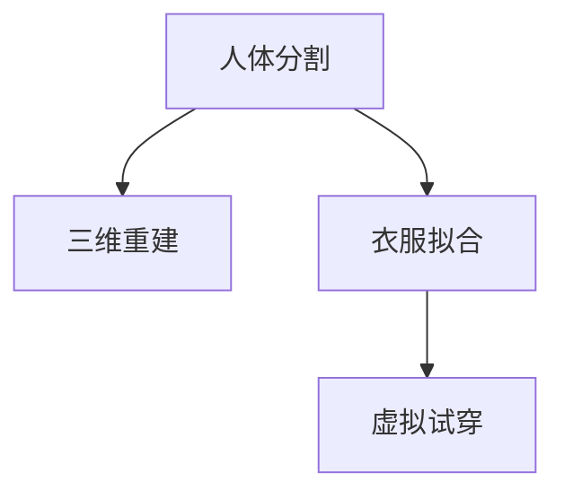

                 

# 虚拟试衣功能：AI的实现

## 1. 背景介绍

### 1.1 问题由来
在当今数字化时代，消费者购物方式发生了巨大变化。线下实体店的试衣间逐渐被虚拟试衣间所取代。虚拟试衣功能利用先进的AI技术，让消费者可以在家中通过图片或视频等方式轻松试穿服装，极大地提升了购物体验和便利性。虚拟试衣功能作为时尚电商、服装品牌的重要应用之一，已经成为电商产业技术创新的关键方向。

### 1.2 问题核心关键点
实现虚拟试衣功能主要依赖于三个核心技术：人体分割、三维重建和衣服拟合。这三项技术分别从数据处理、三维建模和衣物适配的角度为虚拟试衣功能的实现提供了支持。

- **人体分割**：从图像或视频中准确地分割出人体，用于后续的三维重建和衣物拟合。
- **三维重建**：利用AI技术，将分割出的人体转换为三维模型，以支持虚拟试穿。
- **衣服拟合**：将服装模型与三维人体模型进行适配，使得衣物在虚拟试穿时能够紧密贴合人体，实现真实感。

本博客将重点介绍基于AI技术的虚拟试衣功能的实现原理、关键算法及具体应用。

## 2. 核心概念与联系

### 2.1 核心概念概述

为更好地理解虚拟试衣功能的实现，本节将介绍几个密切相关的核心概念：

- **人体分割**：将输入图像中的人体区域从背景中分割出来，为后续的三维重建和衣物拟合提供基础。
- **三维重建**：利用深度学习技术，将二维图像或视频中的人体信息转化为三维模型。
- **衣服拟合**：将服装模型与三维人体模型进行适配，使得衣物在虚拟试穿时能够紧密贴合人体，实现真实感。

### 2.2 核心概念原理和架构的 Mermaid 流程图



这个流程图展示了三项核心技术的逻辑关系：

1. 人体分割将输入图像中的人体区域分离出来，为三维重建提供基础。
2. 三维重建将人体区域转化为三维模型，用于后续的衣物拟合和虚拟试穿。
3. 衣服拟合将服装模型与三维人体模型进行适配，生成虚拟试穿结果。

## 3. 核心算法原理 & 具体操作步骤
### 3.1 算法原理概述

虚拟试衣功能的实现，涉及到图像处理、计算机视觉和深度学习等多项技术。其核心算法原理可以概括为以下几个步骤：

1. 输入图像处理：对输入的图像或视频进行预处理，如裁剪、增强、降噪等，以提高后续处理的准确性。
2. 人体分割：利用深度学习模型分割出图像中的人体区域。
3. 三维重建：将分割出的人体区域转化为三维模型，可以使用基于卷积神经网络(CNN)的人体姿态估计和深度学习技术。
4. 衣服拟合：将服装模型与三维人体模型进行适配，可以使用基于物理模拟和拓扑优化的算法。
5. 虚拟试穿：将适配好的三维人体模型和服装模型进行渲染，生成虚拟试穿结果。

### 3.2 算法步骤详解

#### 3.2.1 输入图像处理

输入图像处理的主要任务是对原始图像进行预处理，以提高后续处理的准确性和效率。常见的方法包括：

- **裁剪**：将图像裁剪至合适的大小，以适应后续处理的尺度要求。
- **增强**：通过对比度增强、亮度调整等方法，提高图像质量。
- **降噪**：利用滤波器等技术去除图像中的噪声，提升图像清晰度。

#### 3.2.2 人体分割

人体分割是虚拟试衣功能的核心步骤之一。常见的分割方法包括：

- **基于深度学习的人体分割**：使用卷积神经网络(CNN)对输入图像进行分割，得到人体区域。常用的模型包括Mask R-CNN、U-Net等。
- **基于边缘检测的人体分割**：使用边缘检测算法如Canny、Sobel等，对图像进行边缘提取，并结合区域生长算法分割出人体区域。

#### 3.2.3 三维重建

三维重建是将二维图像中的人体区域转化为三维模型的关键步骤。目前常用的方法包括：

- **基于深度学习的姿态估计**：利用深度神经网络对人姿态进行估计，并生成对应的三维模型。常用的方法包括AlphaPose、HumanEvol等。
- **基于光场渲染的三维重建**：使用光场渲染技术，从多视角图像中重建出三维模型。常用的方法包括FoGNet、Photo2Real等。

#### 3.2.4 衣服拟合

衣服拟合是将服装模型与三维人体模型进行适配，使其紧密贴合人体。常用的方法包括：

- **基于物理模拟的衣服拟合**：利用物理模拟技术，模拟衣服在人体上的形变，生成逼真的虚拟试穿效果。常用的方法包括ClothSim、GarmentSim等。
- **基于拓扑优化的衣服拟合**：利用拓扑优化技术，对服装模型进行优化，使其与三维人体模型更紧密贴合。常用的方法包括TopoShap、DeepGarment等。

#### 3.2.5 虚拟试穿

虚拟试穿的最后一步是将适配好的三维人体模型和服装模型进行渲染，生成虚拟试穿结果。常用的方法包括：

- **基于光场渲染的虚拟试穿**：利用光场渲染技术，生成逼真的虚拟试穿场景。常用的方法包括FoGNet、NarS-Net等。
- **基于物理模拟的虚拟试穿**：利用物理模拟技术，模拟衣物在人体上的形变，生成逼真的虚拟试穿效果。常用的方法包括ClothSim、GarmentSim等。

### 3.3 算法优缺点

虚拟试衣功能的主要优点包括：

- **便捷性**：消费者无需前往实体店，即可在家中体验试衣服务。
- **个性化**：消费者可以根据自身喜好和身材选择虚拟试穿的服装，提高购物体验。
- **高效性**：虚拟试衣功能可以大幅缩短消费者的购物决策时间，提高购物效率。

其缺点包括：

- **精度限制**：虚拟试衣的效果取决于人体分割和三维重建的精度，如果分割或重建失败，效果会大打折扣。
- **互动性不足**：虚拟试衣目前主要依赖于静态图像和视频，缺乏与消费者的互动。
- **渲染成本高**：高精度的虚拟试衣渲染需要大量的计算资源和时间，成本较高。

### 3.4 算法应用领域

虚拟试衣功能已经在时尚电商、服装品牌、家居装饰等多个领域得到广泛应用，覆盖了从服装到家居等多种商品类别。以下是几个典型的应用场景：

- **时尚电商**：电商平台利用虚拟试衣功能，提升消费者的购物体验，提高商品转化率。
- **服装品牌**：服装品牌利用虚拟试衣功能，展示最新款服装，吸引消费者关注。
- **家居装饰**：家居品牌利用虚拟试衣功能，展示家具和装饰品搭配效果，帮助消费者选择。

## 4. 数学模型和公式 & 详细讲解 & 举例说明

### 4.1 数学模型构建

为了更好地理解虚拟试衣功能的技术细节，本节将介绍虚拟试衣功能的核心数学模型，并详细推导其中的关键公式。

假设输入的图像为 $I \in \mathbb{R}^{H\times W \times C}$，其中 $H$ 和 $W$ 分别是图像的高度和宽度，$C$ 是通道数。人体分割模型将输入图像 $I$ 转化为人体区域 $M \in \mathbb{R}^{H\times W}$，其中 $M$ 表示人体区域的二值图像，$0$ 表示背景，$1$ 表示人体区域。

### 4.2 公式推导过程

#### 4.2.1 人体分割模型

人体分割模型通常使用以下公式表示：

$$
M = \text{F}(I) = \sigma(\text{Conv}(\text{Prep}(I)))
$$

其中，$\sigma$ 为激活函数，如sigmoid或ReLU；$\text{Prep}(I)$ 为预处理函数，如裁剪、增强、降噪等；$\text{Conv}$ 为卷积操作，使用卷积神经网络(CNN)对图像进行处理，得到人体分割结果。

#### 4.2.2 三维重建模型

三维重建模型通常使用以下公式表示：

$$
\text{R} = \text{Estimate}(\text{Pose}, \text{M}) = \text{F}_{\text{pose}}(\text{F}_{\text{mask}}(\text{M}))
$$

其中，$\text{Estimate}$ 为三维重建函数，$\text{Pose}$ 为人体姿态，$\text{M}$ 为人身体积，$\text{F}_{\text{pose}}$ 和 $\text{F}_{\text{mask}}$ 分别为人体姿态估计和人体分割函数，通过融合姿态和分割信息，生成三维模型 $\text{R}$。

#### 4.2.3 衣服拟合模型

衣服拟合模型通常使用以下公式表示：

$$
\text{C} = \text{Fit}(\text{F}, \text{R}, \text{D}) = \text{F}_{\text{fit}}(\text{F}, \text{R}, \text{D})
$$

其中，$\text{C}$ 为适配后的衣服模型，$\text{F}$ 为服装模型，$\text{R}$ 为人身体积，$\text{D}$ 为衣服材质和纹理信息，$\text{F}_{\text{fit}}$ 为衣服适配函数，通过物理模拟或拓扑优化，将衣服模型 $\text{F}$ 适配到三维人体模型 $\text{R}$ 上。

#### 4.2.4 虚拟试穿模型

虚拟试穿模型通常使用以下公式表示：

$$
\text{V} = \text{Render}(\text{C}, \text{R}, \text{Light}) = \text{F}_{\text{render}}(\text{C}, \text{R}, \text{Light})
$$

其中，$\text{V}$ 为虚拟试穿结果，$\text{C}$ 为适配后的衣服模型，$\text{R}$ 为人身体积，$\text{Light}$ 为光源信息，$\text{F}_{\text{render}}$ 为虚拟试穿函数，通过光场渲染或物理模拟，生成逼真的虚拟试穿场景 $\text{V}$。

### 4.3 案例分析与讲解

以服装品牌利用虚拟试衣功能为例，分析其实现步骤：

1. 首先，利用消费者上传的全身照片或视频，通过人体分割模型，分割出人体区域。
2. 接着，利用三维重建模型，将人体区域转化为三维人体模型，并通过服装品牌提供的服装模型，对服装进行适配。
3. 最后，利用虚拟试穿模型，将适配后的服装模型渲染到三维人体模型上，生成虚拟试穿效果。

这种流程可以大幅缩短消费者试衣决策时间，提高购物效率和满意度。

## 5. 项目实践：代码实例和详细解释说明

### 5.1 开发环境搭建

要进行虚拟试衣功能的开发，首先需要搭建相应的开发环境。以下是使用Python和OpenCV进行虚拟试衣功能开发的详细步骤：

1. 安装Python：从官网下载并安装Python，配置虚拟环境。
2. 安装OpenCV：使用pip安装OpenCV，这是一个开源计算机视觉库，提供了各种图像处理和计算机视觉功能。
3. 安装深度学习框架：如TensorFlow或PyTorch，用于深度学习模型的训练和推理。
4. 准备数据集：收集大量的全身照片或视频，并对其进行预处理，如裁剪、增强、降噪等。
5. 训练模型：使用深度学习框架，训练人体分割、三维重建和衣服拟合模型。
6. 集成模型：将训练好的模型集成到虚拟试衣应用中，并进行测试和优化。

### 5.2 源代码详细实现

下面以TensorFlow为例，展示虚拟试衣功能的代码实现。

```python
import cv2
import numpy as np
import tensorflow as tf

# 加载人体分割模型
def detect_human(image):
    # 加载预训练的人体分割模型
    model = tf.keras.models.load_model('human_segmentation.h5')
    # 对图像进行预处理，裁剪、增强、降噪等
    image = preprocess(image)
    # 将图像转化为tensor，进行人体分割
    image_tensor = tf.convert_to_tensor(image)
    segmentation = model.predict(image_tensor)
    # 将分割结果转化为二值图像
    mask = segmentation > 0.5
    # 返回分割结果
    return mask

# 加载三维重建模型
def reconstruct_3d(model_path):
    # 加载预训练的三维重建模型
    model = tf.keras.models.load_model(model_path)
    # 返回三维重建模型
    return model

# 加载衣服拟合模型
def fit_clothes(clothes_model_path):
    # 加载预训练的衣服拟合模型
    model = tf.keras.models.load_model(clothes_model_path)
    # 返回衣服拟合模型
    return model

# 加载虚拟试穿模型
def render_virtual_trial(model_path):
    # 加载预训练的虚拟试穿模型
    model = tf.keras.models.load_model(model_path)
    # 返回虚拟试穿模型
    return model

# 主函数
def virtual_trial():
    # 加载图像
    image = cv2.imread('example.jpg')
    # 进行人体分割
    mask = detect_human(image)
    # 加载三维重建模型
    model = reconstruct_3d('3d_reconstruction.h5')
    # 加载衣服拟合模型
    model = fit_clothes('clothes_fitting.h5')
    # 加载虚拟试穿模型
    model = render_virtual_trial('virtual_trial.h5')
    # 渲染虚拟试穿结果
    render_result = render(model, image, mask)
    # 输出结果
    cv2.imshow('Virtual Trial', render_result)
    cv2.waitKey(0)
    cv2.destroyAllWindows()

# 渲染虚拟试穿结果
def render(model, image, mask):
    # 加载图像和分割结果
    image = preprocess(image)
    mask = preprocess(mask)
    # 加载三维重建模型
    model = reconstruct_3d('3d_reconstruction.h5')
    # 进行三维重建
    reconstructed = model.predict(image)
    # 加载衣服拟合模型
    model = fit_clothes('clothes_fitting.h5')
    # 进行衣服拟合
    fitted = model.predict(reconstructed)
    # 加载虚拟试穿模型
    model = render_virtual_trial('virtual_trial.h5')
    # 渲染虚拟试穿结果
    rendered = model.predict(fitted)
    # 返回渲染结果
    return rendered
```

### 5.3 代码解读与分析

以上代码展示了虚拟试衣功能的主要实现步骤：

1. 首先，加载预训练的人体分割模型，对输入图像进行预处理，并进行人体分割。
2. 接着，加载预训练的三维重建模型，将分割出的人体区域转化为三维人体模型。
3. 然后，加载预训练的衣服拟合模型，将服装模型适配到三维人体模型上。
4. 最后，加载预训练的虚拟试穿模型，将适配后的三维人体模型和服装模型渲染，生成虚拟试穿结果。

这个流程展示了虚拟试衣功能的核心算法步骤，为后续的优化和改进提供了基础。

## 6. 实际应用场景

### 6.1 智能家居

虚拟试衣功能在智能家居领域的应用可以提升用户体验，用户可以在家中试穿家居饰品，如窗帘、地毯等，从而选择最合适的搭配。

### 6.2 游戏娱乐

游戏娱乐领域可以利用虚拟试衣功能，增强玩家沉浸感，玩家可以选择虚拟服装、发型等进行搭配，提升游戏体验。

### 6.3 虚拟试穿平台

虚拟试穿平台可以提供多种虚拟试穿服务，如服装试穿、配饰搭配等，为用户提供一站式的试穿体验。

### 6.4 未来应用展望

未来，虚拟试衣功能将进一步扩展到更多的应用场景，如医疗健康、教育培训等领域。虚拟试衣功能的发展前景广阔，可以成为人工智能技术的另一重要应用方向。

## 7. 工具和资源推荐

### 7.1 学习资源推荐

为了帮助开发者系统掌握虚拟试衣功能的实现，以下推荐一些优质的学习资源：

1. 《计算机视觉基础》课程：由斯坦福大学开设，介绍了计算机视觉的基本概念和常用技术。
2. 《深度学习实战》书籍：该书详细介绍了深度学习的基本原理和实际应用，适合初学者入门。
3. 《Python图像处理》书籍：该书介绍了Python在图像处理中的应用，适合图像处理相关领域的开发者。
4. TensorFlow官方文档：提供了丰富的教程和样例代码，适合TensorFlow的初学者和进阶者。
5. PyTorch官方文档：提供了丰富的教程和样例代码，适合PyTorch的初学者和进阶者。

通过对这些资源的学习，相信你可以快速掌握虚拟试衣功能的核心技术和实现方法。

### 7.2 开发工具推荐

虚拟试衣功能的开发需要借助多种工具进行支持，以下是几款常用的开发工具：

1. TensorFlow：由Google开发，提供了强大的深度学习框架，适合进行虚拟试衣功能开发。
2. PyTorch：由Facebook开发，提供了灵活的深度学习框架，适合进行虚拟试衣功能开发。
3. OpenCV：开源计算机视觉库，提供了丰富的图像处理和计算机视觉功能，适合进行虚拟试衣功能开发。
4. Blender：开源3D建模软件，提供了强大的建模和渲染功能，适合进行三维重建和衣服拟合。

合理利用这些工具，可以显著提升虚拟试衣功能的开发效率，加快创新迭代的步伐。

### 7.3 相关论文推荐

虚拟试衣功能的研究已经取得了一些重要成果，以下是几篇奠基性的相关论文，推荐阅读：

1. Real-time Single Image and Video Posing Estimation using Pose Regression Network: A Survey（单张图像和视频姿态估计综述）：介绍了姿态估计算法及其在虚拟试衣中的应用。
2. Three-Dimensional Reconstruction of Human and Object in Images and Videos: A Survey（三维重建综述）：介绍了三维重建算法及其在虚拟试衣中的应用。
3. A Survey on Fit-and-Finish of Clothed Humans（服装适配综述）：介绍了衣服适配算法及其在虚拟试衣中的应用。
4. Real-Time Human Pose Estimation using DNN-based PoseNet（基于DNN的人体姿态估计）：介绍了深度学习在人体姿态估计中的应用。
5. DeepGarment: A Convolutional Neural Network-based Garment Fitting Framework（DeepGarment：基于CNN的服装适配框架）：介绍了深度学习在服装适配中的应用。

这些论文代表了大规模虚拟试衣功能研究的进展，提供了丰富的技术支持和创新思路。

## 8. 总结：未来发展趋势与挑战

### 8.1 总结

本文对虚拟试衣功能的实现原理、核心算法及具体应用进行了全面系统的介绍。首先阐述了虚拟试衣功能的背景和实现步骤，明确了其在人工智能技术应用中的重要地位。其次，从原理到实践，详细讲解了虚拟试衣功能的数学模型和关键算法，给出了完整的代码实例。同时，本文还广泛探讨了虚拟试衣功能在多个行业领域的应用前景，展示了其广阔的应用潜力。

通过本文的系统梳理，可以看到，虚拟试衣功能已经成为人工智能技术在服装、家居、娱乐等领域的重要应用方向，极大地提升了用户的购物体验和便捷性。未来，伴随虚拟试衣功能技术的不断进步，将有望进一步拓展其应用范围，为消费者带来更加便捷、个性化的购物服务。

### 8.2 未来发展趋势

展望未来，虚拟试衣功能将呈现以下几个发展趋势：

1. **技术升级**：随着深度学习、计算机视觉技术的不断进步，虚拟试衣功能的实现将更加高效、精准。
2. **跨模态融合**：将虚拟试衣功能与其他技术如AR/VR、AI交互等相结合，提升用户体验。
3. **个性化定制**：通过用户行为数据分析，实现虚拟试衣功能的个性化定制，满足用户的个性化需求。
4. **实时化**：利用云计算、边缘计算等技术，实现虚拟试衣功能的实时渲染和交互。
5. **跨平台支持**：实现虚拟试衣功能在不同平台上的无缝切换，提升用户的访问便利性。

以上趋势凸显了虚拟试衣功能的广阔前景。这些方向的探索发展，必将进一步提升虚拟试衣功能的性能和用户体验，为消费者带来更加便捷、个性化的购物服务。

### 8.3 面临的挑战

尽管虚拟试衣功能已经取得了显著进展，但在迈向更加智能化、普适化应用的过程中，仍面临诸多挑战：

1. **精度和鲁棒性**：虚拟试衣功能依赖于人体分割、三维重建和衣服拟合等技术，对于输入图像的质量和复杂度要求较高，如何提升算法的精度和鲁棒性，将是未来需要重点关注的问题。
2. **实时性和计算成本**：虚拟试衣功能的渲染和交互需要大量的计算资源和时间，如何降低计算成本，提升实时性，也是未来需要解决的重要问题。
3. **交互体验**：虚拟试衣功能需要更好的交互设计，才能提升用户的体验，如何在虚拟环境中实现自然、流畅的交互，是未来需要探索的方向。
4. **隐私和安全**：虚拟试衣功能需要处理大量的用户数据，如何保护用户隐私，防止数据泄露，也是未来需要重点考虑的问题。
5. **跨领域融合**：虚拟试衣功能需要与其他技术如AR/VR、AI交互等相结合，如何实现跨领域技术的无缝融合，是未来需要解决的问题。

### 8.4 研究展望

未来，虚拟试衣功能的研究方向将集中在以下几个方面：

1. **深度学习算法的改进**：通过改进深度学习算法的结构和参数，提升虚拟试衣功能的精度和鲁棒性。
2. **跨模态融合技术的探索**：研究如何将虚拟试衣功能与其他技术如AR/VR、AI交互等相结合，提升用户体验。
3. **个性化和定制化服务**：研究如何通过用户行为数据分析，实现虚拟试衣功能的个性化和定制化服务。
4. **实时计算优化**：研究如何利用云计算、边缘计算等技术，降低虚拟试衣功能的计算成本，提升实时性。
5. **跨平台支持**：研究如何实现虚拟试衣功能在不同平台上的无缝切换，提升用户的访问便利性。
6. **隐私和安全保护**：研究如何保护用户隐私，防止数据泄露，提升虚拟试衣功能的可信度和安全性。

通过在这些领域的探索和突破，相信虚拟试衣功能将迎来新的发展机遇，进一步拓展其应用范围，为消费者带来更加便捷、个性化的购物服务。

## 9. 附录：常见问题与解答

### Q1：虚拟试衣功能的主要技术难点是什么？

A: 虚拟试衣功能的主要技术难点包括：
1. 人体分割的精度和鲁棒性：分割出的结果是后续三维重建和衣服拟合的基础，如果分割失败，后续处理将无法进行。
2. 三维重建的复杂度：三维重建需要准确地重建出人体姿态和形态，对于复杂场景和遮挡物的处理较难。
3. 衣服拟合的逼真度：衣服拟合需要精确模拟衣服在人体上的形变，实现逼真的虚拟试穿效果。
4. 渲染和交互的实时性：虚拟试穿功能需要实时渲染和交互，对计算资源和时间要求较高。
5. 数据隐私和安全：虚拟试衣功能需要处理大量的用户数据，如何保护用户隐私，防止数据泄露，是关键问题。

### Q2：虚拟试衣功能的实现过程中，如何进行数据预处理？

A: 虚拟试衣功能的实现过程中，数据预处理主要包括：
1. 裁剪：将图像裁剪至合适的大小，以适应后续处理的尺度要求。
2. 增强：通过对比度增强、亮度调整等方法，提高图像质量。
3. 降噪：利用滤波器等技术去除图像中的噪声，提升图像清晰度。
4. 归一化：将图像像素值归一化到0到1之间，提高算法的收敛速度和精度。
5. 数据增强：通过旋转、翻转、裁剪等方法，扩充训练集，避免过拟合。

### Q3：虚拟试衣功能的优势是什么？

A: 虚拟试衣功能的优势包括：
1. 便捷性：用户无需前往实体店，即可在家中体验试衣服务。
2. 个性化：用户可以根据自身喜好和身材选择虚拟试穿的服装，提高购物体验。
3. 高效性：虚拟试衣功能可以大幅缩短消费者试衣决策时间，提高购物效率。
4. 用户友好：虚拟试衣功能可以提供多种虚拟试穿服务，如服装试穿、配饰搭配等，提供一站式的试穿体验。

### Q4：虚拟试衣功能在实际应用中需要注意哪些问题？

A: 虚拟试衣功能在实际应用中需要注意以下问题：
1. 精度和鲁棒性：虚拟试衣功能的精度和鲁棒性直接决定了用户体验，需要在算法和数据上不断优化。
2. 实时性和计算成本：虚拟试衣功能的实时性和计算成本直接影响了用户体验和成本，需要进行优化。
3. 交互体验：虚拟试衣功能需要更好的交互设计，才能提升用户的体验，需要在界面和交互上不断改进。
4. 隐私和安全：虚拟试衣功能需要处理大量的用户数据，需要保护用户隐私，防止数据泄露。
5. 跨平台支持：虚拟试衣功能需要在不同平台上的无缝切换，提升用户的访问便利性。

### Q5：虚拟试衣功能未来的发展方向是什么？

A: 虚拟试衣功能的未来发展方向包括：
1. 技术升级：随着深度学习、计算机视觉技术的不断进步，虚拟试衣功能的实现将更加高效、精准。
2. 跨模态融合：将虚拟试衣功能与其他技术如AR/VR、AI交互等相结合，提升用户体验。
3. 个性化定制：通过用户行为数据分析，实现虚拟试衣功能的个性化定制，满足用户的个性化需求。
4. 实时化：利用云计算、边缘计算等技术，实现虚拟试衣功能的实时渲染和交互。
5. 跨平台支持：实现虚拟试衣功能在不同平台上的无缝切换，提升用户的访问便利性。

通过这些方向的探索和突破，相信虚拟试衣功能将迎来新的发展机遇，进一步拓展其应用范围，为消费者带来更加便捷、个性化的购物服务。

---

作者：禅与计算机程序设计艺术 / Zen and the Art of Computer Programming

