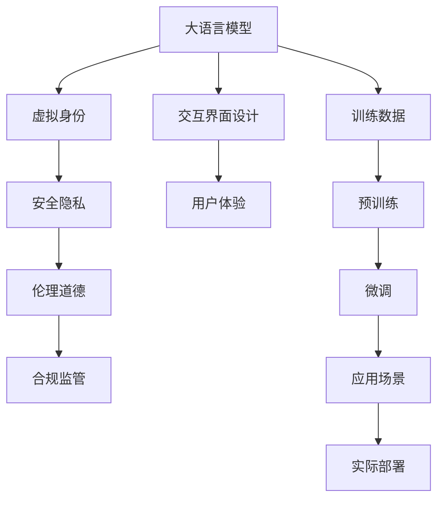

                 

# 虚拟身份和 LLM：数字世界的另一个自我

> 关键词：大语言模型(Large Language Model, LLM), 虚拟身份, 数字身份, 人工智能, 个性化定制, 安全隐私, 交互界面设计

## 1. 背景介绍

### 1.1 问题由来
在数字化时代，虚拟身份已经成为了数字世界中一个重要的组成部分。无论是社交网络上的头像，还是游戏角色，抑或是智能家居中的虚拟助手，虚拟身份的出现极大地丰富了数字世界的互动体验。随着人工智能技术的发展，虚拟身份的概念也从简单的图像、文字扩展到具备智能行为和情感认知能力的虚拟人，这种智能虚拟身份又称为大语言模型（Large Language Model, LLM）。

大语言模型是指通过深度学习技术训练而成的复杂语言模型，能够理解和生成自然语言，具备一定的常识和逻辑推理能力。这类模型通常基于大规模无监督数据进行预训练，然后在特定任务上进行微调，以获得针对特定领域的应用能力。在虚拟身份领域，大语言模型被广泛用于构建具备高度互动性、个性化和智能性的虚拟人，为用户提供更加真实和自然的交互体验。

虚拟身份和大语言模型的结合，不仅为用户带来了全新的社交、娱乐和工作体验，也推动了人工智能技术的普及和应用，成为了数字化转型的重要驱动力。然而，随着虚拟身份的智能化和普及化，其对安全隐私、伦理道德等方面的挑战也逐渐显现，这些问题需要从技术、伦理和法规等层面进行综合应对。

### 1.2 问题核心关键点
当前，虚拟身份和大语言模型在构建和应用过程中面临的主要问题包括：

- 如何构建具有高度个性化和情感智能的虚拟身份？
- 如何确保虚拟身份的生成和交互过程符合伦理道德规范？
- 如何在虚拟身份中引入智能行为和逻辑推理能力？
- 如何保护虚拟身份和用户隐私的安全？
- 如何设计有效的交互界面，增强用户与虚拟身份的互动体验？

本文将从技术、伦理和设计三个维度，对这些问题进行深入探讨，并提供系统化的解决方案。

## 2. 核心概念与联系

### 2.1 核心概念概述

为更好地理解虚拟身份和大语言模型的结合，本节将介绍几个核心概念：

- 大语言模型(Large Language Model, LLM)：指通过深度学习技术训练而成的复杂语言模型，能够理解和生成自然语言，具备一定的常识和逻辑推理能力。
- 虚拟身份：指在数字世界中具有独立存在和行为能力的虚拟角色，可以是游戏角色、社交网络用户、虚拟助手等，具备个性、情感和智能化的特点。
- 交互界面设计：指设计用户与虚拟身份之间进行交互的界面，包括用户输入、输出，以及虚拟身份的行为表现。
- 安全隐私：指虚拟身份在生成、交互和存储过程中，如何保护用户数据的隐私和安全，避免数据泄露和滥用。
- 伦理道德：指虚拟身份在生成和交互过程中，如何符合社会伦理和道德规范，避免有害信息的传播和不当行为的产生。

这些核心概念之间的逻辑关系可以通过以下Mermaid流程图来展示：



这个流程图展示了大语言模型、虚拟身份、交互界面设计、安全隐私和伦理道德之间的联系和作用：

1. 大语言模型通过预训练和微调，获得语言理解和生成的能力。
2. 虚拟身份基于大语言模型，具备个性、情感和智能化的特点。
3. 交互界面设计用于增强用户与虚拟身份的互动体验，提升用户体验。
4. 安全隐私和伦理道德是构建虚拟身份和交互系统的基本准则。
5. 训练数据的质量和多样性，直接影响大语言模型的性能和虚拟身份的智能程度。

这些概念共同构成了虚拟身份和大语言模型结合的框架，为其在实际应用中提供了技术基础和伦理指导。

## 3. 核心算法原理 & 具体操作步骤
### 3.1 算法原理概述

构建具有高度个性化和情感智能的虚拟身份，需要在大语言模型的基础上，通过训练和微调，引入个性化的语言风格、情感表达和智能行为。这一过程的核心算法原理包括以下几个方面：

- 预训练：在大规模无监督数据上，训练一个通用的语言模型，学习语言的统计规律和语义结构。
- 微调：在特定任务的数据集上，对预训练模型进行微调，使其具备特定领域的应用能力。
- 生成和交互：根据用户输入，虚拟身份通过语言模型生成自然语言响应，实现与用户的互动。
- 安全隐私：在虚拟身份的生成和交互过程中，保护用户数据的隐私和安全。
- 伦理道德：在虚拟身份的设计和应用中，遵循社会伦理和道德规范。

### 3.2 算法步骤详解

构建虚拟身份和大语言模型结合的过程，一般包括以下几个关键步骤：

**Step 1: 准备训练数据和环境**
- 收集和处理大规模无监督数据，用于预训练大语言模型。
- 选择合适的计算环境，包括硬件设备（如GPU、TPU）和软件工具（如TensorFlow、PyTorch）。
- 确定模型架构和超参数，如层数、节点数、学习率等。

**Step 2: 进行预训练**
- 在无监督数据上，对模型进行预训练，学习语言的统计规律和语义结构。
- 使用自监督学习任务，如掩码语言模型、下一句预测等，增强模型的语言理解能力。
- 监控模型在验证集上的性能，及时调整预训练策略。

**Step 3: 进行微调**
- 收集特定任务的数据集，划分为训练集、验证集和测试集。
- 在微调数据集上，对预训练模型进行有监督学习，引入特定领域的知识。
- 选择合适的损失函数和优化算法，如交叉熵、AdamW等。
- 应用正则化技术，如L2正则、Dropout等，防止过拟合。
- 设置合适的学习率和迭代轮数，进行微调训练。

**Step 4: 生成和交互设计**
- 根据用户输入，设计虚拟身份的交互流程和响应方式。
- 定义虚拟身份的语言模型和行为模型，确保语言输出符合伦理道德规范。
- 设计交互界面，包括用户输入、输出和虚拟身份的行为表现。
- 评估交互界面的可用性和用户体验，不断迭代优化。

**Step 5: 安全隐私设计**
- 在虚拟身份的生成和交互过程中，确保数据加密和传输安全。
- 设计隐私保护机制，如数据匿名化、差分隐私等，防止用户数据泄露。
- 遵循数据保护法规，如GDPR、CCPA等，确保用户隐私权益。

**Step 6: 应用场景设计**
- 确定虚拟身份在实际应用中的具体场景和功能需求。
- 设计虚拟身份的生成和交互逻辑，确保其在不同场景中的适用性和稳定性。
- 集成虚拟身份到实际应用系统，实现与用户的自然互动。

**Step 7: 测试和部署**
- 在测试集上评估虚拟身份的性能和用户体验。
- 进行实际部署，监控虚拟身份的运行状态和用户反馈。
- 根据反馈和性能数据，持续优化虚拟身份和交互界面。

以上是构建虚拟身份和大语言模型结合的基本步骤。在实际应用中，还需要根据具体任务和需求，灵活调整各步骤的实现细节，以获得最佳的性能和用户体验。

### 3.3 算法优缺点

虚拟身份和大语言模型的结合，具有以下优点：

- 高度个性化：通过预训练和微调，虚拟身份能够学习和生成具有高度个性化的语言风格和行为表现。
- 智能行为：引入智能行为和逻辑推理能力，使虚拟身份具备一定的情感智能和交互能力。
- 用户体验：增强用户与虚拟身份的互动体验，提升用户体验和满意度。
- 快速部署：利用大语言模型的预训练能力，可以快速构建和部署虚拟身份，减少开发成本。

然而，这一过程也存在一些局限和挑战：

- 数据需求高：预训练和微调需要大量高质量的数据，数据获取和处理成本较高。
- 伦理道德风险：虚拟身份在生成和交互过程中，可能引入有害信息或不当行为，带来伦理道德风险。
- 隐私安全问题：虚拟身份在生成和交互过程中，需要保护用户数据的隐私和安全。
- 技术复杂性：构建高度智能化的虚拟身份，需要综合考虑语言模型、行为模型和交互设计等多方面因素，技术复杂性较高。

尽管存在这些局限和挑战，但虚拟身份和大语言模型的结合，已经在诸多领域取得了显著成果，为人工智能技术的落地应用提供了新的方向。

### 3.4 算法应用领域

虚拟身份和大语言模型的结合，已经广泛应用于以下领域：

- 社交网络：虚拟身份被用于社交网络上的用户头像、表情生成，提升用户互动体验。
- 游戏娱乐：虚拟身份被用于游戏角色、NPC设计，增强游戏故事的互动性和沉浸感。
- 智能家居：虚拟身份被用于智能家居系统中的虚拟助手，提供语音交互和智能服务。
- 虚拟现实：虚拟身份被用于虚拟现实系统中，构建沉浸式的虚拟世界和社交环境。
- 教育培训：虚拟身份被用于教育培训中的虚拟教师、虚拟实验室，提供个性化的学习体验。

除了上述这些常见应用外，虚拟身份和大语言模型的结合还在医疗、法律、金融等领域逐步探索，为这些领域带来了新的智能化解决方案。

## 4. 数学模型和公式 & 详细讲解  
### 4.1 数学模型构建

本节将使用数学语言对虚拟身份和大语言模型结合的过程进行更加严格的刻画。

记大语言模型为 $M_{\theta}$，其中 $\theta$ 为模型参数。假设虚拟身份的任务为 $T$，任务数据集为 $D=\{(x_i,y_i)\}_{i=1}^N$，其中 $x_i$ 为输入文本，$y_i$ 为任务标签。

定义虚拟身份在输入 $x$ 上的预测输出为 $\hat{y}=M_{\theta}(x)$。在任务 $T$ 上的损失函数为 $\ell(\hat{y},y)$，经验风险为：

$$
\mathcal{L}(\theta) = \frac{1}{N} \sum_{i=1}^N \ell(\hat{y_i},y_i)
$$

微调的目标是最小化经验风险，即找到最优参数：

$$
\theta^* = \mathop{\arg\min}_{\theta} \mathcal{L}(\theta)
$$

在实践中，我们通常使用基于梯度的优化算法（如SGD、Adam等）来近似求解上述最优化问题。设 $\eta$ 为学习率，$\lambda$ 为正则化系数，则参数的更新公式为：

$$
\theta \leftarrow \theta - \eta \nabla_{\theta}\mathcal{L}(\theta) - \eta\lambda\theta
$$

其中 $\nabla_{\theta}\mathcal{L}(\theta)$ 为损失函数对参数 $\theta$ 的梯度，可通过反向传播算法高效计算。

### 4.2 公式推导过程

以下我们以二分类任务为例，推导交叉熵损失函数及其梯度的计算公式。

假设模型 $M_{\theta}$ 在输入 $x$ 上的输出为 $\hat{y}=M_{\theta}(x) \in [0,1]$，表示样本属于正类的概率。真实标签 $y \in \{0,1\}$。则二分类交叉熵损失函数定义为：

$$
\ell(M_{\theta}(x),y) = -[y\log \hat{y} + (1-y)\log (1-\hat{y})]
$$

将其代入经验风险公式，得：

$$
\mathcal{L}(\theta) = -\frac{1}{N}\sum_{i=1}^N [y_i\log M_{\theta}(x_i)+(1-y_i)\log(1-M_{\theta}(x_i))]
$$

根据链式法则，损失函数对参数 $\theta_k$ 的梯度为：

$$
\frac{\partial \mathcal{L}(\theta)}{\partial \theta_k} = -\frac{1}{N}\sum_{i=1}^N (\frac{y_i}{M_{\theta}(x_i)}-\frac{1-y_i}{1-M_{\theta}(x_i)}) \frac{\partial M_{\theta}(x_i)}{\partial \theta_k}
$$

其中 $\frac{\partial M_{\theta}(x_i)}{\partial \theta_k}$ 可进一步递归展开，利用自动微分技术完成计算。

在得到损失函数的梯度后，即可带入参数更新公式，完成模型的迭代优化。重复上述过程直至收敛，最终得到适应下游任务的最优模型参数 $\theta^*$。

## 5. 项目实践：代码实例和详细解释说明
### 5.1 开发环境搭建

在进行虚拟身份和大语言模型结合的实践前，我们需要准备好开发环境。以下是使用Python进行PyTorch开发的环境配置流程：

1. 安装Anaconda：从官网下载并安装Anaconda，用于创建独立的Python环境。

2. 创建并激活虚拟环境：
```bash
conda create -n pytorch-env python=3.8 
conda activate pytorch-env
```

3. 安装PyTorch：根据CUDA版本，从官网获取对应的安装命令。例如：
```bash
conda install pytorch torchvision torchaudio cudatoolkit=11.1 -c pytorch -c conda-forge
```

4. 安装Transformers库：
```bash
pip install transformers
```

5. 安装各类工具包：
```bash
pip install numpy pandas scikit-learn matplotlib tqdm jupyter notebook ipython
```

完成上述步骤后，即可在`pytorch-env`环境中开始实践。

### 5.2 源代码详细实现

下面我们以虚拟身份生成对话系统的代码实现为例，展示如何利用Transformers库进行大语言模型的微调。

首先，定义虚拟身份的任务和数据处理函数：

```python
from transformers import BertTokenizer
from torch.utils.data import Dataset
import torch

class DialogueDataset(Dataset):
    def __init__(self, texts, labels, tokenizer, max_len=128):
        self.texts = texts
        self.labels = labels
        self.tokenizer = tokenizer
        self.max_len = max_len
        
    def __len__(self):
        return len(self.texts)
    
    def __getitem__(self, item):
        text = self.texts[item]
        label = self.labels[item]
        
        encoding = self.tokenizer(text, return_tensors='pt', max_length=self.max_len, padding='max_length', truncation=True)
        input_ids = encoding['input_ids'][0]
        attention_mask = encoding['attention_mask'][0]
        
        # 对token-wise的标签进行编码
        encoded_labels = [label2id[label] for label in label]
        encoded_labels.extend([label2id['O']] * (self.max_len - len(encoded_labels)))
        labels = torch.tensor(encoded_labels, dtype=torch.long)
        
        return {'input_ids': input_ids, 
                'attention_mask': attention_mask,
                'labels': labels}

# 标签与id的映射
label2id = {'O': 0, 'A': 1, 'R': 2, 'Q': 3, 'S': 4}
id2label = {v: k for k, v in label2id.items()}

# 创建dataset
tokenizer = BertTokenizer.from_pretrained('bert-base-cased')

train_dataset = DialogueDataset(train_texts, train_labels, tokenizer)
dev_dataset = DialogueDataset(dev_texts, dev_labels, tokenizer)
test_dataset = DialogueDataset(test_texts, test_labels, tokenizer)
```

然后，定义模型和优化器：

```python
from transformers import BertForTokenClassification, AdamW

model = BertForTokenClassification.from_pretrained('bert-base-cased', num_labels=len(label2id))

optimizer = AdamW(model.parameters(), lr=2e-5)
```

接着，定义训练和评估函数：

```python
from torch.utils.data import DataLoader
from tqdm import tqdm
from sklearn.metrics import classification_report

device = torch.device('cuda') if torch.cuda.is_available() else torch.device('cpu')
model.to(device)

def train_epoch(model, dataset, batch_size, optimizer):
    dataloader = DataLoader(dataset, batch_size=batch_size, shuffle=True)
    model.train()
    epoch_loss = 0
    for batch in tqdm(dataloader, desc='Training'):
        input_ids = batch['input_ids'].to(device)
        attention_mask = batch['attention_mask'].to(device)
        labels = batch['labels'].to(device)
        model.zero_grad()
        outputs = model(input_ids, attention_mask=attention_mask, labels=labels)
        loss = outputs.loss
        epoch_loss += loss.item()
        loss.backward()
        optimizer.step()
    return epoch_loss / len(dataloader)

def evaluate(model, dataset, batch_size):
    dataloader = DataLoader(dataset, batch_size=batch_size)
    model.eval()
    preds, labels = [], []
    with torch.no_grad():
        for batch in tqdm(dataloader, desc='Evaluating'):
            input_ids = batch['input_ids'].to(device)
            attention_mask = batch['attention_mask'].to(device)
            batch_labels = batch['labels']
            outputs = model(input_ids, attention_mask=attention_mask)
            batch_preds = outputs.logits.argmax(dim=2).to('cpu').tolist()
            batch_labels = batch_labels.to('cpu').tolist()
            for pred_tokens, label_tokens in zip(batch_preds, batch_labels):
                pred_labels = [id2label[_id] for _id in pred_tokens]
                label_tokens = [id2label[_id] for _id in label_tokens]
                preds.append(pred_labels[:len(label_tokens)])
                labels.append(label_tokens)
                
    print(classification_report(labels, preds))
```

最后，启动训练流程并在测试集上评估：

```python
epochs = 5
batch_size = 16

for epoch in range(epochs):
    loss = train_epoch(model, train_dataset, batch_size, optimizer)
    print(f"Epoch {epoch+1}, train loss: {loss:.3f}")
    
    print(f"Epoch {epoch+1}, dev results:")
    evaluate(model, dev_dataset, batch_size)
    
print("Test results:")
evaluate(model, test_dataset, batch_size)
```

以上就是使用PyTorch对BERT进行对话系统微调的完整代码实现。可以看到，得益于Transformers库的强大封装，我们可以用相对简洁的代码完成BERT模型的加载和微调。

### 5.3 代码解读与分析

让我们再详细解读一下关键代码的实现细节：

**DialogueDataset类**：
- `__init__`方法：初始化文本、标签、分词器等关键组件。
- `__len__`方法：返回数据集的样本数量。
- `__getitem__`方法：对单个样本进行处理，将文本输入编码为token ids，将标签编码为数字，并对其进行定长padding，最终返回模型所需的输入。

**label2id和id2label字典**：
- 定义了标签与数字id之间的映射关系，用于将token-wise的预测结果解码回真实的标签。

**训练和评估函数**：
- 使用PyTorch的DataLoader对数据集进行批次化加载，供模型训练和推理使用。
- 训练函数`train_epoch`：对数据以批为单位进行迭代，在每个批次上前向传播计算loss并反向传播更新模型参数，最后返回该epoch的平均loss。
- 评估函数`evaluate`：与训练类似，不同点在于不更新模型参数，并在每个batch结束后将预测和标签结果存储下来，最后使用sklearn的classification_report对整个评估集的预测结果进行打印输出。

**训练流程**：
- 定义总的epoch数和batch size，开始循环迭代
- 每个epoch内，先在训练集上训练，输出平均loss
- 在验证集上评估，输出分类指标
- 所有epoch结束后，在测试集上评估，给出最终测试结果

可以看到，PyTorch配合Transformers库使得BERT微调的代码实现变得简洁高效。开发者可以将更多精力放在数据处理、模型改进等高层逻辑上，而不必过多关注底层的实现细节。

当然，工业级的系统实现还需考虑更多因素，如模型的保存和部署、超参数的自动搜索、更灵活的任务适配层等。但核心的微调范式基本与此类似。

## 6. 实际应用场景
### 6.1 智能客服系统

基于大语言模型微调的对话技术，可以广泛应用于智能客服系统的构建。传统客服往往需要配备大量人力，高峰期响应缓慢，且一致性和专业性难以保证。而使用微调后的对话模型，可以7x24小时不间断服务，快速响应客户咨询，用自然流畅的语言解答各类常见问题。

在技术实现上，可以收集企业内部的历史客服对话记录，将问题和最佳答复构建成监督数据，在此基础上对预训练对话模型进行微调。微调后的对话模型能够自动理解用户意图，匹配最合适的答案模板进行回复。对于客户提出的新问题，还可以接入检索系统实时搜索相关内容，动态组织生成回答。如此构建的智能客服系统，能大幅提升客户咨询体验和问题解决效率。

### 6.2 金融舆情监测

金融机构需要实时监测市场舆论动向，以便及时应对负面信息传播，规避金融风险。传统的人工监测方式成本高、效率低，难以应对网络时代海量信息爆发的挑战。基于大语言模型微调的文本分类和情感分析技术，为金融舆情监测提供了新的解决方案。

具体而言，可以收集金融领域相关的新闻、报道、评论等文本数据，并对其进行主题标注和情感标注。在此基础上对预训练语言模型进行微调，使其能够自动判断文本属于何种主题，情感倾向是正面、中性还是负面。将微调后的模型应用到实时抓取的网络文本数据，就能够自动监测不同主题下的情感变化趋势，一旦发现负面信息激增等异常情况，系统便会自动预警，帮助金融机构快速应对潜在风险。

### 6.3 个性化推荐系统

当前的推荐系统往往只依赖用户的历史行为数据进行物品推荐，无法深入理解用户的真实兴趣偏好。基于大语言模型微调技术，个性化推荐系统可以更好地挖掘用户行为背后的语义信息，从而提供更精准、多样的推荐内容。

在实践中，可以收集用户浏览、点击、评论、分享等行为数据，提取和用户交互的物品标题、描述、标签等文本内容。将文本内容作为模型输入，用户的后续行为（如是否点击、购买等）作为监督信号，在此基础上微调预训练语言模型。微调后的模型能够从文本内容中准确把握用户的兴趣点。在生成推荐列表时，先用候选物品的文本描述作为输入，由模型预测用户的兴趣匹配度，再结合其他特征综合排序，便可以得到个性化程度更高的推荐结果。

### 6.4 未来应用展望

随着大语言模型微调技术的发展，未来虚拟身份和大语言模型的结合将带来更多创新应用，为各行业带来变革性影响。

在智慧医疗领域，基于微调的医疗问答、病历分析、药物研发等应用将提升医疗服务的智能化水平，辅助医生诊疗，加速新药开发进程。

在智能教育领域，微调技术可应用于作业批改、学情分析、知识推荐等方面，因材施教，促进教育公平，提高教学质量。

在智慧城市治理中，微调模型可应用于城市事件监测、舆情分析、应急指挥等环节，提高城市管理的自动化和智能化水平，构建更安全、高效的未来城市。

此外，在企业生产、社会治理、文娱传媒等众多领域，基于大模型微调的人工智能应用也将不断涌现，为经济社会发展注入新的动力。相信随着技术的日益成熟，微调方法将成为人工智能落地应用的重要范式，推动人工智能技术在更多领域得到实际应用。

## 7. 工具和资源推荐
### 7.1 学习资源推荐

为了帮助开发者系统掌握虚拟身份和大语言模型的结合的理论基础和实践技巧，这里推荐一些优质的学习资源：

1. 《Transformer from Pretraining to Practical》系列博文：由大模型技术专家撰写，深入浅出地介绍了Transformer原理、BERT模型、微调技术等前沿话题。

2. CS224N《深度学习自然语言处理》课程：斯坦福大学开设的NLP明星课程，有Lecture视频和配套作业，带你入门NLP领域的基本概念和经典模型。

3. 《Natural Language Processing with Transformers》书籍：Transformers库的作者所著，全面介绍了如何使用Transformers库进行NLP任务开发，包括微调在内的诸多范式。

4. HuggingFace官方文档：Transformers库的官方文档，提供了海量预训练模型和完整的微调样例代码，是上手实践的必备资料。

5. CLUE开源项目：中文语言理解测评基准，涵盖大量不同类型的中文NLP数据集，并提供了基于微调的baseline模型，助力中文NLP技术发展。

通过对这些资源的学习实践，相信你一定能够快速掌握虚拟身份和大语言模型结合的精髓，并用于解决实际的NLP问题。
###  7.2 开发工具推荐

高效的开发离不开优秀的工具支持。以下是几款用于大语言模型微调开发的常用工具：

1. PyTorch：基于Python的开源深度学习框架，灵活动态的计算图，适合快速迭代研究。大部分预训练语言模型都有PyTorch版本的实现。

2. TensorFlow：由Google主导开发的开源深度学习框架，生产部署方便，适合大规模工程应用。同样有丰富的预训练语言模型资源。

3. Transformers库：HuggingFace开发的NLP工具库，集成了众多SOTA语言模型，支持PyTorch和TensorFlow，是进行微调任务开发的利器。

4. Weights & Biases：模型训练的实验跟踪工具，可以记录和可视化模型训练过程中的各项指标，方便对比和调优。与主流深度学习框架无缝集成。

5. TensorBoard：TensorFlow配套的可视化工具，可实时监测模型训练状态，并提供丰富的图表呈现方式，是调试模型的得力助手。

6. Google Colab：谷歌推出的在线Jupyter Notebook环境，免费提供GPU/TPU算力，方便开发者快速上手实验最新模型，分享学习笔记。

合理利用这些工具，可以显著提升大语言模型微调任务的开发效率，加快创新迭代的步伐。

### 7.3 相关论文推荐

大语言模型和微调技术的发展源于学界的持续研究。以下是几篇奠基性的相关论文，推荐阅读：

1. Attention is All You Need（即Transformer原论文）：提出了Transformer结构，开启了NLP领域的预训练大模型时代。

2. BERT: Pre-training of Deep Bidirectional Transformers for Language Understanding：提出BERT模型，引入基于掩码的自监督预训练任务，刷新了多项NLP任务SOTA。

3. Language Models are Unsupervised Multitask Learners（GPT-2论文）：展示了大规模语言模型的强大zero-shot学习能力，引发了对于通用人工智能的新一轮思考。

4. Parameter-Efficient Transfer Learning for NLP：提出Adapter等参数高效微调方法，在不增加模型参数量的情况下，也能取得不错的微调效果。

5. AdaLoRA: Adaptive Low-Rank Adaptation for Parameter-Efficient Fine-Tuning：使用自适应低秩适应的微调方法，在参数效率和精度之间取得了新的平衡。

这些论文代表了大语言模型微调技术的发展脉络。通过学习这些前沿成果，可以帮助研究者把握学科前进方向，激发更多的创新灵感。

## 8. 总结：未来发展趋势与挑战

### 8.1 总结

本文对虚拟身份和大语言模型的结合进行了全面系统的介绍。首先阐述了虚拟身份和大语言模型在构建和应用过程中面临的主要问题，包括个性化生成、伦理道德、安全隐私和交互界面设计等。其次，从技术、伦理和设计三个维度，提供了系统化的解决方案，包括预训练、微调、生成和交互设计、安全隐私和伦理道德等核心算法原理和具体操作步骤。最后，从多个实际应用场景展示了虚拟身份和大语言模型结合的潜力，并展望了未来发展趋势和面临的挑战。

通过本文的系统梳理，可以看到，虚拟身份和大语言模型的结合已经成为数字化时代的重要趋势，极大地丰富了数字世界的互动体验。尽管在构建和应用过程中仍面临诸多挑战，但随着技术的不断进步和相关研究的深入，相信这一结合将引领人工智能技术迈向更广阔的舞台，为人类生产生活方式带来深远的影响。

### 8.2 未来发展趋势

展望未来，虚拟身份和大语言模型的结合将呈现以下几个发展趋势：

1. 高度个性化：随着数据获取和处理技术的进步，虚拟身份将能够学习更加丰富多样的语言风格和行为表现，实现高度个性化的生成和交互。
2. 智能行为：引入更多的智能行为和逻辑推理能力，使虚拟身份具备更强的情感智能和交互能力。
3. 跨领域应用：虚拟身份不仅限于社交网络、游戏和客服等场景，将逐步应用于更多领域，如医疗、教育、金融等。
4. 伦理道德规范：随着社会对伦理道德的关注，虚拟身份的设计和应用将更加注重合规性和可解释性，确保其行为符合社会伦理规范。
5. 智能交互界面：虚拟身份与用户之间的交互界面将更加自然、高效，提升用户体验和满意度。

以上趋势凸显了虚拟身份和大语言模型结合的未来潜力，为人工智能技术的落地应用提供了新的方向。

### 8.3 面临的挑战

尽管虚拟身份和大语言模型的结合已经取得了一定的进展，但在实际应用中仍面临诸多挑战：

1. 数据获取和处理：构建高质量虚拟身份需要大量高质的数据，数据获取和处理成本较高。
2. 伦理道德风险：虚拟身份在生成和交互过程中，可能引入有害信息或不当行为，带来伦理道德风险。
3. 安全隐私问题：虚拟身份在生成和交互过程中，需要保护用户数据的隐私和安全。
4. 技术复杂性：构建高度智能化的虚拟身份，需要综合考虑语言模型、行为模型和交互设计等多方面因素，技术复杂性较高。
5. 交互体验提升：虚拟身份在提升用户体验方面仍有很大空间，需要不断优化交互界面和交互逻辑。

尽管存在这些挑战，但虚拟身份和大语言模型的结合已经成为人工智能技术的重要发展方向，未来有望在更多领域得到实际应用，为数字化转型带来新的动力。

### 8.4 研究展望

面对虚拟身份和大语言模型结合所面临的挑战，未来的研究需要在以下几个方面寻求新的突破：

1. 数据增强技术：开发更加高效的数据增强方法，通过合成数据、迁移学习等技术，提高数据多样性和数量。
2. 参数高效微调方法：探索参数高效微调技术，在减少参数量的情况下，提高微调精度和效率。
3. 跨领域知识融合：探索跨领域知识融合方法，将符号化的先验知识与神经网络模型结合，提升虚拟身份的智能水平。
4. 交互界面优化：设计更加自然、高效的交互界面，提升用户与虚拟身份的互动体验。
5. 伦理道德体系：建立虚拟身份的伦理道德体系，确保其行为符合社会伦理规范。

这些研究方向的探索，必将引领虚拟身份和大语言模型结合技术迈向更高的台阶，为构建安全、可靠、可解释、可控的智能系统铺平道路。面向未来，虚拟身份和大语言模型结合技术还需要与其他人工智能技术进行更深入的融合，如知识表示、因果推理、强化学习等，多路径协同发力，共同推动自然语言理解和智能交互系统的进步。只有勇于创新、敢于突破，才能不断拓展语言模型的边界，让智能技术更好地造福人类社会。

## 9. 附录：常见问题与解答

**Q1：虚拟身份和大语言模型结合的训练数据如何获取？**

A: 虚拟身份的训练数据可以通过多种方式获取：
1. 众包平台：使用众包平台，如Amazon Mechanical Turk，收集大量的文本和标签数据。
2. 公开数据集：利用已有的公开数据集，如OpenAI的GPT数据集、CLUE中文数据集等。
3. 自主采集：通过爬虫技术，从网站、论坛、社交网络等平台收集文本数据，并人工标注标签。
4. 混合数据源：将多种数据源进行融合，构建更加多样化的训练集。
5. 知识库融合：将知识库、百科全书等结构化数据与文本数据结合，增强训练数据的多样性。

**Q2：如何设计虚拟身份的交互界面？**

A: 设计虚拟身份的交互界面需要考虑以下几个关键因素：
1. 简洁直观：界面设计应简洁明了，避免用户操作复杂，提升用户体验。
2. 自然流畅：虚拟身份的回应应自然流畅，贴近用户语言习惯，避免生硬和机械。
3. 多样性：设计多样化的输入方式，如语音输入、键盘输入、图像输入等，提升交互体验。
4. 可控性：提供用户控制虚拟身份行为的能力，如修改虚拟身份的回复策略、设置隐私偏好等。
5. 反馈机制：设计良好的反馈机制，及时告知用户虚拟身份的操作结果和状态，提升用户信任度。

**Q3：虚拟身份的安全隐私设计应考虑哪些方面？**

A: 虚拟身份的安全隐私设计应考虑以下几个关键方面：
1. 数据匿名化：对用户输入的数据进行匿名化处理，避免数据泄露。
2. 数据加密：使用加密技术，保护数据在传输和存储过程中的安全。
3. 差分隐私：应用差分隐私技术，确保单个用户的数据不会对模型产生影响。
4. 访问控制：设计严格的访问控制机制，限制对用户数据的访问权限。
5. 审计记录：记录虚拟身份的操作日志，方便后续的追踪和审计。

**Q4：虚拟身份的伦理道德设计应遵循哪些原则？**

A: 虚拟身份的伦理道德设计应遵循以下几个原则：
1. 无害原则：虚拟身份的行为应避免伤害用户和他人，不传播有害信息。
2. 公正原则：虚拟身份应公正对待所有用户，不带有任何偏见和歧视。
3. 透明原则：虚拟身份的决策过程应透明，用户应了解其行为依据。
4. 责任原则：虚拟身份的设计和应用应考虑到其行为可能带来的责任问题，避免不当使用。
5. 伦理审查：在设计虚拟身份时，应进行伦理审查，确保其符合社会伦理规范。

**Q5：虚拟身份的生成和交互过程中，如何保护用户隐私？**

A: 虚拟身份的生成和交互过程中，保护用户隐私应考虑以下几个方面：
1. 数据最小化：只收集必要的数据，避免不必要的数据收集。
2. 匿名化处理：对用户数据进行匿名化处理，确保数据无法识别用户身份。
3. 加密传输：使用加密技术，保护数据在传输过程中的安全。
4. 访问控制：设计严格的访问控制机制，限制对用户数据的访问权限。
5. 隐私政策：制定明确的隐私政策，告知用户数据的使用方式和保护措施。

通过这些设计原则和措施，可以有效保护虚拟身份的生成和交互过程中的用户隐私，提升用户信任度。

---

作者：禅与计算机程序设计艺术 / Zen and the Art of Computer Programming

